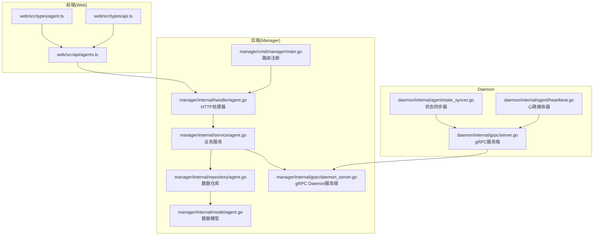
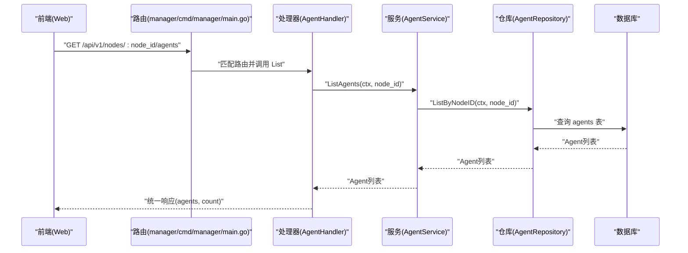
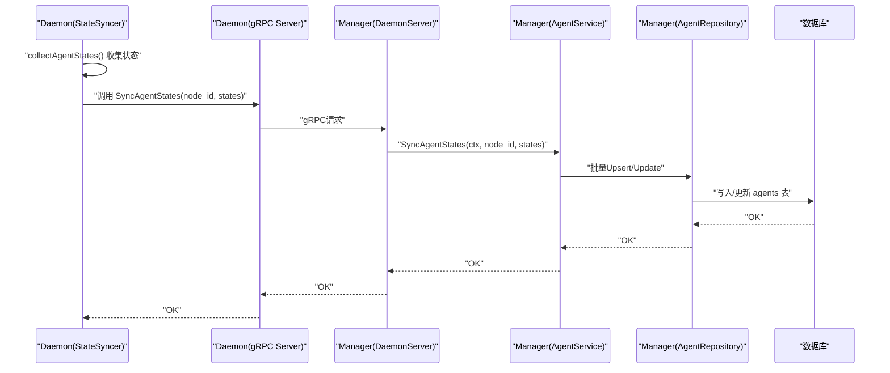
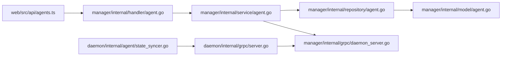

# Agent管理接口

<cite>
**本文引用的文件**
- [manager/internal/handler/agent.go](file://manager/internal/handler/agent.go)
- [manager/internal/service/agent.go](file://manager/internal/service/agent.go)
- [manager/internal/repository/agent.go](file://manager/internal/repository/agent.go)
- [manager/internal/model/agent.go](file://manager/internal/model/agent.go)
- [manager/internal/grpc/daemon_server.go](file://manager/internal/grpc/daemon_server.go)
- [daemon/internal/agent/state_syncer.go](file://daemon/internal/agent/state_syncer.go)
- [daemon/internal/agent/heartbeat.go](file://daemon/internal/agent/heartbeat.go)
- [daemon/internal/grpc/server.go](file://daemon/internal/grpc/server.go)
- [web/src/api/agents.ts](file://web/src/api/agents.ts)
- [web/src/types/agent.ts](file://web/src/types/agent.ts)
- [web/src/types/api.ts](file://web/src/types/api.ts)
- [manager/cmd/manager/main.go](file://manager/cmd/manager/main.go)
- [manager/test/integration/agent_api_test.go](file://manager/test/integration/agent_api_test.go)
</cite>

## 目录
1. [简介](#简介)
2. [项目结构](#项目结构)
3. [核心组件](#核心组件)
4. [架构总览](#架构总览)
5. [详细组件分析](#详细组件分析)
6. [依赖关系分析](#依赖关系分析)
7. [性能与可扩展性](#性能与可扩展性)
8. [故障排查指南](#故障排查指南)
9. [结论](#结论)
10. [附录](#附录)

## 简介
本文件面向运维平台的Agent管理接口，聚焦“通过节点ID查询其下所有Agent”的API，系统性说明：
- 路径参数 node_id 的使用与校验
- 响应数据结构中各字段的含义（状态、版本、PID、心跳等）
- 分页与筛选能力现状与建议
- 前端调用方式（TypeScript）与后端实现细节
- Agent状态同步机制与心跳更新频率

目标读者既包括前端开发者，也包括后端与运维工程师，帮助快速理解并正确使用该接口。

## 项目结构
围绕Agent管理接口的关键目录与文件如下：
- 后端（Manager）：HTTP路由、Handler、Service、Repository、Model、gRPC Daemon服务端
- 前端（Web）：API封装、类型定义
- Daemon：状态同步器、心跳接收器、gRPC服务端

图表来源
- [manager/cmd/manager/main.go](file://manager/cmd/manager/main.go#L153-L196)
- [manager/internal/handler/agent.go](file://manager/internal/handler/agent.go#L32-L60)
- [manager/internal/service/agent.go](file://manager/internal/service/agent.go#L141-L173)
- [manager/internal/repository/agent.go](file://manager/internal/repository/agent.go#L112-L124)
- [manager/internal/model/agent.go](file://manager/internal/model/agent.go#L9-L47)
- [manager/internal/grpc/daemon_server.go](file://manager/internal/grpc/daemon_server.go#L32-L69)
- [daemon/internal/agent/state_syncer.go](file://daemon/internal/agent/state_syncer.go#L70-L91)
- [daemon/internal/agent/heartbeat.go](file://daemon/internal/agent/heartbeat.go#L1-L122)
- [daemon/internal/grpc/server.go](file://daemon/internal/grpc/server.go#L172-L211)
- [web/src/api/agents.ts](file://web/src/api/agents.ts#L1-L57)
- [web/src/types/agent.ts](file://web/src/types/agent.ts#L1-L35)
- [web/src/types/api.ts](file://web/src/types/api.ts#L1-L55)

章节来源
- [manager/cmd/manager/main.go](file://manager/cmd/manager/main.go#L153-L196)
- [manager/internal/handler/agent.go](file://manager/internal/handler/agent.go#L32-L60)
- [web/src/api/agents.ts](file://web/src/api/agents.ts#L1-L57)

## 核心组件
- HTTP处理器（AgentHandler）：负责解析路径参数 node_id，调用服务层，返回统一响应。
- 业务服务（AgentService）：校验节点存在性，查询数据库，返回Agent列表；支持状态同步与操作转发。
- 数据仓库（AgentRepository）：按节点ID查询Agent列表。
- 数据模型（Agent）：定义Agent字段及索引。
- gRPC Daemon服务端（DaemonServer）：接收Daemon上报的状态，写入数据库。
- 前端API封装（agents.ts）：封装HTTP调用，暴露 listAgents、operateAgent、getAgentLogs 等方法。
- 类型定义（agent.ts、api.ts）：统一响应结构与Agent字段类型。

章节来源
- [manager/internal/handler/agent.go](file://manager/internal/handler/agent.go#L32-L60)
- [manager/internal/service/agent.go](file://manager/internal/service/agent.go#L141-L173)
- [manager/internal/repository/agent.go](file://manager/internal/repository/agent.go#L112-L124)
- [manager/internal/model/agent.go](file://manager/internal/model/agent.go#L9-L47)
- [manager/internal/grpc/daemon_server.go](file://manager/internal/grpc/daemon_server.go#L32-L69)
- [web/src/api/agents.ts](file://web/src/api/agents.ts#L1-L57)
- [web/src/types/agent.ts](file://web/src/types/agent.ts#L1-L35)
- [web/src/types/api.ts](file://web/src/types/api.ts#L1-L55)

## 架构总览
Agent管理接口的端到端流程如下：
- 前端调用 GET /api/v1/nodes/:node_id/agents
- 路由在 Manager 中注册，进入 AgentHandler.List
- Handler 校验 node_id，调用 AgentService.ListAgents
- Service 校验节点存在性，查询 AgentRepository.ListByNodeID
- 返回统一响应，包含 agents 数组与 count

图表来源
- [manager/cmd/manager/main.go](file://manager/cmd/manager/main.go#L153-L196)
- [manager/internal/handler/agent.go](file://manager/internal/handler/agent.go#L32-L60)
- [manager/internal/service/agent.go](file://manager/internal/service/agent.go#L141-L173)
- [manager/internal/repository/agent.go](file://manager/internal/repository/agent.go#L112-L124)

## 详细组件分析

### 路由与入口
- 路由注册位于 Manager 的 main.go，其中对 /api/v1/nodes/:node_id/agents 的 GET 请求绑定到 AgentHandler.List。
- Handler.List 从 Gin 的 c.Param("node_id") 获取路径参数，并进行非空校验。

章节来源
- [manager/cmd/manager/main.go](file://manager/cmd/manager/main.go#L153-L196)
- [manager/internal/handler/agent.go](file://manager/internal/handler/agent.go#L32-L60)

### 路径参数 node_id 的使用
- node_id 作为路径参数传入 Handler.List，随后传入 Service 层。
- Service 在查询前会先校验节点是否存在，若不存在返回对应错误。
- 前端调用通过 web/src/api/agents.ts 的 listAgents(nodeId) 方法发起请求。

章节来源
- [manager/internal/handler/agent.go](file://manager/internal/handler/agent.go#L32-L60)
- [manager/internal/service/agent.go](file://manager/internal/service/agent.go#L141-L173)
- [web/src/api/agents.ts](file://web/src/api/agents.ts#L17-L21)

### 响应数据结构与字段含义
- 统一响应结构：包含 code、message、data、timestamp（可选）。前端类型定义见 web/src/types/api.ts。
- Agent 列表响应：data.agents 为 Agent[]，data.count 为数量。
- Agent 字段（来自 web/src/types/agent.ts 与 manager/internal/model/agent.go）：
  - id：数据库自增主键
  - node_id：节点ID
  - agent_id：Agent唯一标识符
  - type：Agent类型（如 filebeat、telegraf、node_exporter）
  - version：Agent版本号
  - status：运行状态（running、stopped、error、starting、stopping）
  - config：JSON格式配置
  - pid：进程ID（0表示未运行）
  - last_heartbeat：心跳时间（ISO 8601）
  - last_sync_time：最后同步时间（ISO 8601）
  - created_at、updated_at：创建与更新时间（ISO 8601）

章节来源
- [web/src/types/api.ts](file://web/src/types/api.ts#L1-L55)
- [web/src/types/agent.ts](file://web/src/types/agent.ts#L1-L35)
- [manager/internal/model/agent.go](file://manager/internal/model/agent.go#L9-L47)

### 分页与筛选选项
- 当前实现未提供分页与筛选参数。Handler 与 Service 仅根据 node_id 查询，返回全量列表。
- 若需扩展，可在 Handler 层增加查询参数（如 page、page_size、status、type 等），并在 Service/Repository 层实现分页与过滤逻辑。

章节来源
- [manager/internal/handler/agent.go](file://manager/internal/handler/agent.go#L32-L60)
- [manager/internal/service/agent.go](file://manager/internal/service/agent.go#L141-L173)
- [manager/internal/repository/agent.go](file://manager/internal/repository/agent.go#L112-L124)

### 前端调用方式（TypeScript）
- listAgents(nodeId)：GET /api/v1/nodes/:node_id/agents
- operateAgent(nodeId, agentId, operation)：POST /api/v1/nodes/:node_id/agents/:agent_id/operate
- getAgentLogs(nodeId, agentId, lines?)：GET /api/v1/nodes/:node_id/agents/:agent_id/logs?lines=N

章节来源
- [web/src/api/agents.ts](file://web/src/api/agents.ts#L1-L57)
- [web/src/types/agent.ts](file://web/src/types/agent.ts#L1-L35)

### curl 示例
- 获取节点下所有Agent：
  - curl -H "Authorization: Bearer <token>" https://<host>/api/v1/nodes/<node_id>/agents
- 获取Agent日志（lines可选）：
  - curl -H "Authorization: Bearer <token>" https://<host>/api/v1/nodes/<node_id>/agents/<agent_id>/logs?lines=100

章节来源
- [manager/cmd/manager/main.go](file://manager/cmd/manager/main.go#L153-L196)
- [web/src/api/agents.ts](file://web/src/api/agents.ts#L1-L57)

### Agent状态同步机制与心跳更新频率
- Daemon 端：
  - StateSyncer 定期（默认30秒）收集Agent状态并上报 Manager。
  - HeartbeatReceiver 通过Unix Socket接收心跳，交由健康检查器处理。
- Manager 端：
  - DaemonServer 接收 Daemon 的 SyncAgentStates 请求，调用 AgentService.SyncAgentStates，将状态持久化到数据库。
- 心跳更新频率：
  - StateSyncer 默认同步间隔为30秒（可通过 SetSyncInterval 调整）。
  - HeartbeatReceiver 通过解码心跳包更新健康状态，具体频率取决于Daemon侧心跳发送策略。

图表来源
- [daemon/internal/agent/state_syncer.go](file://daemon/internal/agent/state_syncer.go#L70-L91)
- [daemon/internal/grpc/server.go](file://daemon/internal/grpc/server.go#L172-L211)
- [manager/internal/grpc/daemon_server.go](file://manager/internal/grpc/daemon_server.go#L32-L69)
- [manager/internal/service/agent.go](file://manager/internal/service/agent.go#L48-L139)
- [manager/internal/repository/agent.go](file://manager/internal/repository/agent.go#L93-L111)

章节来源
- [daemon/internal/agent/state_syncer.go](file://daemon/internal/agent/state_syncer.go#L70-L91)
- [daemon/internal/agent/heartbeat.go](file://daemon/internal/agent/heartbeat.go#L1-L122)
- [daemon/internal/grpc/server.go](file://daemon/internal/grpc/server.go#L172-L211)
- [manager/internal/grpc/daemon_server.go](file://manager/internal/grpc/daemon_server.go#L32-L69)
- [manager/internal/service/agent.go](file://manager/internal/service/agent.go#L48-L139)

## 依赖关系分析
- Handler 依赖 Service；Service 依赖 Repository 与 NodeRepository；Repository 依赖 GORM；Service 依赖 gRPC 客户端池以调用 Daemon。
- 前端通过 agents.ts 调用后端API，类型定义在 agent.ts 与 api.ts 中。

图表来源
- [web/src/api/agents.ts](file://web/src/api/agents.ts#L1-L57)
- [manager/internal/handler/agent.go](file://manager/internal/handler/agent.go#L32-L60)
- [manager/internal/service/agent.go](file://manager/internal/service/agent.go#L141-L173)
- [manager/internal/repository/agent.go](file://manager/internal/repository/agent.go#L112-L124)
- [manager/internal/model/agent.go](file://manager/internal/model/agent.go#L9-L47)
- [manager/internal/grpc/daemon_server.go](file://manager/internal/grpc/daemon_server.go#L32-L69)
- [daemon/internal/agent/state_syncer.go](file://daemon/internal/agent/state_syncer.go#L70-L91)
- [daemon/internal/grpc/server.go](file://daemon/internal/grpc/server.go#L172-L211)

章节来源
- [web/src/api/agents.ts](file://web/src/api/agents.ts#L1-L57)
- [manager/internal/handler/agent.go](file://manager/internal/handler/agent.go#L32-L60)
- [manager/internal/service/agent.go](file://manager/internal/service/agent.go#L141-L173)
- [manager/internal/repository/agent.go](file://manager/internal/repository/agent.go#L112-L124)
- [manager/internal/model/agent.go](file://manager/internal/model/agent.go#L9-L47)
- [manager/internal/grpc/daemon_server.go](file://manager/internal/grpc/daemon_server.go#L32-L69)
- [daemon/internal/agent/state_syncer.go](file://daemon/internal/agent/state_syncer.go#L70-L91)
- [daemon/internal/grpc/server.go](file://daemon/internal/grpc/server.go#L172-L211)

## 性能与可扩展性
- 当前实现按 node_id 直接查询，未分页，适合中小规模节点。若节点下Agent数量较多，建议：
  - 在 Handler 层引入分页参数（page/page_size），在 Service/Repository 层实现分页查询。
  - 在 Model 层为常用筛选字段（如 status、type）建立索引，优化查询性能。
- 状态同步默认30秒一次，可根据业务需求调整 StateSyncer 的同步间隔。
- 日志获取接口当前返回未实现错误，建议在后续版本中完善。

[本节为通用建议，不直接分析具体文件]

## 故障排查指南
- 常见错误与返回：
  - 节点不存在：返回对应错误码（参考集成测试对节点不存在的断言）。
  - 未授权：返回401，检查鉴权中间件与Token。
  - 无效节点ID：返回400，确认路径参数 node_id 是否为空。
  - Agent日志功能未实现：返回内部服务器错误提示。
- 建议排查步骤：
  - 确认路由已注册且处于认证后的API分组。
  - 检查 Service 层对节点存在性的校验与错误包装。
  - 查看 gRPC 连接池与 Daemon 地址配置。
  - 关注状态同步日志，确认 StateSyncer 是否正常工作。

章节来源
- [manager/test/integration/agent_api_test.go](file://manager/test/integration/agent_api_test.go#L301-L351)
- [manager/internal/handler/agent.go](file://manager/internal/handler/agent.go#L32-L60)
- [manager/internal/service/agent.go](file://manager/internal/service/agent.go#L254-L298)
- [manager/internal/grpc/daemon_server.go](file://manager/internal/grpc/daemon_server.go#L32-L69)
- [daemon/internal/agent/state_syncer.go](file://daemon/internal/agent/state_syncer.go#L226-L258)

## 结论
- 通过节点ID查询Agent列表的API已完整实现，路径参数 node_id 的校验与错误处理清晰。
- 响应结构统一，Agent字段含义明确，便于前端展示与二次开发。
- 状态同步与心跳更新频率可控，默认30秒同步一次，满足大多数场景。
- 当前未提供分页与筛选，建议在后续版本中按需扩展。

[本节为总结，不直接分析具体文件]

## 附录

### API定义与调用示例

- 获取节点下所有Agent
  - 方法：GET
  - 路径：/api/v1/nodes/:node_id/agents
  - 参数：node_id（路径参数，必填）
  - 响应：统一响应，data.agents 为 Agent 数组，data.count 为数量
  - 前端调用：listAgents(nodeId)
  - curl示例：curl -H "Authorization: Bearer <token>" https://<host>/api/v1/nodes/<node_id>/agents

- 操作Agent（启动/停止/重启）
  - 方法：POST
  - 路径：/api/v1/nodes/:node_id/agents/:agent_id/operate
  - 请求体：{ operation: "start" | "stop" | "restart" }
  - 前端调用：operateAgent(nodeId, agentId, operation)

- 获取Agent日志
  - 方法：GET
  - 路径：/api/v1/nodes/:node_id/agents/:agent_id/logs?lines=N
  - 参数：lines（可选，默认100，最大1000）
  - 前端调用：getAgentLogs(nodeId, agentId, lines?)

章节来源
- [manager/cmd/manager/main.go](file://manager/cmd/manager/main.go#L153-L196)
- [web/src/api/agents.ts](file://web/src/api/agents.ts#L1-L57)