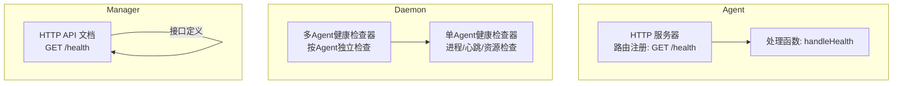
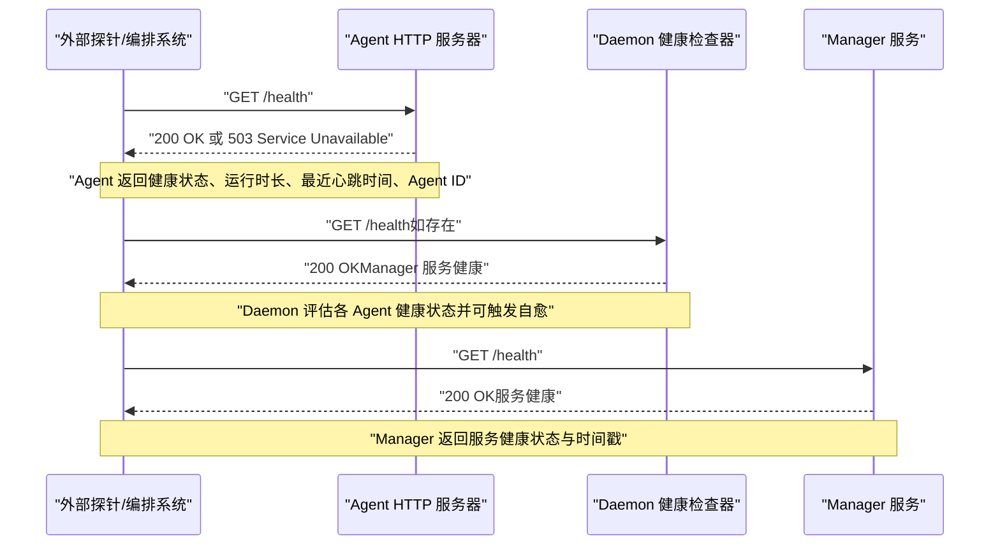
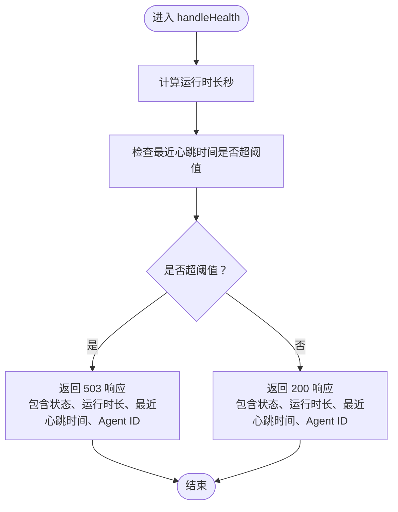
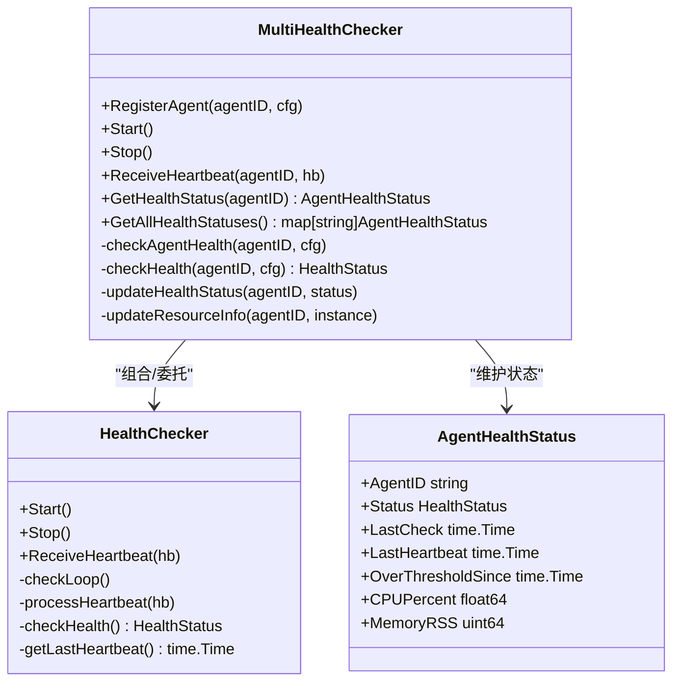
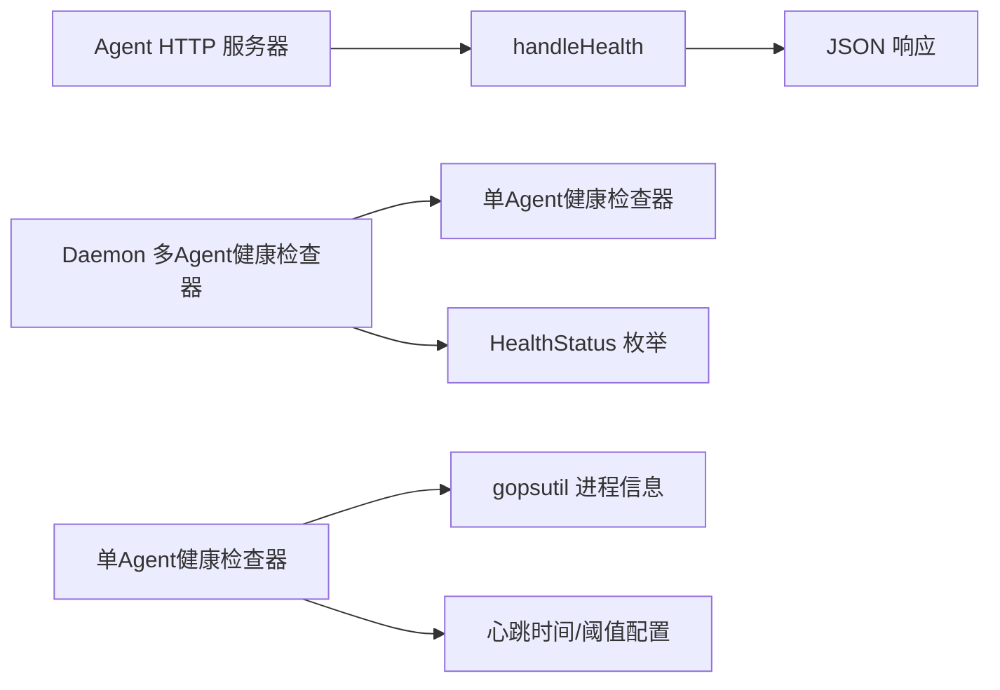

# 健康检查接口

<cite>
**本文引用的文件**
- [agent/internal/api/server.go](file://agent/internal/api/server.go)
- [agent/README.md](file://agent/README.md)
- [agent/docs/接口规范文档.md](file://agent/docs/接口规范文档.md)
- [docs/api/Manager_API.md](file://docs/api/Manager_API.md)
- [daemon/internal/agent/multi_health_checker.go](file://daemon/internal/agent/multi_health_checker.go)
- [daemon/internal/agent/health.go](file://daemon/internal/agent/health.go)
- [daemon/pkg/types/types.go](file://daemon/pkg/types/types.go)
- [daemon/internal/config/config.go](file://daemon/internal/config/config.go)
</cite>

## 目录
1. [简介](#简介)
2. [项目结构](#项目结构)
3. [核心组件](#核心组件)
4. [架构总览](#架构总览)
5. [详细组件分析](#详细组件分析)
6. [依赖关系分析](#依赖关系分析)
7. [性能考虑](#性能考虑)
8. [故障排查指南](#故障排查指南)
9. [结论](#结论)

## 简介
本文件聚焦于健康检查接口 GET /health 的完整说明，涵盖接口功能、响应格式、调用方式、典型使用场景（负载均衡、容器编排、监控系统）以及在系统自愈机制中的作用。该接口用于快速判断服务是否处于可用状态，无需认证，便于外部探针或编排系统进行周期性探测。

## 项目结构
- Agent 模块提供 HTTP API，其中包含 GET /health 健康检查端点，返回 Agent 的健康状态、运行时长、最近心跳时间及 Agent ID。
- Daemon 模块负责多 Agent 健康状态的综合评估与自愈（自动重启），其健康检查策略基于进程存活、心跳超时与资源阈值。
- Manager 模块提供独立的 GET /health 健康检查端点，用于检查 Manager 服务自身状态。

图表来源
- [agent/internal/api/server.go](file://agent/internal/api/server.go#L94-L142)
- [daemon/internal/agent/multi_health_checker.go](file://daemon/internal/agent/multi_health_checker.go#L191-L279)
- [daemon/internal/agent/health.go](file://daemon/internal/agent/health.go#L146-L189)
- [docs/api/Manager_API.md](file://docs/api/Manager_API.md#L722-L745)

章节来源
- [agent/internal/api/server.go](file://agent/internal/api/server.go#L94-L142)
- [docs/api/Manager_API.md](file://docs/api/Manager_API.md#L722-L745)

## 核心组件
- Agent 的 GET /health 端点：返回 Agent 健康状态、运行时长、最近心跳时间、Agent ID；当心跳超时超过阈值时返回不可用状态。
- Daemon 的健康检查器：对每个 Agent 进行独立健康检查，依据进程存活、心跳超时、CPU/内存阈值触发自愈（重启）。
- Manager 的 GET /health 端点：返回服务健康状态与时间戳，无需认证。

章节来源
- [agent/internal/api/server.go](file://agent/internal/api/server.go#L120-L142)
- [daemon/internal/agent/multi_health_checker.go](file://daemon/internal/agent/multi_health_checker.go#L282-L312)
- [daemon/internal/agent/health.go](file://daemon/internal/agent/health.go#L146-L189)
- [docs/api/Manager_API.md](file://docs/api/Manager_API.md#L722-L745)

## 架构总览
下图展示从外部探针到 Agent、Daemon、Manager 的健康检查交互路径，以及 Daemon 如何基于心跳与资源阈值进行自愈。

图表来源
- [agent/internal/api/server.go](file://agent/internal/api/server.go#L120-L142)
- [daemon/internal/agent/multi_health_checker.go](file://daemon/internal/agent/multi_health_checker.go#L282-L312)
- [docs/api/Manager_API.md](file://docs/api/Manager_API.md#L722-L745)

## 详细组件分析

### Agent 健康检查接口（GET /health）
- 路由注册与处理
  - 在 HTTP 服务器中注册 GET /health 路由，并由 handleHealth 处理。
- 响应内容
  - 健康状态：healthy/unhealthy
  - 运行时长：自启动以来的秒数
  - 最近心跳时间：最近一次心跳的时间戳
  - Agent ID：Agent 唯一标识
- 响应状态
  - 正常：200 OK
  - 不健康：503 Service Unavailable（当心跳超时超过阈值时）
- 关键逻辑
  - 计算运行时长
  - 判断最近心跳时间是否超过阈值，决定健康状态
  - 返回 JSON 结构化响应

图表来源
- [agent/internal/api/server.go](file://agent/internal/api/server.go#L120-L142)

章节来源
- [agent/internal/api/server.go](file://agent/internal/api/server.go#L94-L142)
- [agent/README.md](file://agent/README.md#L60-L80)
- [agent/docs/接口规范文档.md](file://agent/docs/接口规范文档.md#L171-L224)

### Daemon 健康检查与自愈
- 多 Agent 健康检查器
  - 为每个 Agent 启动独立 goroutine，周期性检查进程存活、心跳超时、CPU/内存阈值。
  - 当检测到进程不存在、心跳超时或资源超限持续超过阈值时，触发重启。
- 单 Agent 健康检查器
  - 对单一 Agent 的进程与资源进行检查，必要时触发重启。
- 健康状态枚举
  - healthy/dead/no_heartbeat/over_threshold

图表来源
- [daemon/internal/agent/multi_health_checker.go](file://daemon/internal/agent/multi_health_checker.go#L1-L110)
- [daemon/internal/agent/health.go](file://daemon/internal/agent/health.go#L14-L38)
- [daemon/pkg/types/types.go](file://daemon/pkg/types/types.go#L82-L111)

章节来源
- [daemon/internal/agent/multi_health_checker.go](file://daemon/internal/agent/multi_health_checker.go#L191-L279)
- [daemon/internal/agent/health.go](file://daemon/internal/agent/health.go#L146-L189)
- [daemon/pkg/types/types.go](file://daemon/pkg/types/types.go#L82-L111)

### Manager 健康检查接口（GET /health）
- 接口定义
  - 方法：GET
  - 路径：/health
  - 权限：无需认证
  - 成功响应：包含服务健康状态与时间戳
- 使用场景
  - 作为外部探针的健康检查端点，便于负载均衡与编排系统进行服务可用性探测

章节来源
- [docs/api/Manager_API.md](file://docs/api/Manager_API.md#L722-L745)

## 依赖关系分析
- Agent 的 GET /health 依赖 HTTP 路由注册与处理函数，返回结构化 JSON。
- Daemon 的健康检查依赖 gopsutil 获取进程 CPU/内存信息，结合心跳时间与阈值配置进行判定。
- Manager 的 GET /health 作为独立服务端点，与 Agent/Daemon 的健康检查互为补充。

图表来源
- [agent/internal/api/server.go](file://agent/internal/api/server.go#L94-L142)
- [daemon/internal/agent/multi_health_checker.go](file://daemon/internal/agent/multi_health_checker.go#L282-L312)
- [daemon/internal/agent/health.go](file://daemon/internal/agent/health.go#L146-L189)
- [daemon/pkg/types/types.go](file://daemon/pkg/types/types.go#L82-L111)

章节来源
- [agent/internal/api/server.go](file://agent/internal/api/server.go#L94-L142)
- [daemon/internal/agent/multi_health_checker.go](file://daemon/internal/agent/multi_health_checker.go#L282-L312)
- [daemon/internal/agent/health.go](file://daemon/internal/agent/health.go#L146-L189)
- [daemon/pkg/types/types.go](file://daemon/pkg/types/types.go#L82-L111)

## 性能考虑
- Agent 端点开销极低，仅计算运行时长与判断心跳超时，适合高频探测。
- Daemon 端点的健康检查涉及进程信息采集与心跳判定，建议合理设置检查间隔与阈值，避免过度频繁导致额外开销。
- 在大规模部署中，建议将探针与服务实例分离，减少对业务流量的影响。

## 故障排查指南
- Agent 健康检查返回 503
  - 可能原因：最近心跳时间超过心跳超时阈值
  - 排查步骤：确认 Agent 是否仍在运行、心跳上报是否正常、网络连通性
- Daemon 未触发自愈
  - 可能原因：进程存在但心跳长时间未到达、资源阈值未达到
  - 排查步骤：检查心跳通道是否阻塞、进程信息采集是否异常、配置的超时与阈值是否合理
- Manager 健康检查异常
  - 可能原因：服务未启动或端口不可达
  - 排查步骤：确认 Manager 服务状态、端口监听情况、防火墙规则

章节来源
- [agent/internal/api/server.go](file://agent/internal/api/server.go#L120-L142)
- [daemon/internal/agent/multi_health_checker.go](file://daemon/internal/agent/multi_health_checker.go#L282-L312)
- [daemon/internal/config/config.go](file://daemon/internal/config/config.go#L217-L233)

## 结论
- GET /health 是服务可用性的快速探测入口，Agent 端点返回运行时长、最近心跳与健康状态，Daemon 端点提供多 Agent 综合健康评估与自愈能力，Manager 端点提供服务自身健康状态。
- 在负载均衡、容器编排与监控系统中，该接口可作为 L7/L4 健康检查与自愈联动的关键环节，建议结合心跳超时与资源阈值配置，实现稳定可靠的自愈机制。