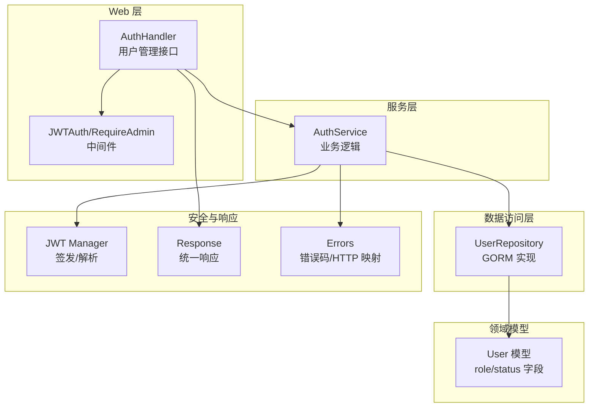
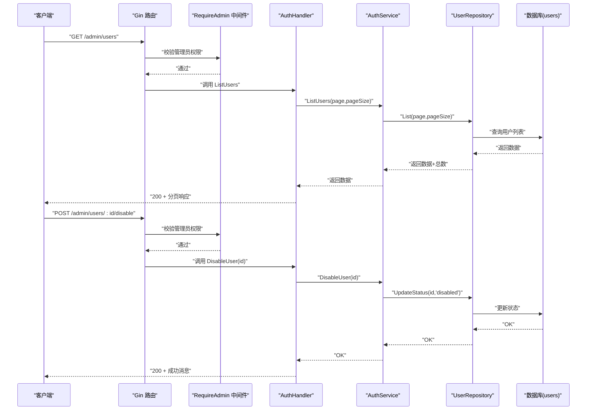
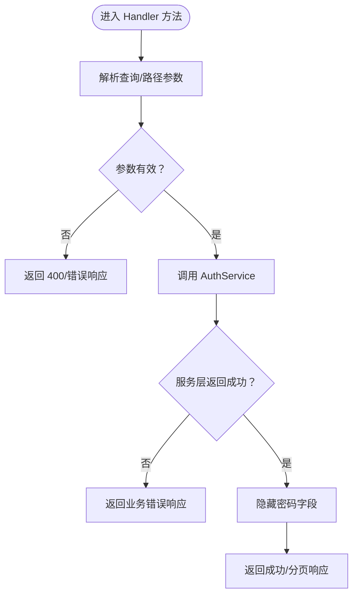
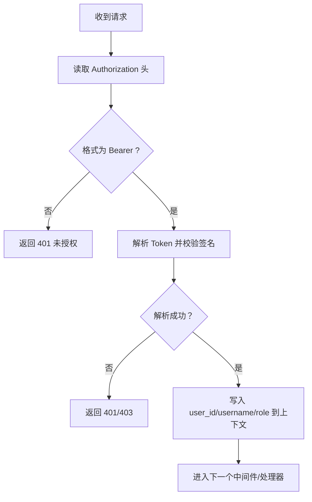
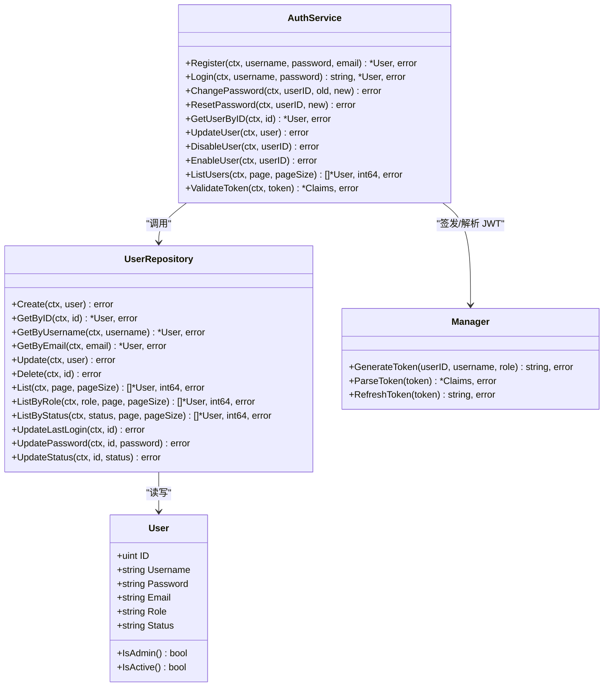
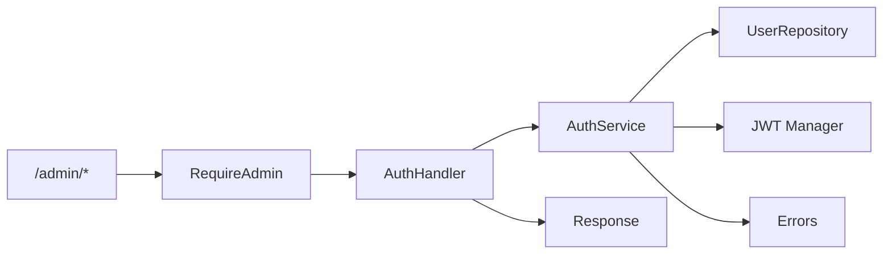

# 用户管理接口

<cite>
**本文引用的文件**
- [manager/cmd/manager/main.go](file://manager/cmd/manager/main.go)
- [manager/internal/handler/auth.go](file://manager/internal/handler/auth.go)
- [manager/internal/handler/helper.go](file://manager/internal/handler/helper.go)
- [manager/internal/middleware/auth.go](file://manager/internal/middleware/auth.go)
- [manager/internal/service/auth.go](file://manager/internal/service/auth.go)
- [manager/internal/repository/user.go](file://manager/internal/repository/user.go)
- [manager/internal/model/user.go](file://manager/internal/model/user.go)
- [manager/pkg/jwt/jwt.go](file://manager/pkg/jwt/jwt.go)
- [manager/pkg/response/response.go](file://manager/pkg/response/response.go)
- [manager/pkg/errors/errors.go](file://manager/pkg/errors/errors.go)
</cite>

## 目录
1. [简介](#简介)
2. [项目结构](#项目结构)
3. [核心组件](#核心组件)
4. [架构总览](#架构总览)
5. [详细组件分析](#详细组件分析)
6. [依赖关系分析](#依赖关系分析)
7. [性能考虑](#性能考虑)
8. [故障排查指南](#故障排查指南)
9. [结论](#结论)
10. [附录：HTTP 接口规范](#附录http-接口规范)

## 简介
本文件面向管理员用户，系统性梳理“用户管理接口”的实现与使用，重点覆盖：
- 管理员专属接口：获取用户列表、禁用/启用用户
- RBAC 权限控制机制：基于 JWT 的身份认证与管理员角色校验
- 用户状态管理：active/disabled 状态流转与登录限制
- 后端实现原理：Handler -> Service -> Repository -> Model -> 数据库 的完整链路
- HTTP 请求与响应示例、常见错误场景与处理建议

## 项目结构
用户管理接口位于 Manager 服务的 Web 层，采用经典的分层架构：
- Handler：HTTP 入口，负责参数解析、调用 Service、封装响应
- Middleware：认证与授权中间件，注入用户上下文并强制管理员权限
- Service：业务逻辑编排，协调 Repository 与外部组件
- Repository：数据访问抽象与实现，封装 GORM 查询
- Model：领域模型，包含用户状态与角色字段
- JWT：令牌签发与解析
- Response/Error：统一响应格式与错误码映射

图表来源
- [manager/internal/handler/auth.go](file://manager/internal/handler/auth.go#L150-L225)
- [manager/internal/middleware/auth.go](file://manager/internal/middleware/auth.go#L1-L98)
- [manager/internal/service/auth.go](file://manager/internal/service/auth.go#L1-L287)
- [manager/internal/repository/user.go](file://manager/internal/repository/user.go#L1-L186)
- [manager/internal/model/user.go](file://manager/internal/model/user.go#L1-L43)
- [manager/pkg/jwt/jwt.go](file://manager/pkg/jwt/jwt.go#L1-L140)
- [manager/pkg/response/response.go](file://manager/pkg/response/response.go#L1-L145)
- [manager/pkg/errors/errors.go](file://manager/pkg/errors/errors.go#L1-L171)

章节来源
- [manager/internal/handler/auth.go](file://manager/internal/handler/auth.go#L1-L225)
- [manager/internal/middleware/auth.go](file://manager/internal/middleware/auth.go#L1-L98)
- [manager/internal/service/auth.go](file://manager/internal/service/auth.go#L1-L287)
- [manager/internal/repository/user.go](file://manager/internal/repository/user.go#L1-L186)
- [manager/internal/model/user.go](file://manager/internal/model/user.go#L1-L43)
- [manager/pkg/jwt/jwt.go](file://manager/pkg/jwt/jwt.go#L1-L140)
- [manager/pkg/response/response.go](file://manager/pkg/response/response.go#L1-L145)
- [manager/pkg/errors/errors.go](file://manager/pkg/errors/errors.go#L1-L171)

## 核心组件
- 认证处理器（AuthHandler）：暴露管理员用户管理接口，负责参数校验、调用服务层、返回统一响应
- 中间件（JWTAuth/RequireAdmin）：鉴权与管理员权限校验
- 认证服务（AuthService）：实现用户状态变更、列表查询等业务逻辑
- 用户仓储（UserRepository）：封装 GORM 查询与更新
- 用户模型（User）：包含角色与状态字段，提供角色判断与状态判断方法
- JWT 管理器（Manager）：签发与解析令牌，携带用户角色
- 统一响应与错误（response/errors）：标准化响应体与 HTTP 状态码映射

章节来源
- [manager/internal/handler/auth.go](file://manager/internal/handler/auth.go#L150-L225)
- [manager/internal/middleware/auth.go](file://manager/internal/middleware/auth.go#L1-L98)
- [manager/internal/service/auth.go](file://manager/internal/service/auth.go#L1-L287)
- [manager/internal/repository/user.go](file://manager/internal/repository/user.go#L1-L186)
- [manager/internal/model/user.go](file://manager/internal/model/user.go#L1-L43)
- [manager/pkg/jwt/jwt.go](file://manager/pkg/jwt/jwt.go#L1-L140)
- [manager/pkg/response/response.go](file://manager/pkg/response/response.go#L1-L145)
- [manager/pkg/errors/errors.go](file://manager/pkg/errors/errors.go#L1-L171)

## 架构总览
管理员用户管理接口通过 Gin 路由组绑定到 /admin，并强制 RequireAdmin 中间件。Handler 调用 Service，Service 调用 Repository，Repository 通过 GORM 操作数据库表 users。JWT 中间件将用户身份与角色注入上下文，供 RequireAdmin 校验。

图表来源
- [manager/cmd/manager/main.go](file://manager/cmd/manager/main.go#L198-L209)
- [manager/internal/handler/auth.go](file://manager/internal/handler/auth.go#L150-L225)
- [manager/internal/middleware/auth.go](file://manager/internal/middleware/auth.go#L52-L70)
- [manager/internal/service/auth.go](file://manager/internal/service/auth.go#L248-L277)
- [manager/internal/repository/user.go](file://manager/internal/repository/user.go#L137-L186)

章节来源
- [manager/cmd/manager/main.go](file://manager/cmd/manager/main.go#L198-L209)
- [manager/internal/handler/auth.go](file://manager/internal/handler/auth.go#L150-L225)
- [manager/internal/middleware/auth.go](file://manager/internal/middleware/auth.go#L52-L70)
- [manager/internal/service/auth.go](file://manager/internal/service/auth.go#L248-L277)
- [manager/internal/repository/user.go](file://manager/internal/repository/user.go#L137-L186)

## 详细组件分析

### Handler：用户管理接口
- ListUsers：解析分页参数，调用服务层获取用户列表，隐藏密码字段，返回分页响应
- DisableUser：解析用户ID，调用服务层禁用用户，返回成功消息
- EnableUser：解析用户ID，调用服务层启用用户，返回成功消息
- 参数解析辅助：helper 提供 parseIntQuery、parseUintParam、parseStringQuery

图表来源
- [manager/internal/handler/auth.go](file://manager/internal/handler/auth.go#L150-L225)
- [manager/internal/handler/helper.go](file://manager/internal/handler/helper.go#L1-L47)
- [manager/pkg/response/response.go](file://manager/pkg/response/response.go#L1-L145)

章节来源
- [manager/internal/handler/auth.go](file://manager/internal/handler/auth.go#L150-L225)
- [manager/internal/handler/helper.go](file://manager/internal/handler/helper.go#L1-L47)
- [manager/pkg/response/response.go](file://manager/pkg/response/response.go#L1-L145)

### Middleware：RBAC 权限控制
- JWTAuth：从 Authorization 头解析 Bearer Token，解析失败返回 401/403；成功则将 user_id、username、role 写入上下文
- RequireAdmin：从上下文读取 role，非 admin 直接返回 403
- GetUserID/GetUsername/GetRole：从上下文中读取用户信息的便捷函数

图表来源
- [manager/internal/middleware/auth.go](file://manager/internal/middleware/auth.go#L1-L70)
- [manager/pkg/jwt/jwt.go](file://manager/pkg/jwt/jwt.go#L63-L88)
- [manager/pkg/errors/errors.go](file://manager/pkg/errors/errors.go#L93-L131)

章节来源
- [manager/internal/middleware/auth.go](file://manager/internal/middleware/auth.go#L1-L98)
- [manager/pkg/jwt/jwt.go](file://manager/pkg/jwt/jwt.go#L1-L140)
- [manager/pkg/errors/errors.go](file://manager/pkg/errors/errors.go#L1-L171)

### Service：业务逻辑与状态管理
- ListUsers：委托 UserRepository.List 获取分页数据
- DisableUser/EnableUser：通过 UpdateStatus 将状态切换为 disabled 或 active
- Login：校验用户状态是否为 active，否则返回“用户已禁用”；通过 bcrypt 校验密码后签发 JWT
- ChangePassword/ResetPassword：bcrypt 加密后更新密码
- GetUserByID/UpdateUser：按需使用

图表来源
- [manager/internal/service/auth.go](file://manager/internal/service/auth.go#L1-L287)
- [manager/internal/repository/user.go](file://manager/internal/repository/user.go#L1-L186)
- [manager/internal/model/user.go](file://manager/internal/model/user.go#L1-L43)
- [manager/pkg/jwt/jwt.go](file://manager/pkg/jwt/jwt.go#L1-L140)

章节来源
- [manager/internal/service/auth.go](file://manager/internal/service/auth.go#L1-L287)
- [manager/internal/repository/user.go](file://manager/internal/repository/user.go#L1-L186)
- [manager/internal/model/user.go](file://manager/internal/model/user.go#L1-L43)
- [manager/pkg/jwt/jwt.go](file://manager/pkg/jwt/jwt.go#L1-L140)

### Repository：数据访问模式
- List/ListByRole/ListByStatus：支持分页与总数统计，按 id DESC 排序
- UpdateStatus：将用户状态更新为 active/disabled
- UpdatePassword/UpdateLastLogin：更新密码与最后登录时间
- GetByID/GetByUsername/GetByEmail：基础查询

章节来源
- [manager/internal/repository/user.go](file://manager/internal/repository/user.go#L1-L186)

### Model：用户状态与角色
- Role：admin/user
- Status：active/disabled
- IsAdmin/IsActive：便捷判断

章节来源
- [manager/internal/model/user.go](file://manager/internal/model/user.go#L1-L43)

## 依赖关系分析
- 路由绑定：/admin 下的用户管理接口均受 RequireAdmin 保护
- Handler 依赖 Service；Service 依赖 Repository 与 JWT 管理器
- 中间件依赖 JWT 管理器进行令牌解析
- 统一响应与错误码贯穿整个链路

图表来源
- [manager/cmd/manager/main.go](file://manager/cmd/manager/main.go#L198-L209)
- [manager/internal/middleware/auth.go](file://manager/internal/middleware/auth.go#L52-L70)
- [manager/internal/handler/auth.go](file://manager/internal/handler/auth.go#L150-L225)
- [manager/internal/service/auth.go](file://manager/internal/service/auth.go#L1-L287)
- [manager/pkg/response/response.go](file://manager/pkg/response/response.go#L1-L145)
- [manager/pkg/errors/errors.go](file://manager/pkg/errors/errors.go#L1-L171)

章节来源
- [manager/cmd/manager/main.go](file://manager/cmd/manager/main.go#L198-L209)
- [manager/internal/middleware/auth.go](file://manager/internal/middleware/auth.go#L52-L70)
- [manager/internal/handler/auth.go](file://manager/internal/handler/auth.go#L150-L225)
- [manager/internal/service/auth.go](file://manager/internal/service/auth.go#L1-L287)
- [manager/pkg/response/response.go](file://manager/pkg/response/response.go#L1-L145)
- [manager/pkg/errors/errors.go](file://manager/pkg/errors/errors.go#L1-L171)

## 性能考虑
- 分页查询：Repository 已实现分页与总数统计，避免一次性加载大量数据
- 查询排序：按 id DESC 排序，便于管理员查看最新用户
- 密码处理：bcrypt 加密在 Service 层完成，避免 Handler 承担加密逻辑
- 日志与审计：Service 层记录关键事件，便于追踪与审计

[本节为通用指导，无需列出具体文件来源]

## 故障排查指南
- 未携带或携带无效 Authorization 头：返回 401 未授权
- Token 格式错误或签名无效：返回 401 未授权
- Token 过期：返回 401 Token 已过期
- 非管理员访问 /admin 接口：返回 403 禁止访问
- 用户被禁用但仍尝试登录：返回 403 用户已禁用
- 用户不存在或数据库异常：返回 404/500 及相应错误码
- 参数非法：返回 400 参数错误

章节来源
- [manager/internal/middleware/auth.go](file://manager/internal/middleware/auth.go#L1-L70)
- [manager/pkg/jwt/jwt.go](file://manager/pkg/jwt/jwt.go#L63-L88)
- [manager/pkg/errors/errors.go](file://manager/pkg/errors/errors.go#L93-L171)
- [manager/internal/service/auth.go](file://manager/internal/service/auth.go#L116-L153)
- [manager/internal/handler/auth.go](file://manager/internal/handler/auth.go#L150-L225)

## 结论
该用户管理接口以清晰的分层架构实现，管理员专属接口通过 RequireAdmin 强制权限控制，JWT 中间件确保身份可信。Service 层集中处理业务规则（如用户状态校验），Repository 层专注数据访问，配合统一响应与错误码体系，形成高内聚、低耦合的实现方案。

[本节为总结性内容，无需列出具体文件来源]

## 附录：HTTP 接口规范

### 路由与权限
- GET /admin/users
  - 权限：管理员
  - 查询参数：page（默认 1）、page_size（默认 20，上限 100）
  - 响应：分页列表，列表中隐藏密码字段
- POST /admin/users/:id/disable
  - 权限：管理员
  - 路径参数：id（用户ID）
  - 响应：成功消息
- POST /admin/users/:id/enable
  - 权限：管理员
  - 路径参数：id（用户ID）
  - 响应：成功消息

章节来源
- [manager/cmd/manager/main.go](file://manager/cmd/manager/main.go#L198-L209)
- [manager/internal/handler/auth.go](file://manager/internal/handler/auth.go#L150-L225)
- [manager/internal/middleware/auth.go](file://manager/internal/middleware/auth.go#L52-L70)

### 认证与授权流程
- 客户端携带 Authorization: Bearer <token> 请求
- JWTAuth 中间件解析并校验 token，失败返回 401/403
- RequireAdmin 校验角色，非 admin 返回 403
- 通过后进入对应 Handler

章节来源
- [manager/internal/middleware/auth.go](file://manager/internal/middleware/auth.go#L1-L70)
- [manager/pkg/jwt/jwt.go](file://manager/pkg/jwt/jwt.go#L63-L88)

### 登录与状态影响
- 登录时若用户状态非 active，返回 403 用户已禁用
- 禁用/启用用户通过 UpdateStatus 改变状态字段

章节来源
- [manager/internal/service/auth.go](file://manager/internal/service/auth.go#L116-L153)
- [manager/internal/repository/user.go](file://manager/internal/repository/user.go#L177-L186)

### 统一响应与错误码
- 成功响应：code=0，message="success"/"created"/"accepted"，包含 data 与 timestamp
- 错误响应：根据错误码映射 HTTP 状态（401/403/404/409/500）
- 常见错误：参数错误、未授权、禁止访问、资源不存在、Token 无效/过期、用户已禁用、服务器内部错误

章节来源
- [manager/pkg/response/response.go](file://manager/pkg/response/response.go#L1-L145)
- [manager/pkg/errors/errors.go](file://manager/pkg/errors/errors.go#L1-L171)