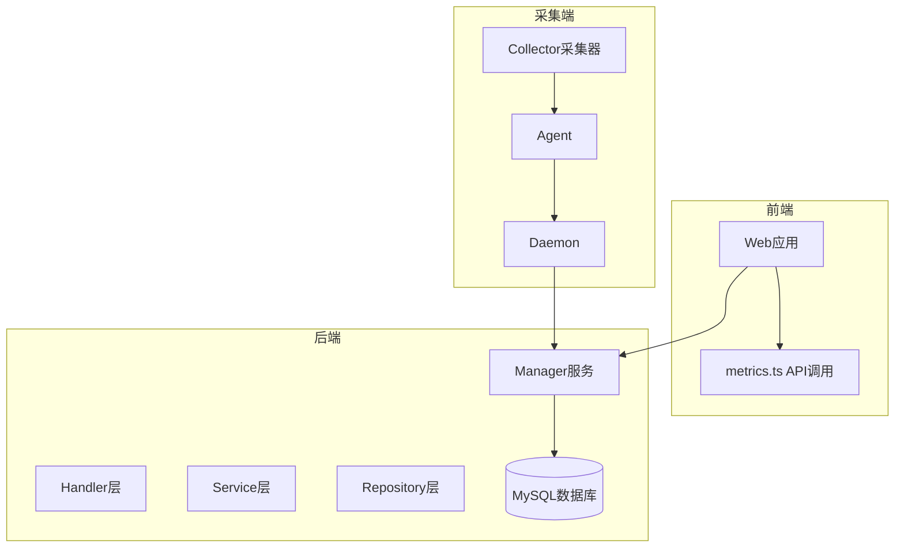
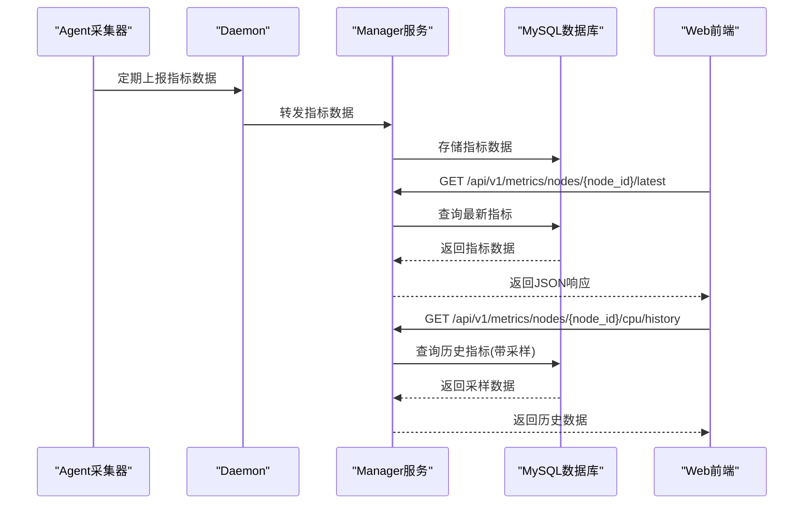
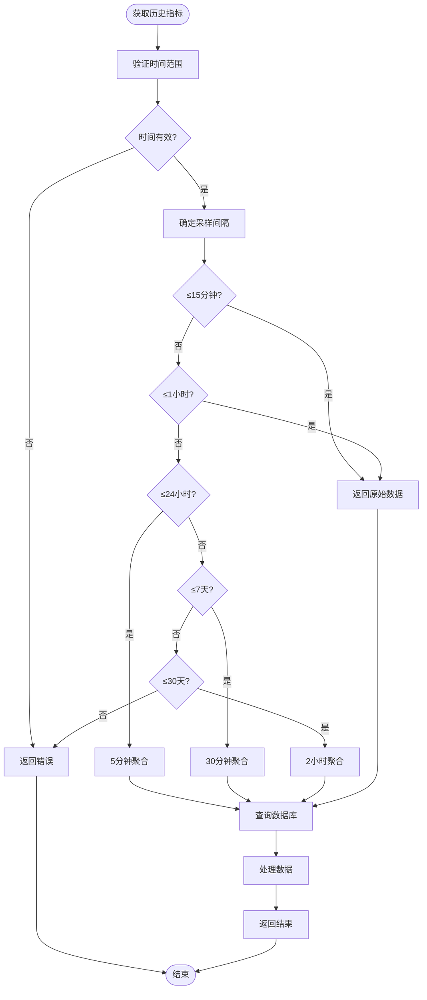
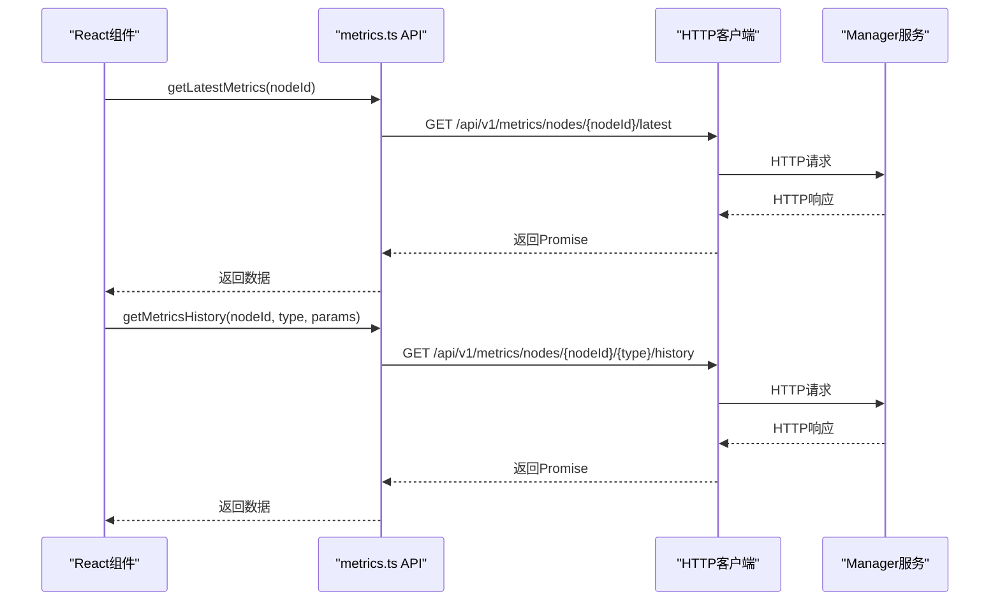
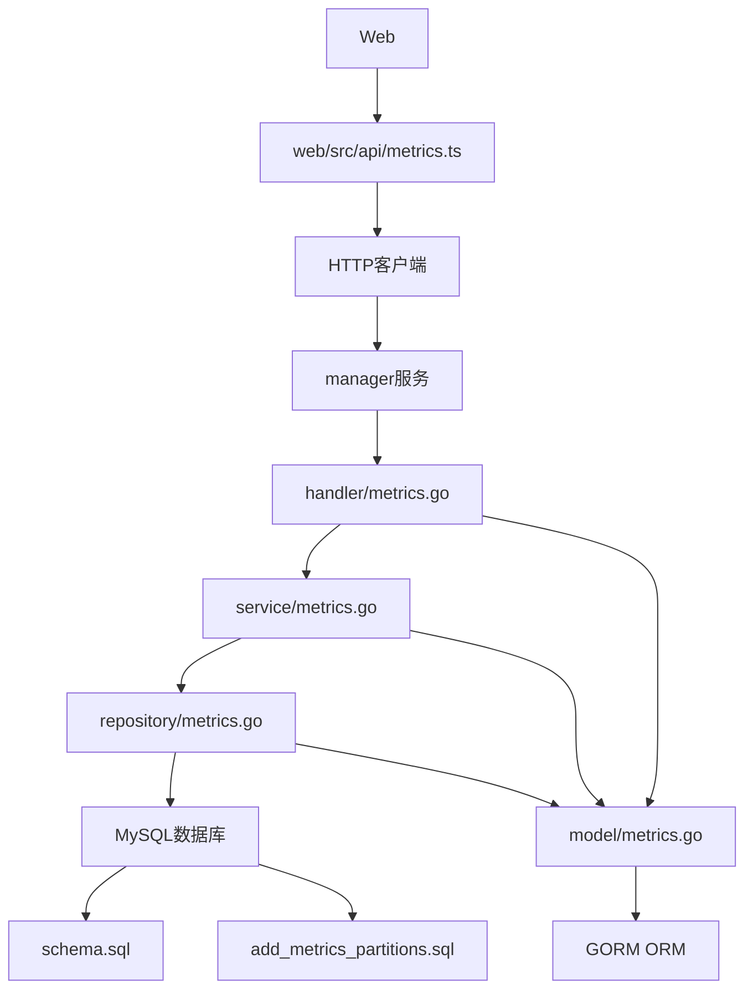

# 监控指标接口

<cite>
**本文档引用的文件**  
- [metrics.go](file://manager/internal/handler/metrics.go)
- [metrics.ts](file://web/src/api/metrics.ts)
- [metrics.go](file://manager/internal/service/metrics.go)
- [metrics.go](file://manager/internal/repository/metrics.go)
- [metrics.go](file://manager/internal/model/metrics.go)
- [schema.sql](file://config/mysql/schema.sql)
- [add_metrics_partitions.sql](file://manager/migrations/add_metrics_partitions.sql)
- [metrics.ts](file://web/src/types/metrics.ts)
- [cpu.go](file://daemon/internal/collector/cpu.go)
- [memory.go](file://daemon/internal/collector/memory.go)
- [disk.go](file://daemon/internal/collector/disk.go)
- [network.go](file://daemon/internal/collector/network.go)
- [types.go](file://daemon/pkg/types/types.go)
- [metrics_api_test.go](file://manager/test/integration/metrics_api_test.go)
</cite>

## 目录
1. [简介](#简介)
2. [项目结构](#项目结构)
3. [核心组件](#核心组件)
4. [架构概述](#架构概述)
5. [详细组件分析](#详细组件分析)
6. [依赖分析](#依赖分析)
7. [性能考虑](#性能考虑)
8. [故障排除指南](#故障排除指南)
9. [结论](#结论)

## 简介
本文档详细描述了获取系统监控数据的RESTful API，涵盖时间范围查询参数、指标类型过滤、聚合函数支持和响应数据格式。结合后端`metrics.go`中的数据处理逻辑和前端`web/src/api/metrics.ts`中的数据请求模式，全面解释了指标采集、存储和查询的完整流程。文档提供了多种查询场景的curl示例和TypeScript调用示例，包括实时指标、历史数据和聚合查询。

## 项目结构
本项目采用分层架构，主要分为agent、daemon、manager和web四个模块。agent负责数据采集，daemon作为数据中转，manager提供API服务和数据存储，web为前端应用。监控指标相关的核心代码分布在manager模块的handler、service和repository层，以及web模块的api和types目录中。



**图表来源**
- [metrics.ts](file://web/src/api/metrics.ts)
- [metrics.go](file://manager/internal/handler/metrics.go)
- [cpu.go](file://daemon/internal/collector/cpu.go)

**章节来源**
- [metrics.go](file://manager/internal/handler/metrics.go)
- [metrics.ts](file://web/src/api/metrics.ts)

## 核心组件
监控指标接口的核心组件包括Handler层的`MetricsHandler`、Service层的`MetricsService`和Repository层的`MetricsRepository`。这些组件共同实现了指标数据的获取、处理和存储功能。`MetricsHandler`负责处理HTTP请求和响应，`MetricsService`实现业务逻辑，`MetricsRepository`负责与数据库交互。

**章节来源**
- [metrics.go](file://manager/internal/handler/metrics.go)
- [metrics.go](file://manager/internal/service/metrics.go)
- [metrics.go](file://manager/internal/repository/metrics.go)

## 架构概述
监控指标系统的架构分为数据采集、数据传输、数据存储和数据查询四个主要部分。Agent通过Collector采集器定期收集系统指标，通过Daemon将数据上报给Manager服务。Manager服务将数据存储到MySQL数据库，并提供RESTful API供前端查询。前端通过封装的API函数调用后端接口，获取实时和历史监控数据。



**图表来源**
- [metrics.go](file://manager/internal/handler/metrics.go)
- [metrics.ts](file://web/src/api/metrics.ts)
- [cpu.go](file://daemon/internal/collector/cpu.go)

## 详细组件分析

### 指标处理器分析
`MetricsHandler`是监控指标的HTTP请求处理器，实现了多个API端点，包括获取最新指标、历史指标、统计摘要和集群概览。

#### 指标处理器类图
```mermaid
classDiagram
class MetricsHandler {
+metricsService MetricsService
+logger *zap.Logger
+GetLatestMetrics(c *gin.Context)
+GetMetricsHistory(c *gin.Context)
+GetMetricsSummary(c *gin.Context)
+GetClusterOverview(c *gin.Context)
}
class MetricsService {
<<interface>>
+GetLatestMetricsByNodeID(ctx context.Context, nodeID string) map[string]*model.Metrics
+GetMetricsHistoryWithSampling(ctx context.Context, nodeID string, metricType string, startTime, endTime time.Time) []*model.Metrics
+GetMetricsSummaryStats(ctx context.Context, nodeID string, startTime, endTime time.Time) map[string]interface{}
+GetClusterOverview(ctx context.Context) map[string]interface{}
}
MetricsHandler --> MetricsService : "依赖"
```

**图表来源**
- [metrics.go](file://manager/internal/handler/metrics.go)
- [metrics.go](file://manager/internal/service/metrics.go)

**章节来源**
- [metrics.go](file://manager/internal/handler/metrics.go)

### 指标服务分析
`MetricsService`实现了监控指标的核心业务逻辑，包括数据查询、聚合计算和统计分析。服务层根据时间范围自动选择采样间隔，确保数据点数量适中。

#### 指标服务流程图


**图表来源**
- [metrics.go](file://manager/internal/service/metrics.go)

**章节来源**
- [metrics.go](file://manager/internal/service/metrics.go)

### 前端API分析
前端通过`metrics.ts`文件中的函数调用后端API，实现了类型安全的指标数据获取。这些函数封装了HTTP请求细节，提供了Promise-based的异步接口。

#### 前端API调用序列图


**图表来源**
- [metrics.ts](file://web/src/api/metrics.ts)
- [metrics.go](file://manager/internal/handler/metrics.go)

**章节来源**
- [metrics.ts](file://web/src/api/metrics.ts)

## 依赖分析
监控指标系统涉及多个组件之间的依赖关系，包括前端与后端的API依赖、后端各层之间的服务依赖，以及与数据库的存储依赖。



**图表来源**
- [metrics.ts](file://web/src/api/metrics.ts)
- [metrics.go](file://manager/internal/handler/metrics.go)
- [metrics.go](file://manager/internal/service/metrics.go)
- [metrics.go](file://manager/internal/repository/metrics.go)
- [metrics.go](file://manager/internal/model/metrics.go)
- [schema.sql](file://config/mysql/schema.sql)
- [add_metrics_partitions.sql](file://manager/migrations/add_metrics_partitions.sql)

**章节来源**
- [metrics.ts](file://web/src/api/metrics.ts)
- [metrics.go](file://manager/internal/handler/metrics.go)
- [metrics.go](file://manager/internal/service/metrics.go)
- [metrics.go](file://manager/internal/repository/metrics.go)

## 性能考虑
监控指标系统在性能方面进行了多项优化，包括数据库分区、查询采样和索引优化。`add_metrics_partitions.sql`脚本实现了按日期的RANGE分区，提高了大表查询性能。服务层根据时间范围自动选择采样间隔，避免返回过多数据点。数据库查询使用了复合索引`idx_node_id_type_timestamp`，确保查询效率。

**章节来源**
- [add_metrics_partitions.sql](file://manager/migrations/add_metrics_partitions.sql)
- [metrics.go](file://manager/internal/repository/metrics.go)
- [metrics.go](file://manager/internal/service/metrics.go)

## 故障排除指南
当监控指标接口出现问题时，可以从以下几个方面进行排查：检查数据库连接、验证API认证、确认数据采集是否正常、检查时间参数格式和范围。测试文件`metrics_api_test.go`提供了完整的API测试用例，可用于验证接口功能。

**章节来源**
- [metrics_api_test.go](file://manager/test/integration/metrics_api_test.go)
- [metrics.go](file://manager/internal/handler/metrics.go)

## 结论
本文档详细介绍了监控指标接口的设计和实现，涵盖了从数据采集到前端展示的完整流程。系统通过分层架构实现了关注点分离，提供了灵活的查询接口和高效的性能表现。通过理解这些组件和流程，开发者可以更好地使用和扩展监控指标功能。