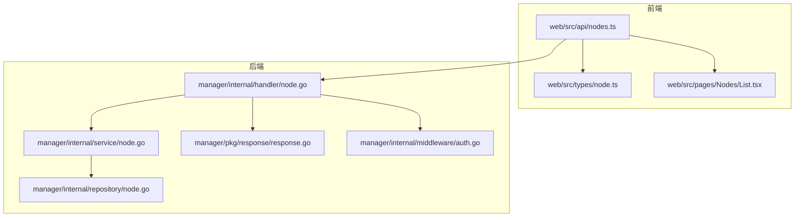
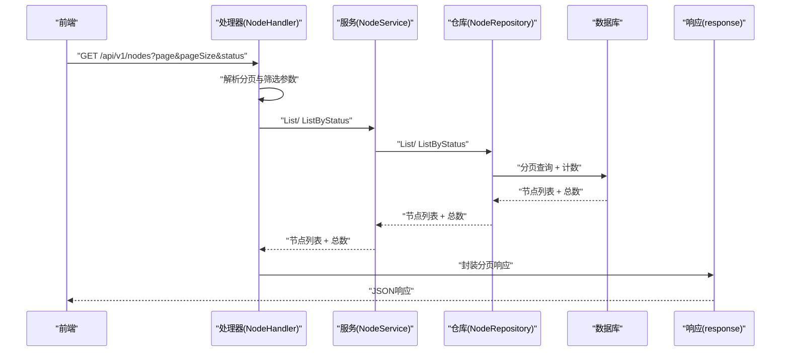
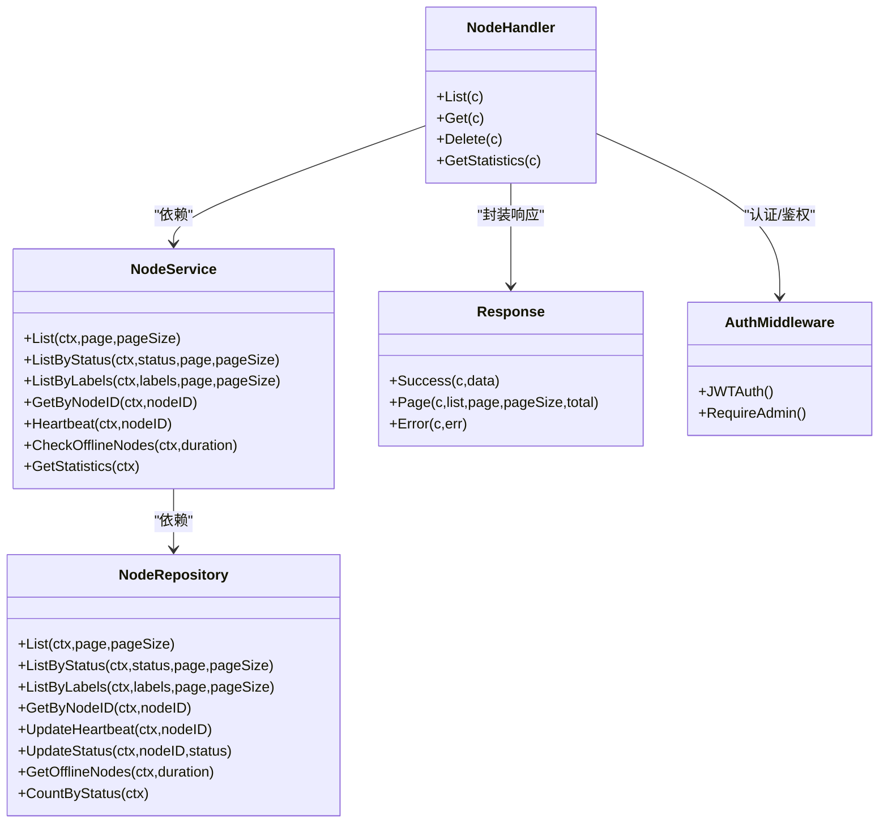

# 节点管理接口

<cite>
**本文引用的文件**
- [Manager_API.md](file://docs/api/Manager_API.md)
- [node.go（处理器）](file://manager/internal/handler/node.go)
- [helper.go（处理器辅助）](file://manager/internal/handler/helper.go)
- [node.go（服务层）](file://manager/internal/service/node.go)
- [node.go（仓库层）](file://manager/internal/repository/node.go)
- [response.go（响应封装）](file://manager/pkg/response/response.go)
- [auth.go（认证中间件）](file://manager/internal/middleware/auth.go)
- [nodes.ts（前端API封装）](file://web/src/api/nodes.ts)
- [node.ts（前端类型定义）](file://web/src/types/node.ts)
- [nodes.ts（前端页面组件）](file://web/src/pages/Nodes/List.tsx)
</cite>

## 目录
1. [简介](#简介)
2. [项目结构与入口](#项目结构与入口)
3. [核心组件](#核心组件)
4. [架构总览](#架构总览)
5. [详细接口说明](#详细接口说明)
6. [依赖关系分析](#依赖关系分析)
7. [性能与可扩展性](#性能与可扩展性)
8. [故障排查指南](#故障排查指南)
9. [结论](#结论)
10. [附录：示例与最佳实践](#附录示例与最佳实践)

## 简介
本文件面向运维平台的“节点管理”能力，围绕获取节点列表、节点详情、节点统计信息以及删除节点等API进行系统化梳理。文档基于后端Go代码与前端TypeScript实现，结合接口规范文档，覆盖分页机制、筛选参数、响应数据结构、错误处理策略，并补充节点状态同步机制、心跳检测原理与标签系统使用方法，帮助开发者快速上手并正确集成。

## 项目结构与入口
- 后端采用Gin框架，节点相关API由处理器层接收请求，经服务层编排业务，最终由仓库层访问数据库。
- 前端通过统一拦截器客户端发起请求，封装节点相关的增删改查与统计查询。

图表来源
- [node.go（处理器）](file://manager/internal/handler/node.go#L1-L157)
- [node.go（服务层）](file://manager/internal/service/node.go#L1-L234)
- [node.go（仓库层）](file://manager/internal/repository/node.go#L1-L226)
- [response.go（响应封装）](file://manager/pkg/response/response.go#L1-L145)
- [auth.go（认证中间件）](file://manager/internal/middleware/auth.go#L1-L98)
- [nodes.ts（前端API封装）](file://web/src/api/nodes.ts#L1-L47)
- [node.ts（前端类型定义）](file://web/src/types/node.ts#L1-L71)
- [nodes.ts（前端页面组件）](file://web/src/pages/Nodes/List.tsx#L1-L200)

章节来源
- [node.go（处理器）](file://manager/internal/handler/node.go#L1-L157)
- [node.go（服务层）](file://manager/internal/service/node.go#L1-L234)
- [node.go（仓库层）](file://manager/internal/repository/node.go#L1-L226)
- [response.go（响应封装）](file://manager/pkg/response/response.go#L1-L145)
- [auth.go（认证中间件）](file://manager/internal/middleware/auth.go#L1-L98)
- [nodes.ts（前端API封装）](file://web/src/api/nodes.ts#L1-L47)
- [node.ts（前端类型定义）](file://web/src/types/node.ts#L1-L71)
- [nodes.ts（前端页面组件）](file://web/src/pages/Nodes/List.tsx#L1-L200)

## 核心组件
- 处理器层（Handler）：负责解析请求参数、调用服务层、封装响应。
- 服务层（Service）：编排业务逻辑，如分页、按状态筛选、心跳处理、离线检测、统计汇总。
- 仓库层（Repository）：封装数据库访问，提供分页、按状态/标签查询、状态与心跳更新、离线节点检测、按状态计数等。
- 响应封装（Response）：统一输出格式，包含code、message、data、timestamp。
- 认证中间件（Auth）：校验JWT、提取用户角色，对管理员接口进行权限控制。
- 前端API封装（web/src/api/nodes.ts）：对节点列表、详情、统计、删除等接口进行封装，供页面组件调用。

章节来源
- [node.go（处理器）](file://manager/internal/handler/node.go#L1-L157)
- [node.go（服务层）](file://manager/internal/service/node.go#L1-L234)
- [node.go（仓库层）](file://manager/internal/repository/node.go#L1-L226)
- [response.go（响应封装）](file://manager/pkg/response/response.go#L1-L145)
- [auth.go（认证中间件）](file://manager/internal/middleware/auth.go#L1-L98)
- [nodes.ts（前端API封装）](file://web/src/api/nodes.ts#L1-L47)

## 架构总览
下图展示从HTTP请求到数据库查询再到响应返回的完整链路，以及与前端交互的关键节点。

图表来源
- [node.go（处理器）](file://manager/internal/handler/node.go#L36-L69)
- [node.go（服务层）](file://manager/internal/service/node.go#L126-L144)
- [node.go（仓库层）](file://manager/internal/repository/node.go#L86-L128)
- [response.go（响应封装）](file://manager/pkg/response/response.go#L103-L119)

## 详细接口说明

### 通用约定
- 认证方式：JWT Bearer Token，请求头需包含 Authorization: Bearer <token>。
- 响应格式：统一返回包含code、message、data、timestamp的JSON对象；分页响应包含list与page_info。
- 错误码：参考接口规范文档中的错误码表，不同错误映射到对应HTTP状态码。

章节来源
- [Manager_API.md](file://docs/api/Manager_API.md#L46-L93)
- [Manager_API.md](file://docs/api/Manager_API.md#L97-L120)
- [auth.go（认证中间件）](file://manager/internal/middleware/auth.go#L12-L49)
- [response.go（响应封装）](file://manager/pkg/response/response.go#L11-L20)

### 获取节点列表
- 方法与路径：GET /api/v1/nodes
- 权限：需要认证
- 查询参数：
  - page：页码，默认1，最小1
  - page_size：每页数量，默认20，最大100
  - status：状态筛选（online/offline），为空则不过滤
- 响应：
  - data.list：节点数组
  - data.page_info：包含page、page_size、total、pages
- 处理流程要点：
  - 处理器解析分页参数并调用服务层；若status非空则走按状态查询分支。
  - 服务层委托仓库层执行分页查询与总数统计。
  - 响应层计算总页数并封装分页数据。

章节来源
- [Manager_API.md](file://docs/api/Manager_API.md#L350-L426)
- [node.go（处理器）](file://manager/internal/handler/node.go#L36-L69)
- [node.go（服务层）](file://manager/internal/service/node.go#L126-L144)
- [node.go（仓库层）](file://manager/internal/repository/node.go#L86-L128)
- [response.go（响应封装）](file://manager/pkg/response/response.go#L103-L119)

### 获取节点详情
- 方法与路径：GET /api/v1/nodes/:id
- 权限：需要认证
- 路径参数：
  - id：节点数据库ID（整数）
- 响应：
  - data.node：节点对象，包含node_id、hostname、ip、os、arch、status、labels、daemon_version、agent_version、last_heartbeat_at、created_at、updated_at等
- 处理流程要点：
  - 处理器解析id参数并调用服务层按node_id查询；若记录不存在返回404。
  - 服务层封装错误并交由响应层返回。

章节来源
- [Manager_API.md](file://docs/api/Manager_API.md#L429-L486)
- [node.go（处理器）](file://manager/internal/handler/node.go#L71-L92)
- [node.go（服务层）](file://manager/internal/service/node.go#L93-L104)
- [node.go（仓库层）](file://manager/internal/repository/node.go#L66-L74)

### 获取节点统计信息
- 方法与路径：GET /api/v1/nodes/statistics
- 权限：需要认证
- 响应：
  - data.statistics：包含total、online、offline三项统计
- 处理流程要点：
  - 服务层调用仓库层按状态计数，汇总total；对未知状态累加。
  - 响应层返回统计结果。

章节来源
- [Manager_API.md](file://docs/api/Manager_API.md#L489-L527)
- [node.go（处理器）](file://manager/internal/handler/node.go#L116-L157)
- [node.go（服务层）](file://manager/internal/service/node.go#L225-L233)
- [node.go（仓库层）](file://manager/internal/repository/node.go#L201-L225)

### 删除节点
- 方法与路径：DELETE /api/v1/admin/nodes/:id
- 权限：需要认证 + 管理员角色
- 路径参数：
  - id：节点数据库ID（整数）
- 处理流程要点：
  - 认证中间件校验Token与角色；非管理员直接返回403。
  - 处理器解析id并调用服务层删除；仓库层执行软删除。
  - 响应层返回成功消息。

章节来源
- [Manager_API.md](file://docs/api/Manager_API.md#L530-L569)
- [auth.go（认证中间件）](file://manager/internal/middleware/auth.go#L52-L69)
- [node.go（处理器）](file://manager/internal/handler/node.go#L94-L115)
- [node.go（服务层）](file://manager/internal/service/node.go#L116-L124)
- [node.go（仓库层）](file://manager/internal/repository/node.go#L81-L84)

### 分页机制与筛选参数
- 分页参数：
  - page：最小1，越界自动修正为1
  - page_size：默认20，最大100，越界重置为默认
- 筛选参数：
  - status：按状态过滤（online/offline）
  - search：接口规范文档中存在search参数，但当前仓库层未实现按名称/IP搜索的查询分支；实际可通过status筛选配合前端关键词过滤实现
- 响应分页：
  - page_info包含page、page_size、total、pages

章节来源
- [node.go（处理器）](file://manager/internal/handler/node.go#L36-L69)
- [helper.go（处理器辅助）](file://manager/internal/handler/helper.go#L9-L47)
- [node.go（仓库层）](file://manager/internal/repository/node.go#L86-L128)
- [Manager_API.md](file://docs/api/Manager_API.md#L363-L370)

### 响应数据结构
- 成功响应：code=0，message="success"，data为具体数据，timestamp为RFC3339时间
- 分页响应：data包含list与page_info
- 错误响应：code为错误码，message为错误描述，details为可选详情，timestamp为RFC3339时间

章节来源
- [Manager_API.md](file://docs/api/Manager_API.md#L46-L93)
- [response.go（响应封装）](file://manager/pkg/response/response.go#L11-L20)
- [response.go（响应封装）](file://manager/pkg/response/response.go#L103-L119)

### 错误处理策略
- 认证失败/Token无效/过期：返回401
- 无权限（非管理员）：返回403
- 资源不存在（节点）：返回404
- 参数非法：返回400
- 服务器内部错误：返回500
- 响应层根据错误类型映射HTTP状态码

章节来源
- [Manager_API.md](file://docs/api/Manager_API.md#L97-L120)
- [auth.go（认证中间件）](file://manager/internal/middleware/auth.go#L12-L49)
- [response.go（响应封装）](file://manager/pkg/response/response.go#L53-L101)

### 节点状态同步机制与心跳检测
- 心跳处理：
  - 服务层Heartbeat接口：更新last_heartbeat_at，若节点此前为offline则更新为online
- 离线检测：
  - 服务层CheckOfflineNodes接口：根据离线阈值（duration）查询last_heartbeat_at早于截止时间且状态非offline的节点，将其标记为offline
- 状态字段：
  - Node模型包含status与last_seen_at（last_heartbeat_at为仓库层字段），状态枚举通常为online/offline/unknown

章节来源
- [node.go（服务层）](file://manager/internal/service/node.go#L166-L188)
- [node.go（服务层）](file://manager/internal/service/node.go#L203-L223)
- [node.go（仓库层）](file://manager/internal/repository/node.go#L167-L174)
- [node.go（仓库层）](file://manager/internal/repository/node.go#L189-L199)
- [node.go（模型）](file://manager/internal/model/node.go#L18-L33)

### 标签系统使用方法
- 存储结构：
  - Node.labels为JSON字段，键值对形式
- 查询能力：
  - 仓库层提供ListByLabels接口，按标签键值对进行精确匹配
- 前端类型：
  - Node接口定义labels为可选的Record<string,string>

章节来源
- [node.go（模型）](file://manager/internal/model/node.go#L24-L33)
- [node.go（仓库层）](file://manager/internal/repository/node.go#L130-L156)
- [node.ts（前端类型定义）](file://web/src/types/node.ts#L5-L17)

## 依赖关系分析

图表来源
- [node.go（处理器）](file://manager/internal/handler/node.go#L1-L157)
- [node.go（服务层）](file://manager/internal/service/node.go#L1-L234)
- [node.go（仓库层）](file://manager/internal/repository/node.go#L1-L226)
- [response.go（响应封装）](file://manager/pkg/response/response.go#L1-L145)
- [auth.go（认证中间件）](file://manager/internal/middleware/auth.go#L1-L98)

章节来源
- [node.go（处理器）](file://manager/internal/handler/node.go#L1-L157)
- [node.go（服务层）](file://manager/internal/service/node.go#L1-L234)
- [node.go（仓库层）](file://manager/internal/repository/node.go#L1-L226)
- [response.go（响应封装）](file://manager/pkg/response/response.go#L1-L145)
- [auth.go（认证中间件）](file://manager/internal/middleware/auth.go#L1-L98)

## 性能与可扩展性
- 分页查询：
  - 仓库层先Count再Limit/Offset，避免全量扫描；建议在status与labels字段建立合适索引以提升查询效率。
- 心跳与离线检测：
  - Heartbeat频繁写入last_heartbeat_at，CheckOfflineNodes按阈值批量更新状态，建议定时任务异步执行，避免阻塞请求。
- 标签查询：
  - JSON_EXTRACT按键值匹配，复杂度与索引策略相关；建议对高频标签键建立复合索引或物化列。
- 前端分页：
  - 前端List页面采用服务端分页模式，减少一次性传输数据量，提升交互体验。

章节来源
- [node.go（仓库层）](file://manager/internal/repository/node.go#L86-L128)
- [node.go（仓库层）](file://manager/internal/repository/node.go#L130-L156)
- [nodes.ts（前端页面组件）](file://web/src/pages/Nodes/List.tsx#L1596-L1644)

## 故障排查指南
- 认证失败：
  - 检查Authorization头是否为Bearer Token，Token是否过期或格式不正确。
- 无权限：
  - 确认当前用户角色为admin，删除节点接口需要管理员权限。
- 节点不存在：
  - GET /api/v1/nodes/:id返回404，确认传入的id是否正确。
- 参数非法：
  - page/page_size越界会回退到默认值；status仅支持online/offline。
- 数据库异常：
  - 服务层捕获数据库错误并返回500，检查数据库连接与SQL执行情况。

章节来源
- [auth.go（认证中间件）](file://manager/internal/middleware/auth.go#L12-L49)
- [node.go（处理器）](file://manager/internal/handler/node.go#L36-L69)
- [node.go（服务层）](file://manager/internal/service/node.go#L93-L104)
- [response.go（响应封装）](file://manager/pkg/response/response.go#L53-L101)

## 结论
节点管理接口围绕“列表/详情/统计/删除”四大能力构建，配合JWT认证、分页与筛选、统一响应格式，形成清晰稳定的API契约。心跳与离线检测保障了节点状态的实时性，标签系统为后续精细化分组与查询提供了基础。建议在生产环境中完善索引、优化离线检测任务调度，并持续关注前端分页与筛选交互体验。

## 附录：示例与最佳实践

### curl 示例
- 获取节点列表（分页与状态筛选）
  - curl -X GET "http://localhost:8080/api/v1/nodes?page=1&page_size=20&status=online" -H "Authorization: Bearer <token>"
- 获取节点详情
  - curl -X GET http://localhost:8080/api/v1/nodes/1 -H "Authorization: Bearer <token>"
- 获取节点统计信息
  - curl -X GET http://localhost:8080/api/v1/nodes/statistics -H "Authorization: Bearer <token>"
- 删除节点（管理员）
  - curl -X DELETE http://localhost:8080/api/v1/admin/nodes/1 -H "Authorization: Bearer <token>"

章节来源
- [Manager_API.md](file://docs/api/Manager_API.md#L412-L425)
- [Manager_API.md](file://docs/api/Manager_API.md#L481-L485)
- [Manager_API.md](file://docs/api/Manager_API.md#L522-L526)
- [Manager_API.md](file://docs/api/Manager_API.md#L564-L568)

### 前端TypeScript调用示例
- 获取节点列表
  - getNodes({ page: 1, page_size: 20, status: "online" })
- 获取节点详情
  - getNode("节点node_id")
- 获取节点统计信息
  - getNodeStatistics()
- 删除节点
  - deleteNode(节点数据库ID)

章节来源
- [nodes.ts（前端API封装）](file://web/src/api/nodes.ts#L1-L47)
- [node.ts（前端类型定义）](file://web/src/types/node.ts#L1-L30)

### 最佳实践
- 前端分页与筛选：
  - 使用服务端分页，避免一次性拉取大量数据；对status与关键词进行组合筛选。
- 错误处理：
  - 对401/403/404/500分别提示与引导，必要时重试或跳转登录。
- 心跳与离线：
  - 定时任务定期执行离线检测，避免频繁写入导致抖动；对异常节点提供告警与人工干预入口。
- 标签治理：
  - 统一标签键命名规范，限制标签数量与长度，便于查询与展示。