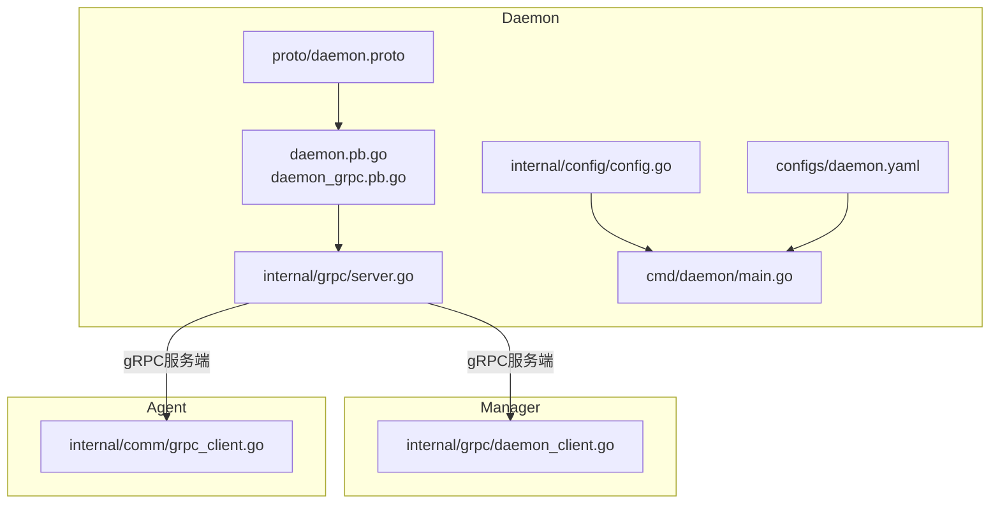
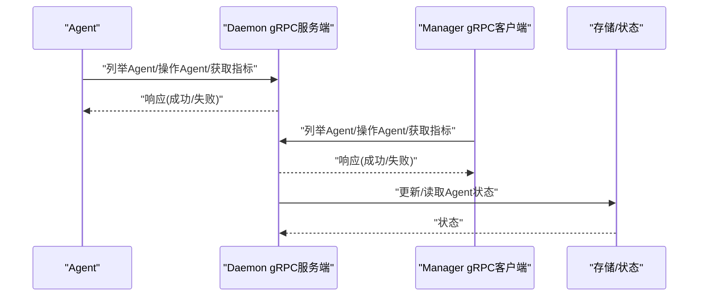
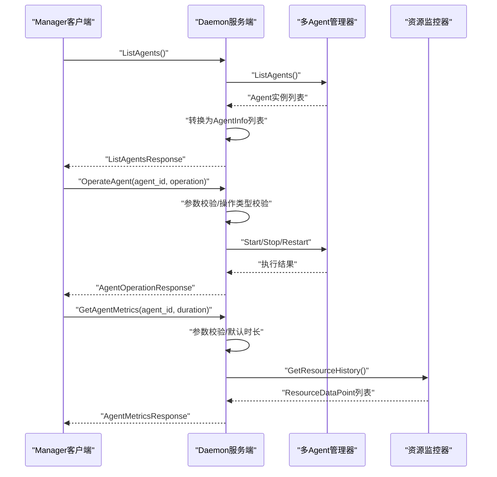
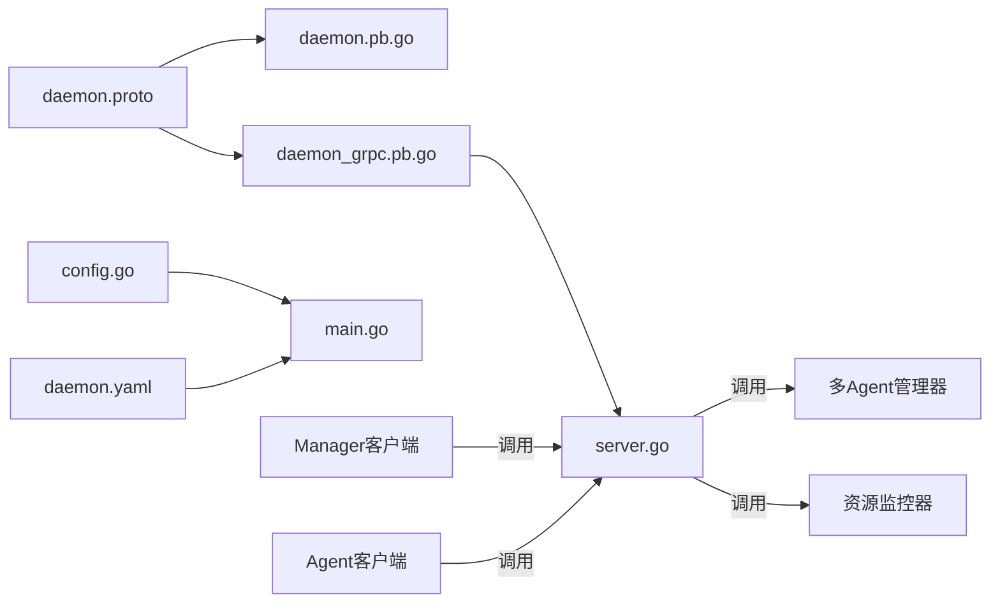

# Daemon-Agent gRPC API

<cite>
**本文引用的文件**
- [daemon/pkg/proto/daemon.proto](file://daemon/pkg/proto/daemon.proto)
- [daemon/pkg/proto/daemon.pb.go](file://daemon/pkg/proto/daemon.pb.go)
- [daemon/pkg/proto/daemon_grpc.pb.go](file://daemon/pkg/proto/daemon_grpc.pb.go)
- [daemon/internal/grpc/server.go](file://daemon/internal/grpc/server.go)
- [daemon/internal/grpc/manager_client.go](file://daemon/internal/grpc/manager_client.go)
- [daemon/internal/comm/grpc_client.go](file://daemon/internal/comm/grpc_client.go)
- [daemon/internal/config/config.go](file://daemon/internal/config/config.go)
- [daemon/configs/daemon.yaml](file://daemon/configs/daemon.yaml)
- [daemon/cmd/daemon/main.go](file://daemon/cmd/daemon/main.go)
- [manager/internal/grpc/daemon_client.go](file://manager/internal/grpc/daemon_client.go)
- [daemon/test/integration/grpc_integration_test.go](file://daemon/test/integration/grpc_integration_test.go)
</cite>

## 目录
1. [简介](#简介)
2. [项目结构](#项目结构)
3. [核心组件](#核心组件)
4. [架构总览](#架构总览)
5. [详细组件分析](#详细组件分析)
6. [依赖关系分析](#依赖关系分析)
7. [性能考虑](#性能考虑)
8. [故障排查指南](#故障排查指南)
9. [结论](#结论)
10. [附录](#附录)

## 简介
本文件面向Daemon与Agent之间的gRPC通信，基于仓库中的daemon.proto协议定义，系统梳理Daemon服务对外暴露的RPC接口，覆盖任务下发、配置同步与状态查询等能力；同时结合服务端实现与客户端调用逻辑，说明请求/响应模式、参数结构、错误处理机制，并给出Agent侧调用Daemon服务的Go代码示例路径与最佳实践，包括安全连接、流式响应、超时控制、认证与TLS、性能优化与常见连接问题排查。

## 项目结构
Daemon模块通过proto定义服务契约，生成gRPC客户端与服务端桩代码；服务端在内部模块中实现具体业务逻辑；Manager侧提供反向调用Daemon的客户端；Agent侧通过Manager与Daemon交互，但本文聚焦Daemon与Agent之间的直接gRPC通信。

图表来源
- [daemon/pkg/proto/daemon.proto](file://daemon/pkg/proto/daemon.proto#L1-L35)
- [daemon/pkg/proto/daemon.pb.go](file://daemon/pkg/proto/daemon.pb.go#L1-L120)
- [daemon/pkg/proto/daemon_grpc.pb.go](file://daemon/pkg/proto/daemon_grpc.pb.go#L21-L60)
- [daemon/internal/grpc/server.go](file://daemon/internal/grpc/server.go#L1-L40)
- [daemon/internal/config/config.go](file://daemon/internal/config/config.go#L23-L40)
- [daemon/configs/daemon.yaml](file://daemon/configs/daemon.yaml#L1-L20)
- [daemon/cmd/daemon/main.go](file://daemon/cmd/daemon/main.go#L1-L40)
- [manager/internal/grpc/daemon_client.go](file://manager/internal/grpc/daemon_client.go#L1-L40)
- [daemon/internal/comm/grpc_client.go](file://daemon/internal/comm/grpc_client.go#L1-L40)

章节来源
- [daemon/pkg/proto/daemon.proto](file://daemon/pkg/proto/daemon.proto#L1-L35)
- [daemon/internal/grpc/server.go](file://daemon/internal/grpc/server.go#L1-L40)
- [daemon/internal/config/config.go](file://daemon/internal/config/config.go#L23-L40)
- [daemon/configs/daemon.yaml](file://daemon/configs/daemon.yaml#L1-L20)
- [daemon/cmd/daemon/main.go](file://daemon/cmd/daemon/main.go#L1-L40)

## 核心组件
- 协议定义：daemon.proto定义了DaemonService服务及全部消息类型，包含节点注册、心跳、指标上报、配置获取、推送更新、列举Agent、操作Agent、获取Agent指标、同步Agent状态等RPC。
- 服务端实现：server.go实现了上述RPC方法，负责参数校验、调用多Agent管理器与资源监控器、返回统一响应。
- 客户端调用：Manager侧与Agent侧均提供gRPC客户端封装，包含TLS/KeepAlive配置、超时控制、重连策略与错误转换。
- 配置与启动：配置文件与命令行入口负责加载配置、初始化日志与启动Daemon服务。

章节来源
- [daemon/pkg/proto/daemon.proto](file://daemon/pkg/proto/daemon.proto#L1-L35)
- [daemon/internal/grpc/server.go](file://daemon/internal/grpc/server.go#L37-L124)
- [manager/internal/grpc/daemon_client.go](file://manager/internal/grpc/daemon_client.go#L1-L72)
- [daemon/internal/comm/grpc_client.go](file://daemon/internal/comm/grpc_client.go#L41-L93)
- [daemon/internal/config/config.go](file://daemon/internal/config/config.go#L23-L40)
- [daemon/configs/daemon.yaml](file://daemon/configs/daemon.yaml#L1-L20)
- [daemon/cmd/daemon/main.go](file://daemon/cmd/daemon/main.go#L1-L40)

## 架构总览
Daemon作为gRPC服务端，对外提供统一的Agent管理与状态查询接口；Manager侧与Agent侧分别以客户端身份调用Daemon服务，形成“Manager/Agent -> Daemon”的双向通信链路。

图表来源
- [daemon/internal/grpc/server.go](file://daemon/internal/grpc/server.go#L37-L124)
- [manager/internal/grpc/daemon_client.go](file://manager/internal/grpc/daemon_client.go#L139-L214)
- [daemon/internal/comm/grpc_client.go](file://daemon/internal/comm/grpc_client.go#L103-L175)

## 详细组件分析

### RPC接口总览与请求/响应模式
- Register：节点注册，请求含主机名、IP、OS、架构、标签、版本等；响应含node_id、success、message。
- Heartbeat：心跳上报，请求含node_id、timestamp、status；响应含success、message。
- ReportMetrics：指标上报，请求含node_id、timestamp、JSON格式的指标数据；响应含success、message。
- GetConfig：获取配置，请求含node_id；响应含JSON格式的配置数据。
- PushUpdate：推送更新，请求含node_id、component、version、download_url、hash、signature；响应含success、message。
- ListAgents：列举Agent，请求为空；响应含AgentInfo列表。
- OperateAgent：操作Agent，请求含agent_id与操作类型(start/stop/restart)；响应含success与错误信息。
- GetAgentMetrics：获取Agent指标，请求含agent_id与duration_seconds；响应含AgentID与ResourceDataPoint列表。
- SyncAgentStates：同步Agent状态，请求含node_id与AgentState列表；响应含success与message。

章节来源
- [daemon/pkg/proto/daemon.proto](file://daemon/pkg/proto/daemon.proto#L7-L35)
- [daemon/pkg/proto/daemon.proto](file://daemon/pkg/proto/daemon.proto#L37-L183)

### 请求/响应与参数结构
- RegisterRequest/RegisterResponse：节点注册相关字段与返回结果。
- HeartbeatRequest/HeartbeatResponse：心跳请求与响应。
- MetricsRequest/MetricsResponse：指标上报请求与响应，data为JSON字节。
- ConfigRequest/ConfigResponse：配置请求与响应，config为JSON字节。
- UpdateRequest/UpdateResponse：更新推送请求与响应。
- ListAgentsRequest/ListAgentsResponse：Agent列表请求与响应。
- AgentOperationRequest/AgentOperationResponse：Agent操作请求与响应。
- AgentMetricsRequest/AgentMetricsResponse：Agent指标请求与响应。
- SyncAgentStatesRequest/SyncAgentStatesResponse：状态同步请求与响应。

章节来源
- [daemon/pkg/proto/daemon.proto](file://daemon/pkg/proto/daemon.proto#L37-L183)
- [daemon/pkg/proto/daemon.pb.go](file://daemon/pkg/proto/daemon.pb.go#L23-L115)
- [daemon/pkg/proto/daemon.pb.go](file://daemon/pkg/proto/daemon.pb.go#L177-L289)
- [daemon/pkg/proto/daemon.pb.go](file://daemon/pkg/proto/daemon.pb.go#L291-L403)
- [daemon/pkg/proto/daemon.pb.go](file://daemon/pkg/proto/daemon.pb.go#L405-L493)
- [daemon/pkg/proto/daemon.pb.go](file://daemon/pkg/proto/daemon.pb.go#L495-L631)
- [daemon/pkg/proto/daemon.pb.go](file://daemon/pkg/proto/daemon.pb.go#L633-L732)
- [daemon/pkg/proto/daemon.pb.go](file://daemon/pkg/proto/daemon.pb.go#L734-L800)

### 错误处理机制
- gRPC状态码：服务端对非法参数返回InvalidArgument，未找到资源返回NotFound，内部错误返回Internal。
- 响应消息：除心跳/指标上报外，多数RPC在失败时返回明确的错误信息字符串，便于上层诊断。
- 客户端错误转换：Manager侧与Agent侧客户端将gRPC错误转换为可识别的错误类型，便于统一处理。

章节来源
- [daemon/internal/grpc/server.go](file://daemon/internal/grpc/server.go#L70-L124)
- [daemon/internal/grpc/server.go](file://daemon/internal/grpc/server.go#L126-L170)
- [daemon/internal/grpc/server.go](file://daemon/internal/grpc/server.go#L172-L211)
- [manager/internal/grpc/daemon_client.go](file://manager/internal/grpc/daemon_client.go#L139-L214)
- [daemon/internal/comm/grpc_client.go](file://daemon/internal/comm/grpc_client.go#L144-L175)

### 服务端实现要点
- ListAgents：遍历多Agent管理器实例，合并元数据，转换为AgentInfo列表返回。
- OperateAgent：参数校验、操作类型校验、Agent存在性校验，按操作类型调用对应管理器方法，错误时返回带错误信息的响应。
- GetAgentMetrics：校验agent_id与duration_seconds，查询资源历史，转换为ResourceDataPoint列表返回。
- SyncAgentStates：校验node_id，空列表合法，当前实现记录日志，后续扩展完善。

章节来源
- [daemon/internal/grpc/server.go](file://daemon/internal/grpc/server.go#L37-L67)
- [daemon/internal/grpc/server.go](file://daemon/internal/grpc/server.go#L69-L124)
- [daemon/internal/grpc/server.go](file://daemon/internal/grpc/server.go#L126-L170)
- [daemon/internal/grpc/server.go](file://daemon/internal/grpc/server.go#L172-L211)

### 客户端调用与安全连接
- Manager侧客户端：支持TLS与KeepAlive配置，连接断开时记录错误并返回统一错误类型；提供ensureConnection重连逻辑；对各RPC调用设置默认超时。
- Agent侧客户端：同样支持TLS与KeepAlive；提供Register/Heartbeat/ReportMetrics等方法，内部进行参数校验与错误转换。
- Daemon侧Manager客户端：用于Daemon向Manager上报状态，使用与Manager侧相同的proto定义，确保兼容。

章节来源
- [manager/internal/grpc/daemon_client.go](file://manager/internal/grpc/daemon_client.go#L1-L72)
- [manager/internal/grpc/daemon_client.go](file://manager/internal/grpc/daemon_client.go#L74-L137)
- [manager/internal/grpc/daemon_client.go](file://manager/internal/grpc/daemon_client.go#L139-L214)
- [daemon/internal/comm/grpc_client.go](file://daemon/internal/comm/grpc_client.go#L41-L93)
- [daemon/internal/comm/grpc_client.go](file://daemon/internal/comm/grpc_client.go#L103-L175)
- [daemon/internal/grpc/manager_client.go](file://daemon/internal/grpc/manager_client.go#L40-L100)
- [daemon/internal/grpc/manager_client.go](file://daemon/internal/grpc/manager_client.go#L102-L155)

### 数据序列化格式
- Protobuf：所有RPC参数与返回值均为Protobuf消息，字段类型明确，便于跨语言传输。
- 指标与配置：以bytes承载JSON格式数据，便于灵活扩展与解耦。

章节来源
- [daemon/pkg/proto/daemon.proto](file://daemon/pkg/proto/daemon.proto#L68-L90)
- [daemon/pkg/proto/daemon.proto](file://daemon/pkg/proto/daemon.proto#L81-L90)
- [daemon/pkg/proto/daemon.pb.go](file://daemon/pkg/proto/daemon.pb.go#L291-L351)
- [daemon/pkg/proto/daemon.pb.go](file://daemon/pkg/proto/daemon.pb.go#L451-L488)

### 通信流程示例（Manager/Agent调用Daemon）
以下序列图展示了Manager侧客户端调用Daemon服务的典型流程，Agent侧类似。

图表来源
- [manager/internal/grpc/daemon_client.go](file://manager/internal/grpc/daemon_client.go#L139-L214)
- [daemon/internal/grpc/server.go](file://daemon/internal/grpc/server.go#L37-L67)
- [daemon/internal/grpc/server.go](file://daemon/internal/grpc/server.go#L69-L124)
- [daemon/internal/grpc/server.go](file://daemon/internal/grpc/server.go#L126-L170)

## 依赖关系分析
- 协议与桩代码：daemon.proto生成daemon.pb.go与daemon_grpc.pb.go，服务端实现依赖proto消息类型。
- 服务端依赖：server.go依赖多Agent管理器与资源监控器，负责业务编排与错误处理。
- 客户端依赖：Manager与Agent侧客户端依赖gRPC库与TLS配置，提供KeepAlive与超时控制。
- 配置依赖：配置文件与代码共同决定服务端端口、TLS证书、超时与重连等行为。

图表来源
- [daemon/pkg/proto/daemon.proto](file://daemon/pkg/proto/daemon.proto#L1-L35)
- [daemon/pkg/proto/daemon.pb.go](file://daemon/pkg/proto/daemon.pb.go#L1-L120)
- [daemon/pkg/proto/daemon_grpc.pb.go](file://daemon/pkg/proto/daemon_grpc.pb.go#L21-L60)
- [daemon/internal/grpc/server.go](file://daemon/internal/grpc/server.go#L1-L40)
- [daemon/internal/config/config.go](file://daemon/internal/config/config.go#L23-L40)
- [daemon/configs/daemon.yaml](file://daemon/configs/daemon.yaml#L1-L20)
- [daemon/cmd/daemon/main.go](file://daemon/cmd/daemon/main.go#L1-L40)
- [manager/internal/grpc/daemon_client.go](file://manager/internal/grpc/daemon_client.go#L1-L40)
- [daemon/internal/comm/grpc_client.go](file://daemon/internal/comm/grpc_client.go#L1-L40)

章节来源
- [daemon/pkg/proto/daemon.proto](file://daemon/pkg/proto/daemon.proto#L1-L35)
- [daemon/internal/grpc/server.go](file://daemon/internal/grpc/server.go#L1-L40)
- [daemon/internal/config/config.go](file://daemon/internal/config/config.go#L23-L40)
- [daemon/configs/daemon.yaml](file://daemon/configs/daemon.yaml#L1-L20)
- [daemon/cmd/daemon/main.go](file://daemon/cmd/daemon/main.go#L1-L40)

## 性能考虑
- KeepAlive：客户端启用KeepAlive参数，降低网络空闲导致的连接中断风险，提升稳定性。
- 超时控制：客户端对RPC调用设置默认超时，避免阻塞；服务端对长时间操作进行合理分段与日志记录。
- 序列化开销：指标与配置采用bytes承载JSON，减少协议字段膨胀；建议在上层对数据进行压缩或分批上报。
- 并发与日志：服务端对并发操作进行日志记录，便于定位性能瓶颈；建议在高并发场景下增加限流与背压策略。

章节来源
- [manager/internal/grpc/daemon_client.go](file://manager/internal/grpc/daemon_client.go#L18-L35)
- [manager/internal/grpc/daemon_client.go](file://manager/internal/grpc/daemon_client.go#L46-L60)
- [daemon/internal/comm/grpc_client.go](file://daemon/internal/comm/grpc_client.go#L41-L93)
- [daemon/internal/grpc/server.go](file://daemon/internal/grpc/server.go#L126-L170)

## 故障排查指南
- 连接失败
  - 检查TLS证书配置与文件权限；若未配置证书，客户端将使用不安全连接，生产环境务必启用TLS。
  - 观察KeepAlive参数是否合理，避免因网络波动导致频繁断连。
- 超时错误
  - 客户端默认超时为固定值，可根据网络状况调整；服务端对耗时操作进行日志记录，便于定位慢操作。
- 参数错误
  - 服务端对agent_id、operation等关键参数进行校验，非法参数将返回InvalidArgument；请核对调用方传参。
- 未找到资源
  - 对于不存在的Agent或节点，服务端返回NotFound；请确认Agent已注册或ID正确。
- 重连与恢复
  - 客户端具备重连逻辑，断开后自动重建连接；如仍失败，检查服务端状态与网络连通性。

章节来源
- [daemon/internal/grpc/manager_client.go](file://daemon/internal/grpc/manager_client.go#L40-L100)
- [daemon/internal/comm/grpc_client.go](file://daemon/internal/comm/grpc_client.go#L41-L93)
- [manager/internal/grpc/daemon_client.go](file://manager/internal/grpc/daemon_client.go#L74-L137)
- [daemon/internal/grpc/server.go](file://daemon/internal/grpc/server.go#L70-L124)
- [daemon/internal/grpc/server.go](file://daemon/internal/grpc/server.go#L126-L170)

## 结论
Daemon与Agent之间的gRPC通信通过daemon.proto定义清晰的服务契约，服务端实现覆盖了Agent生命周期管理与状态查询的核心能力；客户端在TLS、KeepAlive、超时与重连方面提供了稳健的工程实践。结合配置文件与命令行入口，Daemon可稳定运行并支撑Manager与Agent侧的双向调用。建议在生产环境中启用TLS、合理设置KeepAlive与超时，并对指标上报进行分批与压缩以优化性能。

## 附录

### Agent端调用Daemon服务的Go代码示例路径
- 建立安全连接与KeepAlive
  - 参考路径：[daemon/internal/comm/grpc_client.go](file://daemon/internal/comm/grpc_client.go#L41-L93)
- 节点注册/心跳/指标上报
  - 参考路径：[daemon/internal/comm/grpc_client.go](file://daemon/internal/comm/grpc_client.go#L103-L175)
- 列举Agent/操作Agent/获取指标
  - 参考路径：[manager/internal/grpc/daemon_client.go](file://manager/internal/grpc/daemon_client.go#L139-L214)
- 服务端注册与启动
  - 参考路径：[daemon/cmd/daemon/main.go](file://daemon/cmd/daemon/main.go#L1-L40)
  - 参考路径：[daemon/internal/config/config.go](file://daemon/internal/config/config.go#L23-L40)
  - 参考路径：[daemon/configs/daemon.yaml](file://daemon/configs/daemon.yaml#L1-L20)

### 认证机制与TLS配置
- TLS证书与CA配置：客户端在连接时加载证书与CA，启用最小TLS版本；若证书文件缺失，将回退为不安全连接（开发环境）。
- 生产建议：在配置文件中提供完整证书路径，并在服务端启用TLS监听。

章节来源
- [daemon/internal/grpc/manager_client.go](file://daemon/internal/grpc/manager_client.go#L40-L100)
- [daemon/internal/comm/grpc_client.go](file://daemon/internal/comm/grpc_client.go#L41-L93)
- [daemon/configs/daemon.yaml](file://daemon/configs/daemon.yaml#L12-L20)

### 数据序列化与消息类型
- Protobuf消息：所有RPC参数与返回值均为Protobuf消息，字段类型明确。
- 指标与配置：以bytes承载JSON，便于灵活扩展。

章节来源
- [daemon/pkg/proto/daemon.proto](file://daemon/pkg/proto/daemon.proto#L68-L90)
- [daemon/pkg/proto/daemon.pb.go](file://daemon/pkg/proto/daemon.pb.go#L291-L351)
- [daemon/pkg/proto/daemon.pb.go](file://daemon/pkg/proto/daemon.pb.go#L451-L488)

### 服务端实现与错误处理
- 参数校验与状态码：服务端对非法参数返回InvalidArgument，未找到资源返回NotFound，内部错误返回Internal。
- 响应消息：失败时返回明确的错误信息字符串，便于上层诊断。

章节来源
- [daemon/internal/grpc/server.go](file://daemon/internal/grpc/server.go#L70-L124)
- [daemon/internal/grpc/server.go](file://daemon/internal/grpc/server.go#L126-L170)
- [daemon/internal/grpc/server.go](file://daemon/internal/grpc/server.go#L172-L211)

### 客户端调用流程与超时控制
- 客户端默认超时：Manager侧与Agent侧客户端对RPC调用设置默认超时，避免阻塞。
- 重连策略：当连接断开时，客户端尝试重连并重建连接，记录错误日志。

章节来源
- [manager/internal/grpc/daemon_client.go](file://manager/internal/grpc/daemon_client.go#L18-L35)
- [manager/internal/grpc/daemon_client.go](file://manager/internal/grpc/daemon_client.go#L74-L137)
- [daemon/internal/comm/grpc_client.go](file://daemon/internal/comm/grpc_client.go#L41-L93)