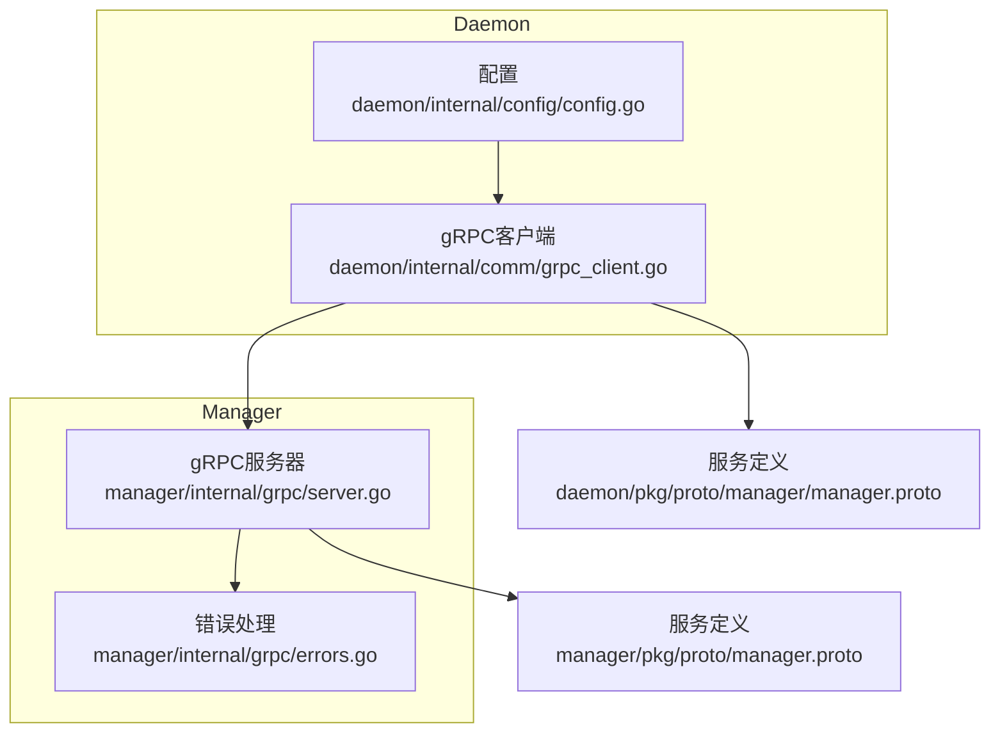
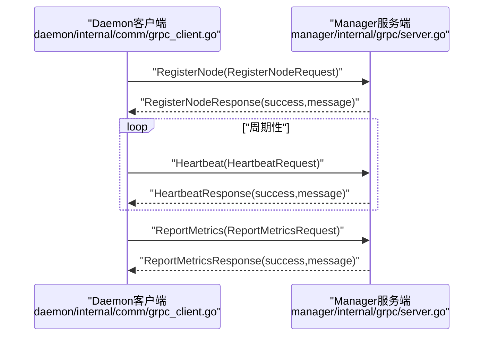
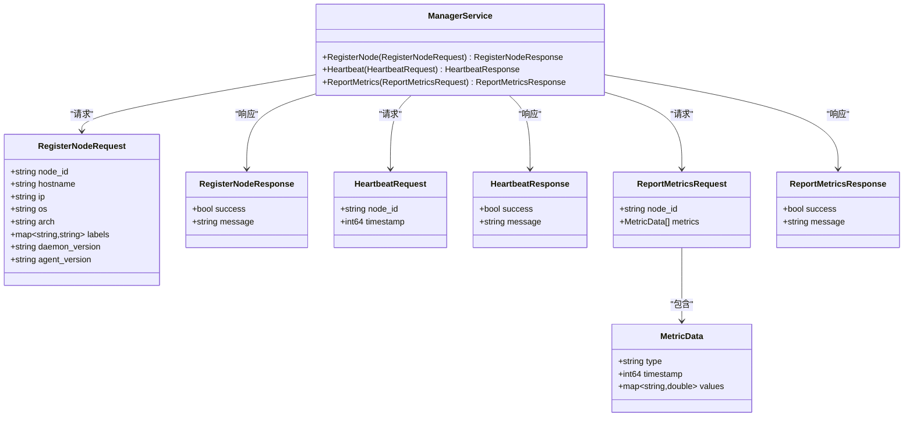
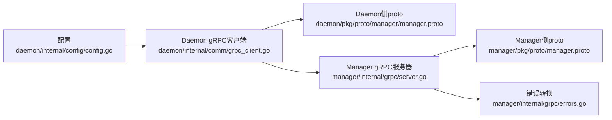

# Manager-Daemon gRPC API

<cite>
**本文引用的文件**
- [manager.proto](file://manager/pkg/proto/manager.proto)
- [manager.proto（Daemon侧）](file://daemon/pkg/proto/manager/manager.proto)
- [GRPC客户端（Daemon侧）](file://daemon/internal/comm/grpc_client.go)
- [gRPC服务器（Manager侧）](file://manager/internal/grpc/server.go)
- [配置（Daemon侧）](file://daemon/internal/config/config.go)
- [错误处理（Manager侧）](file://manager/internal/grpc/errors.go)
- [集成测试（Manager侧）](file://manager/test/integration/manager_integration_test.go)
</cite>

## 目录
1. [简介](#简介)
2. [项目结构](#项目结构)
3. [核心组件](#核心组件)
4. [架构总览](#架构总览)
5. [详细组件分析](#详细组件分析)
6. [依赖关系分析](#依赖关系分析)
7. [性能与可靠性](#性能与可靠性)
8. [故障排查指南](#故障排查指南)
9. [结论](#结论)
10. [附录](#附录)

## 简介
本文件面向Manager与Daemon之间的gRPC通信，基于manager.proto定义的服务与消息，系统化梳理以下内容：
- RegisterNode、Heartbeat、ReportMetrics三个RPC方法的用途、请求参数与响应结构
- 请求/响应消息类型的字段含义与数据类型
- Go语言客户端调用示例（Daemon作为gRPC客户端连接Manager服务）
- 服务端在server.go中的实现逻辑（请求校验、业务处理、错误返回）
- 通信安全配置（TLS）、超时控制与重试机制的实现方式
- 错误码使用场景与错误转换策略

## 项目结构
- 服务定义位于manager/pkg/proto/manager.proto，Daemon侧也有一份同名但属于不同包的定义，用于Daemon侧gRPC客户端调用Manager服务。
- Daemon侧gRPC客户端实现位于daemon/internal/comm/grpc_client.go，负责TLS、KeepAlive、超时、指标上报等。
- Manager侧gRPC服务器实现位于manager/internal/grpc/server.go，负责节点注册、心跳、指标上报的业务处理。
- 配置位于daemon/internal/config/config.go，包含Manager连接地址、TLS、心跳间隔、重连间隔、超时等。
- 错误处理位于manager/internal/grpc/errors.go，提供gRPC错误码到业务错误的转换。

图表来源
- [GRPC客户端（Daemon侧）](file://daemon/internal/comm/grpc_client.go#L1-L253)
- [gRPC服务器（Manager侧）](file://manager/internal/grpc/server.go#L1-L145)
- [manager.proto（Daemon侧）](file://daemon/pkg/proto/manager/manager.proto#L1-L68)
- [manager.proto](file://manager/pkg/proto/manager.proto#L1-L67)
- [配置（Daemon侧）](file://daemon/internal/config/config.go#L1-L499)
- [错误处理（Manager侧）](file://manager/internal/grpc/errors.go#L1-L49)

章节来源
- [manager.proto](file://manager/pkg/proto/manager.proto#L1-L67)
- [manager.proto（Daemon侧）](file://daemon/pkg/proto/manager/manager.proto#L1-L68)
- [GRPC客户端（Daemon侧）](file://daemon/internal/comm/grpc_client.go#L1-L253)
- [gRPC服务器（Manager侧）](file://manager/internal/grpc/server.go#L1-L145)
- [配置（Daemon侧）](file://daemon/internal/config/config.go#L1-L499)
- [错误处理（Manager侧）](file://manager/internal/grpc/errors.go#L1-L49)

## 核心组件
- ManagerService（Manager侧）：提供RegisterNode、Heartbeat、ReportMetrics三个RPC方法。
- RegisterNodeRequest/RegisterNodeResponse：节点注册请求/响应。
- HeartbeatRequest/HeartbeatResponse：心跳请求/响应。
- MetricData/ReportMetricsRequest/ReportMetricsResponse：指标数据与上报请求/响应。
- Daemon作为gRPC客户端（Daemon侧）：负责TLS、KeepAlive、超时、重试、指标转换与上报。
- Manager作为gRPC服务端（Manager侧）：负责请求校验、业务处理、错误返回。

章节来源
- [manager.proto](file://manager/pkg/proto/manager.proto#L1-L67)
- [manager.proto（Daemon侧）](file://daemon/pkg/proto/manager/manager.proto#L1-L68)
- [gRPC服务器（Manager侧）](file://manager/internal/grpc/server.go#L1-L145)
- [GRPC客户端（Daemon侧）](file://daemon/internal/comm/grpc_client.go#L1-L253)

## 架构总览
Daemon侧gRPC客户端通过TLS与KeepAlive参数连接Manager；Daemon侧按配置周期性发送心跳与指标数据；Manager侧gRPC服务器对请求进行业务处理并返回统一的成功/失败响应。

图表来源
- [GRPC客户端（Daemon侧）](file://daemon/internal/comm/grpc_client.go#L103-L142)
- [GRPC客户端（Daemon侧）](file://daemon/internal/comm/grpc_client.go#L144-L175)
- [GRPC客户端（Daemon侧）](file://daemon/internal/comm/grpc_client.go#L177-L247)
- [gRPC服务器（Manager侧）](file://manager/internal/grpc/server.go#L34-L72)
- [gRPC服务器（Manager侧）](file://manager/internal/grpc/server.go#L74-L97)
- [gRPC服务器（Manager侧）](file://manager/internal/grpc/server.go#L99-L144)

## 详细组件分析

### RPC方法与消息类型

- RegisterNode
  - 方法：RegisterNode(RegisterNodeRequest) returns (RegisterNodeResponse)
  - 请求参数（RegisterNodeRequest）
    - node_id: 字符串，节点唯一标识
    - hostname: 字符串，主机名
    - ip: 字符串，IP地址
    - os: 字符串，操作系统
    - arch: 字符串，架构
    - labels: 映射，键值标签
    - daemon_version: 字符串，Daemon版本
    - agent_version: 字符串，Agent版本
  - 响应结构（RegisterNodeResponse）
    - success: 布尔，是否成功
    - message: 字符串，描述信息

- Heartbeat
  - 方法：Heartbeat(HeartbeatRequest) returns (HeartbeatResponse)
  - 请求参数（HeartbeatRequest）
    - node_id: 字符串，节点唯一标识
    - timestamp: 整型，Unix时间戳
  - 响应结构（HeartbeatResponse）
    - success: 布尔，是否成功
    - message: 字符串，描述信息

- ReportMetrics
  - 方法：ReportMetrics(ReportMetricsRequest) returns (ReportMetricsResponse)
  - 请求参数（ReportMetricsRequest）
    - node_id: 字符串，节点唯一标识
    - metrics: 数组，MetricData元素
  - MetricData
    - type: 字符串，指标类型（如cpu、memory、disk、network）
    - timestamp: 整型，Unix时间戳
    - values: 映射，键值对数值（double）
  - 响应结构（ReportMetricsResponse）
    - success: 布尔，是否成功
    - message: 字符串，描述信息

章节来源
- [manager.proto](file://manager/pkg/proto/manager.proto#L1-L67)
- [manager.proto（Daemon侧）](file://daemon/pkg/proto/manager/manager.proto#L1-L68)

### Daemon侧gRPC客户端（Go示例）

- 连接Manager（含TLS与KeepAlive）
  - 当配置中提供证书文件时，加载客户端证书与CA证书，启用TLS 1.3；否则使用不安全连接。
  - 设置KeepAlive参数：周期10秒、超时3秒、允许无流保活。
  - 建立连接并初始化ManagerServiceClient。

- Register（节点注册）
  - 构造RegisterNodeRequest，填充节点信息与版本信息。
  - 调用RegisterNode，若响应success=false，记录错误并返回。

- Heartbeat（心跳）
  - 构造HeartbeatRequest，填充node_id与当前时间戳。
  - 调用Heartbeat，若响应success=false，记录警告并返回。

- ReportMetrics（指标上报）
  - 将内部指标类型转换为MetricData数组，values做数值类型归一化（float64）。
  - 构造ReportMetricsRequest，填充node_id与metrics。
  - 调用ReportMetrics，若响应success=false，记录警告并返回。

- 超时控制
  - 客户端在调用RPC时使用context.WithTimeout控制单次调用超时（默认30秒）。

- 重试机制
  - 代码中未见内置重试逻辑；建议在上层调用处结合指数退避策略进行重试（参考设计文档中的重试函数）。

章节来源
- [GRPC客户端（Daemon侧）](file://daemon/internal/comm/grpc_client.go#L41-L93)
- [GRPC客户端（Daemon侧）](file://daemon/internal/comm/grpc_client.go#L103-L142)
- [GRPC客户端（Daemon侧）](file://daemon/internal/comm/grpc_client.go#L144-L175)
- [GRPC客户端（Daemon侧）](file://daemon/internal/comm/grpc_client.go#L177-L247)
- [配置（Daemon侧）](file://daemon/internal/config/config.go#L190-L215)

### Manager侧gRPC服务器（实现逻辑）

- RegisterNode
  - 记录请求日志（node_id、hostname、ip）
  - 构建Node模型（包含labels、daemon_version、agent_version等）
  - 调用NodeService.Register，若失败返回失败响应；成功返回成功响应

- Heartbeat
  - 记录心跳日志（node_id、timestamp）
  - 调用NodeService.Heartbeat，若失败返回失败响应；成功返回成功响应

- ReportMetrics
  - 记录指标上报日志（node_id、数量）
  - 将请求中的MetricData批量转换为Model.Metrics（values转为map[string]interface{}）
  - 调用MetricsService.BatchCreate，若失败返回失败响应；成功返回成功响应

- 错误处理
  - 服务端返回统一的success/message结构，便于客户端识别业务错误。
  - 错误转换（Manager侧gRPC错误码到业务错误）：见“错误处理（Manager侧）”。

章节来源
- [gRPC服务器（Manager侧）](file://manager/internal/grpc/server.go#L34-L72)
- [gRPC服务器（Manager侧）](file://manager/internal/grpc/server.go#L74-L97)
- [gRPC服务器（Manager侧）](file://manager/internal/grpc/server.go#L99-L144)
- [错误处理（Manager侧）](file://manager/internal/grpc/errors.go#L1-L49)

### 类图（消息与服务）

图表来源
- [manager.proto](file://manager/pkg/proto/manager.proto#L1-L67)
- [manager.proto（Daemon侧）](file://daemon/pkg/proto/manager/manager.proto#L1-L68)

## 依赖关系分析

- 服务定义
  - Manager侧与Daemon侧均包含manager.proto定义，二者兼容，Daemon侧使用daemon/pkg/proto/manager/manager.proto以避免依赖Manager模块。
- 客户端与服务端
  - Daemon侧gRPC客户端依赖TLS配置与KeepAlive参数，连接Manager服务端。
  - Manager侧gRPC服务器依赖NodeService与MetricsService进行业务处理。
- 错误处理
  - Manager侧提供gRPC错误码到业务错误的转换，便于上层统一处理。

图表来源
- [GRPC客户端（Daemon侧）](file://daemon/internal/comm/grpc_client.go#L1-L253)
- [配置（Daemon侧）](file://daemon/internal/config/config.go#L1-L499)
- [gRPC服务器（Manager侧）](file://manager/internal/grpc/server.go#L1-L145)
- [manager.proto（Daemon侧）](file://daemon/pkg/proto/manager/manager.proto#L1-L68)
- [manager.proto](file://manager/pkg/proto/manager.proto#L1-L67)
- [错误处理（Manager侧）](file://manager/internal/grpc/errors.go#L1-L49)

章节来源
- [manager.proto](file://manager/pkg/proto/manager.proto#L1-L67)
- [manager.proto（Daemon侧）](file://daemon/pkg/proto/manager/manager.proto#L1-L68)
- [GRPC客户端（Daemon侧）](file://daemon/internal/comm/grpc_client.go#L1-L253)
- [gRPC服务器（Manager侧）](file://manager/internal/grpc/server.go#L1-L145)
- [配置（Daemon侧）](file://daemon/internal/config/config.go#L1-L499)
- [错误处理（Manager侧）](file://manager/internal/grpc/errors.go#L1-L49)

## 性能与可靠性

- 通信安全（TLS）
  - Daemon侧gRPC客户端在配置中提供证书文件时启用TLS 1.3；否则使用不安全连接。建议生产环境配置TLS证书与CA文件。
- KeepAlive
  - 客户端设置KeepAlive周期为10秒、超时为3秒、允许无流保活，有助于检测网络异常与维持长连接。
- 超时控制
  - 客户端在调用RPC时使用context.WithTimeout控制单次调用超时（默认30秒）。建议根据网络状况与业务需求调整。
- 指标上报性能
  - 指标转换时对values进行数值类型归一化，避免非数值导致的数据丢失；批量上报有利于减少RPC次数。
- 重试机制
  - 代码中未内置重试；可在上层调用处实现指数退避重试（参考设计文档中的重试函数）。

章节来源
- [GRPC客户端（Daemon侧）](file://daemon/internal/comm/grpc_client.go#L41-L93)
- [配置（Daemon侧）](file://daemon/internal/config/config.go#L190-L215)
- [集成测试（Manager侧）](file://manager/test/integration/manager_integration_test.go#L1-L386)

## 故障排查指南

- TLS连接失败
  - 检查证书文件路径与权限；确认CA证书可被解析；生产环境务必启用TLS。
- 连接断开或超时
  - 检查KeepAlive参数与网络质量；确认Manager服务端可正常响应；适当增大超时时间。
- 注册失败
  - 查看RegisterNodeResponse.message；确认node_id、hostname、ip等字段有效。
- 心跳失败
  - 查看HeartbeatResponse.message；确认node_id存在且未过期。
- 指标上报失败
  - 查看ReportMetricsResponse.message；确认metrics数组非空且values为数值类型。
- 错误码与业务错误转换
  - Manager侧提供gRPC错误码到业务错误的转换，便于统一处理（如NotFound、InvalidArgument、DeadlineExceeded、Unavailable等）。

章节来源
- [gRPC服务器（Manager侧）](file://manager/internal/grpc/server.go#L34-L144)
- [错误处理（Manager侧）](file://manager/internal/grpc/errors.go#L1-L49)
- [GRPC客户端（Daemon侧）](file://daemon/internal/comm/grpc_client.go#L103-L142)
- [GRPC客户端（Daemon侧）](file://daemon/internal/comm/grpc_client.go#L144-L175)
- [GRPC客户端（Daemon侧）](file://daemon/internal/comm/grpc_client.go#L177-L247)

## 结论
本文基于manager.proto定义，系统梳理了Manager与Daemon之间的gRPC API，覆盖了RegisterNode、Heartbeat、ReportMetrics三类RPC方法的用途、参数与响应，以及Daemon侧客户端与Manager侧服务端的实现要点。同时提供了TLS、KeepAlive、超时与重试的实践建议，并结合错误处理与集成测试场景给出故障排查思路，帮助读者在实际部署中构建稳定可靠的监控与运维体系。

## 附录

### API定义与字段说明（摘要）

- RegisterNode
  - 请求：node_id、hostname、ip、os、arch、labels、daemon_version、agent_version
  - 响应：success、message

- Heartbeat
  - 请求：node_id、timestamp
  - 响应：success、message

- ReportMetrics
  - 请求：node_id、metrics（MetricData[]）
  - MetricData：type、timestamp、values（键值对数值）
  - 响应：success、message

章节来源
- [manager.proto](file://manager/pkg/proto/manager.proto#L1-L67)
- [manager.proto（Daemon侧）](file://daemon/pkg/proto/manager/manager.proto#L1-L68)