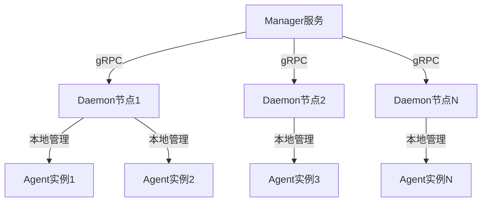
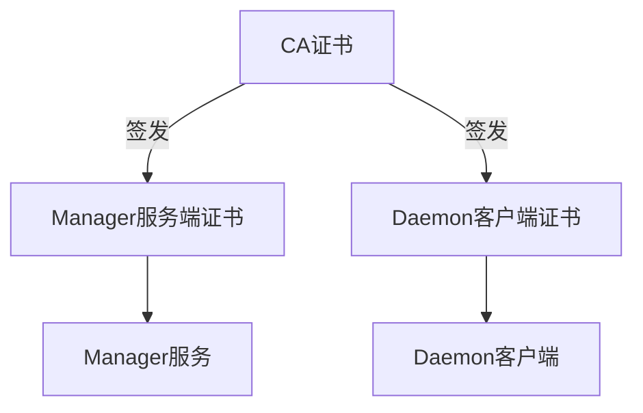
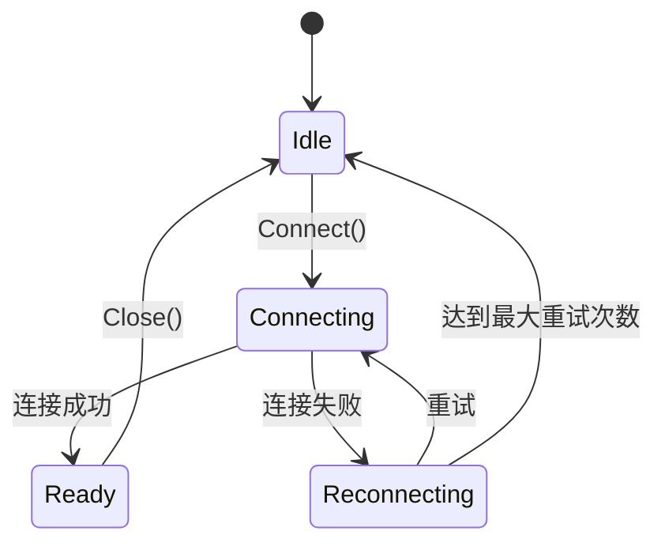

# gRPC API

<cite>
**本文档引用的文件**   
- [manager.proto](file://manager/pkg/proto/manager.proto)
- [daemon.proto](file://manager/pkg/proto/daemon/daemon.proto)
- [manager.proto](file://daemon/pkg/proto/manager/manager.proto)
- [daemon.proto](file://daemon/pkg/proto/daemon.proto)
- [server.go](file://manager/internal/grpc/server.go)
- [daemon_client.go](file://manager/internal/grpc/daemon_client.go)
- [server.go](file://daemon/internal/grpc/server.go)
- [manager_client.go](file://daemon/internal/grpc/manager_client.go)
- [config.go](file://manager/internal/config/config.go)
- [config.go](file://daemon/internal/config/config.go)
</cite>

## 目录
1. [系统架构概述](#系统架构概述)
2. [Manager与Daemon之间的gRPC服务](#manager与daemon之间的grpc服务)
3. [Daemon与Agent之间的gRPC服务](#daemon与agent之间的grpc服务)
4. [Go客户端调用示例](#go客户端调用示例)
5. [gRPC通信安全配置](#grpc通信安全配置)
6. [超时设置与错误处理](#超时设置与错误处理)
7. [服务注册与实现](#服务注册与实现)

## 系统架构概述

本系统采用三层架构：Manager（管理节点）、Daemon（守护进程）和Agent（代理）。Manager作为中心控制节点，通过gRPC与各个Daemon节点通信。每个Daemon节点管理其所在主机上的多个Agent实例，并通过gRPC向Manager上报状态和指标。



**Diagram sources**
- [manager.proto](file://manager/pkg/proto/manager.proto)
- [daemon.proto](file://manager/pkg/proto/daemon/daemon.proto)

**Section sources**
- [manager/pkg/proto/manager.proto](file://manager/pkg/proto/manager.proto)
- [manager/pkg/proto/daemon/daemon.proto](file://manager/pkg/proto/daemon/daemon.proto)

## Manager与Daemon之间的gRPC服务

Manager服务定义了三个核心RPC方法，用于节点注册、心跳上报和指标上报。这些方法在`manager/pkg/proto/manager.proto`中定义，并在`manager/internal/grpc/server.go`中实现。

### 服务定义

```protobuf
service ManagerService {
  rpc RegisterNode(RegisterNodeRequest) returns (RegisterNodeResponse);
  rpc Heartbeat(HeartbeatRequest) returns (HeartbeatResponse);
  rpc ReportMetrics(ReportMetricsRequest) returns (ReportMetricsResponse);
}
```

### RPC方法详情

#### RegisterNode 节点注册

**请求参数 (RegisterNodeRequest):**
- `node_id` (string): 节点唯一标识符
- `hostname` (string): 主机名
- `ip` (string): IP地址
- `os` (string): 操作系统
- `arch` (string): 架构
- `labels` (map<string, string>): 节点标签
- `daemon_version` (string): Daemon版本
- `agent_version` (string): Agent版本

**响应类型 (RegisterNodeResponse):**
- `success` (bool): 是否成功
- `message` (string): 响应消息

**可能的错误码:**
- `InvalidArgument`: 请求参数无效
- `Internal`: 内部服务器错误

**Section sources**
- [manager/pkg/proto/manager.proto](file://manager/pkg/proto/manager.proto#L9-L11)
- [manager/internal/grpc/server.go](file://manager/internal/grpc/server.go#L34-L72)

#### Heartbeat 心跳上报

**请求参数 (HeartbeatRequest):**
- `node_id` (string): 节点ID
- `timestamp` (int64): 时间戳

**响应类型 (HeartbeatResponse):**
- `success` (bool): 是否成功
- `message` (string): 响应消息

**可能的错误码:**
- `InvalidArgument`: 请求参数无效
- `NotFound`: 节点未找到
- `Internal`: 内部服务器错误

**Section sources**
- [manager/pkg/proto/manager.proto](file://manager/pkg/proto/manager.proto#L12-L14)
- [manager/internal/grpc/server.go](file://manager/internal/grpc/server.go#L74-L97)

#### ReportMetrics 指标上报

**请求参数 (ReportMetricsRequest):**
- `node_id` (string): 节点ID
- `metrics` (repeated MetricData): 指标数据列表

**MetricData 消息:**
- `type` (string): 指标类型 (cpu, memory, disk, network)
- `timestamp` (int64): 时间戳
- `values` (map<string, double>): 指标值

**响应类型 (ReportMetricsResponse):**
- `success` (bool): 是否成功
- `message` (string): 响应消息

**可能的错误码:**
- `InvalidArgument`: 请求参数无效
- `Internal`: 内部服务器错误

**Section sources**
- [manager/pkg/proto/manager.proto](file://manager/pkg/proto/manager.proto#L15-L17)
- [manager/internal/grpc/server.go](file://manager/internal/grpc/server.go#L99-L144)

## Daemon与Agent之间的gRPC服务

Daemon服务定义了多个RPC方法，用于管理Agent实例、获取配置和上报状态。这些方法在`manager/pkg/proto/daemon/daemon.proto`中定义，并在`daemon/internal/grpc/server.go`中实现。

### 服务定义

```protobuf
service DaemonService {
  rpc Register(RegisterRequest) returns (RegisterResponse);
  rpc Heartbeat(HeartbeatRequest) returns (HeartbeatResponse);
  rpc ReportMetrics(MetricsRequest) returns (MetricsResponse);
  rpc GetConfig(ConfigRequest) returns (ConfigResponse);
  rpc PushUpdate(UpdateRequest) returns (UpdateResponse);
  rpc ListAgents(ListAgentsRequest) returns (ListAgentsResponse);
  rpc OperateAgent(AgentOperationRequest) returns (AgentOperationResponse);
  rpc GetAgentMetrics(AgentMetricsRequest) returns (AgentMetricsResponse);
  rpc SyncAgentStates(SyncAgentStatesRequest) returns (SyncAgentStatesResponse);
}
```

### RPC方法详情

#### ListAgents 列举所有Agent

**请求参数 (ListAgentsRequest):**
- 无参数

**响应类型 (ListAgentsResponse):**
- `agents` (repeated AgentInfo): Agent信息列表

**AgentInfo 消息:**
- `id` (string): Agent唯一标识符
- `type` (string): Agent类型
- `status` (string): 运行状态
- `pid` (int32): 进程ID
- `version` (string): 版本号
- `start_time` (int64): 启动时间
- `restart_count` (int32): 重启次数
- `last_heartbeat` (int64): 最后心跳时间

**可能的错误码:**
- `Internal`: 内部服务器错误

**Section sources**
- [manager/pkg/proto/daemon/daemon.proto](file://manager/pkg/proto/daemon/daemon.proto#L24-L25)
- [daemon/internal/grpc/server.go](file://daemon/internal/grpc/server.go#L37-L67)

#### OperateAgent 操作Agent

**请求参数 (AgentOperationRequest):**
- `agent_id` (string): Agent ID
- `operation` (string): 操作类型 ("start", "stop", "restart")

**响应类型 (AgentOperationResponse):**
- `success` (bool): 是否成功
- `error_message` (string): 错误消息

**可能的错误码:**
- `InvalidArgument`: 请求参数无效
- `NotFound`: Agent未找到
- `Internal`: 内部服务器错误

**Section sources**
- [manager/pkg/proto/daemon/daemon.proto](file://manager/pkg/proto/daemon/daemon.proto#L27-L28)
- [daemon/internal/grpc/server.go](file://daemon/internal/grpc/server.go#L69-L124)

#### GetAgentMetrics 获取Agent资源使用指标

**请求参数 (AgentMetricsRequest):**
- `agent_id` (string): Agent ID
- `duration_seconds` (int64): 查询时间范围（秒）

**响应类型 (AgentMetricsResponse):**
- `agent_id` (string): Agent ID
- `data_points` (repeated ResourceDataPoint): 资源使用数据点

**ResourceDataPoint 消息:**
- `timestamp` (int64): 时间戳
- `cpu` (double): CPU使用率
- `memory_rss` (uint64): 内存占用RSS
- `memory_vms` (uint64): 内存占用VMS
- `disk_read_bytes` (uint64): 磁盘读取字节数
- `disk_write_bytes` (uint64): 磁盘写入字节数
- `open_files` (int32): 打开文件数

**可能的错误码:**
- `InvalidArgument`: 请求参数无效
- `NotFound`: Agent未找到
- `Internal`: 内部服务器错误

**Section sources**
- [manager/pkg/proto/daemon/daemon.proto](file://manager/pkg/proto/daemon/daemon.proto#L30-L31)
- [daemon/internal/grpc/server.go](file://daemon/internal/grpc/server.go#L126-L170)

#### SyncAgentStates 同步Agent状态

**请求参数 (SyncAgentStatesRequest):**
- `node_id` (string): 节点ID
- `states` (repeated AgentState): Agent状态列表

**AgentState 消息:**
- `agent_id` (string): Agent ID
- `status` (string): 运行状态
- `pid` (int32): 进程ID
- `last_heartbeat` (int64): 最后心跳时间

**响应类型 (SyncAgentStatesResponse):**
- `success` (bool): 是否成功
- `message` (string): 响应消息

**可能的错误码:**
- `InvalidArgument`: 请求参数无效
- `Internal`: 内部服务器错误

**Section sources**
- [manager/pkg/proto/daemon/daemon.proto](file://manager/pkg/proto/daemon/daemon.proto#L33-L35)
- [daemon/internal/grpc/server.go](file://daemon/internal/grpc/server.go#L172-L211)

## Go客户端调用示例

以下示例展示了如何使用Go客户端调用gRPC服务。

### 建立连接

```go
// 创建Daemon客户端连接池
clientPool := grpc.NewDaemonClientPool(logger)

// 获取特定节点的客户端
client, err := clientPool.GetClient(nodeID, daemonAddress)
if err != nil {
    log.Fatal("无法获取客户端:", err)
}
```

**Section sources**
- [manager/internal/grpc/daemon_client.go](file://manager/internal/grpc/daemon_client.go#L304-L354)

### 调用远程方法

```go
// 列举所有Agent
agents, err := client.ListAgents(ctx, nodeID)
if err != nil {
    log.Printf("获取Agent列表失败: %v", err)
    return
}

// 操作Agent（启动）
err = client.OperateAgent(ctx, nodeID, agentID, "start")
if err != nil {
    log.Printf("启动Agent失败: %v", err)
    return
}

// 获取Agent指标
duration := 1 * time.Hour
metrics, err := client.GetAgentMetrics(ctx, nodeID, agentID, duration)
if err != nil {
    log.Printf("获取Agent指标失败: %v", err)
    return
}
```

**Section sources**
- [manager/internal/grpc/daemon_client.go](file://manager/internal/grpc/daemon_client.go#L139-L284)

### 处理流式响应

本系统当前未使用流式gRPC，所有方法均为简单RPC调用。

## gRPC通信安全配置

系统支持TLS加密通信，同时提供非安全连接选项用于开发环境。

### TLS配置

**Manager端配置 (manager/internal/config/config.go):**
- `GRPC.TLS.Enabled`: 是否启用TLS
- `GRPC.TLS.CertFile`: 证书文件路径
- `GRPC.TLS.KeyFile`: 私钥文件路径
- `GRPC.TLS.CAFile`: CA证书文件路径

**Daemon端配置 (daemon/internal/config/config.go):**
- `Manager.TLS.CertFile`: 客户端证书文件路径
- `Manager.TLS.KeyFile`: 客户端私钥文件路径
- `Manager.TLS.CAFile`: CA证书文件路径

### 证书生成

系统提供脚本`daemon/scripts/generate-test-certs.sh`用于生成测试证书，包括CA证书、服务端证书（Manager）和客户端证书（Daemon）。



**Diagram sources**
- [daemon/scripts/generate-test-certs.sh](file://daemon/scripts/generate-test-certs.sh)
- [daemon/internal/config/config.go](file://daemon/internal/config/config.go#L34-L47)

**Section sources**
- [daemon/scripts/generate-test-certs.sh](file://daemon/scripts/generate-test-certs.sh)
- [daemon/internal/config/config.go](file://daemon/internal/config/config.go#L34-L47)

## 超时设置与错误处理

### 超时设置

**Manager端 (manager/internal/config/config.go):**
- `Server.ReadTimeout`: HTTP读取超时（默认30秒）
- `Server.WriteTimeout`: HTTP写入超时（默认30秒）

**Daemon端 (daemon/internal/config/config.go):**
- `Manager.Timeout`: gRPC调用超时（默认30秒）
- `Manager.HeartbeatInterval`: 心跳间隔（默认60秒）
- `Manager.ReconnectInterval`: 重连间隔（默认10秒）

### 错误处理机制

系统使用gRPC标准错误码进行错误处理：

- `codes.InvalidArgument`: 请求参数无效
- `codes.NotFound`: 资源未找到
- `codes.Internal`: 内部服务器错误
- `codes.Unavailable`: 服务不可用

客户端实现中包含连接重试机制，当连接断开时会自动尝试重连。



**Diagram sources**
- [manager/internal/grpc/daemon_client.go](file://manager/internal/grpc/daemon_client.go#L74-L137)
- [manager/internal/config/config.go](file://manager/internal/config/config.go#L26-L27)

**Section sources**
- [manager/internal/grpc/daemon_client.go](file://manager/internal/grpc/daemon_client.go#L74-L137)
- [manager/internal/config/config.go](file://manager/internal/config/config.go#L26-L27)

## 服务注册与实现

### Manager服务实现

Manager服务在`manager/internal/grpc/server.go`中实现，主要功能包括：

- `RegisterNode`: 注册节点到数据库
- `Heartbeat`: 更新节点心跳时间
- `ReportMetrics`: 批量保存指标数据

服务通过`NewServer`函数创建，并在`main.go`中注册到gRPC服务器。

**Section sources**
- [manager/internal/grpc/server.go](file://manager/internal/grpc/server.go#L14-L145)

### Daemon服务实现

Daemon服务在`daemon/internal/grpc/server.go`中实现，主要功能包括：

- `ListAgents`: 列出所有Agent实例
- `OperateAgent`: 操作Agent（启动/停止/重启）
- `GetAgentMetrics`: 获取Agent资源使用指标
- `SyncAgentStates`: 同步Agent状态到Manager

服务通过`NewServer`函数创建，并在`daemon.go`中启动。

**Section sources**
- [daemon/internal/grpc/server.go](file://daemon/internal/grpc/server.go#L15-L255)

### 客户端实现

#### Manager到Daemon客户端

Manager通过`manager/internal/grpc/daemon_client.go`中的`DaemonClient`结构体调用Daemon服务。客户端实现包含连接池管理、自动重连和超时控制。

#### Daemon到Manager客户端

Daemon通过`daemon/internal/grpc/manager_client.go`中的`ManagerClient`结构体调用Manager服务。客户端支持TLS加密和keepalive配置。

**Section sources**
- [manager/internal/grpc/daemon_client.go](file://manager/internal/grpc/daemon_client.go#L27-L398)
- [daemon/internal/grpc/manager_client.go](file://daemon/internal/grpc/manager_client.go#L25-L155)