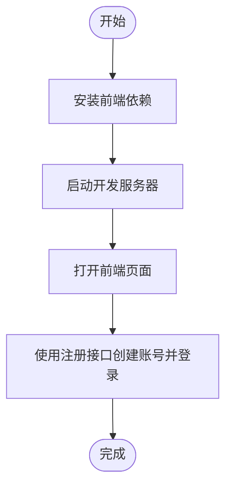

# 快速入门

<cite>
**本文引用的文件**
- [QUICKSTART.md](file://QUICKSTART.md)
- [agent/QUICKSTART.md](file://agent/QUICKSTART.md)
- [web/QUICKSTART.md](file://web/QUICKSTART.md)
- [manager/Makefile](file://manager/Makefile)
- [daemon/Makefile](file://daemon/Makefile)
- [agent/Makefile](file://agent/Makefile)
- [podman-compose.yml](file://podman-compose.yml)
- [config/mysql/schema.sql](file://config/mysql/schema.sql)
- [manager/configs/manager.dev.yaml](file://manager/configs/manager.dev.yaml)
- [daemon/configs/daemon.dev.yaml](file://daemon/configs/daemon.dev.yaml)
- [manager/cmd/manager/main.go](file://manager/cmd/manager/main.go)
- [agent/cmd/agent/main.go](file://agent/cmd/agent/main.go)
</cite>

## 目录
1. [简介](#简介)
2. [项目结构](#项目结构)
3. [核心组件](#核心组件)
4. [架构总览](#架构总览)
5. [详细组件分析](#详细组件分析)
6. [依赖关系分析](#依赖关系分析)
7. [性能注意事项](#性能注意事项)
8. [故障排查指南](#故障排查指南)
9. [结论](#结论)
10. [附录](#附录)

## 简介
本指南面向首次接触 ops-scaffold-framework 的开发者，目标是在 5 分钟内完成从零到看到系统运行的全流程：克隆仓库、准备数据库、构建并启动 Manager/Agent/Daemon 服务、访问 Web 前端并完成登录。我们将聚焦于 QUICKSTART.md 中的关键步骤，并给出清晰的命令行示例与预期行为说明，帮助你在最短时间内验证系统可用性。

## 项目结构
该仓库采用多模块结构，包含 Manager（后端 API 与 gRPC）、Daemon（节点侧代理）、Agent（采集与上报）、Web 前端以及数据库初始化脚本。Podman Compose 提供了可选的一键拉起 MySQL 与 Daemon 节点的容器编排方案。

```mermaid
graph TB
subgraph "后端服务"
M["Manager<br/>HTTP + gRPC"]
D["Daemon<br/>节点代理"]
end
subgraph "采集与上报"
A1["Agent-001"]
A2["Agent-002"]
A3["Agent-003"]
end
subgraph "前端"
W["Web 前端"]
end
subgraph "基础设施"
DB["MySQL"]
end
W --> M
M <- --> D
D --> A1
D --> A2
D --> A3
M --> DB
```

图表来源
- [manager/cmd/manager/main.go](file://manager/cmd/manager/main.go#L146-L211)
- [agent/cmd/agent/main.go](file://agent/cmd/agent/main.go#L62-L101)
- [podman-compose.yml](file://podman-compose.yml#L23-L61)

章节来源
- [QUICKSTART.md](file://QUICKSTART.md#L1-L120)
- [podman-compose.yml](file://podman-compose.yml#L1-L61)

## 核心组件
- Manager：提供 HTTP API 与 gRPC 服务，负责用户、节点、指标、任务等管理能力；内置健康检查接口与数据库自动迁移。
- Daemon：作为节点侧代理，负责与 Manager 建立 gRPC 连接、管理本地 Agent 进程、周期性心跳上报与资源采集。
- Agent：每个节点上的采集器，提供健康检查、指标查询与配置重载等 HTTP 接口。
- Web 前端：基于 Vite + React 的管理界面，通过代理访问 Manager 的 API。

章节来源
- [manager/cmd/manager/main.go](file://manager/cmd/manager/main.go#L146-L211)
- [agent/cmd/agent/main.go](file://agent/cmd/agent/main.go#L62-L101)
- [web/QUICKSTART.md](file://web/QUICKSTART.md#L1-L60)

## 架构总览
下图展示了 Manager、Daemon、Agent 与 Web 前端之间的交互关系，以及数据流向（认证、心跳、指标上报与查询）。


图表来源
- [manager/cmd/manager/main.go](file://manager/cmd/manager/main.go#L146-L211)
- [agent/cmd/agent/main.go](file://agent/cmd/agent/main.go#L62-L101)

## 详细组件分析

### Manager 快速启动
- 前置要求：Go 1.21+、MySQL 8.0+、可选 Redis。
- 步骤概览：
  1) 进入 manager 目录，安装依赖与构建。
  2) 准备数据库（创建数据库、导入 schema）。
  3) 启动 Manager（开发模式）。
  4) 通过注册接口创建首个用户。
  5) 访问 Web 前端进行登录与验证。


图表来源
- [manager/Makefile](file://manager/Makefile#L75-L92)
- [config/mysql/schema.sql](file://config/mysql/schema.sql#L1-L5)
- [manager/cmd/manager/main.go](file://manager/cmd/manager/main.go#L146-L151)

章节来源
- [QUICKSTART.md](file://QUICKSTART.md#L12-L36)
- [manager/Makefile](file://manager/Makefile#L75-L92)
- [manager/configs/manager.dev.yaml](file://manager/configs/manager.dev.yaml#L1-L20)

### Daemon 快速启动
- 前置要求：确保 Manager 已启动（或以独立模式运行）。
- 步骤概览：
  1) 构建 Daemon。
  2) 使用 Makefile 的 run 目标启动（或使用 Podman Compose 同步拉起多个节点）。
  3) 验证 Daemon 健康状态与日志。


图表来源
- [daemon/Makefile](file://daemon/Makefile#L96-L100)
- [podman-compose.yml](file://podman-compose.yml#L94-L165)

章节来源
- [QUICKSTART.md](file://QUICKSTART.md#L120-L160)
- [daemon/Makefile](file://daemon/Makefile#L96-L100)
- [daemon/configs/daemon.dev.yaml](file://daemon/configs/daemon.dev.yaml#L1-L20)

### Agent 快速启动
- 前置要求：Daemon 已启动并创建 Unix Socket。
- 步骤概览：
  1) 构建 Agent。
  2) 使用脚本批量启动多个 Agent（agent-001/002/003）。
  3) 验证各 Agent 的健康检查与指标接口。
  4) 查看日志与 PID 文件。


图表来源
- [agent/Makefile](file://agent/Makefile#L7-L10)
- [agent/QUICKSTART.md](file://agent/QUICKSTART.md#L18-L36)

章节来源
- [agent/QUICKSTART.md](file://agent/QUICKSTART.md#L1-L60)
- [agent/Makefile](file://agent/Makefile#L7-L10)

### Web 前端快速启动
- 前置要求：Manager 已启动，MySQL 已就绪。
- 步骤概览：
  1) 安装前端依赖。
  2) 启动开发服务器。
  3) 在浏览器打开前端页面，使用 Manager 的注册接口创建账号后登录。



图表来源
- [web/QUICKSTART.md](file://web/QUICKSTART.md#L1-L40)

章节来源
- [web/QUICKSTART.md](file://web/QUICKSTART.md#L1-L60)

## 依赖关系分析
- Manager 依赖 MySQL（开发配置中默认连接本地数据库）。
- Daemon 与 Manager 通过 gRPC 通信；Agent 通过 Unix Socket 与 Daemon 通信。
- Web 前端通过代理访问 Manager 的 API。


图表来源
- [manager/cmd/manager/main.go](file://manager/cmd/manager/main.go#L226-L245)
- [agent/cmd/agent/main.go](file://agent/cmd/agent/main.go#L62-L101)
- [manager/configs/manager.dev.yaml](file://manager/configs/manager.dev.yaml#L12-L18)

章节来源
- [manager/cmd/manager/main.go](file://manager/cmd/manager/main.go#L226-L245)
- [agent/cmd/agent/main.go](file://agent/cmd/agent/main.go#L62-L101)

## 性能注意事项
- 开发模式下，Manager 的数据库日志级别较高，便于调试但可能影响性能；生产环境建议调整日志级别与连接池参数。
- Daemon 的采集器间隔在开发配置中较短，便于观察效果；生产环境可根据资源占用调优。
- 前端开发服务器仅用于本地调试，生产部署请参考 Web 文档中的构建与 Nginx 配置。

章节来源
- [manager/configs/manager.dev.yaml](file://manager/configs/manager.dev.yaml#L12-L20)
- [daemon/configs/daemon.dev.yaml](file://daemon/configs/daemon.dev.yaml#L40-L55)
- [web/QUICKSTART.md](file://web/QUICKSTART.md#L125-L159)

## 故障排查指南
- 前端“网络连接失败”：检查 Manager 是否运行、API 地址配置、端口占用情况。
- 数据库连接失败：确认 MySQL 服务已启动、数据库已创建、凭据正确。
- 登录失败：“用户名或密码错误”：确认用户存在且状态正常，或通过注册接口创建新用户。
- Agent 启动失败：检查 Daemon 是否运行、Unix Socket 是否存在、端口是否被占用。
- 健康检查与登录验证：使用提供的 curl 命令验证 Manager 的健康状态与登录接口。

章节来源
- [QUICKSTART.md](file://QUICKSTART.md#L103-L191)
- [agent/QUICKSTART.md](file://agent/QUICKSTART.md#L151-L199)

## 结论
通过本快速入门指南，你可以在 5 分钟内完成从环境准备到系统可见的全流程。建议在体验完基本功能后，继续阅读各模块的 README 与设计文档，逐步完善数据库与配置，再进入更深入的开发与部署阶段。

## 附录
- 数据库初始化脚本：用于创建开发数据库与字符集设置。
- Podman Compose：一键拉起 MySQL 与多个 Daemon 节点，便于快速验证多节点场景。
- 配置文件位置：
  - Manager 开发配置：manager/configs/manager.dev.yaml
  - Daemon 开发配置：daemon/configs/daemon.dev.yaml

章节来源
- [config/mysql/schema.sql](file://config/mysql/schema.sql#L1-L5)
- [podman-compose.yml](file://podman-compose.yml#L23-L61)
- [manager/configs/manager.dev.yaml](file://manager/configs/manager.dev.yaml#L1-L20)
- [daemon/configs/daemon.dev.yaml](file://daemon/configs/daemon.dev.yaml#L1-L20)