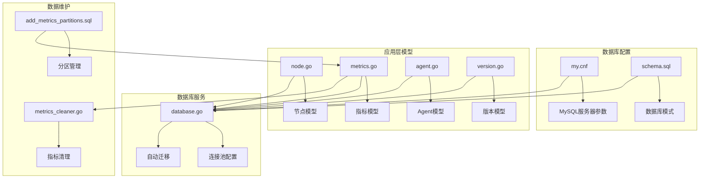
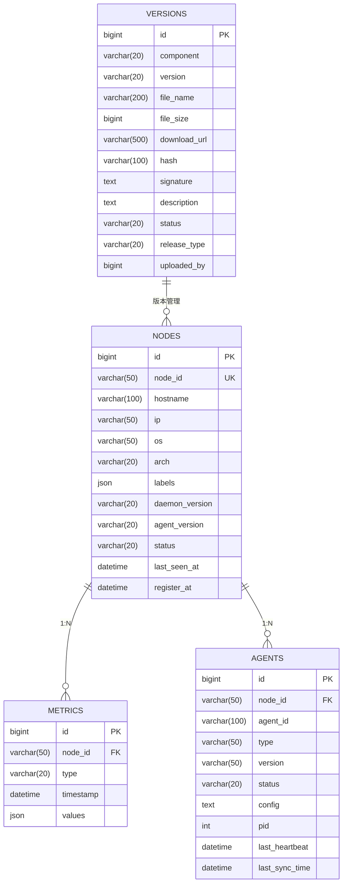
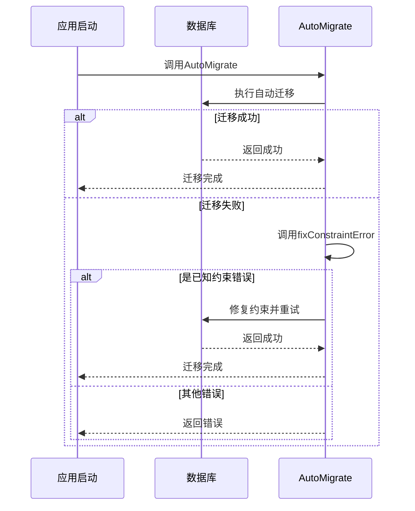
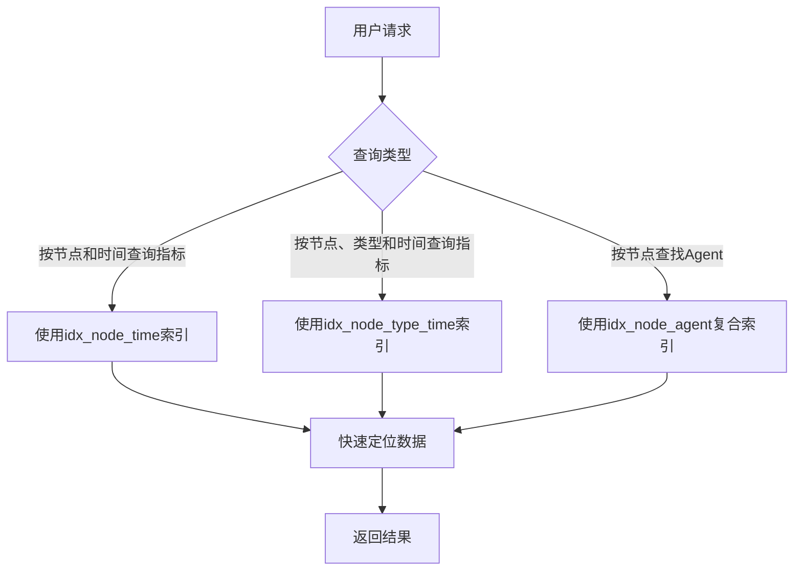

# 数据库设计

<cite>
**本文档引用的文件**   
- [schema.sql](file://config/mysql/schema.sql)
- [my.cnf](file://config/mysql/my.cnf)
- [database.go](file://manager/pkg/database/database.go)
- [node.go](file://manager/internal/model/node.go)
- [metrics.go](file://manager/internal/model/metrics.go)
- [agent.go](file://manager/internal/model/agent.go)
- [version.go](file://manager/internal/model/version.go)
- [config.go](file://manager/internal/config/config.go)
- [add_metrics_partitions.sql](file://manager/migrations/add_metrics_partitions.sql)
- [metrics_cleaner.go](file://manager/internal/service/metrics_cleaner.go)
</cite>

## 目录
1. [项目结构](#项目结构)
2. [核心数据表结构](#核心数据表结构)
3. [表间关系与数据生命周期](#表间关系与数据生命周期)
4. [数据库迁移与连接池配置](#数据库迁移与连接池配置)
5. [性能优化措施](#性能优化措施)

## 项目结构

本项目采用模块化设计，数据库相关配置和模型分布在不同目录中。核心数据库配置位于`config/mysql/`目录下，包括`my.cnf`（MySQL服务器配置）和`schema.sql`（数据库模式定义）。GORM模型定义位于`manager/internal/model/`目录下，数据库连接和迁移逻辑在`manager/pkg/database/`中实现。



**Diagram sources**
- [my.cnf](file://config/mysql/my.cnf#L1-L40)
- [schema.sql](file://config/mysql/schema.sql#L1-L5)
- [database.go](file://manager/pkg/database/database.go#L1-L281)
- [node.go](file://manager/internal/model/node.go#L1-L68)
- [metrics.go](file://manager/internal/model/metrics.go#L1-L65)
- [agent.go](file://manager/internal/model/agent.go#L1-L53)
- [version.go](file://manager/internal/model/version.go#L1-L49)
- [metrics_cleaner.go](file://manager/internal/service/metrics_cleaner.go#L1-L161)
- [add_metrics_partitions.sql](file://manager/migrations/add_metrics_partitions.sql#L1-L101)

**Section sources**
- [my.cnf](file://config/mysql/my.cnf#L1-L40)
- [schema.sql](file://config/mysql/schema.sql#L1-L5)
- [database.go](file://manager/pkg/database/database.go#L1-L281)

## 核心数据表结构

### 节点信息表 (nodes)

`nodes`表存储系统中所有节点的基本信息，包括主机名、IP地址、操作系统等元数据。

| 字段名 | 数据类型 | 约束 | 默认值 | 业务含义 |
|--------|---------|------|--------|---------|
| id | BIGINT UNSIGNED | 主键，自增 | 无 | 记录唯一标识 |
| created_at | DATETIME(3) | 无 | CURRENT_TIMESTAMP | 记录创建时间 |
| updated_at | DATETIME(3) | 无 | CURRENT_TIMESTAMP ON UPDATE | 记录更新时间 |
| deleted_at | DATETIME(3) | 索引 | NULL | 软删除时间戳 |
| node_id | VARCHAR(50) | 唯一索引，非空 | 无 | Daemon生成的UUID |
| hostname | VARCHAR(100) | 非空 | 无 | 主机名 |
| ip | VARCHAR(50) | 非空 | 无 | IP地址 |
| os | VARCHAR(50) | 无 | NULL | 操作系统 |
| arch | VARCHAR(20) | 无 | NULL | 架构类型 |
| labels | JSON | 无 | NULL | 标签，用于分组和筛选 |
| daemon_version | VARCHAR(20) | 无 | NULL | Daemon版本 |
| agent_version | VARCHAR(20) | 无 | NULL | Agent版本 |
| status | VARCHAR(20) | 非空 | 'offline' | 状态（online/offline） |
| last_seen_at | DATETIME(3) | 无 | NULL | 最后在线时间 |
| register_at | DATETIME(3) | 无 | 无 | 注册时间 |

**Section sources**
- [node.go](file://manager/internal/model/node.go#L1-L68)

### 节点指标表 (metrics)

`metrics`表存储从各个节点采集的监控指标数据，采用JSON格式存储灵活的指标值。

| 字段名 | 数据类型 | 约束 | 默认值 | 业务含义 |
|--------|---------|------|--------|---------|
| id | BIGINT UNSIGNED | 主键，自增 | 无 | 记录唯一标识 |
| created_at | DATETIME(3) | 无 | CURRENT_TIMESTAMP | 记录创建时间 |
| deleted_at | DATETIME(3) | 索引 | NULL | 软删除时间戳 |
| node_id | VARCHAR(50) | 索引，非空 | 无 | 关联的节点ID |
| type | VARCHAR(20) | 索引，非空 | 无 | 指标类型（cpu/memory/disk/network） |
| timestamp | DATETIME(3) | 索引，非空 | 无 | 指标采集时间 |
| values | JSON | 非空 | 无 | 指标数据，JSON格式 |

**Section sources**
- [metrics.go](file://manager/internal/model/metrics.go#L1-L65)

### Agent信息表 (agents)

`agents`表存储在节点上运行的Agent实例信息，包括配置、状态和版本。

| 字段名 | 数据类型 | 约束 | 默认值 | 业务含义 |
|--------|---------|------|--------|---------|
| id | BIGINT UNSIGNED | 主键，自增 | 无 | 记录唯一标识 |
| created_at | DATETIME(3) | 无 | CURRENT_TIMESTAMP | 记录创建时间 |
| updated_at | DATETIME(3) | 无 | CURRENT_TIMESTAMP ON UPDATE | 记录更新时间 |
| deleted_at | DATETIME(3) | 索引 | NULL | 软删除时间戳 |
| node_id | VARCHAR(50) | 复合索引，非空 | 无 | 节点ID（外键关联到nodes表） |
| agent_id | VARCHAR(100) | 复合索引，非空 | 无 | Agent唯一标识符（在节点内唯一） |
| type | VARCHAR(50) | 无 | NULL | Agent类型（filebeat/telegraf/node_exporter等） |
| version | VARCHAR(50) | 无 | NULL | Agent版本号 |
| status | VARCHAR(20) | 索引，非空 | 'stopped' | 运行状态（running/stopped/error/starting/stopping） |
| config | TEXT | 无 | NULL | Agent配置（JSON格式） |
| pid | INT | 无 | 0 | 进程ID（0表示未运行） |
| last_heartbeat | DATETIME(3) | 无 | NULL | 最后心跳时间 |
| last_sync_time | DATETIME(3) | 非空 | 无 | 最后同步时间 |

**Section sources**
- [agent.go](file://manager/internal/model/agent.go#L1-L53)

### 版本信息表 (versions)

`versions`表存储系统组件（Agent、Daemon）的版本信息，包括下载链接和校验信息。

| 字段名 | 数据类型 | 约束 | 默认值 | 业务含义 |
|--------|---------|------|--------|---------|
| id | BIGINT UNSIGNED | 主键，自增 | 无 | 记录唯一标识 |
| created_at | DATETIME(3) | 无 | CURRENT_TIMESTAMP | 记录创建时间 |
| updated_at | DATETIME(3) | 无 | CURRENT_TIMESTAMP ON UPDATE | 记录更新时间 |
| deleted_at | DATETIME(3) | 索引 | NULL | 软删除时间戳 |
| component | VARCHAR(20) | 非空 | 无 | 组件类型（agent/daemon） |
| version | VARCHAR(20) | 非空 | 无 | 版本号（如：1.0.0） |
| file_name | VARCHAR(200) | 非空 | 无 | 文件名 |
| file_size | BIGINT | 非空 | 无 | 文件大小（字节） |
| download_url | VARCHAR(500) | 非空 | 无 | 下载URL |
| hash | VARCHAR(100) | 非空 | 无 | SHA-256哈希 |
| signature | TEXT | 非空 | 无 | 数字签名（Base64编码） |
| description | TEXT | 无 | NULL | 版本说明 |
| status | VARCHAR(20) | 非空 | 'draft' | 状态（draft/testing/released/deprecated） |
| release_type | VARCHAR(20) | 无 | NULL | 发布类型（major/minor/patch/hotfix） |
| uploaded_by | BIGINT UNSIGNED | 索引 | 无 | 上传者ID |

**Section sources**
- [version.go](file://manager/internal/model/version.go#L1-L49)

## 表间关系与数据生命周期

### 表间关系



**Diagram sources**
- [node.go](file://manager/internal/model/node.go#L1-L68)
- [metrics.go](file://manager/internal/model/metrics.go#L1-L65)
- [agent.go](file://manager/internal/model/agent.go#L1-L53)
- [version.go](file://manager/internal/model/version.go#L1-L49)

### 数据生命周期

节点指标数据采用分区策略管理生命周期。`metrics`表按`timestamp`字段进行RANGE分区，每天创建一个新分区。通过定时任务执行清理服务，删除过期分区。

```mermaid
flowchart TD
Start([开始] --> CheckSchedule["检查清理计划"]
CheckSchedule --> |每天凌晨2点| CalculateExpire["计算过期日期"]
CalculateExpire --> GetPartitions["获取当前所有分区"]
GetPartitions --> ParsePartition["解析分区名称和日期"]
ParsePartition --> CheckExpired["检查分区是否过期"]
CheckExpired --> |是| DropPartition["删除过期分区"]
CheckExpired --> |否| Continue["继续检查"]
DropPartition --> LogSuccess["记录成功日志"]
Continue --> CheckAll["检查所有分区"]
CheckAll --> |完成| End([结束])
DropPartition --> CheckAll
LogSuccess --> CheckAll
```

**Diagram sources**
- [add_metrics_partitions.sql](file://manager/migrations/add_metrics_partitions.sql#L1-L101)
- [metrics_cleaner.go](file://manager/internal/service/metrics_cleaner.go#L1-L161)

## 数据库迁移与连接池配置

### 数据库迁移策略

系统使用GORM的自动迁移功能管理数据库模式变更。`database.go`中的`AutoMigrate`函数负责迁移所有模型对应的表结构。迁移过程中会处理常见的约束错误，如尝试删除不存在的约束。



**Diagram sources**
- [database.go](file://manager/pkg/database/database.go#L212-L263)

### 连接池配置

数据库连接池配置通过`config.go`中的`DatabaseConfig`结构体定义，并在`database.go`中应用。

| 配置项 | 配置文件路径 | 默认值 | 说明 |
|--------|-------------|--------|------|
| MaxIdleConns | database.max_idle_conns | 10 | 最大空闲连接数 |
| MaxOpenConns | database.max_open_conns | 100 | 最大打开连接数 |
| ConnMaxLifetime | database.conn_max_lifetime | 1h | 连接最大生命周期 |
| LogLevel | database.log_level | warn | GORM日志级别 |

**Section sources**
- [config.go](file://manager/internal/config/config.go#L30-L38)
- [database.go](file://manager/pkg/database/database.go#L60-L63)

## 性能优化措施

### 查询索引设计

系统为关键查询路径设计了复合索引以提高查询性能：

- `metrics`表上的`idx_node_type_time`索引（node_id, type, timestamp）：优化按节点、指标类型和时间范围的查询
- `metrics`表上的`idx_node_time`索引（node_id, timestamp）：优化按节点和时间范围的查询
- `agents`表上的`idx_node_agent`复合索引（node_id, agent_id）：优化按节点查找Agent的查询



**Diagram sources**
- [add_metrics_partitions.sql](file://manager/migrations/add_metrics_partitions.sql#L19-L21)
- [agent.go](file://manager/internal/model/agent.go#L17-L18)

### 读写分离可能性

当前系统未实现读写分离，但架构上具备扩展性。通过GORM的连接池配置，可以扩展支持多个数据库实例。未来可通过以下方式实现读写分离：

1. 配置主从复制的MySQL集群
2. 修改`database.go`以支持多个数据源
3. 在读操作中使用从库连接，写操作使用主库连接

**Section sources**
- [database.go](file://manager/pkg/database/database.go#L49-L58)