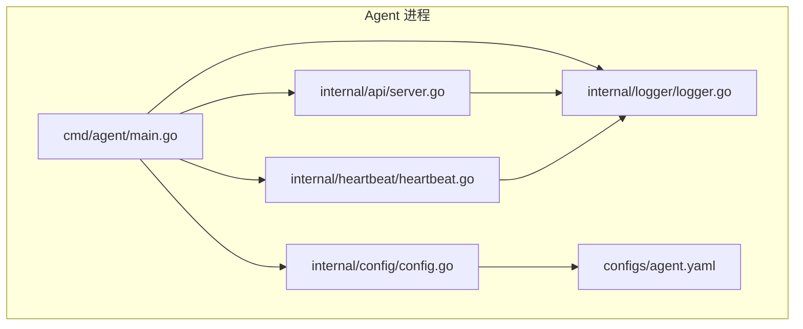
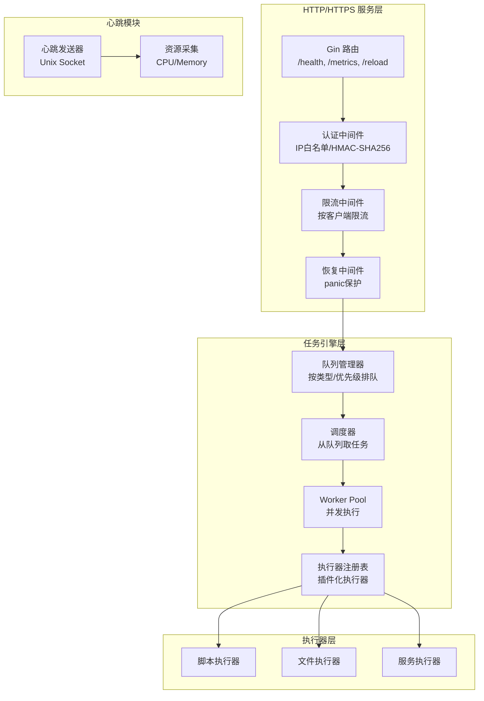
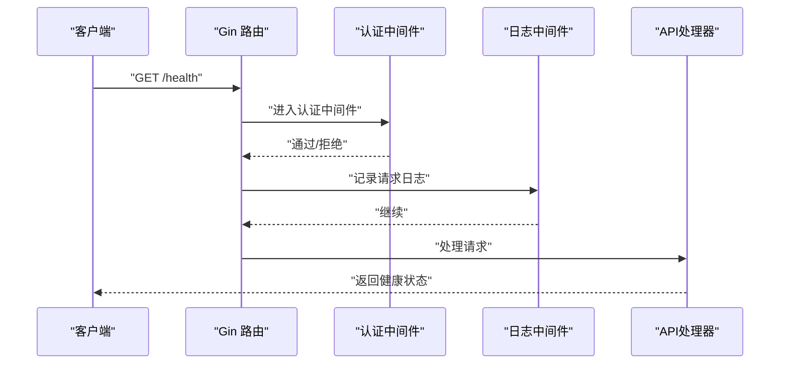
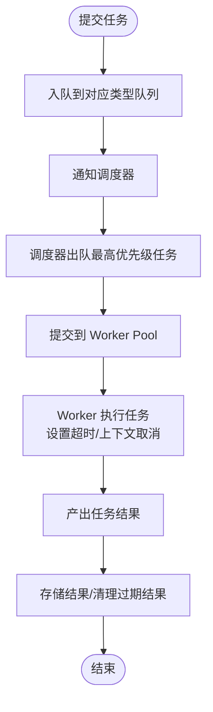
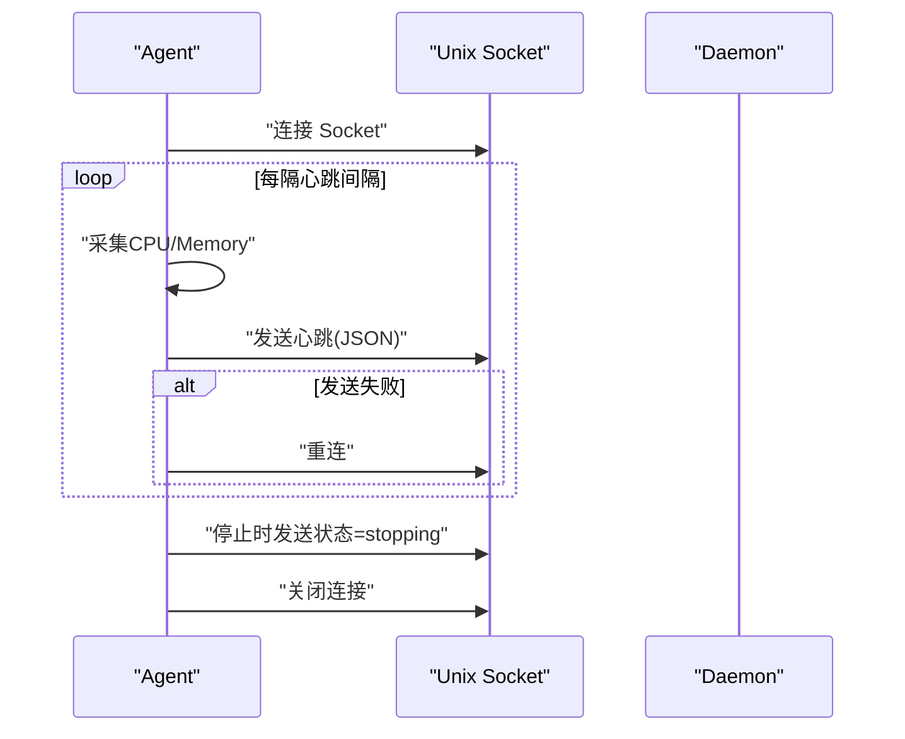
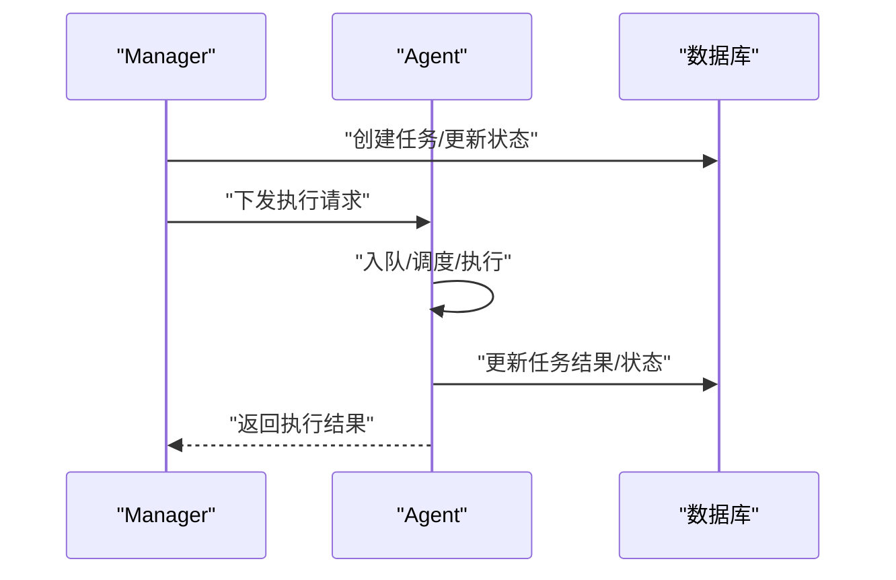
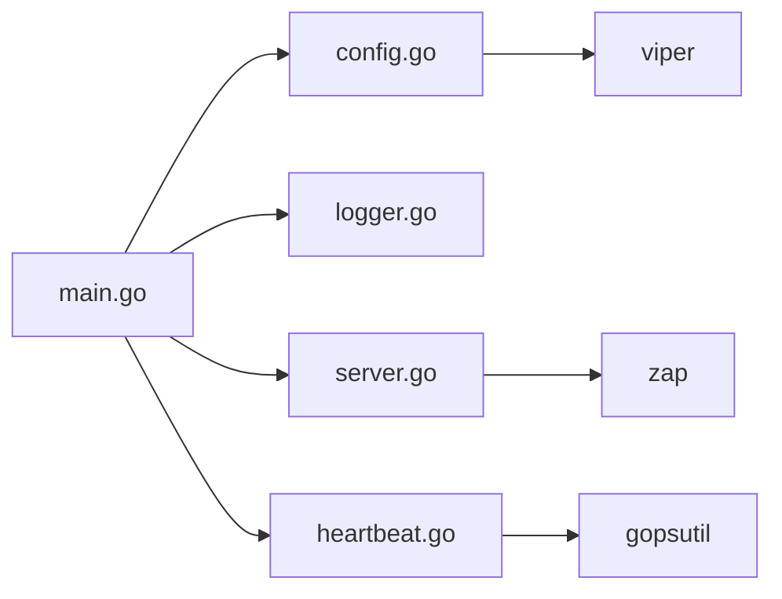
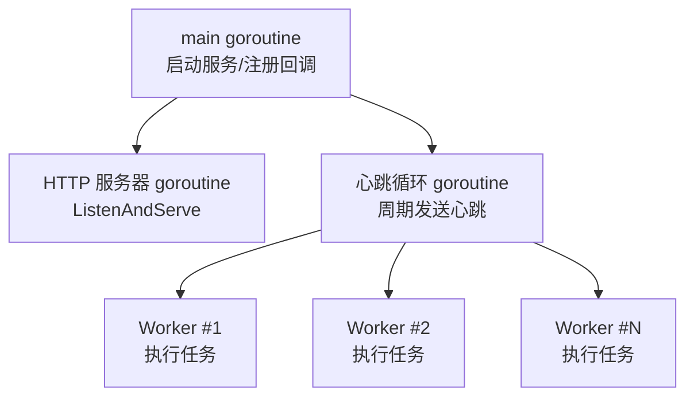
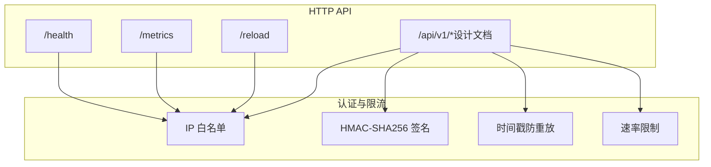

# Agent 模块架构

<cite>
**本文引用的文件**
- [agent/cmd/agent/main.go](file://agent/cmd/agent/main.go)
- [agent/internal/api/server.go](file://agent/internal/api/server.go)
- [agent/internal/heartbeat/heartbeat.go](file://agent/internal/heartbeat/heartbeat.go)
- [agent/internal/config/config.go](file://agent/internal/config/config.go)
- [agent/internal/logger/logger.go](file://agent/internal/logger/logger.go)
- [agent/configs/agent.yaml](file://agent/configs/agent.yaml)
- [agent/QUICKSTART.md](file://agent/QUICKSTART.md)
- [agent/README.md](file://agent/README.md)
- [docs/设计文档_02_Agent模块.md](file://docs/设计文档_02_Agent模块.md)
- [docs/设计文档_03_Manager模块.md](file://docs/设计文档_03_Manager模块.md)
- [manager/internal/service/task.go](file://manager/internal/service/task.go)
- [manager/internal/repository/task.go](file://manager/internal/repository/task.go)
- [manager/internal/model/task.go](file://manager/internal/model/task.go)
</cite>

## 目录
1. [简介](#简介)
2. [项目结构](#项目结构)
3. [核心组件](#核心组件)
4. [架构总览](#架构总览)
5. [详细组件分析](#详细组件分析)
6. [依赖关系分析](#依赖关系分析)
7. [性能考量](#性能考量)
8. [故障排查指南](#故障排查指南)
9. [结论](#结论)
10. [附录](#附录)

## 简介
本文件面向开发者与运维工程师，系统性阐述 Agent 模块的架构设计与实现要点。Agent 作为任务执行进程，承担以下职责：
- 接收并执行运维任务（脚本、文件、服务），并通过任务引擎层完成队列、调度与 Worker 执行。
- 提供 HTTP/HTTPS API 服务（当前实现为 HTTP，设计文档包含 HTTPS 认证与限流方案）。
- 上报心跳至 Daemon，通过 Unix Socket 传输结构化心跳数据。
- 与 Manager 的交互以 gRPC/HTTP 为桥梁（Manager 侧负责任务编排与下发，Agent 侧负责具体执行）。

Agent 的整体设计强调高性能、可扩展与可观测性：基于 Gin 的轻量 HTTP 层、基于通道的并发任务执行、基于 gopsutil 的资源采集、以及基于 Unix Socket 的低开销心跳上报。

## 项目结构
Agent 模块采用按职责分层的组织方式：
- cmd/agent：主程序入口，负责配置加载、日志初始化、服务启动与优雅退出。
- internal/api：HTTP API 层，提供健康检查、指标暴露、配置重载等接口。
- internal/heartbeat：心跳模块，周期性采集资源并上报至 Daemon。
- internal/config：配置管理，支持 YAML 与环境变量覆盖。
- internal/logger：日志封装，支持 JSON/文本格式与文件输出。
- configs：默认配置样例。
- docs：设计文档与接口规范。
- QUICKSTART/README：快速启动与使用说明。



图表来源
- [agent/cmd/agent/main.go](file://agent/cmd/agent/main.go#L1-L138)
- [agent/internal/api/server.go](file://agent/internal/api/server.go#L1-L217)
- [agent/internal/heartbeat/heartbeat.go](file://agent/internal/heartbeat/heartbeat.go#L1-L228)
- [agent/internal/config/config.go](file://agent/internal/config/config.go#L1-L111)
- [agent/internal/logger/logger.go](file://agent/internal/logger/logger.go#L1-L50)
- [agent/configs/agent.yaml](file://agent/configs/agent.yaml#L1-L22)

章节来源
- [agent/cmd/agent/main.go](file://agent/cmd/agent/main.go#L1-L138)
- [agent/README.md](file://agent/README.md#L1-L240)

## 核心组件
- 配置管理：Viper 解析 YAML，支持环境变量覆盖，提供默认值与校验。
- 日志系统：zap 封装，支持 JSON/文本格式与文件输出。
- HTTP API：Gin 路由与中间件，提供健康检查、指标暴露、配置重载。
- 心跳模块：Unix Socket 上报心跳，周期性采集 CPU/Memory，并具备断线重连能力。
- 任务引擎（设计文档）：队列管理器、Worker Pool、执行器注册表与插件化执行器（脚本/文件/服务）。
- 认证与限流（设计文档）：HMAC-SHA256 签名、时间戳防重放、IP 白名单与速率限制。

章节来源
- [agent/internal/config/config.go](file://agent/internal/config/config.go#L1-L111)
- [agent/internal/logger/logger.go](file://agent/internal/logger/logger.go#L1-L50)
- [agent/internal/api/server.go](file://agent/internal/api/server.go#L1-L217)
- [agent/internal/heartbeat/heartbeat.go](file://agent/internal/heartbeat/heartbeat.go#L1-L228)
- [docs/设计文档_02_Agent模块.md](file://docs/设计文档_02_Agent模块.md#L200-L305)
- [docs/设计文档_02_Agent模块.md](file://docs/设计文档_02_Agent模块.md#L307-L576)
- [docs/设计文档_02_Agent模块.md](file://docs/设计文档_02_Agent模块.md#L577-L999)

## 架构总览
Agent 的架构分为四层：
- HTTP/HTTPS 服务层：Gin 路由、认证中间件、限流中间件、恢复中间件。
- 任务引擎层：队列管理器、调度器、Worker Pool、执行器注册表与插件化执行器。
- 执行器层：脚本执行器、文件执行器、服务执行器。
- 心跳模块：Unix Socket 心跳上报、资源采集、断线重连。



图表来源
- [agent/internal/api/server.go](file://agent/internal/api/server.go#L1-L217)
- [docs/设计文档_02_Agent模块.md](file://docs/设计文档_02_Agent模块.md#L200-L305)
- [docs/设计文档_02_Agent模块.md](file://docs/设计文档_02_Agent模块.md#L307-L576)
- [docs/设计文档_02_Agent模块.md](file://docs/设计文档_02_Agent模块.md#L577-L999)
- [agent/internal/heartbeat/heartbeat.go](file://agent/internal/heartbeat/heartbeat.go#L1-L228)

## 详细组件分析

### HTTP/HTTPS 服务层
- 路由与中间件
  - 路由：/health（健康检查）、/metrics（指标暴露）、/reload（配置重载）。
  - 中间件：Recovery、自定义日志中间件。
- 认证与限流（设计文档）
  - 认证：IP 白名单 + HMAC-SHA256 签名 + 时间戳防重放。
  - 限流：按客户端限流，突发与速率可配置。
- 与心跳模块的集成
  - 通过资源获取器注入 CPU/Memory，用于 /metrics。
  - 通过回调更新心跳状态，影响 /health 的健康判定。



图表来源
- [agent/internal/api/server.go](file://agent/internal/api/server.go#L1-L217)
- [docs/设计文档_02_Agent模块.md](file://docs/设计文档_02_Agent模块.md#L200-L305)

章节来源
- [agent/internal/api/server.go](file://agent/internal/api/server.go#L1-L217)
- [docs/设计文档_02_Agent模块.md](file://docs/设计文档_02_Agent模块.md#L200-L305)

### 任务引擎层（设计文档）
- 队列管理器
  - 按任务类型维护优先队列，支持最大容量与优先级排序。
  - 入队时触发通知，驱动调度器出队。
- 调度器
  - 从各类型队列中选择最高优先级任务进行出队。
- Worker Pool
  - 固定大小的 Worker 并发池，每个 Worker 从任务通道消费任务并执行。
  - 执行时设置超时，根据上下文取消状态更新任务状态。
- 执行器注册表与插件化
  - 通过注册表动态绑定任务类型到执行器，便于扩展新类型的执行器。
  - 插件系统支持以 .so 形式加载外部执行器。



图表来源
- [docs/设计文档_02_Agent模块.md](file://docs/设计文档_02_Agent模块.md#L307-L576)
- [docs/设计文档_02_Agent模块.md](file://docs/设计文档_02_Agent模块.md#L577-L999)

章节来源
- [docs/设计文档_02_Agent模块.md](file://docs/设计文档_02_Agent模块.md#L307-L576)
- [docs/设计文档_02_Agent模块.md](file://docs/设计文档_02_Agent模块.md#L577-L999)

### 执行器层（设计文档）
- 脚本执行器
  - 支持多种脚本类型（Shell/Python/PowerShell），参数化执行，捕获标准输出/错误与退出码。
- 文件执行器
  - 支持上传/下载/复制/删除/状态查询，路径白名单与大小限制。
- 服务执行器
  - 基于服务管理接口抽象，Linux 下可对接 systemd，支持启停/重启/状态查询/启用禁用。

```mermaid
classDiagram
class Executor {
+Name() string
+Execute(ctx, task) (interface{}, error)
+Validate(task) error
}
class ScriptExecutor {
+Name() string
+Execute(ctx, task) (interface{}, error)
}
class FileExecutor {
+Name() string
+Execute(ctx, task) (interface{}, error)
}
class ServiceExecutor {
+Name() string
+Execute(ctx, task) (interface{}, error)
}
Executor <|.. ScriptExecutor
Executor <|.. FileExecutor
Executor <|.. ServiceExecutor
```

图表来源
- [docs/设计文档_02_Agent模块.md](file://docs/设计文档_02_Agent模块.md#L577-L999)

章节来源
- [docs/设计文档_02_Agent模块.md](file://docs/设计文档_02_Agent模块.md#L577-L999)

### 心跳模块
- 心跳数据结构包含 PID、时间戳、版本、状态、CPU、内存。
- 通过 Unix Socket 连接 Daemon，周期性发送心跳；失败时自动重连。
- 采集 CPU/Memory 使用情况，缓存最近一次结果供 API 使用。



图表来源
- [agent/internal/heartbeat/heartbeat.go](file://agent/internal/heartbeat/heartbeat.go#L1-L228)

章节来源
- [agent/internal/heartbeat/heartbeat.go](file://agent/internal/heartbeat/heartbeat.go#L1-L228)

### 与 Manager 的交互（概念性）
- Manager 负责任务编排与下发，Agent 负责具体执行。
- 任务生命周期：创建 -> 下发 -> 执行 -> 取消/完成 -> 结果回传。
- 任务模型与状态机在 Manager 侧定义，Agent 侧负责执行与结果存储。



图表来源
- [manager/internal/service/task.go](file://manager/internal/service/task.go#L1-L273)
- [manager/internal/repository/task.go](file://manager/internal/repository/task.go#L1-L208)
- [manager/internal/model/task.go](file://manager/internal/model/task.go#L1-L50)
- [docs/设计文档_03_Manager模块.md](file://docs/设计文档_03_Manager模块.md#L894-L940)

章节来源
- [manager/internal/service/task.go](file://manager/internal/service/task.go#L1-L273)
- [manager/internal/repository/task.go](file://manager/internal/repository/task.go#L1-L208)
- [manager/internal/model/task.go](file://manager/internal/model/task.go#L1-L50)
- [docs/设计文档_03_Manager模块.md](file://docs/设计文档_03_Manager模块.md#L894-L940)

## 依赖关系分析
- 外部依赖
  - Gin：HTTP 路由与中间件。
  - gopsutil：进程资源采集。
  - Viper：配置解析与环境变量绑定。
  - Zap：结构化日志。
- 内部耦合
  - main.go 串联配置、日志、API、心跳模块。
  - API 与心跳模块通过回调与资源获取器解耦。
  - 任务引擎（设计文档）与执行器层通过接口解耦，便于插件化扩展。



图表来源
- [agent/cmd/agent/main.go](file://agent/cmd/agent/main.go#L1-L138)
- [agent/internal/api/server.go](file://agent/internal/api/server.go#L1-L217)
- [agent/internal/heartbeat/heartbeat.go](file://agent/internal/heartbeat/heartbeat.go#L1-L228)
- [agent/internal/config/config.go](file://agent/internal/config/config.go#L1-L111)
- [agent/internal/logger/logger.go](file://agent/internal/logger/logger.go#L1-L50)

章节来源
- [agent/cmd/agent/main.go](file://agent/cmd/agent/main.go#L1-L138)
- [agent/internal/config/config.go](file://agent/internal/config/config.go#L1-L111)
- [agent/internal/logger/logger.go](file://agent/internal/logger/logger.go#L1-L50)

## 性能考量
- HTTP 层
  - Gin Release 模式，仅启用 Recovery 与自定义日志中间件，降低开销。
  - 认证与限流中间件按需启用，避免对高频接口造成额外负担。
- 任务执行
  - Worker Pool 采用固定大小并发，结合任务通道缓冲，平衡吞吐与内存占用。
  - 执行器对输出进行大小限制，防止大输出导致内存压力。
- 心跳
  - Unix Socket 低开销，周期性发送，失败自动重连，减少网络抖动影响。
- 资源采集
  - gopsutil 采集 CPU/Memory，仅在心跳与指标接口中使用，避免频繁采集。

[本节为通用性能建议，不直接分析具体文件]

## 故障排查指南
- 启动失败
  - 检查配置文件与环境变量是否正确，确认 agent_id、http.port、heartbeat.socket_path、heartbeat.interval。
  - 查看日志输出，定位配置加载与日志初始化错误。
- 心跳失败
  - 确认 Daemon 已启动并创建了 Unix Socket；检查权限与路径一致性。
  - 观察重连日志，确认网络连通性。
- HTTP 接口异常
  - 使用 /health 与 /metrics 验证服务可用性与心跳状态。
  - 检查认证中间件是否拒绝请求（IP 白名单、签名、时间戳）。
- 任务执行异常
  - 检查任务类型与参数合法性，确认执行器已注册。
  - 关注 Worker 超时与取消状态，核对任务超时配置。

章节来源
- [agent/QUICKSTART.md](file://agent/QUICKSTART.md#L1-L199)
- [agent/README.md](file://agent/README.md#L1-L240)
- [agent/internal/heartbeat/heartbeat.go](file://agent/internal/heartbeat/heartbeat.go#L1-L228)
- [agent/internal/api/server.go](file://agent/internal/api/server.go#L1-L217)

## 结论
Agent 模块以清晰的分层架构实现了“可执行、可观测、可扩展”的运维任务执行器。HTTP 层提供简洁稳定的 API，心跳模块保障与 Daemon 的可靠通信，任务引擎与执行器层通过接口与插件化设计实现高扩展性。认证与限流（设计文档）进一步提升了安全性与稳定性。未来可在现有基础上完善任务 API 的路由与处理器实现，并在 Manager 侧完善任务下发与状态同步机制，形成完整的端到端闭环。

[本节为总结性内容，不直接分析具体文件]

## 附录

### 线程模型图（概览）


图表来源
- [agent/cmd/agent/main.go](file://agent/cmd/agent/main.go#L1-L138)
- [agent/internal/heartbeat/heartbeat.go](file://agent/internal/heartbeat/heartbeat.go#L1-L228)
- [docs/设计文档_02_Agent模块.md](file://docs/设计文档_02_Agent模块.md#L419-L517)

### API 设计图（概览）


图表来源
- [agent/internal/api/server.go](file://agent/internal/api/server.go#L1-L217)
- [docs/设计文档_02_Agent模块.md](file://docs/设计文档_02_Agent模块.md#L200-L305)

### 关键架构决策说明
- 插件化任务执行器
  - 通过接口与注册表解耦任务类型与执行器，便于新增脚本/文件/服务等执行器，提升可扩展性与可维护性。
- HMAC-SHA256 签名认证
  - 在设计文档中引入，通过 X-Timestamp、X-Nonce、X-Signature 三要素实现签名验证与防重放，增强 API 安全性。
- Unix Socket 心跳
  - 低开销、跨进程通信，适合 Agent 与 Daemon 的本地通信场景；失败自动重连，提高可靠性。
- 队列与 Worker Pool
  - 基于通道的并发模型，简单高效；配合优先级队列与超时控制，兼顾吞吐与稳定性。

章节来源
- [docs/设计文档_02_Agent模块.md](file://docs/设计文档_02_Agent模块.md#L200-L305)
- [docs/设计文档_02_Agent模块.md](file://docs/设计文档_02_Agent模块.md#L307-L576)
- [docs/设计文档_02_Agent模块.md](file://docs/设计文档_02_Agent模块.md#L577-L999)