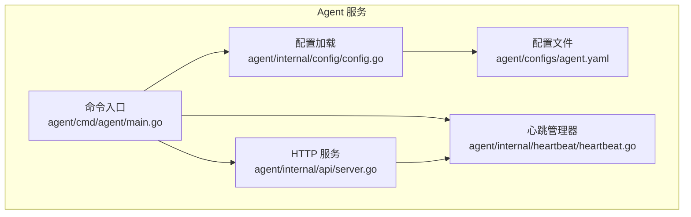
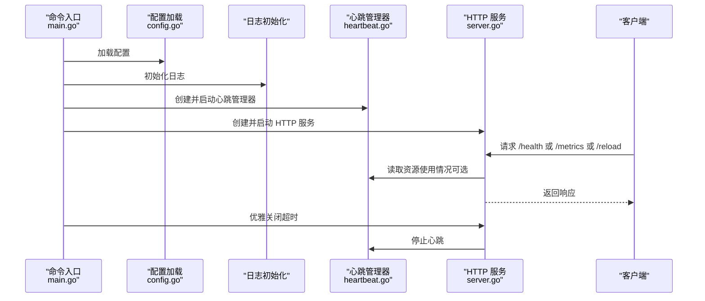
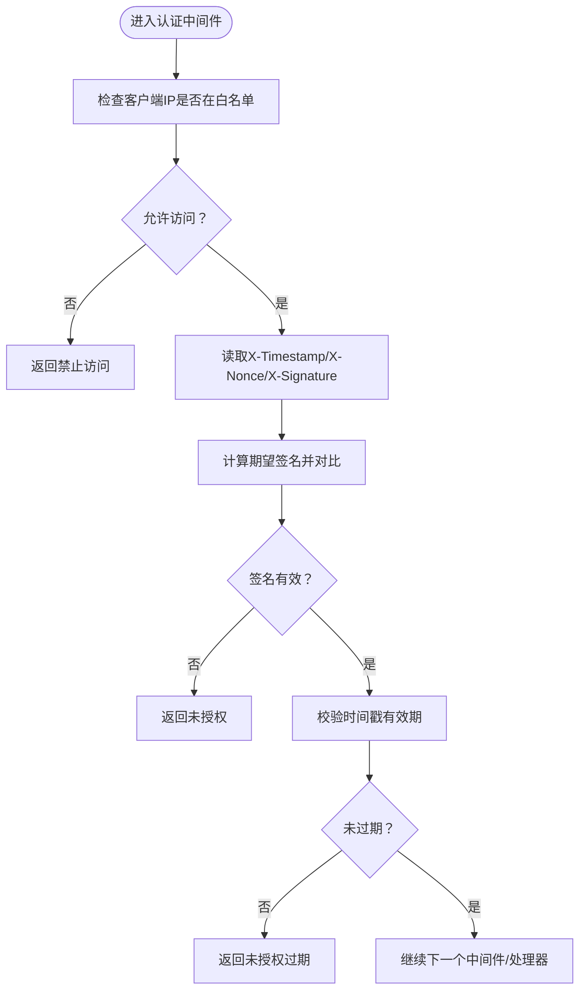
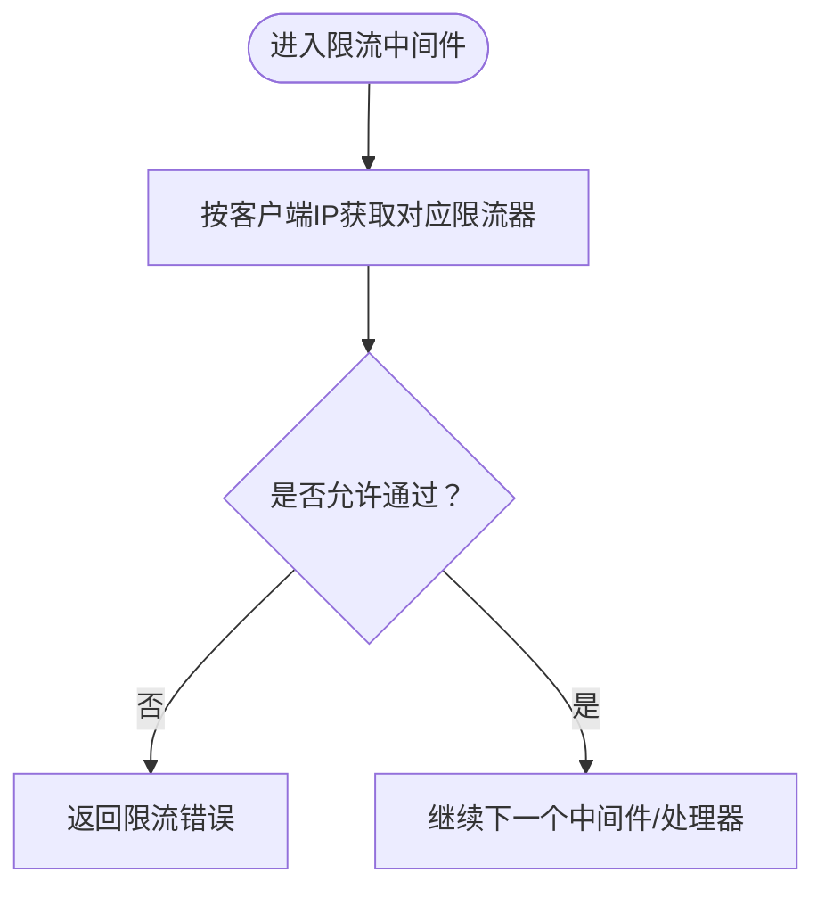
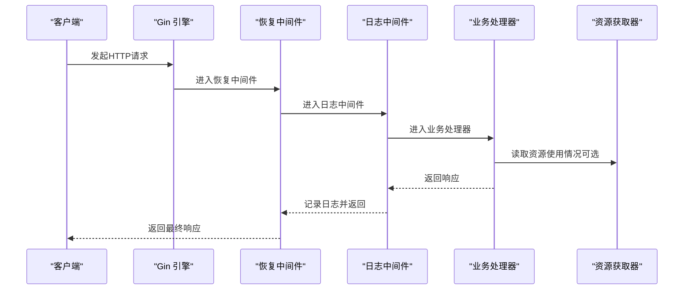
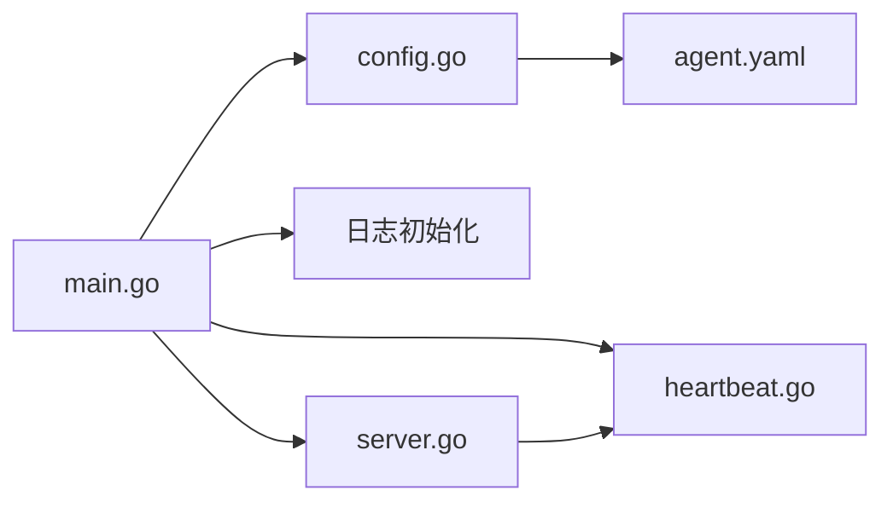

# HTTP/HTTPS 服务

<cite>
**本文引用的文件**
- [agent/internal/api/server.go](file://agent/internal/api/server.go)
- [agent/cmd/agent/main.go](file://agent/cmd/agent/main.go)
- [agent/internal/config/config.go](file://agent/internal/config/config.go)
- [agent/configs/agent.yaml](file://agent/configs/agent.yaml)
- [agent/internal/heartbeat/heartbeat.go](file://agent/internal/heartbeat/heartbeat.go)
- [docs/设计文档_02_Agent模块.md](file://docs/设计文档_02_Agent模块.md)
</cite>

## 目录
1. [简介](#简介)
2. [项目结构](#项目结构)
3. [核心组件](#核心组件)
4. [架构总览](#架构总览)
5. [详细组件分析](#详细组件分析)
6. [依赖关系分析](#依赖关系分析)
7. [性能考量](#性能考量)
8. [故障排查指南](#故障排查指南)
9. [结论](#结论)
10. [附录](#附录)

## 简介
本文件聚焦 Agent 模块的 HTTP/HTTPS 服务层，围绕 Gin 框架构建的 API 入口展开，系统性阐述路由管理、中间件链、认证与限流机制、请求处理生命周期以及安全最佳实践。重点覆盖以下关键路由：
- /health：健康检查
- /metrics：指标暴露
- /reload：配置重载
同时补充说明 /api/v1/task/execute 在整体架构中的定位与实现思路（以设计文档为准），并给出中间件链注册与请求处理的序列图，帮助读者快速理解从请求进入至响应返回的完整流程。

## 项目结构
Agent 模块的 HTTP 服务由命令入口负责初始化配置、启动心跳与 HTTP 服务；API 层负责路由注册与处理；配置层负责读取与校验配置；心跳模块负责资源采集与状态上报。

图表来源
- [agent/cmd/agent/main.go](file://agent/cmd/agent/main.go#L24-L119)
- [agent/internal/config/config.go](file://agent/internal/config/config.go#L38-L111)
- [agent/internal/api/server.go](file://agent/internal/api/server.go#L38-L118)
- [agent/internal/heartbeat/heartbeat.go](file://agent/internal/heartbeat/heartbeat.go#L43-L106)

章节来源
- [agent/cmd/agent/main.go](file://agent/cmd/agent/main.go#L24-L119)
- [agent/internal/config/config.go](file://agent/internal/config/config.go#L38-L111)
- [agent/internal/api/server.go](file://agent/internal/api/server.go#L38-L118)
- [agent/internal/heartbeat/heartbeat.go](file://agent/internal/heartbeat/heartbeat.go#L43-L106)

## 核心组件
- HTTP 服务 Server：封装 Gin 引擎、中间件、路由与生命周期管理。
- 资源获取接口 ResourceGetter：用于 /metrics 暴露 CPU/内存等指标。
- 心跳管理器 Manager：采集进程资源并上报，驱动健康状态。
- 配置 Config：Viper 驱动的配置加载与校验，支持环境变量绑定。

章节来源
- [agent/internal/api/server.go](file://agent/internal/api/server.go#L13-L36)
- [agent/internal/heartbeat/heartbeat.go](file://agent/internal/heartbeat/heartbeat.go#L15-L41)
- [agent/internal/config/config.go](file://agent/internal/config/config.go#L10-L37)

## 架构总览
Agent 的 HTTP 服务采用“命令入口 -> 配置 -> API -> 心跳”的串联模式。命令入口负责加载配置、初始化日志、创建心跳与 API 服务，并在启动后等待信号进行优雅关闭。API 服务通过 Gin 注册路由并挂载中间件，处理请求并将心跳状态与资源使用情况反馈给调用方。

图表来源
- [agent/cmd/agent/main.go](file://agent/cmd/agent/main.go#L24-L119)
- [agent/internal/api/server.go](file://agent/internal/api/server.go#L63-L118)
- [agent/internal/heartbeat/heartbeat.go](file://agent/internal/heartbeat/heartbeat.go#L66-L106)

## 详细组件分析

### 1) Gin 服务与中间件链
- 模式与引擎：服务初始化时设置 Gin 运行模式为发布模式，并创建新的 Gin 引擎实例。
- 中间件链：
  - 恢复中间件：捕获 panic 并返回统一错误。
  - 日志中间件：记录请求路径、状态码与耗时。
- 路由注册：在构造函数中完成路由注册，当前包含 /health、/reload、/metrics。

章节来源
- [agent/internal/api/server.go](file://agent/internal/api/server.go#L38-L61)
- [agent/internal/api/server.go](file://agent/internal/api/server.go#L53-L59)
- [agent/internal/api/server.go](file://agent/internal/api/server.go#L94-L118)

### 2) 关键路由设计与实现

#### /health 健康检查
- 作用：返回 Agent 健康状态、运行时长、最近心跳时间、Agent ID。
- 健康判定：若最近心跳超过阈值且非零，则返回不可用状态。
- 响应：JSON 结构包含状态、运行时长、心跳时间、Agent ID。

章节来源
- [agent/internal/api/server.go](file://agent/internal/api/server.go#L120-L142)

#### /metrics 指标暴露
- 作用：返回 Agent 运行指标，包括 Agent ID、版本、运行时长、心跳计数/失败次数、最近心跳、CPU 百分比、内存字节、运行状态。
- 资源使用：通过 ResourceGetter 接口获取最后的 CPU/内存使用情况。
- 健康状态：根据最近心跳时间判断运行状态。

章节来源
- [agent/internal/api/server.go](file://agent/internal/api/server.go#L168-L196)

#### /reload 配置重载
- 作用：触发配置重载回调，返回重载结果与时间戳。
- 回调：通过 SetReloadCallback 注入，当前实现为占位提示。

章节来源
- [agent/internal/api/server.go](file://agent/internal/api/server.go#L144-L167)

### 3) 认证中间件（设计文档）
根据设计文档，认证中间件包含以下流程：
- IP 白名单检查：拒绝不在白名单内的请求。
- 签名验证：从请求头读取 X-Timestamp、X-Nonce、X-Signature，按固定规则拼接字符串并使用 HMAC-SHA256 与密钥计算期望签名，比较是否一致。
- 防重放：对时间戳进行校验，超过有效期则拒绝请求。
- 中间件链：在路由注册前挂载认证中间件，通过 c.Next() 放行。

图表来源
- [docs/设计文档_02_Agent模块.md](file://docs/设计文档_02_Agent模块.md#L193-L242)

章节来源
- [docs/设计文档_02_Agent模块.md](file://docs/设计文档_02_Agent模块.md#L193-L242)

### 4) 限流中间件（设计文档）
- 策略：基于客户端 IP 的独立限流，每个 IP 拥有独立的令牌桶。
- 默认参数：每秒请求数与突发容量在实现中给出示例值。
- 触发条件：当令牌桶不允许通过时，返回限流错误并中断请求。

图表来源
- [docs/设计文档_02_Agent模块.md](file://docs/设计文档_02_Agent模块.md#L260-L305)

章节来源
- [docs/设计文档_02_Agent模块.md](file://docs/设计文档_02_Agent模块.md#L260-L305)

### 5) 请求处理生命周期（序列图）
以下序列图展示了从请求进入至响应返回的关键步骤，涵盖中间件链与处理器调用。

图表来源
- [agent/internal/api/server.go](file://agent/internal/api/server.go#L53-L59)
- [agent/internal/api/server.go](file://agent/internal/api/server.go#L101-L118)
- [agent/internal/api/server.go](file://agent/internal/api/server.go#L120-L196)

章节来源
- [agent/internal/api/server.go](file://agent/internal/api/server.go#L53-L59)
- [agent/internal/api/server.go](file://agent/internal/api/server.go#L101-L118)
- [agent/internal/api/server.go](file://agent/internal/api/server.go#L120-L196)

### 6) /api/v1/task/execute（设计文档中的任务执行）
- 设计定位：该路由属于 Manager 模块的任务执行接口，Agent 模块并不直接提供该路由。
- 执行模型：设计文档中定义了任务执行的 Worker Pool 与队列管理，具备超时控制与状态机，但具体 HTTP 路由与处理器需在 Manager 模块中实现。
- 与 Agent 的关系：Manager 侧发起任务执行后，Agent 侧通过心跳上报状态与资源使用，便于监控与健康判定。

章节来源
- [docs/设计文档_02_Agent模块.md](file://docs/设计文档_02_Agent模块.md#L419-L517)

## 依赖关系分析
- 命令入口依赖配置加载与日志初始化，再创建心跳与 API 服务。
- API 服务依赖 ResourceGetter 接口以暴露指标，依赖心跳管理器的状态回调以更新健康状态。
- 配置层通过 Viper 支持环境变量绑定与默认值设置，确保部署灵活性。

图表来源
- [agent/cmd/agent/main.go](file://agent/cmd/agent/main.go#L24-L119)
- [agent/internal/config/config.go](file://agent/internal/config/config.go#L38-L111)
- [agent/internal/api/server.go](file://agent/internal/api/server.go#L38-L61)
- [agent/internal/heartbeat/heartbeat.go](file://agent/internal/heartbeat/heartbeat.go#L43-L106)

章节来源
- [agent/cmd/agent/main.go](file://agent/cmd/agent/main.go#L24-L119)
- [agent/internal/config/config.go](file://agent/internal/config/config.go#L38-L111)
- [agent/internal/api/server.go](file://agent/internal/api/server.go#L38-L61)
- [agent/internal/heartbeat/heartbeat.go](file://agent/internal/heartbeat/heartbeat.go#L43-L106)

## 性能考量
- 中间件顺序：恢复与日志中间件应尽量靠前，以便覆盖所有后续处理。
- 资源采集成本：/metrics 仅读取缓存的资源使用情况，避免频繁系统调用。
- 优雅关闭：服务端设置超时，确保在停止过程中仍有足够时间完成未决请求。
- 配置参数调优：可通过配置文件调整 HTTP 监听地址与端口，结合环境变量进行部署定制。

章节来源
- [agent/internal/api/server.go](file://agent/internal/api/server.go#L63-L92)
- [agent/internal/config/config.go](file://agent/internal/config/config.go#L38-L89)
- [agent/configs/agent.yaml](file://agent/configs/agent.yaml#L12-L16)

## 故障排查指南
- 健康检查异常：若 /health 返回不可用，检查最近心跳时间与心跳管理器状态。
- 指标缺失：确认 ResourceGetter 已正确注入，且心跳管理器能够采集到 CPU/内存。
- 配置重载失败：查看重载回调日志，确认回调实现与配置文件变更。
- 优雅关闭失败：关注停止超时与日志输出，确保外部调用方在超时时间内完成请求。

章节来源
- [agent/internal/api/server.go](file://agent/internal/api/server.go#L120-L196)
- [agent/internal/api/server.go](file://agent/internal/api/server.go#L144-L167)
- [agent/internal/heartbeat/heartbeat.go](file://agent/internal/heartbeat/heartbeat.go#L66-L106)

## 结论
Agent 模块的 HTTP 服务层以 Gin 为核心，提供了简洁高效的中间件链与关键路由，结合心跳与资源采集实现了可观测性与健康状态反馈。认证与限流中间件在设计文档中已明确实现思路，建议在后续迭代中将其集成到路由注册流程中。通过配置文件与环境变量，服务具备良好的部署灵活性与可调优空间。

## 附录

### A. 中间件链注册与请求处理生命周期（代码级）
- 中间件注册位置：在服务构造函数中完成。
- 生命周期：请求进入后依次经过恢复与日志中间件，再进入业务处理器；处理器完成后回传日志中间件记录耗时与状态。

章节来源
- [agent/internal/api/server.go](file://agent/internal/api/server.go#L53-L59)
- [agent/internal/api/server.go](file://agent/internal/api/server.go#L101-L118)

### B. 配置文件与参数调优
- 配置文件示例：包含 Agent ID、版本、心跳、HTTP 监听与日志配置。
- 环境变量绑定：通过 Viper 将关键配置映射到环境变量，便于容器化部署。

章节来源
- [agent/configs/agent.yaml](file://agent/configs/agent.yaml#L1-L22)
- [agent/internal/config/config.go](file://agent/internal/config/config.go#L38-L89)