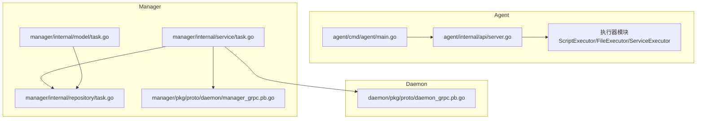
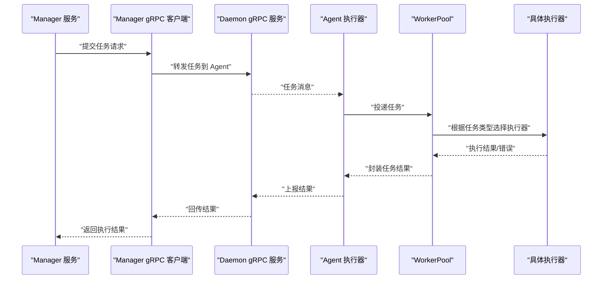
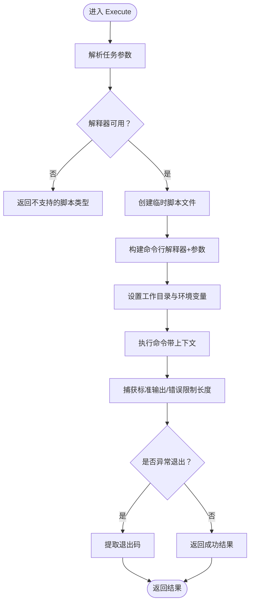
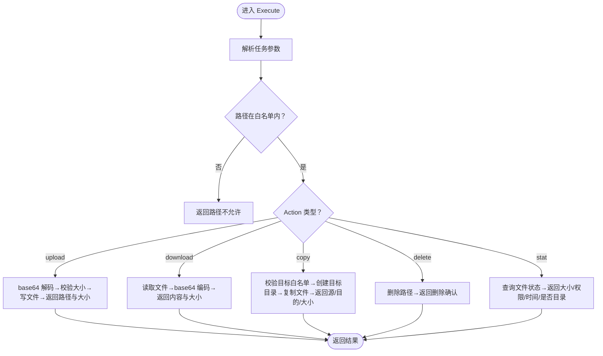
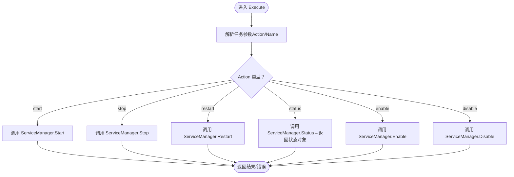
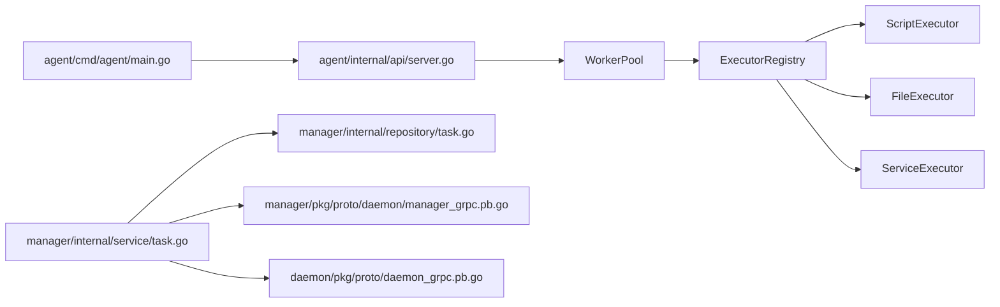

# 任务执行器

<cite>
**本文引用的文件**
- [设计文档_02_Agent模块.md](file://docs/设计文档_02_Agent模块.md)
- [main.go](file://agent/cmd/agent/main.go)
- [server.go](file://agent/internal/api/server.go)
- [task.go](file://manager/internal/model/task.go)
- [task.go](file://manager/internal/repository/task.go)
- [task.go](file://manager/internal/service/task.go)
- [daemon_grpc.pb.go](file://daemon/pkg/proto/daemon_grpc.pb.go)
- [manager_grpc.pb.go](file://manager/pkg/proto/daemon/manager_grpc.pb.go)
</cite>

## 目录
1. [简介](#简介)
2. [项目结构](#项目结构)
3. [核心组件](#核心组件)
4. [架构总览](#架构总览)
5. [详细组件分析](#详细组件分析)
6. [依赖关系分析](#依赖关系分析)
7. [性能考量](#性能考量)
8. [故障排查指南](#故障排查指南)
9. [结论](#结论)
10. [附录](#附录)

## 简介
本文件面向“任务执行器”子系统，聚焦以下三类执行器的实现与使用：
- 脚本执行器（ScriptExecutor）：支持 Shell、Python、PowerShell 等脚本类型，具备临时文件创建、解释器调用、环境变量注入与输出捕获能力。
- 文件执行器（FileExecutor）：提供上传、下载、复制、删除、状态查询等文件操作，内置路径白名单、文件大小限制与 base64 编解码传输。
- 服务执行器（ServiceExecutor）：通过 ServiceManager 接口与系统服务管理器交互，实现服务的启停重启与状态查询（以 systemd 为例）。

同时，文档阐述插件化设计模式：通过 Executor 接口与 ExecutorRegistry 实现执行器的注册与调用；并通过 Plugin 接口与 PluginLoader 支持动态加载自定义执行器。

## 项目结构
Agent 模块负责任务执行器的运行时承载与对外 API 暴露；Manager 模块负责任务编排与状态持久化；Daemon/Manager 的 gRPC 协议用于跨模块通信。



图表来源
- [main.go](file://agent/cmd/agent/main.go#L1-L138)
- [server.go](file://agent/internal/api/server.go#L1-L217)
- [task.go](file://manager/internal/model/task.go#L1-L50)
- [task.go](file://manager/internal/repository/task.go#L1-L208)
- [task.go](file://manager/internal/service/task.go#L169-L213)
- [daemon_grpc.pb.go](file://daemon/pkg/proto/daemon_grpc.pb.go#L59-L255)
- [manager_grpc.pb.go](file://manager/pkg/proto/daemon/manager_grpc.pb.go#L59-L255)

章节来源
- [main.go](file://agent/cmd/agent/main.go#L1-L138)
- [server.go](file://agent/internal/api/server.go#L1-L217)
- [task.go](file://manager/internal/model/task.go#L1-L50)
- [task.go](file://manager/internal/repository/task.go#L1-L208)
- [task.go](file://manager/internal/service/task.go#L169-L213)
- [daemon_grpc.pb.go](file://daemon/pkg/proto/daemon_grpc.pb.go#L59-L255)
- [manager_grpc.pb.go](file://manager/pkg/proto/daemon/manager_grpc.pb.go#L59-L255)

## 核心组件
- 执行器接口与注册表
  - Executor 接口：统一的执行器契约，包含名称、执行与验证方法。
  - ExecutorRegistry：线程安全的执行器注册表，支持按名称注册与获取。
- 任务引擎
  - WorkerPool：工作池，负责从任务通道取出任务并委派给对应执行器执行，统一处理超时、取消与状态更新。
  - Task 结构：任务类型、动作、参数、超时、优先级、状态与结果等字段。
- 插件系统
  - Plugin 接口与 PluginLoader：支持以 .so 插件形式动态加载执行器。

章节来源
- [设计文档_02_Agent模块.md](file://docs/设计文档_02_Agent模块.md#L577-L609)
- [设计文档_02_Agent模块.md](file://docs/设计文档_02_Agent模块.md#L419-L517)
- [设计文档_02_Agent模块.md](file://docs/设计文档_02_Agent模块.md#L1200-L1253)
- [task.go](file://manager/internal/model/task.go#L1-L50)

## 架构总览
Agent 内部通过 WorkerPool 统一调度执行器；Manager 负责任务编排与持久化；gRPC 作为跨模块通信协议。



图表来源
- [daemon_grpc.pb.go](file://daemon/pkg/proto/daemon_grpc.pb.go#L59-L255)
- [manager_grpc.pb.go](file://manager/pkg/proto/daemon/manager_grpc.pb.go#L59-L255)
- [design_document_agent_module.md](file://docs/设计文档_02_Agent模块.md#L419-L517)

## 详细组件分析

### 脚本执行器（ScriptExecutor）
- 功能要点
  - 解释器映射：根据脚本类型映射到对应解释器（如 shell、python、powershell）。
  - 临时文件：按脚本类型自动选择扩展名，创建临时脚本文件并赋予可执行权限。
  - 工作目录与环境变量：支持任务参数中的工作目录与用户环境变量注入。
  - 输出捕获：限制最大输出长度，避免内存膨胀。
  - 退出码：区分非正常退出与成功退出，记录退出码。
- 关键流程



图表来源
- [设计文档_02_Agent模块.md](file://docs/设计文档_02_Agent模块.md#L611-L726)

章节来源
- [设计文档_02_Agent模块.md](file://docs/设计文档_02_Agent模块.md#L611-L726)

### 文件执行器（FileExecutor）
- 功能要点
  - 路径白名单：仅允许在允许目录下进行文件操作，防止越权访问。
  - 上传：base64 解码内容，校验大小上限，写入目标路径并设置权限。
  - 下载：读取文件内容并 base64 编码返回，同时返回大小等元信息。
  - 复制：校验目标路径白名单，确保目标目录存在并复制文件。
  - 删除与状态：删除文件并返回确认；查询文件状态（大小、权限、修改时间、是否目录）。
- 关键流程



图表来源
- [设计文档_02_Agent模块.md](file://docs/设计文档_02_Agent模块.md#L728-L903)

章节来源
- [设计文档_02_Agent模块.md](file://docs/设计文档_02_Agent模块.md#L728-L903)

### 服务执行器（ServiceExecutor）
- 功能要点
  - 通过 ServiceManager 接口抽象服务管理能力，支持 start、stop、restart、status、enable、disable。
  - 以 systemd 为例实现 Linux 服务管理：通过 systemctl 命令执行启停重启与状态查询。
  - 返回 ServiceStatus，包含运行状态、PID、启用状态等。
- 关键流程



图表来源
- [设计文档_02_Agent模块.md](file://docs/设计文档_02_Agent模块.md#L905-L999)

章节来源
- [设计文档_02_Agent模块.md](file://docs/设计文档_02_Agent模块.md#L905-L999)

### 插件化设计与扩展
- 插件接口与加载器
  - Plugin 接口：提供名称、版本、初始化、获取执行器、关闭等方法。
  - PluginLoader：从指定目录加载 .so 插件，查找 NewPlugin 符号并初始化，随后将插件提供的执行器注册到执行器注册表。
- 扩展步骤
  - 实现自定义执行器并满足 Executor 接口。
  - 在插件中实现 Plugin 接口，返回自定义执行器。
  - 将插件编译为 .so 并放置于插件目录，由 PluginLoader 动态加载。

```mermaid
classDiagram
class Executor {
+Name() string
+Execute(ctx, task) (interface{}, error)
+Validate(task) error
}
class ExecutorRegistry {
+Register(executor)
+Get(name) (Executor,bool)
}
class Plugin {
+Name() string
+Version() string
+Init(config) error
+GetExecutor() Executor
+Shutdown() error
}
class PluginLoader {
+Load(name) error
}
class ScriptExecutor
class FileExecutor
class ServiceExecutor
Executor <|.. ScriptExecutor
Executor <|.. FileExecutor
Executor <|.. ServiceExecutor
ExecutorRegistry --> Executor : "注册/获取"
Plugin --> Executor : "提供"
PluginLoader --> Plugin : "加载"
```

图表来源
- [设计文档_02_Agent模块.md](file://docs/设计文档_02_Agent模块.md#L577-L609)
- [设计文档_02_Agent模块.md](file://docs/设计文档_02_Agent模块.md#L1200-L1253)

章节来源
- [设计文档_02_Agent模块.md](file://docs/设计文档_02_Agent模块.md#L577-L609)
- [设计文档_02_Agent模块.md](file://docs/设计文档_02_Agent模块.md#L1200-L1253)

## 依赖关系分析
- Agent 启动链路
  - main.go 负责加载配置、初始化日志、启动心跳与 HTTP 服务。
  - HTTP 服务提供指标与健康检查接口，便于外部观测 Agent 状态。
- 任务执行链路
  - Manager 侧维护任务模型与仓库，服务层负责任务状态流转与执行触发。
  - gRPC 用于 Manager 与 Daemon/Agent 之间的任务分发与结果回传。
- 执行器依赖
  - WorkerPool 依赖执行器注册表，按任务类型选择执行器。
  - 具体执行器依赖系统命令（如解释器、systemctl）与文件系统。



图表来源
- [main.go](file://agent/cmd/agent/main.go#L1-L138)
- [server.go](file://agent/internal/api/server.go#L1-L217)
- [design_document_agent_module.md](file://docs/设计文档_02_Agent模块.md#L419-L517)
- [task.go](file://manager/internal/service/task.go#L169-L213)
- [task.go](file://manager/internal/repository/task.go#L1-L208)
- [manager_grpc.pb.go](file://manager/pkg/proto/daemon/manager_grpc.pb.go#L59-L255)
- [daemon_grpc.pb.go](file://daemon/pkg/proto/daemon_grpc.pb.go#L59-L255)

章节来源
- [main.go](file://agent/cmd/agent/main.go#L1-L138)
- [server.go](file://agent/internal/api/server.go#L1-L217)
- [design_document_agent_module.md](file://docs/设计文档_02_Agent模块.md#L419-L517)
- [task.go](file://manager/internal/service/task.go#L169-L213)
- [task.go](file://manager/internal/repository/task.go#L1-L208)
- [manager_grpc.pb.go](file://manager/pkg/proto/daemon/manager_grpc.pb.go#L59-L255)
- [daemon_grpc.pb.go](file://daemon/pkg/proto/daemon_grpc.pb.go#L59-L255)

## 性能考量
- 输出限制：脚本执行器对 stdout/stderr 输出进行长度限制，避免大输出导致内存压力。
- 超时控制：WorkerPool 为每个任务设置超时上下文，超时后任务标记为 timeout 并停止执行。
- 并发与队列：WorkerPool 通过固定大小的通道与 goroutine 并发执行，结合优先级队列提升吞吐。
- 文件操作：文件执行器在上传/下载前进行大小校验，复制前预创建目标目录，减少 IO 异常。

[本节为通用指导，无需列出章节来源]

## 故障排查指南
- 常见错误码
  - 参数无效、认证失败、权限不足、请求过于频繁、任务不存在、任务超时、任务执行失败、任务已取消、队列已满、文件不存在、文件过大、路径不允许、服务不存在、服务操作失败等。
- 建议排查步骤
  - 检查任务参数合法性与类型匹配（脚本类型、Action、路径等）。
  - 查看 WorkerPool 的任务状态流转与错误信息，定位超时或取消原因。
  - 对脚本执行器，确认解释器路径与临时文件创建是否成功，输出是否被截断。
  - 对文件执行器，确认路径是否在白名单内、文件大小是否超过限制、目标目录是否可写。
  - 对服务执行器，确认 systemd 命令是否可用、服务名是否正确、权限是否足够。

章节来源
- [设计文档_02_Agent模块.md](file://docs/设计文档_02_Agent模块.md#L1439-L1462)

## 结论
该任务执行器体系采用清晰的接口抽象与插件化扩展机制，结合 WorkerPool 的统一调度与 gRPC 的跨模块通信，实现了脚本、文件与服务三类任务的标准化执行。通过路径白名单、大小限制、输出截断与超时控制等策略，兼顾了安全性与稳定性。建议在生产环境中结合监控与日志完善可观测性，并持续扩展插件生态以覆盖更多执行场景。

[本节为总结性内容，无需列出章节来源]

## 附录

### 配置示例（概念性说明）
- 脚本执行器
  - interpreters：映射脚本类型到解释器路径（如 shell→bash、python→python3、powershell→pwsh）。
  - workDir：默认工作目录。
  - env：全局环境变量数组。
  - maxOutput：最大输出字节数。
- 文件执行器
  - baseDir：基础根目录（用于相对路径解析）。
  - maxSize：文件大小上限。
  - allowDirs：允许操作的绝对路径前缀集合。
- 服务执行器
  - 通过 ServiceManager 接口注入具体实现（如 systemd），无需额外配置项。

[本节为概念性说明，无需列出章节来源]