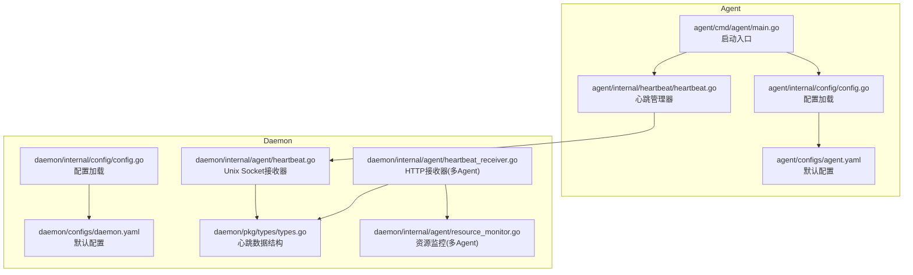
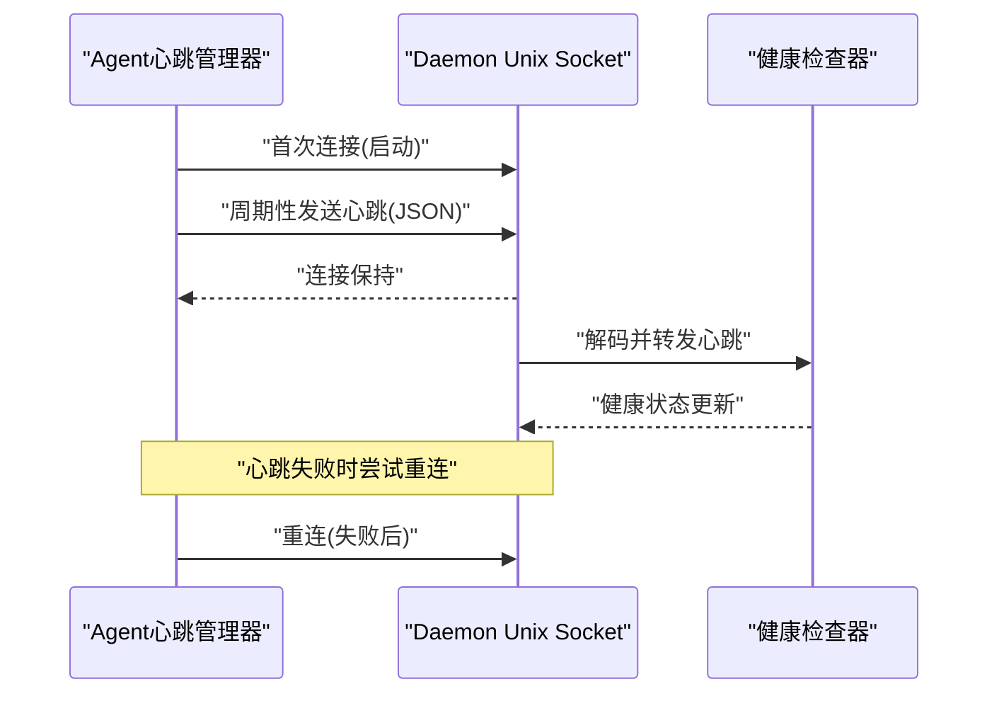
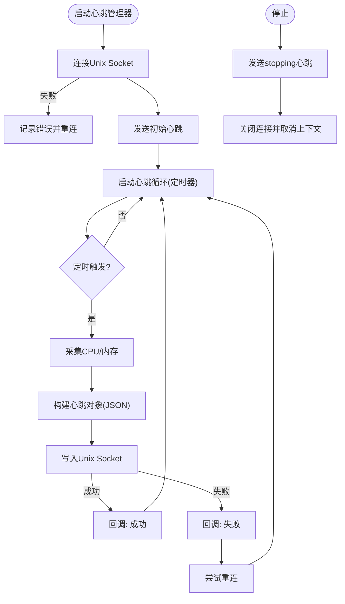
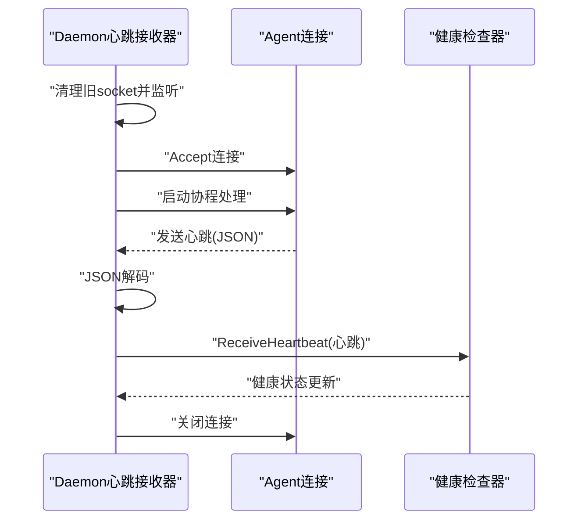
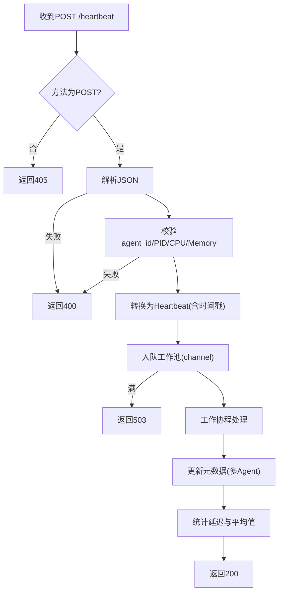
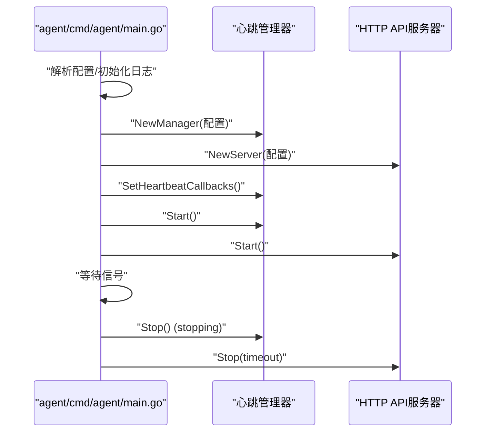
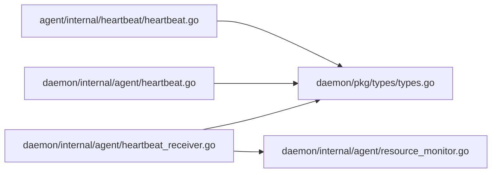

# 心跳模块

<cite>
**本文引用的文件**
- [agent/internal/heartbeat/heartbeat.go](file://agent/internal/heartbeat/heartbeat.go)
- [agent/cmd/agent/main.go](file://agent/cmd/agent/main.go)
- [agent/internal/config/config.go](file://agent/internal/config/config.go)
- [agent/configs/agent.yaml](file://agent/configs/agent.yaml)
- [daemon/internal/agent/heartbeat.go](file://daemon/internal/agent/heartbeat.go)
- [daemon/internal/agent/heartbeat_receiver.go](file://daemon/internal/agent/heartbeat_receiver.go)
- [daemon/internal/config/config.go](file://daemon/internal/config/config.go)
- [daemon/configs/daemon.yaml](file://daemon/configs/daemon.yaml)
- [daemon/pkg/types/types.go](file://daemon/pkg/types/types.go)
- [daemon/internal/agent/resource_monitor.go](file://daemon/internal/agent/resource_monitor.go)
</cite>

## 目录
1. [简介](#简介)
2. [项目结构](#项目结构)
3. [核心组件](#核心组件)
4. [架构总览](#架构总览)
5. [组件详解](#组件详解)
6. [依赖关系分析](#依赖关系分析)
7. [性能与可靠性](#性能与可靠性)
8. [故障排查指南](#故障排查指南)
9. [结论](#结论)
10. [附录](#附录)

## 简介
本专项文档聚焦于Agent与Daemon之间的“心跳模块”，系统阐述心跳协议在维持连接状态、上报运行状态与资源使用方面的职责；Agent侧通过Unix Socket周期性上报心跳，Daemon侧负责接收与健康判定；同时覆盖心跳失败的重连策略、本地状态记录、Goroutine启动流程与信号处理、配置项调整（心跳间隔、超时阈值）以及直连模式下的差异说明。

## 项目结构
心跳模块横跨Agent与Daemon两端：
- Agent端：心跳发送器负责采集CPU/内存等指标并通过Unix Socket上报；启动时建立连接并进入周期性心跳循环；停止时发送“stopping”状态并优雅关闭。
- Daemon端：提供两种心跳接收方式（Unix Socket与HTTP），前者面向单机直连，后者面向多Agent场景；接收心跳后交由健康检查器判定状态。

图表来源
- [agent/cmd/agent/main.go](file://agent/cmd/agent/main.go#L1-L138)
- [agent/internal/heartbeat/heartbeat.go](file://agent/internal/heartbeat/heartbeat.go#L1-L228)
- [agent/internal/config/config.go](file://agent/internal/config/config.go#L1-L111)
- [agent/configs/agent.yaml](file://agent/configs/agent.yaml#L1-L22)
- [daemon/internal/config/config.go](file://daemon/internal/config/config.go#L1-L499)
- [daemon/configs/daemon.yaml](file://daemon/configs/daemon.yaml#L1-L63)
- [daemon/internal/agent/heartbeat.go](file://daemon/internal/agent/heartbeat.go#L1-L122)
- [daemon/internal/agent/heartbeat_receiver.go](file://daemon/internal/agent/heartbeat_receiver.go#L1-L397)
- [daemon/pkg/types/types.go](file://daemon/pkg/types/types.go#L1-L111)
- [daemon/internal/agent/resource_monitor.go](file://daemon/internal/agent/resource_monitor.go#L195-L566)

章节来源
- [agent/cmd/agent/main.go](file://agent/cmd/agent/main.go#L1-L138)
- [agent/internal/heartbeat/heartbeat.go](file://agent/internal/heartbeat/heartbeat.go#L1-L228)
- [agent/internal/config/config.go](file://agent/internal/config/config.go#L1-L111)
- [agent/configs/agent.yaml](file://agent/configs/agent.yaml#L1-L22)
- [daemon/internal/config/config.go](file://daemon/internal/config/config.go#L1-L499)
- [daemon/configs/daemon.yaml](file://daemon/configs/daemon.yaml#L1-L63)
- [daemon/internal/agent/heartbeat.go](file://daemon/internal/agent/heartbeat.go#L1-L122)
- [daemon/internal/agent/heartbeat_receiver.go](file://daemon/internal/agent/heartbeat_receiver.go#L1-L397)
- [daemon/pkg/types/types.go](file://daemon/pkg/types/types.go#L1-L111)
- [daemon/internal/agent/resource_monitor.go](file://daemon/internal/agent/resource_monitor.go#L195-L566)

## 核心组件
- Agent心跳管理器（Manager）
  - 负责：建立Unix Socket连接、周期性采集CPU/内存、序列化心跳、发送心跳、失败重连、回调通知、优雅停机。
- Daemon心跳接收器（Unix Socket）
  - 负责：监听Unix Socket、接受连接、解码心跳、转发至健康检查器。
- Daemon心跳接收器（HTTP，多Agent）
  - 负责：HTTP接口接收心跳、校验与转换、工作池并发处理、统计信息、优雅停止。
- 类型定义（types.Heartbeat）
  - 统一心跳数据结构，包含PID、时间戳、版本、状态、CPU、内存等字段。

章节来源
- [agent/internal/heartbeat/heartbeat.go](file://agent/internal/heartbeat/heartbeat.go#L1-L228)
- [daemon/internal/agent/heartbeat.go](file://daemon/internal/agent/heartbeat.go#L1-L122)
- [daemon/internal/agent/heartbeat_receiver.go](file://daemon/internal/agent/heartbeat_receiver.go#L1-L397)
- [daemon/pkg/types/types.go](file://daemon/pkg/types/types.go#L1-L111)

## 架构总览
Agent与Daemon的心跳交互采用“本地直连”与“远程多Agent”两条路径：
- 本地直连（Unix Socket）：Agent直接连接Daemon提供的Unix Socket，周期上报心跳，适合单机部署或轻量级场景。
- 多Agent（HTTP）：Daemon提供HTTP端点接收心跳，适用于多Agent并发处理与扩展场景。

图表来源
- [agent/internal/heartbeat/heartbeat.go](file://agent/internal/heartbeat/heartbeat.go#L66-L127)
- [daemon/internal/agent/heartbeat.go](file://daemon/internal/agent/heartbeat.go#L38-L122)
- [daemon/internal/agent/heartbeat_receiver.go](file://daemon/internal/agent/heartbeat_receiver.go#L116-L174)

## 组件详解

### Agent心跳管理器（StatusCollector与SocketClient）
- 连接建立
  - 启动时通过Unix Socket连接到Daemon提供的socket路径；连接成功后立即发送一次心跳。
- 周期上报
  - 使用定时器按配置的间隔（默认30秒）发送心跳；心跳内容包含进程PID、时间戳、版本、状态、CPU、内存。
- 资源采集
  - 采集当前Agent进程的CPU使用率与内存RSS，作为心跳指标。
- 失败处理
  - 发送失败时记录错误并尝试重连；重连成功后继续心跳循环。
- 回调集成
  - 通过回调通知API服务器心跳成功/失败，用于UI状态刷新。
- 优雅停机
  - 停止时发送“stopping”状态心跳，关闭连接并取消上下文。

图表来源
- [agent/internal/heartbeat/heartbeat.go](file://agent/internal/heartbeat/heartbeat.go#L66-L127)
- [agent/internal/heartbeat/heartbeat.go](file://agent/internal/heartbeat/heartbeat.go#L129-L180)
- [agent/internal/heartbeat/heartbeat.go](file://agent/internal/heartbeat/heartbeat.go#L182-L206)
- [agent/internal/heartbeat/heartbeat.go](file://agent/internal/heartbeat/heartbeat.go#L208-L228)

章节来源
- [agent/internal/heartbeat/heartbeat.go](file://agent/internal/heartbeat/heartbeat.go#L1-L228)
- [agent/cmd/agent/main.go](file://agent/cmd/agent/main.go#L54-L119)

### Daemon心跳接收器（Unix Socket）
- 监听与接受
  - 清理旧socket文件，创建Unix Socket监听器；接受连接后为每个连接启动独立协程处理。
- 解码与转发
  - 使用JSON解码器逐条读取心跳；将心跳对象传递给健康检查器进行状态判定。
- 优雅停止
  - 取消上下文、关闭监听器、等待所有连接处理完成并清理socket文件。

图表来源
- [daemon/internal/agent/heartbeat.go](file://daemon/internal/agent/heartbeat.go#L38-L122)

章节来源
- [daemon/internal/agent/heartbeat.go](file://daemon/internal/agent/heartbeat.go#L1-L122)

### Daemon心跳接收器（HTTP，多Agent）
- 接口与并发
  - 提供POST /heartbeat接收心跳；内部使用工作池并发处理，避免阻塞。
- 校验与转换
  - 校验agent_id存在、PID>0、CPU范围、Memory非负；将请求转换为统一心跳结构，时间戳可选。
- 统计与可观测
  - 统计接收/处理/错误总数、最后接收时间、平均延迟；提供GET /stats查询。
- 优雅停止
  - 关闭停止通道，等待工作池内任务完成并退出。

图表来源
- [daemon/internal/agent/heartbeat_receiver.go](file://daemon/internal/agent/heartbeat_receiver.go#L116-L174)
- [daemon/internal/agent/heartbeat_receiver.go](file://daemon/internal/agent/heartbeat_receiver.go#L176-L234)
- [daemon/internal/agent/heartbeat_receiver.go](file://daemon/internal/agent/heartbeat_receiver.go#L236-L309)
- [daemon/internal/agent/heartbeat_receiver.go](file://daemon/internal/agent/heartbeat_receiver.go#L311-L331)

章节来源
- [daemon/internal/agent/heartbeat_receiver.go](file://daemon/internal/agent/heartbeat_receiver.go#L1-L397)

### 心跳协议数据格式
- Agent侧发送的JSON字段
  - pid、timestamp、version、status、cpu、memory
- Daemon侧接收的统一结构
  - PID、Timestamp、Version、Status、CPU、Memory
- 时间戳处理
  - HTTP接收器支持客户端传入RFC3339时间戳，否则使用服务器时间。

章节来源
- [agent/internal/heartbeat/heartbeat.go](file://agent/internal/heartbeat/heartbeat.go#L15-L24)
- [daemon/pkg/types/types.go](file://daemon/pkg/types/types.go#L37-L46)
- [daemon/internal/agent/heartbeat_receiver.go](file://daemon/internal/agent/heartbeat_receiver.go#L206-L234)

### 心跳失败处理机制
- 重连策略
  - Agent侧心跳发送失败时尝试重连；重连成功后继续心跳循环。
- 本地状态记录
  - Agent侧维护最近一次CPU/内存缓存；通过回调通知API服务器心跳状态变化。
- 优雅停机
  - Agent停止时发送“stopping”心跳并关闭连接；Daemon停止时清理socket文件。

章节来源
- [agent/internal/heartbeat/heartbeat.go](file://agent/internal/heartbeat/heartbeat.go#L108-L127)
- [agent/internal/heartbeat/heartbeat.go](file://agent/internal/heartbeat/heartbeat.go#L129-L180)
- [agent/internal/heartbeat/heartbeat.go](file://agent/internal/heartbeat/heartbeat.go#L208-L228)
- [daemon/internal/agent/heartbeat.go](file://daemon/internal/agent/heartbeat.go#L58-L73)

### 心跳Goroutine启动流程与信号处理
- Agent启动流程
  - 解析配置、初始化日志、创建心跳管理器、创建API服务器、设置回调、启动心跳与HTTP服务、等待信号。
- 信号处理
  - 捕获SIGINT/SIGTERM，执行优雅停机：先发送最后一次心跳，再停止HTTP服务。

图表来源
- [agent/cmd/agent/main.go](file://agent/cmd/agent/main.go#L24-L119)
- [agent/internal/heartbeat/heartbeat.go](file://agent/internal/heartbeat/heartbeat.go#L66-L106)

章节来源
- [agent/cmd/agent/main.go](file://agent/cmd/agent/main.go#L1-L138)
- [agent/internal/heartbeat/heartbeat.go](file://agent/internal/heartbeat/heartbeat.go#L66-L106)

### 配置调整：心跳间隔与超时阈值
- Agent侧
  - heartbeat.socket_path：Unix Socket路径（默认/tmp/daemon.sock）
  - heartbeat.interval：心跳间隔（默认30s）
  - 可通过环境变量或配置文件覆盖
- Daemon侧
  - manager.heartbeat_interval：Manager心跳间隔（默认60s）
  - manager.reconnect_interval：重连间隔（默认10s）
  - manager.timeout：超时（默认30s）
  - agent.health_check.heartbeat_timeout：Agent心跳超时阈值（默认90s）
  - agent.health_check.cpu_threshold、memory_threshold、threshold_duration：资源阈值与持续时长

章节来源
- [agent/internal/config/config.go](file://agent/internal/config/config.go#L38-L111)
- [agent/configs/agent.yaml](file://agent/configs/agent.yaml#L1-L22)
- [daemon/internal/config/config.go](file://daemon/internal/config/config.go#L205-L245)
- [daemon/configs/daemon.yaml](file://daemon/configs/daemon.yaml#L1-L63)

### 直连模式与HTTP模式差异
- 直连模式（Unix Socket）
  - Agent直接连接Daemon的Unix Socket；适合单机或轻量部署。
- HTTP模式（多Agent）
  - Daemon提供HTTP端点接收心跳；支持工作池并发处理、统计信息、优雅停止；适合多Agent场景。

章节来源
- [daemon/internal/agent/heartbeat.go](file://daemon/internal/agent/heartbeat.go#L38-L122)
- [daemon/internal/agent/heartbeat_receiver.go](file://daemon/internal/agent/heartbeat_receiver.go#L116-L174)

## 依赖关系分析
- Agent心跳管理器依赖
  - Unix Socket网络连接、进程资源采集库、Zap日志。
- Daemon心跳接收器依赖
  - Unix Socket监听、JSON解码、健康检查器、Zap日志。
- 类型一致性
  - Agent与Daemon共享统一心跳结构，保证跨端兼容。

图表来源
- [agent/internal/heartbeat/heartbeat.go](file://agent/internal/heartbeat/heartbeat.go#L1-L228)
- [daemon/internal/agent/heartbeat.go](file://daemon/internal/agent/heartbeat.go#L1-L122)
- [daemon/internal/agent/heartbeat_receiver.go](file://daemon/internal/agent/heartbeat_receiver.go#L1-L397)
- [daemon/pkg/types/types.go](file://daemon/pkg/types/types.go#L1-L111)
- [daemon/internal/agent/resource_monitor.go](file://daemon/internal/agent/resource_monitor.go#L195-L566)

章节来源
- [agent/internal/heartbeat/heartbeat.go](file://agent/internal/heartbeat/heartbeat.go#L1-L228)
- [daemon/internal/agent/heartbeat.go](file://daemon/internal/agent/heartbeat.go#L1-L122)
- [daemon/internal/agent/heartbeat_receiver.go](file://daemon/internal/agent/heartbeat_receiver.go#L1-L397)
- [daemon/pkg/types/types.go](file://daemon/pkg/types/types.go#L1-L111)
- [daemon/internal/agent/resource_monitor.go](file://daemon/internal/agent/resource_monitor.go#L195-L566)

## 性能与可靠性
- 性能特性
  - Agent侧心跳间隔默认30秒，减少IO与CPU开销；HTTP接收器通过工作池并发处理，避免阻塞。
  - Daemon侧对心跳进行统计与平均延迟计算，便于观测处理能力。
- 可靠性保障
  - 心跳失败自动重连；Agent停机时发送“stopping”状态；Daemon优雅停止并清理socket文件。
  - HTTP接收器在工作池满时返回503，避免过载丢弃。

章节来源
- [agent/internal/heartbeat/heartbeat.go](file://agent/internal/heartbeat/heartbeat.go#L108-L127)
- [agent/internal/heartbeat/heartbeat.go](file://agent/internal/heartbeat/heartbeat.go#L129-L180)
- [daemon/internal/agent/heartbeat.go](file://daemon/internal/agent/heartbeat.go#L58-L73)
- [daemon/internal/agent/heartbeat_receiver.go](file://daemon/internal/agent/heartbeat_receiver.go#L168-L174)

## 故障排查指南
- 连接失败
  - 检查Unix Socket路径是否正确；确认Daemon已启动并监听该路径。
- 心跳超时
  - 调整Agent心跳间隔与Daemon心跳超时阈值；关注CPU/内存阈值与持续时长配置。
- HTTP接收器满载
  - 观察503错误；增加工作池大小或提升处理能力。
- 优雅停机问题
  - 确认Agent在停止时发送“stopping”心跳；Daemon停止时清理socket文件。

章节来源
- [agent/internal/heartbeat/heartbeat.go](file://agent/internal/heartbeat/heartbeat.go#L208-L228)
- [daemon/internal/agent/heartbeat.go](file://daemon/internal/agent/heartbeat.go#L58-L73)
- [daemon/internal/agent/heartbeat_receiver.go](file://daemon/internal/agent/heartbeat_receiver.go#L168-L174)

## 结论
心跳模块通过Agent与Daemon之间的可靠通信，实现连接状态维持与运行状态上报。Agent侧负责采集与上报，Daemon侧负责接收与健康判定；两者均具备完善的失败处理与优雅停机机制。通过配置可灵活调整心跳间隔与超时阈值，满足不同部署场景的需求。

## 附录
- 默认配置要点
  - Agent：socket_path默认/tmp/daemon.sock；interval默认30s。
  - Daemon：manager.heartbeat_interval默认60s；manager.timeout默认30s；agent.health_check.heartbeat_timeout默认90s。
- 资源采集范围
  - Agent侧仅采集自身进程的CPU与内存；Daemon侧可通过资源监控器对多Agent进行更全面的资源聚合与统计。

章节来源
- [agent/configs/agent.yaml](file://agent/configs/agent.yaml#L1-L22)
- [daemon/configs/daemon.yaml](file://daemon/configs/daemon.yaml#L1-L63)
- [daemon/internal/agent/resource_monitor.go](file://daemon/internal/agent/resource_monitor.go#L195-L566)