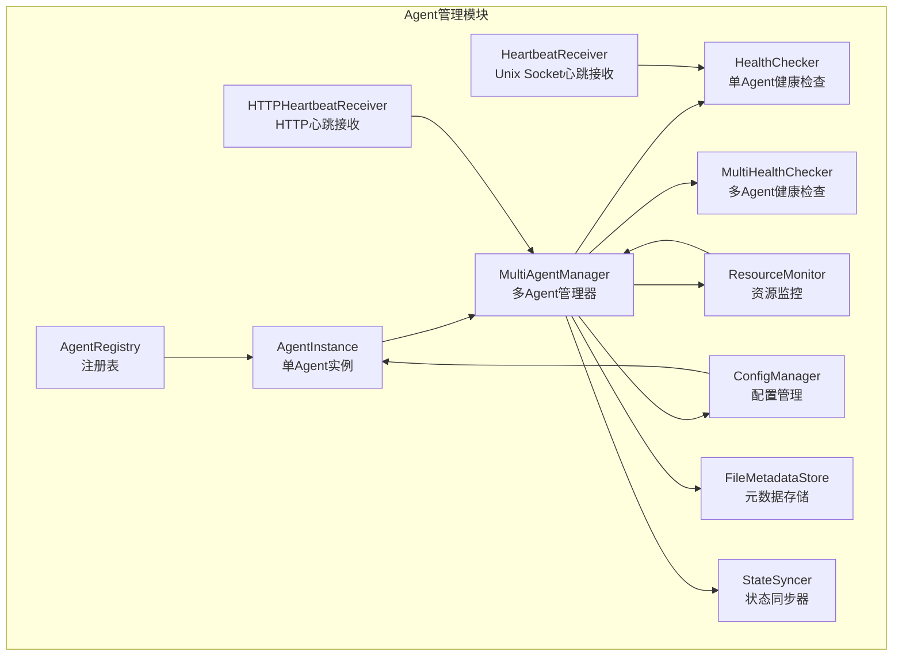
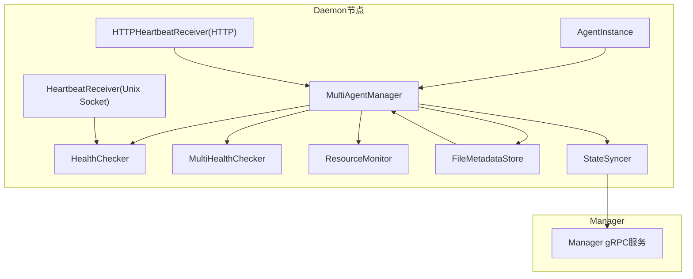
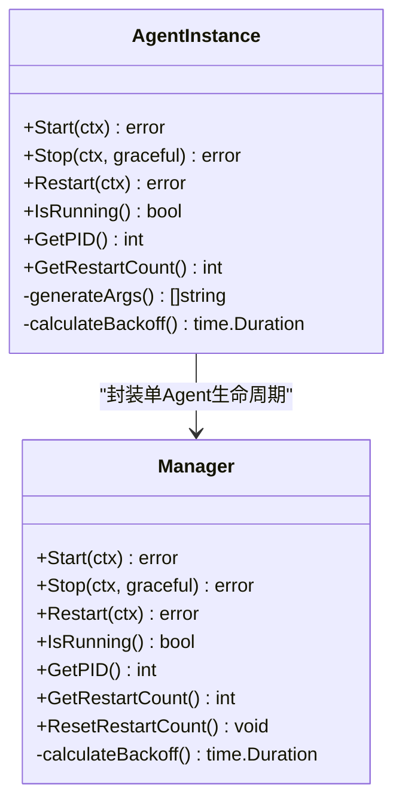
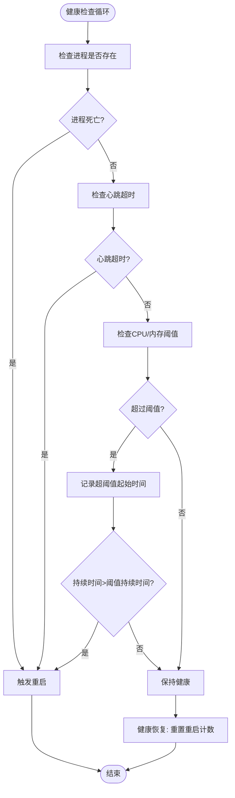
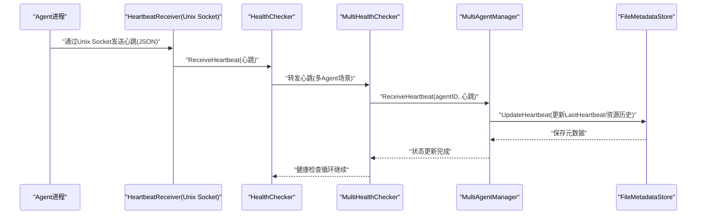
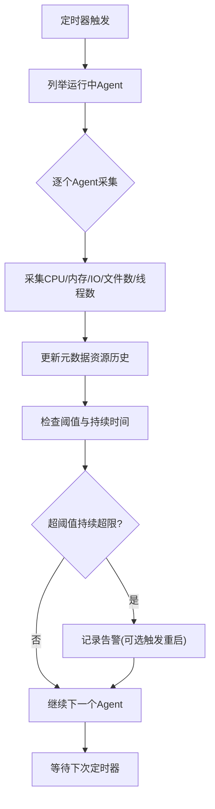
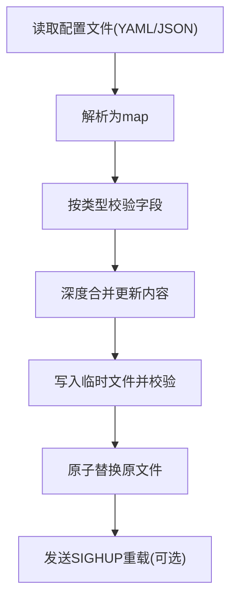
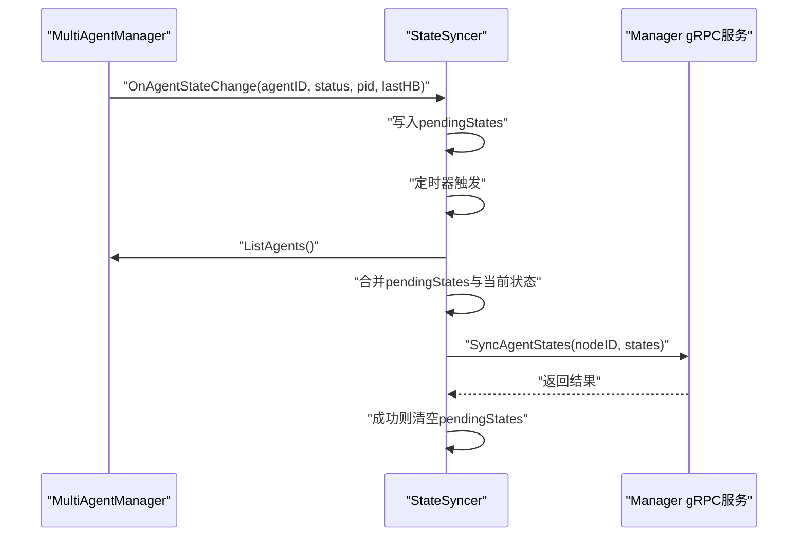
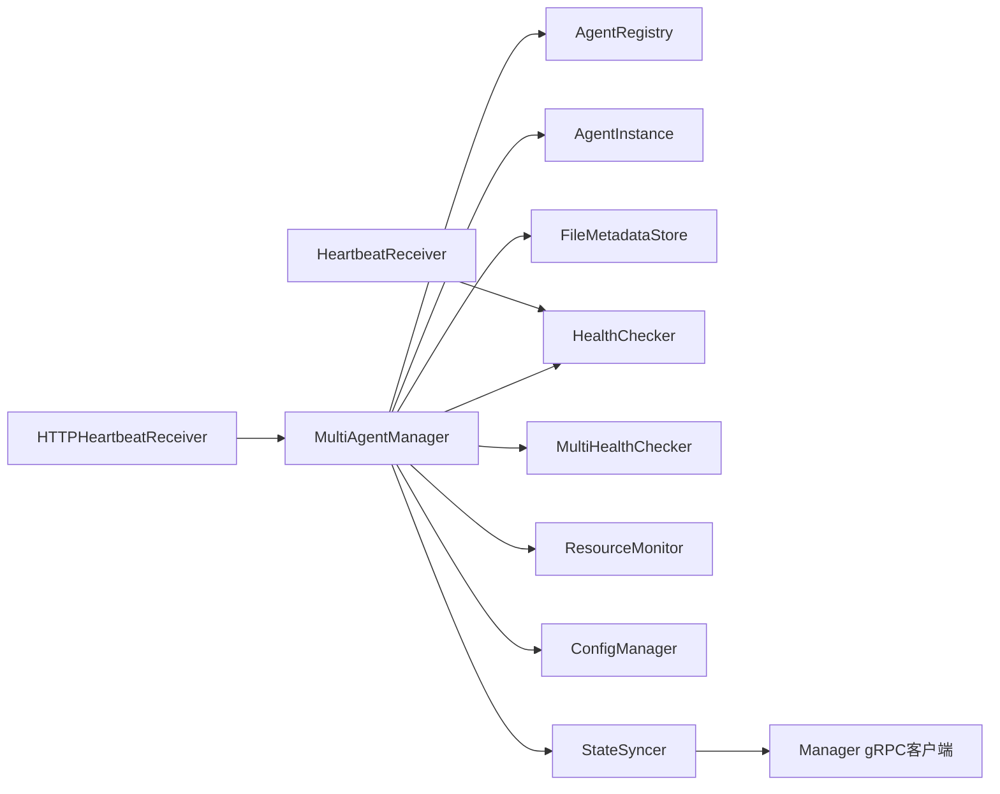

# Agent管理模块

<cite>
**本文引用的文件**
- [manager/internal/grpc/daemon_server.go](file://manager/internal/grpc/daemon_server.go)
- [daemon/internal/agent/manager.go](file://daemon/internal/agent/manager.go)
- [daemon/internal/agent/instance.go](file://daemon/internal/agent/instance.go)
- [daemon/internal/agent/multi_manager.go](file://daemon/internal/agent/multi_manager.go)
- [daemon/internal/agent/health.go](file://daemon/internal/agent/health.go)
- [daemon/internal/agent/multi_health_checker.go](file://daemon/internal/agent/multi_health_checker.go)
- [daemon/internal/agent/heartbeat.go](file://daemon/internal/agent/heartbeat.go)
- [daemon/internal/agent/heartbeat_receiver.go](file://daemon/internal/agent/heartbeat_receiver.go)
- [daemon/internal/agent/resource_monitor.go](file://daemon/internal/agent/resource_monitor.go)
- [daemon/internal/agent/config_manager.go](file://daemon/internal/agent/config_manager.go)
- [daemon/internal/agent/registry.go](file://daemon/internal/agent/registry.go)
- [daemon/internal/agent/metadata_store.go](file://daemon/internal/agent/metadata_store.go)
- [daemon/internal/agent/state_syncer.go](file://daemon/internal/agent/state_syncer.go)
- [daemon/internal/config/config.go](file://daemon/internal/config/config.go)
</cite>

## 目录
1. [简介](#简介)
2. [项目结构](#项目结构)
3. [核心组件](#核心组件)
4. [架构总览](#架构总览)
5. [详细组件分析](#详细组件分析)
6. [依赖分析](#依赖分析)
7. [性能考虑](#性能考虑)
8. [故障排查指南](#故障排查指南)
9. [结论](#结论)
10. [附录](#附录)

## 简介
本文件聚焦Daemon的Agent管理模块，系统性阐述其职责与实现：管理Agent进程的生命周期（启动、停止、重启）、健康检查、心跳接收与资源监控；解释ProcessManager（此处对应单Agent实例管理）如何通过os.Process启动和管理Agent独立进程，并实现基于退避算法的自动重启机制；说明HealthChecker如何结合进程状态、心跳超时和资源占用（CPU、内存）来判断Agent健康状态；阐述HeartbeatReceiver如何通过Unix Socket接收Agent的心跳消息，并将状态传递给健康检查器。文档还包含Agent管理状态机图和心跳通信序列图，帮助开发者理解高可用保障机制。

## 项目结构
Agent管理模块位于daemon/internal/agent目录，围绕“注册表-实例-管理器-健康检查-心跳-资源监控-元数据-状态同步”构建，形成清晰的分层与职责边界：
- 注册表与元数据：统一管理Agent信息与持久化元数据
- 实例与管理器：封装单Agent生命周期与多Agent编排
- 健康检查与心跳：周期性检查进程与资源，接收心跳并判定健康
- 资源监控：周期采集并记录资源历史，辅助阈值告警
- 配置管理：读取、校验、热重载Agent配置
- 状态同步：向Manager上报节点内各Agent状态

图表来源
- [daemon/internal/agent/registry.go](file://daemon/internal/agent/registry.go#L156-L314)
- [daemon/internal/agent/metadata_store.go](file://daemon/internal/agent/metadata_store.go#L133-L384)
- [daemon/internal/agent/instance.go](file://daemon/internal/agent/instance.go#L1-L120)
- [daemon/internal/agent/multi_manager.go](file://daemon/internal/agent/multi_manager.go#L1-L120)
- [daemon/internal/agent/health.go](file://daemon/internal/agent/health.go#L1-L120)
- [daemon/internal/agent/multi_health_checker.go](file://daemon/internal/agent/multi_health_checker.go#L1-L120)
- [daemon/internal/agent/heartbeat.go](file://daemon/internal/agent/heartbeat.go#L1-L122)
- [daemon/internal/agent/heartbeat_receiver.go](file://daemon/internal/agent/heartbeat_receiver.go#L1-L120)
- [daemon/internal/agent/resource_monitor.go](file://daemon/internal/agent/resource_monitor.go#L1-L120)
- [daemon/internal/agent/config_manager.go](file://daemon/internal/agent/config_manager.go#L1-L120)
- [daemon/internal/agent/state_syncer.go](file://daemon/internal/agent/state_syncer.go#L1-L120)

章节来源
- [daemon/internal/agent/registry.go](file://daemon/internal/agent/registry.go#L1-L155)
- [daemon/internal/agent/metadata_store.go](file://daemon/internal/agent/metadata_store.go#L1-L132)
- [daemon/internal/agent/multi_manager.go](file://daemon/internal/agent/multi_manager.go#L1-L120)

## 核心组件
- AgentRegistry：集中管理Agent注册信息，提供并发安全的增删查列表能力
- AgentInstance：封装单Agent生命周期（启动、停止、重启），内置进程状态与重启退避
- MultiAgentManager：多Agent编排入口，负责批量操作、状态变更回调、元数据更新
- HealthChecker：单Agent健康检查器，周期检查进程、心跳与资源，必要时触发重启
- MultiHealthChecker：多Agent健康检查器，按Agent类型差异化策略（如Node Exporter HTTP检查）
- HeartbeatReceiver（Unix Socket）：监听本地Unix Socket，解码心跳并转发给健康检查器
- HTTPHeartbeatReceiver：提供HTTP端点接收心跳，工作池并发处理，更新元数据并统计
- ResourceMonitor：周期采集Agent资源使用，记录历史并检查阈值
- ConfigManager：读取/校验/合并/热重载Agent配置，支持fsnotify监听
- StateSyncer：监听Agent状态变化，定期向Manager上报节点内各Agent状态

章节来源
- [daemon/internal/agent/registry.go](file://daemon/internal/agent/registry.go#L156-L314)
- [daemon/internal/agent/instance.go](file://daemon/internal/agent/instance.go#L1-L120)
- [daemon/internal/agent/multi_manager.go](file://daemon/internal/agent/multi_manager.go#L1-L120)
- [daemon/internal/agent/health.go](file://daemon/internal/agent/health.go#L1-L120)
- [daemon/internal/agent/multi_health_checker.go](file://daemon/internal/agent/multi_health_checker.go#L1-L120)
- [daemon/internal/agent/heartbeat.go](file://daemon/internal/agent/heartbeat.go#L1-L122)
- [daemon/internal/agent/heartbeat_receiver.go](file://daemon/internal/agent/heartbeat_receiver.go#L1-L120)
- [daemon/internal/agent/resource_monitor.go](file://daemon/internal/agent/resource_monitor.go#L1-L120)
- [daemon/internal/agent/config_manager.go](file://daemon/internal/agent/config_manager.go#L1-L120)
- [daemon/internal/agent/state_syncer.go](file://daemon/internal/agent/state_syncer.go#L1-L120)

## 架构总览
Agent管理模块通过“注册表-实例-管理器-健康检查-心跳-资源监控-元数据-状态同步”的协作，实现对多Agent的全生命周期与高可用保障。健康检查器与资源监控器共同构成“健康判定引擎”，心跳接收器提供“实时健康反馈”，状态同步器将节点内的Agent状态上报至Manager，形成闭环。

图表来源
- [daemon/internal/agent/multi_manager.go](file://daemon/internal/agent/multi_manager.go#L120-L220)
- [daemon/internal/agent/health.go](file://daemon/internal/agent/health.go#L1-L120)
- [daemon/internal/agent/multi_health_checker.go](file://daemon/internal/agent/multi_health_checker.go#L1-L120)
- [daemon/internal/agent/heartbeat.go](file://daemon/internal/agent/heartbeat.go#L1-L122)
- [daemon/internal/agent/heartbeat_receiver.go](file://daemon/internal/agent/heartbeat_receiver.go#L1-L120)
- [daemon/internal/agent/resource_monitor.go](file://daemon/internal/agent/resource_monitor.go#L1-L120)
- [daemon/internal/agent/metadata_store.go](file://daemon/internal/agent/metadata_store.go#L133-L220)
- [daemon/internal/agent/state_syncer.go](file://daemon/internal/agent/state_syncer.go#L1-L120)
- [manager/internal/grpc/daemon_server.go](file://manager/internal/grpc/daemon_server.go#L1-L120)

## 详细组件分析

### 进程管理与生命周期（Manager/AgentInstance）
- 启动：通过os/exec启动Agent二进制，设置进程组，重定向标准输出到日志文件，后台等待进程退出并更新状态
- 停止：支持优雅停止（SIGTERM）与强制停止（SIGKILL），带超时控制与上下文取消
- 重启：基于退避算法（连续重启次数分级）计算等待时间，先停止再启动，更新重启计数与时间戳
- 健康判定：通过进程信号0检查存活，结合心跳与资源阈值综合评估

图表来源
- [daemon/internal/agent/instance.go](file://daemon/internal/agent/instance.go#L1-L200)
- [daemon/internal/agent/manager.go](file://daemon/internal/agent/manager.go#L1-L120)

章节来源
- [daemon/internal/agent/instance.go](file://daemon/internal/agent/instance.go#L1-L200)
- [daemon/internal/agent/manager.go](file://daemon/internal/agent/manager.go#L1-L120)

### 健康检查与自动重启（HealthChecker/MultiHealthChecker）
- HealthChecker（单Agent）：周期性检查进程存活、心跳超时、CPU/内存阈值，超阈值持续超过阈值持续时间则重启；健康恢复后重置重启计数
- MultiHealthChecker（多Agent）：为每个Agent独立goroutine执行检查，支持按Agent类型差异化策略（如Node Exporter HTTP检查），并维护每个Agent的健康状态快照

图表来源
- [daemon/internal/agent/health.go](file://daemon/internal/agent/health.go#L120-L197)
- [daemon/internal/agent/multi_health_checker.go](file://daemon/internal/agent/multi_health_checker.go#L190-L280)

章节来源
- [daemon/internal/agent/health.go](file://daemon/internal/agent/health.go#L120-L197)
- [daemon/internal/agent/multi_health_checker.go](file://daemon/internal/agent/multi_health_checker.go#L190-L280)

### 心跳接收与状态传递（Unix Socket/HTTP）
- Unix Socket心跳接收器：监听本地Unix Socket，解码心跳JSON，将心跳传递给HealthChecker
- HTTP心跳接收器：提供POST /heartbeat接收心跳，工作池并发处理，校验与转换心跳，调用MultiAgentManager.UpdateHeartbeat更新元数据与资源历史

图表来源
- [daemon/internal/agent/heartbeat.go](file://daemon/internal/agent/heartbeat.go#L1-L122)
- [daemon/internal/agent/health.go](file://daemon/internal/agent/health.go#L58-L120)
- [daemon/internal/agent/multi_health_checker.go](file://daemon/internal/agent/multi_health_checker.go#L150-L170)
- [daemon/internal/agent/multi_manager.go](file://daemon/internal/agent/multi_manager.go#L486-L523)
- [daemon/internal/agent/metadata_store.go](file://daemon/internal/agent/metadata_store.go#L133-L220)

章节来源
- [daemon/internal/agent/heartbeat.go](file://daemon/internal/agent/heartbeat.go#L1-L122)
- [daemon/internal/agent/heartbeat_receiver.go](file://daemon/internal/agent/heartbeat_receiver.go#L116-L174)
- [daemon/internal/agent/multi_manager.go](file://daemon/internal/agent/multi_manager.go#L486-L523)

### 资源监控与阈值告警（ResourceMonitor）
- 周期采集：遍历运行中的Agent，采集CPU、内存、磁盘IO、打开文件数、线程数等指标
- 历史记录：将数据点追加到ResourceUsageHistory，自动维护最大历史长度
- 阈值检查：按Agent配置阈值与持续时间进行告警，必要时触发重启（健康检查器负责重启）

图表来源
- [daemon/internal/agent/resource_monitor.go](file://daemon/internal/agent/resource_monitor.go#L237-L313)
- [daemon/internal/agent/resource_monitor.go](file://daemon/internal/agent/resource_monitor.go#L314-L374)
- [daemon/internal/agent/metadata_store.go](file://daemon/internal/agent/metadata_store.go#L1-L132)

章节来源
- [daemon/internal/agent/resource_monitor.go](file://daemon/internal/agent/resource_monitor.go#L237-L374)
- [daemon/internal/agent/metadata_store.go](file://daemon/internal/agent/metadata_store.go#L1-L132)

### 配置管理与热重载（ConfigManager）
- 读取与解析：自动识别YAML/JSON格式，解析为map[string]interface{}
- 校验：按Agent类型进行字段校验（如Filebeat必须有inputs与output，Telegraf必须有agent或至少一个input/output）
- 更新：深度合并当前配置与更新内容，原子写入临时文件并替换
- 监听：fsnotify监听配置目录变化，触发SIGHUP信号重载（若Agent支持）

图表来源
- [daemon/internal/agent/config_manager.go](file://daemon/internal/agent/config_manager.go#L68-L120)
- [daemon/internal/agent/config_manager.go](file://daemon/internal/agent/config_manager.go#L171-L226)
- [daemon/internal/agent/config_manager.go](file://daemon/internal/agent/config_manager.go#L227-L301)
- [daemon/internal/agent/config_manager.go](file://daemon/internal/agent/config_manager.go#L303-L380)
- [daemon/internal/agent/config_manager.go](file://daemon/internal/agent/config_manager.go#L416-L477)

章节来源
- [daemon/internal/agent/config_manager.go](file://daemon/internal/agent/config_manager.go#L68-L120)
- [daemon/internal/agent/config_manager.go](file://daemon/internal/agent/config_manager.go#L171-L226)
- [daemon/internal/agent/config_manager.go](file://daemon/internal/agent/config_manager.go#L227-L301)
- [daemon/internal/agent/config_manager.go](file://daemon/internal/agent/config_manager.go#L303-L380)
- [daemon/internal/agent/config_manager.go](file://daemon/internal/agent/config_manager.go#L416-L477)

### 状态同步与上报（StateSyncer）
- 监听：MultiAgentManager在启动/停止/重启后回调状态变化
- 缓存：将状态变化暂存到pendingStates，避免频繁上报
- 定时：按固定间隔收集当前状态与待同步状态，合并后调用Manager gRPC SyncAgentStates上报

图表来源
- [daemon/internal/agent/state_syncer.go](file://daemon/internal/agent/state_syncer.go#L93-L162)
- [daemon/internal/agent/state_syncer.go](file://daemon/internal/agent/state_syncer.go#L164-L224)
- [daemon/internal/agent/state_syncer.go](file://daemon/internal/agent/state_syncer.go#L226-L282)
- [manager/internal/grpc/daemon_server.go](file://manager/internal/grpc/daemon_server.go#L1-L120)

章节来源
- [daemon/internal/agent/state_syncer.go](file://daemon/internal/agent/state_syncer.go#L93-L162)
- [daemon/internal/agent/state_syncer.go](file://daemon/internal/agent/state_syncer.go#L164-L224)
- [daemon/internal/agent/state_syncer.go](file://daemon/internal/agent/state_syncer.go#L226-L282)

## 依赖分析
- 组件耦合
  - MultiAgentManager依赖AgentRegistry、AgentInstance、FileMetadataStore、MultiHealthChecker、ResourceMonitor、ConfigManager、StateSyncer
  - HealthChecker/MultiHealthChecker依赖Manager/AgentInstance、配置与gopsutil进程信息
  - HeartbeatReceiver与HTTPHeartbeatReceiver依赖MultiAgentManager更新元数据
  - StateSyncer依赖Manager gRPC客户端接口
- 外部依赖
  - gopsutil/v3 process：进程CPU/内存/IO/文件数/线程数采集
  - fsnotify：配置文件监听
  - zap：日志
  - viper：配置加载与合并

图表来源
- [daemon/internal/agent/multi_manager.go](file://daemon/internal/agent/multi_manager.go#L1-L120)
- [daemon/internal/agent/health.go](file://daemon/internal/agent/health.go#L1-L120)
- [daemon/internal/agent/multi_health_checker.go](file://daemon/internal/agent/multi_health_checker.go#L1-L120)
- [daemon/internal/agent/heartbeat.go](file://daemon/internal/agent/heartbeat.go#L1-L122)
- [daemon/internal/agent/heartbeat_receiver.go](file://daemon/internal/agent/heartbeat_receiver.go#L1-L120)
- [daemon/internal/agent/resource_monitor.go](file://daemon/internal/agent/resource_monitor.go#L1-L120)
- [daemon/internal/agent/config_manager.go](file://daemon/internal/agent/config_manager.go#L1-L120)
- [daemon/internal/agent/state_syncer.go](file://daemon/internal/agent/state_syncer.go#L1-L120)

章节来源
- [daemon/internal/agent/multi_manager.go](file://daemon/internal/agent/multi_manager.go#L1-L120)
- [daemon/internal/agent/health.go](file://daemon/internal/agent/health.go#L1-L120)
- [daemon/internal/agent/multi_health_checker.go](file://daemon/internal/agent/multi_health_checker.go#L1-L120)
- [daemon/internal/agent/heartbeat.go](file://daemon/internal/agent/heartbeat.go#L1-L122)
- [daemon/internal/agent/heartbeat_receiver.go](file://daemon/internal/agent/heartbeat_receiver.go#L1-L120)
- [daemon/internal/agent/resource_monitor.go](file://daemon/internal/agent/resource_monitor.go#L1-L120)
- [daemon/internal/agent/config_manager.go](file://daemon/internal/agent/config_manager.go#L1-L120)
- [daemon/internal/agent/state_syncer.go](file://daemon/internal/agent/state_syncer.go#L1-L120)

## 性能考虑
- 并发与锁：多处使用RWMutex保护共享状态（AgentInfo、ResourceUsageHistory、pendingStates），减少锁竞争
- 通道与工作池：HTTP心跳接收器使用worker pool与有界channel，避免过载丢弃与背压
- 退避策略：重启等待时间随连续重启次数递增，降低抖动风险
- 周期性采集：资源监控与健康检查采用ticker定时器，避免高频轮询
- 历史记录上限：ResourceUsageHistory限制最大历史长度，控制内存占用

## 故障排查指南
- 进程无法启动/退出
  - 检查二进制路径与权限、工作目录、日志文件路径
  - 查看启动参数生成逻辑与配置文件路径
- 优雅停止无效
  - 确认SIGTERM信号发送与等待超时设置
  - 检查进程是否正确处理SIGTERM
- 心跳丢失
  - 检查Unix Socket路径与权限、监听器状态
  - 确认心跳上报频率与心跳超时配置
- 资源阈值告警频繁
  - 调整CPU/内存阈值与阈值持续时间
  - 检查采集间隔与历史窗口
- 配置热重载失败
  - 检查fsnotify监听目录与事件过滤
  - 确认SIGHUP信号发送成功

章节来源
- [daemon/internal/agent/instance.go](file://daemon/internal/agent/instance.go#L186-L248)
- [daemon/internal/agent/heartbeat.go](file://daemon/internal/agent/heartbeat.go#L38-L73)
- [daemon/internal/agent/heartbeat_receiver.go](file://daemon/internal/agent/heartbeat_receiver.go#L116-L174)
- [daemon/internal/agent/resource_monitor.go](file://daemon/internal/agent/resource_monitor.go#L314-L374)
- [daemon/internal/agent/config_manager.go](file://daemon/internal/agent/config_manager.go#L303-L380)
- [daemon/internal/agent/config_manager.go](file://daemon/internal/agent/config_manager.go#L416-L477)

## 结论
Agent管理模块通过“注册表-实例-管理器-健康检查-心跳-资源监控-元数据-状态同步”的完整链路，实现了对多Agent进程的全生命周期管理与高可用保障。健康检查器与资源监控器协同工作，Unix Socket与HTTP两种心跳接收方式满足不同部署形态，配置管理与状态同步进一步增强了运维可观测性与可维护性。退避重启策略有效缓解瞬时故障带来的抖动，整体架构具备良好的扩展性与稳定性。

## 附录
- 配置结构参考：HealthCheckConfig、RestartConfig、AgentItemConfig、AgentDefaultsConfig
- 关键流程路径
  - 启动流程：[daemon/internal/agent/instance.go](file://daemon/internal/agent/instance.go#L48-L155)
  - 停止流程：[daemon/internal/agent/instance.go](file://daemon/internal/agent/instance.go#L186-L248)
  - 重启流程（退避）：[daemon/internal/agent/instance.go](file://daemon/internal/agent/instance.go#L250-L300)
  - 健康检查循环：[daemon/internal/agent/health.go](file://daemon/internal/agent/health.go#L68-L132)
  - 心跳接收（Unix Socket）：[daemon/internal/agent/heartbeat.go](file://daemon/internal/agent/heartbeat.go#L38-L122)
  - 心跳接收（HTTP）：[daemon/internal/agent/heartbeat_receiver.go](file://daemon/internal/agent/heartbeat_receiver.go#L116-L174)
  - 资源监控采集：[daemon/internal/agent/resource_monitor.go](file://daemon/internal/agent/resource_monitor.go#L237-L313)
  - 配置读取/校验/更新：[daemon/internal/agent/config_manager.go](file://daemon/internal/agent/config_manager.go#L68-L120), [daemon/internal/agent/config_manager.go](file://daemon/internal/agent/config_manager.go#L171-L226), [daemon/internal/agent/config_manager.go](file://daemon/internal/agent/config_manager.go#L227-L301)
  - 状态同步上报：[daemon/internal/agent/state_syncer.go](file://daemon/internal/agent/state_syncer.go#L226-L282)