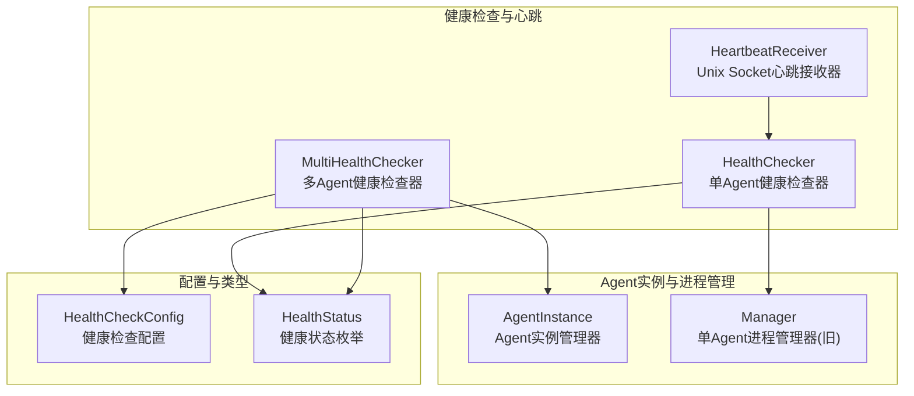
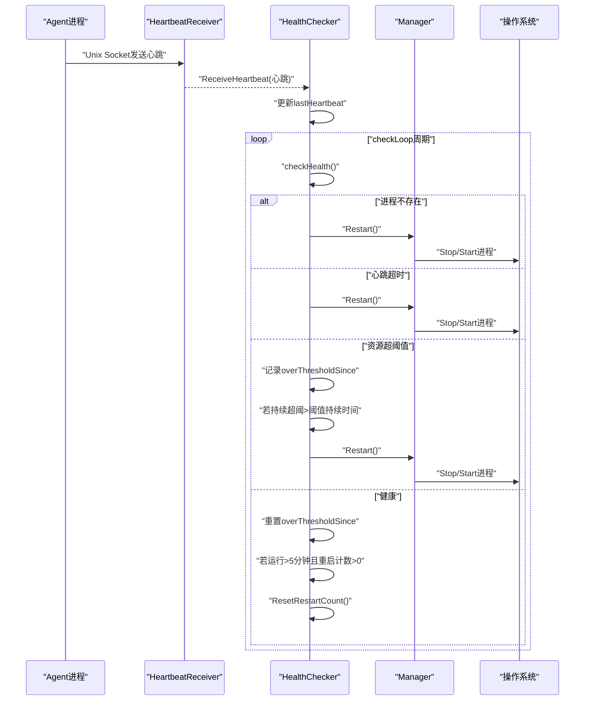
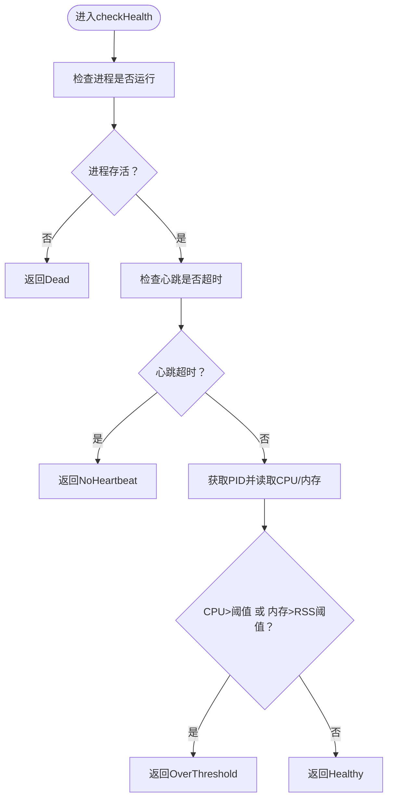
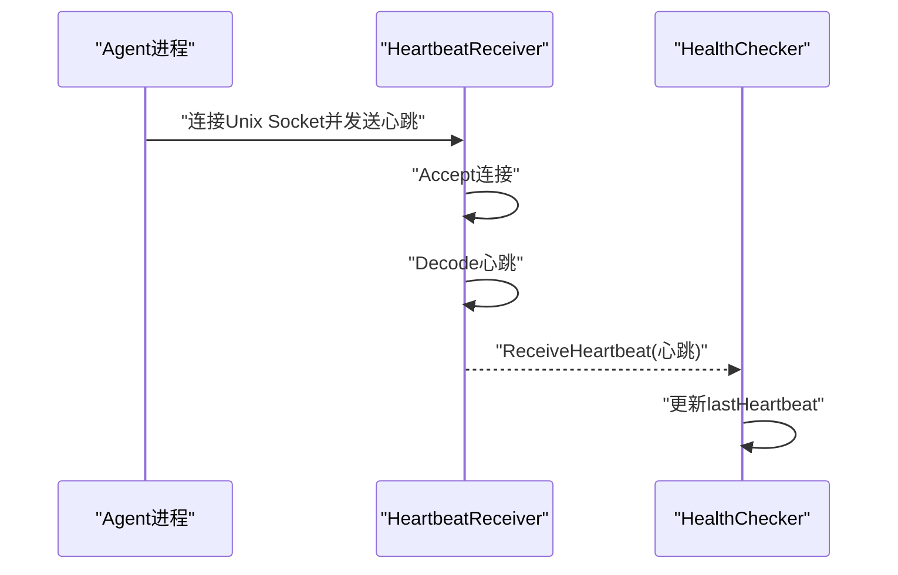
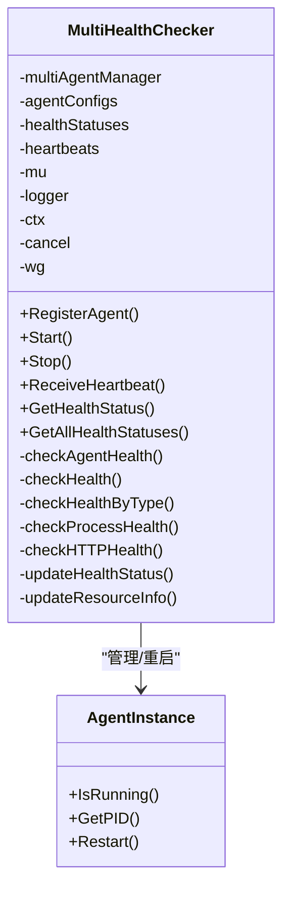
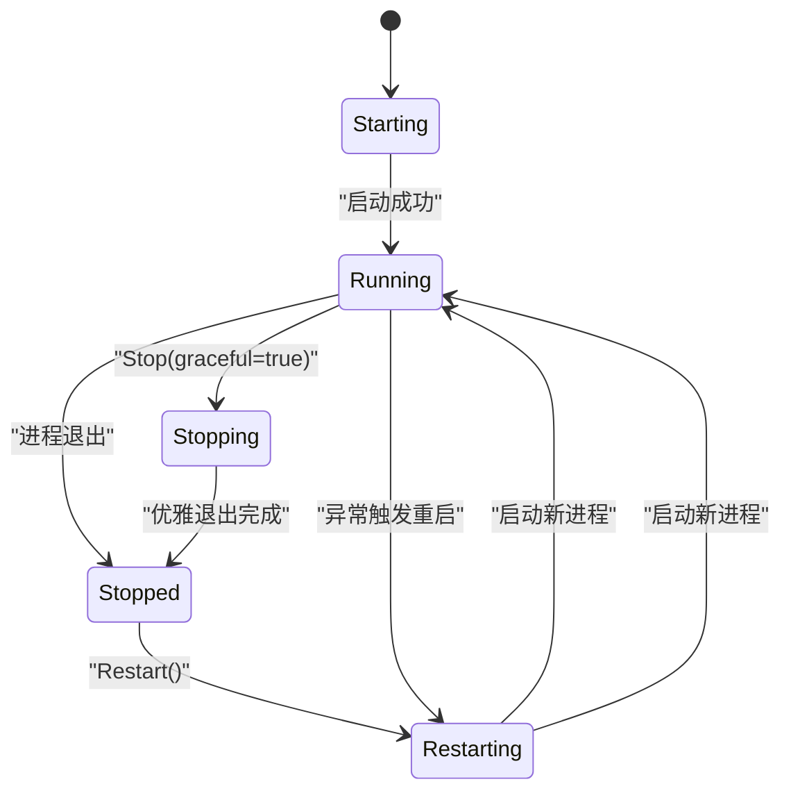
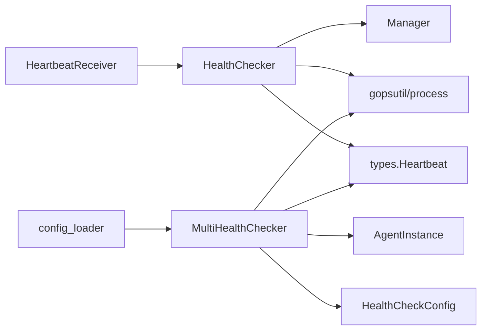

# 健康检查

<cite>
**本文引用的文件**
- [health.go](file://daemon/internal/agent/health.go)
- [multi_health_checker.go](file://daemon/internal/agent/multi_health_checker.go)
- [heartbeat.go](file://daemon/internal/agent/heartbeat.go)
- [instance.go](file://daemon/internal/agent/instance.go)
- [manager.go](file://daemon/internal/agent/manager.go)
- [config.go](file://daemon/internal/config/config.go)
- [types.go](file://daemon/pkg/types/types.go)
- [config_loader.go](file://daemon/internal/agent/config_loader.go)
- [multi_health_checker_test.go](file://daemon/internal/agent/multi_health_checker_test.go)
</cite>

## 目录
1. [简介](#简介)
2. [项目结构](#项目结构)
3. [核心组件](#核心组件)
4. [架构总览](#架构总览)
5. [详细组件分析](#详细组件分析)
6. [依赖关系分析](#依赖关系分析)
7. [性能考量](#性能考量)
8. [故障排查指南](#故障排查指南)
9. [结论](#结论)

## 简介
本文件聚焦Daemon的Agent健康检查机制，系统化阐述HealthChecker结构体如何综合“进程状态”“心跳超时”“资源占用（CPU、内存）”三维度判定Agent健康状态；详解checkHealth决策流程、checkLoop定时循环与重启策略；以及当资源恢复或连续运行超过5分钟时重置重启计数的机制。同时给出健康检查状态机与checkLoop时序图，帮助读者快速理解整体工作流。

## 项目结构
围绕健康检查的关键模块与文件如下：
- 健康检查器与心跳接收
  - HealthChecker：单Agent健康检查器
  - HeartbeatReceiver：Unix Socket心跳接收器
- 多Agent健康检查器
  - MultiHealthChecker：多Agent健康检查器，按Agent维度维护状态与阈值
- Agent实例与进程管理
  - AgentInstance：单Agent进程生命周期管理
  - Manager：单Agent进程管理器（旧版）
- 配置与类型
  - HealthCheckConfig：健康检查配置（间隔、心跳超时、CPU阈值、内存阈值、阈值持续时间）
  - HealthStatus：健康状态枚举
- 配置加载与测试
  - config_loader.go：从全局配置构建多Agent健康检查配置
  - multi_health_checker_test.go：多Agent健康检查器行为测试

图表来源
- [health.go](file://daemon/internal/agent/health.go#L1-L197)
- [multi_health_checker.go](file://daemon/internal/agent/multi_health_checker.go#L1-L280)
- [heartbeat.go](file://daemon/internal/agent/heartbeat.go#L1-L122)
- [instance.go](file://daemon/internal/agent/instance.go#L1-L333)
- [manager.go](file://daemon/internal/agent/manager.go#L1-L234)
- [config.go](file://daemon/internal/config/config.go#L60-L67)
- [types.go](file://daemon/pkg/types/types.go#L82-L111)

章节来源
- [health.go](file://daemon/internal/agent/health.go#L1-L197)
- [multi_health_checker.go](file://daemon/internal/agent/multi_health_checker.go#L1-L280)
- [heartbeat.go](file://daemon/internal/agent/heartbeat.go#L1-L122)
- [instance.go](file://daemon/internal/agent/instance.go#L1-L333)
- [manager.go](file://daemon/internal/agent/manager.go#L1-L234)
- [config.go](file://daemon/internal/config/config.go#L60-L67)
- [types.go](file://daemon/pkg/types/types.go#L82-L111)

## 核心组件
- HealthChecker（单Agent健康检查器）
  - 负责周期性检查进程存活、心跳超时、CPU/内存阈值，并在异常时触发Manager重启
  - 维护lastHeartbeat、heartbeatCh、配置、上下文与等待组
- HeartbeatReceiver（心跳接收器）
  - 通过Unix Socket接收Agent上报的心跳，解码后转发给HealthChecker
- MultiHealthChecker（多Agent健康检查器）
  - 为每个Agent独立启动goroutine，维护各自健康状态、心跳时间、阈值与资源信息
  - 支持按Agent类型差异化检查策略（如Node Exporter走HTTP端点，其他类型走进程+资源检查）
- AgentInstance（Agent实例管理器）
  - 管理Agent进程生命周期（启动、停止、重启、优雅退出、日志轮转）
  - 提供IsRunning、GetPID、Restart等能力
- Manager（单Agent进程管理器）
  - 旧版单Agent管理器，提供Start/Stop/Restart/IsRunning等能力（与AgentInstance并存）
- HealthCheckConfig（健康检查配置）
  - 包含检查间隔、心跳超时、CPU阈值、内存阈值、阈值持续时间
- HealthStatus（健康状态枚举）
  - healthy、dead、no_heartbeat、over_threshold

章节来源
- [health.go](file://daemon/internal/agent/health.go#L1-L197)
- [heartbeat.go](file://daemon/internal/agent/heartbeat.go#L1-L122)
- [multi_health_checker.go](file://daemon/internal/agent/multi_health_checker.go#L1-L280)
- [instance.go](file://daemon/internal/agent/instance.go#L1-L333)
- [manager.go](file://daemon/internal/agent/manager.go#L1-L234)
- [config.go](file://daemon/internal/config/config.go#L60-L67)
- [types.go](file://daemon/pkg/types/types.go#L82-L111)

## 架构总览
健康检查的整体交互链路如下：
- Agent周期性上报心跳（Unix Socket）
- HealthChecker接收心跳并更新lastHeartbeat
- checkLoop按配置周期执行checkHealth
- checkHealth综合进程存活、心跳超时、CPU/内存阈值判定状态
- 根据状态触发Manager重启或重置阈值计时/重启计数

图表来源
- [heartbeat.go](file://daemon/internal/agent/heartbeat.go#L1-L122)
- [health.go](file://daemon/internal/agent/health.go#L67-L197)
- [manager.go](file://daemon/internal/agent/manager.go#L139-L234)

## 详细组件分析

### HealthChecker（单Agent健康检查器）
- 关键职责
  - 启动/停止checkLoop
  - 接收心跳并更新lastHeartbeat
  - 周期性执行checkHealth并根据状态触发重启或重置计数
- checkHealth决策逻辑
  1) 进程存活：若Manager.IsRunning()为false，返回dead
  2) 心跳超时：若lastHeartbeat非零且距当前时间超过HeartbeatTimeout，返回no_heartbeat
  3) 资源超阈：获取PID并使用gopsutil获取CPU与内存，若CPU>阈值或RSS>阈值，返回over_threshold；否则healthy
- checkLoop执行策略
  - 使用ticker按配置Interval触发
  - 若收到心跳事件，先更新lastHeartbeat
  - 判断状态并执行对应动作：
    - dead/no_heartbeat：立即尝试重启
    - over_threshold：记录首次超阈起始时间，若持续时间>ThresholdDuration则重启
    - healthy：重置超阈计时；若自上次重启以来运行>5分钟且重启计数>0，则重置重启计数
- 重启退避与计数
  - 通过Manager.Restart触发重启，Manager内部根据重启次数计算退避时间
  - 5分钟内重启计数不清零，超时后重置

图表来源
- [health.go](file://daemon/internal/agent/health.go#L146-L197)

章节来源
- [health.go](file://daemon/internal/agent/health.go#L1-L197)
- [manager.go](file://daemon/internal/agent/manager.go#L139-L234)

### HeartbeatReceiver（心跳接收器）
- 通过Unix Socket监听Agent心跳
- 解码JSON心跳包并调用HealthChecker.ReceiveHeartbeat
- 生命周期：Start创建监听、Stop关闭并清理socket文件

图表来源
- [heartbeat.go](file://daemon/internal/agent/heartbeat.go#L1-L122)
- [health.go](file://daemon/internal/agent/health.go#L58-L86)

章节来源
- [heartbeat.go](file://daemon/internal/agent/heartbeat.go#L1-L122)
- [health.go](file://daemon/internal/agent/health.go#L58-L86)

### MultiHealthChecker（多Agent健康检查器）
- 为每个Agent独立启动goroutine，维护：
  - agentConfigs：Agent级健康检查配置
  - healthStatuses：Agent健康状态（含LastCheck、LastHeartbeat、OverThresholdSince、CPUPercent、MemoryRSS）
  - heartbeats：Agent最后心跳时间
- checkAgentHealth流程
  - ticker按Agent配置的Interval触发
  - checkHealth按Agent类型差异化：
    - Node Exporter：使用HTTP端点检查
    - 其他类型：使用进程+资源检查
  - 更新健康状态与资源信息
  - 根据状态执行重启或重置计数
- 配置合并
  - 从全局AgentDefaults与AgentItemConfig合并得到每个Agent的最终健康检查配置

图表来源
- [multi_health_checker.go](file://daemon/internal/agent/multi_health_checker.go#L1-L280)
- [instance.go](file://daemon/internal/agent/instance.go#L1-L333)

章节来源
- [multi_health_checker.go](file://daemon/internal/agent/multi_health_checker.go#L1-L280)
- [config_loader.go](file://daemon/internal/agent/config_loader.go#L103-L128)
- [multi_health_checker_test.go](file://daemon/internal/agent/multi_health_checker_test.go#L1-L200)

### AgentInstance（Agent实例管理器）
- 生命周期管理：Start/Stop/Restart/IsRunning/GetPID/ResetRestartCount
- 优雅退出：发送SIGTERM等待，超时后强制KILL
- 退避策略：根据重启次数计算等待时间，超过5分钟重置计数

图表来源
- [instance.go](file://daemon/internal/agent/instance.go#L1-L333)

章节来源
- [instance.go](file://daemon/internal/agent/instance.go#L1-L333)

### 配置与类型
- HealthCheckConfig
  - interval：检查周期
  - heartbeat_timeout：心跳超时阈值
  - cpu_threshold：CPU使用率阈值
  - memory_threshold：内存RSS阈值
  - threshold_duration：超阈值持续时间
- HealthStatus
  - healthy、dead、no_heartbeat、over_threshold

章节来源
- [config.go](file://daemon/internal/config/config.go#L60-L67)
- [types.go](file://daemon/pkg/types/types.go#L82-L111)

## 依赖关系分析
- HealthChecker依赖
  - Manager：用于IsRunning、GetPID、Restart
  - types.Heartbeat：心跳数据结构
  - gopsutil/process：获取CPU与内存
- HeartbeatReceiver依赖
  - types.Heartbeat：心跳数据结构
  - HealthChecker：接收心跳
- MultiHealthChecker依赖
  - MultiAgentManager：获取Agent实例
  - AgentInfo/AgentInstance：进程状态与资源信息
  - gopsutil/process：CPU/内存采集
- 配置来源
  - config_loader：从全局配置合并Agent级健康检查配置

图表来源
- [heartbeat.go](file://daemon/internal/agent/heartbeat.go#L1-L122)
- [health.go](file://daemon/internal/agent/health.go#L1-L197)
- [multi_health_checker.go](file://daemon/internal/agent/multi_health_checker.go#L1-L280)
- [config_loader.go](file://daemon/internal/agent/config_loader.go#L103-L128)

章节来源
- [heartbeat.go](file://daemon/internal/agent/heartbeat.go#L1-L122)
- [health.go](file://daemon/internal/agent/health.go#L1-L197)
- [multi_health_checker.go](file://daemon/internal/agent/multi_health_checker.go#L1-L280)
- [config_loader.go](file://daemon/internal/agent/config_loader.go#L103-L128)

## 性能考量
- 检查频率与资源开销
  - interval越短，CPU/内存采样越频繁，对gopsutil调用次数增加；建议结合业务负载合理设置
- 心跳通道容量
  - HealthChecker的heartbeatCh容量为10，若心跳过于密集可能导致丢弃；可根据Agent上报频率调整
- 资源采集粒度
  - gopsutil调用涉及系统调用，建议避免在高并发场景下过度缩短interval
- 重启退避
  - Manager内部根据重启次数递增退避时间，降低频繁重启带来的抖动

[本节为通用指导，无需列出具体文件来源]

## 故障排查指南
- 进程无法被识别
  - 现象：checkHealth返回dead
  - 排查：确认Manager.IsRunning与AgentInstance.IsRunning一致；检查PID是否有效
- 心跳长时间未到达
  - 现象：checkHealth返回no_heartbeat
  - 排查：确认HeartbeatReceiver监听正常、Unix Socket路径正确、Agent端心跳发送逻辑
- 资源超阈反复重启
  - 现象：over_threshold持续时间超过阈值持续时间后重启
  - 排查：适当提高阈值或优化Agent程序；观察阈值持续时间配置
- 重启计数未清零
  - 现象：连续运行超过5分钟仍保留重启计数
  - 排查：确认HealthChecker在healthy状态下执行重置逻辑；检查lastRestart时间是否正确

章节来源
- [health.go](file://daemon/internal/agent/health.go#L67-L197)
- [heartbeat.go](file://daemon/internal/agent/heartbeat.go#L1-L122)
- [instance.go](file://daemon/internal/agent/instance.go#L1-L333)

## 结论
HealthChecker与MultiHealthChecker通过“进程存活、心跳超时、资源超阈”三维度综合评估Agent健康状况，并以阈值持续时间与5分钟冷却期避免误判与频繁重启。HeartbeatReceiver负责可靠地接收心跳，Manager/AgentInstance提供进程生命周期与重启能力。通过合理的配置与监控，可在保证稳定性的同时提升系统的自愈能力。