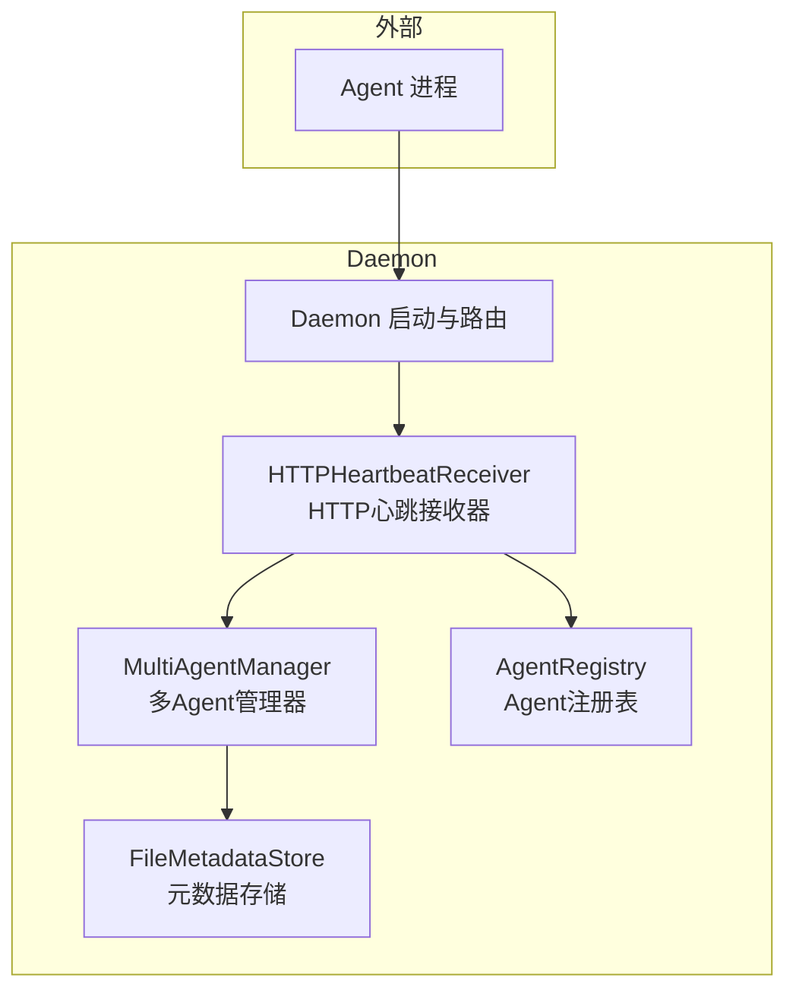
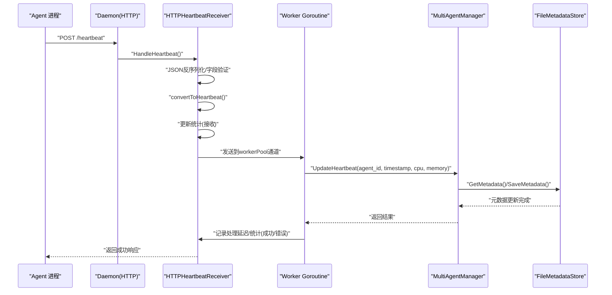
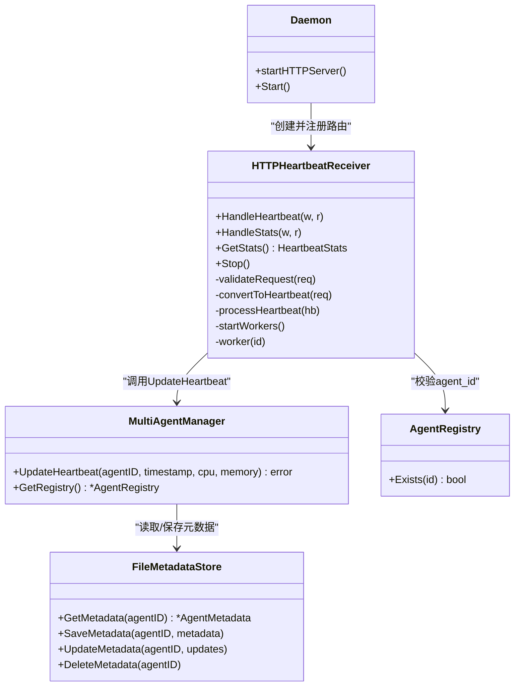

# 心跳接收

<cite>
**本文引用的文件**
- [daemon.go](file://daemon/internal/daemon/daemon.go)
- [heartbeat_receiver.go](file://daemon/internal/agent/heartbeat_receiver.go)
- [multi_manager.go](file://daemon/internal/agent/multi_manager.go)
- [metadata_store.go](file://daemon/internal/agent/metadata_store.go)
- [registry.go](file://daemon/internal/agent/registry.go)
- [config.go](file://daemon/internal/config/config.go)
- [main.go](file://daemon/cmd/daemon/main.go)
</cite>

## 目录
1. [简介](#简介)
2. [项目结构](#项目结构)
3. [核心组件](#核心组件)
4. [架构总览](#架构总览)
5. [详细组件分析](#详细组件分析)
6. [依赖关系分析](#依赖关系分析)
7. [性能考量](#性能考量)
8. [故障排查指南](#故障排查指南)
9. [结论](#结论)

## 简介
本文件聚焦Daemon的Agent心跳接收功能，围绕HTTPHeartbeatReceiver展开，解释其通过HTTP POST端点接收Agent上报的心跳数据，包括HeartbeatRequest结构体的JSON反序列化与字段验证（agent_id、PID、CPU范围等），Worker Pool模式的并发处理流程，processHeartbeat如何调用multiManager.UpdateHeartbeat更新元数据存储并记录处理延迟，以及统计信息与优雅停止机制，同时说明如何通过HTTP GET /stats端点暴露监控指标。

## 项目结构
Daemon模块负责多Agent生命周期与状态管理，其中心跳接收作为关键入口，通过HTTP端点接收Agent上报的心跳，随后进入Worker Pool并发处理，最终更新元数据存储并记录统计信息。配置层决定HTTP端口是否启用及默认端口，启动流程中按配置创建HTTP服务器并注册路由。

图表来源
- [daemon.go](file://daemon/internal/daemon/daemon.go#L630-L666)
- [heartbeat_receiver.go](file://daemon/internal/agent/heartbeat_receiver.go#L49-L114)
- [multi_manager.go](file://daemon/internal/agent/multi_manager.go#L486-L523)
- [metadata_store.go](file://daemon/internal/agent/metadata_store.go#L133-L149)
- [registry.go](file://daemon/internal/agent/registry.go#L280-L314)

章节来源
- [daemon.go](file://daemon/internal/daemon/daemon.go#L630-L666)
- [config.go](file://daemon/internal/config/config.go#L23-L32)

## 核心组件
- HTTPHeartbeatReceiver：提供HTTP端点接收Agent心跳，采用Worker Pool并发处理，负责JSON反序列化、字段验证、统计更新、延迟计算与优雅停止。
- MultiAgentManager：多Agent管理器，负责根据agent_id定位Agent实例并调用UpdateHeartbeat更新元数据。
- FileMetadataStore：基于文件的元数据存储，负责Agent元数据的读取、保存、更新与历史资源使用记录。
- AgentRegistry：Agent注册表，提供agent_id存在性校验，保障心跳上报的合法性。
- Daemon：启动流程中创建HTTP服务器并注册/heartbeat与/heartbeat/stats路由。

章节来源
- [heartbeat_receiver.go](file://daemon/internal/agent/heartbeat_receiver.go#L49-L114)
- [multi_manager.go](file://daemon/internal/agent/multi_manager.go#L486-L523)
- [metadata_store.go](file://daemon/internal/agent/metadata_store.go#L133-L149)
- [registry.go](file://daemon/internal/agent/registry.go#L280-L314)
- [daemon.go](file://daemon/internal/daemon/daemon.go#L630-L666)

## 架构总览
HTTPHeartbeatReceiver在Daemon启动时被创建并注册到HTTP路由，Agent通过POST /heartbeat上报心跳；接收器解析JSON、校验字段、将心跳放入有缓冲的workerPool通道；一组后台goroutine（worker）从通道取出心跳并调用multiManager.UpdateHeartbeat更新元数据，期间记录处理延迟与统计信息；可通过GET /heartbeat/stats获取统计信息；Stop方法优雅关闭，等待正在处理的心跳完成。

图表来源
- [daemon.go](file://daemon/internal/daemon/daemon.go#L630-L666)
- [heartbeat_receiver.go](file://daemon/internal/agent/heartbeat_receiver.go#L116-L174)
- [heartbeat_receiver.go](file://daemon/internal/agent/heartbeat_receiver.go#L236-L271)
- [multi_manager.go](file://daemon/internal/agent/multi_manager.go#L486-L523)
- [metadata_store.go](file://daemon/internal/agent/metadata_store.go#L181-L224)

## 详细组件分析

### HTTPHeartbeatReceiver：HTTP心跳接收器
- 结构体与职责
  - 持有multiManager、registry、logger、workerPool、workerCount、统计信息、总延迟、WaitGroup、stopCh、stopped等字段。
  - 通过NewHTTPHeartbeatReceiver创建，内部启动固定数量的worker goroutine。
- HTTP端点
  - POST /heartbeat：解析JSON、校验、转换为Heartbeat、更新统计、非阻塞发送到workerPool；若workerPool满则返回503。
  - GET /heartbeat/stats：返回统计信息副本。
- 字段验证
  - agent_id非空且存在于注册表。
  - PID > 0。
  - CPU范围[0,100]。
  - Memory >= 0。
- Worker Pool模式
  - 有缓冲通道workerPool容量为workerCount×10；worker从通道读取心跳并调用processHeartbeat。
  - Stop时关闭stopCh通知worker退出，等待wg（所有worker goroutine）退出，优雅关闭。
- 统计与延迟
  - 接收时更新TotalReceived与LastReceivedTime。
  - 成功处理后更新TotalProcessed与AverageLatency（基于totalLatency原子累加与计数）。
  - 出错时更新TotalErrors。
- 错误处理
  - JSON解析失败返回400。
  - 非POST方法返回405。
  - 停止状态下返回503。
  - workerPool满返回503并记录WARNING。

章节来源
- [heartbeat_receiver.go](file://daemon/internal/agent/heartbeat_receiver.go#L49-L114)
- [heartbeat_receiver.go](file://daemon/internal/agent/heartbeat_receiver.go#L116-L174)
- [heartbeat_receiver.go](file://daemon/internal/agent/heartbeat_receiver.go#L176-L204)
- [heartbeat_receiver.go](file://daemon/internal/agent/heartbeat_receiver.go#L206-L235)
- [heartbeat_receiver.go](file://daemon/internal/agent/heartbeat_receiver.go#L236-L271)
- [heartbeat_receiver.go](file://daemon/internal/agent/heartbeat_receiver.go#L272-L310)
- [heartbeat_receiver.go](file://daemon/internal/agent/heartbeat_receiver.go#L311-L331)
- [heartbeat_receiver.go](file://daemon/internal/agent/heartbeat_receiver.go#L333-L346)
- [heartbeat_receiver.go](file://daemon/internal/agent/heartbeat_receiver.go#L348-L361)
- [heartbeat_receiver.go](file://daemon/internal/agent/heartbeat_receiver.go#L362-L386)
- [heartbeat_receiver.go](file://daemon/internal/agent/heartbeat_receiver.go#L388-L397)

### MultiAgentManager：多Agent管理器
- UpdateHeartbeat
  - 从FileMetadataStore获取或创建Agent元数据，更新LastHeartbeat与资源使用历史（CPU/Memory），保存元数据。
  - 若元数据不存在且Agent实例不存在，返回“Agent不存在”错误。
- 其他能力
  - 提供注册表registry引用，用于HTTPHeartbeatReceiver的agent_id校验。
  - 提供状态变化回调，便于上层联动。

章节来源
- [multi_manager.go](file://daemon/internal/agent/multi_manager.go#L486-L523)
- [multi_manager.go](file://daemon/internal/agent/multi_manager.go#L13-L38)

### FileMetadataStore：元数据存储
- GetMetadata/SaveMetadata/UpdateMetadata/DeleteMetadata
  - 基于文件的原子写入（临时文件+rename），保证一致性。
  - ResourceUsageHistory维护CPU/Memory历史与时间戳，支持限制最大历史长度。
- 与MultiAgentManager协作
  - MultiAgentManager在UpdateHeartbeat中调用GetMetadata/SaveMetadata，实现心跳与资源历史的持久化。

章节来源
- [metadata_store.go](file://daemon/internal/agent/metadata_store.go#L133-L149)
- [metadata_store.go](file://daemon/internal/agent/metadata_store.go#L181-L224)
- [metadata_store.go](file://daemon/internal/agent/metadata_store.go#L226-L265)
- [metadata_store.go](file://daemon/internal/agent/metadata_store.go#L315-L361)
- [metadata_store.go](file://daemon/internal/agent/metadata_store.go#L362-L384)

### AgentRegistry：Agent注册表
- Exists
  - 用于HTTPHeartbeatReceiver对agent_id进行存在性校验，防止非法上报。
- 其他能力
  - Register/Unregister/List/Count等，支撑多Agent管理。

章节来源
- [registry.go](file://daemon/internal/agent/registry.go#L280-L314)

### Daemon：启动与路由
- startHTTPServer
  - 当配置http_port>0时创建HTTP服务器，注册/heartbeat与/heartbeat/stats路由。
- Start
  - 在多Agent模式下创建HTTPHeartbeatReceiver并按需启动HTTP服务器。

章节来源
- [daemon.go](file://daemon/internal/daemon/daemon.go#L630-L666)
- [daemon.go](file://daemon/internal/daemon/daemon.go#L289-L309)

### 配置与默认值
- DaemonConfig.http_port默认为0（不启动HTTP服务器），若要启用HTTP心跳接收，需在配置中显式设置http_port。
- DaemonConfig.grpc_port默认9091，避免与Manager的9090冲突。

章节来源
- [config.go](file://daemon/internal/config/config.go#L23-L32)
- [config.go](file://daemon/internal/config/config.go#L190-L210)

## 依赖关系分析
- HTTPHeartbeatReceiver依赖：
  - MultiAgentManager：调用UpdateHeartbeat更新元数据。
  - AgentRegistry：校验agent_id存在性。
  - FileMetadataStore：读取/保存元数据。
- Daemon依赖：
  - 在启动时创建HTTP服务器并注册路由，按配置决定是否启用HTTP心跳接收。

图表来源
- [heartbeat_receiver.go](file://daemon/internal/agent/heartbeat_receiver.go#L49-L114)
- [heartbeat_receiver.go](file://daemon/internal/agent/heartbeat_receiver.go#L236-L271)
- [multi_manager.go](file://daemon/internal/agent/multi_manager.go#L486-L523)
- [metadata_store.go](file://daemon/internal/agent/metadata_store.go#L133-L149)
- [registry.go](file://daemon/internal/agent/registry.go#L280-L314)
- [daemon.go](file://daemon/internal/daemon/daemon.go#L630-L666)

## 性能考量
- Worker Pool容量
  - workerPool容量为workerCount×10，当瞬时流量超过处理能力时，会触发503并丢弃心跳，建议通过增大workerCount或提升处理能力缓解。
- 并发与锁
  - 统计信息使用RWMutex保护，原子变量totalLatency用于低开销延迟累加，避免频繁加锁。
- I/O与持久化
  - FileMetadataStore采用临时文件+rename的原子写入，减少竞态风险；资源历史记录限制最大长度，避免无限增长。
- 延迟测量
  - processHeartbeat内记录单条心跳处理耗时，周期性更新AverageLatency，便于观测处理链路性能。

章节来源
- [heartbeat_receiver.go](file://daemon/internal/agent/heartbeat_receiver.go#L88-L114)
- [heartbeat_receiver.go](file://daemon/internal/agent/heartbeat_receiver.go#L151-L174)
- [heartbeat_receiver.go](file://daemon/internal/agent/heartbeat_receiver.go#L236-L271)
- [metadata_store.go](file://daemon/internal/agent/metadata_store.go#L181-L224)

## 故障排查指南
- 常见错误与表现
  - 400：JSON格式无效或字段校验失败（agent_id为空、不在注册表、PID<=0、CPU越界、Memory<0）。
  - 405：非POST方法访问/heartbeat。
  - 503：workerPool满导致拒绝，建议降低上报频率或扩容worker。
  - 503：停止状态下拒绝请求。
- 排查步骤
  - 检查配置http_port是否大于0，确认HTTP服务器已启动并注册路由。
  - 使用GET /heartbeat/stats观察TotalReceived、TotalProcessed、TotalErrors与AverageLatency，判断处理压力与错误比例。
  - 确认agent_id已在注册表中，否则校验会失败。
  - 观察日志中关于“failed to decode heartbeat request”、“failed to parse timestamp”等提示，定位Agent上报数据问题。
- 优雅停止
  - 调用Stop后，停止接收新请求，等待所有worker处理完当前队列中的心跳，再退出；期间不会关闭workerPool，确保处理完整性。

章节来源
- [heartbeat_receiver.go](file://daemon/internal/agent/heartbeat_receiver.go#L116-L174)
- [heartbeat_receiver.go](file://daemon/internal/agent/heartbeat_receiver.go#L176-L204)
- [heartbeat_receiver.go](file://daemon/internal/agent/heartbeat_receiver.go#L311-L331)
- [daemon.go](file://daemon/internal/daemon/daemon.go#L630-L666)

## 结论
HTTPHeartbeatReceiver通过HTTP端点与Worker Pool模式实现了高吞吐、低延迟的心跳接收与处理，结合MultiAgentManager与FileMetadataStore完成元数据持久化与资源历史记录，配合AgentRegistry确保上报合法性。通过/heartbeat与/heartbeat/stats端点，既满足Agent上报需求，又提供可观测性与运维支持。在生产环境中，建议根据流量规模调整workerPool容量与worker数量，并持续监控统计指标以优化性能。