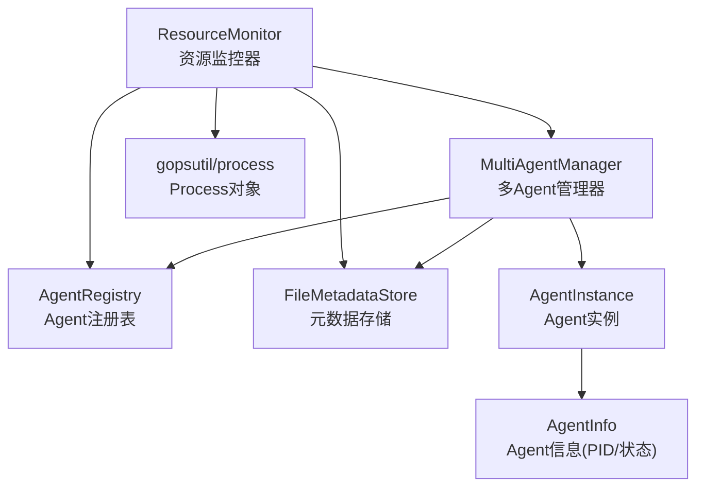
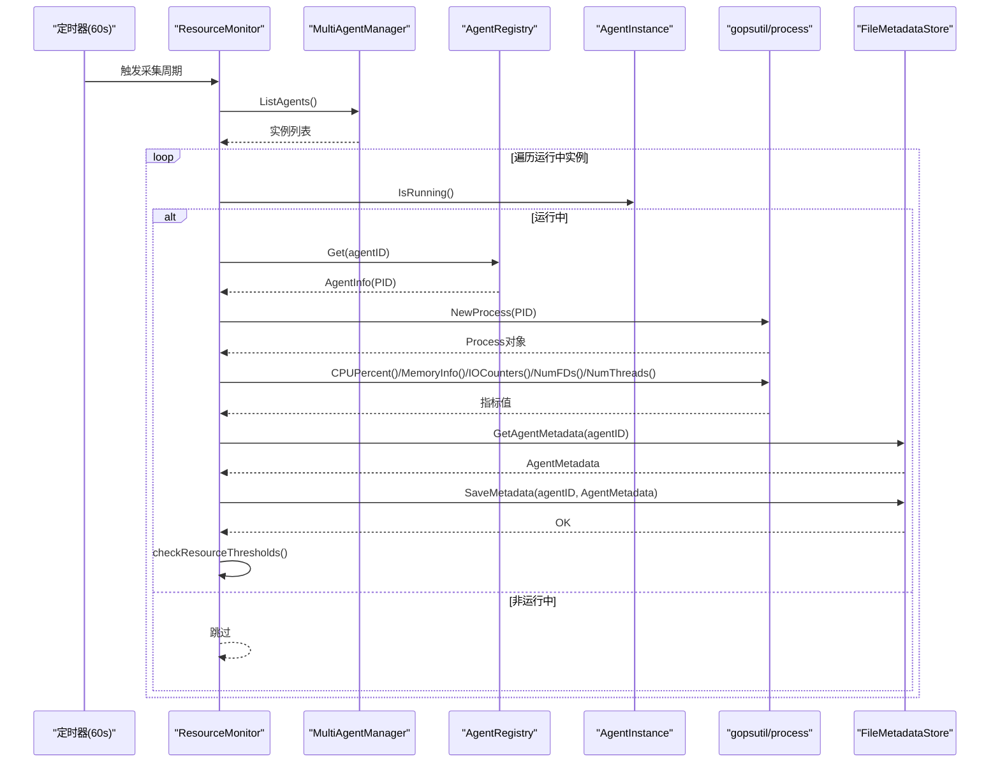
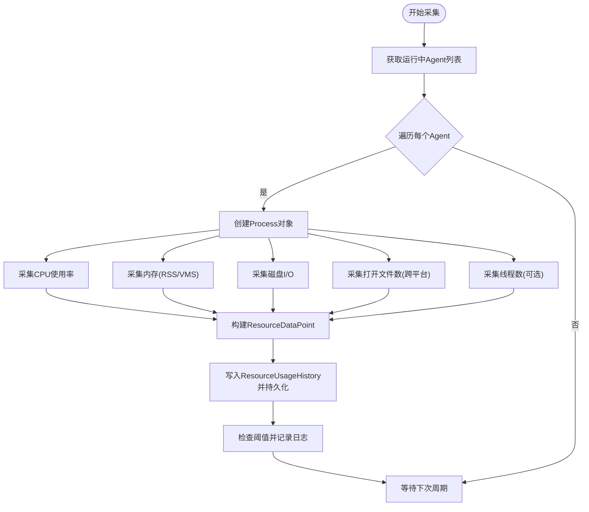
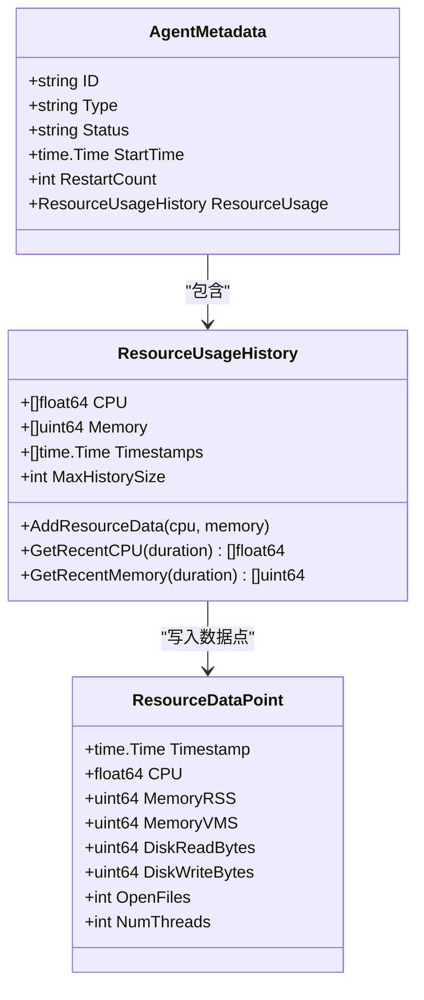
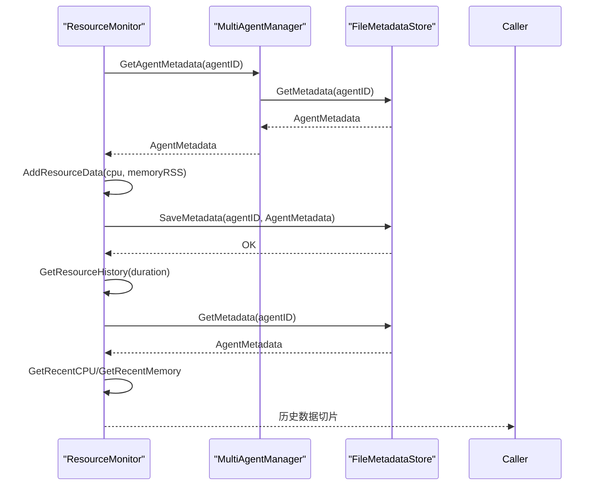
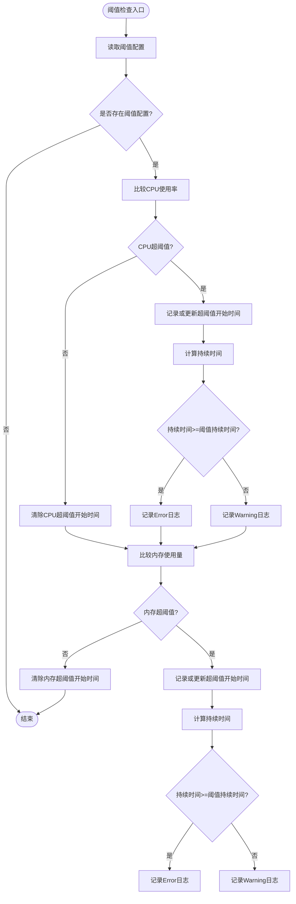
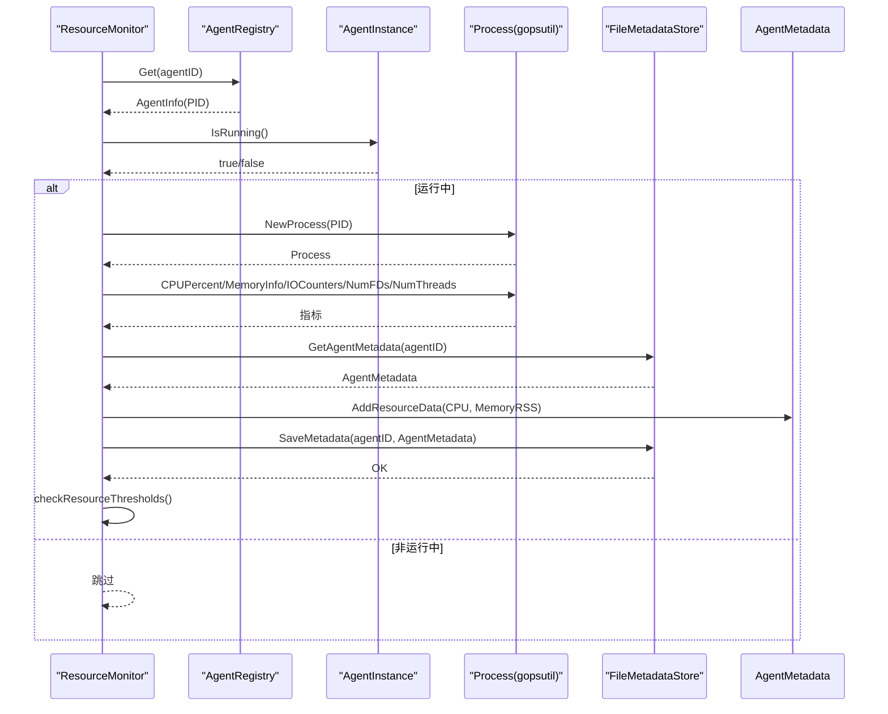
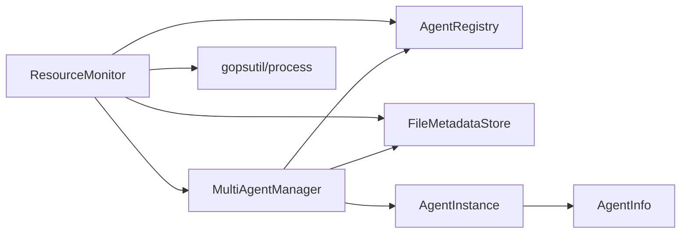

# 资源监控

<cite>
**本文引用的文件**
- [resource_monitor.go](file://daemon/internal/agent/resource_monitor.go)
- [metadata_store.go](file://daemon/internal/agent/metadata_store.go)
- [multi_manager.go](file://daemon/internal/agent/multi_manager.go)
- [registry.go](file://daemon/internal/agent/registry.go)
- [instance.go](file://daemon/internal/agent/instance.go)
- [resource_monitor_test.go](file://daemon/internal/agent/resource_monitor_test.go)
</cite>

## 目录
1. [简介](#简介)
2. [项目结构](#项目结构)
3. [核心组件](#核心组件)
4. [架构总览](#架构总览)
5. [详细组件分析](#详细组件分析)
6. [依赖关系分析](#依赖关系分析)
7. [性能考量](#性能考量)
8. [故障排查指南](#故障排查指南)
9. [结论](#结论)

## 简介
本文件聚焦Daemon模块的Agent资源监控能力，围绕ResourceMonitor如何周期性采集运行中Agent的CPU、内存（RSS/VMS）、磁盘I/O、打开文件数和线程数等指标，如何通过gopsutil/process库的Process对象进行采集并处理跨平台差异，如何将采集到的数据点持久化到Agent元数据（AgentMetadata）中并支持历史查询，以及如何基于阈值触发告警（日志级别Warning/Error）以辅助健康检查与决策。

## 项目结构
与资源监控直接相关的核心文件位于daemon/internal/agent目录：
- resource_monitor.go：资源监控器实现，包含采集、阈值检查、历史查询与聚合
- metadata_store.go：元数据结构与持久化（文件存储）
- multi_manager.go：多Agent管理器，提供元数据读写、实例管理
- registry.go：Agent注册表，提供Agent信息查询
- instance.go：Agent实例管理，提供运行状态判断与PID获取
- resource_monitor_test.go：资源监控器的单元测试，覆盖采集、阈值、历史查询等场景

图表来源
- [resource_monitor.go](file://daemon/internal/agent/resource_monitor.go#L1-L120)
- [metadata_store.go](file://daemon/internal/agent/metadata_store.go#L1-L120)
- [multi_manager.go](file://daemon/internal/agent/multi_manager.go#L1-L120)
- [registry.go](file://daemon/internal/agent/registry.go#L1-L120)
- [instance.go](file://daemon/internal/agent/instance.go#L1-L120)

章节来源
- [resource_monitor.go](file://daemon/internal/agent/resource_monitor.go#L1-L120)
- [metadata_store.go](file://daemon/internal/agent/metadata_store.go#L1-L120)
- [multi_manager.go](file://daemon/internal/agent/multi_manager.go#L1-L120)
- [registry.go](file://daemon/internal/agent/registry.go#L1-L120)
- [instance.go](file://daemon/internal/agent/instance.go#L1-L120)

## 核心组件
- ResourceMonitor：负责定时采集、阈值检查、历史数据聚合与查询
- ResourceDataPoint：单次采集的数据点，包含时间戳、CPU、内存（RSS/VMS）、磁盘读写字节数、打开文件数、线程数
- ResourceThreshold：资源阈值配置，包含CPU阈值、内存阈值与持续时间阈值
- ResourceUsageHistory：资源历史记录，维护CPU、内存与时间戳数组，并限制最大长度
- FileMetadataStore：基于文件的元数据持久化，提供原子写入与并发安全
- MultiAgentManager：提供元数据读取/保存、实例列表、注册表访问
- AgentRegistry/AgentInfo：提供Agent信息查询与PID/状态
- AgentInstance：提供运行状态判断与PID获取

章节来源
- [resource_monitor.go](file://daemon/internal/agent/resource_monitor.go#L14-L120)
- [metadata_store.go](file://daemon/internal/agent/metadata_store.go#L14-L120)
- [multi_manager.go](file://daemon/internal/agent/multi_manager.go#L1-L120)
- [registry.go](file://daemon/internal/agent/registry.go#L40-L120)
- [instance.go](file://daemon/internal/agent/instance.go#L1-L120)

## 架构总览
ResourceMonitor通过以下流程实现资源监控：
- 定时器（默认60秒）驱动采集循环
- 从MultiAgentManager获取所有Agent实例，过滤运行中的Agent
- 对每个Agent创建gopsutil/process的Process对象，采集CPU、内存、磁盘I/O、打开文件数、线程数
- 将数据点写入Agent元数据的ResourceUsageHistory，并持久化到文件
- 检查阈值：若CPU或内存持续超过阈值，记录Warning或Error日志
- 提供历史查询与聚合接口，支持按时间段与聚合间隔返回数据

图表来源
- [resource_monitor.go](file://daemon/internal/agent/resource_monitor.go#L237-L441)
- [multi_manager.go](file://daemon/internal/agent/multi_manager.go#L117-L128)
- [registry.go](file://daemon/internal/agent/registry.go#L173-L200)
- [instance.go](file://daemon/internal/agent/instance.go#L302-L318)
- [metadata_store.go](file://daemon/internal/agent/metadata_store.go#L181-L224)

## 详细组件分析

### ResourceMonitor：采集、阈值与历史
- 采集周期与并发：默认60秒；对运行中Agent并发采集，避免阻塞
- 采集指标：
  - CPU使用率：通过Process.CPUPercent()
  - 内存：MemoryInfo返回RSS/VMS
  - 磁盘I/O：IOCounters返回ReadBytes/WriteBytes
  - 打开文件数：NumFDs；Windows平台不可用时记录调试日志并保持默认值
  - 线程数：NumThreads（可选）
- 数据持久化：将CPU/RSS写入ResourceUsageHistory，随后SaveMetadata持久化
- 阈值检查：记录每个Agent每种资源的超阈值开始时间，持续时间达到阈值Duration时记录Error，否则Warning
- 历史查询：GetResourceHistory按时间窗口返回CPU与内存序列；GetResourceHistoryAggregated按聚合间隔计算均值

图表来源
- [resource_monitor.go](file://daemon/internal/agent/resource_monitor.go#L147-L312)
- [resource_monitor.go](file://daemon/internal/agent/resource_monitor.go#L314-L404)
- [resource_monitor.go](file://daemon/internal/agent/resource_monitor.go#L443-L561)

章节来源
- [resource_monitor.go](file://daemon/internal/agent/resource_monitor.go#L147-L312)
- [resource_monitor.go](file://daemon/internal/agent/resource_monitor.go#L314-L404)
- [resource_monitor.go](file://daemon/internal/agent/resource_monitor.go#L443-L561)

### ResourceDataPoint与ResourceUsageHistory
- ResourceDataPoint：包含时间戳、CPU、MemoryRSS、MemoryVMS、磁盘读写字节数、打开文件数、线程数
- ResourceUsageHistory：维护CPU、Memory、Timestamps三数组，限制最大长度，默认1440（保留24小时，每分钟一个点），提供AddResourceData、GetRecentCPU、GetRecentMemory

图表来源
- [resource_monitor.go](file://daemon/internal/agent/resource_monitor.go#L14-L40)
- [metadata_store.go](file://daemon/internal/agent/metadata_store.go#L42-L131)
- [metadata_store.go](file://daemon/internal/agent/metadata_store.go#L14-L41)

章节来源
- [resource_monitor.go](file://daemon/internal/agent/resource_monitor.go#L14-L40)
- [metadata_store.go](file://daemon/internal/agent/metadata_store.go#L42-L131)
- [metadata_store.go](file://daemon/internal/agent/metadata_store.go#L14-L41)

### 跨平台兼容性：Windows的NumFDs
- 在Windows平台，NumFDs可能不可用，ResourceMonitor在采集打开文件数时捕获错误并在非Windows平台记录警告，Windows平台仅记录调试日志，OpenFiles保持默认值（0）。
- 其他指标（CPU、内存、磁盘I/O、线程数）通过gopsutil统一处理，无需额外分支。

章节来源
- [resource_monitor.go](file://daemon/internal/agent/resource_monitor.go#L207-L233)

### 元数据持久化与历史查询
- 元数据结构：AgentMetadata包含ID、Type、Status、StartTime、RestartCount、ResourceUsage等
- 持久化：FileMetadataStore提供SaveMetadata（原子写入）、GetMetadata、ListAllMetadata、UpdateMetadata、DeleteMetadata
- 历史查询：GetResourceHistory根据时间窗口返回CPU与Memory序列；GetResourceHistoryAggregated按聚合间隔计算均值

图表来源
- [resource_monitor.go](file://daemon/internal/agent/resource_monitor.go#L274-L312)
- [resource_monitor.go](file://daemon/internal/agent/resource_monitor.go#L443-L482)
- [metadata_store.go](file://daemon/internal/agent/metadata_store.go#L181-L224)
- [metadata_store.go](file://daemon/internal/agent/metadata_store.go#L226-L265)

章节来源
- [resource_monitor.go](file://daemon/internal/agent/resource_monitor.go#L274-L312)
- [resource_monitor.go](file://daemon/internal/agent/resource_monitor.go#L443-L482)
- [metadata_store.go](file://daemon/internal/agent/metadata_store.go#L181-L224)
- [metadata_store.go](file://daemon/internal/agent/metadata_store.go#L226-L265)

### 阈值告警机制
- 配置：SetThreshold为指定Agent设置ResourceThreshold（CPU阈值、内存阈值、持续时间）
- 检查：checkResourceThresholds比较当前值与阈值，记录超阈值开始时间
- 持续时间：getExceededDuration计算持续时间；超过阈值持续时间则记录Error，否则Warning
- 清理：CPU或内存恢复正常时，clearExceededSince清除开始时间

图表来源
- [resource_monitor.go](file://daemon/internal/agent/resource_monitor.go#L314-L374)
- [resource_monitor.go](file://daemon/internal/agent/resource_monitor.go#L376-L404)

章节来源
- [resource_monitor.go](file://daemon/internal/agent/resource_monitor.go#L314-L374)
- [resource_monitor.go](file://daemon/internal/agent/resource_monitor.go#L376-L404)

### 关键流程：采集与更新元数据
- collectAgentResources：从注册表获取AgentInfo，提取PID，创建Process对象，采集各项指标，返回ResourceDataPoint
- collectAllAgents：遍历运行中Agent，使用goroutine并发采集，完成后调用updateAgentResourceData
- updateAgentResourceData：获取/创建AgentMetadata，调用AddResourceData写入CPU与Memory，保存元数据，随后检查阈值

图表来源
- [resource_monitor.go](file://daemon/internal/agent/resource_monitor.go#L147-L312)
- [registry.go](file://daemon/internal/agent/registry.go#L173-L200)
- [instance.go](file://daemon/internal/agent/instance.go#L302-L318)
- [metadata_store.go](file://daemon/internal/agent/metadata_store.go#L181-L224)

章节来源
- [resource_monitor.go](file://daemon/internal/agent/resource_monitor.go#L147-L312)
- [registry.go](file://daemon/internal/agent/registry.go#L173-L200)
- [instance.go](file://daemon/internal/agent/instance.go#L302-L318)
- [metadata_store.go](file://daemon/internal/agent/metadata_store.go#L181-L224)

## 依赖关系分析
- ResourceMonitor依赖：
  - MultiAgentManager：获取Agent实例列表、读取/保存元数据
  - AgentRegistry：查询Agent信息（含PID）
  - gopsutil/process：采集CPU、内存、磁盘I/O、打开文件数、线程数
  - FileMetadataStore：持久化AgentMetadata
- MultiAgentManager依赖：
  - AgentRegistry：注册Agent信息
  - FileMetadataStore：读写元数据
  - AgentInstance：运行状态判断与PID获取

图表来源
- [resource_monitor.go](file://daemon/internal/agent/resource_monitor.go#L1-L120)
- [multi_manager.go](file://daemon/internal/agent/multi_manager.go#L1-L120)
- [registry.go](file://daemon/internal/agent/registry.go#L1-L120)
- [instance.go](file://daemon/internal/agent/instance.go#L1-L120)
- [metadata_store.go](file://daemon/internal/agent/metadata_store.go#L1-L120)

章节来源
- [resource_monitor.go](file://daemon/internal/agent/resource_monitor.go#L1-L120)
- [multi_manager.go](file://daemon/internal/agent/multi_manager.go#L1-L120)
- [registry.go](file://daemon/internal/agent/registry.go#L1-L120)
- [instance.go](file://daemon/internal/agent/instance.go#L1-L120)
- [metadata_store.go](file://daemon/internal/agent/metadata_store.go#L1-L120)

## 性能考量
- 并发采集：对运行中Agent使用goroutine并发采集，提升大规模Agent场景下的吞吐
- 历史容量控制：ResourceUsageHistory默认最大1440条，按分钟粒度保留24小时，避免无限增长
- 查询优化：GetRecentCPU/GetRecentMemory基于时间戳过滤，避免全量扫描
- I/O原子写：SaveMetadata采用临时文件+原子重命名，减少损坏风险
- 跨平台差异：Windows平台NumFDs不可用时仅记录调试日志，不影响其他指标采集

章节来源
- [resource_monitor.go](file://daemon/internal/agent/resource_monitor.go#L237-L272)
- [metadata_store.go](file://daemon/internal/agent/metadata_store.go#L60-L90)
- [metadata_store.go](file://daemon/internal/agent/metadata_store.go#L181-L224)

## 故障排查指南
- 采集失败
  - Agent未运行：collectAgentResources返回“agent not running”错误；确认AgentInstance状态与PID
  - Process对象创建失败：检查PID有效性；必要时重启Agent
  - 指标采集错误：对应指标记录Warn日志，检查系统权限与gopsutil可用性
- 持久化失败
  - SaveMetadata返回错误：检查工作目录权限、磁盘空间；确认临时文件写入与原子重命名流程
- 阈值告警
  - Warning：短期超阈值，持续时间未达阈值Duration
  - Error：持续时间达到阈值Duration，建议结合健康检查与重启策略
- 历史查询
  - GetResourceHistory返回空：确认元数据存在且有历史数据；检查时间窗口是否过大
  - 聚合结果异常：确认聚合间隔与数据点数量匹配

章节来源
- [resource_monitor.go](file://daemon/internal/agent/resource_monitor.go#L147-L235)
- [resource_monitor.go](file://daemon/internal/agent/resource_monitor.go#L274-L312)
- [resource_monitor.go](file://daemon/internal/agent/resource_monitor.go#L443-L561)
- [metadata_store.go](file://daemon/internal/agent/metadata_store.go#L181-L224)

## 结论
ResourceMonitor通过gopsutil/process实现对运行中Agent的多维度资源采集，具备跨平台兼容性（Windows NumFDs降级处理）、历史数据持久化与高效查询、基于持续时间的阈值告警机制。配合MultiAgentManager与FileMetadataStore，形成完整的资源监控闭环，为健康检查与运维决策提供可靠依据。