# 进程管理

<cite>
**本文引用的文件**
- [manager.go](file://daemon/internal/agent/manager.go)
- [multi_manager.go](file://daemon/internal/agent/multi_manager.go)
- [instance.go](file://daemon/internal/agent/instance.go)
- [config_manager.go](file://daemon/internal/agent/config_manager.go)
- [log_manager.go](file://daemon/internal/agent/log_manager.go)
- [config.go](file://daemon/internal/config/config.go)
- [registry.go](file://daemon/internal/agent/registry.go)
- [health.go](file://daemon/internal/agent/health.go)
- [daemon.multi-agent.example.yaml](file://daemon/configs/daemon.multi-agent.example.yaml)
- [daemon.yaml](file://daemon/configs/daemon.yaml)
- [daemon.test.yaml](file://test/integration/config/daemon.test.yaml)
- [instance_test.go](file://daemon/internal/agent/instance_test.go)
</cite>

## 目录
1. [简介](#简介)
2. [项目结构](#项目结构)
3. [核心组件](#核心组件)
4. [架构总览](#架构总览)
5. [详细组件分析](#详细组件分析)
6. [依赖分析](#依赖分析)
7. [性能考虑](#性能考虑)
8. [故障排查指南](#故障排查指南)
9. [结论](#结论)
10. [附录](#附录)

## 简介
本文件聚焦Daemon的Agent进程管理能力，围绕单Agent与多Agent两种管理模式，系统阐述Manager结构体如何通过os.Process启动与管理Agent独立进程，包括命令行参数构建、工作目录设置、输出重定向到日志文件的实现细节；详细说明Start、Stop和Restart方法的实现，尤其是Restart方法中基于指数退避算法的重启机制（重启计数、退避时间计算、优雅重启流程）；解释进程状态检查的实现原理（通过向进程发送Signal(0)验证其是否存在）；并提供进程生命周期管理的状态转换图与配置文件中binary_path、work_dir和restart策略的使用示例。

## 项目结构
Daemon模块中与Agent进程管理直接相关的关键文件如下：
- 单Agent管理：manager.go
- 多Agent管理：multi_manager.go
- Agent实例封装：instance.go
- 配置管理与热重载：config_manager.go
- 日志轮转与清理：log_manager.go
- 配置结构定义：config.go
- 注册表与状态机：registry.go
- 健康检查与自动重启：health.go
- 配置示例：daemon.multi-agent.example.yaml、daemon.yaml、daemon.test.yaml
- 行为测试：instance_test.go

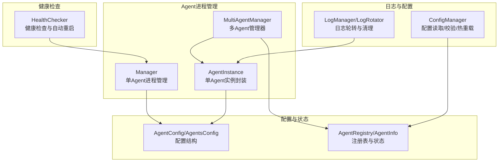

图表来源
- [manager.go](file://daemon/internal/agent/manager.go#L1-L234)
- [instance.go](file://daemon/internal/agent/instance.go#L1-L411)
- [multi_manager.go](file://daemon/internal/agent/multi_manager.go#L1-L529)
- [config_manager.go](file://daemon/internal/agent/config_manager.go#L1-L551)
- [log_manager.go](file://daemon/internal/agent/log_manager.go#L1-L557)
- [config.go](file://daemon/internal/config/config.go#L1-L505)
- [registry.go](file://daemon/internal/agent/registry.go#L1-L314)
- [health.go](file://daemon/internal/agent/health.go#L1-L197)

章节来源
- [manager.go](file://daemon/internal/agent/manager.go#L1-L234)
- [instance.go](file://daemon/internal/agent/instance.go#L1-L411)
- [multi_manager.go](file://daemon/internal/agent/multi_manager.go#L1-L529)
- [config_manager.go](file://daemon/internal/agent/config_manager.go#L1-L551)
- [log_manager.go](file://daemon/internal/agent/log_manager.go#L1-L557)
- [config.go](file://daemon/internal/config/config.go#L1-L505)
- [registry.go](file://daemon/internal/agent/registry.go#L1-L314)
- [health.go](file://daemon/internal/agent/health.go#L1-L197)

## 核心组件
- Manager（单Agent进程管理器）
  - 通过os.Process启动/停止/重启单个Agent进程
  - 构建命令行参数、设置工作目录、重定向输出到日志文件
  - 基于指数退避的Restart策略，带优雅重启与上下文取消支持
  - 通过Signal(0)检查进程是否存在
- AgentInstance（单Agent实例封装）
  - 以AgentInfo为中心的数据结构，封装配置、状态与运行时数据
  - 生成不同类型的Agent启动参数，按需创建日志目录并重定向输出
  - 提供与Manager一致的Start/Stop/Restart/IsRunning接口
- MultiAgentManager（多Agent管理器）
  - 基于AgentRegistry管理多个Agent实例，提供批量操作与状态回调
  - 与元数据存储协作，维护Agent状态、重启次数、启动时间等
- ConfigManager（配置管理与热重载）
  - 读取/校验/更新Agent配置，支持YAML/JSON格式
  - 通过fsnotify监听配置变更，必要时发送SIGHUP触发Agent重载
- LogManager/LogRotator（日志轮转与清理）
  - 按大小/时间轮转日志文件，支持压缩与清理
  - 提供日志检索与搜索能力
- HealthChecker（健康检查）
  - 周期性检查进程存活、心跳超时、资源阈值，触发Manager.Restart

章节来源
- [manager.go](file://daemon/internal/agent/manager.go#L1-L234)
- [instance.go](file://daemon/internal/agent/instance.go#L1-L411)
- [multi_manager.go](file://daemon/internal/agent/multi_manager.go#L1-L529)
- [config_manager.go](file://daemon/internal/agent/config_manager.go#L1-L551)
- [log_manager.go](file://daemon/internal/agent/log_manager.go#L1-L557)
- [health.go](file://daemon/internal/agent/health.go#L1-L197)

## 架构总览
Daemon对Agent的进程管理采用“单Agent管理器 + 多Agent编排”的双层架构：
- 单Agent管理器负责具体进程的启动、停止、重启与状态检查
- 多Agent管理器负责注册表、实例集合、批量操作与状态同步
- 配置管理器负责配置读取、校验与热重载
- 日志管理器负责日志轮转与清理
- 健康检查器负责周期性健康评估与自动重启

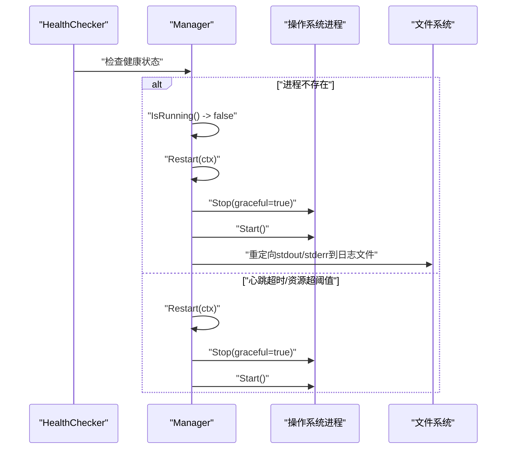

图表来源
- [health.go](file://daemon/internal/agent/health.go#L67-L132)
- [manager.go](file://daemon/internal/agent/manager.go#L92-L175)

## 详细组件分析

### Manager（单Agent进程管理器）
- 启动流程（Start）
  - 检查是否已运行（isRunningLocked）
  - 构建命令行参数（-config 指向配置文件）
  - 设置工作目录（cmd.Dir）
  - 设置进程组（Setpgid），确保Agent独立运行
  - 重定向stdout/stderr到日志文件（同目录下的agent.log）
  - 启动进程并后台等待退出，关闭日志文件句柄
- 停止流程（Stop）
  - 支持优雅停止（发送SIGTERM）与强制停止（Kill）
  - 优雅停止等待最多30秒，期间监控Wait；超时或上下文取消则强制Kill
- 重启流程（Restart）
  - 计算退避时间（指数退避，基于restartCount与lastRestart）
  - 若距离上次重启超过5分钟，重置restartCount
  - 优雅停止当前进程，再启动新进程
  - 增加重启计数并记录阈值告警
- 状态检查（IsRunning/isRunningLocked）
  - 通过向进程发送Signal(0)判断进程是否存在
- 关键字段
  - config、process、pid、restartCount、lastRestart、mu、logger

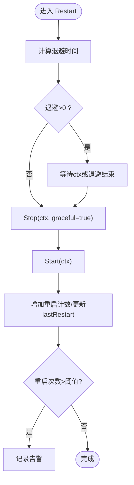

图表来源
- [manager.go](file://daemon/internal/agent/manager.go#L139-L175)
- [manager.go](file://daemon/internal/agent/manager.go#L215-L234)

章节来源
- [manager.go](file://daemon/internal/agent/manager.go#L35-L175)
- [manager.go](file://daemon/internal/agent/manager.go#L177-L234)

### AgentInstance（单Agent实例封装）
- 与Manager类似的功能，但面向AgentInfo（包含配置、状态、重启计数、最后重启时间等）
- generateArgs根据Agent类型生成启动参数（filebeat、telegraf、node_exporter、custom）
- getLogFilePath确定日志文件路径（支持工作目录与临时目录）
- periodicRotateCheck定期检查并触发日志轮转（若启用）

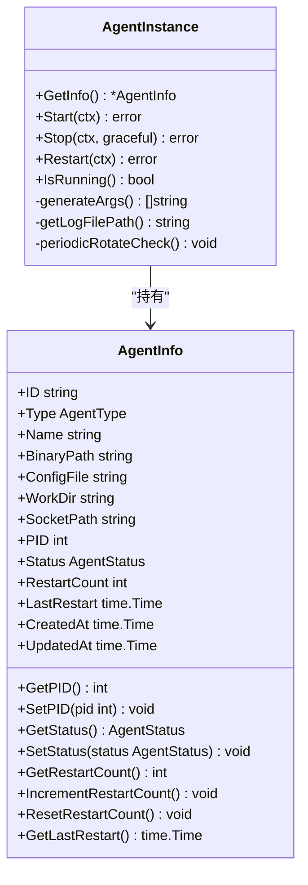

图表来源
- [instance.go](file://daemon/internal/agent/instance.go#L1-L411)
- [registry.go](file://daemon/internal/agent/registry.go#L40-L155)

章节来源
- [instance.go](file://daemon/internal/agent/instance.go#L47-L155)
- [instance.go](file://daemon/internal/agent/instance.go#L250-L300)
- [instance.go](file://daemon/internal/agent/instance.go#L334-L377)
- [instance.go](file://daemon/internal/agent/instance.go#L379-L411)
- [registry.go](file://daemon/internal/agent/registry.go#L40-L155)

### MultiAgentManager（多Agent管理器）
- 通过AgentRegistry管理多个AgentInstance，提供注册、注销、列举、批量操作
- StartAgent/StopAgent/RestartAgent与AgentInstance交互，并更新元数据（状态、启动时间、重启次数）
- 支持状态变化回调（通知上层状态变更）

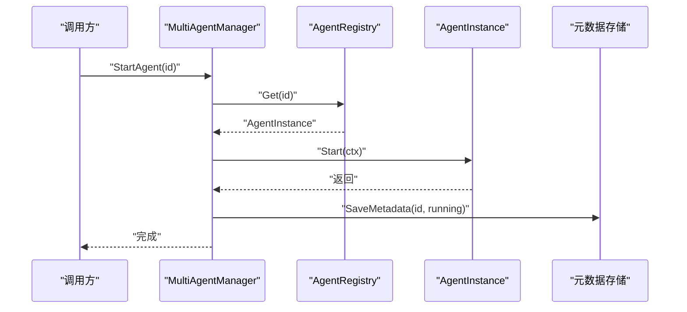

图表来源
- [multi_manager.go](file://daemon/internal/agent/multi_manager.go#L135-L197)
- [multi_manager.go](file://daemon/internal/agent/multi_manager.go#L199-L233)
- [multi_manager.go](file://daemon/internal/agent/multi_manager.go#L235-L275)

章节来源
- [multi_manager.go](file://daemon/internal/agent/multi_manager.go#L1-L529)

### 配置管理与热重载（ConfigManager）
- ReadConfig/ValidateConfig/UpdateConfig支持YAML/JSON格式，深度合并与原子写入
- StartWatching/StopWatching通过fsnotify监听配置目录变化
- handleConfigChange根据事件触发reloadAgentConfig，发送SIGHUP信号

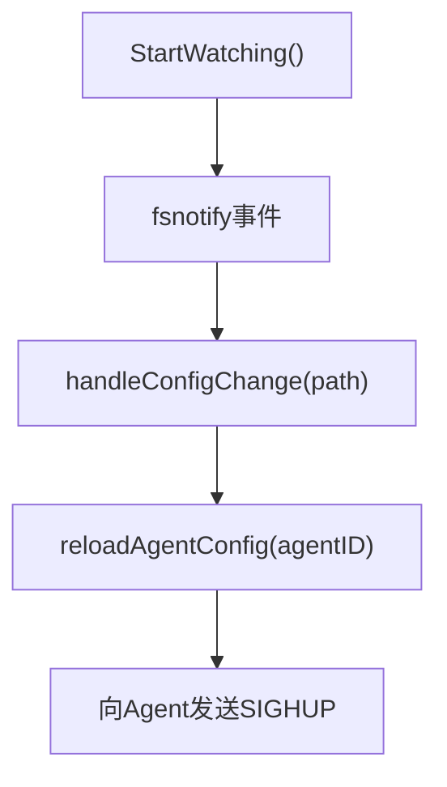

图表来源
- [config_manager.go](file://daemon/internal/agent/config_manager.go#L303-L380)
- [config_manager.go](file://daemon/internal/agent/config_manager.go#L416-L477)

章节来源
- [config_manager.go](file://daemon/internal/agent/config_manager.go#L68-L110)
- [config_manager.go](file://daemon/internal/agent/config_manager.go#L126-L226)
- [config_manager.go](file://daemon/internal/agent/config_manager.go#L227-L301)
- [config_manager.go](file://daemon/internal/agent/config_manager.go#L303-L380)
- [config_manager.go](file://daemon/internal/agent/config_manager.go#L416-L477)

### 日志轮转与清理（LogManager/LogRotator）
- LogRotator按大小/时间轮转日志文件，支持压缩与清理
- LogManager提供最近N行日志读取与关键词搜索
- 定时清理任务按保留天数删除过期日志

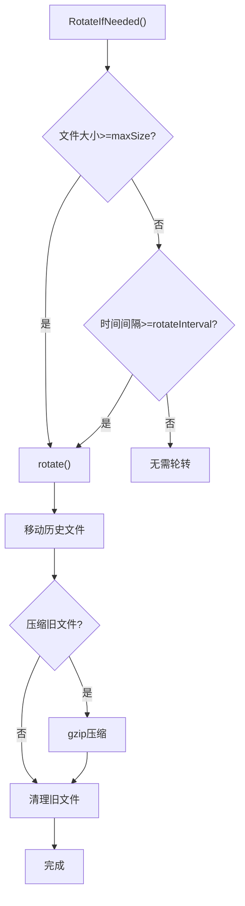

图表来源
- [log_manager.go](file://daemon/internal/agent/log_manager.go#L45-L159)
- [log_manager.go](file://daemon/internal/agent/log_manager.go#L161-L238)
- [log_manager.go](file://daemon/internal/agent/log_manager.go#L239-L253)
- [log_manager.go](file://daemon/internal/agent/log_manager.go#L283-L417)
- [log_manager.go](file://daemon/internal/agent/log_manager.go#L419-L551)

章节来源
- [log_manager.go](file://daemon/internal/agent/log_manager.go#L1-L557)

### 健康检查与自动重启（HealthChecker）
- 周期性检查进程是否存在、心跳是否超时、CPU/Memory是否超阈值
- 触发Manager.Restart(ctx)，并在健康恢复后重置重启计数

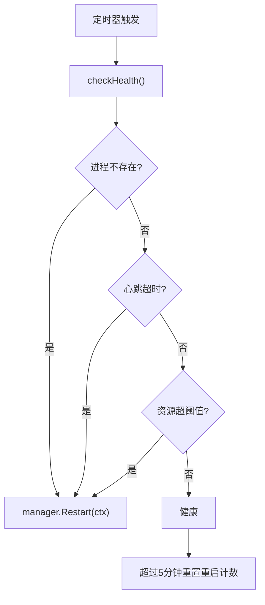

图表来源
- [health.go](file://daemon/internal/agent/health.go#L67-L132)
- [health.go](file://daemon/internal/agent/health.go#L146-L190)

章节来源
- [health.go](file://daemon/internal/agent/health.go#L1-L197)

## 依赖分析
- Manager依赖os/exec、syscall、zap日志库，以及config.AgentConfig
- AgentInstance依赖AgentInfo、zap日志库、os/exec、syscall
- MultiAgentManager依赖AgentRegistry、元数据存储接口、zap日志库
- ConfigManager依赖fsnotify、yaml/json解析、AgentRegistry
- LogManager/LogRotator依赖os、io、time、压缩库
- HealthChecker依赖gopsutil进程库、types心跳结构、zap日志库

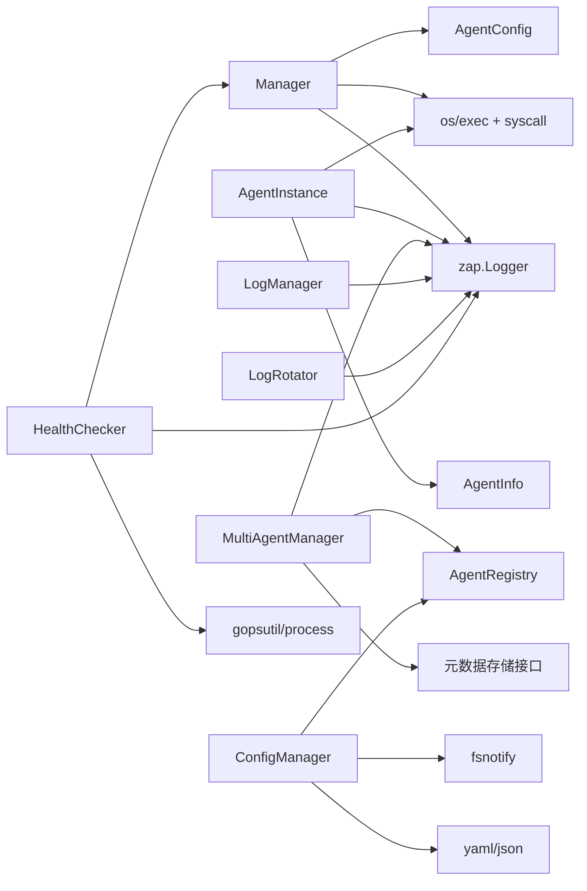

图表来源
- [manager.go](file://daemon/internal/agent/manager.go#L1-L234)
- [instance.go](file://daemon/internal/agent/instance.go#L1-L411)
- [multi_manager.go](file://daemon/internal/agent/multi_manager.go#L1-L529)
- [config_manager.go](file://daemon/internal/agent/config_manager.go#L1-L551)
- [log_manager.go](file://daemon/internal/agent/log_manager.go#L1-L557)
- [health.go](file://daemon/internal/agent/health.go#L1-L197)

章节来源
- [config.go](file://daemon/internal/config/config.go#L1-L505)
- [registry.go](file://daemon/internal/agent/registry.go#L1-L314)

## 性能考虑
- 进程启动与等待：Start/Stop/Restart均采用异步等待（Wait），避免阻塞主控制流
- 优雅停止：优先发送SIGTERM并等待，超时后强制Kill，平衡稳定性与及时性
- 退避策略：指数退避降低频繁重启带来的抖动，配合5分钟重置窗口避免长期累积
- 日志轮转：按大小/时间轮转，压缩旧文件减少磁盘占用；清理任务按保留天数定期清理
- 健康检查：周期性检查，避免过度轮询；资源阈值与持续时间结合，防止误判

[本节为通用指导，不直接分析具体文件]

## 故障排查指南
- 启动失败
  - 检查binary_path是否存在与权限
  - 检查work_dir是否可写，日志文件是否可创建
  - 查看日志文件（agent.log）定位错误
- 停止无效
  - 确认进程PID是否正确，进程是否存在（Signal(0)）
  - 优雅停止超时可能是Agent未正确处理SIGTERM，考虑强制停止
- 重启风暴
  - 检查restart策略与阈值配置，确认是否因资源超阈值导致频繁重启
  - 观察健康检查日志，确认是否存在心跳超时
- 配置变更未生效
  - 确认fsnotify监听是否启动，配置文件是否被原子替换
  - 检查SIGHUP发送是否成功，Agent是否正确处理重载

章节来源
- [manager.go](file://daemon/internal/agent/manager.go#L35-L175)
- [instance.go](file://daemon/internal/agent/instance.go#L47-L155)
- [config_manager.go](file://daemon/internal/agent/config_manager.go#L303-L380)
- [health.go](file://daemon/internal/agent/health.go#L67-L132)

## 结论
Daemon的Agent进程管理通过Manager/AgentInstance实现对单Agent的精细化控制，通过MultiAgentManager实现对多Agent的编排与状态同步，辅以ConfigManager、LogManager/LogRotator与HealthChecker形成完整的生命周期闭环。指数退避重启策略、优雅停止与健康检查共同保障了Agent的稳定运行与快速恢复。

[本节为总结性内容，不直接分析具体文件]

## 附录

### 进程生命周期状态转换图
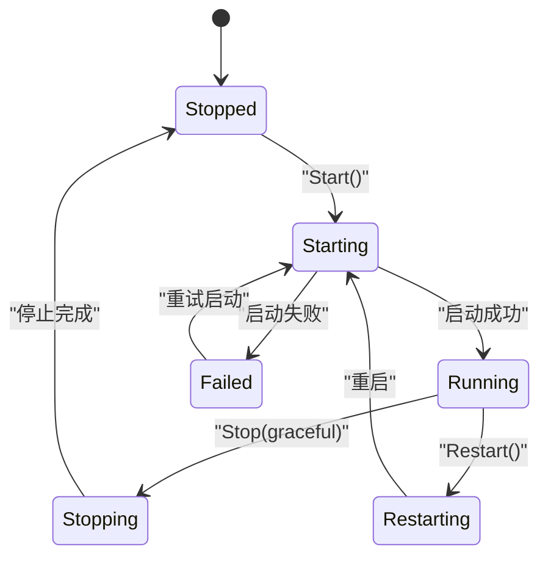

图表来源
- [registry.go](file://daemon/internal/agent/registry.go#L8-L24)
- [instance.go](file://daemon/internal/agent/instance.go#L47-L155)
- [manager.go](file://daemon/internal/agent/manager.go#L92-L175)

### 配置文件使用示例

- 单Agent配置（旧格式）
  - 字段：binary_path、work_dir、config_file、socket_path、health_check、restart
  - 示例参考：[daemon.yaml](file://daemon/configs/daemon.yaml#L22-L38)

- 多Agent配置（新格式）
  - 字段：agents[]（每项含id、type、name、binary_path、config_file、work_dir、socket_path、enabled、args、health_check、restart）
  - 全局默认：agent_defaults.health_check、agent_defaults.restart
  - 示例参考：[daemon.multi-agent.example.yaml](file://daemon/configs/daemon.multi-agent.example.yaml#L23-L189)

- 测试环境配置
  - 包含agents数组与agent_defaults，便于集成测试
  - 示例参考：[daemon.test.yaml](file://test/integration/config/daemon.test.yaml#L40-L151)

- binary_path、work_dir、restart策略要点
  - binary_path：Agent可执行文件绝对路径
  - work_dir：Agent工作目录，用于存放日志、临时文件
  - restart：max_retries、backoff_base、backoff_max、policy（always/never/on-failure）
  - 示例参考：
    - [config.go](file://daemon/internal/config/config.go#L50-L93)
    - [config.go](file://daemon/internal/config/config.go#L190-L304)
    - [config.go](file://daemon/internal/config/config.go#L393-L441)
    - [config.go](file://daemon/internal/config/config.go#L443-L504)

章节来源
- [daemon.yaml](file://daemon/configs/daemon.yaml#L22-L38)
- [daemon.multi-agent.example.yaml](file://daemon/configs/daemon.multi-agent.example.yaml#L23-L189)
- [daemon.test.yaml](file://test/integration/config/daemon.test.yaml#L40-L151)
- [config.go](file://daemon/internal/config/config.go#L50-L93)
- [config.go](file://daemon/internal/config/config.go#L190-L304)
- [config.go](file://daemon/internal/config/config.go#L393-L441)
- [config.go](file://daemon/internal/config/config.go#L443-L504)

### 代码级流程图（Restart方法）

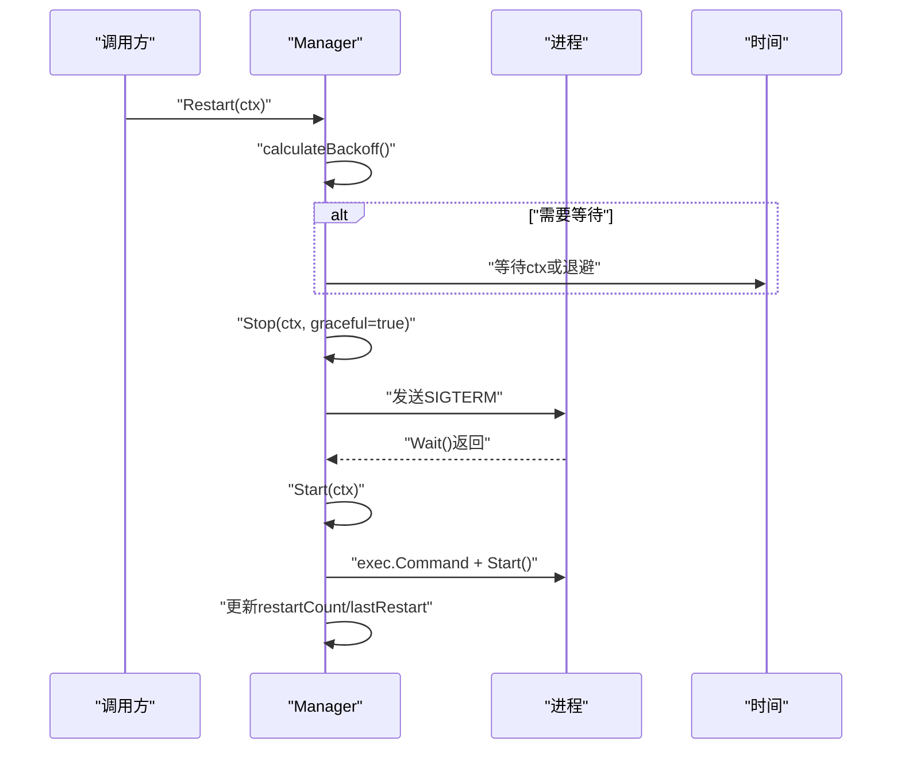

图表来源
- [manager.go](file://daemon/internal/agent/manager.go#L139-L175)
- [manager.go](file://daemon/internal/agent/manager.go#L215-L234)

### 行为测试参考
- 重启退避计算与状态转换测试
  - 参考：[instance_test.go](file://daemon/internal/agent/instance_test.go#L258-L312)
- 启动/停止/重启行为测试
  - 参考：[instance_test.go](file://daemon/internal/agent/instance_test.go#L317-L394)

章节来源
- [instance_test.go](file://daemon/internal/agent/instance_test.go#L258-L312)
- [instance_test.go](file://daemon/internal/agent/instance_test.go#L317-L394)