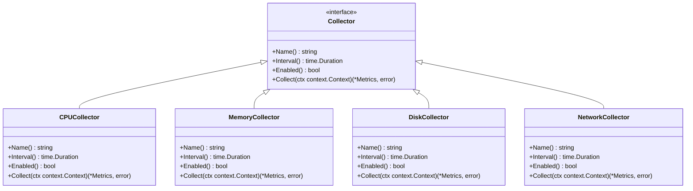

# Daemon 模块架构

<cite>
**本文档引用的文件**
- [main.go](file://daemon/cmd/daemon/main.go)
- [daemon.go](file://daemon/internal/daemon/daemon.go)
- [manager.go](file://daemon/internal/collector/manager.go)
- [agent/manager.go](file://daemon/internal/agent/manager.go)
- [grpc/server.go](file://daemon/internal/grpc/server.go)
- [agent/multi_manager.go](file://daemon/internal/agent/multi_manager.go)
- [collector/cpu.go](file://daemon/internal/collector/cpu.go)
- [collector/memory.go](file://daemon/internal/collector/memory.go)
- [collector/disk.go](file://daemon/internal/collector/disk.go)
- [collector/network.go](file://daemon/internal/collector/network.go)
- [config/config.go](file://daemon/internal/config/config.go)
- [comm/grpc_client.go](file://daemon/internal/comm/grpc_client.go)
- [agent/heartbeat.go](file://daemon/internal/agent/heartbeat.go)
- [agent/resource_monitor.go](file://daemon/internal/agent/resource_monitor.go)
- [manager/manager.proto](file://daemon/pkg/proto/manager/manager.proto)
- [daemon.proto](file://daemon/pkg/proto/daemon.proto)
</cite>

## 目录
1. [引言](#引言)
2. [核心职责](#核心职责)
3. [核心引擎架构](#核心引擎架构)
4. [资源采集模块](#资源采集模块)
5. [Agent管理模块](#agent管理模块)
6. [通信机制](#通信机制)
7. [关键架构决策](#关键架构决策)
8. [线程模型与数据流](#线程模型与数据流)
9. [结论](#结论)

## 引言
Daemon模块是运维工具框架中的核心组件，作为部署在主机上的守护进程，负责资源监控、Agent进程管理、版本更新和状态上报等关键任务。本架构文档旨在深入剖析Daemon模块的设计与实现，为开发者提供清晰的技术蓝图。

**Section sources**
- [main.go](file://daemon/cmd/daemon/main.go#L1-L65)
- [daemon.go](file://daemon/internal/daemon/daemon.go#L1-L695)

## 核心职责
Daemon模块承担着主机侧的多项核心职责：
1.  **资源采集**：定期采集主机的CPU、内存、磁盘和网络等系统资源使用情况。
2.  **Agent进程管理**：启动、停止、重启和监控多个Agent进程的生命周期。
3.  **版本更新执行**：接收并执行来自Manager的版本更新指令。
4.  **状态上报**：将采集到的指标和Agent状态通过gRPC上报给Manager。

**Section sources**
- [daemon.go](file://daemon/internal/daemon/daemon.go#L26-L49)

## 核心引擎架构
Daemon的核心引擎由多个协同工作的组件构成，其架构设计遵循高内聚、低耦合的原则。

### 配置管理
Daemon通过`config.Load`函数加载YAML格式的配置文件，并利用Viper库支持环境变量覆盖，实现了灵活的配置管理。配置结构清晰地划分为`Daemon`、`Manager`、`Agents`、`Collectors`等多个部分。


**Diagram sources**
- [config/config.go](file://daemon/internal/config/config.go#L13-L21)

### 日志
Daemon使用Uber的Zap库进行日志记录，通过`logger.Init`函数初始化，支持不同级别的日志输出。日志配置（级别、文件路径）从主配置中读取，确保了日志行为的可配置性。

**Section sources**
- [main.go](file://daemon/cmd/daemon/main.go#L34-L43)
- [daemon.go](file://daemon/internal/daemon/daemon.go#L51-L58)

### 信号处理
Daemon通过`WaitForSignal`方法监听操作系统信号（如SIGINT、SIGTERM），实现优雅的关闭。当收到终止信号时，Daemon会执行清理操作，如停止所有子组件、关闭连接、删除PID文件等。

**Section sources**
- [main.go](file://daemon/cmd/daemon/main.go#L60-L61)
- [daemon.go](file://daemon/internal/daemon/daemon.go#L398-L489)

### 调度器
Daemon内部的调度主要依赖`time.Ticker`和`context.Context`。`collector.Manager`和`Daemon`自身都使用Ticker来定期执行任务（如采集指标、发送心跳），并通过Context的取消机制来控制任务的生命周期。

**Section sources**
- [manager.go](file://daemon/internal/collector/manager.go#L67-L80)
- [daemon.go](file://daemon/internal/daemon/daemon.go#L531-L544)

## 资源采集模块
资源采集模块由`collector.Manager`统一管理，它负责启动和协调多个具体的采集器。

### 采集器实现
每个采集器（如`CPUCollector`、`MemoryCollector`）都实现了`Collector`接口，包含`Name`、`Interval`、`Enabled`和`Collect`方法。`Collect`方法使用`gopsutil`库获取系统信息，并将其封装为`types.Metrics`对象。



**Diagram sources**
- [collector/cpu.go](file://daemon/internal/collector/cpu.go#L13-L43)
- [collector/memory.go](file://daemon/internal/collector/memory.go#L13-L42)
- [collector/disk.go](file://daemon/internal/collector/disk.go#L13-L43)
- [collector/network.go](file://daemon/internal/collector/network.go#L13-L43)

### 数据流
采集器将数据写入`collector.Manager`的`latest`映射中，`reportMetricsLoop`循环会定期从`GetLatest()`方法获取所有最新指标，并通过gRPC上报给Manager。

```mermaid
flowchart TD
A[CPUCollector] --> |Collect()| B[collector.Manager.latest]
C[MemoryCollector] --> |Collect()| B
D[DiskCollector] --> |Collect()| B
E[NetworkCollector] --> |Collect()| B
B --> |GetLatest()| F[Daemon.reportMetricsLoop]
F --> |ReportMetrics| G[Manager]
```

**Diagram sources**
- [manager.go](file://daemon/internal/collector/manager.go#L96-L98)
- [daemon.go](file://daemon/internal/daemon/daemon.go#L559-L568)

## Agent管理模块
Agent管理模块是Daemon的核心功能之一，支持对多个Agent进程的全生命周期管理。

### 进程管理
`MultiAgentManager`是核心管理器，它通过`AgentInstance`封装每个Agent进程。`StartAgent`和`StopAgent`方法使用`os/exec`包来启动和停止进程，并通过`SysProcAttr`确保进程独立运行。

**Section sources**
- [agent/multi_manager.go](file://daemon/internal/agent/multi_manager.go#L136-L233)
- [agent/manager.go](file://daemon/internal/agent/manager.go#L36-L90)

### 健康检查
健康检查由`MultiHealthChecker`负责。它通过`HeartbeatReceiver`接收Agent的心跳，并结合`ResourceMonitor`检查CPU和内存使用率是否超过阈值，从而判断Agent的健康状态。

**Section sources**
- [daemon.go](file://daemon/internal/daemon/daemon.go#L120-L123)
- [agent/multi_manager.go](file://daemon/internal/agent/multi_manager.go#L147-L183)

### 心跳接收
Daemon通过两种方式接收Agent的心跳：
1.  **HTTP端点**：`HTTPHeartbeatReceiver`监听HTTP请求，处理来自Agent的JSON心跳。
2.  **Unix Socket**：`HeartbeatReceiver`监听Unix域套接字，用于向后兼容旧版Agent。


**Diagram sources**
- [agent/heartbeat.go](file://daemon/internal/agent/heartbeat.go#L16-L24)
- [agent/multi_manager.go](file://daemon/internal/agent/multi_manager.go#L486-L523)

## 通信机制
Daemon通过两种通信方式与不同组件交互。

### 与Manager的gRPC通信
Daemon作为gRPC客户端，通过`GRPCClient`与Manager进行通信。主要上报`Register`（注册）、`Heartbeat`（心跳）和`ReportMetrics`（指标）三种信息。


**Diagram sources**
- [comm/grpc_client.go](file://daemon/internal/comm/grpc_client.go#L41-L174)
- [manager/manager.proto](file://daemon/pkg/proto/manager/manager.proto#L9-L17)

### 与Agent的本地Socket通信
Daemon通过Unix Socket或HTTP端点接收Agent的心跳。Agent使用JSON-RPC 2.0格式发送心跳，Daemon解析后更新Agent状态。

**Section sources**
- [agent/heartbeat.go](file://daemon/internal/agent/heartbeat.go#L16-L24)
- [agent/heartbeat_receiver.go](file://daemon/internal/agent/heartbeat_receiver.go#L1-L24)

## 关键架构决策
### 为何采用gRPC进行远程通信
选择gRPC进行Daemon与Manager之间的通信，主要基于以下原因：
1.  **高性能**：基于HTTP/2和Protocol Buffers，具有高效的二进制序列化和多路复用能力。
2.  **强类型**：通过`.proto`文件定义接口，生成强类型的客户端和服务端代码，减少错误。
3.  **跨语言**：天然支持多语言，便于未来扩展。

### 为何采用Unix Socket进行本地通信
选择Unix Socket进行本地Agent通信，主要基于以下原因：
1.  **高效**：在同一主机上，Unix Socket比TCP回环接口更高效，无需经过网络协议栈。
2.  **安全**：可以通过文件系统权限控制访问，比开放端口更安全。
3.  **简单**：对于本地进程间通信，Unix Socket是一种成熟且简单的解决方案。

## 线程模型与数据流
Daemon的线程模型以事件驱动和并发协程为主。

```mermaid
flowchart TD
A[main] --> B[Daemon.Start]
B --> C[collector.Manager.Start]
C --> D[runCollector(CPUCollector)]
C --> E[runCollector(MemoryCollector)]
C --> F[runCollector(DiskCollector)]
C --> G[runCollector(NetworkCollector)]
B --> H[MultiAgentManager.StartAll]
H --> I[StartAgent(agent-1)]
H --> J[StartAgent(agent-2)]
B --> K[MultiHealthChecker.Start]
K --> L[checkLoop]
B --> M[HTTPHeartbeatReceiver.Start]
M --> N[acceptLoop]
B --> O[reportMetricsLoop]
O --> P[ReportMetrics]
B --> Q[heartbeatLoop]
Q --> R[Heartbeat]
```

**Diagram sources**
- [daemon.go](file://daemon/internal/daemon/daemon.go#L241-L394)
- [manager.go](file://daemon/internal/collector/manager.go#L36-L52)

## 结论
Daemon模块通过清晰的分层架构和模块化设计，实现了轻量级、高可用的主机守护进程。其核心在于将资源采集、Agent管理、通信和调度等职责解耦，通过gRPC和Unix Socket等现代技术栈，构建了一个稳定可靠的运维自动化基础。