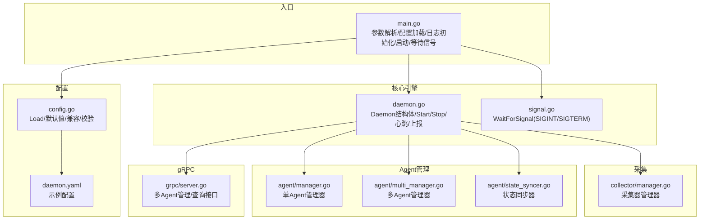
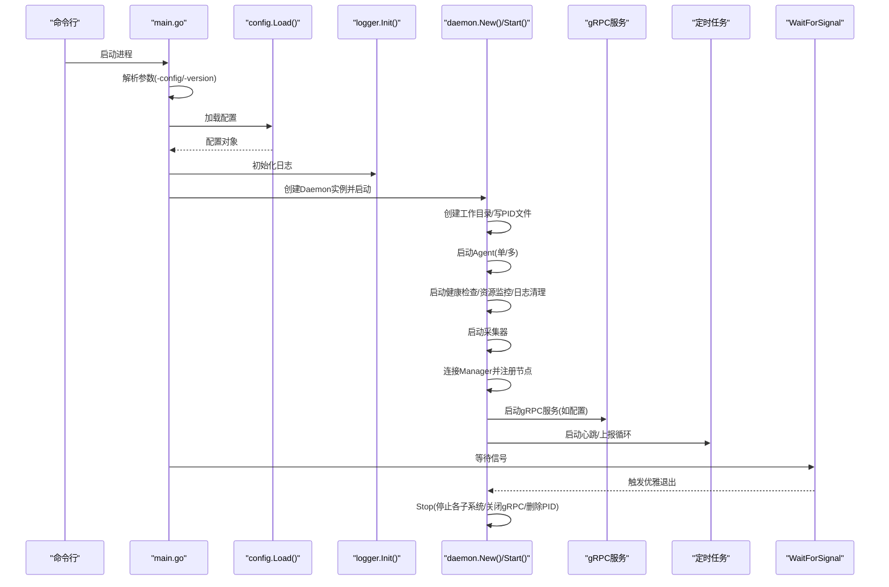
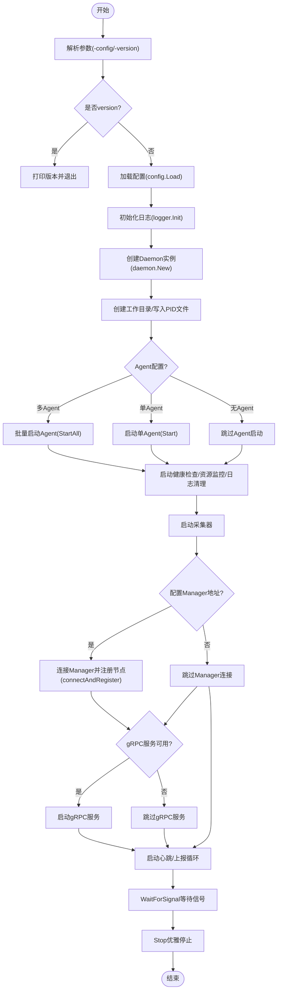
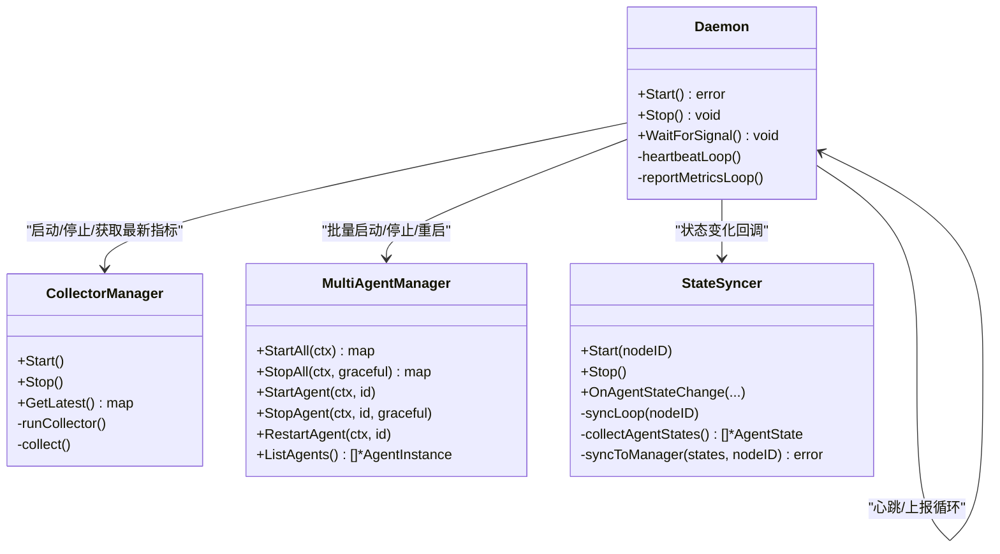
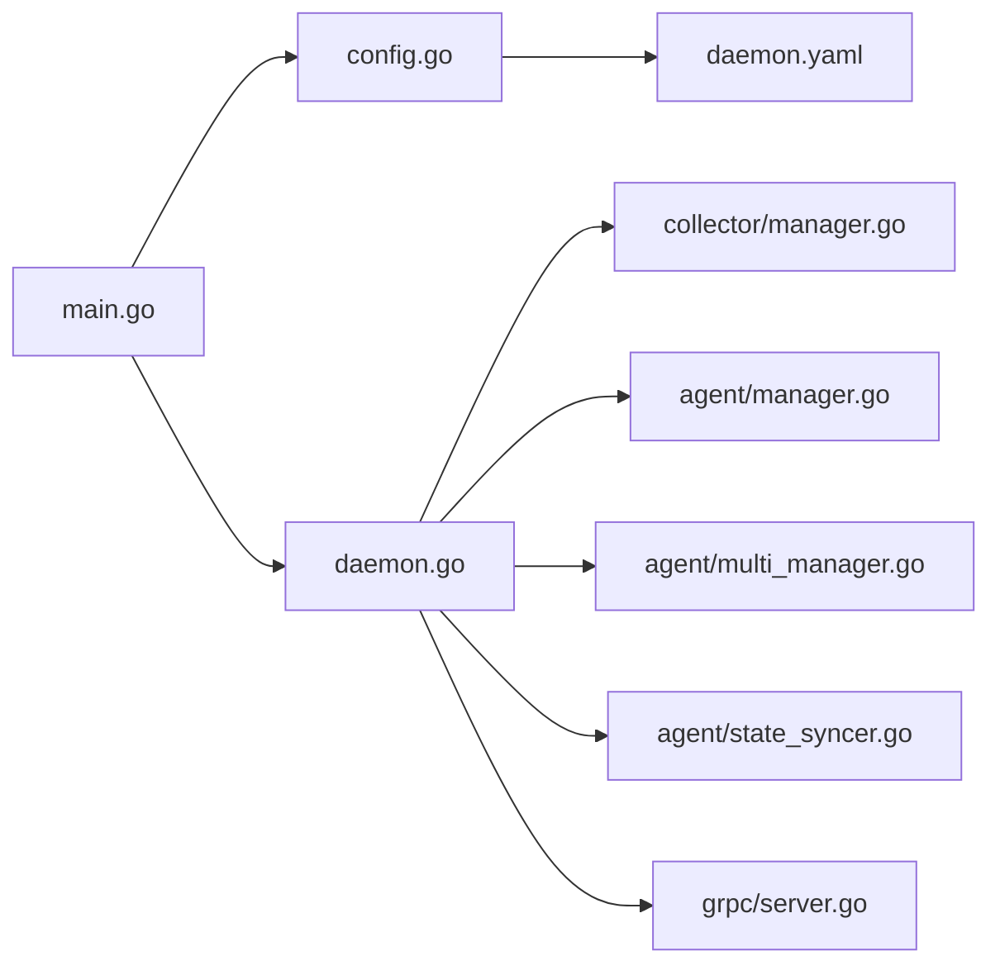

# 核心引擎

<cite>
**本文引用的文件**
- [daemon/cmd/daemon/main.go](file://daemon/cmd/daemon/main.go)
- [daemon/internal/daemon/daemon.go](file://daemon/internal/daemon/daemon.go)
- [daemon/internal/daemon/signal.go](file://daemon/internal/daemon/signal.go)
- [daemon/internal/config/config.go](file://daemon/internal/config/config.go)
- [daemon/internal/collector/manager.go](file://daemon/internal/collector/manager.go)
- [daemon/internal/agent/manager.go](file://daemon/internal/agent/manager.go)
- [daemon/internal/agent/multi_manager.go](file://daemon/internal/agent/multi_manager.go)
- [daemon/internal/agent/state_syncer.go](file://daemon/internal/agent/state_syncer.go)
- [daemon/internal/grpc/server.go](file://daemon/internal/grpc/server.go)
- [daemon/configs/daemon.yaml](file://daemon/configs/daemon.yaml)
</cite>

## 目录
1. [引言](#引言)
2. [项目结构](#项目结构)
3. [核心组件](#核心组件)
4. [架构总览](#架构总览)
5. [详细组件分析](#详细组件分析)
6. [依赖关系分析](#依赖关系分析)
7. [性能考量](#性能考量)
8. [故障排查指南](#故障排查指南)
9. [结论](#结论)
10. [附录](#附录)

## 引言
本文件聚焦Daemon核心引擎的设计与实现，面向开发者系统性阐述其作为守护进程主控模块的职责与稳定性保障机制。内容覆盖启动流程（参数解析、配置加载、日志初始化、连接Manager、注册节点、启动定时任务）、信号处理（优雅退出）、以及核心调度器如何协调采集、上报、监控等后台Goroutine的生命周期。文中通过架构图、序列图与流程图帮助读者快速理解Daemon的可靠设计。

## 项目结构
Daemon位于仓库的daemon子模块，采用“入口程序 + 内核引擎 + 子模块”的分层组织：
- 入口程序：cmd/daemon/main.go 负责参数解析、配置加载、日志初始化、创建并启动Daemon实例、等待信号。
- 内核引擎：internal/daemon/daemon.go 定义Daemon结构体与生命周期方法（New、Start、Stop），协调各子模块。
- 配置模块：internal/config/config.go 提供配置加载、默认值设置、兼容转换与校验。
- 采集模块：internal/collector/manager.go 管理CPU/Memory/Disk/Network等采集器的周期采集与结果缓存。
- Agent管理：internal/agent/manager.go（单Agent）与 internal/agent/multi_manager.go（多Agent）分别提供进程生命周期管理与批量操作。
- 状态同步：internal/agent/state_syncer.go 负责将Agent状态定期上报至Manager。
- gRPC服务：internal/grpc/server.go 对外暴露多Agent管理与查询接口。
- 示例配置：configs/daemon.yaml 展示典型配置项。



图表来源
- [daemon/cmd/daemon/main.go](file://daemon/cmd/daemon/main.go#L1-L65)
- [daemon/internal/daemon/daemon.go](file://daemon/internal/daemon/daemon.go#L1-L238)
- [daemon/internal/daemon/signal.go](file://daemon/internal/daemon/signal.go#L1-L22)
- [daemon/internal/config/config.go](file://daemon/internal/config/config.go#L137-L187)
- [daemon/internal/collector/manager.go](file://daemon/internal/collector/manager.go#L1-L124)
- [daemon/internal/agent/manager.go](file://daemon/internal/agent/manager.go#L1-L234)
- [daemon/internal/agent/multi_manager.go](file://daemon/internal/agent/multi_manager.go#L1-L200)
- [daemon/internal/agent/state_syncer.go](file://daemon/internal/agent/state_syncer.go#L1-L120)
- [daemon/internal/grpc/server.go](file://daemon/internal/grpc/server.go#L1-L120)
- [daemon/configs/daemon.yaml](file://daemon/configs/daemon.yaml#L1-L63)

章节来源
- [daemon/cmd/daemon/main.go](file://daemon/cmd/daemon/main.go#L1-L65)
- [daemon/internal/config/config.go](file://daemon/internal/config/config.go#L137-L187)
- [daemon/configs/daemon.yaml](file://daemon/configs/daemon.yaml#L1-L63)

## 核心组件
- Daemon结构体：持有配置、日志、采集器管理器、Agent管理器、健康检查器、心跳接收器、资源监控器、日志管理器、状态同步器、gRPC客户端/服务端、上下文与等待组等，统一编排生命周期。
- 配置加载：Viper读取YAML配置，绑定环境变量，设置默认值，兼容旧格式Agent配置为新格式，最后进行验证。
- 采集器管理：按配置启用CPU/Memory/Disk/Network采集器，周期采集并将最新指标缓存，供上报循环使用。
- Agent管理：支持单Agent（向后兼容）与多Agent（新架构）。多Agent模式下提供批量启动/停止/重启、状态变更回调、资源监控与HTTP心跳接收。
- 状态同步：监听Agent状态变化，定期向Manager上报Agent状态；失败时缓存待同步状态，等待下次重试。
- gRPC服务：对外提供列举Agent、操作Agent、获取Agent资源指标、同步Agent状态等接口。
- 信号处理：捕获SIGINT/SIGTERM/SIGQUIT，触发优雅退出流程。

章节来源
- [daemon/internal/daemon/daemon.go](file://daemon/internal/daemon/daemon.go#L26-L238)
- [daemon/internal/config/config.go](file://daemon/internal/config/config.go#L137-L187)
- [daemon/internal/collector/manager.go](file://daemon/internal/collector/manager.go#L1-L124)
- [daemon/internal/agent/manager.go](file://daemon/internal/agent/manager.go#L1-L234)
- [daemon/internal/agent/multi_manager.go](file://daemon/internal/agent/multi_manager.go#L1-L200)
- [daemon/internal/agent/state_syncer.go](file://daemon/internal/agent/state_syncer.go#L1-L120)
- [daemon/internal/grpc/server.go](file://daemon/internal/grpc/server.go#L1-L120)
- [daemon/internal/daemon/signal.go](file://daemon/internal/daemon/signal.go#L1-L22)

## 架构总览
Daemon核心引擎通过“入口程序 -> 配置 -> 日志 -> Daemon实例 -> 启动子系统 -> 定时任务 -> 信号处理”的链路实现稳定运行。启动阶段按顺序创建工作目录、写入PID文件、启动Agent（单/多Agent）、启动健康检查/资源监控/日志清理、启动采集器、连接Manager并注册节点、启动gRPC服务、启动心跳与指标上报循环。退出阶段通过WaitForSignal捕获系统信号，调用Stop统一停止各子系统并优雅关闭。



图表来源
- [daemon/cmd/daemon/main.go](file://daemon/cmd/daemon/main.go#L18-L64)
- [daemon/internal/daemon/daemon.go](file://daemon/internal/daemon/daemon.go#L240-L396)
- [daemon/internal/daemon/signal.go](file://daemon/internal/daemon/signal.go#L11-L21)

## 详细组件分析

### 启动流程（参数解析、配置加载、日志初始化、连接Manager、注册节点、启动定时任务）
- 参数解析：支持-config与-version两个标志位；version为真时打印版本并退出。
- 配置加载：Viper读取YAML，自动绑定环境变量，设置默认值，兼容旧格式Agent配置为新格式，并进行严格校验。
- 日志初始化：根据配置的日志级别与文件路径初始化日志器。
- 创建Daemon实例：生成或加载节点ID，创建采集器管理器，按配置选择单Agent或多Agent模式，初始化健康检查、心跳接收、资源监控、日志管理、状态同步器与gRPC客户端/服务端。
- 启动阶段：
  - 工作目录与PID文件准备
  - Agent启动（多Agent：批量启动；单Agent：启动一个）
  - 健康检查器、资源监控器、日志清理任务启动
  - 采集器启动
  - 连接Manager并注册节点（若配置了地址）
  - 启动gRPC服务（多Agent+资源监控场景）
  - 启动心跳与指标上报循环（若配置了Manager）
- 优雅等待：进入WaitForSignal，捕获信号后调用Stop完成优雅退出。



图表来源
- [daemon/cmd/daemon/main.go](file://daemon/cmd/daemon/main.go#L18-L64)
- [daemon/internal/daemon/daemon.go](file://daemon/internal/daemon/daemon.go#L240-L396)
- [daemon/internal/daemon/signal.go](file://daemon/internal/daemon/signal.go#L11-L21)

章节来源
- [daemon/cmd/daemon/main.go](file://daemon/cmd/daemon/main.go#L18-L64)
- [daemon/internal/config/config.go](file://daemon/internal/config/config.go#L137-L187)
- [daemon/internal/daemon/daemon.go](file://daemon/internal/daemon/daemon.go#L240-L396)

### 信号处理机制（SIGTERM、SIGINT等）
- WaitForSignal注册SIGINT、SIGTERM、SIGQUIT，收到信号后记录日志并调用Stop。
- Stop统一停止各子系统：状态同步器、日志清理任务、资源监控器、心跳接收器、健康检查器、采集器、HTTP服务器、gRPC服务器、Agent进程、gRPC客户端/Manager客户端，最后删除PID文件。
- 多Agent模式下，StopAll会优雅停止所有Agent；单Agent模式下保留Agent继续运行（向后兼容）。

```mermaid
sequenceDiagram
participant OS as "操作系统"
participant Sig as "WaitForSignal"
participant D as "Daemon.Stop"
OS-->>Sig : 发送SIGINT/SIGTERM/SIGQUIT
Sig->>D : 调用Stop()
D->>D : 停止状态同步器/日志清理/资源监控/心跳接收器/健康检查器
D->>D : 停止采集器/HTTP服务器/gRPC服务器
D->>D : 停止Agent(多Agent : StopAll; 单Agent : 保留)
D->>D : 关闭gRPC客户端/Manager客户端
D->>D : 删除PID文件
D-->>OS : 优雅退出
```

图表来源
- [daemon/internal/daemon/signal.go](file://daemon/internal/daemon/signal.go#L11-L21)
- [daemon/internal/daemon/daemon.go](file://daemon/internal/daemon/daemon.go#L398-L489)

章节来源
- [daemon/internal/daemon/signal.go](file://daemon/internal/daemon/signal.go#L11-L21)
- [daemon/internal/daemon/daemon.go](file://daemon/internal/daemon/daemon.go#L398-L489)

### 核心调度器与后台Goroutine生命周期
- 采集器管理器：为每个启用的采集器创建独立Goroutine，基于ticker周期采集，将最新指标写入共享缓存，供上报循环使用。
- 心跳循环：以配置的心跳间隔定时发送心跳至Manager。
- 指标上报循环：周期拉取采集器最新指标，超时控制后上报Manager。
- 状态同步器：监听Agent状态变化，定期聚合当前状态与待同步状态，向Manager上报；失败时回退到待同步队列，等待下次重试。
- gRPC服务：在多Agent+资源监控场景下启动，提供Agent列表、操作、资源指标查询与状态同步接口。
- HTTP服务器：在多Agent模式下启动HTTP端点接收Agent心跳（兼容旧格式Unix Socket心跳接收器）。



图表来源
- [daemon/internal/daemon/daemon.go](file://daemon/internal/daemon/daemon.go#L240-L571)
- [daemon/internal/collector/manager.go](file://daemon/internal/collector/manager.go#L1-L124)
- [daemon/internal/agent/multi_manager.go](file://daemon/internal/agent/multi_manager.go#L277-L352)
- [daemon/internal/agent/state_syncer.go](file://daemon/internal/agent/state_syncer.go#L226-L282)

章节来源
- [daemon/internal/daemon/daemon.go](file://daemon/internal/daemon/daemon.go#L240-L571)
- [daemon/internal/collector/manager.go](file://daemon/internal/collector/manager.go#L1-L124)
- [daemon/internal/agent/multi_manager.go](file://daemon/internal/agent/multi_manager.go#L277-L352)
- [daemon/internal/agent/state_syncer.go](file://daemon/internal/agent/state_syncer.go#L226-L282)

### 配置加载与兼容性
- Viper读取YAML配置，支持环境变量绑定与替换规则。
- 默认值：日志级别、日志文件、PID文件、工作目录、Manager心跳/重连/超时、Agent健康检查与重启策略、采集器间隔等。
- 兼容转换：当旧格式agent配置存在但新格式agents为空时，自动转换为新格式agents数组。
- 校验：日志级别合法性、Manager地址可为空（独立运行）、TLS证书文件存在性提示、Agent二进制与配置文件存在性提示、Agent ID唯一性、类型与重启策略有效性。

章节来源
- [daemon/internal/config/config.go](file://daemon/internal/config/config.go#L137-L187)
- [daemon/internal/config/config.go](file://daemon/internal/config/config.go#L190-L297)
- [daemon/internal/config/config.go](file://daemon/internal/config/config.go#L356-L499)
- [daemon/configs/daemon.yaml](file://daemon/configs/daemon.yaml#L1-L63)

### Agent管理（单Agent与多Agent）
- 单Agent模式：AgentManager封装进程启动、停止、重启与健康检查，支持优雅停止与退避重启策略。
- 多Agent模式：MultiAgentManager提供注册表、批量操作、状态变更回调、元数据存储与资源使用历史记录；AgentInstance负责单个Agent进程生命周期与日志轮转。

章节来源
- [daemon/internal/agent/manager.go](file://daemon/internal/agent/manager.go#L1-L234)
- [daemon/internal/agent/multi_manager.go](file://daemon/internal/agent/multi_manager.go#L1-L200)
- [daemon/internal/agent/multi_manager.go](file://daemon/internal/agent/multi_manager.go#L277-L352)
- [daemon/internal/agent/instance.go](file://daemon/internal/agent/instance.go#L1-L200)

### gRPC服务与状态同步
- gRPC服务端：提供列举Agent、操作Agent、获取Agent资源指标、同步Agent状态等接口；与MultiAgentManager和ResourceMonitor协作。
- 状态同步器：监听Agent状态变化，定期聚合状态并上报Manager；失败时将状态回退到待同步队列，等待下次重试。

章节来源
- [daemon/internal/grpc/server.go](file://daemon/internal/grpc/server.go#L1-L120)
- [daemon/internal/grpc/server.go](file://daemon/internal/grpc/server.go#L120-L255)
- [daemon/internal/agent/state_syncer.go](file://daemon/internal/agent/state_syncer.go#L1-L120)
- [daemon/internal/agent/state_syncer.go](file://daemon/internal/agent/state_syncer.go#L188-L282)

## 依赖关系分析
- 入口程序依赖配置模块与日志模块，创建Daemon实例并启动。
- Daemon依赖采集器管理器、Agent管理器（单/多）、状态同步器、gRPC客户端/服务端、HTTP服务器等。
- 多Agent模式下，Daemon同时持有MultiAgentManager与ResourceMonitor，用于批量管理与资源监控。
- 状态同步器通过ManagerClient与Manager交互，实现Agent状态上报。



图表来源
- [daemon/cmd/daemon/main.go](file://daemon/cmd/daemon/main.go#L18-L64)
- [daemon/internal/daemon/daemon.go](file://daemon/internal/daemon/daemon.go#L1-L238)
- [daemon/internal/config/config.go](file://daemon/internal/config/config.go#L137-L187)
- [daemon/internal/collector/manager.go](file://daemon/internal/collector/manager.go#L1-L124)
- [daemon/internal/agent/manager.go](file://daemon/internal/agent/manager.go#L1-L234)
- [daemon/internal/agent/multi_manager.go](file://daemon/internal/agent/multi_manager.go#L1-L200)
- [daemon/internal/agent/state_syncer.go](file://daemon/internal/agent/state_syncer.go#L1-L120)
- [daemon/internal/grpc/server.go](file://daemon/internal/grpc/server.go#L1-L120)
- [daemon/configs/daemon.yaml](file://daemon/configs/daemon.yaml#L1-L63)

章节来源
- [daemon/cmd/daemon/main.go](file://daemon/cmd/daemon/main.go#L18-L64)
- [daemon/internal/daemon/daemon.go](file://daemon/internal/daemon/daemon.go#L1-L238)

## 性能考量
- 采集器：按配置启用，使用ticker驱动，避免阻塞；最新指标缓存为只读共享结构，读写分离减少锁竞争。
- Agent管理：多Agent批量启动/停止使用并发Goroutine，结合互斥锁保护共享状态；单Agent优雅停止支持超时与强制终止。
- 状态同步：采用待同步队列与定时同步策略，降低频繁同步带来的网络压力；失败重试与回退机制提升可靠性。
- gRPC服务：服务端注册与监听器创建在多Agent+资源监控场景下启用，避免不必要的资源占用。
- 日志：多Agent模式下为每个Agent实例配置独立日志轮转器，限制单文件大小与保留数量，降低磁盘压力。

## 故障排查指南
- 启动失败
  - 检查配置文件路径与权限，确认配置加载成功。
  - 查看日志初始化是否成功，确认日志文件可写。
  - 若连接Manager失败，检查地址、TLS证书与网络连通性。
- Agent无法启动/停止
  - 检查Agent二进制路径与工作目录权限。
  - 单Agent模式下，Stop不会终止Agent进程（向后兼容），如需终止请使用多Agent模式或直接操作Agent进程。
- 心跳/上报异常
  - 检查心跳间隔与超时配置，确认Manager可达。
  - 查看状态同步器日志，确认待同步队列是否堆积。
- 资源监控异常
  - 检查资源阈值配置与采集器启用情况。
  - 多Agent模式下，确认HTTP心跳接收器与Unix Socket心跳接收器配置。

章节来源
- [daemon/internal/daemon/daemon.go](file://daemon/internal/daemon/daemon.go#L340-L396)
- [daemon/internal/agent/manager.go](file://daemon/internal/agent/manager.go#L92-L175)
- [daemon/internal/agent/state_syncer.go](file://daemon/internal/agent/state_syncer.go#L188-L282)
- [daemon/internal/config/config.go](file://daemon/internal/config/config.go#L312-L354)

## 结论
Daemon核心引擎通过清晰的启动流程、完善的信号处理与优雅退出机制、以及对采集、Agent管理、状态同步、gRPC服务的统一编排，实现了高可靠、可扩展的守护进程主控模块。多Agent模式进一步增强了对复杂场景的支持，配合状态同步与资源监控，满足生产环境的运维需求。

## 附录
- 示例配置项参考：daemon.yaml展示了daemon、manager、agent、collectors与update等关键配置字段。
- 入口程序与核心引擎的关键方法路径：
  - [main.go](file://daemon/cmd/daemon/main.go#L18-L64)
  - [daemon.go](file://daemon/internal/daemon/daemon.go#L240-L571)
  - [signal.go](file://daemon/internal/daemon/signal.go#L11-L21)
  - [config.go](file://daemon/internal/config/config.go#L137-L187)