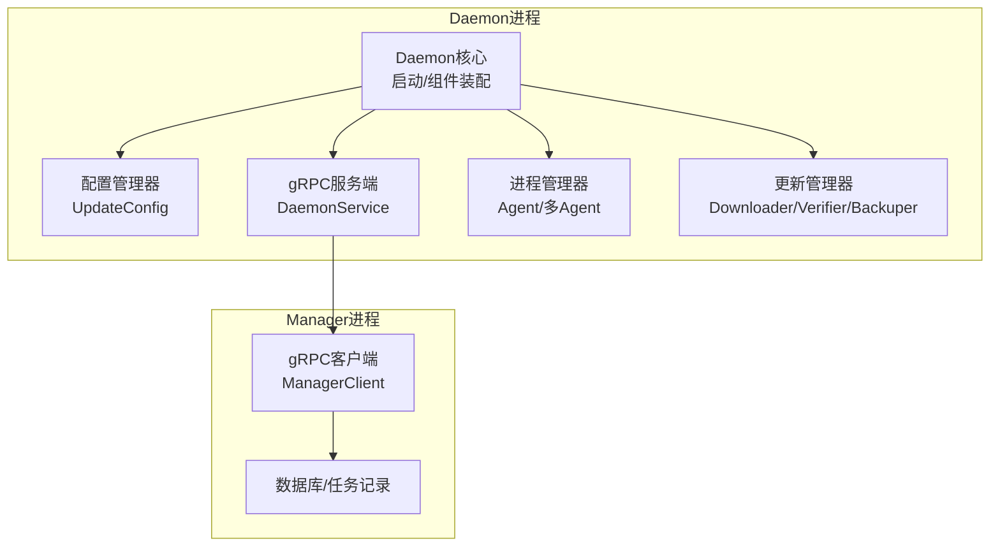
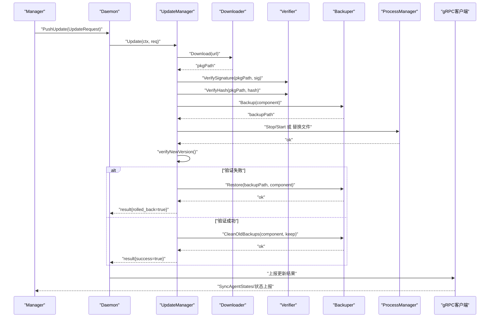
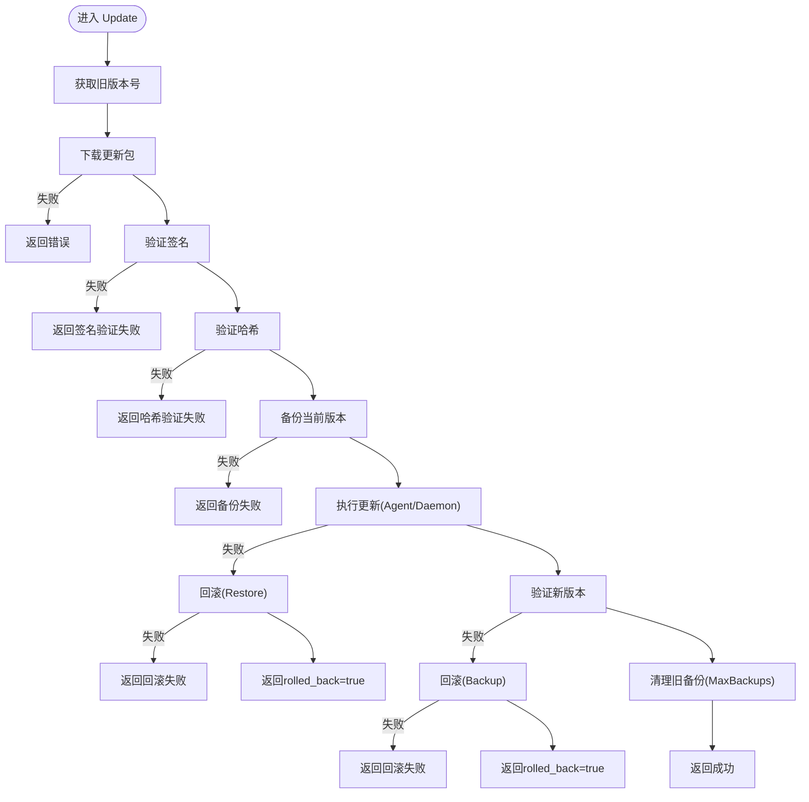
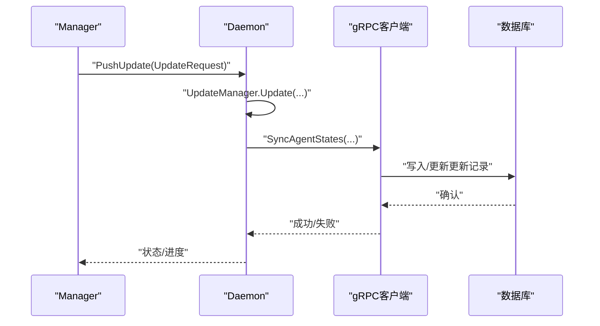
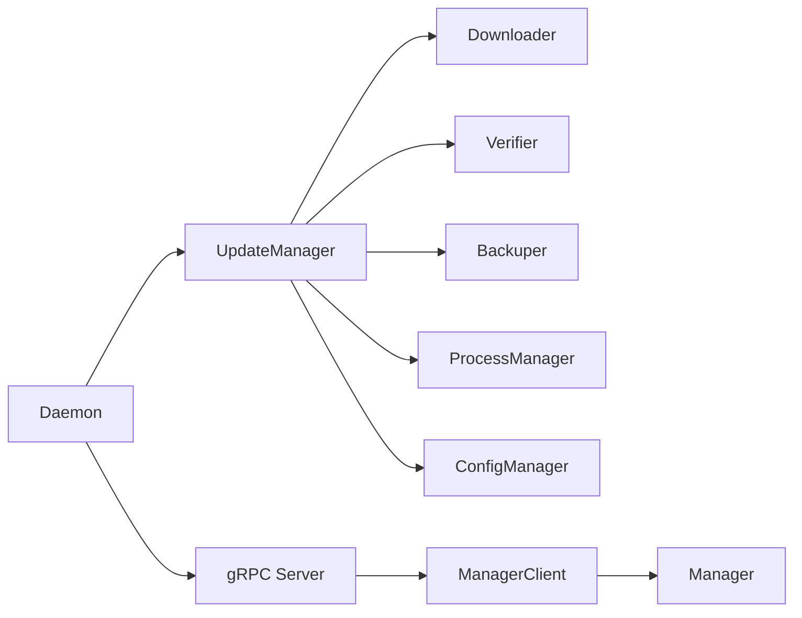

# 版本更新模块

<cite>
**本文引用的文件**
- [daemon.go](file://daemon/internal/daemon/daemon.go)
- [config.go](file://daemon/internal/config/config.go)
- [main.go](file://daemon/cmd/daemon/main.go)
- [daemon.pb.go](file://daemon/pkg/proto/daemon.pb.go)
- [server.go](file://daemon/internal/grpc/server.go)
- [manager_client.go](file://daemon/internal/grpc/manager_client.go)
- [manager.go](file://daemon/internal/agent/manager.go)
- [multi_manager.go](file://daemon/internal/agent/multi_manager.go)
- [设计文档_01_Daemon模块.md](file://docs/设计文档_01_Daemon模块.md)
- [设计文档_03_Manager模块.md](file://docs/设计文档_03_Manager模块.md)
</cite>

## 目录
1. [简介](#简介)
2. [项目结构](#项目结构)
3. [核心组件](#核心组件)
4. [架构总览](#架构总览)
5. [详细组件分析](#详细组件分析)
6. [依赖关系分析](#依赖关系分析)
7. [性能考量](#性能考量)
8. [故障排查指南](#故障排查指南)
9. [结论](#结论)

## 简介
本章节聚焦Daemon的“版本更新模块”，明确其职责：对Agent与Daemon自身执行安全更新。更新流程覆盖下载更新包、签名与哈希验证、备份当前版本、执行更新、新版本验证、失败回滚与旧备份清理。文档还说明如何通过配置管理器加载更新策略，以及Downloader、Verifier、Backuper等组件如何协同工作，确保更新过程的可靠性与安全性。

## 项目结构
- 更新模块位于Daemon侧，围绕“更新管理器”组织，依赖配置管理器提供的更新策略与路径，协调进程管理器完成Agent/Daemon的更新。
- 与Manager交互通过gRPC通道，Manager下发更新请求，Daemon执行并上报结果。

图表来源
- [daemon.go](file://daemon/internal/daemon/daemon.go#L1-L120)
- [config.go](file://daemon/internal/config/config.go#L128-L135)
- [server.go](file://daemon/internal/grpc/server.go#L1-L40)
- [manager_client.go](file://daemon/internal/grpc/manager_client.go#L1-L40)
- [multi_manager.go](file://daemon/internal/agent/multi_manager.go#L1-L40)
- [manager.go](file://daemon/internal/agent/manager.go#L1-L40)

章节来源
- [daemon.go](file://daemon/internal/daemon/daemon.go#L1-L120)
- [config.go](file://daemon/internal/config/config.go#L128-L135)

## 核心组件
- 更新管理器（UpdateManager）
  - 职责：编排更新流程，协调Downloader、Verifier、Backuper、进程管理器。
  - 关键字段：配置、下载器、验证器、备份器、进程管理器。
- 下载器（Downloader）
  - 职责：根据URL下载更新包至本地临时路径。
- 验证器（Verifier）
  - 职责：基于公钥验证签名；基于哈希计算与期望值比对。
- 备份器（Backuper）
  - 职责：备份当前版本文件；在失败或验证失败时回滚；清理旧备份。
- 进程管理器（ProcessManager）
  - 职责：停止/启动Agent进程；替换二进制文件；支持优雅/强制停止。
- 配置管理器（ConfigManager）
  - 职责：加载/合并/校验配置；提供更新策略（下载目录、备份目录、最大备份数、验证超时、公钥文件）。

章节来源
- [设计文档_01_Daemon模块.md](file://docs/设计文档_01_Daemon模块.md#L693-L730)
- [design_document_updater](file://docs/设计文档_01_Daemon模块.md#L693-L960)
- [config.go](file://daemon/internal/config/config.go#L128-L135)

## 架构总览
更新模块在Daemon内部通过“更新管理器”串联各组件，并通过gRPC与Manager交互。Manager负责下发更新请求，Daemon执行并上报结果。

图表来源
- [design_document_updater](file://docs/设计文档_01_Daemon模块.md#L693-L960)
- [manager_client.go](file://daemon/internal/grpc/manager_client.go#L102-L155)
- [server.go](file://daemon/internal/grpc/server.go#L172-L211)

章节来源
- [design_document_updater](file://docs/设计文档_01_Daemon模块.md#L693-L960)
- [manager_client.go](file://daemon/internal/grpc/manager_client.go#L102-L155)
- [server.go](file://daemon/internal/grpc/server.go#L172-L211)

## 详细组件分析

### 更新管理器（UpdateManager）
- 结构与职责
  - 字段：配置、下载器、验证器、备份器、进程管理器。
  - 方法：Update、doUpdate、updateAgent、updateDaemon、verifyNewVersion、getCurrentVersion。
- 更新流程
  - 下载更新包并defer清理临时包。
  - 验证签名与哈希。
  - 备份当前版本。
  - 执行更新（Agent或Daemon）。
  - 验证新版本；失败则回滚；成功则清理旧备份。
- 错误处理
  - 任一步骤失败均记录错误；若回滚成功，返回rolled_back=true；否则返回回滚失败信息。

图表来源
- [design_document_updater](file://docs/设计文档_01_Daemon模块.md#L693-L960)

章节来源
- [design_document_updater](file://docs/设计文档_01_Daemon模块.md#L693-L960)

### 下载器（Downloader）
- 职责：根据请求中的URL下载更新包到本地临时路径，返回pkgPath供后续验证与安装。
- 与更新管理器协作：在Update中调用Download，成功后立即defer删除临时包，避免磁盘占用。

章节来源
- [design_document_updater](file://docs/设计文档_01_Daemon模块.md#L693-L730)

### 验证器（Verifier）
- 签名验证：使用预置公钥对文件内容进行签名验证（覆盖完整文件内容）。
- 哈希验证：计算SHA-256并与请求中的期望值比对。
- 超时控制：验证超时由配置提供，保障长时间IO场景下的健壮性。

章节来源
- [design_document_updater](file://docs/设计文档_01_Daemon模块.md#L865-L915)
- [config.go](file://daemon/internal/config/config.go#L128-L135)

### 备份器（Backuper）
- 备份：按组件类型生成带时间戳的.bak文件，复制当前二进制到备份目录。
- 回滚：将备份文件复制回原位置，恢复旧版本。
- 清理：按keep数量保留最新备份，删除旧备份。

章节来源
- [design_document_updater](file://docs/设计文档_01_Daemon模块.md#L917-L960)

### 进程管理器（ProcessManager）
- 对Agent：支持优雅/强制停止、启动；在替换文件后启动新版本。
- 对Daemon：更新Daemon自身时，需结合进程管理器与系统服务机制（如systemd）实现平滑切换，具体实现需与系统集成。

章节来源
- [manager.go](file://daemon/internal/agent/manager.go#L36-L175)
- [multi_manager.go](file://daemon/internal/agent/multi_manager.go#L135-L197)

### 配置管理器（ConfigManager）
- 提供更新策略：下载目录、备份目录、最大备份数、验证超时、公钥文件路径。
- 与Daemon启动流程集成：在New中创建并注入到更新管理器。

章节来源
- [config.go](file://daemon/internal/config/config.go#L128-L135)
- [daemon.go](file://daemon/internal/daemon/daemon.go#L1-L120)

### 与Manager的交互
- 请求模型：UpdateRequest（包含节点ID、组件、版本、下载URL、哈希、签名）。
- 上报模型：Daemon通过gRPC客户端上报状态与结果，Manager侧维护更新记录表。

图表来源
- [daemon.pb.go](file://daemon/pkg/proto/daemon.pb.go#L495-L519)
- [manager_client.go](file://daemon/internal/grpc/manager_client.go#L102-L155)
- [设计文档_03_Manager模块.md](file://docs/设计文档_03_Manager模块.md#L263-L290)

章节来源
- [daemon.pb.go](file://daemon/pkg/proto/daemon.pb.go#L495-L519)
- [manager_client.go](file://daemon/internal/grpc/manager_client.go#L102-L155)
- [设计文档_03_Manager模块.md](file://docs/设计文档_03_Manager模块.md#L263-L290)

## 依赖关系分析
- 组件耦合
  - UpdateManager对Downloader、Verifier、Backuper、ProcessManager存在直接依赖。
  - 配置管理器提供更新策略，贯穿整个更新生命周期。
  - gRPC客户端用于与Manager通信，Manager侧维护更新记录。
- 外部依赖
  - TLS证书与CA配置用于gRPC安全通信。
  - 公钥文件用于签名验证。
- 潜在风险
  - 回滚失败会导致系统不可用，应确保备份路径与权限正确。
  - 验证超时过短可能导致网络波动下的误判，需结合实际网络环境调整。

图表来源
- [design_document_updater](file://docs/设计文档_01_Daemon模块.md#L693-L730)
- [config.go](file://daemon/internal/config/config.go#L128-L135)
- [server.go](file://daemon/internal/grpc/server.go#L1-L40)
- [manager_client.go](file://daemon/internal/grpc/manager_client.go#L1-L40)

章节来源
- [design_document_updater](file://docs/设计文档_01_Daemon模块.md#L693-L730)
- [config.go](file://daemon/internal/config/config.go#L128-L135)
- [server.go](file://daemon/internal/grpc/server.go#L1-L40)
- [manager_client.go](file://daemon/internal/grpc/manager_client.go#L1-L40)

## 性能考量
- 下载阶段
  - 使用流式下载与分块校验，避免一次性加载大文件导致内存峰值过高。
- 验证阶段
  - 哈希计算采用流式读取，避免重复读取；签名验证使用预置公钥缓存。
- 备份与替换
  - 备份采用文件复制，建议在高IO负载时选择空闲时段执行。
- 回滚
  - 回滚路径与原路径在同一文件系统时，可考虑硬链接减少IO；跨设备需谨慎评估。
- 并发与超时
  - 验证超时与下载超时应结合网络质量与磁盘性能设置，避免阻塞主流程。

## 故障排查指南
- 下载失败
  - 检查URL可达性与网络策略；确认下载目录权限与磁盘空间。
- 签名验证失败
  - 核对公钥文件路径与内容；确认签名算法与哈希算法一致。
- 哈希不匹配
  - 核对请求中的哈希值来源；确认下载完整性。
- 备份失败
  - 检查备份目录权限与磁盘空间；确认备份路径与原路径在同一文件系统。
- 回滚失败
  - 检查备份文件是否完整；确认替换目标路径权限；必要时手动恢复。
- 验证新版本失败
  - 检查新版本二进制可执行性；确认进程管理器启动参数与工作目录。
- 与Manager通信失败
  - 检查TLS证书与CA配置；确认gRPC地址与端口；查看Manager侧日志。

章节来源
- [design_document_updater](file://docs/设计文档_01_Daemon模块.md#L693-L960)
- [manager_client.go](file://daemon/internal/grpc/manager_client.go#L40-L92)

## 结论
版本更新模块通过“下载—验证—备份—执行—验证—回滚—清理”的闭环流程，确保Agent与Daemon的安全更新。配置管理器提供策略与路径，各组件职责清晰、边界明确。结合Manager的gRPC交互与数据库记录，形成可追踪、可回滚、可审计的更新体系。建议在生产环境中严格校验公钥与哈希，合理设置验证超时与备份保留策略，并完善监控与告警，以提升整体可靠性与可观测性。