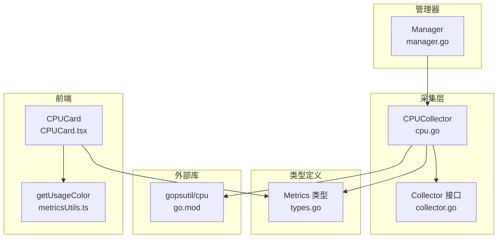
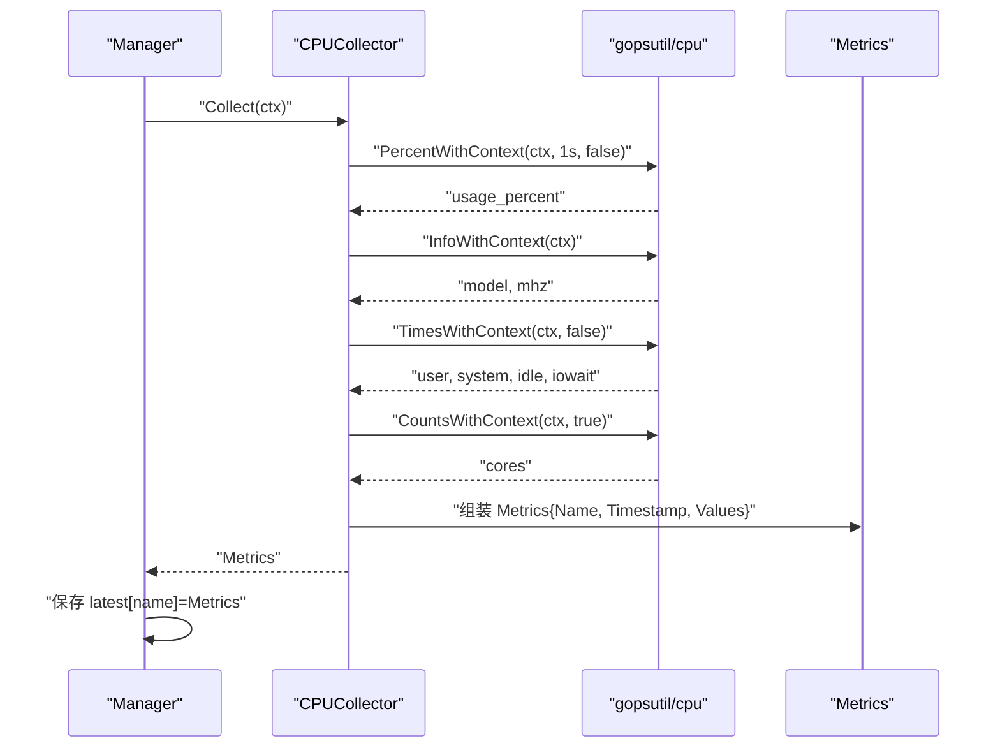
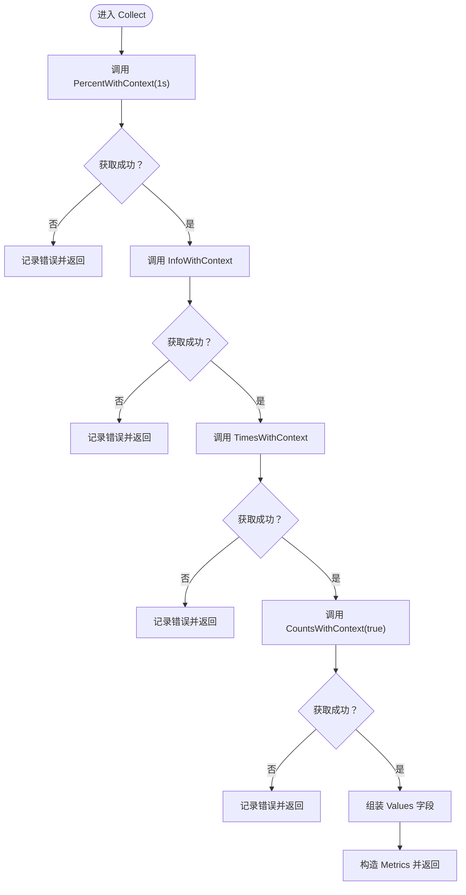
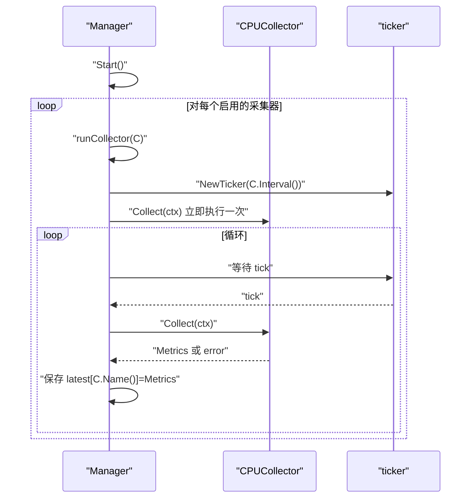
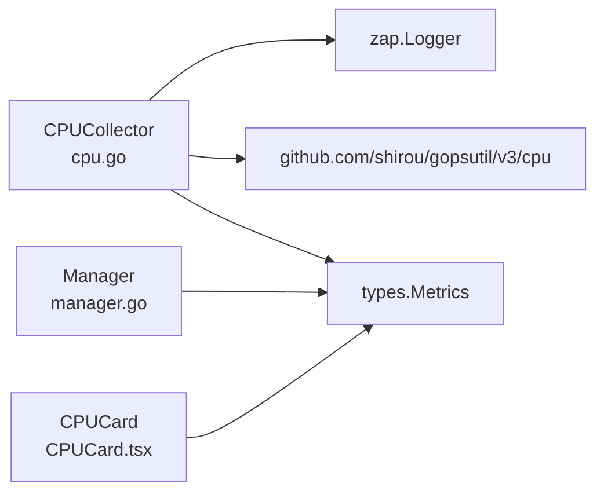

# CPU 采集器

<cite>
**本文引用的文件列表**
- [cpu.go](file://daemon/internal/collector/cpu.go)
- [cpu_test.go](file://daemon/internal/collector/cpu_test.go)
- [manager.go](file://daemon/internal/collector/manager.go)
- [collector.go](file://daemon/internal/collector/collector.go)
- [types.go](file://daemon/pkg/types/types.go)
- [go.mod](file://daemon/go.mod)
- [CPUCard.tsx](file://web/src/components/Metrics/CPUCard.tsx)
- [metricsUtils.ts](file://web/src/utils/metricsUtils.ts)
</cite>

## 目录
1. [简介](#简介)
2. [项目结构](#项目结构)
3. [核心组件](#核心组件)
4. [架构总览](#架构总览)
5. [详细组件分析](#详细组件分析)
6. [依赖关系分析](#依赖关系分析)
7. [性能考量](#性能考量)
8. [故障排查指南](#故障排查指南)
9. [结论](#结论)
10. [附录](#附录)

## 简介
本文件为 CPU 采集器的技术文档，聚焦于 CPUCollector 的实现机制与数据采集流程。内容覆盖以下方面：
- 如何通过 gopsutil 获取 CPU 使用率、用户态/内核态时间、空闲时间等指标
- Collect 方法的数据采集流程与关键计算逻辑
- 测试用例对 CPU 使用率范围、核心数、模型信息等的验证方法
- 性能影响评估、采集频率配置建议
- 常见问题排查（指标波动、精度误差）

## 项目结构
CPU 采集器位于 daemon 模块内部，采用统一的 Collector 接口抽象与 Manager 管理器驱动的定时采集模式。前端通过 CPUCard 组件消费 CPU 指标。



图表来源
- [cpu.go](file://daemon/internal/collector/cpu.go#L1-L106)
- [collector.go](file://daemon/internal/collector/collector.go#L1-L23)
- [manager.go](file://daemon/internal/collector/manager.go#L1-L124)
- [types.go](file://daemon/pkg/types/types.go#L1-L111)
- [go.mod](file://daemon/go.mod#L1-L46)
- [CPUCard.tsx](file://web/src/components/Metrics/CPUCard.tsx#L1-L75)
- [metricsUtils.ts](file://web/src/utils/metricsUtils.ts#L1-L33)

章节来源
- [cpu.go](file://daemon/internal/collector/cpu.go#L1-L106)
- [manager.go](file://daemon/internal/collector/manager.go#L1-L124)
- [collector.go](file://daemon/internal/collector/collector.go#L1-L23)
- [types.go](file://daemon/pkg/types/types.go#L1-L111)
- [go.mod](file://daemon/go.mod#L1-L46)
- [CPUCard.tsx](file://web/src/components/Metrics/CPUCard.tsx#L1-L75)
- [metricsUtils.ts](file://web/src/utils/metricsUtils.ts#L1-L33)

## 核心组件
- CPUCollector：实现 Collector 接口，负责采集 CPU 使用率、CPU 时间统计、CPU 数量与 CPU 型号等指标，并封装为 Metrics 结构。
- Manager：统一调度各采集器，按各自 Interval 定时触发 Collect，保存最新指标到内存映射。
- Collector 接口：定义 Name、Collect、Interval、Enabled 四个方法，保证采集器行为一致。
- Metrics 类型：通用指标载体，包含指标名、时间戳与键值对形式的指标值。

章节来源
- [cpu.go](file://daemon/internal/collector/cpu.go#L1-L106)
- [manager.go](file://daemon/internal/collector/manager.go#L1-L124)
- [collector.go](file://daemon/internal/collector/collector.go#L1-L23)
- [types.go](file://daemon/pkg/types/types.go#L1-L111)

## 架构总览
CPUCollector 通过 gopsutil/cpu 提供的系统级 API 获取 CPU 指标；Manager 以 ticker 驱动周期性采集；最终指标以 Metrics 形式在内存中缓存，供上层消费。



图表来源
- [manager.go](file://daemon/internal/collector/manager.go#L83-L104)
- [cpu.go](file://daemon/internal/collector/cpu.go#L43-L105)
- [types.go](file://daemon/pkg/types/types.go#L18-L23)

## 详细组件分析

### CPUCollector 实现机制
- 名称与开关：Name 返回固定字符串“cpu”，Enabled/Interval 分别返回启用状态与采集间隔。
- 数据采集：
  - 使用 PercentWithContext 以 1 秒采样窗口计算整体 CPU 使用率。
  - 使用 InfoWithContext 获取 CPU 型号与频率。
  - 使用 TimesWithContext 获取用户态、内核态、空闲、IO 等累计时间。
  - 使用 CountsWithContext 获取物理核心数。
- 指标封装：将 usage_percent、cores、model、mhz、user、system、idle、iowait 写入 Values，构造 Metrics 并返回。



图表来源
- [cpu.go](file://daemon/internal/collector/cpu.go#L43-L105)

章节来源
- [cpu.go](file://daemon/internal/collector/cpu.go#L1-L106)

### Manager 采集调度
- Start：遍历已注册采集器，若启用则启动独立 goroutine，使用 ticker 按 Interval 触发采集。
- collect：调用采集器 Collect，捕获错误并记录日志，成功后写入 latest 映射。
- GetLatest/GetLatestByName：提供并发安全的最新指标读取。



图表来源
- [manager.go](file://daemon/internal/collector/manager.go#L35-L104)

章节来源
- [manager.go](file://daemon/internal/collector/manager.go#L1-L124)

### 指标数据结构与前端消费
- Metrics：包含 name、timestamp、values 三要素，values 为 map[string]interface{}，便于扩展。
- 前端 CPUCard：从 useLatestMetrics 获取最新指标，提取 usage_percent、cores、model 等字段，使用 getUsageColor 计算颜色。

```mermaid
classDiagram
class Metrics {
+string Name
+time.Time Timestamp
+map~string,interface{}~ Values
}
class CPUCollector {
+Name() string
+Interval() time.Duration
+Enabled() bool
+Collect(ctx) *Metrics
}
class Manager {
+Start()
+Stop()
+GetLatest() map[string]*Metrics
+GetLatestByName(name) *Metrics
}
CPUCollector --> Metrics : "返回"
Manager --> CPUCollector : "调度"
```

图表来源
- [types.go](file://daemon/pkg/types/types.go#L18-L23)
- [cpu.go](file://daemon/internal/collector/cpu.go#L28-L42)
- [manager.go](file://daemon/internal/collector/manager.go#L1-L124)

章节来源
- [types.go](file://daemon/pkg/types/types.go#L1-L111)
- [CPUCard.tsx](file://web/src/components/Metrics/CPUCard.tsx#L1-L75)
- [metricsUtils.ts](file://web/src/utils/metricsUtils.ts#L1-L33)

### 关键计算逻辑与数据流
- CPU 使用率计算：CPUCollector 通过 PercentWithContext 在 1 秒采样窗口内计算整体 CPU 使用率，作为 usage_percent 指标。
- CPU 时间统计：TimesWithContext 返回用户态、内核态、空闲、IO 等累计时间，可用于进一步派生指标（例如用户态占比、内核态占比等）。
- CPU 核心数：CountsWithContext(true) 返回物理核心数，用于资源对比与容量规划。
- CPU 型号与频率：InfoWithContext 返回 ModelName 与 Mhz，便于识别硬件差异。

章节来源
- [cpu.go](file://daemon/internal/collector/cpu.go#L43-L105)

### 测试用例与验证方法
- 单元测试覆盖：
  - 名称与开关：验证 Name 返回“cpu”、Enabled 行为。
  - 采集间隔：验证 Interval 返回期望值。
  - 采集流程：验证 Collect 返回非空 Metrics，包含 name、timestamp、values。
  - 必需字段：usage_percent、cores 必须存在。
  - 范围校验：usage_percent 范围应在 0-100。
  - 多次采集：连续多次 Collect 成功且时间戳递增。
  - 禁用采集器：即使禁用仍可手动采集。
- 前端验证：CPUCard 从最新指标中读取 usage_percent、cores、model，并根据 getUsageColor 设置颜色。

章节来源
- [cpu_test.go](file://daemon/internal/collector/cpu_test.go#L1-L143)
- [CPUCard.tsx](file://web/src/components/Metrics/CPUCard.tsx#L1-L75)
- [metricsUtils.ts](file://web/src/utils/metricsUtils.ts#L1-L33)

## 依赖关系分析
- 外部库 gopsutil/cpu：提供 CPU 使用率、CPU 信息、CPU 时间统计、CPU 核心数等系统级 API。
- 日志库 zap：用于采集过程中的错误记录。
- 类型定义 types.Metrics：统一指标载体，贯穿采集、管理与前端消费。



图表来源
- [cpu.go](file://daemon/internal/collector/cpu.go#L1-L106)
- [manager.go](file://daemon/internal/collector/manager.go#L1-L124)
- [types.go](file://daemon/pkg/types/types.go#L1-L111)
- [go.mod](file://daemon/go.mod#L1-L46)

章节来源
- [go.mod](file://daemon/go.mod#L1-L46)

## 性能考量
- 采集开销
  - gopsutil/cpu 通过系统接口读取 CPU 指标，通常开销较小，但频繁短周期采集仍会带来额外系统调用与上下文切换成本。
  - PercentWithContext 以 1 秒为采样窗口，避免过短周期导致的测量抖动与系统压力。
- 采集频率建议
  - 基于测试与实际观测，建议默认采集间隔为 1-5 秒，兼顾精度与开销平衡。
  - 对于高并发或资源紧张环境，可适当增大间隔至 5-10 秒。
- 并发与锁
  - Manager 在保存最新指标时使用互斥锁保护，GetLatest/GetLatestByName 提供读锁，避免数据竞争。
- 前端渲染
  - CPUCard 使用 useMemo 缓存计算结果，减少不必要的重渲染。

章节来源
- [manager.go](file://daemon/internal/collector/manager.go#L83-L104)
- [CPUCard.tsx](file://web/src/components/Metrics/CPUCard.tsx#L1-L75)

## 故障排查指南
- 采集失败
  - 现象：Collect 返回错误，Manager 记录“failed to collect metrics”。
  - 排查：检查 gopsutil/cpu 是否可用、权限是否足够、系统是否支持对应接口。
- 指标为空或缺失
  - 现象：usage_percent、cores、model、times 等字段缺失。
  - 排查：确认对应 gopsutil 调用返回非空；检查平台兼容性与容器隔离限制。
- 指标范围异常
  - 现象：usage_percent 超出 0-100。
  - 排查：确认 PercentWithContext 采样窗口设置为 1 秒；避免在极短时间内重复采集导致的瞬时异常。
- 指标波动较大
  - 现象：usage_percent 波动明显。
  - 排查：增大采集间隔；结合 user/system/idle/iowait 等累计时间进行趋势分析；避免在同一时刻进行其他高负载操作。
- 前端显示异常
  - 现象：CPU 使用率不显示或颜色不正确。
  - 排查：确认最新指标中存在 usage_percent、cores、model；检查 getUsageColor 的阈值逻辑与主题配置。

章节来源
- [cpu.go](file://daemon/internal/collector/cpu.go#L43-L105)
- [manager.go](file://daemon/internal/collector/manager.go#L83-L104)
- [CPUCard.tsx](file://web/src/components/Metrics/CPUCard.tsx#L1-L75)
- [metricsUtils.ts](file://web/src/utils/metricsUtils.ts#L1-L33)

## 结论
CPUCollector 通过 gopsutil/cpu 提供的系统级 API，实现了对 CPU 使用率、CPU 时间统计、核心数与型号等关键指标的稳定采集。配合 Manager 的定时调度与并发安全的最新指标缓存，能够满足大多数运维监控场景的需求。测试用例覆盖了关键路径与边界条件，前端组件则直观呈现 CPU 使用情况。在实际部署中，建议根据业务负载与资源状况合理配置采集频率，并关注指标波动与精度误差问题。

## 附录
- 采集指标清单
  - usage_percent：整体 CPU 使用率
  - cores：物理核心数
  - model：CPU 型号
  - mhz：CPU 频率
  - user：用户态累计时间
  - system：内核态累计时间
  - idle：空闲累计时间
  - iowait：IO 等待累计时间

章节来源
- [cpu.go](file://daemon/internal/collector/cpu.go#L73-L105)
- [types.go](file://daemon/pkg/types/types.go#L18-L23)