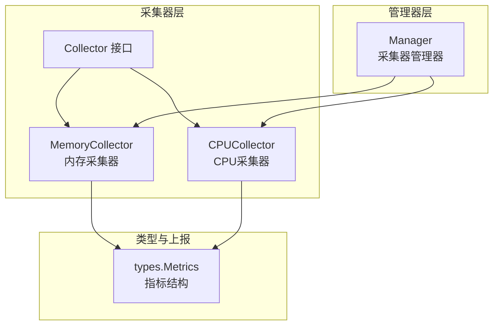
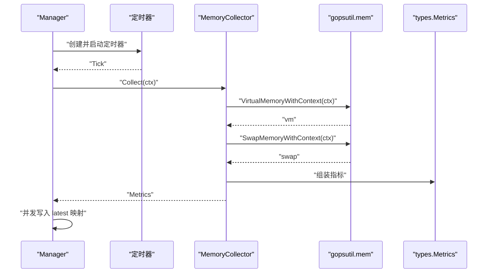
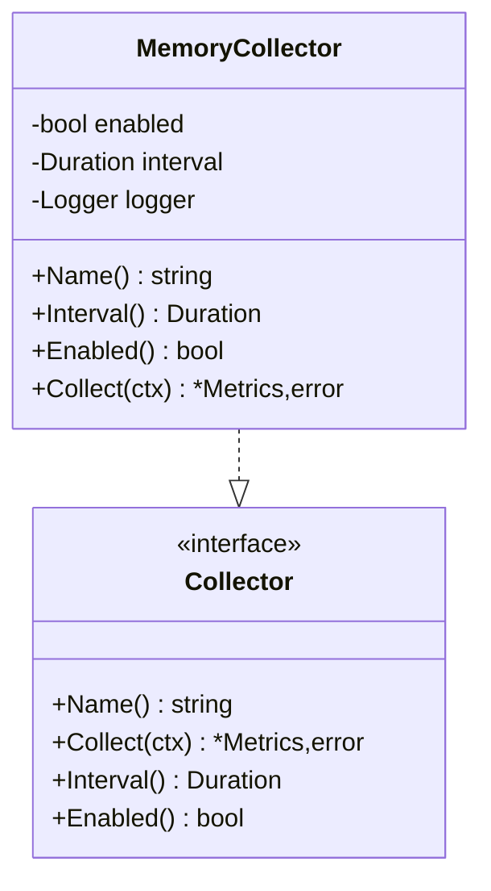
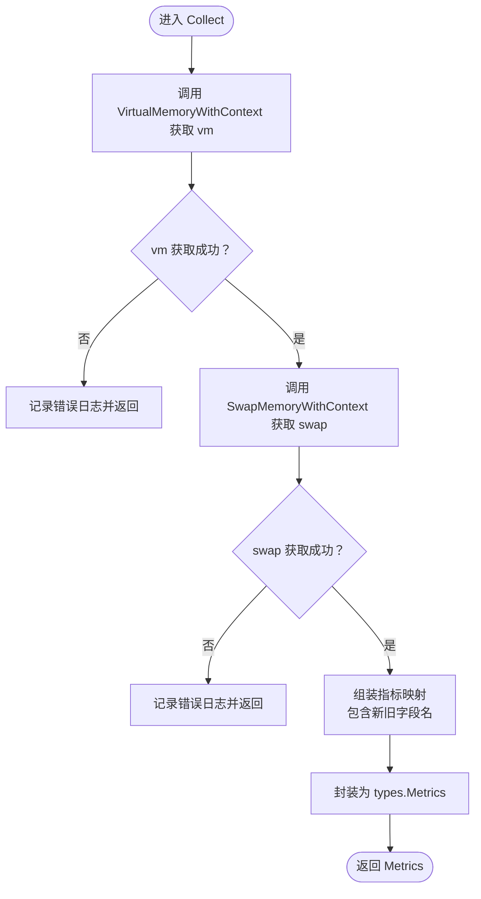
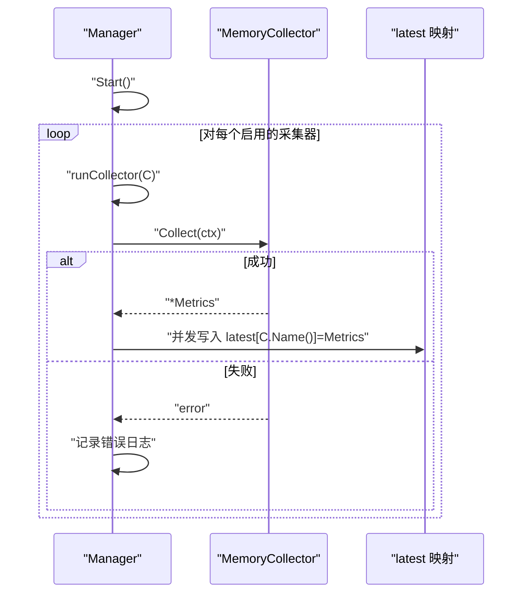
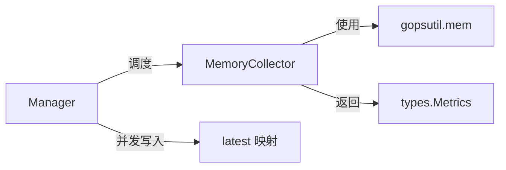

# 内存采集器

<cite>
**本文引用的文件**
- [memory.go](file://daemon/internal/collector/memory.go)
- [memory_test.go](file://daemon/internal/collector/memory_test.go)
- [manager.go](file://daemon/internal/collector/manager.go)
- [collector.go](file://daemon/internal/collector/collector.go)
- [types.go](file://daemon/pkg/types/types.go)
- [cpu.go](file://daemon/internal/collector/cpu.go)
- [metricsUtils.ts](file://web/src/utils/metricsUtils.ts)
- [format.ts](file://web/src/utils/format.ts)
</cite>

## 目录
1. [简介](#简介)
2. [项目结构](#项目结构)
3. [核心组件](#核心组件)
4. [架构总览](#架构总览)
5. [详细组件分析](#详细组件分析)
6. [依赖分析](#依赖分析)
7. [性能考虑](#性能考虑)
8. [故障排查指南](#故障排查指南)
9. [结论](#结论)
10. [附录](#附录)

## 简介
本文件面向运维与平台开发人员，系统化阐述内存采集器的设计与实现细节，重点覆盖以下方面：
- 如何通过 gopsutil 获取系统内存与交换分区指标，以及字段语义
- Collect 方法中的指标组装与命名规范
- 单位与量纲：字节到 MB/GB 的换算在前端侧进行
- 测试策略：字段存在性、数值范围、一致性校验
- 性能与稳定性建议：高频采集、并发安全、资源开销
- 与其他监控工具的数据差异与注意事项

## 项目结构
内存采集器位于 Daemon 模块的采集器子系统中，采用统一的 Collector 接口抽象与 Manager 管理器调度模式，形成“按需启用、定时采集、并发安全存储”的闭环。

图表来源
- [collector.go](file://daemon/internal/collector/collector.go#L1-L24)
- [memory.go](file://daemon/internal/collector/memory.go#L1-L89)
- [cpu.go](file://daemon/internal/collector/cpu.go#L1-L106)
- [manager.go](file://daemon/internal/collector/manager.go#L1-L124)
- [types.go](file://daemon/pkg/types/types.go#L1-L111)

章节来源
- [memory.go](file://daemon/internal/collector/memory.go#L1-L89)
- [manager.go](file://daemon/internal/collector/manager.go#L1-L124)
- [collector.go](file://daemon/internal/collector/collector.go#L1-L24)
- [types.go](file://daemon/pkg/types/types.go#L1-L111)

## 核心组件
- Collector 接口：定义采集器的统一能力（名称、采集、间隔、启用状态）。
- MemoryCollector：基于 gopsutil 实现内存与交换分区指标采集。
- Manager：统一启动/停止采集器，定时触发采集，保存最新指标。
- types.Metrics：通用指标数据结构，包含采集器名称、时间戳与键值对。

章节来源
- [collector.go](file://daemon/internal/collector/collector.go#L1-L24)
- [memory.go](file://daemon/internal/collector/memory.go#L1-L89)
- [manager.go](file://daemon/internal/collector/manager.go#L1-L124)
- [types.go](file://daemon/pkg/types/types.go#L1-L111)

## 架构总览
内存采集器通过 gopsutil 的上下文感知 API 获取系统内存与交换分区信息，随后以统一的指标结构返回。Manager 使用定时器周期性触发采集，保证并发安全地更新最新指标映射。

图表来源
- [manager.go](file://daemon/internal/collector/manager.go#L63-L104)
- [memory.go](file://daemon/internal/collector/memory.go#L43-L88)
- [types.go](file://daemon/pkg/types/types.go#L18-L23)

## 详细组件分析

### MemoryCollector 组件
- 职责：从系统获取内存与交换分区指标，组装为统一的指标结构。
- 关键点：
  - 使用 gopsutil 的上下文感知 API，支持取消与超时控制。
  - 指标字段命名遵循统一规范，同时保留兼容旧字段名。
  - 错误路径记录日志并返回错误，便于上层处理。

图表来源
- [memory.go](file://daemon/internal/collector/memory.go#L12-L88)
- [collector.go](file://daemon/internal/collector/collector.go#L10-L23)

章节来源
- [memory.go](file://daemon/internal/collector/memory.go#L12-L88)

### Collect 方法流程与指标组装
- 数据来源：
  - 虚拟内存：Total、Used、Free、Available、UsedPercent、Cached、Buffers。
  - 交换分区：Total、Used、Free、UsedPercent。
- 指标命名：
  - 新命名：total_bytes、used_bytes、free_bytes、available_bytes、usage_percent、cached、buffers、swap_total、swap_used、swap_free、swap_percent。
  - 兼容旧命名：total、available、used、free。
- 时间戳：采集完成时填充当前时间。
- 返回：types.Metrics 结构体。

图表来源
- [memory.go](file://daemon/internal/collector/memory.go#L43-L88)
- [types.go](file://daemon/pkg/types/types.go#L18-L23)

章节来源
- [memory.go](file://daemon/internal/collector/memory.go#L43-L88)
- [types.go](file://daemon/pkg/types/types.go#L18-L23)

### Manager 与并发采集
- 启动：遍历已启用的采集器，为每个采集器启动独立 goroutine，使用定时器周期触发。
- 停止：取消上下文，等待所有 goroutine 完成。
- 采集：调用采集器 Collect，捕获错误并记录日志；成功则并发写入 latest 映射。
- 读取：提供并发安全的 GetLatest 与 GetLatestByName。

图表来源
- [manager.go](file://daemon/internal/collector/manager.go#L35-L104)

章节来源
- [manager.go](file://daemon/internal/collector/manager.go#L35-L104)

### 单元测试与验证策略
- 基础能力：名称、启用状态、采集间隔正确性。
- 采集结果：指标名称、时间戳、字段集合完整性。
- 数值范围：used_percent、swap_percent 在 0-100 区间。
- 数值一致性：total、used、available 的非负与上限约束。
- 多次采集：短周期内多次采集均成功。

章节来源
- [memory_test.go](file://daemon/internal/collector/memory_test.go#L1-L179)

## 依赖分析
- 外部依赖：gopsutil/v3/mem 提供跨平台内存与交换分区信息。
- 内部依赖：types.Metrics 作为统一指标载体；Collector 接口定义采集器契约；Manager 统一调度。
- 并发模型：Manager 使用互斥锁保护 latest 映射，读多写少场景下 RWMutex 提升并发读性能。

图表来源
- [memory.go](file://daemon/internal/collector/memory.go#L43-L88)
- [manager.go](file://daemon/internal/collector/manager.go#L83-L104)
- [types.go](file://daemon/pkg/types/types.go#L18-L23)

章节来源
- [memory.go](file://daemon/internal/collector/memory.go#L43-L88)
- [manager.go](file://daemon/internal/collector/manager.go#L83-L104)
- [types.go](file://daemon/pkg/types/types.go#L18-L23)

## 性能考虑
- 采集频率与开销
  - gopsutil 的内存采集为轻量级系统调用，但频繁高频率采集仍会带来上下文切换与日志开销。建议默认采集间隔不低于 1 秒，业务需要可调整至 5-10 秒。
  - 若监控目标为容器或资源受限环境，建议进一步降低频率，避免抖动放大。
- 并发与锁竞争
  - Manager 的并发写入使用互斥锁保护 latest 映射，读多写少场景下 RWMutex 已足够；若读取非常频繁，可考虑引入更细粒度的锁或只读快照。
- 上报与序列化
  - 指标结构为 map[string]interface{}，序列化成本低；若后续指标规模扩大，可考虑预分配 map 或结构化序列化以减少 GC 压力。
- 单位换算
  - 采集侧返回字节（bytes），前端统一进行 MB/GB 格式化显示，避免重复计算与精度损失。

章节来源
- [manager.go](file://daemon/internal/collector/manager.go#L83-L104)
- [metricsUtils.ts](file://web/src/utils/metricsUtils.ts#L63-L75)
- [format.ts](file://web/src/utils/format.ts#L29-L42)

## 故障排查指南
- 采集失败
  - 现象：Collect 返回错误，Manager 记录错误日志。
  - 排查：确认 gopsutil 可用、系统权限充足、上下文未提前取消。
- 字段缺失
  - 现象：测试断言字段不存在。
  - 排查：确认 Collect 是否成功返回；检查字段命名是否使用新旧兼容名。
- 数值异常
  - 现象：used_percent 或 swap_percent 超出 0-100。
  - 排查：检查系统返回值是否异常；确认未被外部工具篡改。
- 一致性问题
  - 现象：total 小于 used 或 available。
  - 排查：系统内存统计存在内核层面的动态变化，建议放宽阈值或增加窗口期重试。
- 并发读写
  - 现象：读取最新指标时出现竞态。
  - 排查：确认使用 Manager 的并发安全读取接口；避免直接共享内部映射。

章节来源
- [memory_test.go](file://daemon/internal/collector/memory_test.go#L51-L179)
- [manager.go](file://daemon/internal/collector/manager.go#L83-L104)

## 结论
内存采集器以 gopsutil 为核心，结合统一的 Collector 抽象与 Manager 调度，实现了稳定、可扩展的内存指标采集。通过严格的字段命名规范与测试策略，保障了指标的完整性与一致性。在高频采集场景下，建议合理设置采集间隔与并发策略，前端负责单位换算与可视化，从而获得更优的性能与用户体验。

## 附录

### 字段语义与单位
- 字节（bytes）
  - total_bytes、used_bytes、free_bytes、available_bytes、cached、buffers、swap_total、swap_used、swap_free
- 百分比（%）
  - usage_percent、swap_percent
- 兼容旧字段名
  - total、available、used、free

章节来源
- [memory.go](file://daemon/internal/collector/memory.go#L60-L79)

### 单位换算（前端侧）
- MB：字节数除以 1024^2
- GB：字节数除以 1024^3
- 前端格式化工具提供通用字节到 MB/GB 的转换函数，建议在展示层统一使用。

章节来源
- [metricsUtils.ts](file://web/src/utils/metricsUtils.ts#L63-L75)
- [format.ts](file://web/src/utils/format.ts#L29-L42)