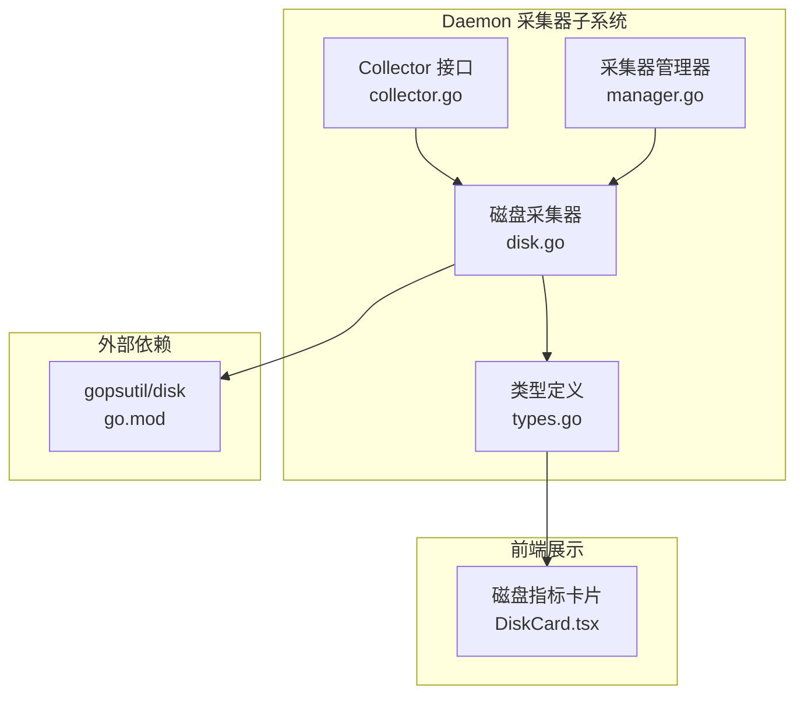
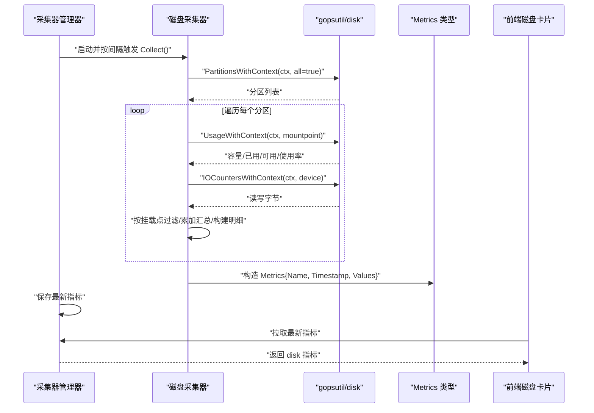
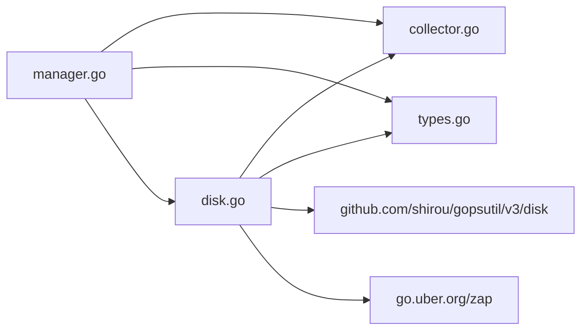

# 磁盘采集器

<cite>
**本文引用的文件**
- [daemon/internal/collector/disk.go](file://daemon/internal/collector/disk.go)
- [daemon/internal/collector/disk_test.go](file://daemon/internal/collector/disk_test.go)
- [daemon/internal/collector/collector.go](file://daemon/internal/collector/collector.go)
- [daemon/internal/collector/manager.go](file://daemon/internal/collector/manager.go)
- [daemon/pkg/types/types.go](file://daemon/pkg/types/types.go)
- [daemon/go.mod](file://daemon/go.mod)
- [docs/设计文档_01_Daemon模块.md](file://docs/设计文档_01_Daemon模块.md)
- [web/src/components/Metrics/DiskCard.tsx](file://web/src/components/Metrics/DiskCard.tsx)
</cite>

## 目录
1. [简介](#简介)
2. [项目结构](#项目结构)
3. [核心组件](#核心组件)
4. [架构总览](#架构总览)
5. [详细组件分析](#详细组件分析)
6. [依赖关系分析](#依赖关系分析)
7. [性能考量](#性能考量)
8. [故障排查指南](#故障排查指南)
9. [结论](#结论)
10. [附录](#附录)

## 简介
本文件面向运维与平台工程团队，系统性阐述 Daemon 模块中的磁盘采集器（DiskCollector）实现与使用方法。重点覆盖：
- 如何基于 gopsutil 的 Partitions/Usage/IOCounters 获取各挂载点的容量、已用、可用与使用率，并聚合为汇总指标与明细数组；
- 多磁盘设备的遍历逻辑与挂载点过滤策略；
- 关键字段（如 total/used/free/used_percent、read_bytes/write_bytes、partition_count、details）的组织方式；
- df 命令等效逻辑的实现思路与代码路径；
- 测试中如何模拟不同磁盘使用场景；
- I/O 性能影响评估、挂载点过滤配置方法以及不可访问路径的异常处理机制。

## 项目结构
磁盘采集器位于 Daemon 内部采集器子系统中，遵循统一的 Collector 接口与 Manager 管理器模式，指标数据以统一的 Metrics 结构返回，供上层上报与前端展示使用。



图表来源
- [daemon/internal/collector/collector.go](file://daemon/internal/collector/collector.go#L10-L22)
- [daemon/internal/collector/manager.go](file://daemon/internal/collector/manager.go#L12-L21)
- [daemon/internal/collector/disk.go](file://daemon/internal/collector/disk.go#L12-L17)
- [daemon/pkg/types/types.go](file://daemon/pkg/types/types.go#L18-L23)
- [daemon/go.mod](file://daemon/go.mod#L8-L8)
- [web/src/components/Metrics/DiskCard.tsx](file://web/src/components/Metrics/DiskCard.tsx#L1-L47)

章节来源
- [daemon/internal/collector/disk.go](file://daemon/internal/collector/disk.go#L1-L153)
- [daemon/internal/collector/collector.go](file://daemon/internal/collector/collector.go#L10-L22)
- [daemon/internal/collector/manager.go](file://daemon/internal/collector/manager.go#L35-L124)
- [daemon/pkg/types/types.go](file://daemon/pkg/types/types.go#L18-L23)
- [daemon/go.mod](file://daemon/go.mod#L8-L8)

## 核心组件
- Collector 接口：定义采集器的统一能力（名称、采集、间隔、启用状态）。
- DiskCollector：实现磁盘指标采集，使用 gopsutil 获取分区列表、使用量与 IO 统计，按挂载点过滤，聚合汇总与明细。
- Manager：统一调度多个采集器，定时触发采集并将最新指标缓存。
- Metrics：统一指标数据结构，包含指标名、时间戳与键值对数据。

章节来源
- [daemon/internal/collector/collector.go](file://daemon/internal/collector/collector.go#L10-L22)
- [daemon/internal/collector/disk.go](file://daemon/internal/collector/disk.go#L12-L17)
- [daemon/internal/collector/manager.go](file://daemon/internal/collector/manager.go#L12-L21)
- [daemon/pkg/types/types.go](file://daemon/pkg/types/types.go#L18-L23)

## 架构总览
下图展示了从采集器管理器到磁盘采集器再到 gopsutil 的调用链路，以及指标返回与前端消费的关系。



图表来源
- [daemon/internal/collector/manager.go](file://daemon/internal/collector/manager.go#L63-L104)
- [daemon/internal/collector/disk.go](file://daemon/internal/collector/disk.go#L45-L152)
- [daemon/pkg/types/types.go](file://daemon/pkg/types/types.go#L18-L23)

## 详细组件分析

### 磁盘采集器类图
```mermaid
classDiagram
class Collector {
+Name() string
+Collect(ctx) *Metrics
+Interval() time.Duration
+Enabled() bool
}
class DiskCollector {
-enabled bool
-interval time.Duration
-mountPoints []string
-logger *zap.Logger
+Name() string
+Collect(ctx) *Metrics
+Interval() time.Duration
+Enabled() bool
}
class Manager {
-collectors []Collector
-latest map[string]*Metrics
-mu sync.RWMutex
-logger *zap.Logger
-ctx context.Context
-cancel context.CancelFunc
-wg sync.WaitGroup
+Start()
+Stop()
+GetLatest() map[string]*Metrics
+GetLatestByName(name) *Metrics
}
class Metrics {
+Name string
+Timestamp time.Time
+Values map[string]interface{}
}
Collector <|.. DiskCollector
Manager --> Collector : "调度"
DiskCollector --> Metrics : "返回"
```

图表来源
- [daemon/internal/collector/collector.go](file://daemon/internal/collector/collector.go#L10-L22)
- [daemon/internal/collector/disk.go](file://daemon/internal/collector/disk.go#L12-L17)
- [daemon/internal/collector/manager.go](file://daemon/internal/collector/manager.go#L12-L21)
- [daemon/pkg/types/types.go](file://daemon/pkg/types/types.go#L18-L23)

### 采集流程与关键字段
- 分区枚举与过滤
  - 使用 gopsutil 的上下文感知函数获取分区列表；
  - 若配置了挂载点集合，则仅对匹配的挂载点进行采集；
  - 对不匹配的挂载点直接跳过，避免无效 I/O。
- 使用量与 IO 统计
  - 对每个挂载点调用使用量查询，得到 total/used/free/used_percent；
  - 对每个设备调用 IO 统计，得到 read_bytes/write_bytes 并累加到全局；
  - 对无法获取使用量或 IO 统计的情况记录日志并跳过该分区，保证整体稳定性。
- 汇总与明细
  - 汇总字段：total_bytes、used_bytes、free_bytes、usage_percent、read_bytes、write_bytes、partition_count；
  - 明细数组：每项包含 mountpoint、device、fstype、total、used、free、used_percent、read_bytes、write_bytes。
- 返回结构
  - 指标名固定为 disk；
  - 时间戳为采集完成时刻；
  - Values 为键值对，既满足前端快速展示的扁平化汇总，也保留明细数组以供扩展。

章节来源
- [daemon/internal/collector/disk.go](file://daemon/internal/collector/disk.go#L45-L152)

### df 命令等效逻辑实现思路
- 获取所有分区：对应 gopsutil 的分区枚举；
- 计算使用率：使用已用/总量百分比；
- 输出字段：total/used/free/used_percent，与 df 的常用输出字段一致；
- 明细数组：逐挂载点输出，便于前端表格化展示。

代码路径参考
- [daemon/internal/collector/disk.go](file://daemon/internal/collector/disk.go#L45-L152)

### 挂载点过滤配置方法
- 构造函数参数 mountPoints 为空时，默认采集全部挂载点；
- 指定挂载点集合时，仅对匹配的挂载点采集；
- 该策略在 Collect 中通过线性查找实现，复杂度 O(N)。

章节来源
- [daemon/internal/collector/disk.go](file://daemon/internal/collector/disk.go#L63-L76)

### 异常处理机制
- 分区枚举失败：记录错误日志并返回错误；
- 使用量查询失败：记录警告日志并跳过该挂载点；
- IO 统计查询失败：记录调试日志并跳过该设备；
- 整体流程保证即使部分分区不可访问，也能返回可用的汇总指标。

章节来源
- [daemon/internal/collector/disk.go](file://daemon/internal/collector/disk.go#L47-L52)
- [daemon/internal/collector/disk.go](file://daemon/internal/collector/disk.go#L78-L85)
- [daemon/internal/collector/disk.go](file://daemon/internal/collector/disk.go#L92-L106)

### 测试中模拟不同磁盘使用场景
- 单元测试覆盖：
  - 名称、启用状态、采集间隔正确性；
  - 采集返回非空指标且包含必要字段；
  - 指定挂载点与全量挂载点两种场景均能成功；
  - 多次采集稳定性验证。
- 场景建议：
  - 使用真实环境挂载点集合进行全量采集；
  - 指定根目录挂载点进行最小化采集；
  - 在网络存储或只读挂载点环境下验证异常分支。

章节来源
- [daemon/internal/collector/disk_test.go](file://daemon/internal/collector/disk_test.go#L11-L121)

## 依赖关系分析
- 外部依赖
  - gopsutil/disk：提供分区、使用量与 IO 统计的跨平台能力；
  - zap：结构化日志记录；
  - testify：单元测试断言。
- 内部依赖
  - Collector 接口：统一采集器契约；
  - Manager：统一调度与缓存最新指标；
  - Metrics：统一指标数据结构。



图表来源
- [daemon/internal/collector/disk.go](file://daemon/internal/collector/disk.go#L1-L10)
- [daemon/internal/collector/collector.go](file://daemon/internal/collector/collector.go#L10-L22)
- [daemon/internal/collector/manager.go](file://daemon/internal/collector/manager.go#L12-L21)
- [daemon/pkg/types/types.go](file://daemon/pkg/types/types.go#L18-L23)
- [daemon/go.mod](file://daemon/go.mod#L8-L8)

章节来源
- [daemon/go.mod](file://daemon/go.mod#L8-L8)

## 性能考量
- I/O 成本
  - 每次采集会遍历所有分区并查询使用量与 IO 统计，存在系统调用与内核交互成本；
  - 对于挂载点数量较多的系统，建议通过挂载点过滤减少不必要的查询。
- 并发与定时
  - Manager 使用 ticker 定时触发，避免阻塞主线程；
  - 采集过程内部无并发，单次采集串行处理，降低锁竞争。
- 日志级别
  - 分区枚举失败记录错误，使用量/IO 查询失败记录警告/调试，避免高频日志污染；
  - 建议在生产环境将日志级别调整为 info 或更高，减少调试日志开销。
- 指标缓存
  - Manager 将最新指标缓存，前端轮询可直接获取，避免重复采集。

[本节为通用性能讨论，不直接分析具体文件]

## 故障排查指南
- 采集失败
  - 检查 gopsutil 是否正常安装与导入；
  - 查看日志中“failed to get disk partitions”错误，确认权限与系统支持。
- 指标缺失
  - 检查挂载点过滤配置是否过于严格导致未命中；
  - 确认目标挂载点是否存在且可访问。
- IO 字段为零
  - 可能是 IO 统计查询失败或设备无 IO 活动；
  - 查看调试日志中“failed to get disk io counters”记录。
- 前端不显示
  - 确认指标名是否为 disk；
  - 检查前端组件是否正确解析 values 中的 total_bytes/used_bytes/usage_percent。

章节来源
- [daemon/internal/collector/disk.go](file://daemon/internal/collector/disk.go#L47-L52)
- [daemon/internal/collector/disk.go](file://daemon/internal/collector/disk.go#L78-L85)
- [daemon/internal/collector/disk.go](file://daemon/internal/collector/disk.go#L92-L106)
- [web/src/components/Metrics/DiskCard.tsx](file://web/src/components/Metrics/DiskCard.tsx#L1-L47)

## 结论
磁盘采集器通过 gopsutil 提供的跨平台能力，实现了对多挂载点的稳定采集与汇总，具备挂载点过滤、异常容忍与统一指标格式输出的能力。结合 Manager 的定时调度与缓存机制，可在保证性能的同时满足前端展示与告警需求。建议在大规模环境中合理设置挂载点过滤与采集间隔，并根据业务场景选择合适的日志级别以平衡可观测性与性能。

[本节为总结性内容，不直接分析具体文件]

## 附录

### 关键字段说明
- 汇总字段
  - total_bytes：总容量（字节）
  - used_bytes：已用容量（字节）
  - free_bytes：可用容量（字节）
  - usage_percent：使用率（百分比）
  - read_bytes：累计读取字节
  - write_bytes：累计写入字节
  - partition_count：参与汇总的分区数量
- 明细字段
  - mountpoint：挂载点路径
  - device：设备名称
  - fstype：文件系统类型
  - total/used/free：容量/已用/可用（字节）
  - used_percent：使用率（百分比）
  - read_bytes/write_bytes：该分区的读写字节

章节来源
- [daemon/internal/collector/disk.go](file://daemon/internal/collector/disk.go#L129-L144)

### df 命令等效逻辑要点
- 通过 gopsutil 的分区枚举与使用量查询，复现 df 的核心输出字段；
- 以挂载点为粒度进行明细输出，便于前端表格化展示；
- 通过挂载点过滤实现与 df -t/-x 等价的筛选能力。

章节来源
- [daemon/internal/collector/disk.go](file://daemon/internal/collector/disk.go#L45-L152)
- [docs/设计文档_01_Daemon模块.md](file://docs/设计文档_01_Daemon模块.md#L269-L304)