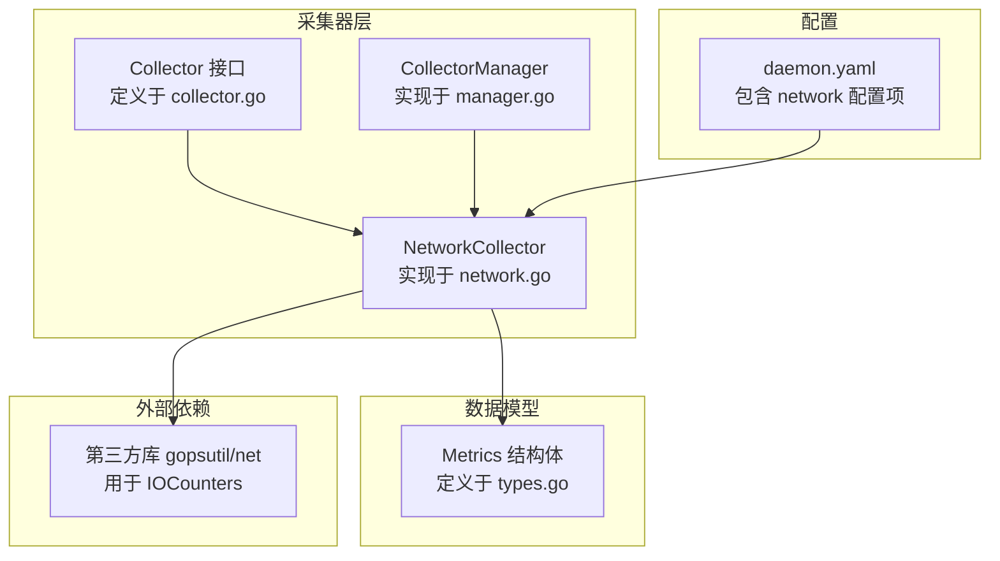
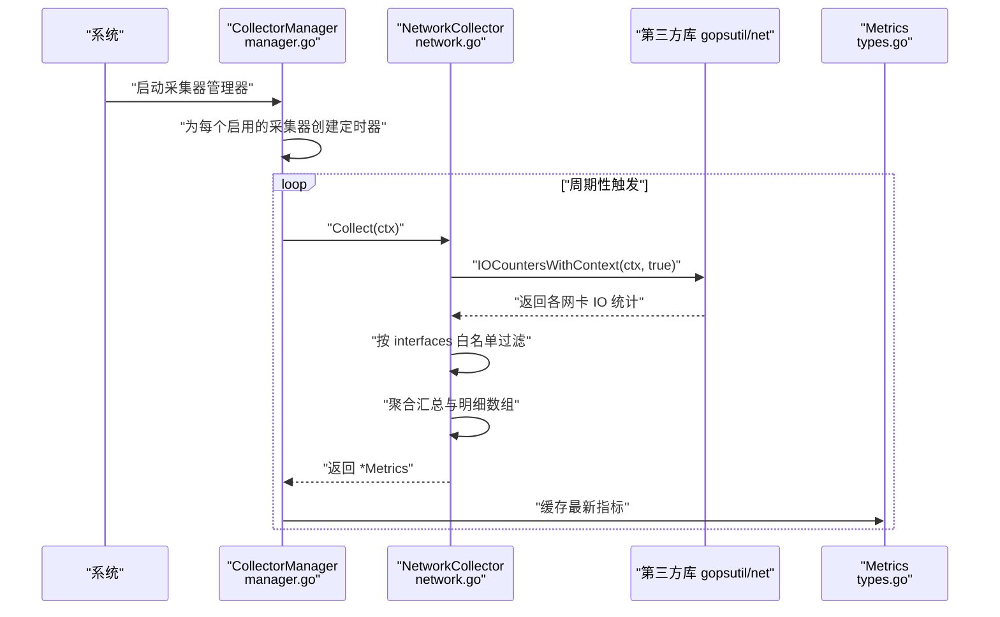
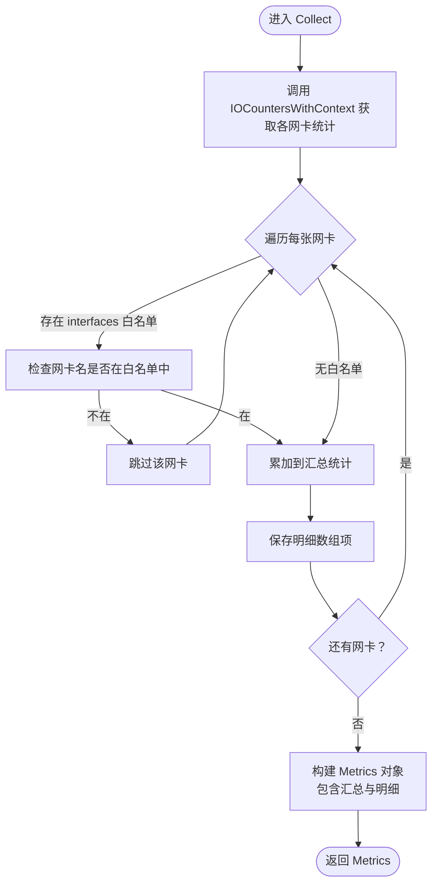
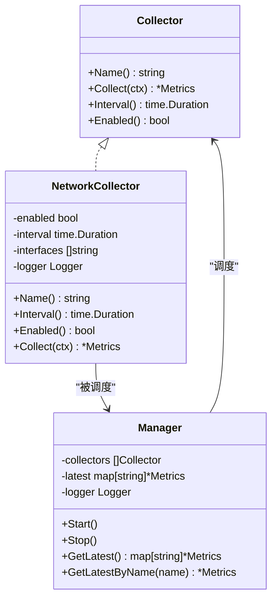
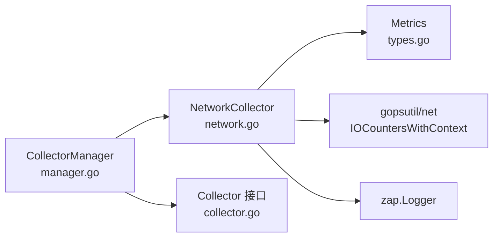

# 网络采集器

<cite>
**本文引用的文件**
- [network.go](file://daemon/internal/collector/network.go)
- [network_test.go](file://daemon/internal/collector/network_test.go)
- [collector.go](file://daemon/internal/collector/collector.go)
- [manager.go](file://daemon/internal/collector/manager.go)
- [types.go](file://daemon/pkg/types/types.go)
- [daemon.yaml](file://daemon/configs/daemon.yaml)
- [设计文档_01_Daemon模块.md](file://docs/设计文档_01_Daemon模块.md)
</cite>

## 目录
1. [简介](#简介)
2. [项目结构](#项目结构)
3. [核心组件](#核心组件)
4. [架构总览](#架构总览)
5. [详细组件分析](#详细组件分析)
6. [依赖关系分析](#依赖关系分析)
7. [性能考量](#性能考量)
8. [故障排查指南](#故障排查指南)
9. [结论](#结论)
10. [附录](#附录)

## 简介
本文件面向开发与运维人员，系统性阐述网络采集器（NetworkCollector）在该仓库中的实现与使用方式。重点覆盖以下方面：
- 如何从系统接口读取网络接口的接收/发送字节数、数据包数、错误计数等指标
- Collect 方法中对网卡列表的解析与过滤逻辑
- 汇总指标的组织方式与“明细数组”的保留策略
- 高频采集场景下的资源消耗与优化建议
- 接口过滤配置与虚拟网卡处理注意事项
- 单元测试中对网络流量变化的模拟思路

说明：当前实现通过第三方库获取网络 IO 统计，未直接解析 /proc/net/dev 文件；但本文仍以“网络采集器”为主题进行完整说明，并在相关章节给出与 /proc/net/dev 的对应关系与差异说明。

## 项目结构
网络采集器位于 Daemon 模块的采集器子系统内，采用统一的 Collector 接口抽象与 Manager 管理器调度机制。关键文件如下：
- 采集器接口定义：collector.go
- 网络采集器实现：network.go
- 采集器管理器：manager.go
- 指标数据模型：types.go
- 配置示例：daemon.yaml
- 设计文档（含历史版本的网络采集器设计）：设计文档_01_Daemon模块.md
- 单元测试：network_test.go

图表来源
- [collector.go](file://daemon/internal/collector/collector.go#L10-L23)
- [network.go](file://daemon/internal/collector/network.go#L1-L136)
- [manager.go](file://daemon/internal/collector/manager.go#L1-L124)
- [types.go](file://daemon/pkg/types/types.go#L18-L23)
- [daemon.yaml](file://daemon/configs/daemon.yaml#L50-L55)

章节来源
- [collector.go](file://daemon/internal/collector/collector.go#L10-L23)
- [network.go](file://daemon/internal/collector/network.go#L1-L136)
- [manager.go](file://daemon/internal/collector/manager.go#L1-L124)
- [types.go](file://daemon/pkg/types/types.go#L18-L23)
- [daemon.yaml](file://daemon/configs/daemon.yaml#L50-L55)

## 核心组件
- Collector 接口：定义了采集器的统一能力（名称、采集、间隔、启用状态），便于扩展其他采集器类型。
- NetworkCollector：实现 Collector 接口，负责采集网络 IO 统计，支持按网卡白名单过滤。
- CollectorManager：统一启动、调度各采集器，定时触发 Collect 并缓存最新指标。
- Metrics 数据模型：标准化指标输出结构，包含名称、时间戳与键值对数据。

章节来源
- [collector.go](file://daemon/internal/collector/collector.go#L10-L23)
- [network.go](file://daemon/internal/collector/network.go#L12-L43)
- [manager.go](file://daemon/internal/collector/manager.go#L12-L33)
- [types.go](file://daemon/pkg/types/types.go#L18-L23)

## 架构总览
下图展示了网络采集器在整体系统中的位置与交互流程。

图表来源
- [manager.go](file://daemon/internal/collector/manager.go#L63-L104)
- [network.go](file://daemon/internal/collector/network.go#L45-L136)
- [types.go](file://daemon/pkg/types/types.go#L18-L23)

## 详细组件分析

### NetworkCollector 实现要点
- 名称与元信息：Name 返回固定标识，Interval/Enabled 提供调度控制。
- 数据来源：通过第三方库获取各网卡 IO 统计，包含 bytes_sent、bytes_recv、packets_sent、packets_recv、error_in、error_out、drop_in、drop_out 等字段。
- 接口过滤：若构造时传入了非空的 interfaces 列表，则仅采集匹配的网卡；否则采集全部网卡。
- 汇总与明细：
  - 汇总：对所有被选中的网卡进行累加，得到总发送/接收字节、数据包数与各类错误/丢弃计数。
  - 明细：保留每张网卡的原始统计，形成数组，便于后续扩展或前端展示。
- 输出格式：返回标准 Metrics 结构，包含名称、时间戳与 Values 中的键值对。

图表来源
- [network.go](file://daemon/internal/collector/network.go#L45-L136)

章节来源
- [network.go](file://daemon/internal/collector/network.go#L12-L43)
- [network.go](file://daemon/internal/collector/network.go#L45-L136)

### 接口过滤与活跃接口识别
- 接口过滤：构造函数允许传入 interfaces 列表作为白名单；Collect 中对每张网卡名进行匹配，仅保留匹配项。
- 活跃接口识别：当前实现未显式判断接口是否“活跃”，而是直接采集所有匹配的网卡统计。若需区分活跃状态，可在上层业务或配置中增加额外规则（例如基于速率阈值或状态文件）。

章节来源
- [network.go](file://daemon/internal/collector/network.go#L67-L80)

### 汇总指标与明细数组
- 汇总键值（部分）：tx_bytes、rx_bytes、bytes_sent、bytes_recv、packets_sent、packets_recv、error_in、error_out、drop_in、drop_out、interface_count。
- 明细数组：每张网卡一条记录，包含 interface、bytes_sent、bytes_recv、packets_sent、packets_recv、error_in、error_out、drop_in、drop_out 等字段，便于后续扩展。

章节来源
- [network.go](file://daemon/internal/collector/network.go#L107-L126)

### 速率计算与“前后两次采集差值”
- 当前实现返回的是累计值（各网卡的累计字节数、数据包数、错误/丢弃计数）。若需要速率（如 bytes/sec），应在上层业务侧基于两次采集的差值与时间间隔自行计算。
- 速率计算思路（概念性说明）：
  - 记录上次采集的累计值与时间戳
  - 本次采集得到新的累计值与时间戳
  - 速率 = (本次累计 - 上次累计) / 采样间隔
- 该仓库未内置速率计算逻辑，建议在消费方（如 Manager 或 Web 层）实现。

章节来源
- [network.go](file://daemon/internal/collector/network.go#L107-L126)
- [manager.go](file://daemon/internal/collector/manager.go#L83-L104)

### 与 /proc/net/dev 的关系与差异
- 当前实现通过第三方库获取 IO 统计，未直接解析 /proc/net/dev 文本文件。
- 二者在语义上一致：均能提供每张网卡的接收/发送字节、数据包、错误与丢弃计数等信息。
- 若未来需要直接解析 /proc/net/dev，可参考该文件的列结构与命名约定，再映射到当前指标键名。

章节来源
- [network.go](file://daemon/internal/collector/network.go#L48-L52)

### 单元测试中的模拟方法
- 基本行为验证：测试覆盖名称、启用状态、采集间隔、全量采集与特定网卡采集等基本行为。
- 多次采集：验证连续多次采集均能成功且时间戳单调递增。
- 注意：当前测试未对“网络流量变化”进行显式的数值注入或断言，主要验证生命周期与结构正确性。

章节来源
- [network_test.go](file://daemon/internal/collector/network_test.go#L12-L19)
- [network_test.go](file://daemon/internal/collector/network_test.go#L21-L39)
- [network_test.go](file://daemon/internal/collector/network_test.go#L42-L49)
- [network_test.go](file://daemon/internal/collector/network_test.go#L52-L79)
- [network_test.go](file://daemon/internal/collector/network_test.go#L81-L97)
- [network_test.go](file://daemon/internal/collector/network_test.go#L99-L133)

### Collector 接口与 Manager 调度
- Collector 接口统一了采集器的生命周期与元信息，便于 Manager 统一调度。
- Manager 在启动后为每个启用的采集器创建定时器，周期性触发 Collect，并将最新指标缓存至内存，供上层查询。

图表来源
- [collector.go](file://daemon/internal/collector/collector.go#L10-L23)
- [network.go](file://daemon/internal/collector/network.go#L12-L43)
- [manager.go](file://daemon/internal/collector/manager.go#L12-L33)

章节来源
- [collector.go](file://daemon/internal/collector/collector.go#L10-L23)
- [network.go](file://daemon/internal/collector/network.go#L12-L43)
- [manager.go](file://daemon/internal/collector/manager.go#L35-L81)

## 依赖关系分析
- NetworkCollector 依赖：
  - types.Metrics 作为输出结构
  - gopsutil/net 的 IOCountersWithContext 获取系统 IO 统计
  - zap 日志库记录采集日志
- Manager 依赖：
  - Collector 接口抽象，统一调度不同采集器
  - time 定时器与 context 控制生命周期

图表来源
- [network.go](file://daemon/internal/collector/network.go#L1-L136)
- [types.go](file://daemon/pkg/types/types.go#L18-L23)
- [manager.go](file://daemon/internal/collector/manager.go#L1-L124)
- [collector.go](file://daemon/internal/collector/collector.go#L10-L23)

章节来源
- [network.go](file://daemon/internal/collector/network.go#L1-L136)
- [manager.go](file://daemon/internal/collector/manager.go#L1-L124)
- [collector.go](file://daemon/internal/collector/collector.go#L10-L23)

## 性能考量
- 采集频率与开销：高频采集会增加系统调用次数与上下文切换成本。建议根据监控需求选择合适的采集间隔。
- 白名单过滤：通过 interfaces 白名单减少无关网卡的统计与聚合开销，提升整体性能。
- 数据结构：当前实现使用 map[string]interface{} 存储 Values，序列化与传输成本较低；若指标规模扩大，可考虑更紧凑的数据结构或压缩策略。
- 并发与锁：Manager 使用读写锁保护最新指标缓存，避免频繁加锁带来的竞争；注意在高并发场景下合理设置采集间隔与指标数量。

[本节为通用性能讨论，不直接分析具体文件]

## 故障排查指南
- 采集失败：当 IOCountersWithContext 返回错误时，采集器会记录错误日志。可通过日志定位系统层面的问题（如权限不足、上下文取消）。
- 指标为空：确认是否配置了网卡白名单且当前环境中存在匹配的接口；检查接口是否存在（如虚拟网卡可能未启用）。
- 时间戳异常：确保系统时间同步；多次采集的时间戳应单调递增。
- 速率异常：若期望速率，请在消费方基于两次采集的差值与时间间隔自行计算。

章节来源
- [network.go](file://daemon/internal/collector/network.go#L48-L52)
- [network_test.go](file://daemon/internal/collector/network_test.go#L100-L133)

## 结论
- NetworkCollector 提供了简洁、可扩展的网络指标采集能力，支持按网卡白名单过滤与明细数组保留。
- 当前实现返回累计值，速率计算需由上层业务完成。
- 通过 Collector 接口与 Manager 调度，可方便地集成与扩展其他采集器类型。
- 建议在高频采集场景下结合白名单过滤与合理的采集间隔，平衡监控精度与系统开销。

[本节为总结性内容，不直接分析具体文件]

## 附录

### 配置项说明（network）
- enabled：是否启用网络采集器
- interval：采集间隔
- interfaces：网卡白名单，空则采集全部网卡

章节来源
- [daemon.yaml](file://daemon/configs/daemon.yaml#L50-L55)

### 历史设计对比（设计文档_01_Daemon模块.md）
- 文档中曾给出一个带“lastStats”与“interfaces”字段的 NetworkCollector 设计，强调速率计算需要基于前后两次采集的差值。
- 当前实现未保留 lastStats，直接返回累计值；若需速率计算，建议在消费方实现差值与时间间隔计算。

章节来源
- [设计文档_01_Daemon模块.md](file://docs/设计文档_01_Daemon模块.md#L304-L338)