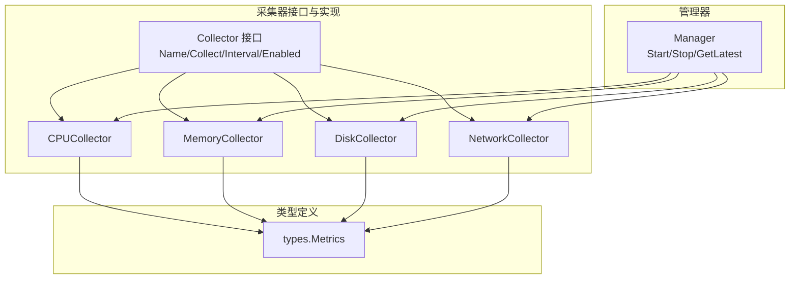
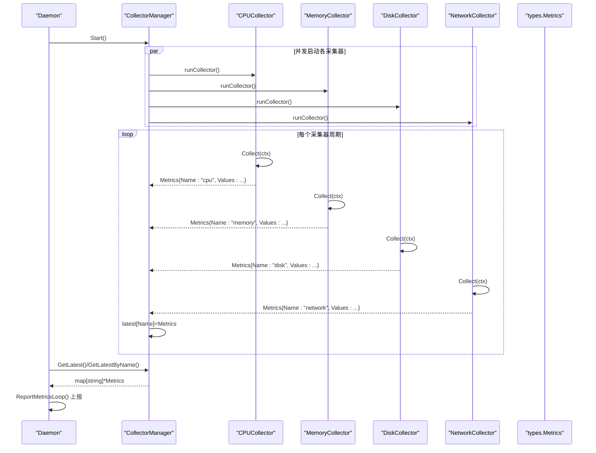
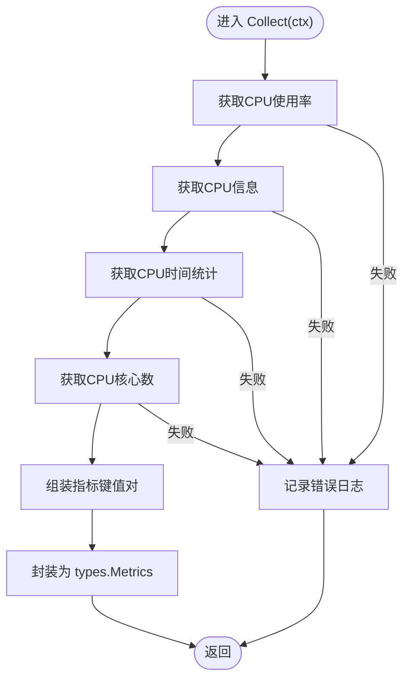
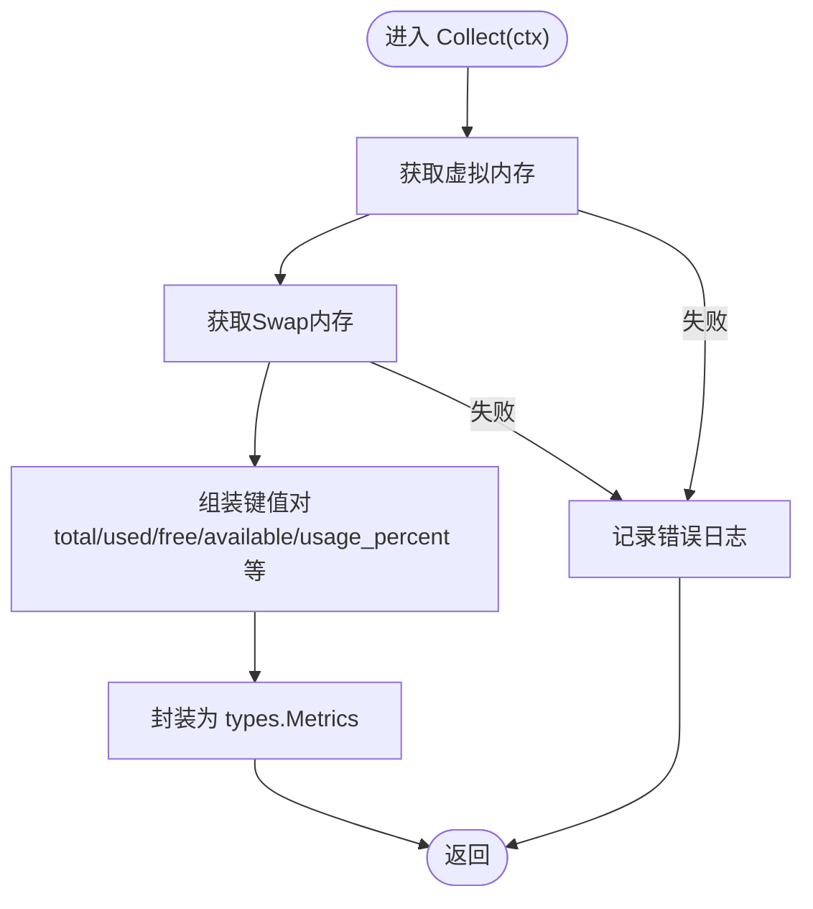
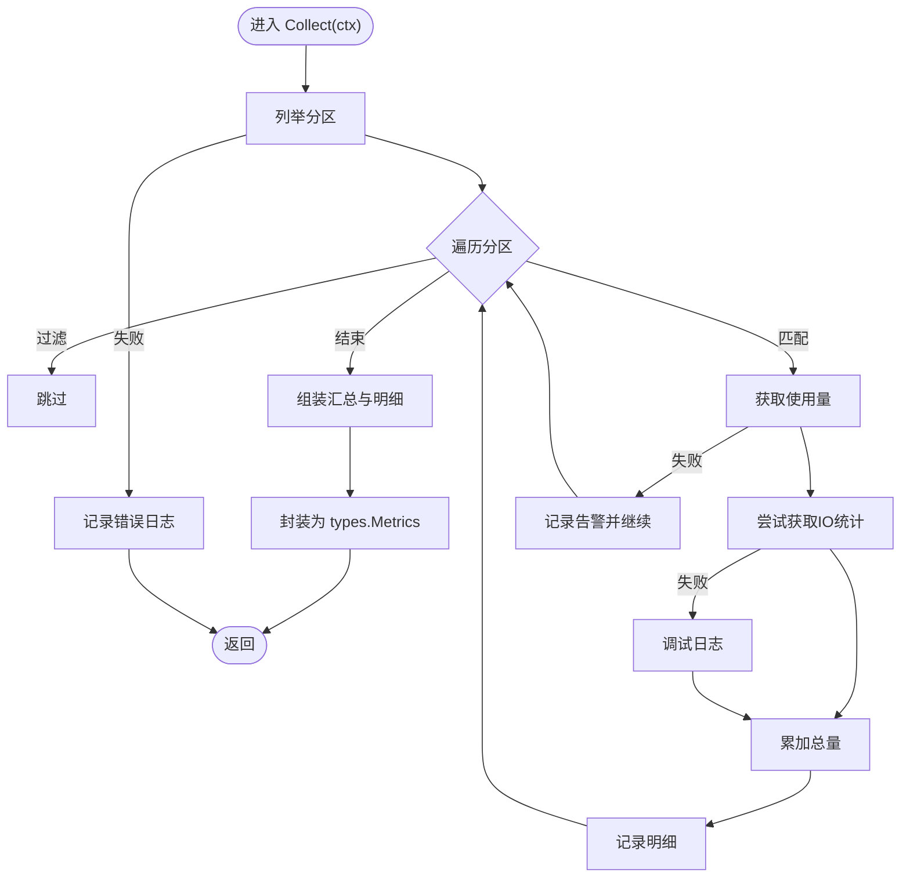
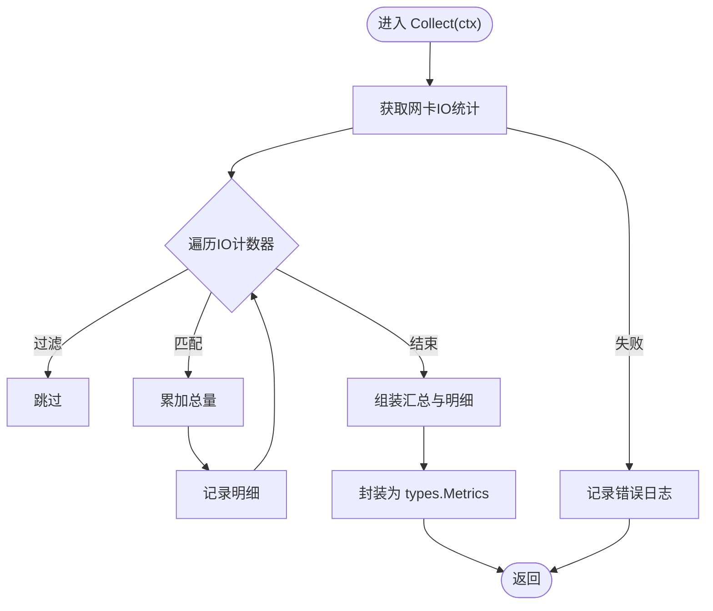
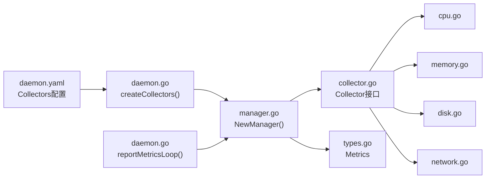

# 资源采集模块

<cite>
**本文引用的文件列表**
- [collector.go](file://daemon/internal/collector/collector.go)
- [cpu.go](file://daemon/internal/collector/cpu.go)
- [memory.go](file://daemon/internal/collector/memory.go)
- [disk.go](file://daemon/internal/collector/disk.go)
- [network.go](file://daemon/internal/collector/network.go)
- [manager.go](file://daemon/internal/collector/manager.go)
- [types.go](file://daemon/pkg/types/types.go)
- [daemon.go](file://daemon/internal/daemon/daemon.go)
- [config.go](file://daemon/internal/config/config.go)
- [daemon.yaml](file://daemon/configs/daemon.yaml)
- [cpu_test.go](file://daemon/internal/collector/cpu_test.go)
- [manager_test.go](file://daemon/internal/collector/manager_test.go)
</cite>

## 目录
1. [引言](#引言)
2. [项目结构](#项目结构)
3. [核心组件](#核心组件)
4. [架构总览](#架构总览)
5. [详细组件分析](#详细组件分析)
6. [依赖关系分析](#依赖关系分析)
7. [性能考量](#性能考量)
8. [故障排查指南](#故障排查指南)
9. [结论](#结论)
10. [附录](#附录)

## 引言
本文件聚焦Daemon的资源采集模块，系统性阐述其职责、接口设计、具体采集器实现、统一管理器的并发调度机制，以及数据流与性能开销。目标是帮助开发者快速理解采集器的职责边界、扩展方式与最佳实践。

## 项目结构
资源采集模块位于daemon/internal/collector目录，围绕统一接口Collector抽象出CPU、内存、磁盘、网络四类采集器；通过CollectorManager统一管理多个采集器，采用Goroutine并发执行，周期性采集并将最新指标缓存以便上层上报。



图表来源
- [collector.go](file://daemon/internal/collector/collector.go#L1-L24)
- [cpu.go](file://daemon/internal/collector/cpu.go#L1-L106)
- [memory.go](file://daemon/internal/collector/memory.go#L1-L89)
- [disk.go](file://daemon/internal/collector/disk.go#L1-L154)
- [network.go](file://daemon/internal/collector/network.go#L1-L137)
- [manager.go](file://daemon/internal/collector/manager.go#L1-L124)
- [types.go](file://daemon/pkg/types/types.go#L1-L60)

章节来源
- [collector.go](file://daemon/internal/collector/collector.go#L1-L24)
- [manager.go](file://daemon/internal/collector/manager.go#L1-L124)

## 核心组件
- 采集器接口Collector：定义统一能力，包括名称、采集方法、采集间隔、启用状态。
- 四类采集器：
  - CPUCollector：采集CPU使用率、核心数、型号、时间统计等。
  - MemoryCollector：采集虚拟内存、Swap内存及兼容字段。
  - DiskCollector：按挂载点聚合磁盘使用量、IO字节数与明细。
  - NetworkCollector：按网卡聚合网络IO、包数、错误与丢包等。
- CollectorManager：统一管理多个采集器，基于Goroutine并发执行，定时采集并缓存最新指标。

章节来源
- [collector.go](file://daemon/internal/collector/collector.go#L1-L24)
- [cpu.go](file://daemon/internal/collector/cpu.go#L1-L106)
- [memory.go](file://daemon/internal/collector/memory.go#L1-L89)
- [disk.go](file://daemon/internal/collector/disk.go#L1-L154)
- [network.go](file://daemon/internal/collector/network.go#L1-L137)
- [manager.go](file://daemon/internal/collector/manager.go#L1-L124)

## 架构总览
采集流程概览：Daemon启动时根据配置创建采集器集合，交由CollectorManager并发调度；采集周期内，每个采集器独立执行Collect，将结果写入Manager的latest映射；上层通过reportMetricsLoop定期拉取最新指标并上报。



图表来源
- [daemon.go](file://daemon/internal/daemon/daemon.go#L547-L571)
- [manager.go](file://daemon/internal/collector/manager.go#L35-L124)
- [cpu.go](file://daemon/internal/collector/cpu.go#L43-L106)
- [memory.go](file://daemon/internal/collector/memory.go#L43-L89)
- [disk.go](file://daemon/internal/collector/disk.go#L45-L154)
- [network.go](file://daemon/internal/collector/network.go#L45-L137)
- [types.go](file://daemon/pkg/types/types.go#L18-L24)

## 详细组件分析

### 采集器接口设计（Collector）
- 能力模型
  - Name(): string —— 采集器标识，如"cpu"/"memory"/"disk"/"network"。
  - Collect(ctx): (*types.Metrics, error) —— 执行采集，返回指标对象。
  - Interval(): time.Duration —— 采集周期。
  - Enabled(): bool —— 是否启用。
- 设计要点
  - 通过接口抽象，便于新增采集器类型，遵循开闭原则。
  - Collect方法接收context，支持超时与取消，提升稳定性。
  - types.Metrics统一承载指标名称、时间戳与键值对数据，便于上层处理。

章节来源
- [collector.go](file://daemon/internal/collector/collector.go#L1-L24)
- [types.go](file://daemon/pkg/types/types.go#L18-L24)

### CPU采集器（CPUCollector）
- 职责
  - 采集CPU使用率、核心数、型号、频率与时间统计。
- 数据采集逻辑
  - 使用第三方库获取CPU使用率、信息、时间统计与核心数。
  - 组装指标：usage_percent、cores、model、mhz、user/system/idle/iowait等。
- 错误处理
  - 任一步骤失败均记录错误日志并返回错误，避免脏数据污染。
- 性能特性
  - 使用1秒采样窗口计算使用率，兼顾实时性与开销平衡。
  - 采集过程为轻量系统调用，通常毫秒级完成。



图表来源
- [cpu.go](file://daemon/internal/collector/cpu.go#L43-L106)

章节来源
- [cpu.go](file://daemon/internal/collector/cpu.go#L1-L106)
- [cpu_test.go](file://daemon/internal/collector/cpu_test.go#L1-L143)

### 内存采集器（MemoryCollector）
- 职责
  - 采集虚拟内存与Swap内存关键指标。
- 数据采集逻辑
  - 获取虚拟内存与Swap内存信息，构建统一命名规范的键值对。
  - 提供兼容字段名，保证向前兼容。
- 性能特性
  - 读取内存统计为常量时间操作，开销极低。



图表来源
- [memory.go](file://daemon/internal/collector/memory.go#L43-L89)

章节来源
- [memory.go](file://daemon/internal/collector/memory.go#L1-L89)

### 磁盘采集器（DiskCollector）
- 职责
  - 采集磁盘使用量、IO字节数与挂载点明细。
- 数据采集逻辑
  - 列举分区，支持按挂载点过滤。
  - 聚合计总：total/used/read_bytes/write_bytes等。
  - 保存明细数组，便于未来扩展。
- 性能特性
  - IO统计可能因设备数量增多而增加开销，但整体仍为轻量操作。
  - 通过挂载点白名单减少不必要的IO统计。



图表来源
- [disk.go](file://daemon/internal/collector/disk.go#L45-L154)

章节来源
- [disk.go](file://daemon/internal/collector/disk.go#L1-L154)

### 网络采集器（NetworkCollector）
- 职责
  - 采集网络IO、包数、错误与丢包等。
- 数据采集逻辑
  - 获取所有网卡IO统计，支持按网卡过滤。
  - 聚合计总并保存明细数组。
- 性能特性
  - 网卡数量较多时，IO统计遍历成本上升，建议通过interfaces白名单限制采集范围。



图表来源
- [network.go](file://daemon/internal/collector/network.go#L45-L137)

章节来源
- [network.go](file://daemon/internal/collector/network.go#L1-L137)

### CollectorManager：统一管理与并发调度
- 职责
  - 统一管理多个采集器，按各自Interval并发执行。
  - 缓存最新指标，提供GetLatest/GetLatestByName查询。
- 并发模型
  - Start()为每个启用的采集器启动独立Goroutine，使用time.Ticker驱动周期采集。
  - Stop()通过context取消与WaitGroup等待优雅退出。
- 数据缓存
  - 使用互斥读写锁保护latest映射，支持高并发读取。
- 生命周期
  - collect()负责实际采集与错误处理，记录耗时日志。

```mermaid
classDiagram
class Collector {
+Name() string
+Collect(ctx) *Metrics
+Interval() time.Duration
+Enabled() bool
}
class CPUCollector
class MemoryCollector
class DiskCollector
class NetworkCollector
class Manager {
-collectors []Collector
-latest map[string]*Metrics
-mu sync.RWMutex
+Start()
+Stop()
+GetLatest() map[string]*Metrics
+GetLatestByName(name) *Metrics
-runCollector(c Collector)
-collect(c Collector)
}
class Metrics {
+Name string
+Timestamp time.Time
+Values map[string]interface{}
}
Collector <|.. CPUCollector
Collector <|.. MemoryCollector
Collector <|.. DiskCollector
Collector <|.. NetworkCollector
Manager --> Collector : "管理"
CPUCollector --> Metrics
MemoryCollector --> Metrics
DiskCollector --> Metrics
NetworkCollector --> Metrics
```

图表来源
- [collector.go](file://daemon/internal/collector/collector.go#L1-L24)
- [manager.go](file://daemon/internal/collector/manager.go#L1-L124)
- [types.go](file://daemon/pkg/types/types.go#L18-L24)

章节来源
- [manager.go](file://daemon/internal/collector/manager.go#L1-L124)
- [manager_test.go](file://daemon/internal/collector/manager_test.go#L1-L242)

## 依赖关系分析
- 配置驱动
  - Daemon在启动时根据配置文件创建采集器集合，控制启用与间隔。
  - 采集器配置位于daemon/configs/daemon.yaml，包含cpu/memory/disk/network的enabled与interval，以及disk.mount_points与network.interfaces。
- 类型契约
  - 所有采集器返回types.Metrics，统一字段结构，便于上层处理与上报。
- 上层集成
  - Daemon的reportMetricsLoop周期性从Manager获取最新指标并上报至Manager。



图表来源
- [daemon.yaml](file://daemon/configs/daemon.yaml#L39-L55)
- [daemon.go](file://daemon/internal/daemon/daemon.go#L579-L608)
- [manager.go](file://daemon/internal/collector/manager.go#L23-L33)
- [collector.go](file://daemon/internal/collector/collector.go#L1-L24)
- [types.go](file://daemon/pkg/types/types.go#L18-L24)

章节来源
- [daemon.yaml](file://daemon/configs/daemon.yaml#L1-L63)
- [config.go](file://daemon/internal/config/config.go#L100-L127)
- [daemon.go](file://daemon/internal/daemon/daemon.go#L579-L608)

## 性能考量
- 采集频率与开销
  - CPU使用率需要两次采样才能计算，首次采集会等待1秒，后续周期按Interval执行。
  - 磁盘与网络采集涉及遍历设备/网卡，建议通过mount_points/interfaces白名单缩小范围。
- 并发与锁
  - Manager内部使用读写锁保护latest映射，GetLatest为高频读取场景提供高效并发。
- 上报节奏
  - Daemon的上报周期与采集周期解耦，可通过Manager.HeartbeatInterval控制上报频率，避免频繁上报造成压力。

[本节为通用性能讨论，无需列出具体文件来源]

## 故障排查指南
- 常见问题
  - 采集失败：采集器在任一步骤失败都会记录错误日志，检查对应系统权限与依赖库状态。
  - 指标缺失：确认采集器Enabled为true，且未被过滤（如磁盘挂载点、网络接口未匹配）。
  - 并发读写：Manager提供并发安全的GetLatest/GetLatestByName，避免竞态。
- 验证手段
  - 使用单元测试验证采集器基本行为（名称、间隔、字段完整性、范围约束等）。
  - 使用Manager测试验证并发访问、禁用采集器、多类型采集器共存等场景。

章节来源
- [cpu_test.go](file://daemon/internal/collector/cpu_test.go#L1-L143)
- [manager_test.go](file://daemon/internal/collector/manager_test.go#L1-L242)

## 结论
资源采集模块通过统一接口与管理器实现了高内聚、低耦合的指标采集体系。四类采集器覆盖CPU、内存、磁盘、网络关键维度，Manager以Goroutine并发调度保障性能与稳定性。通过配置化控制启用与采集间隔，结合白名单过滤，可在不同环境中灵活权衡精度与开销。

[本节为总结性内容，无需列出具体文件来源]

## 附录
- 配置示例片段（来源于daemon.yaml）
  - cpu.enabled、cpu.interval
  - memory.enabled、memory.interval
  - disk.enabled、disk.interval、disk.mount_points
  - network.enabled、network.interval、network.interfaces

章节来源
- [daemon.yaml](file://daemon/configs/daemon.yaml#L39-L55)