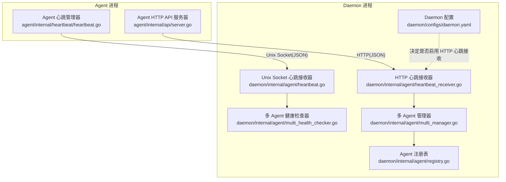
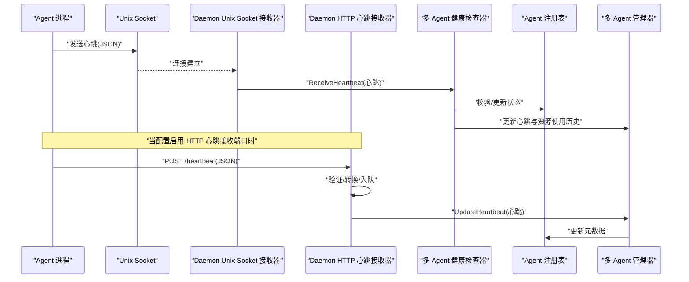
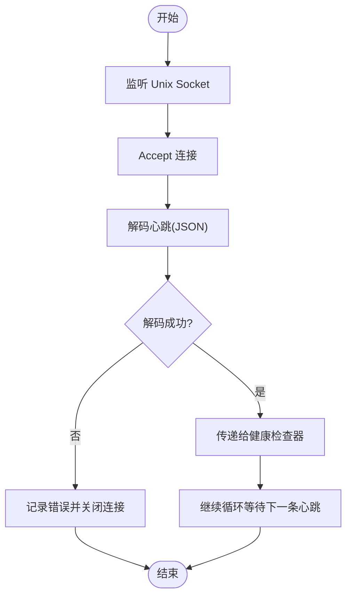
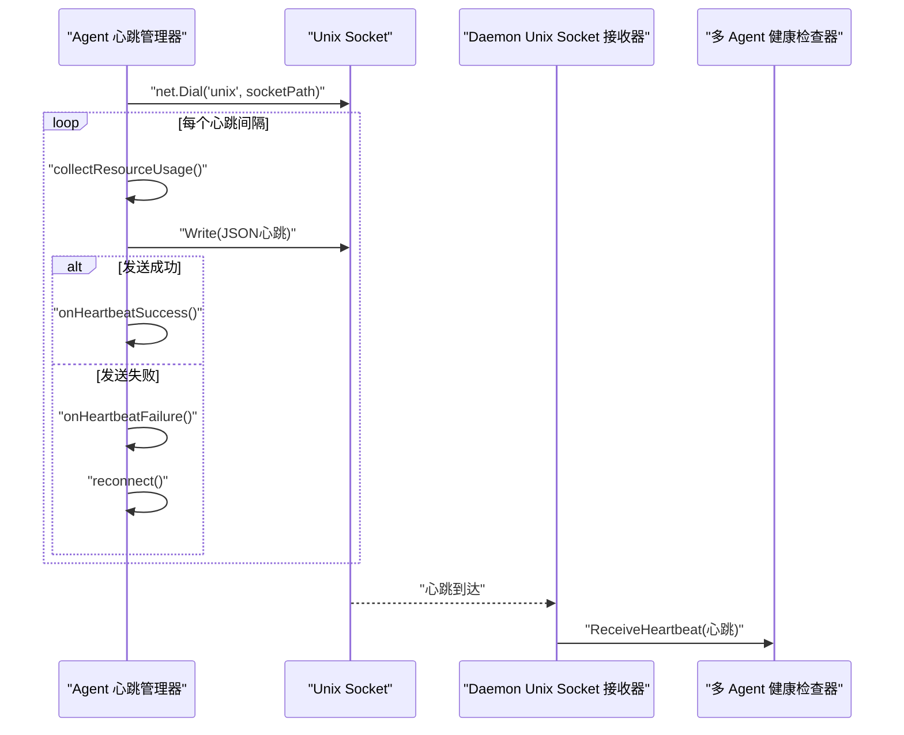
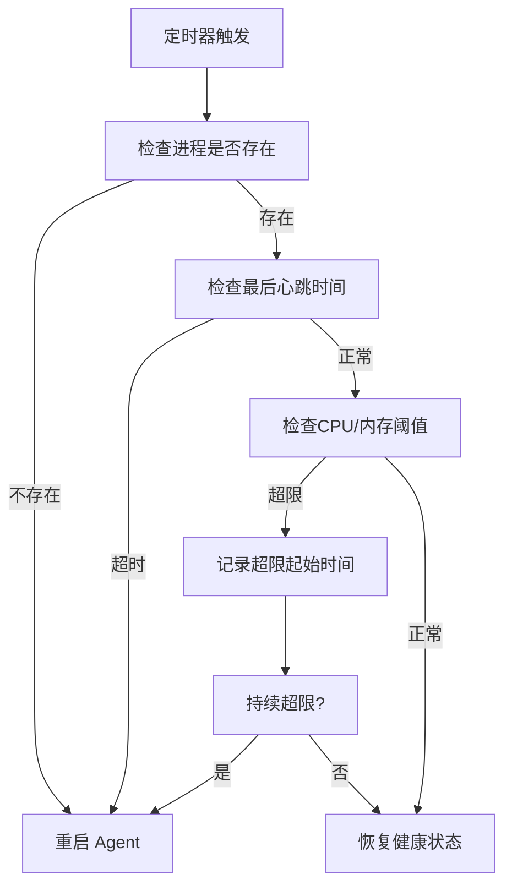
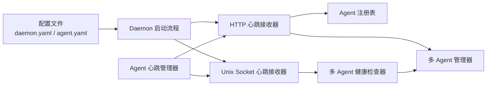

# Unix Socket 通信

<cite>
**本文引用的文件**
- [daemon/internal/agent/heartbeat.go](file://daemon/internal/agent/heartbeat.go)
- [agent/internal/heartbeat/heartbeat.go](file://agent/internal/heartbeat/heartbeat.go)
- [daemon/internal/agent/heartbeat_receiver.go](file://daemon/internal/agent/heartbeat_receiver.go)
- [daemon/internal/agent/multi_health_checker.go](file://daemon/internal/agent/multi_health_checker.go)
- [daemon/internal/agent/registry.go](file://daemon/internal/agent/registry.go)
- [daemon/internal/agent/multi_manager.go](file://daemon/internal/agent/multi_manager.go)
- [daemon/internal/daemon/daemon.go](file://daemon/internal/daemon/daemon.go)
- [daemon/configs/daemon.yaml](file://daemon/configs/daemon.yaml)
- [agent/configs/agent.yaml](file://agent/configs/agent.yaml)
- [agent/internal/api/server.go](file://agent/internal/api/server.go)
- [daemon/pkg/types/types.go](file://daemon/pkg/types/types.go)
</cite>

## 目录
1. [简介](#简介)
2. [项目结构](#项目结构)
3. [核心组件](#核心组件)
4. [架构总览](#架构总览)
5. [详细组件分析](#详细组件分析)
6. [依赖关系分析](#依赖关系分析)
7. [性能考量](#性能考量)
8. [故障排查指南](#故障排查指南)
9. [结论](#结论)

## 简介
本文件聚焦于 Daemon 与本地 Agent 之间的进程间通信机制，重点解释：
- Daemon 如何通过 Unix Socket 接收 Agent 的心跳上报；
- HTTPHeartbeatReceiver 的实现原理（工作池并发处理、请求验证、心跳数据转换、统计信息收集）；
- Agent 端 heartbeat.go 如何周期性发送心跳请求；
- Daemon 如何通过 HTTPHandler 处理请求并更新 Agent 状态；
- 通信协议细节（JSON-RPC 2.0 风格）、请求/响应结构定义（HeartbeatRequest/Response）、错误处理机制；
- 性能优化策略（channel 缓冲与 goroutine 池）；
- 心跳丢失检测与恢复逻辑。

## 项目结构
Daemon 与 Agent 的通信涉及以下关键模块：
- Agent 端：负责采集自身资源使用情况并通过 Unix Socket 定期发送心跳；同时提供 HTTP API 供外部查询健康状态与指标。
- Daemon 端：提供两种心跳接收方式（Unix Socket 与 HTTP），并维护多 Agent 的健康检查与状态更新。



图表来源
- [daemon/internal/agent/heartbeat.go](file://daemon/internal/agent/heartbeat.go#L1-L122)
- [agent/internal/heartbeat/heartbeat.go](file://agent/internal/heartbeat/heartbeat.go#L1-L228)
- [daemon/internal/agent/heartbeat_receiver.go](file://daemon/internal/agent/heartbeat_receiver.go#L1-L397)
- [daemon/internal/agent/multi_health_checker.go](file://daemon/internal/agent/multi_health_checker.go#L1-L490)
- [daemon/internal/agent/registry.go](file://daemon/internal/agent/registry.go#L1-L314)
- [daemon/internal/agent/multi_manager.go](file://daemon/internal/agent/multi_manager.go#L1-L529)
- [daemon/configs/daemon.yaml](file://daemon/configs/daemon.yaml#L1-L63)

章节来源
- [daemon/internal/agent/heartbeat.go](file://daemon/internal/agent/heartbeat.go#L1-L122)
- [agent/internal/heartbeat/heartbeat.go](file://agent/internal/heartbeat/heartbeat.go#L1-L228)
- [daemon/internal/agent/heartbeat_receiver.go](file://daemon/internal/agent/heartbeat_receiver.go#L1-L397)
- [daemon/internal/agent/multi_health_checker.go](file://daemon/internal/agent/multi_health_checker.go#L1-L490)
- [daemon/internal/agent/registry.go](file://daemon/internal/agent/registry.go#L1-L314)
- [daemon/internal/agent/multi_manager.go](file://daemon/internal/agent/multi_manager.go#L1-L529)
- [daemon/internal/daemon/daemon.go](file://daemon/internal/daemon/daemon.go#L240-L398)
- [daemon/configs/daemon.yaml](file://daemon/configs/daemon.yaml#L1-L63)
- [agent/configs/agent.yaml](file://agent/configs/agent.yaml#L1-L22)

## 核心组件
- Unix Socket 心跳接收器（Daemon 侧）：监听本地 Unix Socket，解码 JSON 心跳，交由健康检查器处理。
- HTTP 心跳接收器（Daemon 侧）：提供 HTTP 端点，接收来自 Agent 的心跳上报，采用工作池并发处理。
- Agent 心跳管理器（Agent 侧）：周期性采集资源使用，通过 Unix Socket 发送心跳；支持重连与回调。
- 多 Agent 健康检查器：基于配置对每个 Agent 进行健康检查，支持进程存活、心跳超时、资源阈值超限检测。
- Agent 注册表与多 Agent 管理器：维护 Agent 生命周期、状态与元数据，支持更新心跳与资源使用历史。
- Agent HTTP API 服务器：对外暴露健康检查与指标查询接口，并集成心跳状态回调。

章节来源
- [daemon/internal/agent/heartbeat.go](file://daemon/internal/agent/heartbeat.go#L1-L122)
- [agent/internal/heartbeat/heartbeat.go](file://agent/internal/heartbeat/heartbeat.go#L1-L228)
- [daemon/internal/agent/heartbeat_receiver.go](file://daemon/internal/agent/heartbeat_receiver.go#L1-L397)
- [daemon/internal/agent/multi_health_checker.go](file://daemon/internal/agent/multi_health_checker.go#L1-L490)
- [daemon/internal/agent/registry.go](file://daemon/internal/agent/registry.go#L1-L314)
- [daemon/internal/agent/multi_manager.go](file://daemon/internal/agent/multi_manager.go#L1-L529)
- [agent/internal/api/server.go](file://agent/internal/api/server.go#L1-L217)

## 架构总览
Daemon 在启动时根据配置决定是否启用 HTTP 心跳接收端点。Agent 侧通过 Unix Socket 发送心跳，Daemon 侧同时支持 Unix Socket 与 HTTP 两种接收方式。心跳到达后，Daemon 会更新元数据并驱动健康检查器进行状态判定与恢复动作。



图表来源
- [daemon/internal/agent/heartbeat.go](file://daemon/internal/agent/heartbeat.go#L75-L121)
- [daemon/internal/agent/heartbeat_receiver.go](file://daemon/internal/agent/heartbeat_receiver.go#L116-L174)
- [daemon/internal/agent/multi_health_checker.go](file://daemon/internal/agent/multi_health_checker.go#L151-L170)
- [daemon/internal/agent/multi_manager.go](file://daemon/internal/agent/multi_manager.go#L485-L523)
- [daemon/internal/daemon/daemon.go](file://daemon/internal/daemon/daemon.go#L290-L310)

## 详细组件分析

### Unix Socket 心跳接收器（Daemon 侧）
- 监听本地 Unix Socket，接受连接并逐条解码 JSON 心跳。
- 将心跳交给健康检查器，由其更新最后心跳时间并驱动后续健康检查逻辑。
- 支持优雅停止，清理 socket 文件。



图表来源
- [daemon/internal/agent/heartbeat.go](file://daemon/internal/agent/heartbeat.go#L38-L121)

章节来源
- [daemon/internal/agent/heartbeat.go](file://daemon/internal/agent/heartbeat.go#L1-L122)

### HTTP 心跳接收器（Daemon 侧）
- 提供 /heartbeat POST 与 /heartbeat/stats GET 端点。
- 请求验证：方法校验、停止状态检查、JSON 解析、字段合法性校验（agent_id、pid、cpu、memory 等）。
- 数据转换：将请求体转换为内部 Heartbeat 结构，时间戳解析与回退策略。
- 并发处理：工作池（worker pool）+ channel 缓冲，非阻塞入队；满载时返回 503。
- 统计信息：接收总量、处理总量、错误数、最后接收时间、平均延迟。
- 错误处理：统一写入 JSON 响应，包含 success/message/timestamp 字段。

```mermaid
classDiagram
class HTTPHeartbeatReceiver {
-MultiAgentManager multiManager
-AgentRegistry registry
-zap.Logger logger
-chan *Heartbeat workerPool
-int workerCount
-RWMutex mu
-HeartbeatStats stats
-AtomicInt64 totalLatency
-WaitGroup wg
-chan struct{} stopCh
-atomic.Bool stopped
+HandleHeartbeat(w http.ResponseWriter, r *http.Request)
+HandleStats(w http.ResponseWriter, r *http.Request)
-validateRequest(req *HeartbeatRequest) error
-convertToHeartbeat(req *HeartbeatRequest) *Heartbeat
-processHeartbeat(hb *Heartbeat)
-startWorkers()
-worker(id int)
+Stop()
+GetStats() HeartbeatStats
}
```

图表来源
- [daemon/internal/agent/heartbeat_receiver.go](file://daemon/internal/agent/heartbeat_receiver.go#L49-L397)

章节来源
- [daemon/internal/agent/heartbeat_receiver.go](file://daemon/internal/agent/heartbeat_receiver.go#L116-L174)
- [daemon/internal/agent/heartbeat_receiver.go](file://daemon/internal/agent/heartbeat_receiver.go#L176-L204)
- [daemon/internal/agent/heartbeat_receiver.go](file://daemon/internal/agent/heartbeat_receiver.go#L206-L234)
- [daemon/internal/agent/heartbeat_receiver.go](file://daemon/internal/agent/heartbeat_receiver.go#L236-L270)
- [daemon/internal/agent/heartbeat_receiver.go](file://daemon/internal/agent/heartbeat_receiver.go#L272-L310)
- [daemon/internal/agent/heartbeat_receiver.go](file://daemon/internal/agent/heartbeat_receiver.go#L311-L331)
- [daemon/internal/agent/heartbeat_receiver.go](file://daemon/internal/agent/heartbeat_receiver.go#L333-L361)
- [daemon/internal/agent/heartbeat_receiver.go](file://daemon/internal/agent/heartbeat_receiver.go#L362-L386)

### Agent 心跳管理器（Agent 侧）
- 周期性采集 CPU 与内存使用，构建心跳结构（包含 pid、timestamp、version、status、cpu、memory）。
- 通过 Unix Socket 连接 Daemon，发送心跳；失败时自动重连。
- 提供回调钩子：心跳成功/失败时更新 HTTP API 服务器的 last_heartbeat 与计数。



图表来源
- [agent/internal/heartbeat/heartbeat.go](file://agent/internal/heartbeat/heartbeat.go#L66-L127)
- [agent/internal/heartbeat/heartbeat.go](file://agent/internal/heartbeat/heartbeat.go#L129-L180)
- [agent/internal/heartbeat/heartbeat.go](file://agent/internal/heartbeat/heartbeat.go#L182-L206)
- [agent/internal/heartbeat/heartbeat.go](file://agent/internal/heartbeat/heartbeat.go#L208-L228)
- [daemon/internal/agent/heartbeat.go](file://daemon/internal/agent/heartbeat.go#L96-L121)

章节来源
- [agent/internal/heartbeat/heartbeat.go](file://agent/internal/heartbeat/heartbeat.go#L1-L228)
- [agent/internal/api/server.go](file://agent/internal/api/server.go#L198-L207)

### 多 Agent 健康检查器与状态更新
- 多 Agent 健康检查器按 Agent 分组进行健康检查，支持进程存活、心跳超时、资源超限三种状态。
- 当检测到无心跳或资源超限时，触发对应 Agent 的重启策略。
- 通过多 Agent 管理器更新心跳与资源使用历史，注册表维护 Agent 的元数据。



图表来源
- [daemon/internal/agent/multi_health_checker.go](file://daemon/internal/agent/multi_health_checker.go#L191-L279)
- [daemon/internal/agent/multi_health_checker.go](file://daemon/internal/agent/multi_health_checker.go#L282-L312)
- [daemon/internal/agent/multi_health_checker.go](file://daemon/internal/agent/multi_health_checker.go#L331-L390)

章节来源
- [daemon/internal/agent/multi_health_checker.go](file://daemon/internal/agent/multi_health_checker.go#L1-L490)
- [daemon/internal/agent/multi_manager.go](file://daemon/internal/agent/multi_manager.go#L485-L523)
- [daemon/internal/agent/registry.go](file://daemon/internal/agent/registry.go#L1-L314)

### 通信协议与数据模型
- 协议：JSON over Unix Socket（Agent -> Daemon）；HTTP JSON（Agent -> Daemon，当启用 HTTP 端口时）。
- 请求结构（HTTP 心跳接收器）：HeartbeatRequest（agent_id、pid、status、cpu、memory、timestamp）。
- 响应结构：HeartbeatResponse（success、message、timestamp）。
- 内部结构：Heartbeat（pid、timestamp、version、status、cpu、memory）。
- 时间戳：HTTP 接收器支持 RFC3339 解析，失败回退到服务器时间；Unix Socket 接收器直接使用心跳中的时间戳。

章节来源
- [daemon/internal/agent/heartbeat_receiver.go](file://daemon/internal/agent/heartbeat_receiver.go#L23-L38)
- [daemon/internal/agent/heartbeat_receiver.go](file://daemon/internal/agent/heartbeat_receiver.go#L206-L234)
- [daemon/pkg/types/types.go](file://daemon/pkg/types/types.go#L37-L45)
- [agent/internal/heartbeat/heartbeat.go](file://agent/internal/heartbeat/heartbeat.go#L15-L23)

## 依赖关系分析
- Daemon 启动时根据配置决定是否启用 HTTP 心跳接收端口；若启用，则注册 /heartbeat 与 /heartbeat/stats 路由。
- HTTP 心跳接收器依赖多 Agent 管理器与注册表，用于验证 agent_id、更新心跳与资源使用历史。
- Unix Socket 心跳接收器将心跳交给健康检查器，健康检查器再与多 Agent 管理器协作进行状态判定与恢复。
- Agent 侧通过配置文件指定 Unix Socket 路径与心跳间隔，HTTP API 服务器与心跳管理器相互配合。



图表来源
- [daemon/internal/daemon/daemon.go](file://daemon/internal/daemon/daemon.go#L290-L310)
- [daemon/internal/agent/heartbeat_receiver.go](file://daemon/internal/agent/heartbeat_receiver.go#L116-L174)
- [daemon/internal/agent/heartbeat.go](file://daemon/internal/agent/heartbeat.go#L75-L121)
- [daemon/internal/agent/multi_health_checker.go](file://daemon/internal/agent/multi_health_checker.go#L151-L170)
- [daemon/internal/agent/multi_manager.go](file://daemon/internal/agent/multi_manager.go#L485-L523)
- [daemon/internal/agent/registry.go](file://daemon/internal/agent/registry.go#L280-L314)
- [daemon/configs/daemon.yaml](file://daemon/configs/daemon.yaml#L1-L63)
- [agent/configs/agent.yaml](file://agent/configs/agent.yaml#L1-L22)

章节来源
- [daemon/internal/daemon/daemon.go](file://daemon/internal/daemon/daemon.go#L240-L398)
- [daemon/internal/agent/heartbeat_receiver.go](file://daemon/internal/agent/heartbeat_receiver.go#L1-L397)
- [daemon/internal/agent/heartbeat.go](file://daemon/internal/agent/heartbeat.go#L1-L122)
- [daemon/internal/agent/multi_health_checker.go](file://daemon/internal/agent/multi_health_checker.go#L1-L490)
- [daemon/internal/agent/multi_manager.go](file://daemon/internal/agent/multi_manager.go#L1-L529)
- [daemon/internal/agent/registry.go](file://daemon/internal/agent/registry.go#L1-L314)
- [daemon/configs/daemon.yaml](file://daemon/configs/daemon.yaml#L1-L63)
- [agent/configs/agent.yaml](file://agent/configs/agent.yaml#L1-L22)

## 性能考量
- 工作池与 channel 缓冲：HTTP 心跳接收器的工作池大小与 channel 容量通过配置推导，避免阻塞；满载时返回 503，提示稍后重试。
- 并发处理：worker goroutine 数量固定，处理完成后原子更新统计信息与平均延迟，降低锁竞争。
- 资源采集：Agent 侧使用轻量的系统库采集 CPU/内存，避免额外开销。
- 健康检查：多 Agent 健康检查器按 Agent 分组独立 goroutine，减少互相影响。
- 优雅关闭：HTTP 心跳接收器与 Unix Socket 接收器均支持优雅停止，确保正在处理的心跳完成。

章节来源
- [daemon/internal/agent/heartbeat_receiver.go](file://daemon/internal/agent/heartbeat_receiver.go#L87-L114)
- [daemon/internal/agent/heartbeat_receiver.go](file://daemon/internal/agent/heartbeat_receiver.go#L106-L114)
- [daemon/internal/agent/heartbeat_receiver.go](file://daemon/internal/agent/heartbeat_receiver.go#L157-L174)
- [daemon/internal/agent/heartbeat_receiver.go](file://daemon/internal/agent/heartbeat_receiver.go#L311-L331)
- [daemon/internal/agent/heartbeat.go](file://daemon/internal/agent/heartbeat.go#L58-L73)

## 故障排查指南
- 心跳未达：检查 Agent 配置的 socket_path 与 Daemon 配置是否一致；确认 Daemon 已启动对应的心跳接收器。
- HTTP 端口未启用：若配置中 http_port 为 0，则不会启动 HTTP 心跳接收端口，Agent 侧应使用 Unix Socket。
- 验证失败：HTTP 心跳接收器会对请求进行严格校验（方法、JSON、字段范围），返回错误响应；检查请求体与字段。
- 工作池满载：当 channel 满载时会返回 503，建议降低峰值或提升 worker 数量与 channel 容量。
- 心跳丢失检测：多 Agent 健康检查器会根据心跳超时阈值触发重启；可通过 /heartbeat/stats 查询统计信息辅助定位。
- 重连问题：Agent 侧发送失败会自动重连，若持续失败，检查 Daemon 端是否仍在运行及 socket 文件权限。

章节来源
- [daemon/internal/daemon/daemon.go](file://daemon/internal/daemon/daemon.go#L290-L310)
- [daemon/internal/agent/heartbeat_receiver.go](file://daemon/internal/agent/heartbeat_receiver.go#L116-L174)
- [daemon/internal/agent/heartbeat_receiver.go](file://daemon/internal/agent/heartbeat_receiver.go#L176-L204)
- [daemon/internal/agent/multi_health_checker.go](file://daemon/internal/agent/multi_health_checker.go#L282-L312)
- [agent/internal/heartbeat/heartbeat.go](file://agent/internal/heartbeat/heartbeat.go#L208-L228)

## 结论
该系统通过 Unix Socket 与 HTTP 两种通道实现 Daemon 与 Agent 的心跳通信，结合工作池并发处理与严格的请求验证，保证了高吞吐与稳定性。多 Agent 健康检查器与元数据管理器协同工作，实现了心跳丢失检测与自动恢复。Agent 侧提供 HTTP API 便于外部观测与集成，整体架构清晰、扩展性强。