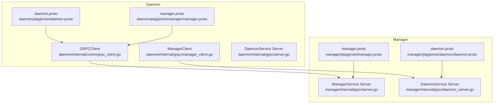
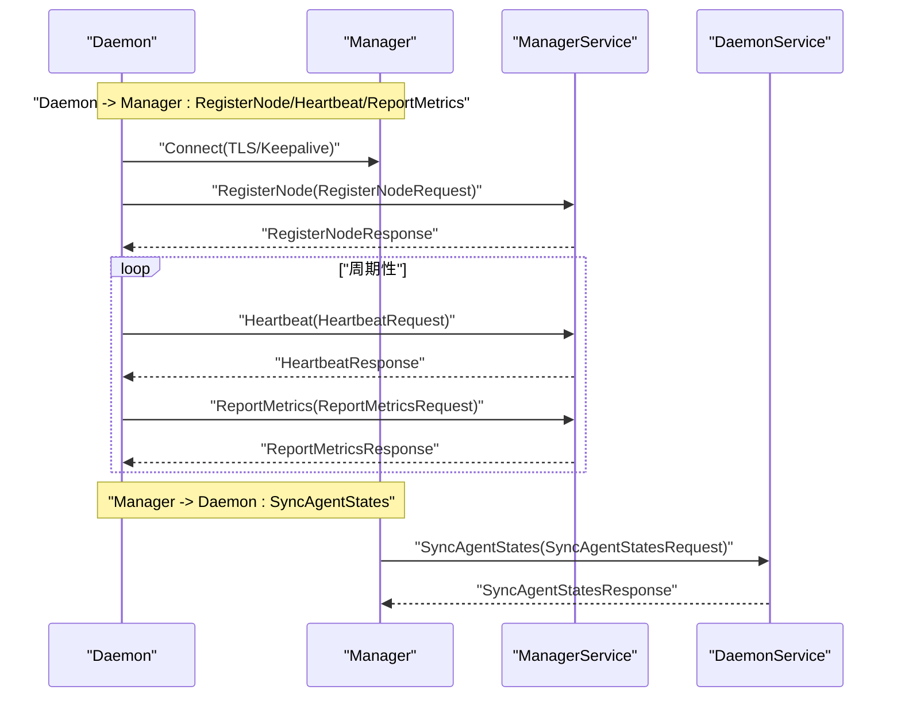
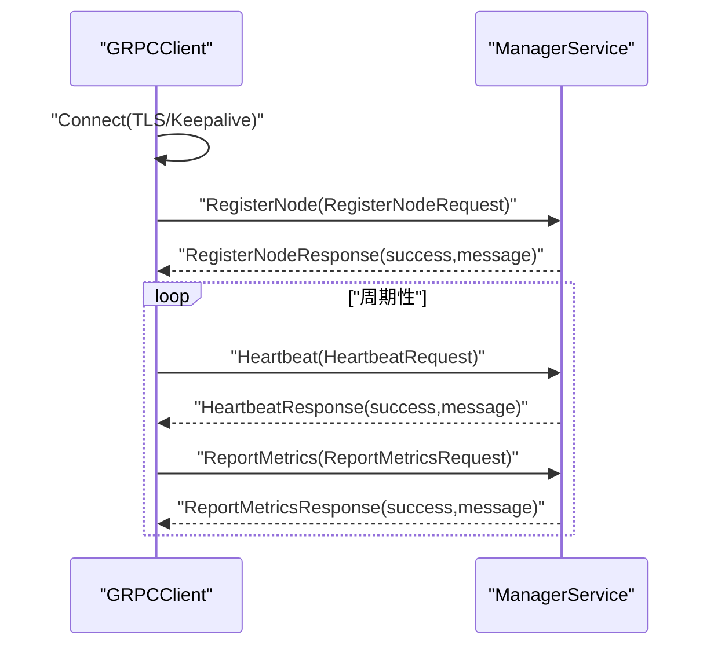
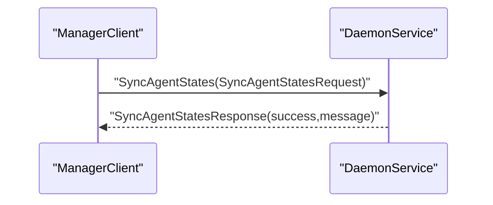
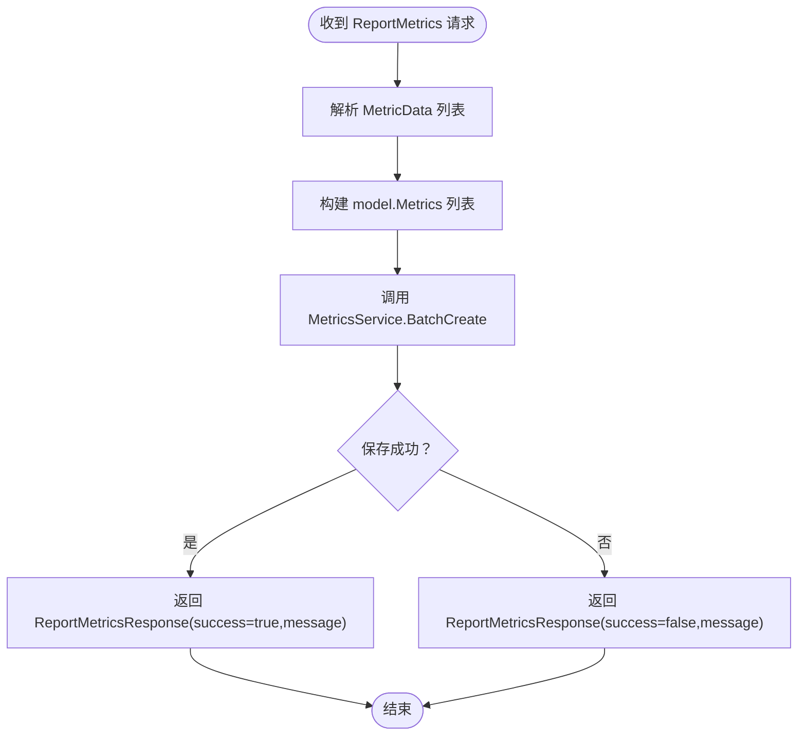
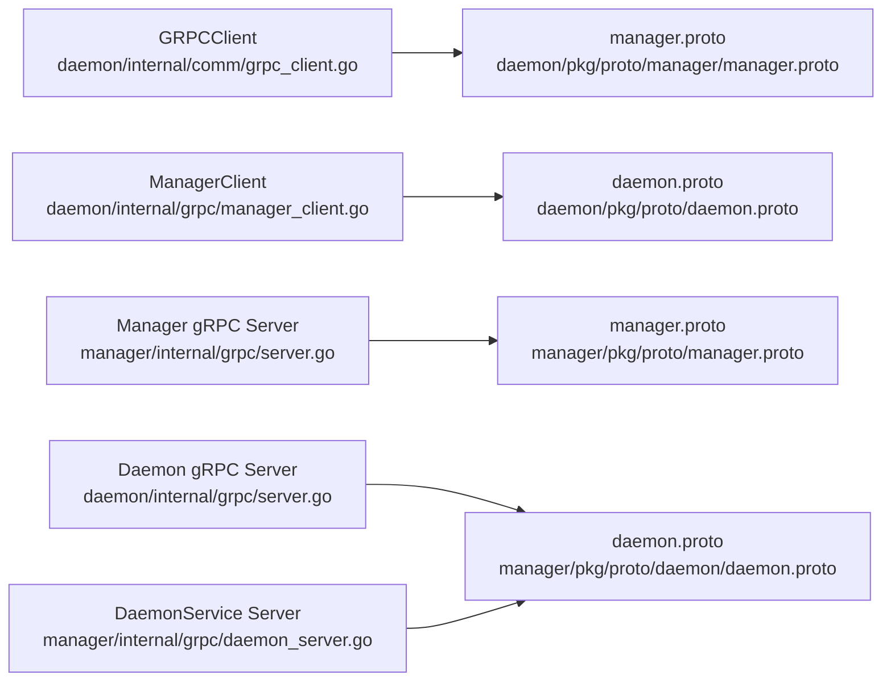

# gRPC 通信

<cite>
**本文引用的文件**
- [daemon/pkg/proto/manager/manager.proto](file://daemon/pkg/proto/manager/manager.proto)
- [manager/pkg/proto/daemon/daemon.proto](file://manager/pkg/proto/daemon/daemon.proto)
- [daemon/internal/comm/grpc_client.go](file://daemon/internal/comm/grpc_client.go)
- [daemon/internal/grpc/manager_client.go](file://daemon/internal/grpc/manager_client.go)
- [manager/internal/grpc/server.go](file://manager/internal/grpc/server.go)
- [manager/internal/grpc/daemon_server.go](file://manager/internal/grpc/daemon_server.go)
- [daemon/internal/grpc/server.go](file://daemon/internal/grpc/server.go)
- [daemon/configs/daemon.yaml](file://daemon/configs/daemon.yaml)
- [manager/configs/manager.yaml](file://manager/configs/manager.yaml)
- [daemon/test/integration/grpc_integration_test.go](file://daemon/test/integration/grpc_integration_test.go)
- [daemon/test/integration/grpc_test_helpers.go](file://daemon/test/integration/grpc_test_helpers.go)
- [manager/internal/grpc/errors.go](file://manager/internal/grpc/errors.go)
- [manager/internal/grpc/daemon_client.go](file://manager/internal/grpc/daemon_client.go)
</cite>

## 目录
1. [简介](#简介)
2. [项目结构](#项目结构)
3. [核心组件](#核心组件)
4. [架构总览](#架构总览)
5. [详细组件分析](#详细组件分析)
6. [依赖关系分析](#依赖关系分析)
7. [性能考量](#性能考量)
8. [故障排查指南](#故障排查指南)
9. [结论](#结论)
10. [附录](#附录)

## 简介
本文件聚焦于 Daemon 与 Manager 之间的 gRPC 双向通信机制，覆盖以下主题：
- Daemon 作为 gRPC 客户端（ManagerClient）如何与 Manager 建立安全的连接（TLS/Keepalive），并实现节点注册、心跳上报、指标推送与指令下发（通过 Manager 的 DaemonService）。
- Manager 作为 gRPC 服务端（DaemonService）的实现，包括 Register、Heartbeat、ReportMetrics 等 RPC 方法的处理逻辑与错误处理策略。
- 服务定义（.proto）详解，涵盖消息结构如 RegisterRequest、MetricsRequest 等字段含义。
- 结合 server.go 中的具体实现代码展示服务端如何验证请求、处理业务逻辑和返回响应。
- 提供通信时序图与错误处理策略，帮助开发者理解连接管理、重试机制与超时配置。

## 项目结构
围绕 gRPC 通信的关键文件分布如下：
- Daemon 端
  - gRPC 客户端：daemon/internal/comm/grpc_client.go（ManagerService 客户端）、daemon/internal/grpc/manager_client.go（DaemonService 客户端）
  - gRPC 服务端：daemon/internal/grpc/server.go（DaemonService 服务端）
  - 协议定义：daemon/pkg/proto/manager/manager.proto（ManagerService）、daemon/pkg/proto/daemon.proto（DaemonService）
- Manager 端
  - gRPC 服务端：manager/internal/grpc/server.go（ManagerService 服务端）、manager/internal/grpc/daemon_server.go（DaemonService 服务端）
  - 协议定义：manager/pkg/proto/daemon/daemon.proto（DaemonService）、manager/pkg/proto/manager.proto（ManagerService）
- 配置与测试
  - 配置文件：daemon/configs/daemon.yaml、manager/configs/manager.yaml
  - 集成测试：daemon/test/integration/grpc_integration_test.go、daemon/test/integration/grpc_test_helpers.go
  - 错误转换：manager/internal/grpc/errors.go
  - Manager 端客户端（反向连接）：manager/internal/grpc/daemon_client.go

图表来源
- [daemon/internal/comm/grpc_client.go](file://daemon/internal/comm/grpc_client.go#L1-L253)
- [daemon/internal/grpc/manager_client.go](file://daemon/internal/grpc/manager_client.go#L1-L155)
- [daemon/internal/grpc/server.go](file://daemon/internal/grpc/server.go#L1-L255)
- [manager/internal/grpc/server.go](file://manager/internal/grpc/server.go#L1-L145)
- [manager/internal/grpc/daemon_server.go](file://manager/internal/grpc/daemon_server.go#L1-L70)
- [daemon/pkg/proto/manager/manager.proto](file://daemon/pkg/proto/manager/manager.proto#L1-L68)
- [daemon/pkg/proto/daemon.proto](file://daemon/pkg/proto/daemon.proto#L1-L183)
- [manager/pkg/proto/daemon/daemon.proto](file://manager/pkg/proto/daemon/daemon.proto#L1-L184)
- [manager/pkg/proto/manager.proto](file://manager/pkg/proto/manager.proto#L1-L67)

章节来源
- [daemon/internal/comm/grpc_client.go](file://daemon/internal/comm/grpc_client.go#L1-L253)
- [daemon/internal/grpc/manager_client.go](file://daemon/internal/grpc/manager_client.go#L1-L155)
- [daemon/internal/grpc/server.go](file://daemon/internal/grpc/server.go#L1-L255)
- [manager/internal/grpc/server.go](file://manager/internal/grpc/server.go#L1-L145)
- [manager/internal/grpc/daemon_server.go](file://manager/internal/grpc/daemon_server.go#L1-L70)
- [daemon/pkg/proto/manager/manager.proto](file://daemon/pkg/proto/manager/manager.proto#L1-L68)
- [daemon/pkg/proto/daemon.proto](file://daemon/pkg/proto/daemon.proto#L1-L183)
- [manager/pkg/proto/daemon/daemon.proto](file://manager/pkg/proto/daemon/daemon.proto#L1-L184)
- [manager/pkg/proto/manager.proto](file://manager/pkg/proto/manager.proto#L1-L67)

## 核心组件
- Daemon 侧 gRPC 客户端（ManagerService 客户端）
  - 负责与 Manager 建立安全连接（TLS/Keepalive），并调用 RegisterNode、Heartbeat、ReportMetrics 等 RPC。
  - 关键实现参考：[Connect/Close/Register/Heartbeat/ReportMetrics](file://daemon/internal/comm/grpc_client.go#L41-L253)。
- Daemon 侧 gRPC 客户端（DaemonService 客户端）
  - 负责与 Manager 的 DaemonService 建立连接，调用 SyncAgentStates 等 RPC。
  - 关键实现参考：[Connect/SyncAgentStates](file://daemon/internal/grpc/manager_client.go#L40-L155)。
- Manager 侧 gRPC 服务端（ManagerService）
  - 实现 RegisterNode、Heartbeat、ReportMetrics，负责节点注册、心跳处理与指标入库。
  - 关键实现参考：[RegisterNode/Heartbeat/ReportMetrics](file://manager/internal/grpc/server.go#L34-L144)。
- Manager 侧 gRPC 服务端（DaemonService）
  - 实现 SyncAgentStates，用于接收 Daemon 上报的 Agent 状态。
  - 关键实现参考：[SyncAgentStates](file://manager/internal/grpc/daemon_server.go#L32-L69)。
- 协议定义
  - ManagerService（Daemon 调用）：[manager.proto](file://daemon/pkg/proto/manager/manager.proto#L1-L68)
  - DaemonService（Manager 调用）：[daemon.proto](file://manager/pkg/proto/daemon/daemon.proto#L1-L184)

章节来源
- [daemon/internal/comm/grpc_client.go](file://daemon/internal/comm/grpc_client.go#L41-L253)
- [daemon/internal/grpc/manager_client.go](file://daemon/internal/grpc/manager_client.go#L40-L155)
- [manager/internal/grpc/server.go](file://manager/internal/grpc/server.go#L34-L144)
- [manager/internal/grpc/daemon_server.go](file://manager/internal/grpc/daemon_server.go#L32-L69)
- [daemon/pkg/proto/manager/manager.proto](file://daemon/pkg/proto/manager/manager.proto#L1-L68)
- [manager/pkg/proto/daemon/daemon.proto](file://manager/pkg/proto/daemon/daemon.proto#L1-L184)

## 架构总览
Daemon 与 Manager 之间通过两条独立的 gRPC 通道协同工作：
- Daemon 作为客户端，向 Manager 的 ManagerService 发起注册、心跳、指标上报等请求。
- Manager 作为服务端，向 Daemon 的 DaemonService 发起状态同步等请求（反向通道）。

图表来源
- [daemon/internal/comm/grpc_client.go](file://daemon/internal/comm/grpc_client.go#L103-L175)
- [manager/internal/grpc/server.go](file://manager/internal/grpc/server.go#L34-L144)
- [manager/internal/grpc/daemon_server.go](file://manager/internal/grpc/daemon_server.go#L32-L69)
- [daemon/internal/grpc/manager_client.go](file://daemon/internal/grpc/manager_client.go#L102-L155)

## 详细组件分析

### 服务定义与消息结构（.proto）
- ManagerService（Daemon 调用）
  - RPC：RegisterNode、Heartbeat、ReportMetrics
  - 请求/响应消息：RegisterNodeRequest/RegisterNodeResponse、HeartbeatRequest/HeartbeatResponse、ReportMetricsRequest/ReportMetricsResponse
  - 字段含义（示例）：
    - RegisterNodeRequest：node_id、hostname、ip、os、arch、labels、daemon_version、agent_version
    - HeartbeatRequest：node_id、timestamp
    - ReportMetricsRequest：node_id、metrics（MetricData 列表，包含 type、timestamp、values）
  - 参考：[manager.proto](file://daemon/pkg/proto/manager/manager.proto#L1-L68)

- DaemonService（Manager 调用）
  - RPC：Register、Heartbeat、ReportMetrics、GetConfig、PushUpdate、ListAgents、OperateAgent、GetAgentMetrics、SyncAgentStates
  - 请求/响应消息：RegisterRequest/RegisterResponse、HeartbeatRequest/HeartbeatResponse、MetricsRequest/MetricsResponse、AgentInfo、AgentOperationRequest/AgentOperationResponse、AgentMetricsRequest/AgentMetricsResponse、SyncAgentStatesRequest/SyncAgentStatesResponse
  - 字段含义（示例）：
    - RegisterRequest：hostname、ip、os、arch、labels、daemon_version、agent_version
    - HeartbeatRequest：node_id、timestamp、status
    - MetricsRequest：node_id、timestamp、data（JSON）
    - AgentInfo：id、type、status、pid、version、start_time、restart_count、last_heartbeat
    - SyncAgentStatesRequest：node_id、states（AgentState 列表）
  - 参考：[daemon.proto](file://manager/pkg/proto/daemon/daemon.proto#L1-L184)

章节来源
- [daemon/pkg/proto/manager/manager.proto](file://daemon/pkg/proto/manager/manager.proto#L1-L68)
- [manager/pkg/proto/daemon/daemon.proto](file://manager/pkg/proto/daemon/daemon.proto#L1-L184)

### Daemon 作为 gRPC 客户端（ManagerService）
- 连接建立
  - 支持 TLS 与不安全连接两种模式；生产环境建议启用 TLS。
  - 使用 Keepalive 参数维持长连接健康。
  - 参考：[Connect](file://daemon/internal/comm/grpc_client.go#L41-L93)
- 节点注册
  - 构造 RegisterNodeRequest，调用 RegisterNode，解析 RegisterNodeResponse。
  - 参考：[Register](file://daemon/internal/comm/grpc_client.go#L103-L142)
- 心跳上报
  - 构造 HeartbeatRequest，调用 Heartbeat，校验 HeartbeatResponse.success。
  - 参考：[Heartbeat](file://daemon/internal/comm/grpc_client.go#L144-L175)
- 指标推送
  - 将内存指标转换为 MetricData 列表，构造 ReportMetricsRequest，调用 ReportMetrics，校验 ReportMetricsResponse.success。
  - 参考：[ReportMetrics](file://daemon/internal/comm/grpc_client.go#L177-L247)

图表来源
- [daemon/internal/comm/grpc_client.go](file://daemon/internal/comm/grpc_client.go#L41-L247)
- [manager/internal/grpc/server.go](file://manager/internal/grpc/server.go#L34-L144)

章节来源
- [daemon/internal/comm/grpc_client.go](file://daemon/internal/comm/grpc_client.go#L41-L247)
- [manager/internal/grpc/server.go](file://manager/internal/grpc/server.go#L34-L144)

### Daemon 作为 gRPC 客户端（DaemonService）
- 连接建立与状态同步
  - 与 Manager 的 DaemonService 建立连接，调用 SyncAgentStates 上报 Agent 状态。
  - 参考：[Connect/SyncAgentStates](file://daemon/internal/grpc/manager_client.go#L40-L155)

图表来源
- [daemon/internal/grpc/manager_client.go](file://daemon/internal/grpc/manager_client.go#L102-L155)
- [manager/internal/grpc/daemon_server.go](file://manager/internal/grpc/daemon_server.go#L32-L69)

章节来源
- [daemon/internal/grpc/manager_client.go](file://daemon/internal/grpc/manager_client.go#L40-L155)
- [manager/internal/grpc/daemon_server.go](file://manager/internal/grpc/daemon_server.go#L32-L69)

### Manager 作为 gRPC 服务端（ManagerService）
- 节点注册 RegisterNode
  - 解析请求，构建 Node 模型，调用 NodeService.Register，返回 RegisterNodeResponse。
  - 参考：[RegisterNode](file://manager/internal/grpc/server.go#L34-L72)
- 心跳 Heartbeat
  - 调用 NodeService.Heartbeat，返回 HeartbeatResponse。
  - 参考：[Heartbeat](file://manager/internal/grpc/server.go#L74-L97)
- 指标上报 ReportMetrics
  - 将 MetricData 转换为 model.Metrics，批量保存到 MetricsService，返回 ReportMetricsResponse。
  - 参考：[ReportMetrics](file://manager/internal/grpc/server.go#L99-L144)

图表来源
- [manager/internal/grpc/server.go](file://manager/internal/grpc/server.go#L99-L144)

章节来源
- [manager/internal/grpc/server.go](file://manager/internal/grpc/server.go#L34-L144)

### Manager 作为 gRPC 服务端（DaemonService）
- 状态同步 SyncAgentStates
  - 校验 node_id，调用 AgentService.SyncAgentStates，返回 SyncAgentStatesResponse。
  - 参考：[SyncAgentStates](file://manager/internal/grpc/daemon_server.go#L32-L69)

章节来源
- [manager/internal/grpc/daemon_server.go](file://manager/internal/grpc/daemon_server.go#L32-L69)

### Daemon 侧 gRPC 服务端（DaemonService）
- 列举 Agent、操作 Agent、获取 Agent 指标、同步 Agent 状态等 RPC（用于 Manager 调用 Daemon）。
- 参考：[daemon/internal/grpc/server.go](file://daemon/internal/grpc/server.go#L37-L211)

章节来源
- [daemon/internal/grpc/server.go](file://daemon/internal/grpc/server.go#L37-L211)

## 依赖关系分析
- Daemon 与 Manager 的协议文件相互独立但语义兼容，便于双方各自维护 proto 定义。
- Daemon 侧客户端依赖 gRPC 与 TLS 库，Manager 侧服务端依赖 NodeService/MetricsService。
- Manager 侧客户端（反向连接）用于与 Daemon 交互，具备连接状态检查与重连能力。

图表来源
- [daemon/internal/comm/grpc_client.go](file://daemon/internal/comm/grpc_client.go#L1-L253)
- [daemon/internal/grpc/manager_client.go](file://daemon/internal/grpc/manager_client.go#L1-L155)
- [manager/internal/grpc/server.go](file://manager/internal/grpc/server.go#L1-L145)
- [daemon/internal/grpc/server.go](file://daemon/internal/grpc/server.go#L1-L255)
- [manager/internal/grpc/daemon_server.go](file://manager/internal/grpc/daemon_server.go#L1-L70)
- [daemon/pkg/proto/manager/manager.proto](file://daemon/pkg/proto/manager/manager.proto#L1-L68)
- [daemon/pkg/proto/daemon.proto](file://daemon/pkg/proto/daemon.proto#L1-L183)
- [manager/pkg/proto/daemon/daemon.proto](file://manager/pkg/proto/daemon/daemon.proto#L1-L184)
- [manager/pkg/proto/manager.proto](file://manager/pkg/proto/manager.proto#L1-L67)

章节来源
- [daemon/internal/comm/grpc_client.go](file://daemon/internal/comm/grpc_client.go#L1-L253)
- [daemon/internal/grpc/manager_client.go](file://daemon/internal/grpc/manager_client.go#L1-L155)
- [manager/internal/grpc/server.go](file://manager/internal/grpc/server.go#L1-L145)
- [daemon/internal/grpc/server.go](file://daemon/internal/grpc/server.go#L1-L255)
- [manager/internal/grpc/daemon_server.go](file://manager/internal/grpc/daemon_server.go#L1-L70)
- [daemon/pkg/proto/manager/manager.proto](file://daemon/pkg/proto/manager/manager.proto#L1-L68)
- [daemon/pkg/proto/daemon.proto](file://daemon/pkg/proto/daemon.proto#L1-L183)
- [manager/pkg/proto/daemon/daemon.proto](file://manager/pkg/proto/daemon/daemon.proto#L1-L184)
- [manager/pkg/proto/manager.proto](file://manager/pkg/proto/manager.proto#L1-L67)

## 性能考量
- Keepalive
  - 客户端设置 Time/Timeout/PermitWithoutStream，有助于检测网络异常与维持连接活性。
  - 参考：[Connect](file://daemon/internal/comm/grpc_client.go#L75-L81)、[Connect](file://daemon/internal/grpc/manager_client.go#L74-L80)
- 超时
  - Manager 端客户端（反向连接）对 RPC 调用设置默认超时，避免阻塞。
  - 参考：[NewDaemonClient](file://manager/internal/grpc/daemon_client.go#L18-L59)、[ListAgents](file://manager/internal/grpc/daemon_client.go#L140-L162)
- 批量处理
  - 指标上报采用批量创建，减少数据库往返次数。
  - 参考：[ReportMetrics](file://manager/internal/grpc/server.go#L99-L144)
- 并发与重试
  - 集成测试展示了并发调用与错误恢复场景，建议在上层业务中结合指数退避进行重试。
  - 参考：[grpc_integration_test.go](file://daemon/test/integration/grpc_integration_test.go#L226-L346)

章节来源
- [daemon/internal/comm/grpc_client.go](file://daemon/internal/comm/grpc_client.go#L75-L81)
- [daemon/internal/grpc/manager_client.go](file://daemon/internal/grpc/manager_client.go#L74-L80)
- [manager/internal/grpc/daemon_client.go](file://manager/internal/grpc/daemon_client.go#L18-L59)
- [manager/internal/grpc/daemon_client.go](file://manager/internal/grpc/daemon_client.go#L140-L162)
- [manager/internal/grpc/server.go](file://manager/internal/grpc/server.go#L99-L144)
- [daemon/test/integration/grpc_integration_test.go](file://daemon/test/integration/grpc_integration_test.go#L226-L346)

## 故障排查指南
- TLS 配置问题
  - 若未配置证书，客户端会回退到不安全连接；生产环境务必启用 TLS。
  - 参考：[Connect](file://daemon/internal/comm/grpc_client.go#L46-L73)、[Connect](file://daemon/internal/grpc/manager_client.go#L45-L72)
- 连接断开与重连
  - Manager 端客户端具备连接状态检查与重连逻辑；Daemon 端客户端未内置自动重连，建议在上层业务中实现。
  - 参考：[ensureConnection](file://manager/internal/grpc/daemon_client.go#L74-L137)
- 错误码转换
  - 将 gRPC 状态码映射为业务错误，便于统一处理。
  - 参考：[convertGRPCError](file://manager/internal/grpc/errors.go#L18-L48)
- 超时与重试
  - 使用短超时上下文验证超时行为；建议在上层实现指数退避重试。
  - 参考：[TestGRPCIntegration_TimeoutAndRetry](file://daemon/test/integration/grpc_integration_test.go#L426-L485)
- 集成测试验证
  - 通过集成测试验证并发、错误恢复与超时场景。
  - 参考：[grpc_integration_test.go](file://daemon/test/integration/grpc_integration_test.go#L1-L485)

章节来源
- [daemon/internal/comm/grpc_client.go](file://daemon/internal/comm/grpc_client.go#L46-L73)
- [daemon/internal/grpc/manager_client.go](file://daemon/internal/grpc/manager_client.go#L45-L72)
- [manager/internal/grpc/daemon_client.go](file://manager/internal/grpc/daemon_client.go#L74-L137)
- [manager/internal/grpc/errors.go](file://manager/internal/grpc/errors.go#L18-L48)
- [daemon/test/integration/grpc_integration_test.go](file://daemon/test/integration/grpc_integration_test.go#L426-L485)

## 结论
- Daemon 与 Manager 通过两条独立的 gRPC 通道实现高效、安全的双向通信：Daemon 主动上报注册、心跳与指标，Manager 主动下发状态同步与指令。
- 服务端实现了完善的请求校验、业务处理与错误返回；客户端提供了 Keepalive 与 TLS 支持，建议在上层实现重试与自动重连。
- 协议定义清晰，字段含义明确，便于扩展与维护。

## 附录
- 配置文件要点
  - Daemon 端配置包含 Manager 地址、TLS、心跳间隔、重连间隔与超时。
    - 参考：[daemon.yaml](file://daemon/configs/daemon.yaml#L12-L21)
  - Manager 端配置包含 gRPC 服务主机、端口与 TLS。
    - 参考：[manager.yaml](file://manager/configs/manager.yaml#L28-L37)

章节来源
- [daemon/configs/daemon.yaml](file://daemon/configs/daemon.yaml#L12-L21)
- [manager/configs/manager.yaml](file://manager/configs/manager.yaml#L28-L37)