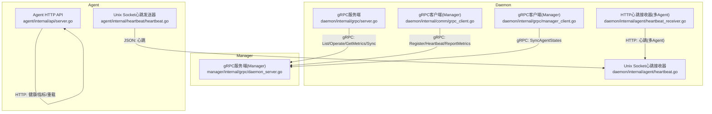
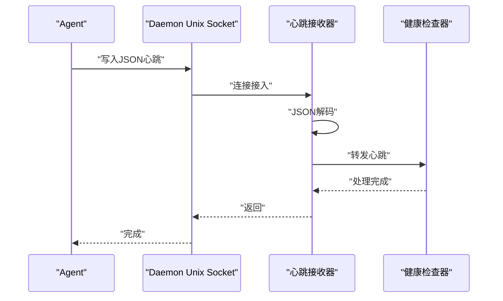
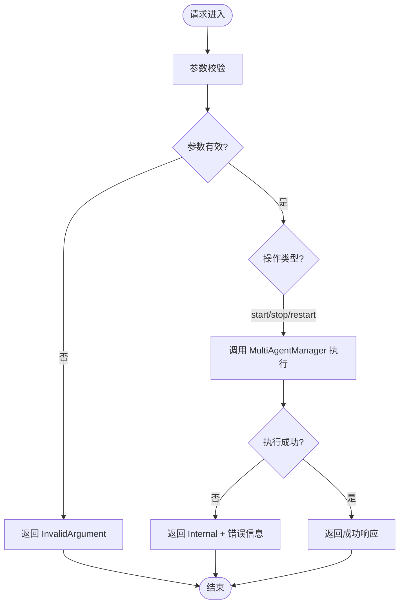
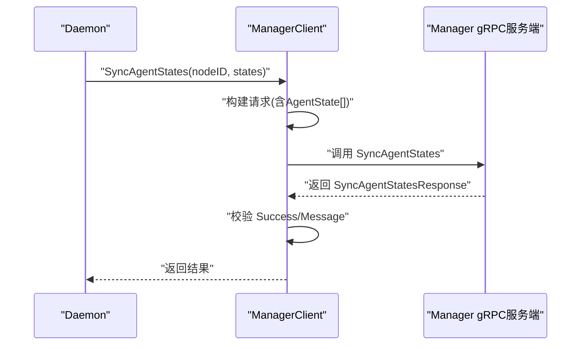
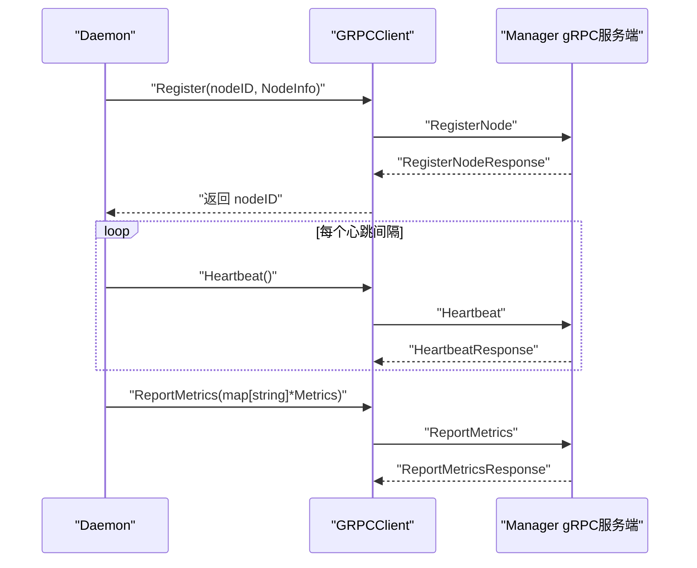
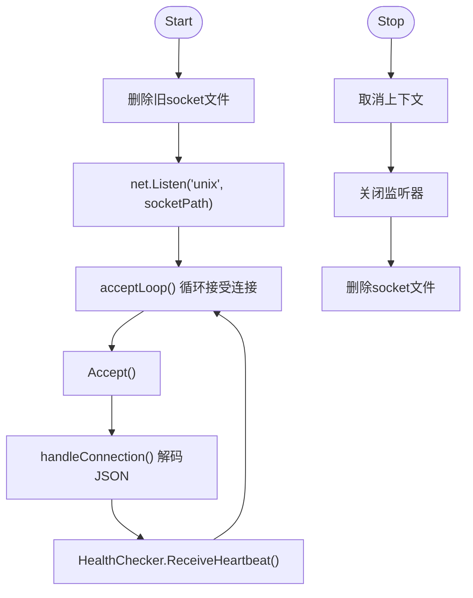
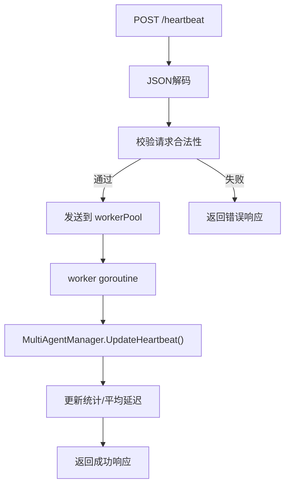
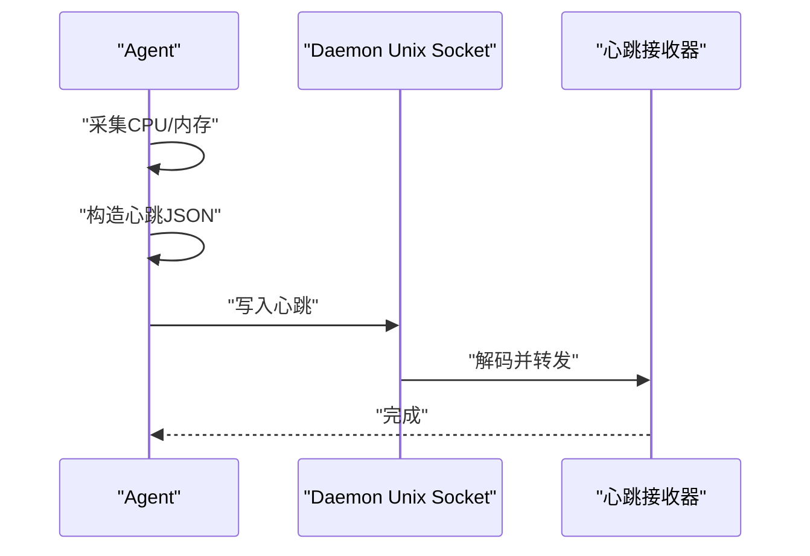
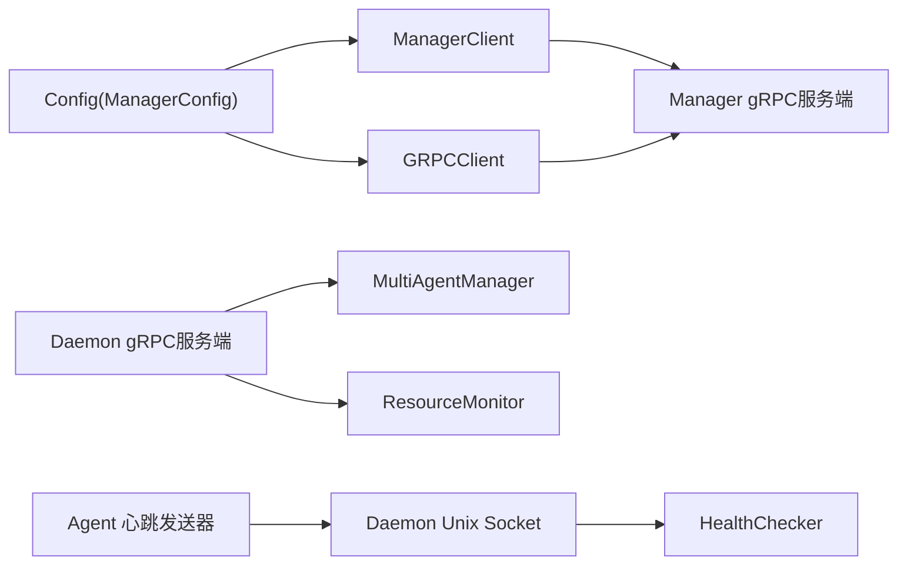

# 通信层

<cite>
**本文引用的文件**
- [daemon/internal/grpc/server.go](file://daemon/internal/grpc/server.go)
- [daemon/internal/grpc/manager_client.go](file://daemon/internal/grpc/manager_client.go)
- [daemon/internal/comm/grpc_client.go](file://daemon/internal/comm/grpc_client.go)
- [daemon/internal/agent/heartbeat.go](file://daemon/internal/agent/heartbeat.go)
- [daemon/internal/agent/heartbeat_receiver.go](file://daemon/internal/agent/heartbeat_receiver.go)
- [agent/internal/heartbeat/heartbeat.go](file://agent/internal/heartbeat/heartbeat.go)
- [agent/internal/api/server.go](file://agent/internal/api/server.go)
- [daemon/pkg/proto/daemon.proto](file://daemon/pkg/proto/daemon.proto)
- [daemon/pkg/proto/manager/manager.proto](file://daemon/pkg/proto/manager/manager.proto)
- [daemon/internal/config/config.go](file://daemon/internal/config/config.go)
- [daemon/test/integration/grpc_integration_test.go](file://daemon/test/integration/grpc_integration_test.go)
- [daemon/pkg/types/types.go](file://daemon/pkg/types/types.go)
</cite>

## 目录
1. [引言](#引言)
2. [项目结构](#项目结构)
3. [核心组件](#核心组件)
4. [架构总览](#架构总览)
5. [详细组件分析](#详细组件分析)
6. [依赖关系分析](#依赖关系分析)
7. [性能考量](#性能考量)
8. [故障排查指南](#故障排查指南)
9. [结论](#结论)
10. [附录](#附录)

## 引言
本章节聚焦Daemon的通信层设计，系统性阐述Daemon的双重通信职责：
- 与Manager的远程通信：通过gRPC，实现安全连接、指标上报、指令下发与状态同步。
- 与本地Agent的进程间通信：通过Unix Domain Socket，使用JSON格式进行心跳上报与状态交互。

文档将详细说明：
- gRPC客户端（ManagerClient）如何与Manager建立TLS安全连接，并上报指标、接收指令。
- gRPC服务端如何处理Manager的远程调用，包括列举Agent、操作Agent、获取指标、同步状态。
- Unix Socket服务器如何监听Agent的心跳消息，并使用JSON格式进行通信。
- 通信层架构图与gRPC服务定义（.proto），帮助开发者理解协议与数据格式。

## 项目结构
围绕通信层的关键目录与文件如下：
- gRPC服务端与客户端
  - 服务端：daemon/internal/grpc/server.go
  - Manager侧gRPC客户端：daemon/internal/grpc/manager_client.go
  - Daemon侧gRPC客户端：daemon/internal/comm/grpc_client.go
- gRPC协议定义
  - Daemon服务定义：daemon/pkg/proto/daemon.proto
  - Manager服务定义：daemon/pkg/proto/manager/manager.proto
- Unix Socket通信
  - Daemon侧心跳接收器（Unix Socket）：daemon/internal/agent/heartbeat.go
  - Daemon侧HTTP心跳接收器（多Agent场景）：daemon/internal/agent/heartbeat_receiver.go
  - Agent侧心跳发送器（Unix Socket）：agent/internal/heartbeat/heartbeat.go
  - Agent侧HTTP API（健康检查、指标暴露等）：agent/internal/api/server.go
- 配置与集成测试
  - 配置结构：daemon/internal/config/config.go
  - gRPC集成测试：daemon/test/integration/grpc_integration_test.go
  - 通用类型定义：daemon/pkg/types/types.go

图表来源
- [daemon/internal/grpc/server.go](file://daemon/internal/grpc/server.go#L1-L255)
- [daemon/internal/grpc/manager_client.go](file://daemon/internal/grpc/manager_client.go#L1-L155)
- [daemon/internal/comm/grpc_client.go](file://daemon/internal/comm/grpc_client.go#L1-L253)
- [daemon/internal/agent/heartbeat.go](file://daemon/internal/agent/heartbeat.go#L1-L122)
- [daemon/internal/agent/heartbeat_receiver.go](file://daemon/internal/agent/heartbeat_receiver.go#L1-L397)
- [agent/internal/heartbeat/heartbeat.go](file://agent/internal/heartbeat/heartbeat.go#L1-L228)
- [agent/internal/api/server.go](file://agent/internal/api/server.go#L1-L217)

章节来源
- [daemon/internal/grpc/server.go](file://daemon/internal/grpc/server.go#L1-L255)
- [daemon/internal/grpc/manager_client.go](file://daemon/internal/grpc/manager_client.go#L1-L155)
- [daemon/internal/comm/grpc_client.go](file://daemon/internal/comm/grpc_client.go#L1-L253)
- [daemon/internal/agent/heartbeat.go](file://daemon/internal/agent/heartbeat.go#L1-L122)
- [daemon/internal/agent/heartbeat_receiver.go](file://daemon/internal/agent/heartbeat_receiver.go#L1-L397)
- [agent/internal/heartbeat/heartbeat.go](file://agent/internal/heartbeat/heartbeat.go#L1-L228)
- [agent/internal/api/server.go](file://agent/internal/api/server.go#L1-L217)
- [daemon/pkg/proto/daemon.proto](file://daemon/pkg/proto/daemon.proto#L1-L183)
- [daemon/pkg/proto/manager/manager.proto](file://daemon/pkg/proto/manager/manager.proto#L1-L68)
- [daemon/internal/config/config.go](file://daemon/internal/config/config.go#L1-L499)
- [daemon/test/integration/grpc_integration_test.go](file://daemon/test/integration/grpc_integration_test.go#L1-L200)
- [daemon/pkg/types/types.go](file://daemon/pkg/types/types.go#L1-L111)

## 核心组件
- gRPC服务端（Daemon）
  - 提供列举Agent、操作Agent、获取Agent指标、同步Agent状态等服务。
  - 由MultiAgentManager与ResourceMonitor驱动业务逻辑。
- gRPC客户端（Manager）
  - 与Manager建立TLS安全连接（生产环境），或使用不安全连接（开发环境）。
  - 支持心跳上报、节点注册、指标上报、状态同步等。
- gRPC客户端（Daemon）
  - 与Manager建立TLS安全连接，上报心跳、注册节点、上报指标。
- Unix Socket心跳接收器（Daemon）
  - 监听Unix Socket，解码Agent发送的JSON心跳，交由健康检查器处理。
- HTTP心跳接收器（Daemon，多Agent）
  - 提供HTTP端点接收Agent心跳，采用工作池并发处理，具备统计与限流能力。
- Agent心跳发送器（Agent）
  - 通过Unix Socket周期性发送JSON心跳，包含CPU、内存、状态等信息。
- Agent HTTP API（Agent）
  - 提供健康检查、配置重载、指标暴露等HTTP接口，辅助外部监控与运维。

章节来源
- [daemon/internal/grpc/server.go](file://daemon/internal/grpc/server.go#L1-L255)
- [daemon/internal/grpc/manager_client.go](file://daemon/internal/grpc/manager_client.go#L1-L155)
- [daemon/internal/comm/grpc_client.go](file://daemon/internal/comm/grpc_client.go#L1-L253)
- [daemon/internal/agent/heartbeat.go](file://daemon/internal/agent/heartbeat.go#L1-L122)
- [daemon/internal/agent/heartbeat_receiver.go](file://daemon/internal/agent/heartbeat_receiver.go#L1-L397)
- [agent/internal/heartbeat/heartbeat.go](file://agent/internal/heartbeat/heartbeat.go#L1-L228)
- [agent/internal/api/server.go](file://agent/internal/api/server.go#L1-L217)

## 架构总览
Daemon的通信层分为两条主线：
- 远程通信（gRPC）
  - Manager侧：Daemon作为gRPC服务端，提供Agent生命周期与指标查询能力；Daemon作为gRPC客户端，向上游Manager上报节点信息、心跳与指标。
  - Manager侧：Daemon作为gRPC客户端，向下游Daemon发起指令（如下发更新、拉取配置等）。
- 本地通信（Unix Socket）
  - Agent通过Unix Socket向Daemon发送心跳（JSON格式），Daemon侧分别提供Unix Socket与HTTP两种心跳接收器，满足不同部署形态。

图表来源
- [agent/internal/heartbeat/heartbeat.go](file://agent/internal/heartbeat/heartbeat.go#L1-L228)
- [daemon/internal/agent/heartbeat.go](file://daemon/internal/agent/heartbeat.go#L1-L122)

章节来源
- [agent/internal/heartbeat/heartbeat.go](file://agent/internal/heartbeat/heartbeat.go#L1-L228)
- [daemon/internal/agent/heartbeat.go](file://daemon/internal/agent/heartbeat.go#L1-L122)

## 详细组件分析

### gRPC服务端（Daemon）
- 职责
  - 列举Agent：遍历MultiAgentManager中的Agent实例，组装AgentInfo并返回。
  - 操作Agent：校验agent_id与operation，调用MultiAgentManager执行start/stop/restart。
  - 获取Agent指标：根据agent_id与duration查询ResourceMonitor的历史数据。
  - 同步Agent状态：接收Manager上报的Agent状态列表，记录日志（完整逻辑在后续任务中实现）。
- 错误处理
  - 参数校验失败返回InvalidArgument。
  - Agent不存在返回NotFound。
  - 业务执行失败返回Internal并记录错误。
- 日志与可观测性
  - 对关键操作记录Info/Debug/Warn/Error日志，便于问题定位。

图表来源
- [daemon/internal/grpc/server.go](file://daemon/internal/grpc/server.go#L69-L124)

章节来源
- [daemon/internal/grpc/server.go](file://daemon/internal/grpc/server.go#L1-L255)

### gRPC客户端（Manager）
- 连接建立
  - 生产环境加载TLS证书与CA，配置最小TLS版本，启用keepalive。
  - 开发环境使用不安全连接并发出警告。
- 主要功能
  - SyncAgentStates：将Daemon侧收集的Agent状态列表上报至Manager。
  - 返回值校验：若响应不成功，记录日志并返回错误。
- 生命周期
  - Connect建立连接，Close关闭连接。

图表来源
- [daemon/internal/grpc/manager_client.go](file://daemon/internal/grpc/manager_client.go#L102-L155)

章节来源
- [daemon/internal/grpc/manager_client.go](file://daemon/internal/grpc/manager_client.go#L1-L155)

### gRPC客户端（Daemon）
- 连接建立
  - 与Manager建立TLS安全连接（生产）或不安全连接（开发），启用keepalive。
- 主要功能
  - Register：注册节点信息（主机名、IP、标签、版本等）。
  - Heartbeat：周期性发送心跳。
  - ReportMetrics：将指标数据转换为Manager的MetricData并上报。
- 错误处理
  - 未注册节点时报错。
  - gRPC调用失败记录错误并返回。

图表来源
- [daemon/internal/comm/grpc_client.go](file://daemon/internal/comm/grpc_client.go#L103-L247)

章节来源
- [daemon/internal/comm/grpc_client.go](file://daemon/internal/comm/grpc_client.go#L1-L253)
- [daemon/pkg/proto/manager/manager.proto](file://daemon/pkg/proto/manager/manager.proto#L1-L68)

### Unix Socket心跳接收器（Daemon）
- 监听与启动
  - 清理旧socket文件，创建Unix Socket监听器，启动接受循环。
- 连接处理
  - 接受连接后为每个连接启动goroutine，使用json解码器持续读取心跳。
  - 将心跳对象交给健康检查器处理。
- 停止与清理
  - 取消上下文，关闭监听器，清理socket文件。

图表来源
- [daemon/internal/agent/heartbeat.go](file://daemon/internal/agent/heartbeat.go#L38-L122)

章节来源
- [daemon/internal/agent/heartbeat.go](file://daemon/internal/agent/heartbeat.go#L1-L122)

### HTTP心跳接收器（Daemon，多Agent）
- 设计要点
  - 提供HTTP POST /heartbeat接收Agent心跳，采用工作池并发处理，具备统计与限流能力。
  - 支持校验请求合法性、转换时间戳、更新平均延迟等。
- 并发模型
  - workerCount个工作协程从workerPool通道消费心跳，处理完成后更新统计信息。
- 停止策略
  - 优雅关闭：关闭stopCh通知worker退出，等待正在处理的心跳完成。

图表来源
- [daemon/internal/agent/heartbeat_receiver.go](file://daemon/internal/agent/heartbeat_receiver.go#L116-L309)

章节来源
- [daemon/internal/agent/heartbeat_receiver.go](file://daemon/internal/agent/heartbeat_receiver.go#L1-L397)

### Agent心跳发送器（Agent）
- 心跳内容
  - 包含pid、timestamp、version、status、cpu、memory等字段。
- 发送机制
  - 周期性采集CPU与内存，序列化为JSON并写入Unix Socket。
  - 成功回调与失败回调用于更新Agent侧HTTP API的健康状态。
- 重连策略
  - 发送失败时尝试重连，保证心跳连续性。

图表来源
- [agent/internal/heartbeat/heartbeat.go](file://agent/internal/heartbeat/heartbeat.go#L108-L172)

章节来源
- [agent/internal/heartbeat/heartbeat.go](file://agent/internal/heartbeat/heartbeat.go#L1-L228)

### Agent HTTP API（Agent）
- 路由
  - GET /health：健康检查，基于最近心跳时间判断健康状态。
  - POST /reload：触发配置重载回调。
  - GET /metrics：暴露Agent指标（CPU、内存、心跳统计等）。
- 状态维护
  - UpdateHeartbeatStatus维护lastHeartbeat、心跳计数与失败计数，供健康检查使用。

章节来源
- [agent/internal/api/server.go](file://agent/internal/api/server.go#L1-L217)

## 依赖关系分析
- 组件耦合
  - gRPC服务端依赖MultiAgentManager与ResourceMonitor，实现业务逻辑。
  - gRPC客户端依赖配置结构ManagerConfig，按TLS开关选择传输凭证。
  - Unix Socket心跳接收器依赖HealthChecker，负责心跳处理。
  - Agent心跳发送器与Agent HTTP API相互配合，前者负责上报，后者负责对外暴露。
- 外部依赖
  - gRPC与TLS、keepalive参数来自第三方库。
  - JSON编解码用于Unix Socket与HTTP心跳。
- 循环依赖
  - 未发现直接循环依赖；各模块职责清晰，通过接口与结构体解耦。

图表来源
- [daemon/internal/config/config.go](file://daemon/internal/config/config.go#L1-L499)
- [daemon/internal/grpc/manager_client.go](file://daemon/internal/grpc/manager_client.go#L1-L155)
- [daemon/internal/comm/grpc_client.go](file://daemon/internal/comm/grpc_client.go#L1-L253)
- [daemon/internal/grpc/server.go](file://daemon/internal/grpc/server.go#L1-L255)
- [agent/internal/heartbeat/heartbeat.go](file://agent/internal/heartbeat/heartbeat.go#L1-L228)
- [daemon/internal/agent/heartbeat.go](file://daemon/internal/agent/heartbeat.go#L1-L122)

章节来源
- [daemon/internal/config/config.go](file://daemon/internal/config/config.go#L1-L499)
- [daemon/internal/grpc/manager_client.go](file://daemon/internal/grpc/manager_client.go#L1-L155)
- [daemon/internal/comm/grpc_client.go](file://daemon/internal/comm/grpc_client.go#L1-L253)
- [daemon/internal/grpc/server.go](file://daemon/internal/grpc/server.go#L1-L255)
- [agent/internal/heartbeat/heartbeat.go](file://agent/internal/heartbeat/heartbeat.go#L1-L228)
- [daemon/internal/agent/heartbeat.go](file://daemon/internal/agent/heartbeat.go#L1-L122)

## 性能考量
- gRPC长连接与keepalive
  - 客户端启用keepalive参数，降低网络抖动导致的连接中断风险。
- Unix Socket与HTTP心跳接收器
  - HTTP心跳接收器采用工作池并发处理，具备容量限制与丢弃策略，避免过载。
- 指标上报与历史查询
  - 指标上报采用JSON封装，历史查询支持时间窗口裁剪，减少数据量。
- 资源采集
  - Agent侧心跳发送器周期性采集CPU/内存，避免频繁系统调用带来的开销。

[本节为通用性能建议，无需列出具体文件来源]

## 故障排查指南
- gRPC连接失败
  - 检查ManagerConfig中的Address与TLS配置，确认证书文件存在且可读。
  - 在开发环境可临时使用不安全连接进行验证。
- 心跳上报异常
  - Agent侧检查Unix Socket路径与权限，确认Daemon已启动心跳接收器。
  - Daemon侧查看Unix Socket与HTTP心跳接收器的日志，定位解码与处理失败原因。
- 指标上报失败
  - 检查指标数据类型转换逻辑，确保数值字段可转换为浮点数。
  - 关注gRPC调用返回的Success/Message，结合日志定位问题。
- 状态同步失败
  - ManagerClient在收到非成功响应时会记录日志并返回错误，需检查Manager端日志与响应消息。

章节来源
- [daemon/internal/grpc/manager_client.go](file://daemon/internal/grpc/manager_client.go#L102-L155)
- [daemon/internal/comm/grpc_client.go](file://daemon/internal/comm/grpc_client.go#L177-L247)
- [daemon/internal/agent/heartbeat.go](file://daemon/internal/agent/heartbeat.go#L96-L122)
- [daemon/internal/agent/heartbeat_receiver.go](file://daemon/internal/agent/heartbeat_receiver.go#L116-L174)

## 结论
Daemon的通信层通过gRPC与Unix Socket实现了“远近兼顾”的双通道通信：
- 远程通信（gRPC）：安全可靠，支持节点注册、心跳、指标上报、Agent管理与状态同步。
- 本地通信（Unix Socket）：低延迟、高吞吐，适合Agent与Daemon之间的高频心跳上报。
配合配置驱动与完善的错误处理，整体架构具备良好的扩展性与可维护性。

[本节为总结性内容，无需列出具体文件来源]

## 附录

### gRPC服务定义（.proto）
- DaemonService（Daemon侧）
  - 提供Register、Heartbeat、ReportMetrics、GetConfig、PushUpdate、ListAgents、OperateAgent、GetAgentMetrics、SyncAgentStates等RPC。
- ManagerService（Manager侧）
  - 提供RegisterNode、Heartbeat、ReportMetrics等RPC。
- 关键消息类型
  - AgentInfo、AgentOperationRequest/Response、AgentMetricsRequest/Response、ResourceDataPoint、AgentState、SyncAgentStatesRequest/Response等。

章节来源
- [daemon/pkg/proto/daemon.proto](file://daemon/pkg/proto/daemon.proto#L1-L183)
- [daemon/pkg/proto/manager/manager.proto](file://daemon/pkg/proto/manager/manager.proto#L1-L68)

### 集成测试要点
- 使用真实gRPC服务端与客户端，验证ListAgents、OperateAgent、GetAgentMetrics等流程。
- 通过超时上下文与断言确保服务端响应正确。

章节来源
- [daemon/test/integration/grpc_integration_test.go](file://daemon/test/integration/grpc_integration_test.go#L1-L200)