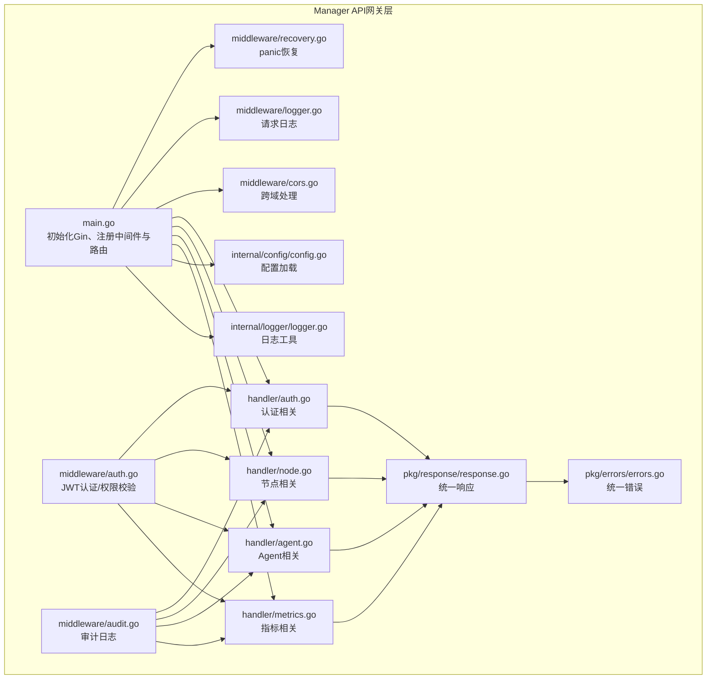
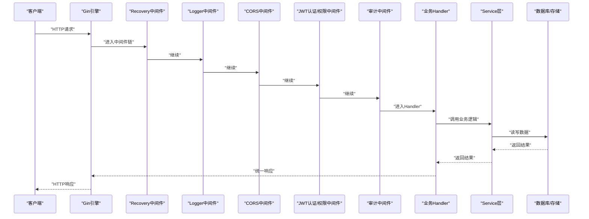
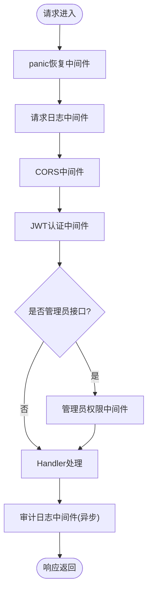
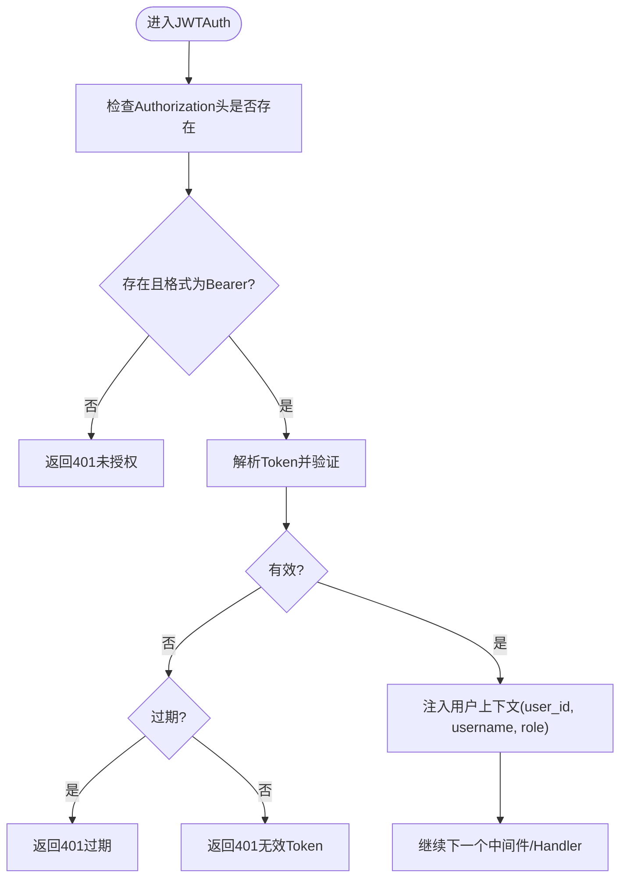
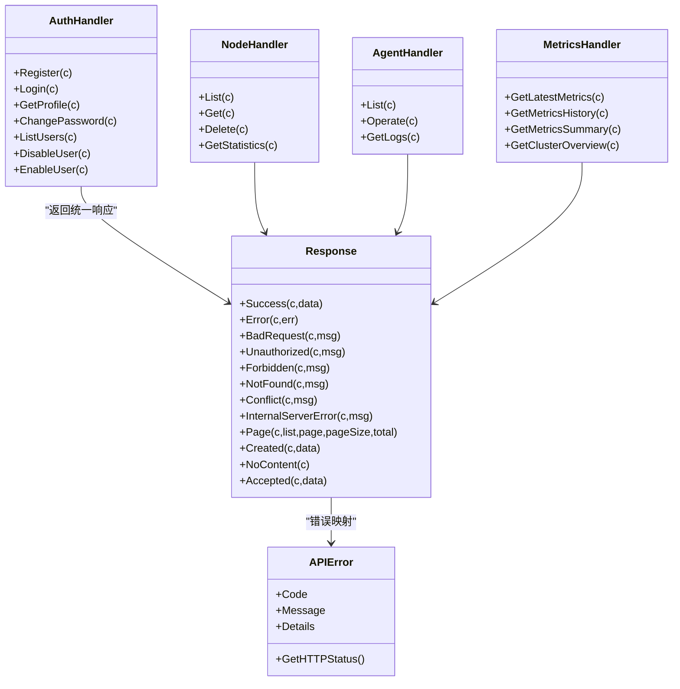
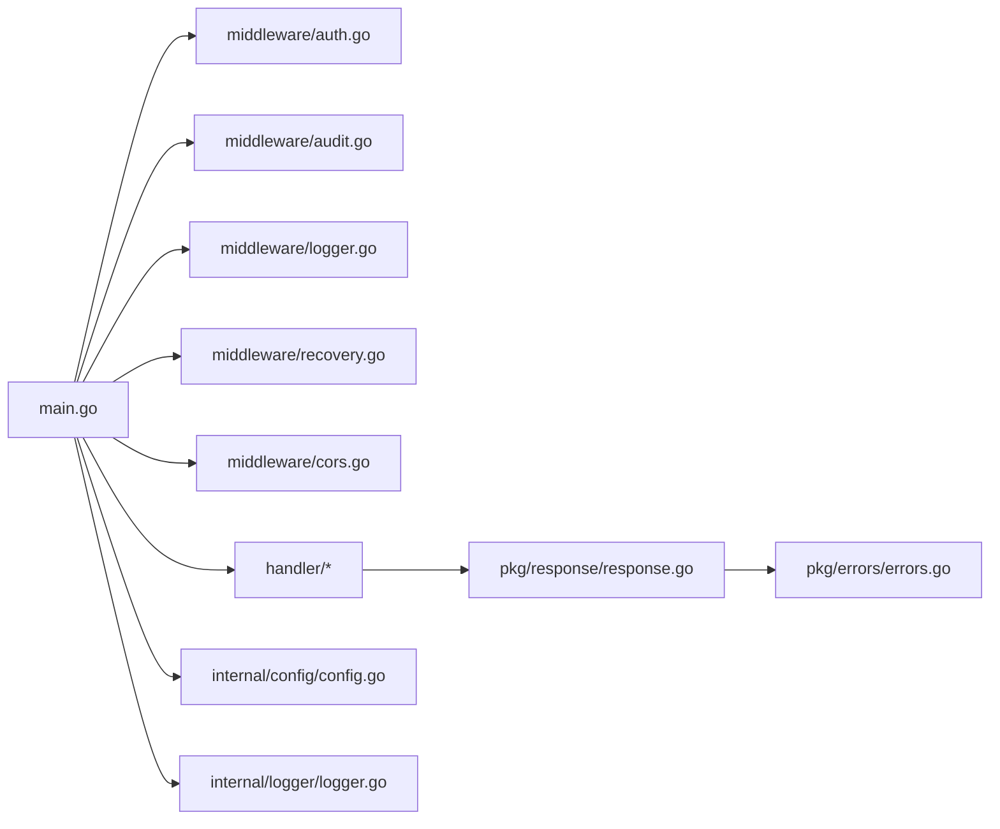

# API网关层

<cite>
**本文引用的文件**
- [main.go](file://manager/cmd/manager/main.go)
- [auth.go](file://manager/internal/middleware/auth.go)
- [cors.go](file://manager/internal/middleware/cors.go)
- [logger.go](file://manager/internal/middleware/logger.go)
- [recovery.go](file://manager/internal/middleware/recovery.go)
- [audit.go](file://manager/internal/middleware/audit.go)
- [auth_handler.go](file://manager/internal/handler/auth.go)
- [node_handler.go](file://manager/internal/handler/node.go)
- [agent_handler.go](file://manager/internal/handler/agent.go)
- [metrics_handler.go](file://manager/internal/handler/metrics.go)
- [response.go](file://manager/pkg/response/response.go)
- [errors.go](file://manager/pkg/errors/errors.go)
- [config.go](file://manager/internal/config/config.go)
- [logger_util.go](file://manager/internal/logger/logger.go)
</cite>

## 目录
1. [简介](#简介)
2. [项目结构](#项目结构)
3. [核心组件](#核心组件)
4. [架构总览](#架构总览)
5. [详细组件分析](#详细组件分析)
6. [依赖关系分析](#依赖关系分析)
7. [性能考量](#性能考量)
8. [故障排查指南](#故障排查指南)
9. [结论](#结论)

## 简介
本文件聚焦于Manager模块的API网关层，阐述其作为系统入口的职责与实现方式，包括HTTP路由分发、中间件处理链（认证、日志、CORS、审计）、请求响应生命周期管理，以及Gin框架的路由注册机制。文档还提供请求处理流程图，展示从客户端请求到Handler的完整路径，并讨论关键设计决策，例如为何选择Gin框架、中间件链的性能影响以及统一错误处理机制。

## 项目结构
Manager模块的API网关层位于cmd/manager/main.go中，通过Gin初始化路由与中间件，再将具体业务Handler挂载到路由上。Handler层负责参数校验、调用Service层并返回统一格式的响应；中间件层提供认证、日志、CORS、审计与错误恢复能力；统一响应与错误定义位于pkg/response与pkg/errors中；配置由internal/config加载。

图表来源
- [main.go](file://manager/cmd/manager/main.go#L135-L210)
- [auth.go](file://manager/internal/middleware/auth.go#L1-L98)
- [cors.go](file://manager/internal/middleware/cors.go#L1-L28)
- [logger.go](file://manager/internal/middleware/logger.go#L1-L36)
- [recovery.go](file://manager/internal/middleware/recovery.go#L1-L39)
- [audit.go](file://manager/internal/middleware/audit.go#L1-L50)
- [auth_handler.go](file://manager/internal/handler/auth.go#L1-L225)
- [node_handler.go](file://manager/internal/handler/node.go#L1-L157)
- [agent_handler.go](file://manager/internal/handler/agent.go#L1-L161)
- [metrics_handler.go](file://manager/internal/handler/metrics.go#L1-L210)
- [response.go](file://manager/pkg/response/response.go#L1-L145)
- [errors.go](file://manager/pkg/errors/errors.go#L1-L171)
- [config.go](file://manager/internal/config/config.go#L1-L262)
- [logger_util.go](file://manager/internal/logger/logger.go#L1-L115)

章节来源
- [main.go](file://manager/cmd/manager/main.go#L135-L210)
- [config.go](file://manager/internal/config/config.go#L1-L262)

## 核心组件
- Gin引擎与路由注册：在入口处初始化Gin引擎，设置运行模式，注册全局中间件，随后按公开与受保护两类API进行分组注册。
- 中间件链：
  - panic恢复：捕获panic并返回统一错误响应。
  - 请求日志：记录状态码、方法、路径、IP、User-Agent、耗时等。
  - CORS：允许指定来源与方法，处理预检请求。
  - JWT认证与权限：从Authorization头解析Bearer Token，校验并注入用户上下文；管理员权限校验。
  - 审计日志：异步记录用户操作行为，含耗时、状态码、IP等。
- Handler层：负责参数绑定与校验、调用Service层、返回统一响应。
- 统一响应与错误：定义统一响应结构与错误码体系，自动映射HTTP状态码。
- 配置与日志：集中加载配置，初始化zap日志，支持文件轮转与控制台输出。

章节来源
- [main.go](file://manager/cmd/manager/main.go#L135-L210)
- [auth.go](file://manager/internal/middleware/auth.go#L1-L98)
- [cors.go](file://manager/internal/middleware/cors.go#L1-L28)
- [logger.go](file://manager/internal/middleware/logger.go#L1-L36)
- [recovery.go](file://manager/internal/middleware/recovery.go#L1-L39)
- [audit.go](file://manager/internal/middleware/audit.go#L1-L50)
- [response.go](file://manager/pkg/response/response.go#L1-L145)
- [errors.go](file://manager/pkg/errors/errors.go#L1-L171)
- [config.go](file://manager/internal/config/config.go#L1-L262)
- [logger_util.go](file://manager/internal/logger/logger.go#L1-L115)

## 架构总览
下图展示了从客户端请求进入API网关，经过中间件链，再到具体Handler与Service层的整体流程。

图表来源
- [main.go](file://manager/cmd/manager/main.go#L135-L210)
- [auth.go](file://manager/internal/middleware/auth.go#L1-L98)
- [audit.go](file://manager/internal/middleware/audit.go#L1-L50)
- [logger.go](file://manager/internal/middleware/logger.go#L1-L36)
- [recovery.go](file://manager/internal/middleware/recovery.go#L1-L39)
- [auth_handler.go](file://manager/internal/handler/auth.go#L1-L225)
- [node_handler.go](file://manager/internal/handler/node.go#L1-L157)
- [agent_handler.go](file://manager/internal/handler/agent.go#L1-L161)
- [metrics_handler.go](file://manager/internal/handler/metrics.go#L1-L210)

## 详细组件分析

### Gin路由注册机制与分组
- 初始化与模式：设置Gin运行模式，创建router实例。
- 全局中间件：注册panic恢复、请求日志、CORS三个全局中间件。
- 健康检查：对外暴露健康检查接口。
- 公开API：无需认证，如登录、注册。
- 受保护API：通过JWT认证中间件与审计中间件保护；管理员权限通过RequireAdmin中间件进一步约束。
- 子路由：按模块划分，如/auth、/nodes、/metrics、/nodes/:node_id/agents等。

章节来源
- [main.go](file://manager/cmd/manager/main.go#L135-L210)

### 中间件链执行顺序与职责
- panic恢复（Recovery）：在最外层捕获panic，记录堆栈并返回统一500错误，防止进程崩溃。
- 请求日志（Logger）：记录请求开始时间、路径、查询参数、客户端IP、UA、耗时等，便于问题定位与性能分析。
- CORS：设置允许来源、方法、头部与凭证，对OPTIONS预检请求快速放行。
- JWT认证与权限（JWTAuth/RequireAdmin）：从Authorization头解析Bearer Token，校验有效性与过期；将用户信息注入上下文；管理员权限校验失败直接返回403。
- 审计日志（Audit）：在请求处理完成后异步记录用户ID、方法、路径、状态码、耗时、IP等，便于合规与追踪。

图表来源
- [main.go](file://manager/cmd/manager/main.go#L135-L210)
- [auth.go](file://manager/internal/middleware/auth.go#L1-L98)
- [audit.go](file://manager/internal/middleware/audit.go#L1-L50)
- [logger.go](file://manager/internal/middleware/logger.go#L1-L36)
- [recovery.go](file://manager/internal/middleware/recovery.go#L1-L39)
- [cors.go](file://manager/internal/middleware/cors.go#L1-L28)

章节来源
- [auth.go](file://manager/internal/middleware/auth.go#L1-L98)
- [audit.go](file://manager/internal/middleware/audit.go#L1-L50)
- [logger.go](file://manager/internal/middleware/logger.go#L1-L36)
- [recovery.go](file://manager/internal/middleware/recovery.go#L1-L39)
- [cors.go](file://manager/internal/middleware/cors.go#L1-L28)

### 认证中间件（JWTAuth/RequireAdmin）
- JWTAuth：从Authorization头解析Bearer Token，校验格式与有效性，过期返回特定错误，成功则将用户ID、用户名、角色注入上下文供后续Handler使用。
- RequireAdmin：从上下文读取角色，非admin直接返回403。
- Handler侧通过辅助函数从上下文获取用户信息，避免重复解析。

图表来源
- [auth.go](file://manager/internal/middleware/auth.go#L1-L98)

章节来源
- [auth.go](file://manager/internal/middleware/auth.go#L1-L98)

### 审计中间件（Audit）
- 在c.Next()之后异步记录审计日志，仅对已认证请求生效；记录方法、路径、状态码、耗时、IP等；异常时仅记录错误，不影响主流程。

章节来源
- [audit.go](file://manager/internal/middleware/audit.go#L1-L50)

### 日志中间件（Logger）
- 记录请求开始时间、路径、查询参数、客户端IP、UA、耗时与私有错误；便于问题定位与性能分析。

章节来源
- [logger.go](file://manager/internal/middleware/logger.go#L1-L36)

### CORS中间件（CORS）
- 设置允许来源、方法、头部与凭证；对OPTIONS方法快速返回204，减少预检开销。

章节来源
- [cors.go](file://manager/internal/middleware/cors.go#L1-L28)

### 错误恢复中间件（Recovery）
- 捕获panic，记录错误与堆栈，返回统一500响应，确保服务稳定性。

章节来源
- [recovery.go](file://manager/internal/middleware/recovery.go#L1-L39)

### Handler层与统一响应/错误
- Handler负责参数绑定与校验、调用Service层、返回统一响应；错误通过统一错误码映射HTTP状态码。
- 统一响应结构包含code、message、data、timestamp；分页数据包含list与page_info。

图表来源
- [auth_handler.go](file://manager/internal/handler/auth.go#L1-L225)
- [node_handler.go](file://manager/internal/handler/node.go#L1-L157)
- [agent_handler.go](file://manager/internal/handler/agent.go#L1-L161)
- [metrics_handler.go](file://manager/internal/handler/metrics.go#L1-L210)
- [response.go](file://manager/pkg/response/response.go#L1-L145)
- [errors.go](file://manager/pkg/errors/errors.go#L1-L171)

章节来源
- [auth_handler.go](file://manager/internal/handler/auth.go#L1-L225)
- [node_handler.go](file://manager/internal/handler/node.go#L1-L157)
- [agent_handler.go](file://manager/internal/handler/agent.go#L1-L161)
- [metrics_handler.go](file://manager/internal/handler/metrics.go#L1-L210)
- [response.go](file://manager/pkg/response/response.go#L1-L145)
- [errors.go](file://manager/pkg/errors/errors.go#L1-L171)

## 依赖关系分析
- 入口依赖：main.go依赖中间件、Handler、配置与日志工具，完成初始化与路由注册。
- 中间件依赖：JWT认证依赖JWT管理器；审计依赖审计仓库；日志与恢复依赖zap；CORS为纯HTTP头处理。
- Handler依赖：Handler依赖Service层与统一响应/错误；部分Handler依赖中间件提供的上下文信息。
- 统一响应/错误：统一错误码映射HTTP状态码，Handler与中间件均通过统一响应封装返回。

图表来源
- [main.go](file://manager/cmd/manager/main.go#L135-L210)
- [auth.go](file://manager/internal/middleware/auth.go#L1-L98)
- [audit.go](file://manager/internal/middleware/audit.go#L1-L50)
- [logger.go](file://manager/internal/middleware/logger.go#L1-L36)
- [recovery.go](file://manager/internal/middleware/recovery.go#L1-L39)
- [cors.go](file://manager/internal/middleware/cors.go#L1-L28)
- [auth_handler.go](file://manager/internal/handler/auth.go#L1-L225)
- [node_handler.go](file://manager/internal/handler/node.go#L1-L157)
- [agent_handler.go](file://manager/internal/handler/agent.go#L1-L161)
- [metrics_handler.go](file://manager/internal/handler/metrics.go#L1-L210)
- [response.go](file://manager/pkg/response/response.go#L1-L145)
- [errors.go](file://manager/pkg/errors/errors.go#L1-L171)
- [config.go](file://manager/internal/config/config.go#L1-L262)
- [logger_util.go](file://manager/internal/logger/logger.go#L1-L115)

章节来源
- [main.go](file://manager/cmd/manager/main.go#L135-L210)
- [response.go](file://manager/pkg/response/response.go#L1-L145)
- [errors.go](file://manager/pkg/errors/errors.go#L1-L171)

## 性能考量
- 中间件链顺序：Recovery置于首位，避免后续中间件panic导致的不可控；Logger/CORS/JWT/Audit依次执行，尽量保持轻量与无阻塞。
- 审计日志异步化：审计中间件在c.Next()后异步落库，避免阻塞主请求路径。
- CORS预检快速放行：对OPTIONS方法直接返回204，减少跨域预检开销。
- 日志与错误恢复：zap日志采用JSON编码与文件轮转，兼顾可观测性与磁盘占用；panic恢复保证服务稳定性。
- Handler参数校验：使用Gin内置绑定与校验，减少无效请求进入业务逻辑的成本。

[本节为通用性能建议，不直接分析具体文件]

## 故障排查指南
- 401/403/404错误：检查JWT认证中间件是否正确解析Authorization头；确认Token是否过期或无效；管理员接口需具备admin角色。
- 500内部错误：查看panic恢复中间件日志中的堆栈信息；确认Handler是否抛出未捕获异常。
- 跨域问题：确认CORS中间件是否正确设置Allow-Origin与Allow-Headers；预检请求是否被快速放行。
- 审计日志缺失：确认审计中间件是否在c.Next()后执行；检查审计仓库是否可用；注意异步落库的潜在失败不影响主流程。
- 统一响应异常：检查统一错误码映射是否符合预期；确认Handler是否正确使用统一响应函数。

章节来源
- [auth.go](file://manager/internal/middleware/auth.go#L1-L98)
- [audit.go](file://manager/internal/middleware/audit.go#L1-L50)
- [logger.go](file://manager/internal/middleware/logger.go#L1-L36)
- [recovery.go](file://manager/internal/middleware/recovery.go#L1-L39)
- [response.go](file://manager/pkg/response/response.go#L1-L145)
- [errors.go](file://manager/pkg/errors/errors.go#L1-L171)

## 结论
Manager模块的API网关层以Gin为核心，构建了清晰的中间件链与Handler层分工。通过统一响应与错误体系、严格的认证与审计机制，以及合理的性能优化策略，实现了高可用、可观测、易维护的API入口。中间件链顺序与职责明确，Handler层专注业务逻辑，配合统一响应/错误与配置/日志工具，形成完整的系统入口设计。