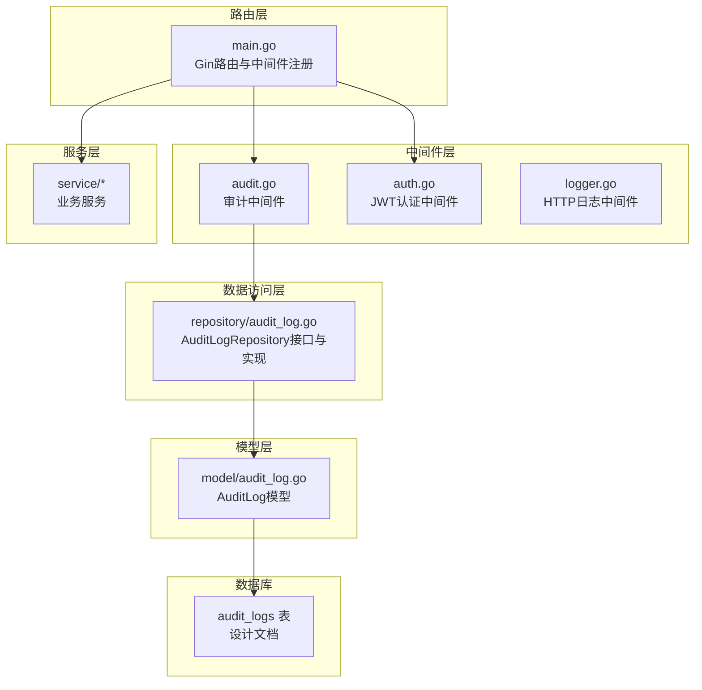
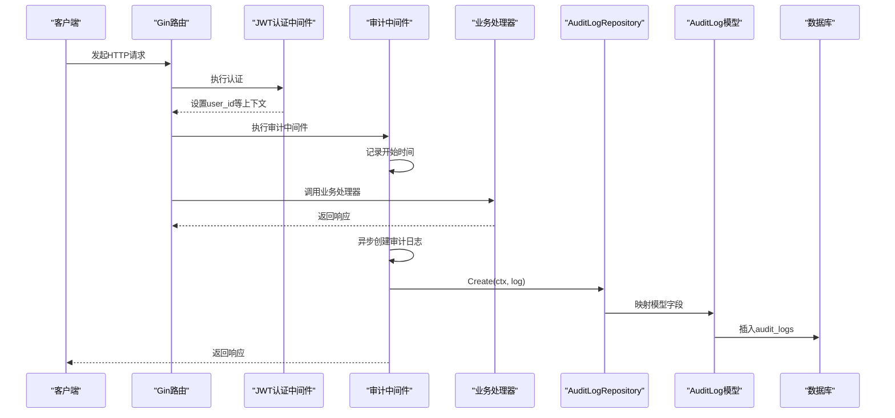
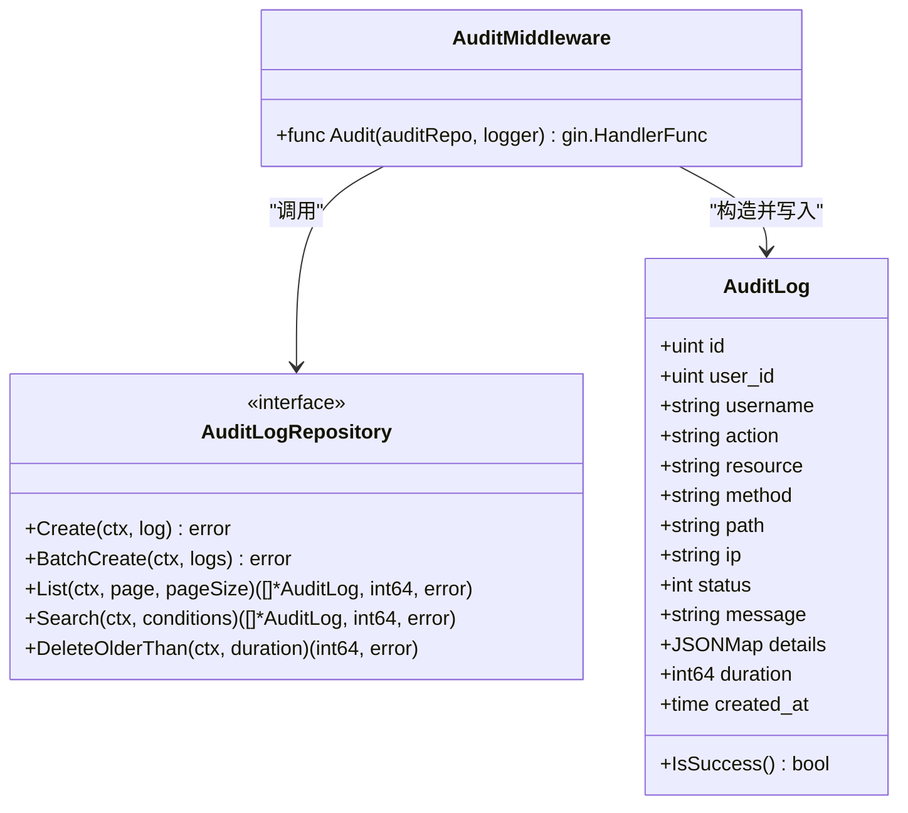

# 审计日志中间件

<cite>
**本文引用的文件**
- [audit.go](file://manager/internal/middleware/audit.go)
- [audit_log.go（模型）](file://manager/internal/model/audit_log.go)
- [audit_log.go（仓库接口与实现）](file://manager/internal/repository/audit_log.go)
- [main.go](file://manager/cmd/manager/main.go)
- [auth.go（JWT认证中间件）](file://manager/internal/middleware/auth.go)
- [logger.go（HTTP日志中间件）](file://manager/internal/middleware/logger.go)
- [design.md（审计日志表结构）](file://docs/设计文档_03_Manager模块.md)
</cite>

## 目录
1. [简介](#简介)
2. [项目结构](#项目结构)
3. [核心组件](#核心组件)
4. [架构总览](#架构总览)
5. [组件详解](#组件详解)
6. [依赖关系分析](#依赖关系分析)
7. [性能优化策略](#性能优化策略)
8. [故障排查指南](#故障排查指南)
9. [结论](#结论)
10. [附录](#附录)

## 简介
本文件围绕审计中间件 audit.go 的实现，系统阐述其如何记录所有管理操作的审计日志，覆盖记录内容（操作用户、请求路径、操作类型、请求参数、时间戳）、与数据访问层 repository 的协作机制、以及与模型 model 的映射关系。同时给出性能优化建议（异步写入、批量提交），并提供审计日志查询接口的使用示例与合规性建议。

## 项目结构
审计中间件位于 manager 子模块的 middleware 层，配合 repository 层的数据持久化与 model 层的实体定义，共同构成完整的审计日志能力。路由层面通过 Gin 中间件链路挂载认证与审计中间件，确保仅对已认证的管理操作进行审计记录。

图表来源
- [audit.go](file://manager/internal/middleware/audit.go#L1-L49)
- [auth.go](file://manager/internal/middleware/auth.go#L1-L60)
- [logger.go](file://manager/internal/middleware/logger.go#L1-L36)
- [main.go](file://manager/cmd/manager/main.go#L135-L210)
- [audit_log.go（仓库接口与实现）](file://manager/internal/repository/audit_log.go#L1-L120)
- [audit_log.go（模型）](file://manager/internal/model/audit_log.go#L1-L36)
- [design.md](file://docs/设计文档_03_Manager模块.md#L574-L597)

章节来源
- [audit.go](file://manager/internal/middleware/audit.go#L1-L49)
- [main.go](file://manager/cmd/manager/main.go#L135-L210)

## 核心组件
- 审计中间件：在请求处理完成后异步记录审计日志，包含用户ID、HTTP方法、请求路径、IP、状态码、耗时等关键信息。
- 数据访问层：提供审计日志的单条创建、批量创建、按条件查询、统计与清理等能力。
- 模型层：定义审计日志实体，包含冗余字段（用户名）便于查询；支持 JSON 字段存储详细信息。
- 路由与中间件：在 Gin 路由上注册认证中间件与审计中间件，确保仅对已认证的管理操作记录审计日志。

章节来源
- [audit.go](file://manager/internal/middleware/audit.go#L1-L49)
- [audit_log.go（仓库接口与实现）](file://manager/internal/repository/audit_log.go#L1-L120)
- [audit_log.go（模型）](file://manager/internal/model/audit_log.go#L1-L36)
- [main.go](file://manager/cmd/manager/main.go#L135-L210)

## 架构总览
审计中间件通过 Gin 中间件链路工作：先执行认证中间件（JWT），再执行审计中间件，最后进入业务处理器。审计中间件在 c.Next() 之后异步写入数据库，避免阻塞主请求链路。

图表来源
- [audit.go](file://manager/internal/middleware/audit.go#L1-L49)
- [auth.go](file://manager/internal/middleware/auth.go#L1-L60)
- [audit_log.go（仓库接口与实现）](file://manager/internal/repository/audit_log.go#L53-L61)
- [audit_log.go（模型）](file://manager/internal/model/audit_log.go#L1-L36)
- [main.go](file://manager/cmd/manager/main.go#L160-L170)

## 组件详解

### 审计中间件（audit.go）
- 触发时机：在 c.Next() 之后执行，确保能拿到最终的状态码与耗时。
- 用户识别：从 Gin 上下文中读取 user_id，未认证则跳过记录。
- 记录内容：
  - 操作用户：UserID（来自认证中间件）
  - 操作类型：HTTP 方法（Method）
  - 请求路径：Path（URL.Path）
  - IP 地址：ClientIP
  - 状态码：Writer.Status
  - 耗时：毫秒级 duration
- 异步写入：使用 goroutine 在后台写入，避免阻塞主请求链路。
- 错误处理：写入失败时通过 zap 日志记录错误，不影响主流程。

章节来源
- [audit.go](file://manager/internal/middleware/audit.go#L1-L49)

### 数据访问层（repository/AuditLogRepository）
- 接口职责：提供审计日志的创建、批量创建、按条件查询、统计与清理等能力。
- 查询能力：
  - 按ID、用户ID、操作类型、资源、时间范围、IP、状态等条件查询
  - 支持分页与总数统计
  - 支持多条件组合搜索
- 统计能力：按操作类型与用户维度统计数量
- 清理能力：按时间阈值删除旧日志

章节来源
- [audit_log.go（仓库接口与实现）](file://manager/internal/repository/audit_log.go#L1-L120)
- [audit_log.go（仓库接口与实现）](file://manager/internal/repository/audit_log.go#L120-L210)
- [audit_log.go（仓库接口与实现）](file://manager/internal/repository/audit_log.go#L210-L320)

### 模型层（model/AuditLog）
- 字段设计：
  - 用户标识：UserID、Username（冗余字段，便于查询）
  - 操作标识：Action（HTTP方法）、Method、Path
  - 资源标识：Resource（可扩展为“资源类型:资源ID”）
  - 结果信息：Status、Message
  - 详细信息：Details（JSONMap，用于存储请求参数等结构化信息）
  - 性能指标：Duration（毫秒）
  - 时间戳：CreatedAt
- 辅助方法：IsSuccess 判断操作是否成功

章节来源
- [audit_log.go（模型）](file://manager/internal/model/audit_log.go#L1-L36)

### 路由与中间件注册（main.go）
- 全局中间件：Recovery、Logger、CORS
- 认证中间件：JWTAuth（在/api/v1组生效）
- 审计中间件：Audit（在/api/v1组生效）
- 仅对已认证的管理操作记录审计日志，避免公开接口产生噪音

章节来源
- [main.go](file://manager/cmd/manager/main.go#L135-L210)

### 认证中间件（auth.go）
- 从 Authorization 头解析 Bearer Token
- 解析成功后将 user_id、username、role 写入上下文
- 为审计中间件提供用户标识

章节来源
- [auth.go](file://manager/internal/middleware/auth.go#L1-L60)

### HTTP日志中间件（logger.go）
- 记录请求路径、查询参数、状态码、耗时、IP、User-Agent、错误信息等
- 与审计中间件互补：前者关注请求生命周期日志，后者关注操作审计

章节来源
- [logger.go](file://manager/internal/middleware/logger.go#L1-L36)

### 审计日志表结构（设计文档）
- 表名：audit_logs
- 关键字段：user_id、username、action、resource_type、resource_id、detail、ip、user_agent、status、error_message、created_at
- 索引：user_id、action、resource_type+resource_id、created_at
- 用途：支撑审计查询、统计与合规留存

章节来源
- [design.md](file://docs/设计文档_03_Manager模块.md#L574-L597)

## 依赖关系分析
- 审计中间件依赖：
  - repository.AuditLogRepository 接口（用于持久化）
  - model.AuditLog 模型（用于数据结构）
  - Gin 上下文（获取 user_id、状态码、路径、IP 等）
  - zap 日志（记录写入异常）
- 路由注册顺序影响审计范围：JWTAuth 必须在 Audit 之前，确保 user_id 已注入上下文。

图表来源
- [audit.go](file://manager/internal/middleware/audit.go#L1-L49)
- [audit_log.go（仓库接口与实现）](file://manager/internal/repository/audit_log.go#L1-L120)
- [audit_log.go（模型）](file://manager/internal/model/audit_log.go#L1-L36)

章节来源
- [audit.go](file://manager/internal/middleware/audit.go#L1-L49)
- [audit_log.go（仓库接口与实现）](file://manager/internal/repository/audit_log.go#L1-L120)
- [audit_log.go（模型）](file://manager/internal/model/audit_log.go#L1-L36)

## 性能优化策略
- 异步写入：审计中间件已采用 goroutine 异步写入，避免阻塞主请求链路。建议：
  - 限制并发写入速率，防止瞬时高并发导致数据库压力过大
  - 对异常进行重试与退避，必要时引入本地队列缓冲
- 批量提交：仓库层已提供 BatchCreate 接口，建议：
  - 在审计中间件侧维护一个轻量的环形缓冲区，达到阈值或超时后批量写入
  - 批量大小与超时时间根据吞吐量与延迟目标动态调整
- 数据库连接池：确保数据库连接池配置合理（最大空闲、最大活跃、连接生命周期），避免写入成为瓶颈
- 索引与分区：根据审计查询热点建立合适索引；对历史表进行分区或归档，降低查询成本
- JSON字段压缩：对 details 字段中的大对象进行压缩或裁剪，减少存储与IO开销
- 采样与降噪：对高频接口（如心跳、监控拉取）进行采样，降低审计日志体量

章节来源
- [audit.go](file://manager/internal/middleware/audit.go#L1-L49)
- [audit_log.go（仓库接口与实现）](file://manager/internal/repository/audit_log.go#L53-L61)

## 故障排查指南
- 未记录审计日志
  - 检查是否已注册 JWTAuth 与 Audit 中间件，且顺序正确
  - 确认请求是否已认证，上下文中是否存在 user_id
- 写入失败
  - 查看 zap 日志中“failed to create audit log”错误
  - 检查数据库连接、表结构、索引与权限
- 查询性能差
  - 确认查询条件是否命中索引（user_id、action、resource、created_at）
  - 对时间范围查询使用合适的边界与索引
- 数据量增长过快
  - 使用 DeleteOlderThan 清理历史数据
  - 调整保留周期与清理策略

章节来源
- [audit.go](file://manager/internal/middleware/audit.go#L1-L49)
- [audit_log.go（仓库接口与实现）](file://manager/internal/repository/audit_log.go#L273-L282)
- [main.go](file://manager/cmd/manager/main.go#L160-L170)

## 结论
审计中间件通过 Gin 中间件链路实现了对管理操作的无侵入审计，记录关键操作信息并异步落库。结合仓库层的查询、统计与清理能力，能够满足合规审计与运营追踪的需求。建议进一步引入批量提交、限流与重试、索引优化与数据归档等策略，持续提升性能与稳定性。

## 附录

### 审计日志记录内容清单
- 操作用户：UserID（来自认证中间件）
- 操作类型：HTTP 方法（Method）
- 请求路径：Path（URL.Path）
- IP 地址：ClientIP
- 状态码：Writer.Status
- 耗时：毫秒级 duration
- 详细信息：details（JSONMap，用于存储请求参数等结构化信息）

章节来源
- [audit.go](file://manager/internal/middleware/audit.go#L1-L49)
- [audit_log.go（模型）](file://manager/internal/model/audit_log.go#L1-L36)

### 与数据访问层和模型的协作机制
- 审计中间件构造 model.AuditLog 实例
- 通过 repository.AuditLogRepository 接口调用 Create 或 BatchCreate
- 模型层负责字段映射与 JSON 字段序列化
- 数据库层持久化到 audit_logs 表

章节来源
- [audit.go](file://manager/internal/middleware/audit.go#L1-L49)
- [audit_log.go（仓库接口与实现）](file://manager/internal/repository/audit_log.go#L53-L61)
- [audit_log.go（模型）](file://manager/internal/model/audit_log.go#L1-L36)

### 审计日志查询接口使用示例（基于仓库接口）
以下示例展示如何使用仓库接口进行审计日志查询（以路径与时间范围为例）。实际调用时请根据业务场景选择相应方法。

- 按用户ID查询
  - 使用 ListByUserID(ctx, userID, page, pageSize)
- 按操作类型查询
  - 使用 ListByAction(ctx, action, page, pageSize)
- 按资源查询
  - 使用 ListByResource(ctx, resource, page, pageSize)
- 按IP查询
  - 使用 ListByIP(ctx, ip, page, pageSize)
- 按状态码查询
  - 使用 ListByStatus(ctx, status, page, pageSize)
- 按时间范围查询
  - 使用 ListByTimeRange(ctx, start, end, page, pageSize)
- 多条件组合搜索
  - 使用 Search(ctx, userID, action, resource, ip, start, end, page, pageSize)
- 统计操作类型分布
  - 使用 CountByAction(ctx)
- 统计用户操作次数
  - 使用 CountByUserID(ctx, userID)
- 清理历史日志
  - 使用 DeleteOlderThan(ctx, duration)

章节来源
- [audit_log.go（仓库接口与实现）](file://manager/internal/repository/audit_log.go#L1-L120)
- [audit_log.go（仓库接口与实现）](file://manager/internal/repository/audit_log.go#L120-L210)
- [audit_log.go（仓库接口与实现）](file://manager/internal/repository/audit_log.go#L210-L320)

### 合规性建议
- 敏感信息脱敏：对请求参数中的敏感字段（如密码、令牌）在 details 中进行脱敏处理，避免明文存储
- 最小化原则：仅记录完成审计所需的最小必要信息，避免过度采集
- 保留周期：根据法规要求设定合理的日志保留周期，并定期清理
- 访问控制：审计日志查询接口应受严格权限控制，仅允许授权人员访问
- 审计完整性：确保日志不可篡改，必要时启用只读备份与校验机制
- 异常告警：对审计写入失败、查询异常等情况设置告警，保障审计可用性

章节来源
- [audit.go](file://manager/internal/middleware/audit.go#L1-L49)
- [audit_log.go（仓库接口与实现）](file://manager/internal/repository/audit_log.go#L273-L282)
- [design.md](file://docs/设计文档_03_Manager模块.md#L574-L597)