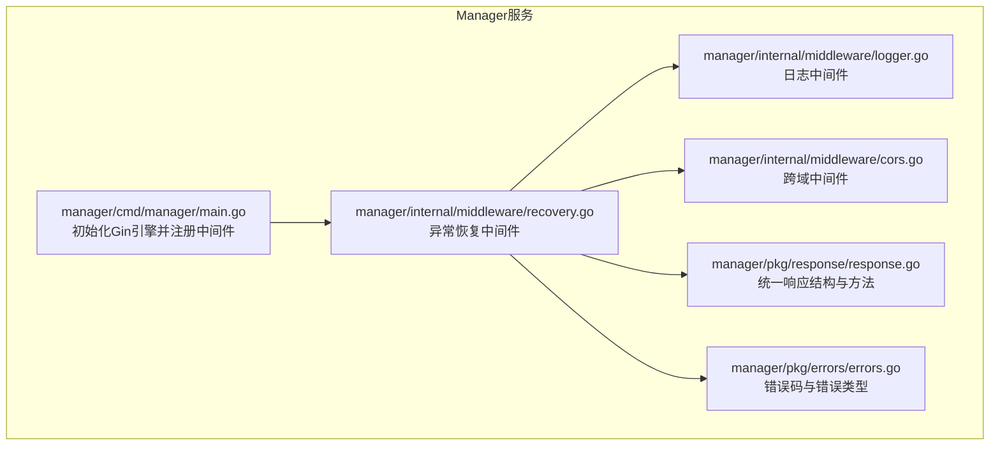
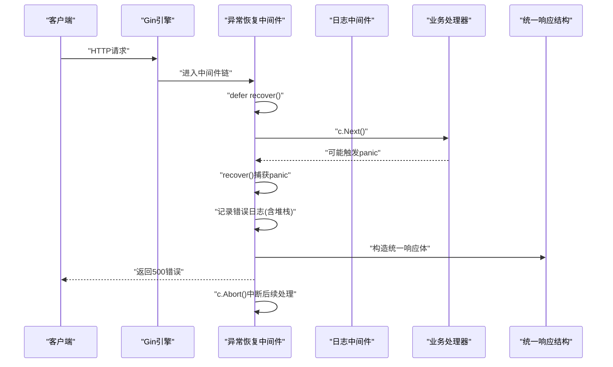
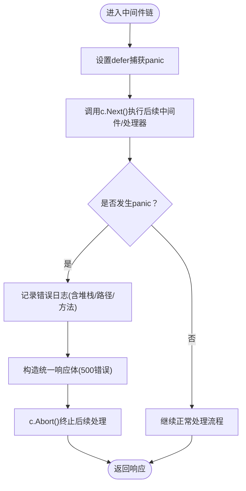
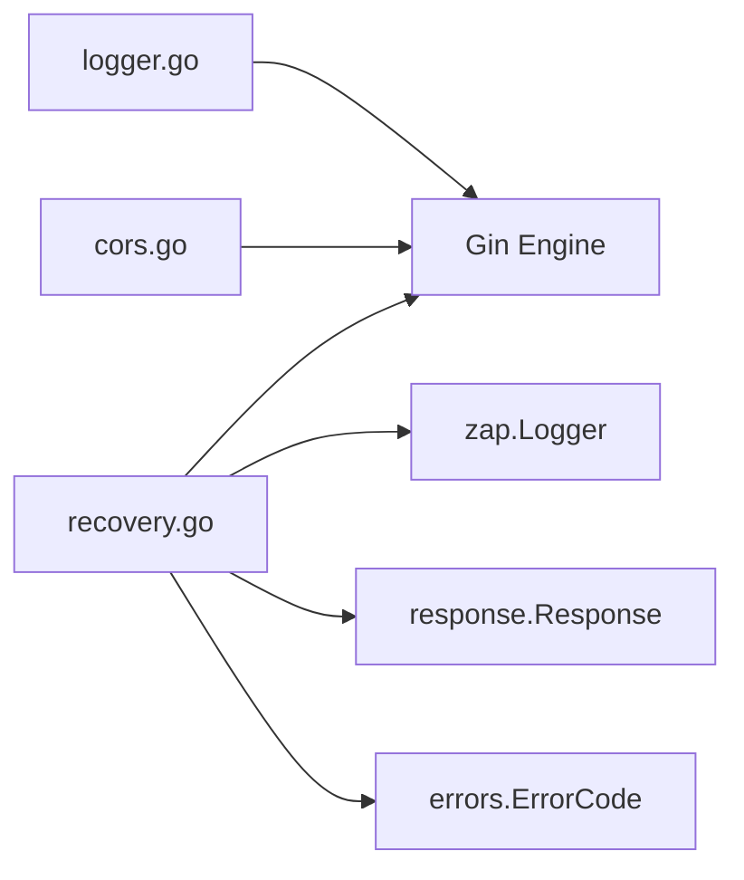

# 异常恢复中间件

<cite>
**本文引用的文件**
- [recovery.go](file://manager/internal/middleware/recovery.go)
- [response.go](file://manager/pkg/response/response.go)
- [errors.go](file://manager/pkg/errors/errors.go)
- [main.go](file://manager/cmd/manager/main.go)
- [logger.go](file://manager/internal/middleware/logger.go)
- [cors.go](file://manager/internal/middleware/cors.go)
</cite>

## 目录
1. [简介](#简介)
2. [项目结构](#项目结构)
3. [核心组件](#核心组件)
4. [架构总览](#架构总览)
5. [详细组件分析](#详细组件分析)
6. [依赖关系分析](#依赖关系分析)
7. [性能与稳定性考量](#性能与稳定性考量)
8. [故障排查指南](#故障排查指南)
9. [结论](#结论)
10. [附录](#附录)

## 简介
本技术文档聚焦于异常恢复中间件（recovery.go），阐述其在HTTP处理过程中捕获panic并防止服务崩溃的机制，包括堆栈跟踪记录、友好错误响应生成，以及通过统一响应格式返回500错误。同时给出扩展建议，如集成告警系统或错误追踪服务，并强调该中间件在中间件链中的末位执行原则及其对系统稳定性的关键作用。

## 项目结构
- 异常恢复中间件位于 manager 模块的中间件目录，负责捕获panic并输出统一错误响应。
- 统一响应格式位于 manager 的响应包中，确保所有错误以一致的结构返回。
- 错误码定义位于 manager 的错误包，为响应与日志提供统一的错误语义。
- Gin 引擎在 manager 主程序中初始化，并按顺序注册中间件，其中 recovery 中间件被置于链首，确保最先拦截panic。

图表来源
- [main.go](file://manager/cmd/manager/main.go#L135-L143)
- [recovery.go](file://manager/internal/middleware/recovery.go#L1-L38)
- [logger.go](file://manager/internal/middleware/logger.go#L1-L36)
- [cors.go](file://manager/internal/middleware/cors.go#L1-L28)
- [response.go](file://manager/pkg/response/response.go#L1-L145)
- [errors.go](file://manager/pkg/errors/errors.go#L1-L171)

章节来源
- [main.go](file://manager/cmd/manager/main.go#L135-L143)

## 核心组件
- 异常恢复中间件：在中间件链最前端捕获panic，记录堆栈与上下文信息，返回统一的500错误响应，并终止后续处理。
- 统一响应结构：提供统一的响应体字段与便捷方法，保证错误与成功响应的一致性。
- 错误码体系：定义标准错误码与HTTP状态映射，便于统一处理与日志记录。

章节来源
- [recovery.go](file://manager/internal/middleware/recovery.go#L1-L38)
- [response.go](file://manager/pkg/response/response.go#L1-L145)
- [errors.go](file://manager/pkg/errors/errors.go#L1-L171)

## 架构总览
下图展示了异常恢复中间件在Gin中间件链中的位置与调用流程，以及与统一响应和错误码的关系。

图表来源
- [recovery.go](file://manager/internal/middleware/recovery.go#L1-L38)
- [logger.go](file://manager/internal/middleware/logger.go#L1-L36)
- [response.go](file://manager/pkg/response/response.go#L1-L145)

## 详细组件分析

### 异常恢复中间件（recovery.go）
- 作用：作为中间件链的首个组件，捕获任何未处理的panic，避免服务崩溃；记录包含堆栈、请求路径与方法等上下文信息的日志；返回统一的500错误响应；终止后续中间件与处理器的执行。
- 关键实现要点：
  - 使用 defer + recover 捕获panic。
  - 通过zap记录错误、堆栈、请求路径与方法等信息。
  - 使用统一响应结构返回500错误，错误码来自错误码定义。
  - 调用Abort阻止后续中间件继续执行。
- 与中间件链的关系：
  - 在中间件链中应置于首位，确保能捕获后续中间件与处理器抛出的panic。
  - 由于其Abort特性，后续中间件不会被执行，因此不应影响日志中间件的统计（日志中间件通常在recovery之后执行，但recovery在链首时，日志中间件会在正常路径上记录）。

图表来源
- [recovery.go](file://manager/internal/middleware/recovery.go#L1-L38)

章节来源
- [recovery.go](file://manager/internal/middleware/recovery.go#L1-L38)

### 统一响应结构（response.go）
- 作用：提供统一的响应体结构与便捷方法，包括成功响应、错误响应、分页响应、常见HTTP状态响应等。
- 与异常恢复中间件的关系：
  - 异常恢复中间件在捕获panic后，使用统一响应结构返回500错误，保证错误输出格式一致。
  - 错误响应方法会自动填充时间戳等字段，便于日志与监控系统解析。

章节来源
- [response.go](file://manager/pkg/response/response.go#L1-L145)

### 错误码体系（errors.go）
- 作用：定义标准错误码与错误类型，提供HTTP状态映射逻辑，便于在不同场景下返回一致的错误语义。
- 与异常恢复中间件的关系：
  - 异常恢复中间件返回的500错误使用统一错误码，确保错误语义标准化。

章节来源
- [errors.go](file://manager/pkg/errors/errors.go#L1-L171)

### 中间件链注册与执行顺序（main.go）
- Gin引擎初始化后，按注册顺序依次执行中间件。
- 异常恢复中间件在链首注册，确保最先拦截panic。
- 日志中间件与跨域中间件在recovery之后注册，以便在正常路径上记录请求日志。

章节来源
- [main.go](file://manager/cmd/manager/main.go#L135-L143)
- [logger.go](file://manager/internal/middleware/logger.go#L1-L36)
- [cors.go](file://manager/internal/middleware/cors.go#L1-L28)

## 依赖关系分析
- 异常恢复中间件依赖：
  - Gin：使用c.Next()与c.Abort()控制中间件链与响应。
  - zap：记录panic与堆栈信息。
  - 统一响应结构：构造统一的错误响应体。
  - 错误码定义：使用统一错误码标识500错误。
- 中间件链依赖：
  - recovery在链首，确保后续中间件与处理器的panic都能被捕获。
  - logger与cors在recovery之后，分别负责日志记录与跨域处理。

图表来源
- [recovery.go](file://manager/internal/middleware/recovery.go#L1-L38)
- [response.go](file://manager/pkg/response/response.go#L1-L145)
- [errors.go](file://manager/pkg/errors/errors.go#L1-L171)
- [logger.go](file://manager/internal/middleware/logger.go#L1-L36)
- [cors.go](file://manager/internal/middleware/cors.go#L1-L28)

章节来源
- [recovery.go](file://manager/internal/middleware/recovery.go#L1-L38)
- [response.go](file://manager/pkg/response/response.go#L1-L145)
- [errors.go](file://manager/pkg/errors/errors.go#L1-L171)
- [logger.go](file://manager/internal/middleware/logger.go#L1-L36)
- [cors.go](file://manager/internal/middleware/cors.go#L1-L28)

## 性能与稳定性考量
- 性能影响：
  - defer + recover的开销极低，仅在panic发生时产生额外成本。
  - 记录堆栈会带来一定I/O与字符串处理开销，建议在生产环境合理配置日志级别与采样策略。
- 稳定性保障：
  - recovery位于中间件链首位，确保任何panic都不会导致进程崩溃。
  - 返回统一的500错误响应，避免因panic导致的非结构化错误输出。
- 最佳实践：
  - 在业务代码中尽量避免panic，使用显式的错误返回与处理。
  - 对关键路径进行压力测试，验证recovery在高并发下的表现。

[本节为通用指导，不直接分析具体文件]

## 故障排查指南
- 现象：服务出现500错误且无明确错误信息。
  - 排查：检查日志中“Panic recovered”条目，关注堆栈、请求路径与方法，定位问题代码。
  - 处理：修复panic源，必要时增加边界检查与输入校验。
- 现象：日志中频繁出现panic，但服务未崩溃。
  - 排查：确认recovery中间件已正确注册在链首；检查业务代码是否存在未处理的异常。
  - 处理：完善错误处理逻辑，减少panic发生概率。
- 现象：错误响应格式不一致。
  - 排查：确认异常恢复中间件使用统一响应结构返回500错误。
  - 处理：统一使用统一响应结构的方法，避免自定义非标准格式。

章节来源
- [recovery.go](file://manager/internal/middleware/recovery.go#L1-L38)
- [response.go](file://manager/pkg/response/response.go#L1-L145)

## 结论
异常恢复中间件通过在中间件链首位捕获panic，结合统一响应结构与错误码体系，有效防止服务崩溃并提供一致的错误输出。其Abort机制确保panic发生后不再执行后续中间件与处理器，从而快速止损。建议在生产环境中配合完善的日志与监控体系，持续优化业务代码以减少panic的发生，并在必要时扩展recovery中间件以接入告警与错误追踪服务。

[本节为总结性内容，不直接分析具体文件]

## 附录

### 扩展建议：集成告警与错误追踪
- 告警系统集成：
  - 在记录panic日志时，增加告警触发逻辑（如发送至IM或邮件），并携带堆栈与上下文信息。
  - 可根据错误频率设置阈值，避免告警风暴。
- 错误追踪服务集成：
  - 将panic堆栈与请求上下文上传至错误追踪平台（如Sentry、Rollbar等），便于问题定位与趋势分析。
  - 为每个请求生成唯一ID，贯穿日志与追踪系统，提升关联查询效率。
- 运行时可观测性：
  - 在recovery中间件中增加错误计数器与错误率统计，结合Prometheus等监控系统进行可视化。
  - 对高频panic进行分类统计，辅助定位热点问题。

[本节为概念性建议，不直接分析具体文件]