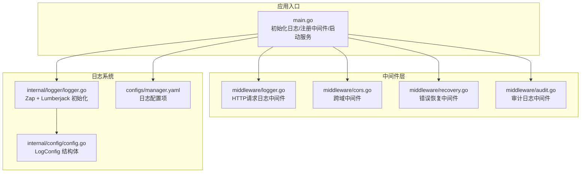
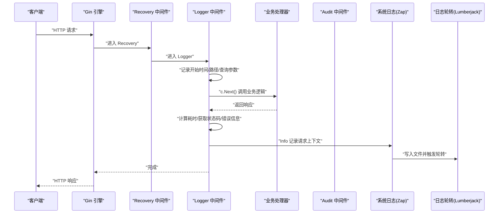
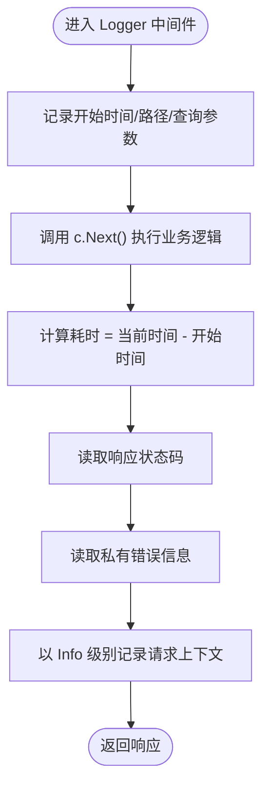
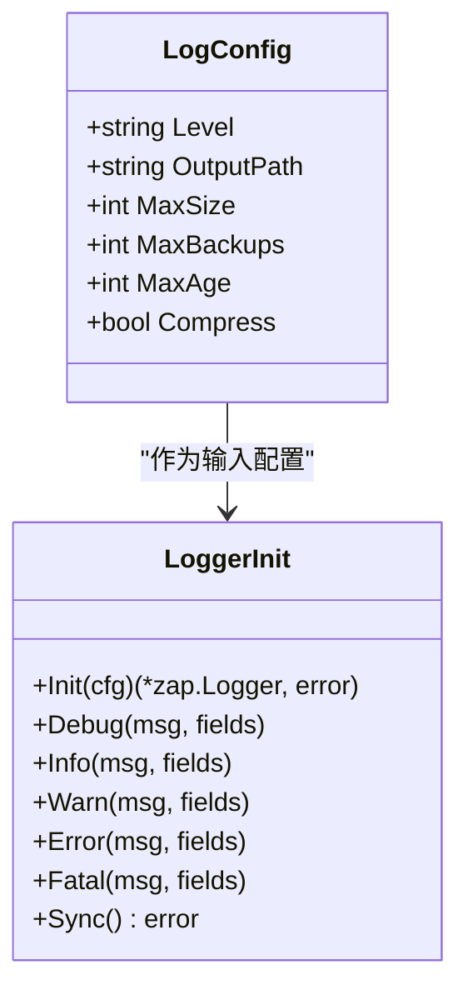
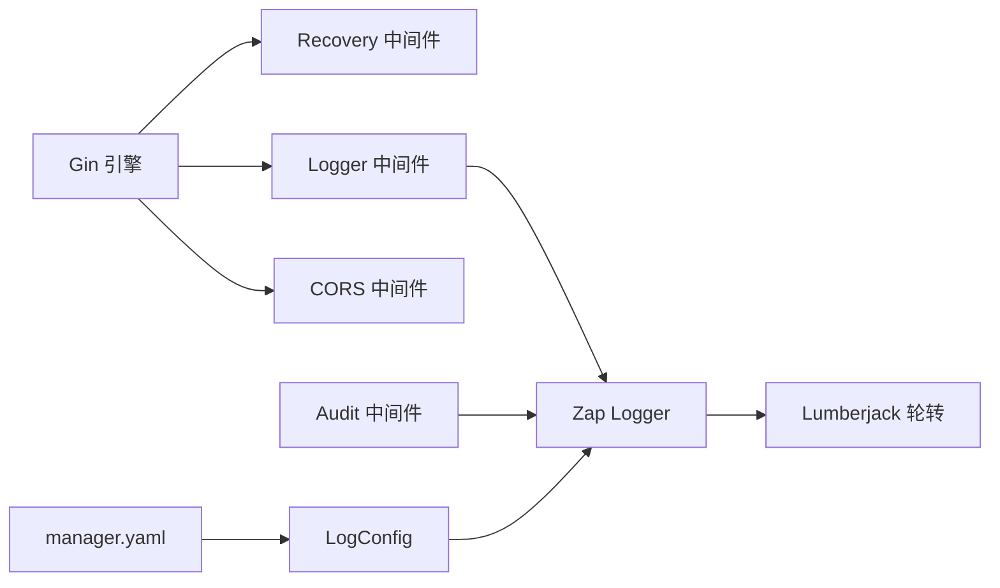

# 日志记录中间件

<cite>
**本文引用的文件**
- [manager/internal/middleware/logger.go](file://manager/internal/middleware/logger.go)
- [manager/internal/logger/logger.go](file://manager/internal/logger/logger.go)
- [manager/cmd/manager/main.go](file://manager/cmd/manager/main.go)
- [manager/internal/config/config.go](file://manager/internal/config/config.go)
- [manager/configs/manager.yaml](file://manager/configs/manager.yaml)
- [manager/internal/middleware/recovery.go](file://manager/internal/middleware/recovery.go)
- [manager/internal/middleware/cors.go](file://manager/internal/middleware/cors.go)
- [manager/internal/middleware/audit.go](file://manager/internal/middleware/audit.go)
</cite>

## 目录
1. [简介](#简介)
2. [项目结构](#项目结构)
3. [核心组件](#核心组件)
4. [架构总览](#架构总览)
5. [详细组件分析](#详细组件分析)
6. [依赖关系分析](#依赖关系分析)
7. [性能考量](#性能考量)
8. [故障排查指南](#故障排查指南)
9. [结论](#结论)

## 简介
本文件聚焦于 HTTP 请求日志中间件的实现与集成，详细说明 logger.go 如何记录请求的完整上下文信息，包括请求方法、路径、查询参数、客户端 IP、User-Agent、响应状态码、处理耗时以及错误信息，并阐述其与系统级日志组件（Zap + Lumberjack）的集成方式、日志格式化与输出策略。同时给出在高并发场景下的日志采样与性能优化建议，例如异步写入与关键路径日志级别控制。

## 项目结构
- 中间件层位于 manager/internal/middleware，其中包含 HTTP 请求日志中间件、跨域中间件、错误恢复中间件与审计日志中间件。
- 日志系统初始化位于 manager/internal/logger，负责基于配置创建 Zap Logger，并通过 lumberjack 实现日志轮转与归档。
- 应用入口在 manager/cmd/manager/main.go，统一初始化日志系统并在 Gin 引擎上注册中间件与路由。

图表来源
- [manager/cmd/manager/main.go](file://manager/cmd/manager/main.go#L135-L143)
- [manager/internal/middleware/logger.go](file://manager/internal/middleware/logger.go#L1-L35)
- [manager/internal/middleware/cors.go](file://manager/internal/middleware/cors.go#L1-L28)
- [manager/internal/middleware/recovery.go](file://manager/internal/middleware/recovery.go#L1-L39)
- [manager/internal/middleware/audit.go](file://manager/internal/middleware/audit.go#L1-L49)
- [manager/internal/logger/logger.go](file://manager/internal/logger/logger.go#L1-L115)
- [manager/internal/config/config.go](file://manager/internal/config/config.go#L71-L80)
- [manager/configs/manager.yaml](file://manager/configs/manager.yaml#L44-L52)

章节来源
- [manager/cmd/manager/main.go](file://manager/cmd/manager/main.go#L135-L143)
- [manager/internal/middleware/logger.go](file://manager/internal/middleware/logger.go#L1-L35)
- [manager/internal/logger/logger.go](file://manager/internal/logger/logger.go#L1-L115)
- [manager/internal/config/config.go](file://manager/internal/config/config.go#L71-L80)
- [manager/configs/manager.yaml](file://manager/configs/manager.yaml#L44-L52)

## 核心组件
- HTTP 请求日志中间件：在请求进入与处理完成后，计算耗时并记录状态码、方法、路径、查询参数、客户端 IP、User-Agent、错误信息等关键字段。
- 系统级日志组件：基于 Zap 构建，支持 JSON 编码、调用者信息、堆栈追踪；结合 lumberjack 实现按大小/时间/备份数的日志轮转与压缩。
- 应用入口集成：在 Gin 引擎上注册全局中间件顺序为 Recovery -> Logger -> CORS，确保异常恢复、请求日志与跨域支持。

章节来源
- [manager/internal/middleware/logger.go](file://manager/internal/middleware/logger.go#L1-L35)
- [manager/internal/logger/logger.go](file://manager/internal/logger/logger.go#L1-L115)
- [manager/cmd/manager/main.go](file://manager/cmd/manager/main.go#L135-L143)

## 架构总览
下图展示一次 HTTP 请求从进入 Gin 引擎到日志落盘的关键流程，以及与系统级日志组件的交互。

图表来源
- [manager/cmd/manager/main.go](file://manager/cmd/manager/main.go#L135-L143)
- [manager/internal/middleware/logger.go](file://manager/internal/middleware/logger.go#L1-L35)
- [manager/internal/middleware/recovery.go](file://manager/internal/middleware/recovery.go#L1-L39)
- [manager/internal/middleware/audit.go](file://manager/internal/middleware/audit.go#L1-L49)
- [manager/internal/logger/logger.go](file://manager/internal/logger/logger.go#L1-L115)

## 详细组件分析

### HTTP 请求日志中间件（middleware/logger.go）
- 记录字段
  - 状态码：c.Writer.Status()
  - 方法：c.Request.Method
  - 路径：c.Request.URL.Path
  - 查询参数：c.Request.URL.RawQuery
  - 客户端 IP：c.ClientIP()
  - User-Agent：c.Request.UserAgent()
  - 处理耗时：time.Since(start)
  - 错误信息：c.Errors.ByType(gin.ErrorTypePrivate).String()
- 执行时机
  - 在 c.Next() 前后分别读取请求上下文与响应状态，保证覆盖完整生命周期。
- 与其他中间件的关系
  - 与 Recovery、CORS、Audit 等中间件共同构成全局中间件链路，确保异常恢复、跨域支持与审计日志记录。

图表来源
- [manager/internal/middleware/logger.go](file://manager/internal/middleware/logger.go#L1-L35)

章节来源
- [manager/internal/middleware/logger.go](file://manager/internal/middleware/logger.go#L1-L35)

### 系统级日志组件（internal/logger/logger.go）
- 初始化流程
  - 依据配置创建日志目录
  - 将配置映射为 Zap 日志级别
  - 配置 JSON 编码器（时间、级别、调用者、消息、堆栈等键名）
  - 使用 lumberjack 作为写入目标，支持按大小/时间/备份数轮转与压缩
  - 构造 Zap Logger 并设置全局 Logger 变量
- 输出策略
  - 同时输出到文件与标准输出，便于本地调试与生产落盘
  - 提供 Debug/Info/Warn/Error/Fatal/Sync 等便捷方法
- 配置来源
  - 通过 internal/config/config.go 的 LogConfig 结构体定义
  - 生产配置示例位于 configs/manager.yaml

图表来源
- [manager/internal/config/config.go](file://manager/internal/config/config.go#L71-L80)
- [manager/internal/logger/logger.go](file://manager/internal/logger/logger.go#L1-L115)

章节来源
- [manager/internal/logger/logger.go](file://manager/internal/logger/logger.go#L1-L115)
- [manager/internal/config/config.go](file://manager/internal/config/config.go#L71-L80)
- [manager/configs/manager.yaml](file://manager/configs/manager.yaml#L44-L52)

### 应用入口集成（cmd/manager/main.go）
- 初始化日志系统并设置延迟同步
- 注册全局中间件顺序：Recovery -> Logger -> CORS
- 在受保护路由组上额外注册 JWT 认证与审计日志中间件
- 启动 HTTP 服务并等待信号优雅关闭

章节来源
- [manager/cmd/manager/main.go](file://manager/cmd/manager/main.go#L45-L51)
- [manager/cmd/manager/main.go](file://manager/cmd/manager/main.go#L135-L143)
- [manager/cmd/manager/main.go](file://manager/cmd/manager/main.go#L160-L165)

### 审计日志中间件（middleware/audit.go）
- 在请求完成后异步记录审计日志，包含用户 ID、方法、路径、IP、状态码、耗时等
- 仅对已认证请求记录，避免无意义的审计数据
- 异步写入避免阻塞主请求链路

章节来源
- [manager/internal/middleware/audit.go](file://manager/internal/middleware/audit.go#L1-L49)

### 错误恢复与跨域中间件
- Recovery：捕获 panic 并记录堆栈与请求上下文，返回统一错误响应
- CORS：设置跨域头并放行 OPTIONS 预检

章节来源
- [manager/internal/middleware/recovery.go](file://manager/internal/middleware/recovery.go#L1-L39)
- [manager/internal/middleware/cors.go](file://manager/internal/middleware/cors.go#L1-L28)

## 依赖关系分析
- 中间件依赖
  - Logger 中间件依赖 Gin 上下文与 Zap Logger
  - Audit 中间件依赖审计仓库与 Zap Logger
  - Recovery/CORS 为通用中间件，不直接依赖日志系统
- 日志系统依赖
  - Zap 作为核心日志库
  - lumberjack 作为文件写入与轮转组件
  - 配置来源于 viper 解析的 YAML 文件

图表来源
- [manager/cmd/manager/main.go](file://manager/cmd/manager/main.go#L135-L143)
- [manager/internal/middleware/logger.go](file://manager/internal/middleware/logger.go#L1-L35)
- [manager/internal/middleware/audit.go](file://manager/internal/middleware/audit.go#L1-L49)
- [manager/internal/logger/logger.go](file://manager/internal/logger/logger.go#L1-L115)
- [manager/internal/config/config.go](file://manager/internal/config/config.go#L71-L80)
- [manager/configs/manager.yaml](file://manager/configs/manager.yaml#L44-L52)

## 性能考量
- 日志字段与开销
  - 记录字段较多（状态码、方法、路径、查询参数、IP、UA、耗时、错误），在高并发下会增加序列化与 IO 压力
- 采样策略建议
  - 对高频接口进行采样（如 1% 或 0.1%），降低日志量与 IO 压力
  - 对关键路径（如鉴权、支付、写操作）保持全量日志，对只读接口可降低采样率
- 异步写入与缓冲
  - 使用 Zap 的异步写入能力（可通过配置启用队列与批量刷盘），减少阻塞
  - 合理设置 lumberjack 的最大文件大小与备份数，避免频繁轮转
- 日志级别控制
  - 在高负载场景将日志级别提升至 info 或 warn，减少 debug 信息
  - 对非关键路径的日志降级，仅在异常时记录详细信息
- 并发与资源
  - 控制日志线程池大小与队列长度，避免内存暴涨
  - 对超长查询参数与 UA 字段进行截断或脱敏，避免单条日志过大

[本节为通用性能建议，不直接分析具体文件，故无章节来源]

## 故障排查指南
- 日志未输出或路径不存在
  - 检查日志目录是否可写，确认初始化时已创建目录
  - 核对配置文件中的输出路径与权限
- 日志轮转不生效
  - 检查最大文件大小、备份数与保留天数配置
  - 确认压缩开关与本地时间设置
- 请求日志缺失
  - 确认中间件注册顺序：Recovery -> Logger -> CORS
  - 检查业务处理器是否提前返回或中断链路
- 审计日志未记录
  - 确认请求已通过 JWT 认证并注入 user_id
  - 检查审计仓库的创建是否报错并被日志记录

章节来源
- [manager/internal/logger/logger.go](file://manager/internal/logger/logger.go#L18-L24)
- [manager/internal/logger/logger.go](file://manager/internal/logger/logger.go#L55-L62)
- [manager/cmd/manager/main.go](file://manager/cmd/manager/main.go#L135-L143)
- [manager/internal/middleware/audit.go](file://manager/internal/middleware/audit.go#L21-L47)

## 结论
HTTP 请求日志中间件通过在中间件链路中精确采集请求上下文与响应状态，配合系统级日志组件的 JSON 编码与 lumberjack 轮转，实现了高可用、可观测的请求追踪。在高并发场景下，建议采用采样、异步写入与关键路径日志级别控制等策略，平衡可观测性与系统性能。