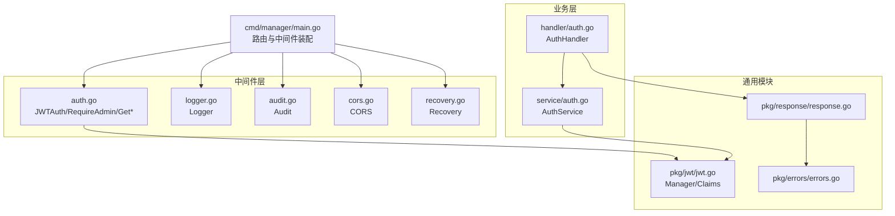
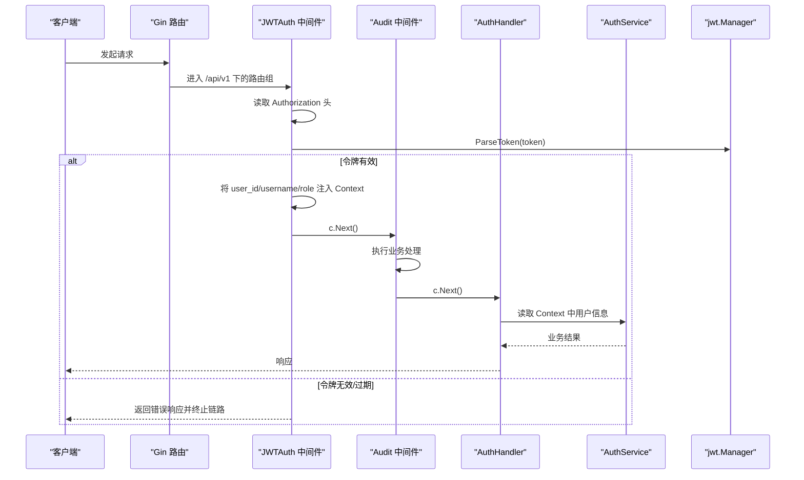
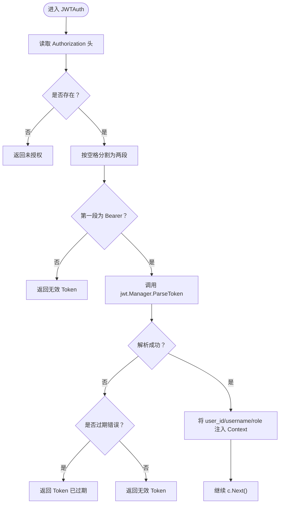
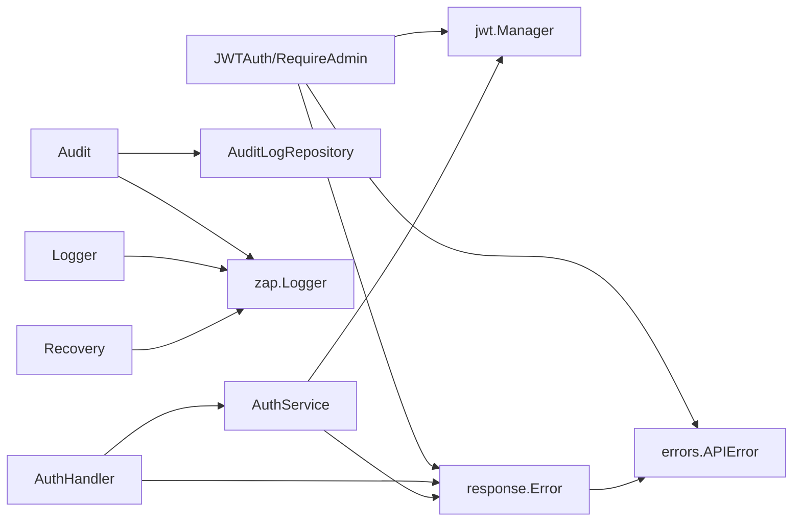

# 认证中间件

<cite>
**本文引用的文件**
- [manager/internal/middleware/auth.go](file://manager/internal/middleware/auth.go)
- [manager/pkg/jwt/jwt.go](file://manager/pkg/jwt/jwt.go)
- [manager/internal/handler/auth.go](file://manager/internal/handler/auth.go)
- [manager/internal/service/auth.go](file://manager/internal/service/auth.go)
- [manager/cmd/manager/main.go](file://manager/cmd/manager/main.go)
- [manager/internal/middleware/logger.go](file://manager/internal/middleware/logger.go)
- [manager/internal/middleware/audit.go](file://manager/internal/middleware/audit.go)
- [manager/internal/middleware/cors.go](file://manager/internal/middleware/cors.go)
- [manager/internal/middleware/recovery.go](file://manager/internal/middleware/recovery.go)
- [manager/pkg/errors/errors.go](file://manager/pkg/errors/errors.go)
- [manager/pkg/response/response.go](file://manager/pkg/response/response.go)
</cite>

## 目录
1. [简介](#简介)
2. [项目结构](#项目结构)
3. [核心组件](#核心组件)
4. [架构总览](#架构总览)
5. [详细组件分析](#详细组件分析)
6. [依赖分析](#依赖分析)
7. [性能考虑](#性能考虑)
8. [故障排查指南](#故障排查指南)
9. [结论](#结论)
10. [附录](#附录)

## 简介
本文件围绕 API 网关层的认证中间件展开，重点解析 manager 内部中间件模块中 auth.go 的实现机制，涵盖：
- 基于 JWT 的认证流程：Token 解析、验证、用户身份注入 Context 的过程
- 与 pkg/jwt/jwt.go 模块的协作方式
- 与 Handler 层的用户权限传递
- 实际代码示例路径：认证失败、Token 过期等场景的处理逻辑
- 中间件在请求链中的执行顺序及与审计、日志等中间件的交互关系
- 安全最佳实践：Token 刷新机制、黑名单管理建议、防重放策略

## 项目结构
认证中间件位于 manager 子系统，采用 Gin 框架中间件模式组织，配合统一的错误与响应封装，形成清晰的请求链路。

图表来源
- [manager/internal/middleware/auth.go](file://manager/internal/middleware/auth.go#L1-L98)
- [manager/internal/middleware/logger.go](file://manager/internal/middleware/logger.go#L1-L36)
- [manager/internal/middleware/audit.go](file://manager/internal/middleware/audit.go#L1-L50)
- [manager/internal/middleware/cors.go](file://manager/internal/middleware/cors.go#L1-L28)
- [manager/internal/middleware/recovery.go](file://manager/internal/middleware/recovery.go#L1-L39)
- [manager/internal/handler/auth.go](file://manager/internal/handler/auth.go#L1-L225)
- [manager/internal/service/auth.go](file://manager/internal/service/auth.go#L1-L287)
- [manager/pkg/jwt/jwt.go](file://manager/pkg/jwt/jwt.go#L1-L140)
- [manager/pkg/errors/errors.go](file://manager/pkg/errors/errors.go#L1-L171)
- [manager/pkg/response/response.go](file://manager/pkg/response/response.go#L1-L145)
- [manager/cmd/manager/main.go](file://manager/cmd/manager/main.go#L150-L210)

章节来源
- [manager/cmd/manager/main.go](file://manager/cmd/manager/main.go#L150-L210)

## 核心组件
- 认证中间件 JWTAuth：从 Authorization 头解析 Bearer Token，调用 jwt.Manager 验证并注入用户信息到 Context
- 管理员校验中间件 RequireAdmin：从 Context 取出角色并判断是否为 admin
- 上下文读取工具 GetUserID/GetUsername/GetRole：供 Handler 使用
- JWT 管理器 Manager：负责签发、解析、刷新 Token，并提供有效性校验
- Handler/AuthService：业务入口，通过中间件注入的用户信息执行业务逻辑
- 统一错误与响应：errors/errors.go 与 response/response.go 提供标准化错误码与响应格式

章节来源
- [manager/internal/middleware/auth.go](file://manager/internal/middleware/auth.go#L1-L98)
- [manager/pkg/jwt/jwt.go](file://manager/pkg/jwt/jwt.go#L1-L140)
- [manager/internal/handler/auth.go](file://manager/internal/handler/auth.go#L1-L225)
- [manager/internal/service/auth.go](file://manager/internal/service/auth.go#L1-L287)
- [manager/pkg/errors/errors.go](file://manager/pkg/errors/errors.go#L1-L171)
- [manager/pkg/response/response.go](file://manager/pkg/response/response.go#L1-L145)

## 架构总览
认证中间件在 Gin 路由组上以中间件形式串联，形成“鉴权 -> 审计 -> 业务”的请求链路；同时与日志、跨域、异常恢复等中间件共同构成完整的网关层。

图表来源
- [manager/cmd/manager/main.go](file://manager/cmd/manager/main.go#L150-L210)
- [manager/internal/middleware/auth.go](file://manager/internal/middleware/auth.go#L1-L98)
- [manager/internal/middleware/audit.go](file://manager/internal/middleware/audit.go#L1-L50)
- [manager/internal/handler/auth.go](file://manager/internal/handler/auth.go#L1-L225)
- [manager/internal/service/auth.go](file://manager/internal/service/auth.go#L1-L287)
- [manager/pkg/jwt/jwt.go](file://manager/pkg/jwt/jwt.go#L1-L140)

## 详细组件分析

### 认证中间件 JWTAuth
- 输入来源：Authorization 头，要求 Bearer 方案
- 解析与验证：拆分 “Bearer” 与 Token，调用 jwt.Manager.ParseToken
- 错误分支：
  - 缺失或格式不正确：返回未授权/无效 Token
  - 解析失败且为过期错误：返回 Token 已过期
  - 其他解析失败：返回无效 Token
- 成功分支：将用户标识写入 Context（user_id、username、role），继续后续中间件与 Handler

图表来源
- [manager/internal/middleware/auth.go](file://manager/internal/middleware/auth.go#L1-L49)
- [manager/pkg/jwt/jwt.go](file://manager/pkg/jwt/jwt.go#L63-L88)
- [manager/pkg/errors/errors.go](file://manager/pkg/errors/errors.go#L92-L131)
- [manager/pkg/response/response.go](file://manager/pkg/response/response.go#L53-L61)

章节来源
- [manager/internal/middleware/auth.go](file://manager/internal/middleware/auth.go#L1-L49)
- [manager/pkg/jwt/jwt.go](file://manager/pkg/jwt/jwt.go#L63-L88)
- [manager/pkg/errors/errors.go](file://manager/pkg/errors/errors.go#L92-L131)
- [manager/pkg/response/response.go](file://manager/pkg/response/response.go#L53-L61)

### 管理员中间件 RequireAdmin
- 从 Context 读取 role
- 若不存在或非 admin，返回禁止访问
- 否则放行

章节来源
- [manager/internal/middleware/auth.go](file://manager/internal/middleware/auth.go#L51-L70)

### 上下文读取工具 GetUserID/GetUsername/GetRole
- 从 Context 中安全地读取用户信息，返回值与存在性判断
- Handler 通过这些工具获取当前用户上下文

章节来源
- [manager/internal/middleware/auth.go](file://manager/internal/middleware/auth.go#L72-L98)
- [manager/internal/handler/auth.go](file://manager/internal/handler/auth.go#L98-L150)

### JWT 管理器 Manager
- Claims 结构包含用户标识与标准声明
- GenerateToken：签发含过期时间的 JWT
- ParseToken：验证签名、过期、生效时间，返回 Claims 或错误
- RefreshToken：支持过期后的刷新（带窗口期限制），生成新 Token
- ValidateToken：仅做验证，返回错误
- Claims.IsActive：检查是否在生效时间内

章节来源
- [manager/pkg/jwt/jwt.go](file://manager/pkg/jwt/jwt.go#L1-L140)

### Handler 与 AuthService 的协作
- Handler 在需要用户上下文的方法中，先通过 GetUserID/GetUsername/GetRole 读取 Context
- AuthService 在业务层使用 jwt.Manager 进行 Token 生成、验证与刷新
- 统一错误与响应：errors/errors.go 与 response/response.go 提供标准化错误码与响应体

章节来源
- [manager/internal/handler/auth.go](file://manager/internal/handler/auth.go#L1-L225)
- [manager/internal/service/auth.go](file://manager/internal/service/auth.go#L1-L287)
- [manager/pkg/jwt/jwt.go](file://manager/pkg/jwt/jwt.go#L1-L140)
- [manager/pkg/errors/errors.go](file://manager/pkg/errors/errors.go#L1-L171)
- [manager/pkg/response/response.go](file://manager/pkg/response/response.go#L1-L145)

### 中间件执行顺序与交互
- 路由组装配顺序（示例）：
  - 公开路由：无需认证
  - 需认证路由组：JWTAuth -> Audit -> 业务 Handler
  - 管理员路由组：RequireAdmin 在其子组上生效
- 与日志、跨域、异常恢复的交互：
  - Logger：记录状态码、路径、耗时、错误等
  - Audit：在 c.Next() 后异步记录审计日志（需认证后才记录）
  - Recovery：捕获 panic 并返回 500
  - CORS：处理预检请求与跨域头部

章节来源
- [manager/cmd/manager/main.go](file://manager/cmd/manager/main.go#L150-L210)
- [manager/internal/middleware/logger.go](file://manager/internal/middleware/logger.go#L1-L36)
- [manager/internal/middleware/audit.go](file://manager/internal/middleware/audit.go#L1-L50)
- [manager/internal/middleware/cors.go](file://manager/internal/middleware/cors.go#L1-L28)
- [manager/internal/middleware/recovery.go](file://manager/internal/middleware/recovery.go#L1-L39)

## 依赖分析
- 中间件依赖关系
  - JWTAuth 依赖 jwt.Manager 与 response/errors
  - RequireAdmin 依赖 response/errors
  - Audit 依赖 repository 与 zap
  - Logger/Recovery/CORS 为通用中间件
- Handler/Service 依赖 jwt.Manager 与统一错误/响应模块

图表来源
- [manager/internal/middleware/auth.go](file://manager/internal/middleware/auth.go#L1-L98)
- [manager/internal/middleware/audit.go](file://manager/internal/middleware/audit.go#L1-L50)
- [manager/internal/middleware/logger.go](file://manager/internal/middleware/logger.go#L1-L36)
- [manager/internal/middleware/recovery.go](file://manager/internal/middleware/recovery.go#L1-L39)
- [manager/internal/handler/auth.go](file://manager/internal/handler/auth.go#L1-L225)
- [manager/internal/service/auth.go](file://manager/internal/service/auth.go#L1-L287)
- [manager/pkg/jwt/jwt.go](file://manager/pkg/jwt/jwt.go#L1-L140)
- [manager/pkg/errors/errors.go](file://manager/pkg/errors/errors.go#L1-L171)
- [manager/pkg/response/response.go](file://manager/pkg/response/response.go#L1-L145)

章节来源
- [manager/internal/middleware/auth.go](file://manager/internal/middleware/auth.go#L1-L98)
- [manager/internal/middleware/audit.go](file://manager/internal/middleware/audit.go#L1-L50)
- [manager/internal/middleware/logger.go](file://manager/internal/middleware/logger.go#L1-L36)
- [manager/internal/middleware/recovery.go](file://manager/internal/middleware/recovery.go#L1-L39)
- [manager/internal/handler/auth.go](file://manager/internal/handler/auth.go#L1-L225)
- [manager/internal/service/auth.go](file://manager/internal/service/auth.go#L1-L287)
- [manager/pkg/jwt/jwt.go](file://manager/pkg/jwt/jwt.go#L1-L140)
- [manager/pkg/errors/errors.go](file://manager/pkg/errors/errors.go#L1-L171)
- [manager/pkg/response/response.go](file://manager/pkg/response/response.go#L1-L145)

## 性能考虑
- JWT 解析与验证为 O(1)，成本极低
- Audit 异步落库，避免阻塞主请求链路
- Logger 仅在 c.Next() 后记录，减少重复计算
- Recovery 使用 defer 捕获 panic，避免异常传播导致的额外开销
- 建议：对频繁访问的公开接口可考虑缓存短期 Token 生成结果（若业务允许）

## 故障排查指南
- 认证失败（未携带或格式错误的 Authorization 头）
  - 触发条件：Authorization 头缺失或不满足 “Bearer <token>”
  - 行为：返回未授权/无效 Token
  - 参考路径
    - [manager/internal/middleware/auth.go](file://manager/internal/middleware/auth.go#L16-L29)
    - [manager/pkg/errors/errors.go](file://manager/pkg/errors/errors.go#L92-L104)
    - [manager/pkg/response/response.go](file://manager/pkg/response/response.go#L53-L61)
- Token 过期
  - 触发条件：jwt.ParseToken 返回过期错误
  - 行为：返回 Token 已过期
  - 参考路径
    - [manager/pkg/jwt/jwt.go](file://manager/pkg/jwt/jwt.go#L63-L88)
    - [manager/internal/middleware/auth.go](file://manager/internal/middleware/auth.go#L31-L41)
    - [manager/pkg/errors/errors.go](file://manager/pkg/errors/errors.go#L92-L104)
- 非管理员访问管理员接口
  - 触发条件：RequireAdmin 检测到非 admin 角色
  - 行为：返回禁止访问
  - 参考路径
    - [manager/internal/middleware/auth.go](file://manager/internal/middleware/auth.go#L51-L70)
    - [manager/pkg/errors/errors.go](file://manager/pkg/errors/errors.go#L92-L104)
- Handler 未从 Context 读取用户信息
  - 现象：返回未授权
  - 处理：确保路由组挂载了 JWTAuth
  - 参考路径
    - [manager/internal/handler/auth.go](file://manager/internal/handler/auth.go#L98-L150)
    - [manager/cmd/manager/main.go](file://manager/cmd/manager/main.go#L150-L210)

章节来源
- [manager/internal/middleware/auth.go](file://manager/internal/middleware/auth.go#L1-L98)
- [manager/pkg/jwt/jwt.go](file://manager/pkg/jwt/jwt.go#L63-L88)
- [manager/internal/handler/auth.go](file://manager/internal/handler/auth.go#L98-L150)
- [manager/pkg/errors/errors.go](file://manager/pkg/errors/errors.go#L92-L104)
- [manager/pkg/response/response.go](file://manager/pkg/response/response.go#L53-L61)
- [manager/cmd/manager/main.go](file://manager/cmd/manager/main.go#L150-L210)

## 结论
本认证中间件以简洁高效的模式实现了基于 JWT 的请求认证与权限控制，结合审计、日志与异常恢复中间件，形成了稳定可靠的网关层安全基座。通过 Context 注入用户信息，Handler 与 Service 能够一致地获取用户上下文，便于扩展更细粒度的权限控制与审计能力。

## 附录

### 安全最佳实践
- Token 刷新机制
  - 使用 jwt.Manager.RefreshToken，在过期窗口期内生成新 Token
  - 建议设置合理的过期窗口（如 7 天），超过窗口则强制重新登录
  - 参考路径
    - [manager/pkg/jwt/jwt.go](file://manager/pkg/jwt/jwt.go#L96-L128)
- 黑名单管理建议
  - 登出时将 Token 加入短期缓存（如 Redis）作为黑名单，短期内拒绝该 Token
  - 与 RefreshToken 协作：过期但仍在刷新窗口内的 Token 可被刷新，超窗则不可用
  - 参考路径
    - [manager/internal/service/auth.go](file://manager/internal/service/auth.go#L155-L170)
    - [manager/pkg/jwt/jwt.go](file://manager/pkg/jwt/jwt.go#L96-L128)
- 防重放攻击
  - 使用短有效期 Token 与刷新机制
  - 对关键操作（如修改密码、禁用用户）增加二次确认或验证码
  - 审计日志记录关键操作与 IP，便于追踪
  - 参考路径
    - [manager/internal/middleware/audit.go](file://manager/internal/middleware/audit.go#L1-L50)
    - [manager/internal/handler/auth.go](file://manager/internal/handler/auth.go#L152-L206)