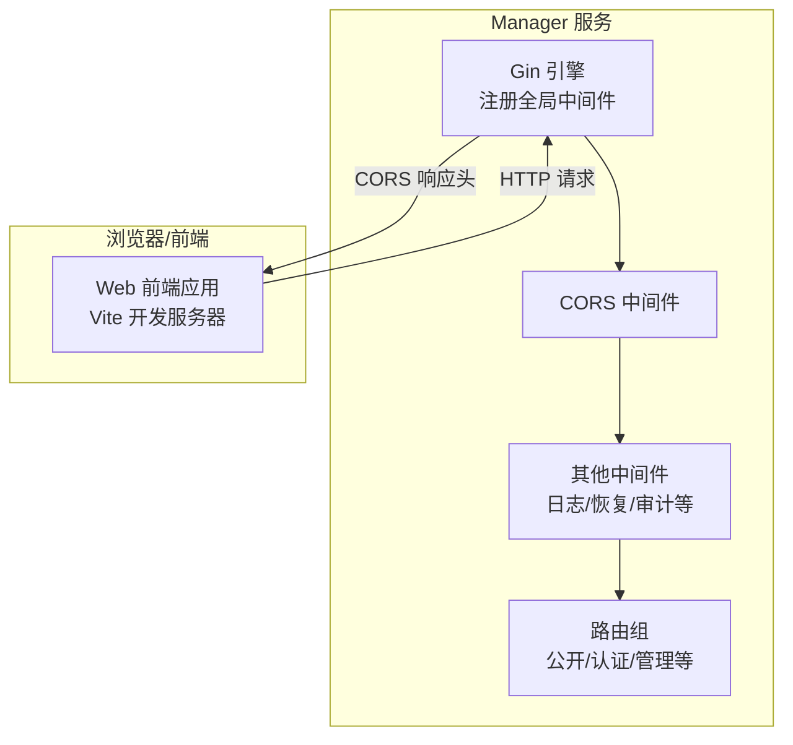
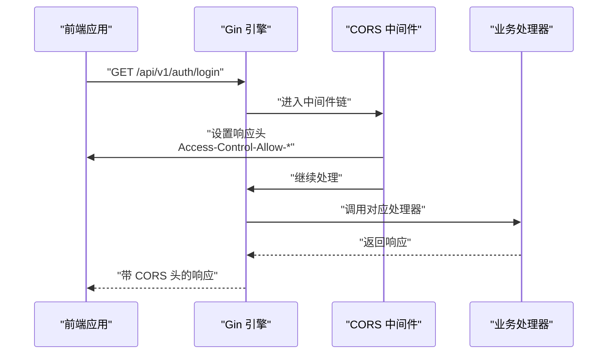
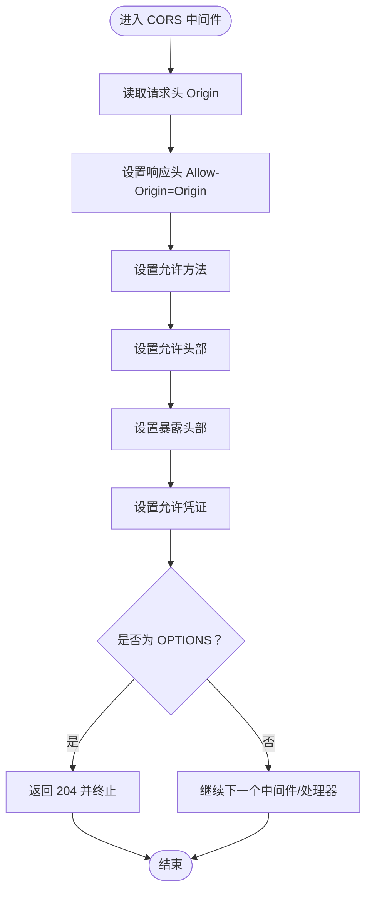
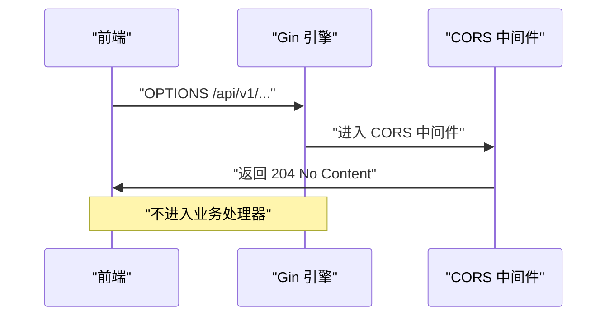
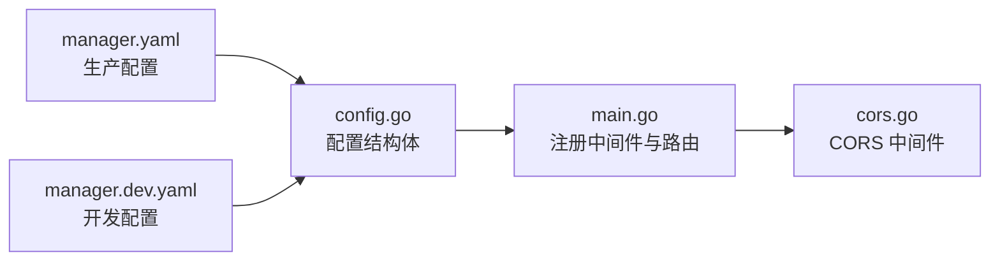

# 跨域资源共享中间件

<cite>
**本文引用的文件**
- [cors.go](file://manager/internal/middleware/cors.go)
- [main.go](file://manager/cmd/manager/main.go)
- [config.go](file://manager/internal/config/config.go)
- [manager.yaml](file://manager/configs/manager.yaml)
- [manager.dev.yaml](file://manager/configs/manager.dev.yaml)
- [interceptors.ts](file://web/src/api/interceptors.ts)
- [setup-env.sh](file://web/scripts/setup-env.sh)
- [check-connection.sh](file://web/scripts/check-connection.sh)
</cite>

## 目录
1. [简介](#简介)
2. [项目结构](#项目结构)
3. [核心组件](#核心组件)
4. [架构总览](#架构总览)
5. [详细组件分析](#详细组件分析)
6. [依赖关系分析](#依赖关系分析)
7. [性能考量](#性能考量)
8. [故障排查指南](#故障排查指南)
9. [结论](#结论)
10. [附录](#附录)

## 简介
本文件围绕后端 Gin 中间件中的 CORS 实现进行系统性说明，重点解释 cors.go 如何通过响应头控制跨域请求，如何与 Gin 路由注册顺序配合工作，以及如何兼容前端 Web 应用的部署与访问需求。同时，结合配置文件与前端环境变量，给出预检请求（OPTIONS）处理流程的实际示例，并总结生产环境常见 CORS 配置陷阱与解决方案，包括通配符使用限制与凭证请求的安全要求。

## 项目结构
- 后端 Gin 引擎在入口处注册全局中间件，其中包含 CORS 中间件，随后再注册业务路由组。
- CORS 中间件位于中间件目录，采用最小化策略：直接透传 Origin，允许常用方法与头部，并对 OPTIONS 预检请求直接返回 204。
- 前端 Web 通过环境变量配置 API 基础地址，通常与后端服务在同一主机但不同端口，形成跨域场景。

图表来源
- [main.go](file://manager/cmd/manager/main.go#L135-L146)
- [cors.go](file://manager/internal/middleware/cors.go#L1-L27)

章节来源
- [main.go](file://manager/cmd/manager/main.go#L135-L146)
- [cors.go](file://manager/internal/middleware/cors.go#L1-L27)

## 核心组件
- CORS 中间件：负责注入跨域相关响应头，放行 OPTIONS 预检请求，允许携带凭证。
- Gin 引擎与中间件注册顺序：先注册 CORS，再注册其他中间件，最后注册路由组。
- 配置文件：定义 HTTP 服务监听地址与模式，为跨域访问提供基础信息（如域名/IP 与端口）。
- 前端环境变量：定义 API 基础地址，决定浏览器发起跨域请求的目标后端地址。

章节来源
- [cors.go](file://manager/internal/middleware/cors.go#L1-L27)
- [main.go](file://manager/cmd/manager/main.go#L135-L146)
- [config.go](file://manager/internal/config/config.go#L21-L30)
- [manager.yaml](file://manager/configs/manager.yaml#L1-L20)
- [manager.dev.yaml](file://manager/configs/manager.dev.yaml#L1-L20)

## 架构总览
下图展示了从浏览器到后端服务的典型跨域请求路径，以及 CORS 中间件在其中的作用。

图表来源
- [main.go](file://manager/cmd/manager/main.go#L135-L146)
- [cors.go](file://manager/internal/middleware/cors.go#L1-L27)

章节来源
- [main.go](file://manager/cmd/manager/main.go#L135-L146)
- [cors.go](file://manager/internal/middleware/cors.go#L1-L27)

## 详细组件分析

### CORS 中间件实现与行为
- 允许的来源（Origin）：直接透传请求头中的 Origin，不做白名单校验。
- 允许的方法：包含常用 REST 方法与 PATCH。
- 允许的头部：包含常见请求头，如 Content-Type、Authorization、Accept、X-Requested-With 等。
- 暴露的头部：允许前端读取部分 CORS 相关响应头。
- 凭证支持：允许携带 Cookie/凭证。
- 预检请求（OPTIONS）：直接返回 204，不再进入后续处理器。

图表来源
- [cors.go](file://manager/internal/middleware/cors.go#L1-L27)

章节来源
- [cors.go](file://manager/internal/middleware/cors.go#L1-L27)

### 预检请求（OPTIONS）处理流程
- 浏览器在发送复杂请求前会先发送 OPTIONS 预检请求，携带 Origin、Access-Control-Request-Method、Access-Control-Request-Headers 等。
- CORS 中间件识别 OPTIONS 后直接返回 204，不进入业务处理器，从而减少不必要的处理开销。
- 若前端使用凭证（Cookie），后端必须明确指定允许的来源，不能使用通配符。

图表来源
- [cors.go](file://manager/internal/middleware/cors.go#L1-L27)

章节来源
- [cors.go](file://manager/internal/middleware/cors.go#L1-L27)

### 与 Gin 路由注册顺序的关系
- 在入口文件中，先注册 Recovery、Logger、CORS 等全局中间件，再注册路由组。
- CORS 作为第一个全局中间件，能确保所有请求（包括预检）都能被统一处理。

章节来源
- [main.go](file://manager/cmd/manager/main.go#L135-L146)

### 配置化策略与来源
- 当前 CORS 中间件未从配置文件读取任何参数，而是硬编码了允许的方法、头部与凭证策略。
- 若需实现“配置化”，可考虑：
  - 从配置文件读取允许的来源列表（Origin 白名单）、允许的方法集合、允许的头部集合、是否允许凭证等。
  - 对于凭证请求，Origin 必须为具体域名，不能使用通配符。
  - 对于生产环境，建议将允许的来源限定为前端部署域名，避免使用通配符。

章节来源
- [config.go](file://manager/internal/config/config.go#L11-L20)
- [manager.yaml](file://manager/configs/manager.yaml#L1-L20)
- [manager.dev.yaml](file://manager/configs/manager.dev.yaml#L1-L20)

### 兼容前端 Web 应用的部署需求
- 前端开发环境通常通过 Vite 启动，API 基础地址指向后端服务地址（同一主机不同端口），形成跨域场景。
- 前端通过环境变量配置 API 地址，保证开发与生产环境的切换。
- CORS 中间件允许凭证，便于前端携带 Cookie/Token 进行认证。

章节来源
- [interceptors.ts](file://web/src/api/interceptors.ts#L1-L40)
- [setup-env.sh](file://web/scripts/setup-env.sh#L1-L65)
- [check-connection.sh](file://web/scripts/check-connection.sh#L1-L49)

## 依赖关系分析
- CORS 中间件依赖 Gin 的上下文能力，通过设置响应头与短路处理 OPTIONS。
- 入口文件 main.go 负责初始化 Gin 引擎并注册中间件与路由。
- 配置文件提供服务监听地址与模式，影响浏览器访问 URL 与日志级别。

图表来源
- [main.go](file://manager/cmd/manager/main.go#L135-L146)
- [cors.go](file://manager/internal/middleware/cors.go#L1-L27)
- [config.go](file://manager/internal/config/config.go#L11-L20)
- [manager.yaml](file://manager/configs/manager.yaml#L1-L20)
- [manager.dev.yaml](file://manager/configs/manager.dev.yaml#L1-L20)

章节来源
- [main.go](file://manager/cmd/manager/main.go#L135-L146)
- [cors.go](file://manager/internal/middleware/cors.go#L1-L27)
- [config.go](file://manager/internal/config/config.go#L11-L20)
- [manager.yaml](file://manager/configs/manager.yaml#L1-L20)
- [manager.dev.yaml](file://manager/configs/manager.dev.yaml#L1-L20)

## 性能考量
- CORS 中间件逻辑简单，仅设置响应头与短路 OPTIONS，对性能影响极小。
- 将 CORS 放在全局中间件链靠前位置，可尽早返回预检结果，减少后续中间件与处理器的负担。
- 若未来引入配置化，建议将白名单与允许方法/头部缓存，避免每次请求都做字符串匹配。

## 故障排查指南
- 浏览器控制台出现跨域错误
  - 检查后端是否正确设置了允许来源、方法与头部。
  - 确认前端请求是否携带凭证（Cookie/Token），若携带凭证，后端必须指定具体来源，不能使用通配符。
- 预检请求（OPTIONS）未命中业务处理器
  - 这是预期行为，CORS 中间件会直接返回 204。
  - 若期望预检走业务逻辑，请在路由层单独处理 OPTIONS 或调整中间件顺序。
- 前端无法登录或鉴权失败
  - 检查前端是否正确设置 Authorization 头部。
  - 检查后端 JWT 中间件是否生效（与 CORS 无冲突）。
- 健康检查接口无法访问
  - 使用健康检查接口确认后端服务可用，再排查跨域问题。

章节来源
- [cors.go](file://manager/internal/middleware/cors.go#L1-L27)
- [interceptors.ts](file://web/src/api/interceptors.ts#L1-L40)
- [check-connection.sh](file://web/scripts/check-connection.sh#L1-L49)

## 结论
- 当前 CORS 中间件采用“宽松”策略：透传 Origin、允许常用方法与头部、允许凭证、对 OPTIONS 直接放行。
- 该策略适合开发与内网联调，但在生产环境中建议引入配置化，严格限定允许来源、方法与头部，并避免使用通配符。
- 前端通过环境变量配置 API 地址，天然形成跨域场景；CORS 中间件与凭证支持可满足前端认证需求。

## 附录

### 生产环境常见 CORS 配置陷阱与解决方案
- 通配符使用限制
  - 问题：Origin 使用通配符（*）时，若请求携带凭证（Cookie/Token），浏览器会拒绝。
  - 解决：将 Allow-Origin 明确为具体域名，且与前端部署域名一致。
- 凭证请求的安全要求
  - 问题：未设置允许凭证或允许来源为通配符。
  - 解决：启用凭证支持，并将允许来源限定为可信域名。
- 允许方法与头部不完整
  - 问题：前端使用了自定义头部或非标准方法，导致预检失败。
  - 解决：在配置中补充允许的方法与头部，或在中间件中动态扩展。
- 预检与业务处理顺序
  - 问题：期望预检进入业务处理器以便统一处理。
  - 解决：在路由层单独处理 OPTIONS，或调整中间件注册顺序。

### 实际 HTTP 请求/响应头示例（概念性说明）
- 预检请求（OPTIONS）
  - 请求头示例：Origin、Access-Control-Request-Method、Access-Control-Request-Headers、X-Requested-With、Authorization 等。
  - 响应头示例：Access-Control-Allow-Origin、Access-Control-Allow-Methods、Access-Control-Allow-Headers、Access-Control-Allow-Credentials、Access-Control-Max-Age 等。
- 正常请求（GET/POST 等）
  - 响应头示例：Access-Control-Allow-Origin、Access-Control-Allow-Credentials、Access-Control-Expose-Headers 等。