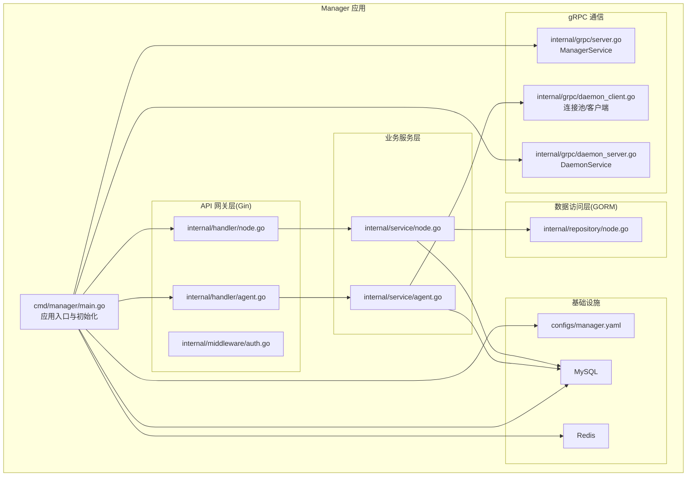
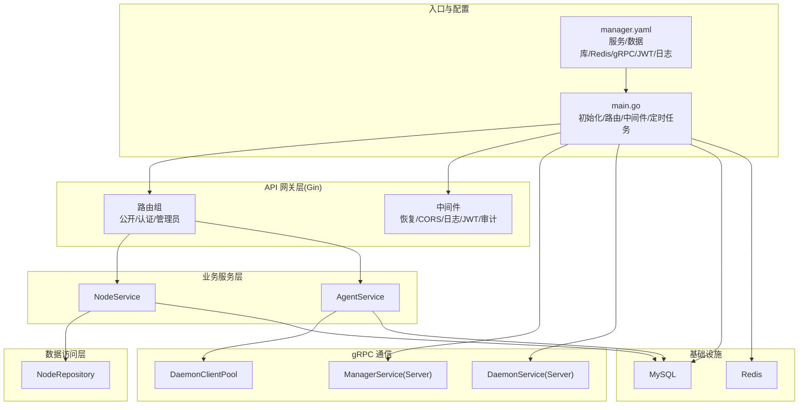
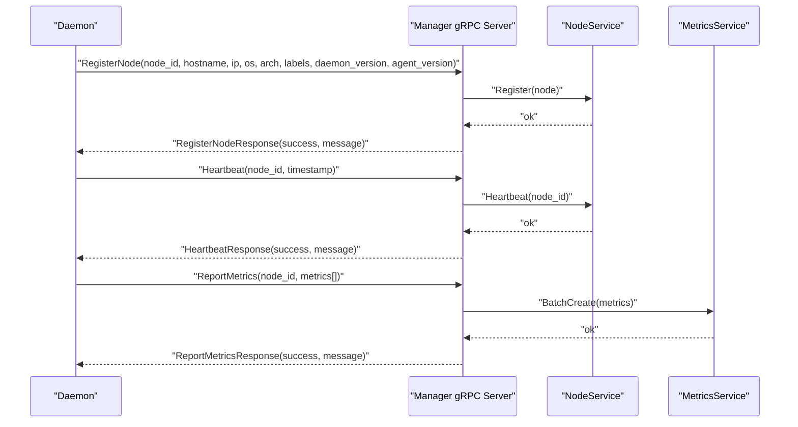
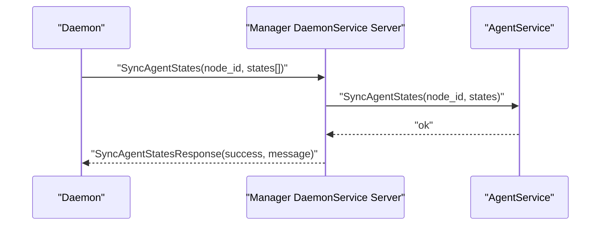
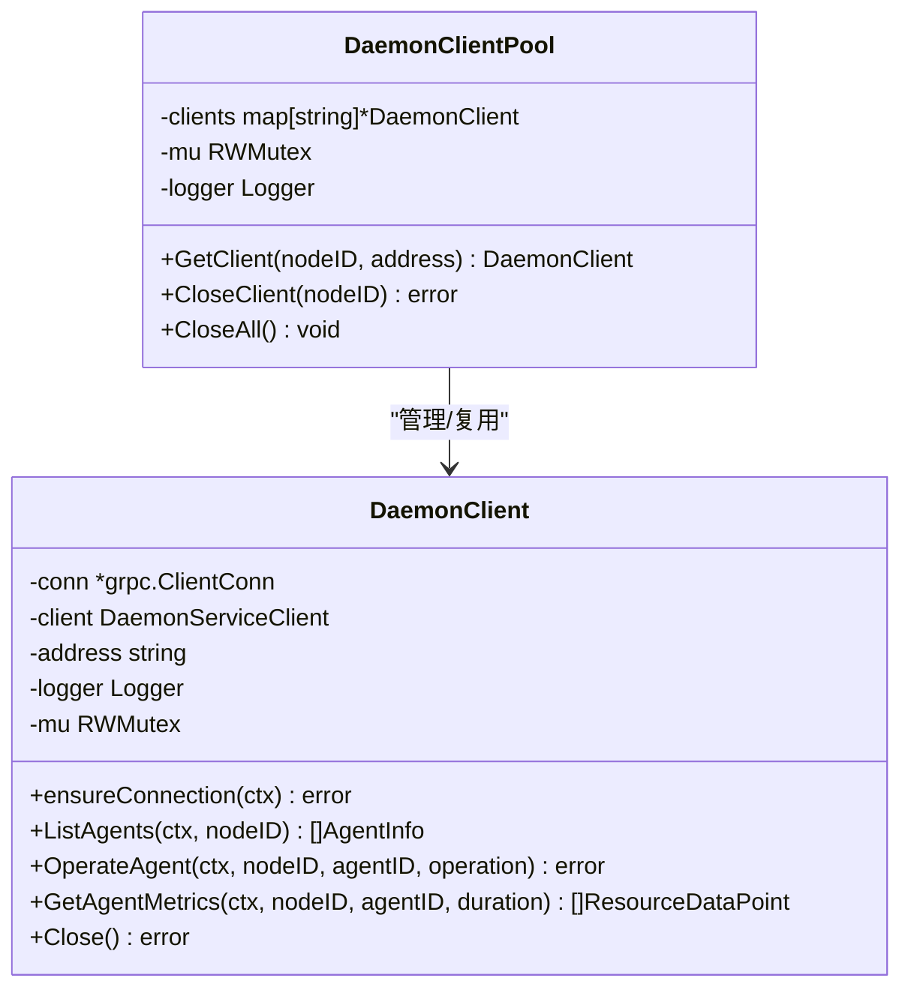
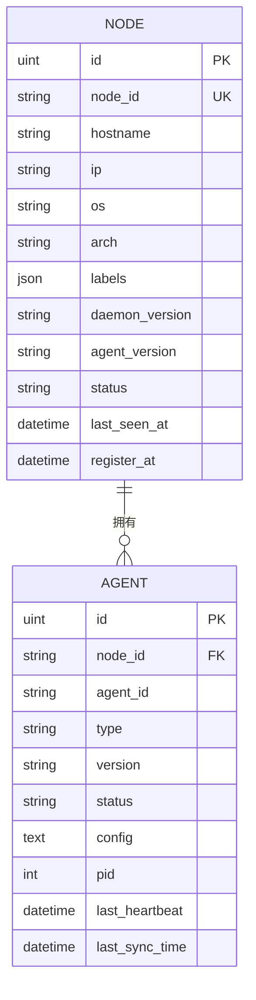
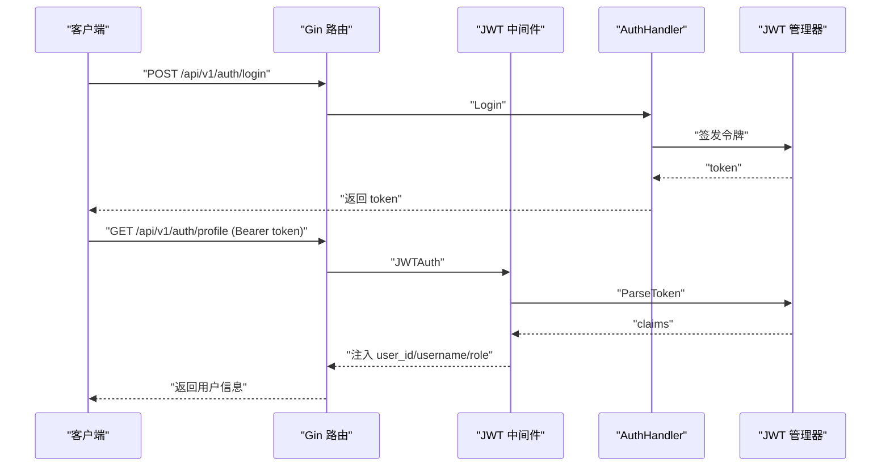
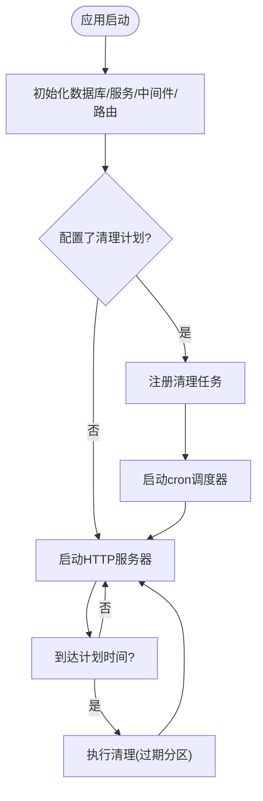
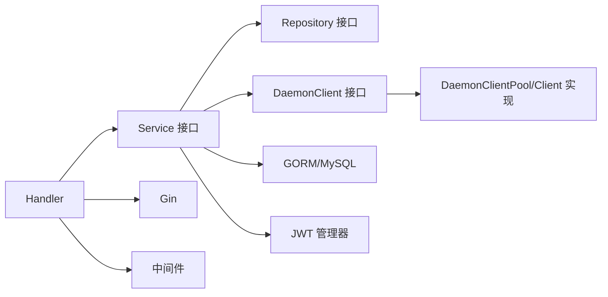

# Manager 模块架构

<cite>
**本文引用的文件**
- [manager/cmd/manager/main.go](file://manager/cmd/manager/main.go)
- [manager/internal/grpc/server.go](file://manager/internal/grpc/server.go)
- [manager/internal/grpc/daemon_server.go](file://manager/internal/grpc/daemon_server.go)
- [manager/internal/grpc/daemon_client.go](file://manager/internal/grpc/daemon_client.go)
- [manager/internal/handler/node.go](file://manager/internal/handler/node.go)
- [manager/internal/handler/agent.go](file://manager/internal/handler/agent.go)
- [manager/internal/service/node.go](file://manager/internal/service/node.go)
- [manager/internal/service/agent.go](file://manager/internal/service/agent.go)
- [manager/internal/repository/node.go](file://manager/internal/repository/node.go)
- [manager/internal/middleware/auth.go](file://manager/internal/middleware/auth.go)
- [manager/internal/model/node.go](file://manager/internal/model/node.go)
- [manager/internal/model/agent.go](file://manager/internal/model/agent.go)
- [manager/configs/manager.yaml](file://manager/configs/manager.yaml)
- [manager/pkg/proto/manager/manager.proto](file://manager/pkg/proto/manager/manager.proto)
- [manager/pkg/proto/daemon/daemon.proto](file://manager/pkg/proto/daemon/daemon.proto)
</cite>

## 目录
1. [引言](#引言)
2. [项目结构](#项目结构)
3. [核心组件](#核心组件)
4. [架构总览](#架构总览)
5. [详细组件分析](#详细组件分析)
6. [依赖关系分析](#依赖关系分析)
7. [性能考量](#性能考量)
8. [故障排查指南](#故障排查指南)
9. [结论](#结论)
10. [附录](#附录)

## 引言
本文件面向开发者与架构师，系统性阐述 Manager 模块的架构设计与实现要点。Manager 作为中心管理节点，承担以下职责：
- 节点管理：注册、心跳、状态维护、离线检测与统计
- 版本发布：记录 Daemon 与 Agent 的版本信息
- 任务调度：通过定时任务清理过期指标分区
- 用户认证：基于 JWT 的登录、鉴权与审计
- 数据聚合：统一对外提供 RESTful API，聚合来自 Daemon 的 Agent 状态与指标

Manager 采用 MVC 分层架构：
- API 网关层（Gin 路由与中间件）
- 业务服务层（NodeService、VersionService、TaskService、AgentService）
- 数据访问层（GORM Repository）
- 基础设施层（MySQL、Redis）

此外，Manager 与 Daemon 之间通过 gRPC 协议交互，核心接口包括 Register()、Heartbeat()、ReportMetrics() 以及 Daemon 上报 Agent 状态的 SyncAgentStates()。

## 项目结构
Manager 模块位于仓库根目录的 manager 子目录，主要子目录与职责如下：
- cmd/manager：应用入口，负责初始化配置、日志、数据库、JWT、gRPC/HTTP 服务器、路由与中间件、服务与仓储实例化、定时任务与优雅关闭
- internal/handler：HTTP 控制器层，封装路由与请求处理逻辑，调用 Service 层并输出统一响应
- internal/service：业务服务层，封装领域业务规则与流程编排
- internal/repository：数据访问层，封装 GORM 查询与写入
- internal/grpc：gRPC 服务端与客户端实现，负责与 Daemon 通信
- internal/middleware：HTTP 中间件，如认证、CORS、审计、恢复
- internal/model：数据模型与 JSON 映射
- configs：配置文件（YAML）
- pkg/proto：gRPC 协议定义与生成代码

图表来源
- [manager/cmd/manager/main.go](file://manager/cmd/manager/main.go#L1-L290)
- [manager/internal/handler/node.go](file://manager/internal/handler/node.go#L1-L157)
- [manager/internal/handler/agent.go](file://manager/internal/handler/agent.go#L1-L161)
- [manager/internal/service/node.go](file://manager/internal/service/node.go#L1-L234)
- [manager/internal/service/agent.go](file://manager/internal/service/agent.go#L1-L298)
- [manager/internal/repository/node.go](file://manager/internal/repository/node.go#L1-L226)
- [manager/internal/grpc/server.go](file://manager/internal/grpc/server.go#L1-L145)
- [manager/internal/grpc/daemon_server.go](file://manager/internal/grpc/daemon_server.go#L1-L70)
- [manager/internal/grpc/daemon_client.go](file://manager/internal/grpc/daemon_client.go#L1-L398)
- [manager/configs/manager.yaml](file://manager/configs/manager.yaml#L1-L52)

章节来源
- [manager/cmd/manager/main.go](file://manager/cmd/manager/main.go#L1-L290)
- [manager/configs/manager.yaml](file://manager/configs/manager.yaml#L1-L52)

## 核心组件
- 应用入口与控制流
  - 初始化配置、日志、数据库、JWT 管理器
  - 初始化 Repository 与 Service
  - 注册 Gin 路由与中间件，启动 HTTP 与 gRPC 服务器
  - 启动定时任务（指标清理），优雅关闭
- Handler 层
  - 节点管理：列表、详情、删除、统计
  - Agent 管理：列举、操作、日志（预留）
  - 认证：登录、注册、个人资料、改密
- Service 层
  - NodeService：注册、心跳、状态更新、离线检测、统计
  - AgentService：同步 Agent 状态、列举、远程操作、日志（预留）
- Repository 层
  - NodeRepository：增删改查、按状态/标签分页、心跳更新、版本更新、离线查询、状态统计
- gRPC 通信
  - ManagerService（Manager -> Daemon）：RegisterNode、Heartbeat、ReportMetrics
  - DaemonService（Daemon -> Manager）：SyncAgentStates
  - DaemonClientPool：连接池与自动重连

章节来源
- [manager/cmd/manager/main.go](file://manager/cmd/manager/main.go#L1-L290)
- [manager/internal/handler/node.go](file://manager/internal/handler/node.go#L1-L157)
- [manager/internal/handler/agent.go](file://manager/internal/handler/agent.go#L1-L161)
- [manager/internal/service/node.go](file://manager/internal/service/node.go#L1-L234)
- [manager/internal/service/agent.go](file://manager/internal/service/agent.go#L1-L298)
- [manager/internal/repository/node.go](file://manager/internal/repository/node.go#L1-L226)
- [manager/internal/grpc/server.go](file://manager/internal/grpc/server.go#L1-L145)
- [manager/internal/grpc/daemon_server.go](file://manager/internal/grpc/daemon_server.go#L1-L70)
- [manager/internal/grpc/daemon_client.go](file://manager/internal/grpc/daemon_client.go#L1-L398)

## 架构总览
Manager 以“入口初始化 -> MVC 分层 -> gRPC 通信 -> 基础设施”为主线，形成清晰的职责边界与依赖方向。

图表来源
- [manager/cmd/manager/main.go](file://manager/cmd/manager/main.go#L1-L290)
- [manager/configs/manager.yaml](file://manager/configs/manager.yaml#L1-L52)
- [manager/internal/grpc/server.go](file://manager/internal/grpc/server.go#L1-L145)
- [manager/internal/grpc/daemon_server.go](file://manager/internal/grpc/daemon_server.go#L1-L70)
- [manager/internal/grpc/daemon_client.go](file://manager/internal/grpc/daemon_client.go#L1-L398)
- [manager/internal/service/node.go](file://manager/internal/service/node.go#L1-L234)
- [manager/internal/service/agent.go](file://manager/internal/service/agent.go#L1-L298)
- [manager/internal/repository/node.go](file://manager/internal/repository/node.go#L1-L226)

## 详细组件分析

### MVC 分层架构
- API 网关层（Gin）
  - 全局中间件：恢复、日志、CORS
  - 认证中间件：JWT 解析、角色校验
  - 路由分组：公开 API（登录/注册）、认证 API（个人资料/改密/节点/指标/Agent）、管理员 API（用户/节点）
- 业务服务层
  - NodeService：节点生命周期、心跳、离线检测、统计
  - AgentService：Agent 状态同步、远程操作、日志（预留）
- 数据访问层（GORM）
  - NodeRepository：分页、过滤、聚合、更新
- 基础设施
  - MySQL：持久化节点、Agent、指标、审计日志等
  - Redis：配置中存在但当前未在 Manager 代码中直接使用（可扩展）

章节来源
- [manager/cmd/manager/main.go](file://manager/cmd/manager/main.go#L135-L211)
- [manager/internal/middleware/auth.go](file://manager/internal/middleware/auth.go#L1-L98)
- [manager/internal/service/node.go](file://manager/internal/service/node.go#L1-L234)
- [manager/internal/service/agent.go](file://manager/internal/service/agent.go#L1-L298)
- [manager/internal/repository/node.go](file://manager/internal/repository/node.go#L1-L226)
- [manager/configs/manager.yaml](file://manager/configs/manager.yaml#L1-L52)

### gRPC 通信协议与流程

#### ManagerService（Manager -> Daemon）
- RegisterNode：节点注册，写入节点信息
- Heartbeat：心跳上报，更新心跳时间与状态
- ReportMetrics：批量保存指标

图表来源
- [manager/internal/grpc/server.go](file://manager/internal/grpc/server.go#L1-L145)
- [manager/internal/service/node.go](file://manager/internal/service/node.go#L1-L234)
- [manager/internal/service/agent.go](file://manager/internal/service/agent.go#L1-L298)

#### DaemonService（Daemon -> Manager）
- SyncAgentStates：Daemon 上报 Agent 状态，Manager 写入/更新 Agent 表

图表来源
- [manager/internal/grpc/daemon_server.go](file://manager/internal/grpc/daemon_server.go#L1-L70)
- [manager/internal/service/agent.go](file://manager/internal/service/agent.go#L1-L298)

#### Manager 与 Daemon 的连接池与重连
- DaemonClientPool：按 nodeID 维护连接，支持自动重连与并发安全
- DaemonClient：带 keepalive 的 gRPC 客户端，提供 OperateAgent/ListAgents/GetAgentMetrics 等能力

图表来源
- [manager/internal/grpc/daemon_client.go](file://manager/internal/grpc/daemon_client.go#L1-L398)

章节来源
- [manager/internal/grpc/daemon_client.go](file://manager/internal/grpc/daemon_client.go#L1-L398)
- [manager/internal/grpc/daemon_server.go](file://manager/internal/grpc/daemon_server.go#L1-L70)

### 数据模型与关系
- Node：节点基本信息、标签、版本、状态、心跳时间
- Agent：Agent 基本信息、状态、配置、进程信息、最后同步时间

图表来源
- [manager/internal/model/node.go](file://manager/internal/model/node.go#L1-L68)
- [manager/internal/model/agent.go](file://manager/internal/model/agent.go#L1-L53)

章节来源
- [manager/internal/model/node.go](file://manager/internal/model/node.go#L1-L68)
- [manager/internal/model/agent.go](file://manager/internal/model/agent.go#L1-L53)

### 认证与授权流程
- 登录/注册：公开 API，返回 JWT
- 认证中间件：解析 Authorization 头，校验 Token，注入用户信息
- 管理员中间件：校验角色为 admin

图表来源
- [manager/internal/middleware/auth.go](file://manager/internal/middleware/auth.go#L1-L98)
- [manager/cmd/manager/main.go](file://manager/cmd/manager/main.go#L135-L211)

章节来源
- [manager/internal/middleware/auth.go](file://manager/internal/middleware/auth.go#L1-L98)
- [manager/cmd/manager/main.go](file://manager/cmd/manager/main.go#L135-L211)

### 任务调度与指标清理
- 定时任务：基于 cron 表达式定期清理过期指标分区
- 触发时机：HTTP 服务器启动后启动调度器

图表来源
- [manager/cmd/manager/main.go](file://manager/cmd/manager/main.go#L110-L133)

章节来源
- [manager/cmd/manager/main.go](file://manager/cmd/manager/main.go#L110-L133)

## 依赖关系分析
- 组件耦合
  - Handler 仅依赖 Service 接口，低耦合高内聚
  - Service 依赖 Repository 接口，便于替换实现
  - gRPC 客户端通过接口注入，避免循环依赖
- 外部依赖
  - Gin：HTTP 路由与中间件
  - GORM：ORM 与 MySQL
  - gRPC：Manager <-> Daemon 通信
  - JWT：认证与授权
  - Zap：日志
  - Cron：定时任务
- 循环依赖规避
  - 通过接口抽象（如 DaemonClient/DaemonClientPool）避免循环导入

图表来源
- [manager/internal/handler/node.go](file://manager/internal/handler/node.go#L1-L157)
- [manager/internal/handler/agent.go](file://manager/internal/handler/agent.go#L1-L161)
- [manager/internal/service/node.go](file://manager/internal/service/node.go#L1-L234)
- [manager/internal/service/agent.go](file://manager/internal/service/agent.go#L1-L298)
- [manager/internal/grpc/daemon_client.go](file://manager/internal/grpc/daemon_client.go#L1-L398)

章节来源
- [manager/internal/handler/node.go](file://manager/internal/handler/node.go#L1-L157)
- [manager/internal/handler/agent.go](file://manager/internal/handler/agent.go#L1-L161)
- [manager/internal/service/node.go](file://manager/internal/service/node.go#L1-L234)
- [manager/internal/service/agent.go](file://manager/internal/service/agent.go#L1-L298)
- [manager/internal/grpc/daemon_client.go](file://manager/internal/grpc/daemon_client.go#L1-L398)

## 性能考量
- 连接池与重连
  - DaemonClientPool 按 nodeID 缓存连接，减少握手成本；自动重连保障稳定性
- 批量写入
  - ReportMetrics 采用批量创建，降低数据库往返次数
- 分页与索引
  - NodeRepository 提供分页与按状态/标签查询，配合 JSON 字段查询与索引提升性能
- 定时任务
  - 指标清理在后台执行，避免阻塞主请求链路
- 并发安全
  - 连接池与客户端内部使用读写锁，保证并发安全

章节来源
- [manager/internal/grpc/daemon_client.go](file://manager/internal/grpc/daemon_client.go#L1-L398)
- [manager/internal/grpc/server.go](file://manager/internal/grpc/server.go#L1-L145)
- [manager/internal/repository/node.go](file://manager/internal/repository/node.go#L1-L226)
- [manager/cmd/manager/main.go](file://manager/cmd/manager/main.go#L110-L133)

## 故障排查指南
- 认证失败
  - 检查 Authorization 头格式与 Token 是否过期
  - 确认 JWT 秘钥、签发者与过期时间配置一致
- gRPC 连接问题
  - Daemon 地址与端口是否正确；连接状态是否 Ready
  - 查看重连日志与错误码
- 数据库异常
  - 检查 DSN、连接池参数与日志级别
  - 关注 GORM 报错与事务回滚
- 指标清理失败
  - 检查 cron 表达式与调度器状态
  - 查看清理任务日志

章节来源
- [manager/internal/middleware/auth.go](file://manager/internal/middleware/auth.go#L1-L98)
- [manager/internal/grpc/daemon_client.go](file://manager/internal/grpc/daemon_client.go#L1-L398)
- [manager/cmd/manager/main.go](file://manager/cmd/manager/main.go#L110-L133)

## 结论
Manager 模块通过清晰的 MVC 分层、完善的 gRPC 通信与稳健的基础设施集成，实现了节点与 Agent 的集中管理、指标聚合与任务调度。其架构具备良好的扩展性与可维护性，适合在生产环境中长期演进。

## 附录

### 关键架构决策说明
- 选择 Gin 作为 API 网关
  - 轻量、高性能、生态丰富，适合构建 RESTful API
- 选择 GORM 作为 ORM
  - 简单易用、生态成熟，满足 Manager 的数据访问需求
- 选择 gRPC 作为内部通信协议
  - 高性能、强类型、跨语言，适合 Manager 与 Daemon 的稳定通信
- 选择 Zustand（前端）
  - 轻量状态管理，适合前端快速开发与状态共享

章节来源
- [manager/cmd/manager/main.go](file://manager/cmd/manager/main.go#L135-L211)
- [manager/internal/grpc/server.go](file://manager/internal/grpc/server.go#L1-L145)
- [manager/internal/grpc/daemon_server.go](file://manager/internal/grpc/daemon_server.go#L1-L70)
- [manager/internal/grpc/daemon_client.go](file://manager/internal/grpc/daemon_client.go#L1-L398)

### gRPC 协议定义
- ManagerService（Manager -> Daemon）
  - RegisterNode
  - Heartbeat
  - ReportMetrics
- DaemonService（Daemon -> Manager）
  - SyncAgentStates

章节来源
- [manager/pkg/proto/manager/manager.proto](file://manager/pkg/proto/manager/manager.proto)
- [manager/pkg/proto/daemon/daemon.proto](file://manager/pkg/proto/daemon/daemon.proto)