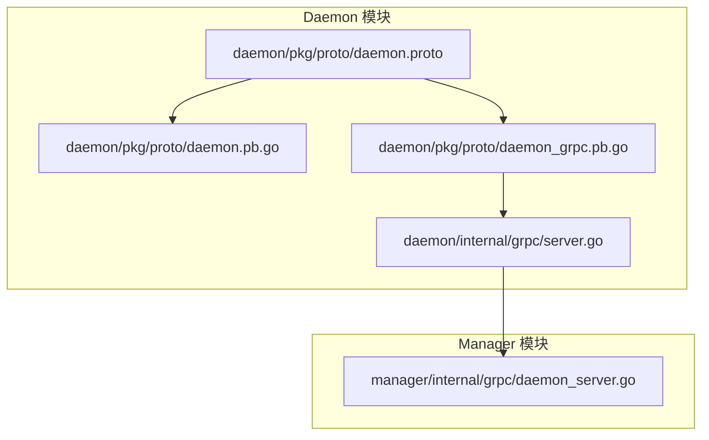
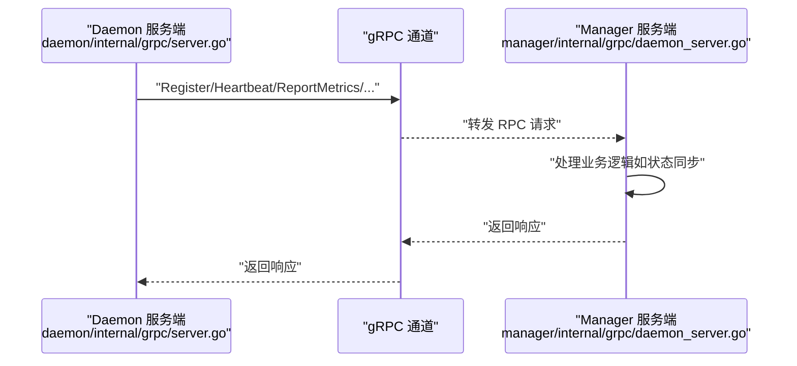
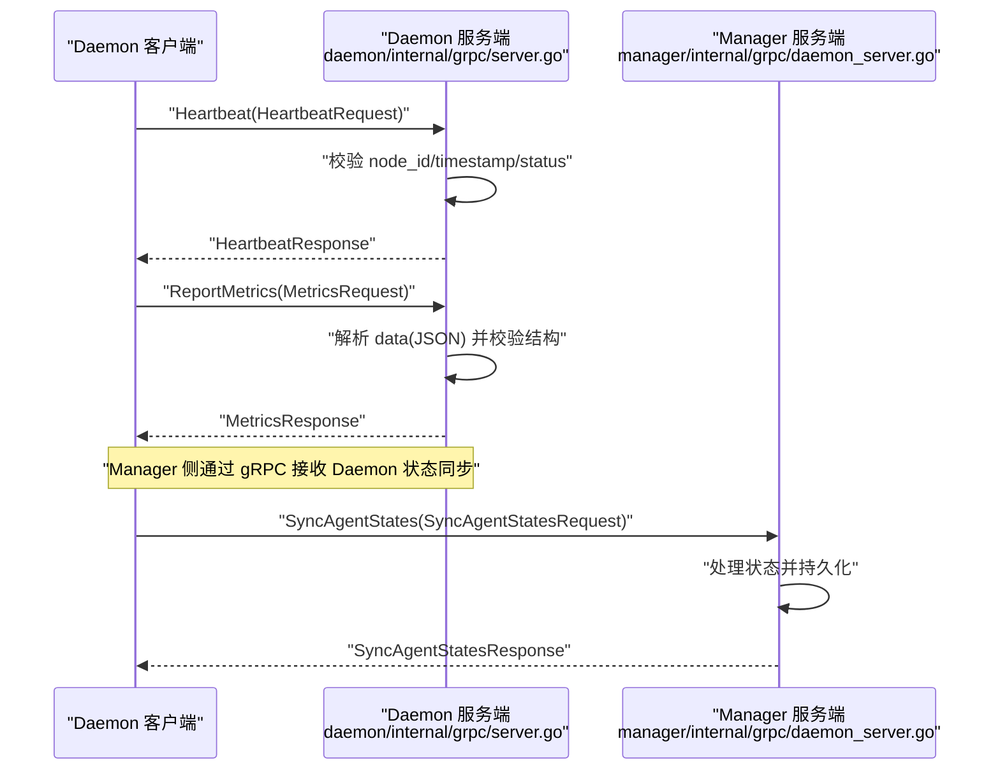
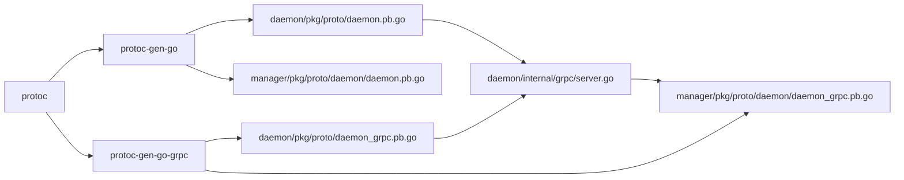

# Protobuf协议定义

<cite>
**本文引用的文件**
- [daemon.proto](file://daemon/pkg/proto/daemon.proto)
- [daemon.pb.go](file://daemon/pkg/proto/daemon.pb.go)
- [daemon_grpc.pb.go](file://daemon/pkg/proto/daemon_grpc.pb.go)
- [server.go](file://daemon/internal/grpc/server.go)
- [daemon_server.go](file://manager/internal/grpc/daemon_server.go)
- [Makefile（daemon）](file://daemon/Makefile)
- [Makefile（manager）](file://manager/Makefile)
- [grpc_integration_test.go](file://daemon/test/integration/grpc_integration_test.go)
- [grpc_test_helpers.go](file://daemon/test/integration/grpc_test_helpers.go)
- [README.md（集成测试）](file://daemon/test/integration/README.md)
</cite>

## 目录
1. [简介](#简介)
2. [项目结构](#项目结构)
3. [核心组件](#核心组件)
4. [架构总览](#架构总览)
5. [详细组件分析](#详细组件分析)
6. [依赖关系分析](#依赖关系分析)
7. [性能考量](#性能考量)
8. [故障排查指南](#故障排查指南)
9. [结论](#结论)
10. [附录](#附录)

## 简介
本文件围绕 daemon 模块中的 Protobuf 协议定义，系统化梳理 DaemonService 服务的 RPC 方法签名、消息字段语义与数据约束，重点解释 RegisterNodeRequest、HeartbeatRequest、ReportMetricsRequest 等消息的关键字段（如 NodeID、Timestamp、Metrics.Values 等），并给出从 .proto 生成 Go 代码的步骤、gRPC 流式调用现状说明、版本兼容性策略建议，以及如何安全地扩展消息类型以保持向后兼容。

## 项目结构
- 协议定义位于 daemon/pkg/proto/daemon.proto
- 自动生成的 Go 代码位于 daemon/pkg/proto/daemon.pb.go 和 daemon/pkg/proto/daemon_grpc.pb.go
- 服务端实现位于 daemon/internal/grpc/server.go
- Manager 端对 Daemon 的 gRPC 适配位于 manager/internal/grpc/daemon_server.go
- 生成脚本位于各模块 Makefile 中
- 集成测试展示了典型调用流程

图表来源
- [daemon.proto](file://daemon/pkg/proto/daemon.proto#L1-L35)
- [daemon.pb.go](file://daemon/pkg/proto/daemon.pb.go#L1-L120)
- [daemon_grpc.pb.go](file://daemon/pkg/proto/daemon_grpc.pb.go#L1-L60)
- [server.go](file://daemon/internal/grpc/server.go#L1-L40)
- [daemon_server.go](file://manager/internal/grpc/daemon_server.go#L1-L40)

章节来源
- [daemon.proto](file://daemon/pkg/proto/daemon.proto#L1-L35)
- [daemon.pb.go](file://daemon/pkg/proto/daemon.pb.go#L1-L120)
- [daemon_grpc.pb.go](file://daemon/pkg/proto/daemon_grpc.pb.go#L1-L60)
- [server.go](file://daemon/internal/grpc/server.go#L1-L40)
- [daemon_server.go](file://manager/internal/grpc/daemon_server.go#L1-L40)

## 核心组件
- DaemonService 服务：包含 Register、Heartbeat、ReportMetrics、GetConfig、PushUpdate、ListAgents、OperateAgent、GetAgentMetrics、SyncAgentStates 等 RPC 方法
- 关键消息类型：
  - RegisterRequest/Response：节点注册
  - HeartbeatRequest/Response：心跳上报
  - MetricsRequest/Response：指标上报（bytes 字段承载 JSON）
  - AgentInfo/AgentMetricsRequest/AgentMetricsResponse：Agent 资源指标
  - SyncAgentStatesRequest/Response：Daemon 向 Manager 上报 Agent 状态

章节来源
- [daemon.proto](file://daemon/pkg/proto/daemon.proto#L7-L35)
- [daemon_grpc.pb.go](file://daemon/pkg/proto/daemon_grpc.pb.go#L33-L57)

## 架构总览
Daemon 通过 gRPC 向 Manager 提供运维能力，Manager 侧实现 DaemonService 的服务端以接收 Daemon 的状态与指标上报。

图表来源
- [server.go](file://daemon/internal/grpc/server.go#L1-L40)
- [daemon_grpc.pb.go](file://daemon/pkg/proto/daemon_grpc.pb.go#L157-L227)
- [daemon_server.go](file://manager/internal/grpc/daemon_server.go#L1-L40)

## 详细组件分析

### DaemonService RPC 方法清单与签名
- Register(RegisterRequest) -> RegisterResponse
- Heartbeat(HeartbeatRequest) -> HeartbeatResponse
- ReportMetrics(MetricsRequest) -> MetricsResponse
- GetConfig(ConfigRequest) -> ConfigResponse
- PushUpdate(UpdateRequest) -> UpdateResponse
- ListAgents(ListAgentsRequest) -> ListAgentsResponse
- OperateAgent(AgentOperationRequest) -> AgentOperationResponse
- GetAgentMetrics(AgentMetricsRequest) -> AgentMetricsResponse
- SyncAgentStates(SyncAgentStatesRequest) -> SyncAgentStatesResponse

说明
- 以上方法均为一元 RPC（Unary），未见双向流式或服务端流式定义
- 方法名与注释均来自 .proto 文件

章节来源
- [daemon.proto](file://daemon/pkg/proto/daemon.proto#L7-L35)
- [daemon_grpc.pb.go](file://daemon/pkg/proto/daemon_grpc.pb.go#L21-L31)

### RegisterNodeRequest/Response 字段语义与约束
- RegisterRequest
  - hostname: string，主机名
  - ip: string，IP 地址
  - os: string，操作系统
  - arch: string，架构
  - labels: map<string,string>，标签键值对
  - daemon_version: string，Daemon 版本
  - agent_version: string，Agent 版本
- RegisterResponse
  - node_id: string，分配的节点标识
  - success: bool，是否成功
  - message: string，结果消息

字段约束与建议
- hostname/ip/os/arch 建议非空且符合常规格式
- labels 建议键名简洁、值可控，避免超长或特殊字符
- daemon_version/agent_version 建议遵循语义化版本规范

章节来源
- [daemon.proto](file://daemon/pkg/proto/daemon.proto#L37-L53)
- [daemon.pb.go](file://daemon/pkg/proto/daemon.pb.go#L23-L115)

### HeartbeatRequest/Response 字段语义与约束
- HeartbeatRequest
  - node_id: string，节点标识
  - timestamp: int64，Unix 时间戳（秒或毫秒，建议与服务端约定一致）
  - status: string，节点状态字符串
- HeartbeatResponse
  - success: bool，是否成功
  - message: string，结果消息

字段约束与建议
- timestamp 建议使用 Unix 秒，与服务端解析一致
- status 建议采用预定义枚举字符串集合，便于统一处理

章节来源
- [daemon.proto](file://daemon/pkg/proto/daemon.proto#L55-L66)
- [daemon.pb.go](file://daemon/pkg/proto/daemon.pb.go#L177-L249)

### ReportMetricsRequest/Response 字段语义与约束
- MetricsRequest
  - node_id: string，节点标识
  - timestamp: int64，Unix 时间戳（建议与 Heartbeat 一致）
  - data: bytes，JSON 编码的指标数据
- MetricsResponse
  - success: bool，是否成功
  - message: string，结果消息

字段约束与建议
- data 字段承载 JSON，建议包含指标名称到数值的映射
- 对于 Values 字段（若 JSON 中包含），建议使用浮点数或整数，避免字符串导致解析歧义
- 建议在服务端对 data 进行长度限制与 JSON 结构校验

章节来源
- [daemon.proto](file://daemon/pkg/proto/daemon.proto#L68-L79)
- [daemon.pb.go](file://daemon/pkg/proto/daemon.pb.go#L291-L360)

### AgentInfo/AgentMetricsRequest/AgentMetricsResponse
- AgentInfo
  - id: string，Agent 唯一标识
  - type: string，Agent 类型（如 filebeat/telegraf/node_exporter）
  - version: string，可选版本
  - status: string，运行状态
  - pid: int32，进程 ID
  - start_time: int64，启动时间（Unix 时间戳）
  - restart_count: int32，重启次数
  - last_heartbeat: int64，最后心跳时间（Unix 时间戳）
- AgentMetricsRequest
  - agent_id: string，Agent ID
  - duration_seconds: int64，默认 3600（1 小时）
- AgentMetricsResponse
  - agent_id: string，Agent ID
  - data_points: repeated ResourceDataPoint
- ResourceDataPoint
  - timestamp: int64，Unix 时间戳
  - cpu: double，CPU 使用率（百分比）
  - memory_rss: uint64，内存 RSS（字节）
  - memory_vms: uint64，内存 VMS（字节）
  - disk_read_bytes: uint64，磁盘读取字节数
  - disk_write_bytes: uint64，磁盘写入字节数
  - open_files: int32，打开文件数

字段约束与建议
- duration_seconds 为正数；若为 0 或负数，服务端通常回退到默认值
- ResourceDataPoint 字段建议与监控采集口径一致，避免单位不统一

章节来源
- [daemon.proto](file://daemon/pkg/proto/daemon.proto#L107-L183)
- [daemon.pb.go](file://daemon/pkg/proto/daemon.pb.go#L633-L800)

### SyncAgentStatesRequest/Response
- SyncAgentStatesRequest
  - node_id: string，节点标识
  - states: repeated AgentState
- SyncAgentStatesResponse
  - success: bool，是否成功
  - message: string，结果消息
- AgentState
  - agent_id: string，Agent ID
  - status: string，运行状态
  - pid: int32，进程 ID
  - last_heartbeat: int64，最后心跳时间

用途说明
- 用于 Daemon 向 Manager 上报 Agent 状态，便于集中管理与告警

章节来源
- [daemon.proto](file://daemon/pkg/proto/daemon.proto#L164-L183)
- [daemon.pb.go](file://daemon/pkg/proto/daemon.pb.go#L633-L732)

### gRPC 流式调用说明
- 当前 .proto 中未定义任何服务流式方法（Streams 为空）
- 所有方法均为一元 RPC，适合高频短消息上报（如心跳、指标）

章节来源
- [daemon_grpc.pb.go](file://daemon/pkg/proto/daemon_grpc.pb.go#L445-L447)

### 从 .proto 生成 Go 代码
- daemon 模块
  - 使用 Makefile 中的 proto 目标生成
  - 命令要点：protoc --go_out=... --go-grpc_out=... pkg/proto/daemon.proto
- manager 模块
  - 使用 Makefile 中的 proto 目标生成
  - 为避免与 daemon 模块的 pkg/proto/daemon.proto 冲突，manager 使用 pkg/proto/daemon/daemon.proto 路径

章节来源
- [Makefile（daemon）](file://daemon/Makefile#L66-L73)
- [Makefile（manager）](file://manager/Makefile#L66-L73)
- [README.md（集成测试）](file://daemon/test/integration/README.md#L28-L36)

### 版本兼容性策略
- 字段编号复用与新增
  - 新增字段应使用新的字段编号，避免覆盖已有字段
  - 旧客户端仍能正确解析新服务端返回的新增字段（保留）
- 字段可选性
  - 新增字段建议标记为可选，确保旧客户端不会因缺失而失败
- JSON 承载数据
  - MetricsRequest.data 为 bytes(JSON)，建议在服务端进行结构校验与长度限制
- 包名与路径
  - 为避免同一包名下同名 proto 冲突，manager 使用 pkg/proto/daemon/daemon.proto 路径生成代码

章节来源
- [daemon.proto](file://daemon/pkg/proto/daemon.proto#L1-L6)
- [Makefile（manager）](file://manager/Makefile#L66-L73)
- [README.md（集成测试）](file://daemon/test/integration/README.md#L28-L36)

### 典型调用流程（序列图）
以下序列图展示心跳上报与指标上报的典型调用链路。

图表来源
- [server.go](file://daemon/internal/grpc/server.go#L1-L40)
- [daemon_grpc.pb.go](file://daemon/pkg/proto/daemon_grpc.pb.go#L157-L227)
- [daemon_server.go](file://manager/internal/grpc/daemon_server.go#L1-L40)

章节来源
- [grpc_integration_test.go](file://daemon/test/integration/grpc_integration_test.go#L1-L120)
- [grpc_test_helpers.go](file://daemon/test/integration/grpc_test_helpers.go#L1-L70)

## 依赖关系分析
- 代码生成依赖
  - protoc 可执行程序
  - protoc-gen-go 与 protoc-gen-go-grpc 插件
- 运行时依赖
  - google.golang.org/grpc
  - google.golang.org/protobuf
- 模块间依赖
  - daemon 模块生成的 proto 代码被 daemon 内部服务端使用
  - manager 模块生成的 proto 代码被 manager 内部服务端使用
  - 两者通过 gRPC 交互，不直接共享 .proto 文件

图表来源
- [daemon.pb.go](file://daemon/pkg/proto/daemon.pb.go#L1-L20)
- [daemon_grpc.pb.go](file://daemon/pkg/proto/daemon_grpc.pb.go#L1-L20)
- [Makefile（daemon）](file://daemon/Makefile#L66-L73)
- [Makefile（manager）](file://manager/Makefile#L66-L73)

章节来源
- [daemon.pb.go](file://daemon/pkg/proto/daemon.pb.go#L1-L20)
- [daemon_grpc.pb.go](file://daemon/pkg/proto/daemon_grpc.pb.go#L1-L20)
- [Makefile（daemon）](file://daemon/Makefile#L66-L73)
- [Makefile（manager）](file://manager/Makefile#L66-L73)

## 性能考量
- 心跳频率与批量化
  - 建议合理设置心跳间隔，避免过于频繁导致网络与 CPU 压力
  - 指标上报建议合并小粒度数据，减少 RPC 次数
- 消息大小控制
  - MetricsRequest.data 为 bytes(JSON)，建议限制单次上报的数据量
- 超时与重试
  - 客户端应设置合理的超时与指数退避重试策略
- 资源监控
  - 使用 AgentMetricsRequest/Response 获取资源历史，辅助容量规划

[本节为通用建议，无需列出具体文件来源]

## 故障排查指南
- 常见错误与定位
  - 参数校验失败：检查 node_id、agent_id 是否为空，operation 是否在允许集合内
  - 未实现方法：确认服务端是否实现了对应方法（UnimplementedDaemonServiceServer）
  - 协议冲突：避免同名 proto 文件在同一包名下，manager 已通过路径区分
- 日志与可观测性
  - 服务端在关键路径打印日志，便于定位问题
- 集成测试参考
  - 参考集成测试中的客户端封装与调用方式，快速复现问题

章节来源
- [server.go](file://daemon/internal/grpc/server.go#L69-L124)
- [daemon_grpc.pb.go](file://daemon/pkg/proto/daemon_grpc.pb.go#L184-L227)
- [README.md（集成测试）](file://daemon/test/integration/README.md#L28-L36)
- [grpc_integration_test.go](file://daemon/test/integration/grpc_integration_test.go#L1-L120)

## 结论
- 本协议定义清晰，字段语义明确，适合 Daemon 与 Manager 之间的运维协作
- 当前为一元 RPC，适合高频短消息上报；如需大流量或实时推送，可考虑引入服务端流式或客户端流式
- 通过合理的字段编号策略与可选字段设计，可保证向后兼容
- 生成脚本与模块路径分离有效避免了协议冲突，建议在扩展时延续该做法

[本节为总结性内容，无需列出具体文件来源]

## 附录

### 附录A：IDL 示例（方法与消息）
- 服务定义（摘自 .proto）
  - service DaemonService {
    - rpc Register(RegisterRequest) returns (RegisterResponse);
    - rpc Heartbeat(HeartbeatRequest) returns (HeartbeatResponse);
    - rpc ReportMetrics(MetricsRequest) returns (MetricsResponse);
    - rpc GetConfig(ConfigRequest) returns (ConfigResponse);
    - rpc PushUpdate(UpdateRequest) returns (UpdateResponse);
    - rpc ListAgents(ListAgentsRequest) returns (ListAgentsResponse);
    - rpc OperateAgent(AgentOperationRequest) returns (AgentOperationResponse);
    - rpc GetAgentMetrics(AgentMetricsRequest) returns (AgentMetricsResponse);
    - rpc SyncAgentStates(SyncAgentStatesRequest) returns (SyncAgentStatesResponse);
  }

- 关键消息（摘自 .proto）
  - RegisterRequest/Response
  - HeartbeatRequest/Response
  - MetricsRequest/Response
  - AgentInfo/AgentMetricsRequest/AgentMetricsResponse
  - SyncAgentStatesRequest/Response

章节来源
- [daemon.proto](file://daemon/pkg/proto/daemon.proto#L7-L35)
- [daemon.proto](file://daemon/pkg/proto/daemon.proto#L37-L183)

### 附录B：从 .proto 生成 Go 代码步骤
- daemon 模块
  - 执行：make proto
  - 生成：pkg/proto/daemon.pb.go、pkg/proto/daemon_grpc.pb.go
- manager 模块
  - 执行：make proto
  - 生成：pkg/proto/daemon/daemon.pb.go、pkg/proto/daemon/daemon_grpc.pb.go
- 注意：manager 使用 pkg/proto/daemon/daemon.proto 路径避免与 daemon 冲突

章节来源
- [Makefile（daemon）](file://daemon/Makefile#L66-L73)
- [Makefile（manager）](file://manager/Makefile#L66-L73)
- [README.md（集成测试）](file://daemon/test/integration/README.md#L28-L36)

### 附录C：扩展消息类型的向后兼容实践
- 新增字段
  - 使用新的字段编号
  - 标记为可选，避免破坏旧客户端解析
- JSON 数据承载
  - 严格校验 data 字段的 JSON 结构与长度
  - 为未来字段演进预留扩展空间
- 包名与路径
  - 保持不同模块的 proto 路径差异化，避免同名文件冲突

章节来源
- [daemon.proto](file://daemon/pkg/proto/daemon.proto#L1-L6)
- [daemon.proto](file://daemon/pkg/proto/daemon.proto#L68-L79)
- [Makefile（manager）](file://manager/Makefile#L66-L73)