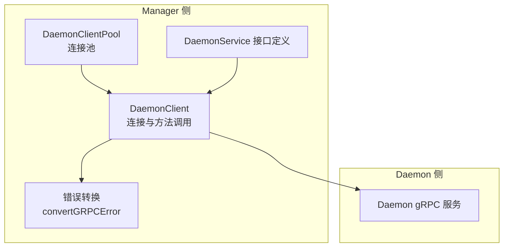
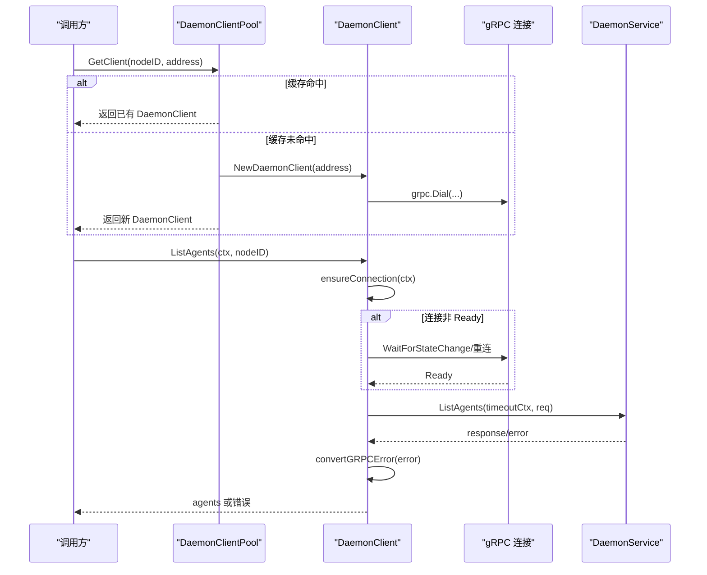
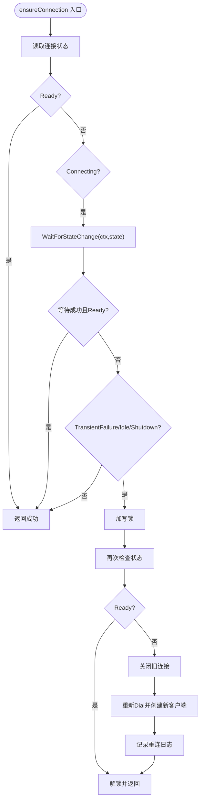
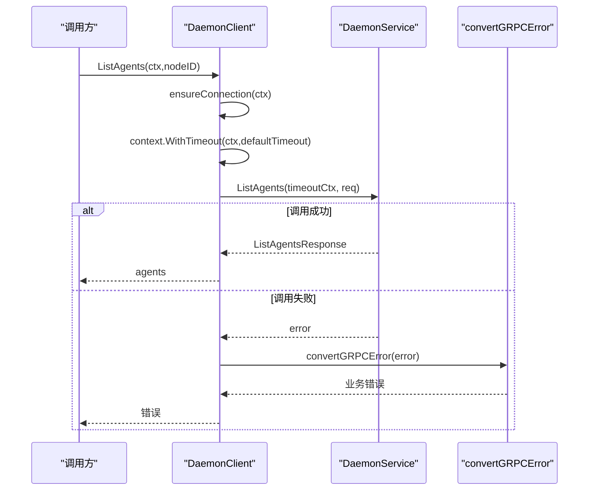
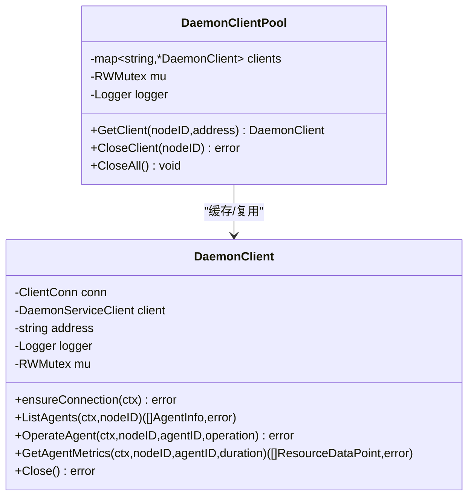
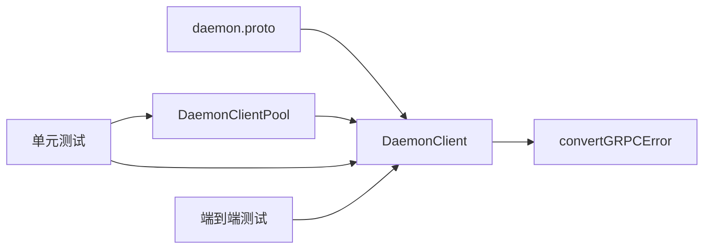

# gRPC客户端

<cite>
**本文引用的文件**
- [daemon_client.go](file://manager/internal/grpc/daemon_client.go)
- [errors.go](file://manager/internal/grpc/errors.go)
- [daemon.proto](file://manager/pkg/proto/daemon/daemon.proto)
- [daemon_client_test.go](file://manager/internal/grpc/daemon_client_test.go)
- [daemon_client_e2e_test.go](file://manager/internal/grpc/daemon_client_e2e_test.go)
</cite>

## 目录
1. [简介](#简介)
2. [项目结构](#项目结构)
3. [核心组件](#核心组件)
4. [架构总览](#架构总览)
5. [详细组件分析](#详细组件分析)
6. [依赖关系分析](#依赖关系分析)
7. [性能考量](#性能考量)
8. [故障排查指南](#故障排查指南)
9. [结论](#结论)
10. [附录](#附录)

## 简介
本文件面向开发者与运维人员，系统化阐述 Manager 模块中的 Daemon gRPC 客户端实现，重点覆盖以下主题：
- DaemonClient 结构体的状态管理机制与连接重试逻辑
- ensureConnection 如何处理 TransientFailure 等连接状态并实现自动重连
- ListAgents、OperateAgent、GetAgentMetrics 的超时控制与错误转换策略
- DaemonClientPool 连接池的实现原理，包括 GetClient 的双重检查锁定机制与 CloseAll 的资源清理过程
- 客户端使用示例，展示如何在业务逻辑中安全地获取与使用客户端实例

## 项目结构
围绕 gRPC 客户端的关键文件组织如下：
- manager/internal/grpc/daemon_client.go：DaemonClient 与 DaemonClientPool 的实现，包含 ensureConnection、方法超时与错误转换
- manager/internal/grpc/errors.go：业务错误类型与 convertGRPCError 错误转换函数
- manager/pkg/proto/daemon/daemon.proto：DaemonService 的 RPC 接口定义
- manager/internal/grpc/daemon_client_test.go：单元测试，覆盖超时、连接错误、参数校验、连接池行为与错误转换
- manager/internal/grpc/daemon_client_e2e_test.go：端到端测试，验证真实服务端下的连接复用与基本调用流程

图表来源
- [daemon_client.go](file://manager/internal/grpc/daemon_client.go#L1-L398)
- [errors.go](file://manager/internal/grpc/errors.go#L1-L48)
- [daemon.proto](file://manager/pkg/proto/daemon/daemon.proto#L1-L184)

章节来源
- [daemon_client.go](file://manager/internal/grpc/daemon_client.go#L1-L398)
- [errors.go](file://manager/internal/grpc/errors.go#L1-L48)
- [daemon.proto](file://manager/pkg/proto/daemon/daemon.proto#L1-L184)

## 核心组件
- DaemonClient：封装 gRPC 连接与客户端，提供 ensureConnection 自动重连、方法级超时与错误转换
- DaemonClientPool：按 nodeID 维度缓存连接，提供 GetClient、CloseClient、CloseAll
- convertGRPCError：统一将 gRPC 状态码映射为业务错误类型

章节来源
- [daemon_client.go](file://manager/internal/grpc/daemon_client.go#L27-L72)
- [daemon_client.go](file://manager/internal/grpc/daemon_client.go#L297-L398)
- [errors.go](file://manager/internal/grpc/errors.go#L10-L48)

## 架构总览
Manager 侧通过 DaemonClientPool 获取/复用 DaemonClient，DaemonClient 通过 gRPC 与 Daemon 服务交互；当连接处于 TransientFailure/Idle/Shutdown 等状态时，ensureConnection 会在必要时重建连接；每个方法均设置默认超时，并对 gRPC 错误进行业务化转换。

图表来源
- [daemon_client.go](file://manager/internal/grpc/daemon_client.go#L312-L354)
- [daemon_client.go](file://manager/internal/grpc/daemon_client.go#L74-L137)
- [daemon_client.go](file://manager/internal/grpc/daemon_client.go#L139-L165)
- [errors.go](file://manager/internal/grpc/errors.go#L19-L48)

## 详细组件分析

### DaemonClient：状态管理与自动重连
- 连接状态检查与等待
  - 读取连接状态，若为 Ready 直接返回
  - 若为 Connecting，使用 WaitForStateChange 等待状态变化，若 ctx 超时则返回连接失败
- 断线重连触发条件
  - 当状态为 TransientFailure/Idle/Shutdown 时，进入互斥区
  - 双重检查：再次确认状态是否已变为 Ready
  - 关闭旧连接，基于原地址与 keepalive 参数重新 Dial，创建新的客户端句柄
  - 记录重连日志
- 并发安全
  - RWMutex 保护 conn/client/address/logger，确保读多写少场景下高并发安全

图表来源
- [daemon_client.go](file://manager/internal/grpc/daemon_client.go#L74-L137)

章节来源
- [daemon_client.go](file://manager/internal/grpc/daemon_client.go#L74-L137)

### 方法超时控制与错误转换
- 超时控制
  - defaultTimeout 默认 10 秒
  - 每个方法内部均创建带超时的 ctx，避免阻塞调用方
- 错误转换
  - convertGRPCError 将 gRPC 状态码映射为业务错误：
    - NotFound -> ErrAgentNotFound
    - InvalidArgument -> ErrInvalidArgument
    - DeadlineExceeded -> ErrTimeout
    - Unavailable -> ErrConnectionFailed
    - Internal 与其他 -> 原样返回
- 方法行为
  - ListAgents：调用后记录日志与返回数量
  - OperateAgent：参数校验、操作类型校验、调用后检查响应 success 字段
  - GetAgentMetrics：参数校验、调用后记录日志与数据点数量

图表来源
- [daemon_client.go](file://manager/internal/grpc/daemon_client.go#L139-L165)
- [daemon_client.go](file://manager/internal/grpc/daemon_client.go#L167-L237)
- [daemon_client.go](file://manager/internal/grpc/daemon_client.go#L239-L284)
- [errors.go](file://manager/internal/grpc/errors.go#L19-L48)

章节来源
- [daemon_client.go](file://manager/internal/grpc/daemon_client.go#L139-L284)
- [errors.go](file://manager/internal/grpc/errors.go#L10-L48)

### DaemonClientPool：连接池与资源管理
- GetClient(nodeID, address)
  - 参数校验：nodeID 与 address 必填
  - 双重检查锁定：
    - 先以读锁尝试命中缓存，命中即返回
    - 未命中再以写锁创建新连接，创建前再次检查，避免重复创建
  - 成功后记录日志
- CloseClient(nodeID)
  - 以写锁关闭对应连接并从 map 删除
- CloseAll
  - 逐个关闭所有连接，清空 map
- 行为验证
  - 单元测试覆盖了连接复用、关闭单个客户端、关闭全部客户端、参数非法等场景

图表来源
- [daemon_client.go](file://manager/internal/grpc/daemon_client.go#L297-L398)

章节来源
- [daemon_client.go](file://manager/internal/grpc/daemon_client.go#L312-L398)
- [daemon_client_test.go](file://manager/internal/grpc/daemon_client_test.go#L461-L581)

## 依赖关系分析
- 接口契约
  - DaemonService 定义了 ListAgents、OperateAgent、GetAgentMetrics 等 RPC
- 客户端实现
  - DaemonClient 依赖 gRPC 客户端句柄与连接状态机
  - 通过 convertGRPCError 将底层错误映射为业务错误
- 测试覆盖
  - 单元测试验证超时、连接错误、参数校验、错误转换
  - 端到端测试验证真实服务端下的连接复用与调用流程

图表来源
- [daemon.proto](file://manager/pkg/proto/daemon/daemon.proto#L1-L35)
- [daemon_client.go](file://manager/internal/grpc/daemon_client.go#L139-L284)
- [errors.go](file://manager/internal/grpc/errors.go#L19-L48)
- [daemon_client_test.go](file://manager/internal/grpc/daemon_client_test.go#L1-L656)
- [daemon_client_e2e_test.go](file://manager/internal/grpc/daemon_client_e2e_test.go#L1-L274)

章节来源
- [daemon.proto](file://manager/pkg/proto/daemon/daemon.proto#L1-L184)
- [daemon_client.go](file://manager/internal/grpc/daemon_client.go#L139-L284)
- [errors.go](file://manager/internal/grpc/errors.go#L10-L48)
- [daemon_client_test.go](file://manager/internal/grpc/daemon_client_test.go#L1-L656)
- [daemon_client_e2e_test.go](file://manager/internal/grpc/daemon_client_e2e_test.go#L1-L274)

## 性能考量
- keepalive 参数
  - 客户端在创建连接时设置了 keepalive 时间与超时，有助于及时发现半死连接
- 并发与锁粒度
  - 读多写少场景采用 RWMutex，GetClient 使用双重检查锁定减少写锁持有时间
- 超时策略
  - defaultTimeout 为 10 秒，避免长时间阻塞；可根据业务场景调整
- 日志与可观测性
  - 关键路径记录日志，便于定位问题

章节来源
- [daemon_client.go](file://manager/internal/grpc/daemon_client.go#L37-L72)
- [daemon_client.go](file://manager/internal/grpc/daemon_client.go#L312-L354)

## 故障排查指南
- 连接失败
  - 现象：调用返回 ErrConnectionFailed 或超时
  - 排查：检查 ensureConnection 是否在 TransientFailure/Idle/Shutdown 下触发重连；确认地址与端口正确
- 超时
  - 现象：调用返回 ErrTimeout
  - 排查：确认 defaultTimeout 是否合理；检查服务端处理耗时与网络状况
- 参数错误
  - 现象：返回 ErrInvalidArgument
  - 排查：核对 nodeID、agentID、operation、duration 等参数合法性
- Agent 不存在
  - 现象：返回 ErrAgentNotFound
  - 排查：确认目标 Agent 已注册并存在
- 资源清理
  - 使用 CloseAll 或 CloseClient 清理连接，避免资源泄漏

章节来源
- [errors.go](file://manager/internal/grpc/errors.go#L10-L48)
- [daemon_client_test.go](file://manager/internal/grpc/daemon_client_test.go#L142-L184)
- [daemon_client_test.go](file://manager/internal/grpc/daemon_client_test.go#L298-L349)
- [daemon_client_test.go](file://manager/internal/grpc/daemon_client_test.go#L426-L459)
- [daemon_client.go](file://manager/internal/grpc/daemon_client.go#L356-L398)

## 结论
Daemon gRPC 客户端在 Manager 模块中承担了与 Daemon 服务通信的关键职责。通过 ensureConnection 的状态感知与自动重连、方法级超时与统一错误转换、以及连接池的双重检查锁定与资源清理，整体实现了高可用、可维护、可观测的客户端能力。建议在生产环境中结合 TLS 与更严格的超时策略进一步增强安全性与稳定性。

## 附录

### 客户端使用示例（步骤说明）
以下为在业务逻辑中安全获取与使用客户端的步骤说明（不包含具体代码内容）：
- 初始化连接池
  - 创建 Logger
  - 调用 NewDaemonClientPool(logger) 获取连接池实例
- 获取客户端
  - 调用 pool.GetClient(nodeID, address)，传入节点标识与 Daemon 地址
  - 若首次获取，内部会创建新连接并缓存；后续相同 nodeID 复用同一连接
- 调用方法
  - ListAgents(ctx, nodeID)：列举 Agent 列表
  - OperateAgent(ctx, nodeID, agentID, operation)：启动/停止/重启 Agent
  - GetAgentMetrics(ctx, nodeID, agentID, duration)：获取 Agent 指标
  - 每次调用都会自动检查并确保连接可用，必要时触发重连
- 资源清理
  - 业务结束时调用 pool.CloseAll() 关闭所有连接
  - 或按需调用 pool.CloseClient(nodeID) 关闭特定节点的连接

章节来源
- [daemon_client.go](file://manager/internal/grpc/daemon_client.go#L312-L398)
- [daemon_client_test.go](file://manager/internal/grpc/daemon_client_test.go#L461-L581)
- [daemon_client_e2e_test.go](file://manager/internal/grpc/daemon_client_e2e_test.go#L245-L273)