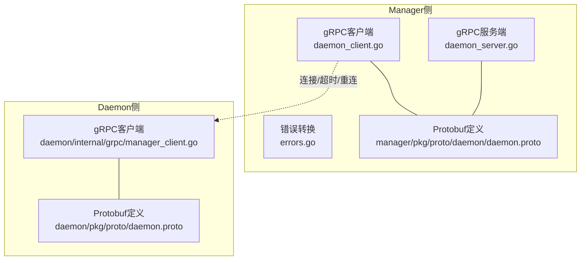
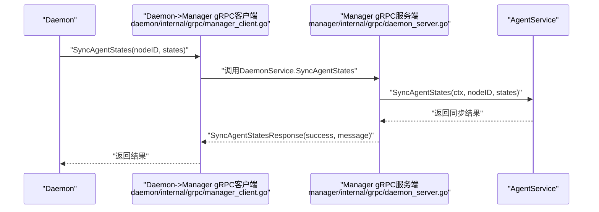
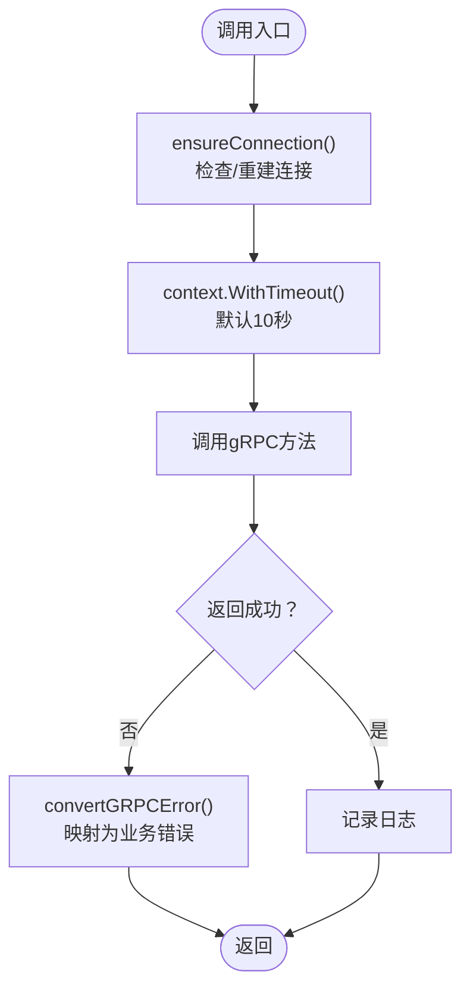
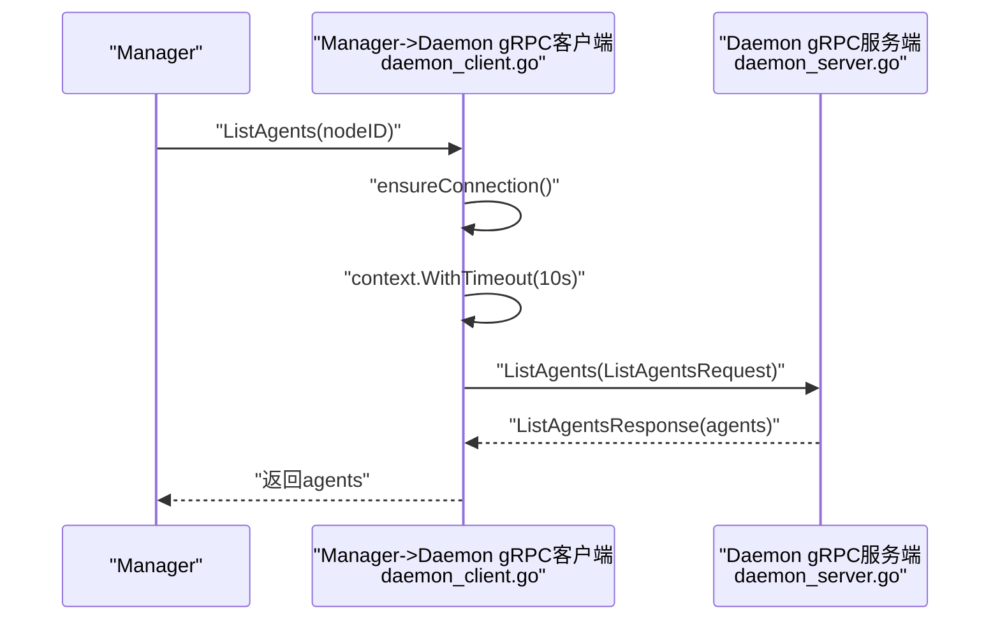
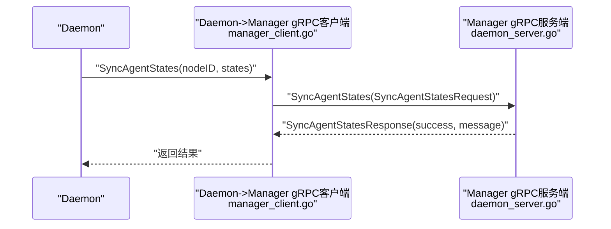
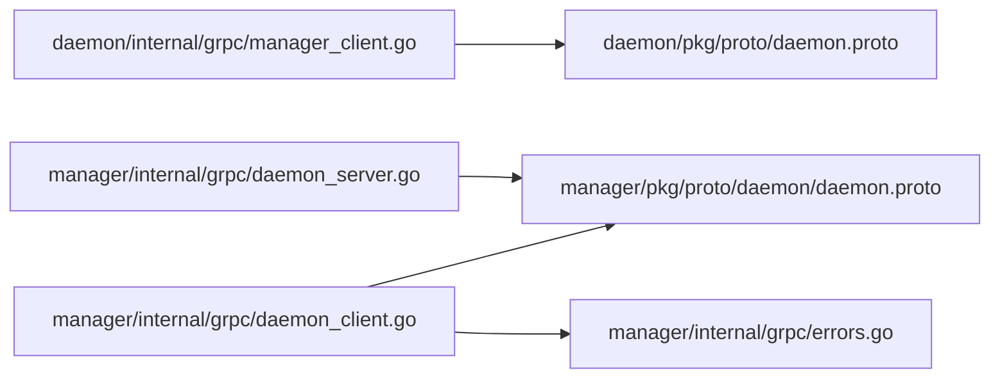

# gRPC服务层

<cite>
**本文引用的文件**
- [daemon/pkg/proto/daemon.proto](file://daemon/pkg/proto/daemon.proto)
- [manager/pkg/proto/daemon/daemon.proto](file://manager/pkg/proto/daemon/daemon.proto)
- [manager/internal/grpc/daemon_server.go](file://manager/internal/grpc/daemon_server.go)
- [manager/internal/grpc/daemon_client.go](file://manager/internal/grpc/daemon_client.go)
- [manager/internal/grpc/errors.go](file://manager/internal/grpc/errors.go)
- [manager/internal/grpc/server.go](file://manager/internal/grpc/server.go)
- [daemon/internal/grpc/manager_client.go](file://daemon/internal/grpc/manager_client.go)
- [manager/configs/manager.yaml](file://manager/configs/manager.yaml)
- [daemon/configs/daemon.yaml](file://daemon/configs/daemon.yaml)
- [manager/internal/grpc/daemon_client_test.go](file://manager/internal/grpc/daemon_client_test.go)
</cite>

## 目录
1. [简介](#简介)
2. [项目结构](#项目结构)
3. [核心组件](#核心组件)
4. [架构总览](#架构总览)
5. [详细组件分析](#详细组件分析)
6. [依赖关系分析](#依赖关系分析)
7. [性能考量](#性能考量)
8. [故障排查指南](#故障排查指南)
9. [结论](#结论)
10. [附录](#附录)

## 简介
本文件聚焦于Manager模块的gRPC服务层，系统性阐述其作为与Daemon通信桥梁的职责与实现。内容涵盖：
- 服务端实现：DaemonService在Manager侧的服务端逻辑，重点解析SyncAgentStates等接口。
- 客户端调用：Manager侧对Daemon的gRPC客户端封装，含连接管理、超时控制、重连策略与错误转换。
- Protobuf契约：daemon.proto中的消息格式与服务契约，明确字段语义与数据流。
- 安全与可靠性：认证、超时、重试与错误码映射，帮助开发者理解分布式调用的可靠性保障。

## 项目结构
围绕gRPC服务层的关键目录与文件如下：
- Manager侧
  - gRPC服务端：manager/internal/grpc/daemon_server.go
  - gRPC客户端：manager/internal/grpc/daemon_client.go
  - 错误转换：manager/internal/grpc/errors.go
  - Manager内部gRPC服务（非本文重点）：manager/internal/grpc/server.go
  - Protobuf定义（Manager侧）：manager/pkg/proto/daemon/daemon.proto
- Daemon侧
  - gRPC客户端（调用Manager的DaemonService）：daemon/internal/grpc/manager_client.go
  - Protobuf定义（Daemon侧）：daemon/pkg/proto/daemon.proto
- 配置
  - Manager配置（含gRPC TLS）：manager/configs/manager.yaml
  - Daemon配置（Manager连接参数）：daemon/configs/daemon.yaml
- 测试
  - Manager侧gRPC客户端测试：manager/internal/grpc/daemon_client_test.go

图表来源
- [manager/internal/grpc/daemon_server.go](file://manager/internal/grpc/daemon_server.go#L1-L70)
- [manager/internal/grpc/daemon_client.go](file://manager/internal/grpc/daemon_client.go#L1-L120)
- [manager/internal/grpc/errors.go](file://manager/internal/grpc/errors.go#L1-L49)
- [manager/pkg/proto/daemon/daemon.proto](file://manager/pkg/proto/daemon/daemon.proto#L1-L184)
- [daemon/internal/grpc/manager_client.go](file://daemon/internal/grpc/manager_client.go#L1-L155)
- [daemon/pkg/proto/daemon.proto](file://daemon/pkg/proto/daemon.proto#L1-L183)

章节来源
- [manager/internal/grpc/daemon_server.go](file://manager/internal/grpc/daemon_server.go#L1-L70)
- [manager/internal/grpc/daemon_client.go](file://manager/internal/grpc/daemon_client.go#L1-L120)
- [manager/internal/grpc/errors.go](file://manager/internal/grpc/errors.go#L1-L49)
- [manager/pkg/proto/daemon/daemon.proto](file://manager/pkg/proto/daemon/daemon.proto#L1-L184)
- [daemon/internal/grpc/manager_client.go](file://daemon/internal/grpc/manager_client.go#L1-L155)
- [daemon/pkg/proto/daemon.proto](file://daemon/pkg/proto/daemon.proto#L1-L183)

## 核心组件
- Manager服务端（DaemonService）
  - 提供SyncAgentStates接口，用于接收Daemon上报的Agent状态，并委托AgentService进行持久化与状态同步。
- Manager客户端（DaemonService）
  - 提供ListAgents、OperateAgent、GetAgentMetrics等方法，封装连接管理、超时控制、重连与错误转换。
- 错误转换
  - 将gRPC状态码映射为统一的业务错误，便于上层处理。
- Protobuf契约
  - 定义了Register、Heartbeat、ReportMetrics、ListAgents、OperateAgent、GetAgentMetrics、SyncAgentStates等服务与消息格式。

章节来源
- [manager/internal/grpc/daemon_server.go](file://manager/internal/grpc/daemon_server.go#L1-L70)
- [manager/internal/grpc/daemon_client.go](file://manager/internal/grpc/daemon_client.go#L1-L120)
- [manager/internal/grpc/errors.go](file://manager/internal/grpc/errors.go#L1-L49)
- [manager/pkg/proto/daemon/daemon.proto](file://manager/pkg/proto/daemon/daemon.proto#L1-L184)

## 架构总览
Manager与Daemon之间的gRPC交互以“桥接”方式实现：
- Daemon通过自身gRPC客户端调用Manager的DaemonService（如SyncAgentStates）。
- Manager侧gRPC服务端接收请求，调用内部业务服务完成状态同步。
- Manager侧gRPC客户端用于调用Daemon的DaemonService（如ListAgents、OperateAgent、GetAgentMetrics），并内置连接管理与错误转换。

图表来源
- [daemon/internal/grpc/manager_client.go](file://daemon/internal/grpc/manager_client.go#L102-L155)
- [manager/internal/grpc/daemon_server.go](file://manager/internal/grpc/daemon_server.go#L32-L69)

## 详细组件分析

### Protobuf定义与服务契约
- 服务定义
  - DaemonService：包含Register、Heartbeat、ReportMetrics、GetConfig、PushUpdate、ListAgents、OperateAgent、GetAgentMetrics、SyncAgentStates等RPC。
- 请求/响应消息
  - RegisterRequest/RegisterResponse：节点注册请求与响应。
  - HeartbeatRequest/HeartbeatResponse：心跳上报请求与响应。
  - MetricsRequest/MetricsResponse：指标上报请求与响应。
  - ListAgentsRequest/ListAgentsResponse：列举Agent请求与响应。
  - AgentOperationRequest/AgentOperationResponse：Agent操作请求与响应（start/stop/restart）。
  - AgentMetricsRequest/AgentMetricsResponse：Agent指标请求与响应。
  - SyncAgentStatesRequest/SyncAgentStatesResponse：Daemon向Manager同步Agent状态请求与响应。
- 字段语义
  - node_id：节点唯一标识。
  - agent_id：Agent唯一标识。
  - data：指标数据（JSON序列化后的bytes）。
  - states：Agent状态数组，包含agent_id、status、pid、last_heartbeat等。
- 数据流
  - Manager侧与Daemon侧的Protobuf定义基本一致，确保跨模块互操作。

章节来源
- [manager/pkg/proto/daemon/daemon.proto](file://manager/pkg/proto/daemon/daemon.proto#L1-L184)
- [daemon/pkg/proto/daemon.proto](file://daemon/pkg/proto/daemon.proto#L1-L183)

### Manager服务端（DaemonService）
- 组件职责
  - 接收Daemon上报的Agent状态，校验参数，调用AgentService执行状态同步，返回统一响应。
- 关键接口
  - SyncAgentStates
    - 输入：SyncAgentStatesRequest（node_id、states）。
    - 校验：node_id必填；若states为空，返回成功但提示无状态需要同步。
    - 处理：调用AgentService.SyncAgentStates；失败时记录错误并返回失败响应。
    - 输出：SyncAgentStatesResponse（success、message）。
- 错误处理
  - 对非法参数返回InvalidArgument；对业务异常返回失败响应但不抛出gRPC错误，便于上层区分。

章节来源
- [manager/internal/grpc/daemon_server.go](file://manager/internal/grpc/daemon_server.go#L32-L69)

### Manager客户端（DaemonService）
- 组件职责
  - 为Manager侧提供对Daemon的gRPC调用能力，封装连接管理、超时控制、重连与错误转换。
- 连接与重连
  - 默认超时：10秒。
  - Keepalive：周期10秒，超时3秒，允许无活跃流。
  - ensureConnection：检测当前连接状态，必要时重建连接；支持TransientFailure/Idle/Shutdown场景的自动重连。
- 方法族
  - ListAgents：列举Agent，带默认超时与日志记录。
  - OperateAgent：启动/停止/重启Agent，参数校验与响应校验，失败时记录错误并转换为业务错误。
  - GetAgentMetrics：查询Agent指标，带默认超时与日志记录。
  - Close：关闭连接。
- 连接池
  - DaemonClientPool：按nodeID维护连接，支持获取、复用、关闭单个与全部连接，线程安全。
- 错误转换
  - convertGRPCError：将gRPC状态码映射为ErrAgentNotFound、ErrInvalidArgument、ErrTimeout、ErrConnectionFailed等业务错误。

图表来源
- [manager/internal/grpc/daemon_client.go](file://manager/internal/grpc/daemon_client.go#L139-L237)
- [manager/internal/grpc/daemon_client.go](file://manager/internal/grpc/daemon_client.go#L239-L284)
- [manager/internal/grpc/daemon_client.go](file://manager/internal/grpc/daemon_client.go#L74-L137)
- [manager/internal/grpc/errors.go](file://manager/internal/grpc/errors.go#L18-L49)

章节来源
- [manager/internal/grpc/daemon_client.go](file://manager/internal/grpc/daemon_client.go#L1-L120)
- [manager/internal/grpc/daemon_client.go](file://manager/internal/grpc/daemon_client.go#L139-L237)
- [manager/internal/grpc/daemon_client.go](file://manager/internal/grpc/daemon_client.go#L239-L284)
- [manager/internal/grpc/daemon_client.go](file://manager/internal/grpc/daemon_client.go#L297-L398)
- [manager/internal/grpc/errors.go](file://manager/internal/grpc/errors.go#L1-L49)

### 错误码与错误转换
- gRPC状态码到业务错误映射
  - NotFound -> ErrAgentNotFound
  - InvalidArgument -> ErrInvalidArgument
  - DeadlineExceeded -> ErrTimeout
  - Unavailable -> ErrConnectionFailed
  - Internal -> 原始错误
- 业务错误类型
  - ErrAgentNotFound：Agent不存在。
  - ErrInvalidArgument：参数非法。
  - ErrConnectionFailed：连接失败。
  - ErrTimeout：操作超时。

章节来源
- [manager/internal/grpc/errors.go](file://manager/internal/grpc/errors.go#L1-L49)

### 安全与超时配置
- Manager侧gRPC服务
  - TLS配置：由manager/configs/manager.yaml启用，包含证书、密钥与CA路径。
- Daemon侧gRPC客户端
  - TLS配置：daemon/configs/daemon.yaml中配置Manager地址与TLS证书/密钥/CA；开发环境可降级为不安全连接。
  - Keepalive：与Manager侧保持一致的Keepalive参数。
- 超时与重试
  - Manager客户端默认超时10秒；未实现显式重试机制，建议在上层调用处结合指数退避策略实现重试。

章节来源
- [manager/configs/manager.yaml](file://manager/configs/manager.yaml#L28-L37)
- [daemon/configs/daemon.yaml](file://daemon/configs/daemon.yaml#L12-L21)
- [daemon/internal/grpc/manager_client.go](file://daemon/internal/grpc/manager_client.go#L40-L101)
- [manager/internal/grpc/daemon_client.go](file://manager/internal/grpc/daemon_client.go#L18-L25)

### 时序图：Manager调用Daemon（示例：ListAgents）

图表来源
- [manager/internal/grpc/daemon_client.go](file://manager/internal/grpc/daemon_client.go#L139-L165)
- [manager/internal/grpc/daemon_server.go](file://manager/internal/grpc/daemon_server.go#L32-L69)

### 时序图：Daemon调用Manager（示例：SyncAgentStates）

图表来源
- [daemon/internal/grpc/manager_client.go](file://daemon/internal/grpc/manager_client.go#L102-L155)
- [manager/internal/grpc/daemon_server.go](file://manager/internal/grpc/daemon_server.go#L32-L69)

## 依赖关系分析
- 组件耦合
  - Manager服务端依赖AgentService完成状态同步。
  - Manager客户端依赖gRPC与Protobuf定义，提供连接池与错误转换。
  - Daemon客户端依赖Manager的Protobuf定义，负责与Manager建立TLS/Keepalive连接。
- 外部依赖
  - gRPC、Zap日志、TLS证书与CA。
- 潜在风险
  - 未实现显式重试：建议在上层调用处增加指数退避重试。
  - 开发环境不使用TLS：生产环境必须启用TLS并正确配置证书链。

图表来源
- [daemon/internal/grpc/manager_client.go](file://daemon/internal/grpc/manager_client.go#L1-L155)
- [manager/internal/grpc/daemon_server.go](file://manager/internal/grpc/daemon_server.go#L1-L70)
- [manager/internal/grpc/daemon_client.go](file://manager/internal/grpc/daemon_client.go#L1-L120)
- [manager/internal/grpc/errors.go](file://manager/internal/grpc/errors.go#L1-L49)
- [manager/pkg/proto/daemon/daemon.proto](file://manager/pkg/proto/daemon/daemon.proto#L1-L184)
- [daemon/pkg/proto/daemon.proto](file://daemon/pkg/proto/daemon.proto#L1-L183)

章节来源
- [daemon/internal/grpc/manager_client.go](file://daemon/internal/grpc/manager_client.go#L1-L155)
- [manager/internal/grpc/daemon_server.go](file://manager/internal/grpc/daemon_server.go#L1-L70)
- [manager/internal/grpc/daemon_client.go](file://manager/internal/grpc/daemon_client.go#L1-L120)
- [manager/internal/grpc/errors.go](file://manager/internal/grpc/errors.go#L1-L49)

## 性能考量
- 连接复用与Keepalive
  - 使用连接池减少频繁拨号；Keepalive参数降低长连接断连概率。
- 超时控制
  - 默认10秒超时适用于短RPC；对于批量指标上报建议在上层调用处设置更合理的超时。
- 错误快速失败
  - convertGRPCError将常见错误映射为业务错误，便于快速决策与降级。

[本节为通用指导，不直接分析具体文件]

## 故障排查指南
- 常见问题与定位
  - 连接失败：检查Manager地址、TLS证书与CA配置；确认防火墙与端口可达。
  - 超时：增大超时或优化目标节点负载；查看日志中的Warn/Error。
  - 参数非法：核对node_id、agent_id、operation等必填项。
- 单元测试参考
  - 包含超时、连接错误、NotFound、InvalidArgument等场景的测试用例，可作为集成测试与排障的参考。

章节来源
- [manager/internal/grpc/daemon_client_test.go](file://manager/internal/grpc/daemon_client_test.go#L142-L183)
- [manager/internal/grpc/daemon_client_test.go](file://manager/internal/grpc/daemon_client_test.go#L272-L296)
- [manager/internal/grpc/daemon_client_test.go](file://manager/internal/grpc/daemon_client_test.go#L298-L319)
- [manager/internal/grpc/daemon_client_test.go](file://manager/internal/grpc/daemon_client_test.go#L426-L459)
- [manager/internal/grpc/daemon_client_test.go](file://manager/internal/grpc/daemon_client_test.go#L461-L581)
- [manager/internal/grpc/daemon_client_test.go](file://manager/internal/grpc/daemon_client_test.go#L601-L656)

## 结论
- Manager模块的gRPC服务层以清晰的Protobuf契约与职责划分，实现了与Daemon的可靠通信。
- 服务端专注于接收与转发状态同步请求，客户端提供稳健的连接管理与错误转换。
- 生产环境应启用TLS与合理的Keepalive参数，结合上层指数退避重试策略，进一步提升可靠性。

[本节为总结，不直接分析具体文件]

## 附录
- 关键流程与接口路径
  - SyncAgentStates服务端实现：[manager/internal/grpc/daemon_server.go](file://manager/internal/grpc/daemon_server.go#L32-L69)
  - ListAgents/OperateAgent/GetAgentMetrics客户端实现：[manager/internal/grpc/daemon_client.go](file://manager/internal/grpc/daemon_client.go#L139-L284)
  - 错误转换函数：[manager/internal/grpc/errors.go](file://manager/internal/grpc/errors.go#L18-L49)
  - Protobuf定义（Manager侧）：[manager/pkg/proto/daemon/daemon.proto](file://manager/pkg/proto/daemon/daemon.proto#L1-L184)
  - Protobuf定义（Daemon侧）：[daemon/pkg/proto/daemon.proto](file://daemon/pkg/proto/daemon.proto#L1-L183)
  - Daemon调用Manager的客户端实现：[daemon/internal/grpc/manager_client.go](file://daemon/internal/grpc/manager_client.go#L102-L155)
  - Manager配置（TLS）：[manager/configs/manager.yaml](file://manager/configs/manager.yaml#L28-L37)
  - Daemon配置（Manager连接参数）：[daemon/configs/daemon.yaml](file://daemon/configs/daemon.yaml#L12-L21)