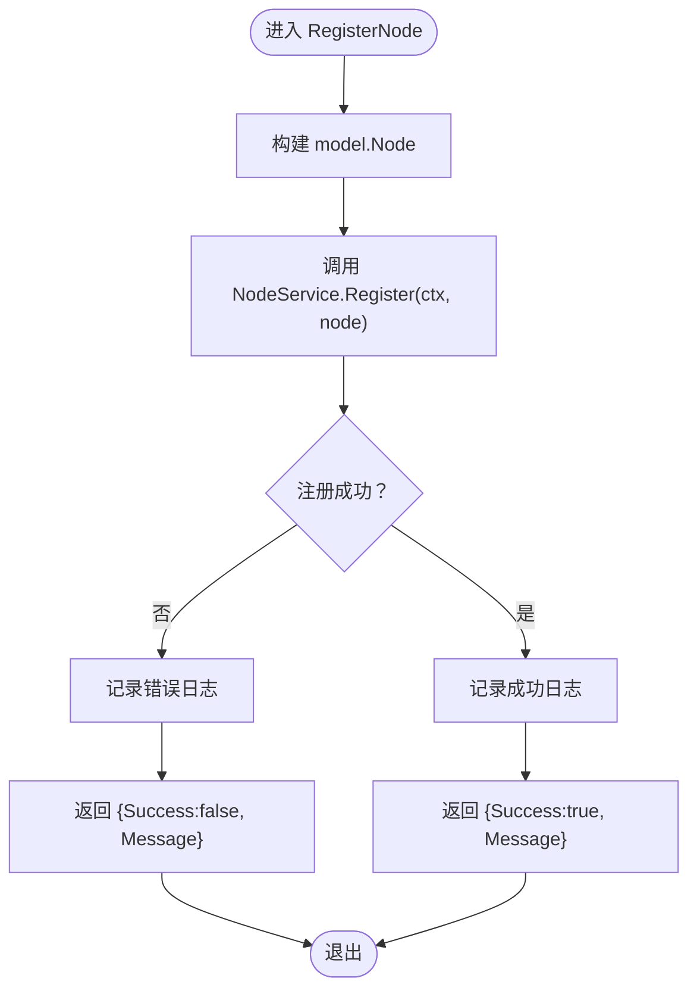

# gRPC服务端

<cite>
**本文引用的文件**
- [manager/internal/grpc/server.go](file://manager/internal/grpc/server.go)
- [manager/cmd/manager/main.go](file://manager/cmd/manager/main.go)
- [manager/internal/service/node.go](file://manager/internal/service/node.go)
- [manager/internal/service/metrics.go](file://manager/internal/service/metrics.go)
- [manager/internal/model/node.go](file://manager/internal/model/node.go)
- [manager/internal/model/metrics.go](file://manager/internal/model/metrics.go)
- [manager/pkg/proto/manager_grpc.pb.go](file://manager/pkg/proto/manager_grpc.pb.go)
- [daemon/pkg/proto/manager/manager_grpc.pb.go](file://daemon/pkg/proto/manager/manager_grpc.pb.go)
- [daemon/internal/comm/grpc_client.go](file://daemon/internal/comm/grpc_client.go)
</cite>

## 目录
1. [简介](#简介)
2. [项目结构](#项目结构)
3. [核心组件](#核心组件)
4. [架构总览](#架构总览)
5. [详细组件分析](#详细组件分析)
6. [依赖关系分析](#依赖关系分析)
7. [性能考虑](#性能考虑)
8. [故障排查指南](#故障排查指南)
9. [结论](#结论)

## 简介
本文件聚焦于 manager 模块的 gRPC 服务端实现，重点解析 manager/internal/grpc/server.go 中的 Server 结构体及其三个核心 RPC 方法：RegisterNode、Heartbeat、ReportMetrics。文档将阐述：
- 参数校验与业务逻辑调用链路
- 错误处理与日志记录最佳实践
- NewServer 工厂函数如何注入 NodeService 与 MetricsService 依赖
- 服务端处理请求的时序图
- 性能优化建议（连接池、超时设置等）

## 项目结构
manager 内部 gRPC 服务端位于 internal/grpc/server.go，负责实现 ManagerService 的三个核心 RPC 方法；业务逻辑由 service 层的 NodeService 与 MetricsService 提供；模型定义位于 internal/model；gRPC 服务注册在 cmd/manager/main.go 中完成。

图表来源
- [manager/internal/grpc/server.go](file://manager/internal/grpc/server.go#L1-L145)
- [manager/internal/service/node.go](file://manager/internal/service/node.go#L1-L234)
- [manager/internal/service/metrics.go](file://manager/internal/service/metrics.go#L1-L371)
- [manager/internal/model/node.go](file://manager/internal/model/node.go#L1-L68)
- [manager/internal/model/metrics.go](file://manager/internal/model/metrics.go#L1-L65)
- [manager/pkg/proto/manager_grpc.pb.go](file://manager/pkg/proto/manager_grpc.pb.go#L1-L207)
- [manager/cmd/manager/main.go](file://manager/cmd/manager/main.go#L226-L245)
- [daemon/internal/comm/grpc_client.go](file://daemon/internal/comm/grpc_client.go#L187-L247)

章节来源
- [manager/internal/grpc/server.go](file://manager/internal/grpc/server.go#L1-L145)
- [manager/cmd/manager/main.go](file://manager/cmd/manager/main.go#L226-L245)

## 核心组件
- Server 结构体：承载 gRPC 服务端实例，持有 NodeService、MetricsService 与 zap 日志器。
- NewServer 工厂函数：以依赖注入方式构造 Server，确保服务端可测试与可替换。
- 三个核心 RPC 方法：
  - RegisterNode：节点注册，构建 model.Node 并调用 NodeService.Register。
  - Heartbeat：心跳上报，调用 NodeService.Heartbeat 更新节点活跃状态。
  - ReportMetrics：指标上报，批量转换为 model.Metrics 并调用 MetricsService.BatchCreate。

章节来源
- [manager/internal/grpc/server.go](file://manager/internal/grpc/server.go#L13-L31)
- [manager/internal/grpc/server.go](file://manager/internal/grpc/server.go#L34-L144)

## 架构总览
Manager 服务端在 main.go 中初始化 gRPC 服务器并注册 ManagerService；gRPC 描述由 proto 编译产物提供；Server 将请求转发至 service 层，service 层再委托 repository 层持久化。

图表来源
- [manager/pkg/proto/manager_grpc.pb.go](file://manager/pkg/proto/manager_grpc.pb.go#L131-L209)
- [manager/internal/grpc/server.go](file://manager/internal/grpc/server.go#L34-L144)
- [manager/internal/service/node.go](file://manager/internal/service/node.go#L62-L91)
- [manager/internal/service/metrics.go](file://manager/internal/service/metrics.go#L68-L76)
- [daemon/internal/comm/grpc_client.go](file://daemon/internal/comm/grpc_client.go#L187-L247)

## 详细组件分析

### Server 结构体与依赖注入
- 字段
  - nodeService：节点服务接口，负责节点注册、心跳、状态维护等。
  - metricsService：指标服务接口，负责指标入库、查询与清理。
  - logger：Zap 日志器，统一记录请求日志与错误日志。
- NewServer
  - 通过依赖注入创建 Server 实例，便于单元测试替换依赖与隔离业务逻辑。

章节来源
- [manager/internal/grpc/server.go](file://manager/internal/grpc/server.go#L13-L31)

### RegisterNode：节点注册
- 请求参数映射
  - 将 pb.RegisterNodeRequest 映射为 model.Node，填充 NodeID、Hostname、IP、OS、Arch、Labels、DaemonVersion、AgentVersion、Status、RegisterAt 等字段。
- 业务逻辑
  - 调用 NodeService.Register(ctx, node) 完成节点创建或更新。
- 错误处理
  - 若注册失败，记录错误日志并返回包含 Success=false 与 Message 的响应。
- 日志记录
  - 成功/失败均记录 Info/Warn 级别日志，携带 node_id 等关键上下文。

图表来源
- [manager/internal/grpc/server.go](file://manager/internal/grpc/server.go#L34-L72)
- [manager/internal/service/node.go](file://manager/internal/service/node.go#L62-L91)
- [manager/internal/model/node.go](file://manager/internal/model/node.go#L11-L33)

章节来源
- [manager/internal/grpc/server.go](file://manager/internal/grpc/server.go#L34-L72)
- [manager/internal/service/node.go](file://manager/internal/service/node.go#L62-L91)
- [manager/internal/model/node.go](file://manager/internal/model/node.go#L11-L33)

### Heartbeat：心跳上报
- 请求参数
  - 使用 pb.HeartbeatRequest 中的 NodeId 进行心跳处理。
- 业务逻辑
  - 调用 NodeService.Heartbeat(ctx, nodeID) 更新节点最近活跃时间；若节点此前为离线，则更新为在线。
- 错误处理
  - 失败时记录 Warn 日志并返回 {Success:false, Message}。
- 日志记录
  - Debug 级别记录收到心跳的时间戳与 node_id。

图表来源
- [manager/internal/grpc/server.go](file://manager/internal/grpc/server.go#L74-L97)
- [manager/internal/service/node.go](file://manager/internal/service/node.go#L166-L188)

章节来源
- [manager/internal/grpc/server.go](file://manager/internal/grpc/server.go#L74-L97)
- [manager/internal/service/node.go](file://manager/internal/service/node.go#L166-L188)

### ReportMetrics：指标上报
- 请求参数
  - pb.ReportMetricsRequest 包含 NodeId 与 Metrics 数组。
- 数据转换
  - 遍历 req.Metrics，将 values map[string]interface{} 转换为 model.Metrics.Values，并设置 Timestamp（Unix 秒转 time.Time）。
- 业务逻辑
  - 调用 MetricsService.BatchCreate(ctx, metrics) 批量写入指标。
- 错误处理
  - 失败时记录 Error 日志并返回 {Success:false, Message}。
- 日志记录
  - Debug 级别记录收到的指标条数与 node_id；成功后记录 Debug 日志。

图表来源
- [manager/internal/grpc/server.go](file://manager/internal/grpc/server.go#L99-L144)
- [manager/internal/service/metrics.go](file://manager/internal/service/metrics.go#L68-L76)
- [manager/internal/model/metrics.go](file://manager/internal/model/metrics.go#L11-L22)

章节来源
- [manager/internal/grpc/server.go](file://manager/internal/grpc/server.go#L99-L144)
- [manager/internal/service/metrics.go](file://manager/internal/service/metrics.go#L68-L76)
- [manager/internal/model/metrics.go](file://manager/internal/model/metrics.go#L11-L22)

### 日志记录最佳实践
- 请求级别
  - RegisterNode：Info 记录注册成功；Error 记录注册失败。
  - Heartbeat：Debug 记录收到心跳；Warn 记录处理失败。
  - ReportMetrics：Debug 记录收到指标；Error 记录保存失败。
- 关键字段
  - 统一携带 node_id，必要时携带 count、timestamp 等上下文信息，便于问题定位与审计。

章节来源
- [manager/internal/grpc/server.go](file://manager/internal/grpc/server.go#L34-L144)

## 依赖关系分析
- 服务端到服务层
  - Server 依赖 NodeService 与 MetricsService 接口，不关心具体实现，利于替换与测试。
- 服务层到模型层
  - NodeService 与 MetricsService 依赖各自的 repository 层进行持久化。
- 模型层
  - model.Node 与 model.Metrics 定义字段与 JSON 序列化规则。
- gRPC 描述
  - manager/pkg/proto/manager_grpc.pb.go 提供服务描述与处理器分发。
- 入口注册
  - cmd/manager/main.go 在启动时注册 ManagerService 与 DaemonService，并创建 gRPC 服务器。

图表来源
- [manager/internal/grpc/server.go](file://manager/internal/grpc/server.go#L13-L31)
- [manager/internal/service/node.go](file://manager/internal/service/node.go#L14-L40)
- [manager/internal/service/metrics.go](file://manager/internal/service/metrics.go#L14-L40)
- [manager/internal/model/node.go](file://manager/internal/model/node.go#L11-L33)
- [manager/internal/model/metrics.go](file://manager/internal/model/metrics.go#L11-L22)

章节来源
- [manager/internal/grpc/server.go](file://manager/internal/grpc/server.go#L13-L31)
- [manager/internal/service/node.go](file://manager/internal/service/node.go#L14-L40)
- [manager/internal/service/metrics.go](file://manager/internal/service/metrics.go#L14-L40)
- [manager/internal/model/node.go](file://manager/internal/model/node.go#L11-L33)
- [manager/internal/model/metrics.go](file://manager/internal/model/metrics.go#L11-L22)

## 性能考虑
- 连接池管理
  - 主程序在启动时初始化 Daemon 客户端连接池，用于与 Daemon 通信；服务端自身作为 gRPC 服务器，通常不需要额外连接池，但可参考该模式对 gRPC 客户端进行复用与健康检查。
- 超时设置
  - 建议在 gRPC 服务器端与客户端均设置合理的超时时间，避免长时间阻塞导致资源占用。
- 批量写入
  - ReportMetrics 已采用批量写入，有助于降低数据库压力；可结合数据库事务与索引优化进一步提升吞吐。
- 日志级别
  - 生产环境建议使用 Info/Warn/Error 级别，避免 Debug 过多带来的 I/O 开销。
- 并发与限流
  - 可在 gRPC 服务器上增加拦截器进行并发限制与 QPS 控制，防止突发流量冲击。

章节来源
- [manager/cmd/manager/main.go](file://manager/cmd/manager/main.go#L86-L100)
- [manager/internal/grpc/server.go](file://manager/internal/grpc/server.go#L99-L144)

## 故障排查指南
- 常见错误场景
  - 节点注册失败：检查 NodeService.Register 的实现与数据库约束；查看 Server 的错误日志。
  - 心跳处理失败：检查 NodeService.Heartbeat 的实现与数据库更新；查看 Server 的 Warn 日志。
  - 指标保存失败：检查 MetricsService.BatchCreate 的实现与数据库写入；查看 Server 的 Error 日志。
- 日志定位
  - 使用 node_id、timestamp、count 等字段快速定位问题请求与上下文。
- 调用链路验证
  - 参考 gRPC 描述与 Server 方法实现，确认请求是否正确分发到对应服务方法。

章节来源
- [manager/internal/grpc/server.go](file://manager/internal/grpc/server.go#L34-L144)
- [manager/internal/service/node.go](file://manager/internal/service/node.go#L62-L91)
- [manager/internal/service/metrics.go](file://manager/internal/service/metrics.go#L68-L76)

## 结论
manager 内部 gRPC 服务端通过清晰的依赖注入与日志记录，实现了 RegisterNode、Heartbeat、ReportMetrics 三大核心 RPC 方法。Server 将请求参数映射为模型对象并委托 service 层完成业务处理，错误处理与日志记录遵循统一规范。结合连接池与超时设置等性能优化手段，可在高并发场景下保持稳定与高效。