# 业务服务层

<cite>
**本文档引用的文件**   
- [node.go](file://manager/internal/service/node.go)
- [version.go](file://manager/internal/service/version.go)
- [task.go](file://manager/internal/service/task.go)
- [metrics.go](file://manager/internal/service/metrics.go)
- [auth.go](file://manager/internal/service/auth.go)
- [node.go](file://manager/internal/repository/node.go)
- [version.go](file://manager/internal/repository/version.go)
- [task.go](file://manager/internal/repository/task.go)
- [metrics.go](file://manager/internal/repository/metrics.go)
- [user.go](file://manager/internal/repository/user.go)
- [node.go](file://manager/internal/model/node.go)
- [version.go](file://manager/internal/model/version.go)
- [task.go](file://manager/internal/model/task.go)
- [metrics.go](file://manager/internal/model/metrics.go)
- [user.go](file://manager/internal/model/user.go)
</cite>

## 目录
1. [引言](#引言)
2. [核心服务接口定义](#核心服务接口定义)
3. [节点服务](#节点服务)
4. [版本服务](#版本服务)
5. [任务服务](#任务服务)
6. [监控指标服务](#监控指标服务)
7. [认证服务](#认证服务)
8. [服务层架构与依赖关系](#服务层架构与依赖关系)
9. [事务与并发控制](#事务与并发控制)
10. [错误处理与日志记录](#错误处理与日志记录)

## 引言
业务服务层是运维工具框架的核心业务逻辑中枢，负责协调数据访问层和外部依赖，实现节点管理、版本发布、任务调度、监控指标和用户认证等核心功能。本架构设计文档详细阐述了各服务的接口定义、方法签名、业务流程以及服务层如何处理事务、缓存和并发控制。

**Section sources**
- [node.go](file://manager/internal/service/node.go#L14-L40)
- [version.go](file://manager/internal/service/version.go#L17-L45)
- [task.go](file://manager/internal/service/task.go#L13-L43)
- [metrics.go](file://manager/internal/service/metrics.go#L14-L40)
- [auth.go](file://manager/internal/service/auth.go#L15-L41)

## 核心服务接口定义
业务服务层由五个核心服务组成，每个服务都定义了清晰的接口，封装了特定领域的业务逻辑。这些接口通过依赖注入的方式提供给上层处理器（Handler）使用，确保了业务逻辑的可测试性和可维护性。

### 服务接口概览
各服务接口的定义遵循单一职责原则，每个方法都专注于完成一个特定的业务操作。接口通过Go语言的interface类型定义，实现了清晰的契约。

```mermaid
classDiagram
class NodeService {
+Register(ctx, node) error
+GetByNodeID(ctx, nodeID) (*Node, error)
+Update(ctx, node) error
+Delete(ctx, id) error
+List(ctx, page, pageSize) ([]*Node, int64, error)
+ListByStatus(ctx, status, page, pageSize) ([]*Node, int64, error)
+ListByLabels(ctx, labels, page, pageSize) ([]*Node, int64, error)
+UpdateStatus(ctx, nodeID, status) error
+Heartbeat(ctx, nodeID) error
+UpdateVersions(ctx, nodeID, daemonVersion, agentVersion) error
+CheckOfflineNodes(ctx, offlineDuration) error
+GetStatistics(ctx) (map[string]int64, error)
}
class VersionService {
+Create(ctx, version) error
+GetByID(ctx, id) (*Version, error)
+GetByComponentAndVersion(ctx, component, version) (*Version, error)
+Update(ctx, version) error
+Delete(ctx, id) error
+List(ctx, page, pageSize) ([]*Version, int64, error)
+ListByComponent(ctx, component, page, pageSize) ([]*Version, int64, error)
+GetLatestReleased(ctx, component) (*Version, error)
+GetAllReleased(ctx, component) ([]*Version, error)
+Release(ctx, versionID) error
+Deprecate(ctx, versionID) error
+VerifyFile(filePath, expectedHash) (bool, error)
+CalculateFileHash(filePath) (string, error)
}
class TaskService {
+Create(ctx, task) error
+GetByID(ctx, id) (*Task, error)
+Update(ctx, task) error
+Delete(ctx, id) error
+List(ctx, page, pageSize) ([]*Task, int64, error)
+ListByStatus(ctx, status, page, pageSize) ([]*Task, int64, error)
+ListByCreator(ctx, creatorID, page, pageSize) ([]*Task, int64, error)
+Execute(ctx, taskID) error
+Cancel(ctx, taskID) error
+UpdateStatus(ctx, taskID, status) error
+UpdateResult(ctx, taskID, result, status) error
+GetPendingTasks(ctx) ([]*Task, error)
+GetRunningTasks(ctx) ([]*Task, error)
+GetStatistics(ctx) (map[string]int64, error)
}
class MetricsService {
+Create(ctx, metrics) error
+BatchCreate(ctx, metrics) error
+GetLatestByNodeID(ctx, nodeID) ([]*Metrics, error)
+GetLatestByNodeIDAndType(ctx, nodeID, metricsType) (*Metrics, error)
+ListByNodeID(ctx, nodeID, page, pageSize) ([]*Metrics, int64, error)
+ListByTimeRange(ctx, nodeID, metricsType, start, end) ([]*Metrics, error)
+GetAverageByNodeIDAndType(ctx, nodeID, metricsType, start, end) (map[string]float64, error)
+CleanOldMetrics(ctx, retentionDays) (int64, error)
+GetLatestMetricsByNodeID(ctx, nodeID) (map[string]*Metrics, error)
+GetMetricsHistoryWithSampling(ctx, nodeID, metricType, startTime, endTime) ([]*Metrics, error)
+GetMetricsSummaryStats(ctx, nodeID, startTime, endTime) (map[string]interface{}, error)
+GetClusterOverview(ctx) (map[string]interface{}, error)
}
class AuthService {
+Register(ctx, username, password, email) (*User, error)
+Login(ctx, username, password) (string, *User, error)
+Logout(ctx, userID) error
+RefreshToken(ctx, token) (string, error)
+ChangePassword(ctx, userID, oldPassword, newPassword) error
+ResetPassword(ctx, userID, newPassword) error
+GetUserByID(ctx, id) (*User, error)
+UpdateUser(ctx, user) error
+DisableUser(ctx, userID) error
+EnableUser(ctx, userID) error
+ListUsers(ctx, page, pageSize) ([]*User, int64, error)
+ValidateToken(ctx, token) (*Claims, error)
}
NodeService <|-- nodeService
VersionService <|-- versionService
TaskService <|-- taskService
MetricsService <|-- metricsService
AuthService <|-- authService
```

**Diagram sources **
- [node.go](file://manager/internal/service/node.go#L14-L40)
- [version.go](file://manager/internal/service/version.go#L17-L45)
- [task.go](file://manager/internal/service/task.go#L13-L43)
- [metrics.go](file://manager/internal/service/metrics.go#L14-L40)
- [auth.go](file://manager/internal/service/auth.go#L15-L41)

## 节点服务
节点服务（NodeService）是管理所有节点生命周期的核心服务，负责节点的注册、更新、删除、状态管理和心跳处理。

### 接口与实现
节点服务接口定义了对节点资源的CRUD操作以及特定的业务方法，如心跳处理和离线节点检查。其实现类`nodeService`通过依赖注入获取`NodeRepository`和`AuditLogRepository`，以执行数据访问和审计日志记录。

**Section sources**
- [node.go](file://manager/internal/service/node.go#L14-L234)
- [node.go](file://manager/internal/repository/node.go#L11-L39)

### 节点注册流程
节点注册是节点服务的核心功能之一。当一个新节点首次向Manager注册时，服务会检查该节点是否已存在。如果存在，则更新其信息；如果不存在，则创建新节点记录。

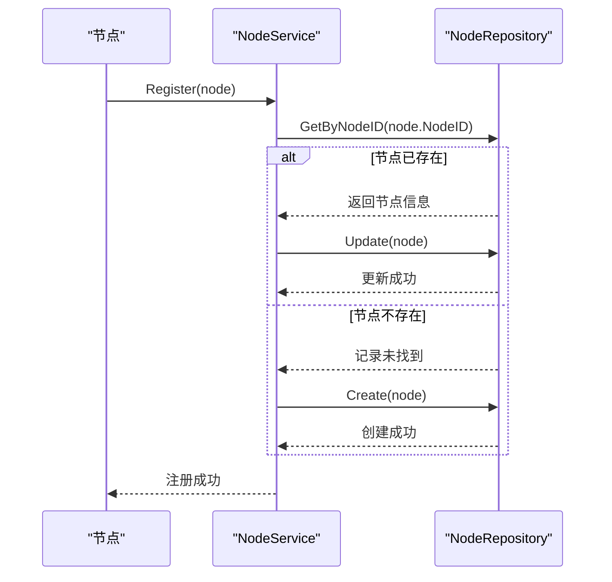

**Diagram sources **
- [node.go](file://manager/internal/service/node.go#L62-L91)

### 心跳处理与状态管理
节点服务通过`Heartbeat`方法处理节点的心跳。该方法不仅更新节点的心跳时间，还会检查节点的当前状态。如果一个之前离线的节点发送了心跳，服务会自动将其状态更新为“在线”。

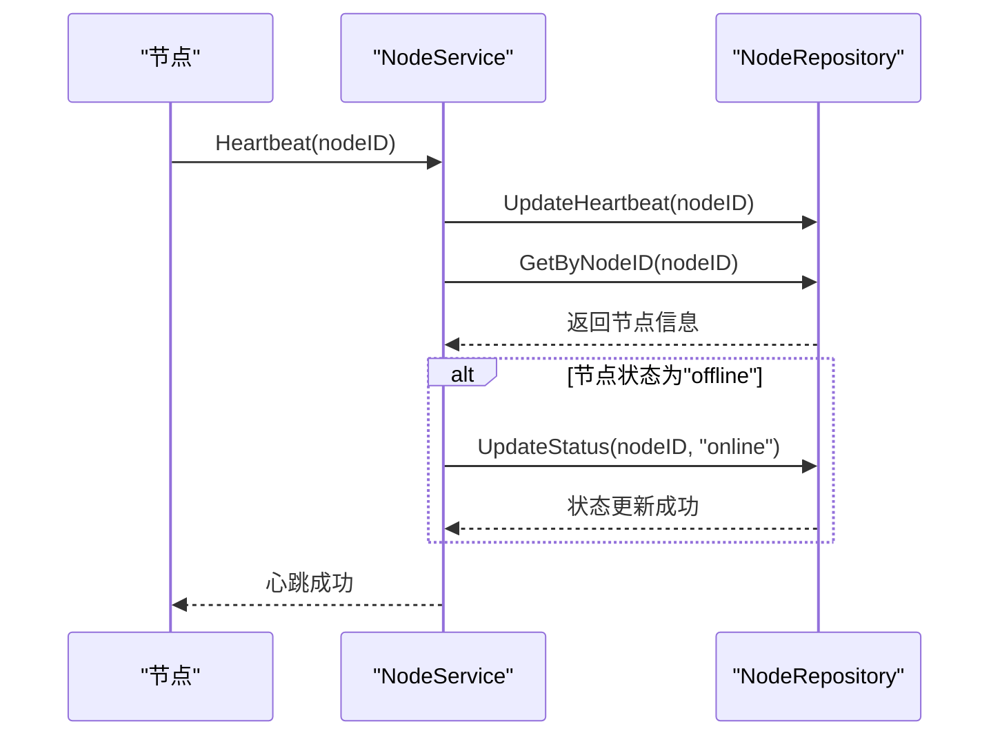

**Diagram sources **
- [node.go](file://manager/internal/service/node.go#L166-L188)

### 离线节点检查
`CheckOfflineNodes`方法是一个周期性任务，用于扫描数据库中长时间未发送心跳的节点，并将其状态标记为“offline”。这有助于保持节点状态的准确性。

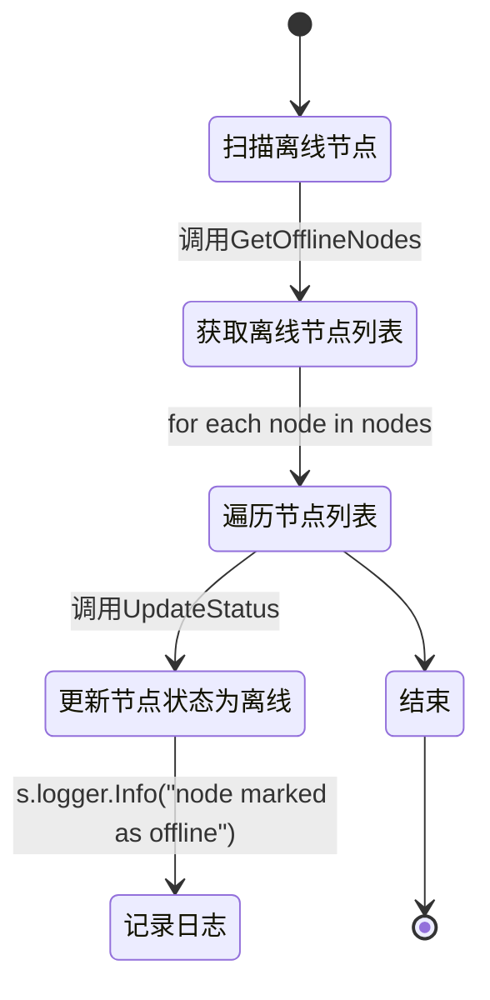

**Diagram sources **
- [node.go](file://manager/internal/service/node.go#L203-L223)

## 版本服务
版本服务（VersionService）负责管理Agent和Daemon组件的版本信息，支持版本的创建、发布、废弃和文件哈希验证。

### 接口与实现
版本服务接口提供了对版本资源的完整管理能力。其实现类`versionService`通过`VersionRepository`进行数据持久化，并利用`jwt`包进行安全相关的操作。

**Section sources**
- [version.go](file://manager/internal/service/version.go#L17-L278)
- [version.go](file://manager/internal/repository/version.go#L10-L38)

### 版本发布流程
发布一个版本是版本服务的关键业务流程。此流程确保只有处于“draft”或“testing”状态的版本才能被发布，并且已发布的版本不能被删除。

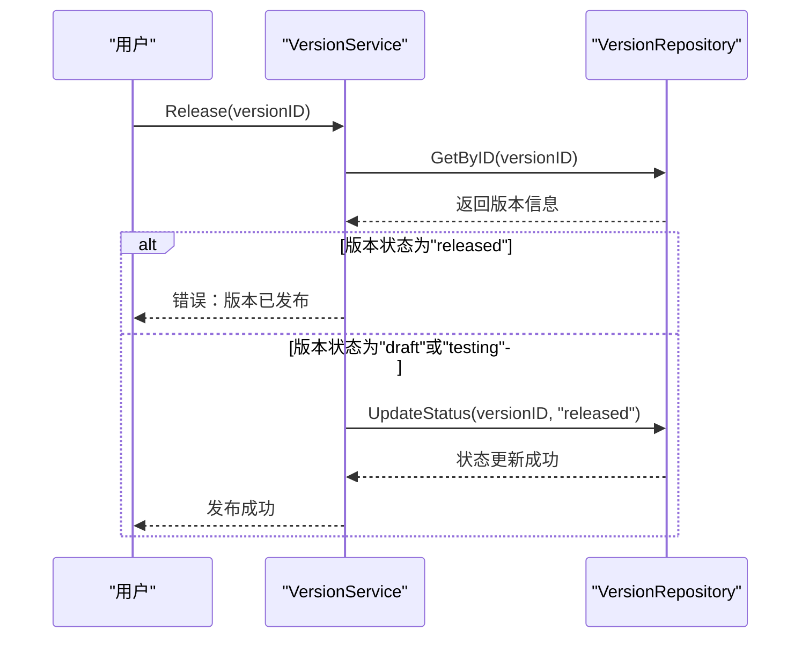

**Diagram sources **
- [version.go](file://manager/internal/service/version.go#L196-L224)

### 文件哈希验证
为了确保文件的完整性，版本服务提供了`VerifyFile`和`CalculateFileHash`方法。这些方法用于在上传和下载文件时验证其SHA-256哈希值。

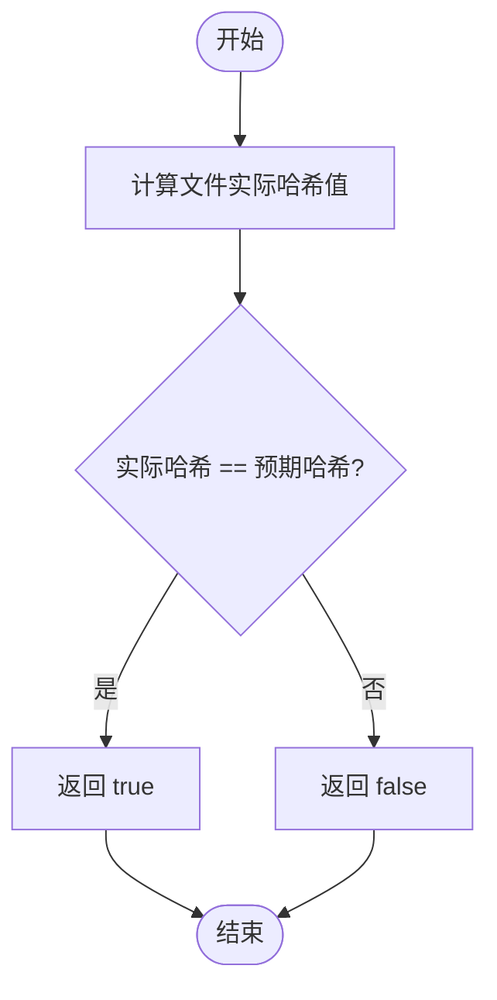

**Diagram sources **
- [version.go](file://manager/internal/service/version.go#L251-L259)

## 任务服务
任务服务（TaskService）负责管理所有后台任务的调度和执行，包括脚本执行、文件上传等操作。

### 接口与实现
任务服务接口定义了任务的生命周期管理，从创建、执行到取消。其实现类`taskService`依赖于`TaskRepository`和`NodeRepository`来验证任务目标节点的有效性。

**Section sources**
- [task.go](file://manager/internal/service/task.go#L13-L274)
- [task.go](file://manager/internal/repository/task.go#L11-L43)

### 任务执行流程
任务的执行是一个关键流程。服务会检查任务的当前状态，只有处于“pending”状态的任务才能被启动执行。

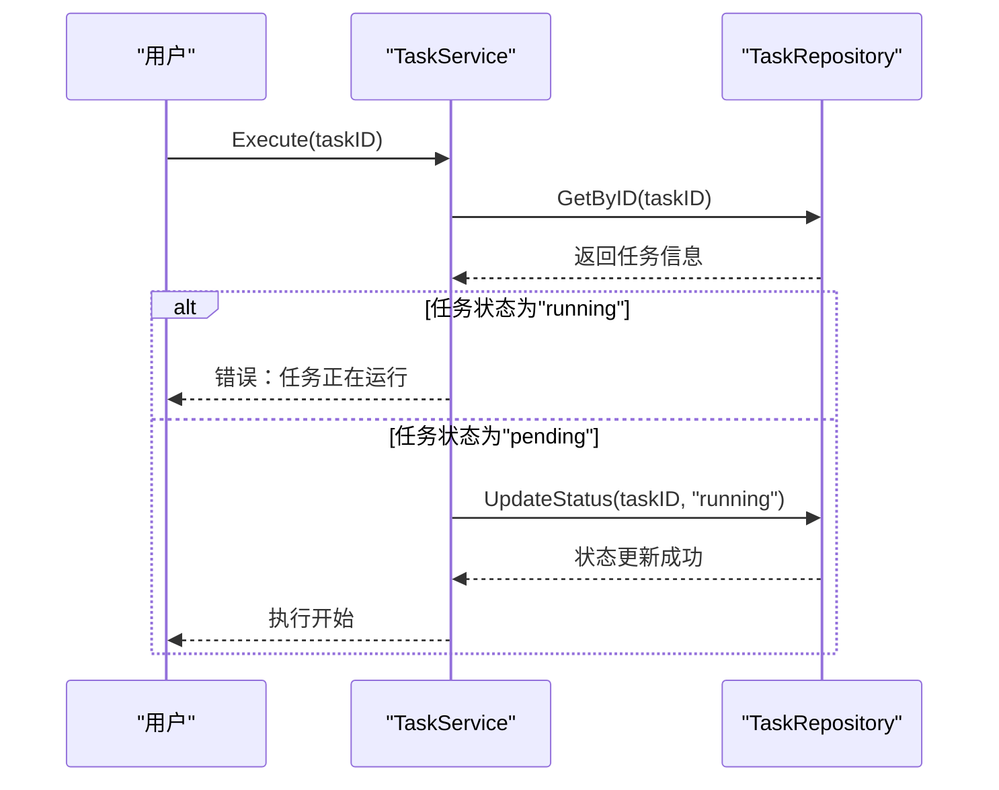

**Diagram sources **
- [task.go](file://manager/internal/service/task.go#L169-L197)

### 任务取消流程
任务取消流程允许用户取消处于“pending”或“running”状态的任务。服务会更新任务状态和结果，并记录操作。

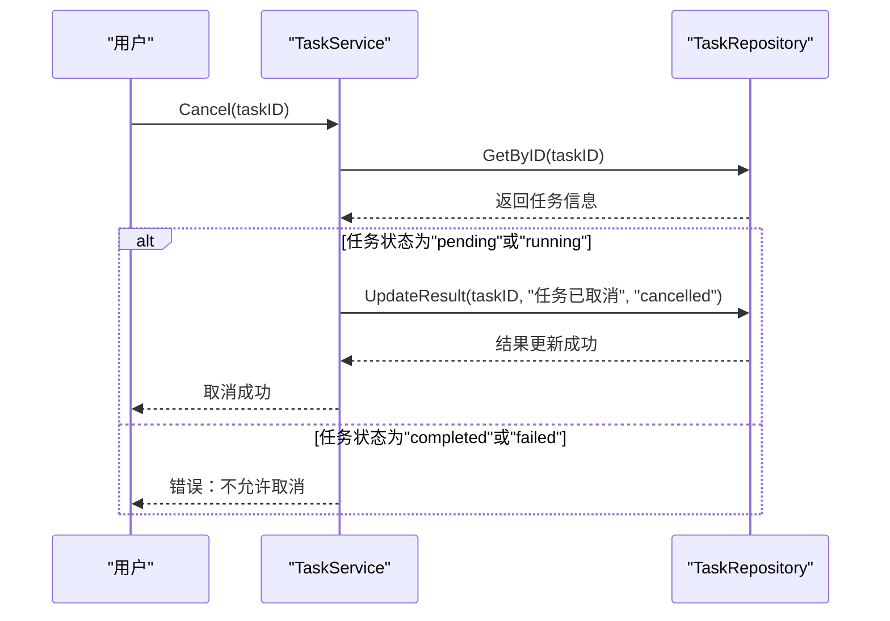

**Diagram sources **
- [task.go](file://manager/internal/service/task.go#L199-L223)

## 监控指标服务
监控指标服务（MetricsService）负责处理所有监控数据的采集、存储、查询和清理。

### 接口与实现
该服务提供了丰富的查询接口，支持按节点、时间范围、指标类型进行查询，并实现了数据采样和聚合统计功能。

**Section sources**
- [metrics.go](file://manager/internal/service/metrics.go#L14-L371)
- [metrics.go](file://manager/internal/repository/metrics.go#L28-L58)

### 历史数据采样查询
为了优化大数据量下的查询性能，`GetMetricsHistoryWithSampling`方法根据时间范围自动选择合适的采样间隔，确保返回的数据点数量适中。

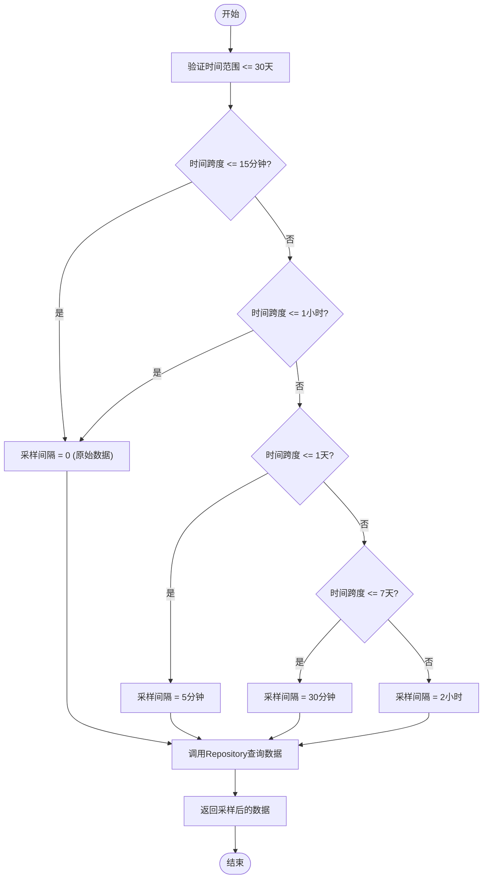

**Diagram sources **
- [metrics.go](file://manager/internal/service/metrics.go#L169-L225)

### 集群资源概览
`GetClusterOverview`方法提供了一个集群级别的资源使用情况概览，聚合了所有节点的CPU、内存、磁盘和网络使用率。

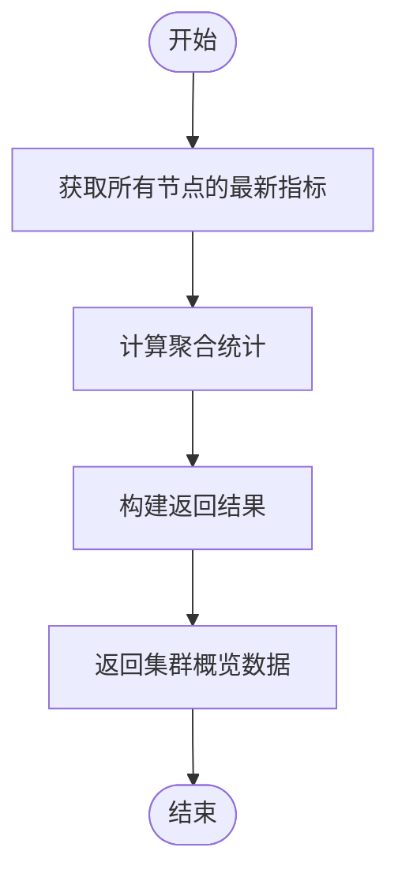

**Diagram sources **
- [metrics.go](file://manager/internal/service/metrics.go#L295-L370)

## 认证服务
认证服务（AuthService）负责用户的注册、登录、密码管理和Token验证，是系统安全性的核心。

### 接口与实现
该服务使用JWT（JSON Web Token）进行无状态的身份验证，并通过`bcrypt`算法安全地存储用户密码。

**Section sources**
- [auth.go](file://manager/internal/service/auth.go#L15-L287)
- [user.go](file://manager/internal/repository/user.go#L10-L36)

### 用户登录流程
用户登录流程包括用户名密码验证、Token生成和最后登录时间更新。

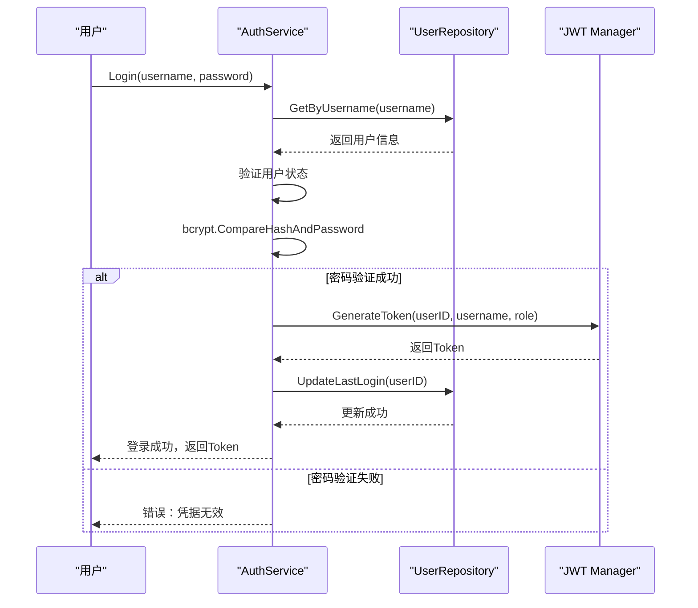

**Diagram sources **
- [auth.go](file://manager/internal/service/auth.go#L116-L153)

### 密码修改流程
用户修改密码时，服务会验证旧密码的正确性，然后使用`bcrypt`加密新密码并更新到数据库。

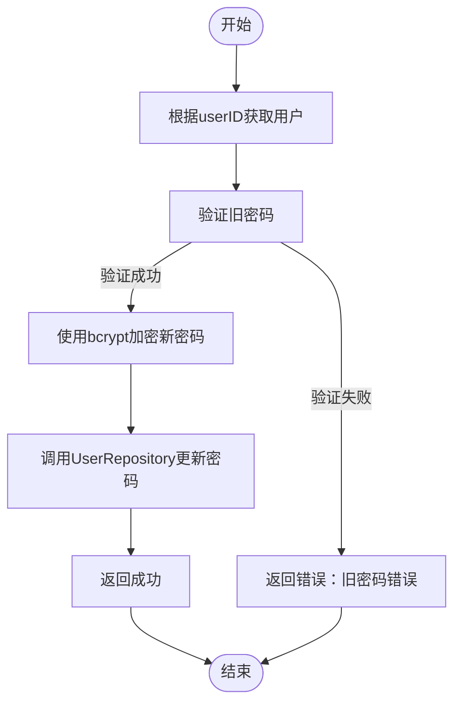

**Diagram sources **
- [auth.go](file://manager/internal/service/auth.go#L171-L204)

## 服务层架构与依赖关系
业务服务层采用了典型的分层架构，各服务通过接口与数据访问层（Repository）和外部依赖（如JWT Manager）进行交互。

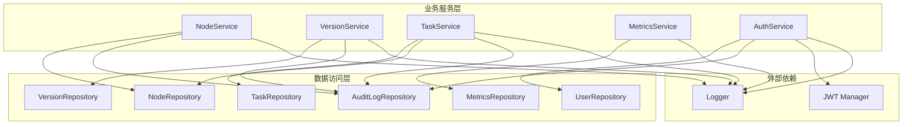

**Diagram sources **
- [node.go](file://manager/internal/service/node.go#L43-L47)
- [version.go](file://manager/internal/service/version.go#L48-L52)
- [task.go](file://manager/internal/service/task.go#L46-L50)
- [metrics.go](file://manager/internal/service/metrics.go#L43-L45)
- [auth.go](file://manager/internal/service/auth.go#L44-L48)

## 事务与并发控制
本系统的服务层主要依赖于数据库的ACID特性来保证数据一致性。GORM框架在执行单个操作时会自动处理事务。对于需要跨多个操作的复杂业务逻辑，可以通过在服务层显式开启事务来实现。

在并发控制方面，服务层通过数据库的唯一约束（如`node_id`和`username`的唯一索引）来防止重复数据的创建。对于高并发场景下的更新操作，依赖于数据库的行级锁来保证数据的完整性。

**Section sources**
- [node.go](file://manager/internal/repository/node.go#L51-L53)
- [user.go](file://manager/internal/repository/user.go#L48-L50)

## 错误处理与日志记录
服务层采用了统一的错误处理机制。所有业务错误都通过`github.com/bingooyong/ops-scaffold-framework/manager/pkg/errors`包进行包装，保留了原始错误的上下文信息。同时，每个服务都注入了`zap.Logger`实例，用于记录关键操作和错误信息，便于问题排查和审计。

**Section sources**
- [node.go](file://manager/internal/service/node.go#L67-L68)
- [auth.go](file://manager/internal/service/auth.go#L71-L72)