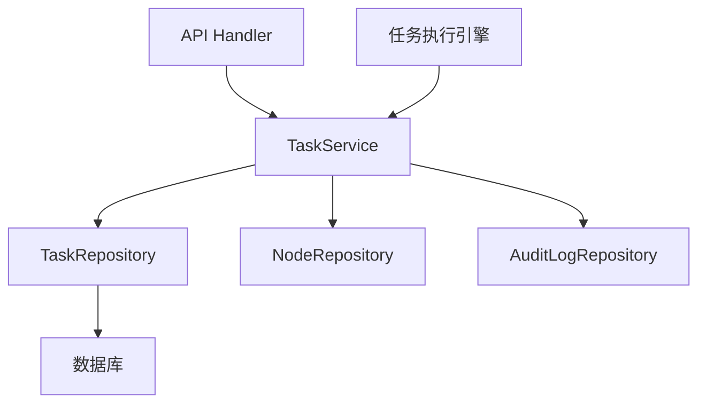
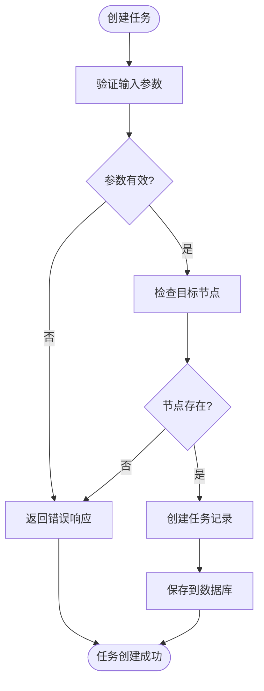
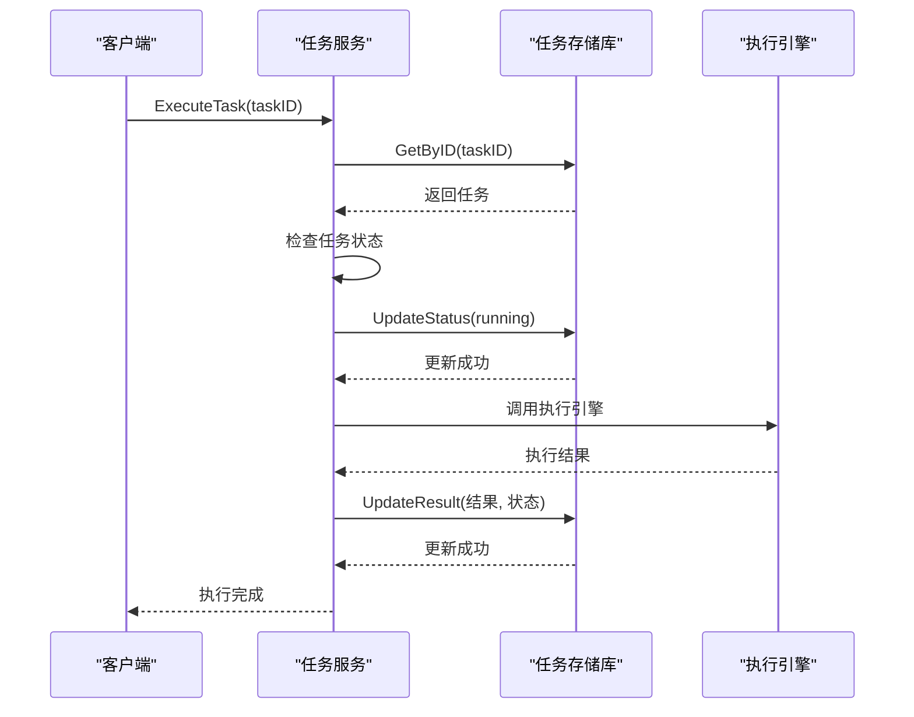
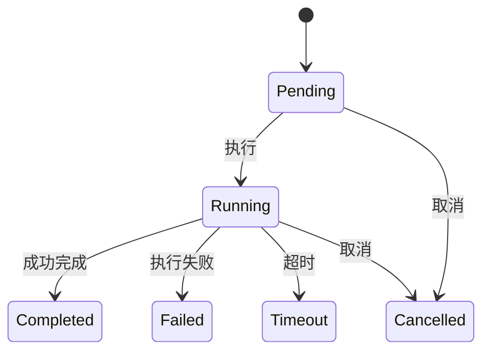
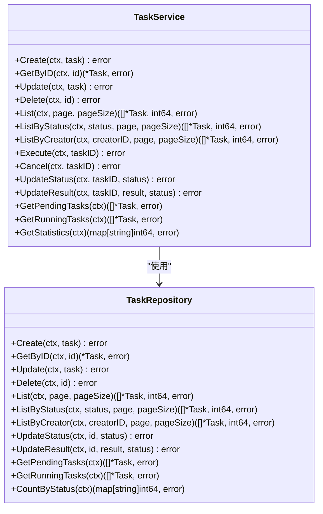
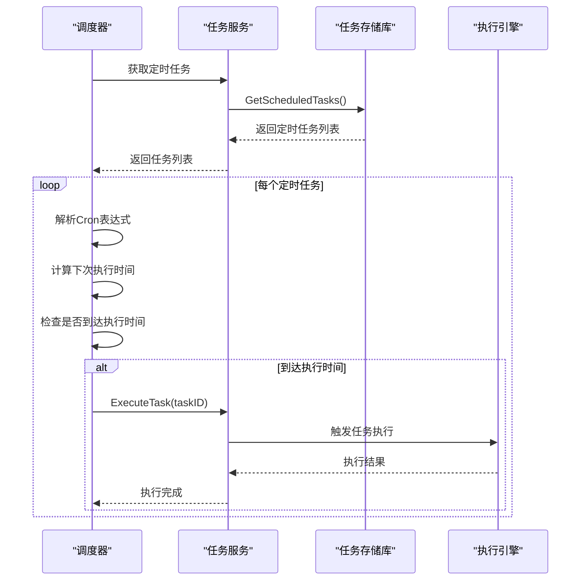
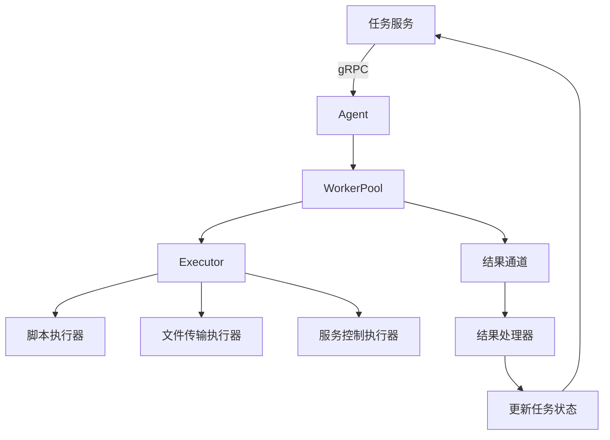
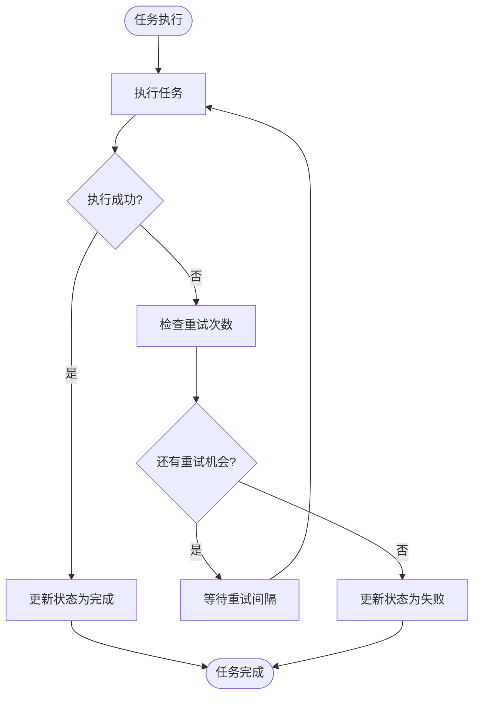

# 任务服务

<cite>
**本文档引用的文件**
- [task.go](file://manager/internal/service/task.go)
- [task.go](file://manager/internal/model/task.go)
- [task.go](file://manager/internal/repository/task.go)
- [设计文档_03_Manager模块.md](file://docs/设计文档_03_Manager模块.md)
- [设计文档_02_Agent模块.md](file://docs/设计文档_02_Agent模块.md)
</cite>

## 目录
1. [简介](#简介)
2. [任务服务架构](#任务服务架构)
3. [核心组件分析](#核心组件分析)
4. [任务生命周期管理](#任务生命周期管理)
5. [定时任务调度](#定时任务调度)
6. [任务执行引擎集成](#任务执行引擎集成)
7. [错误处理与重试机制](#错误处理与重试机制)
8. [性能考虑](#性能考虑)
9. [故障排除指南](#故障排除指南)
10. [结论](#结论)

## 简介
任务服务是运维工具框架的核心组件，负责管理即时任务执行、定时任务（Cron）和任务模板。该服务提供了创建、执行、调度和监控任务的完整功能，支持多种任务类型，并与任务执行引擎紧密集成。通过任务服务，用户可以定义和执行脚本、文件传输、服务控制等操作，同时支持任务超时、重试和失败通知等高级功能。

**Section sources**
- [设计文档_03_Manager模块.md](file://docs/设计文档_03_Manager模块.md)

## 任务服务架构
任务服务采用分层架构设计，包含服务层、存储层和模型层。服务层提供任务管理的业务逻辑，存储层负责数据持久化，模型层定义数据结构。这种分层设计确保了代码的可维护性和可扩展性。

**Diagram sources**
- [task.go](file://manager/internal/service/task.go)
- [task.go](file://manager/internal/repository/task.go)

**Section sources**
- [task.go](file://manager/internal/service/task.go)
- [task.go](file://manager/internal/repository/task.go)

## 核心组件分析
任务服务的核心组件包括任务创建、执行、调度和查询功能。这些组件协同工作，提供完整的任务管理能力。

### 任务创建与验证
任务创建是任务服务的入口点，负责验证任务参数并将其持久化到数据库。创建任务时，服务会验证目标节点是否存在，并确保任务配置的完整性。

**Diagram sources**
- [task.go](file://manager/internal/service/task.go#L68-L90)

**Section sources**
- [task.go](file://manager/internal/service/task.go#L68-L90)

### 任务执行流程
任务执行流程涉及多个步骤，包括状态检查、状态更新和实际执行。服务确保只有处于适当状态的任务才能被执行，并在执行过程中更新任务状态。

**Diagram sources**
- [task.go](file://manager/internal/service/task.go#L169-L213)

**Section sources**
- [task.go](file://manager/internal/service/task.go#L169-L213)

## 任务生命周期管理
任务服务管理任务从创建到完成的完整生命周期，包括各种状态转换和相应的业务逻辑。

### 任务状态机
任务状态机定义了任务在不同状态之间的转换规则，确保任务状态的正确性和一致性。

**Diagram sources**
- [task.go](file://manager/internal/model/task.go#L28-L30)
- [设计文档_02_Agent模块.md](file://docs/设计文档_02_Agent模块.md#L472-L504)

**Section sources**
- [task.go](file://manager/internal/model/task.go#L28-L30)
- [设计文档_02_Agent模块.md](file://docs/设计文档_02_Agent模块.md#L472-L504)

### 任务查询与统计
任务服务提供多种查询方法，支持按状态、创建者和时间范围检索任务，同时提供任务统计信息。

**Diagram sources**
- [task.go](file://manager/internal/service/task.go)
- [task.go](file://manager/internal/repository/task.go)

**Section sources**
- [task.go](file://manager/internal/service/task.go)
- [task.go](file://manager/internal/repository/task.go)

## 定时任务调度
定时任务调度功能允许用户创建基于Cron表达式的周期性任务，服务会根据预定的时间表自动执行这些任务。

### 定时任务调度流程
定时任务调度流程包括任务检索、时间计算和执行触发，确保任务在正确的时间点被执行。

**Diagram sources**
- [设计文档_03_Manager模块.md](file://docs/设计文档_03_Manager模块.md#L526-L545)

**Section sources**
- [设计文档_03_Manager模块.md](file://docs/设计文档_03_Manager模块.md#L526-L545)

## 任务执行引擎集成
任务服务与任务执行引擎紧密集成，通过gRPC或HTTP调用将任务分发到目标节点执行。

### 执行引擎集成架构
执行引擎集成架构展示了任务服务如何与Agent通信，将任务分发到目标节点并收集执行结果。

**Diagram sources**
- [设计文档_02_Agent模块.md](file://docs/设计文档_02_Agent模块.md#L419-L517)

**Section sources**
- [设计文档_02_Agent模块.md](file://docs/设计文档_02_Agent模块.md#L419-L517)

## 错误处理与重试机制
任务服务实现了完善的错误处理和重试机制，确保任务的可靠执行。

### 任务失败处理流程
当任务执行失败时，服务会根据配置的重试策略决定是否重试，并在达到最大重试次数后标记任务为失败。

**Diagram sources**
- [设计文档_02_Agent模块.md](file://docs/设计文档_02_Agent模块.md#L491-L500)

**Section sources**
- [设计文档_02_Agent模块.md](file://docs/设计文档_02_Agent模块.md#L491-L500)

## 性能考虑
任务服务在设计时考虑了性能因素，通过合理的数据库索引、缓存策略和并发控制来确保高并发场景下的性能表现。

**Section sources**
- [设计文档_03_Manager模块.md](file://docs/设计文档_03_Manager模块.md#L526-L545)

## 故障排除指南
当任务服务出现问题时，可以按照以下步骤进行排查：

1. 检查任务状态是否正确
2. 验证目标节点是否在线
3. 检查数据库连接是否正常
4. 查看日志文件中的错误信息
5. 验证Cron表达式是否正确

**Section sources**
- [task.go](file://manager/internal/service/task.go)
- [task.go](file://manager/internal/repository/task.go)

## 结论
任务服务为运维工具框架提供了强大的任务管理能力，支持即时任务执行、定时任务调度和任务模板管理。通过清晰的分层架构和完善的错误处理机制，服务确保了任务的可靠执行。未来可以考虑增加任务依赖、工作流编排等高级功能，进一步提升任务管理的灵活性和效率。