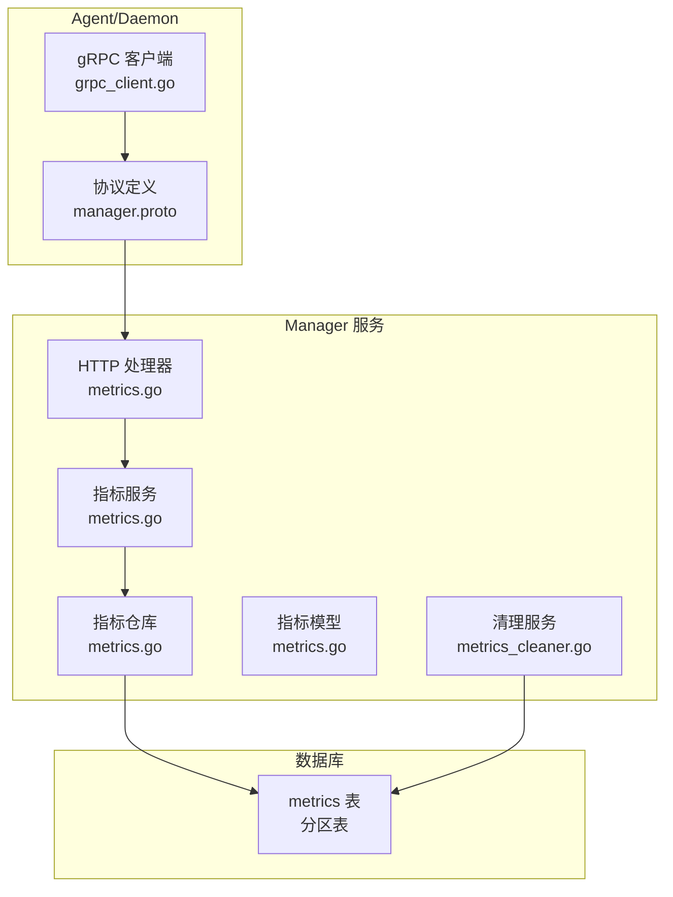
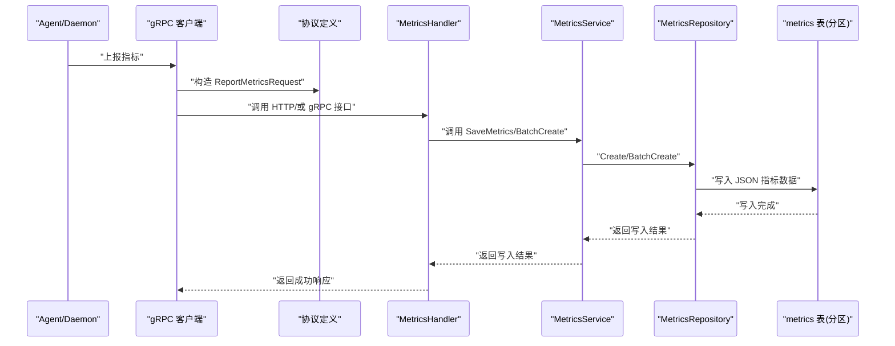
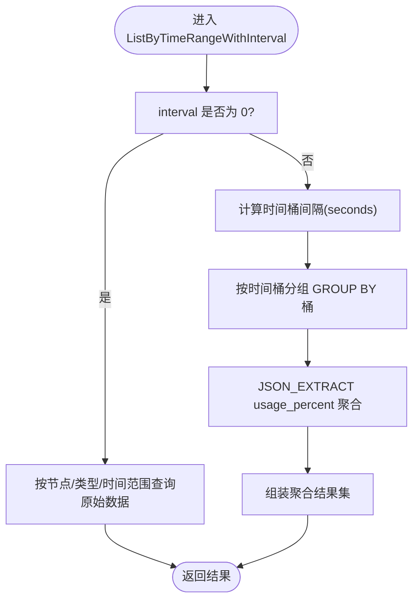
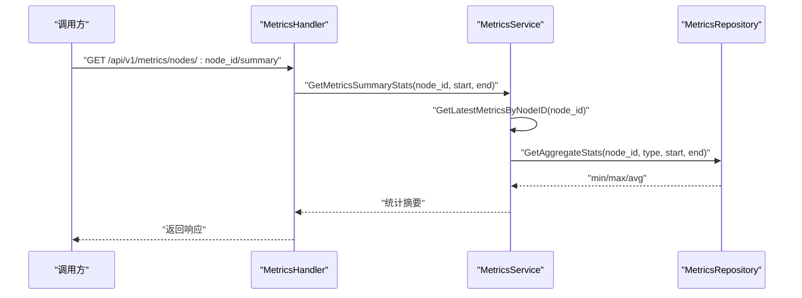
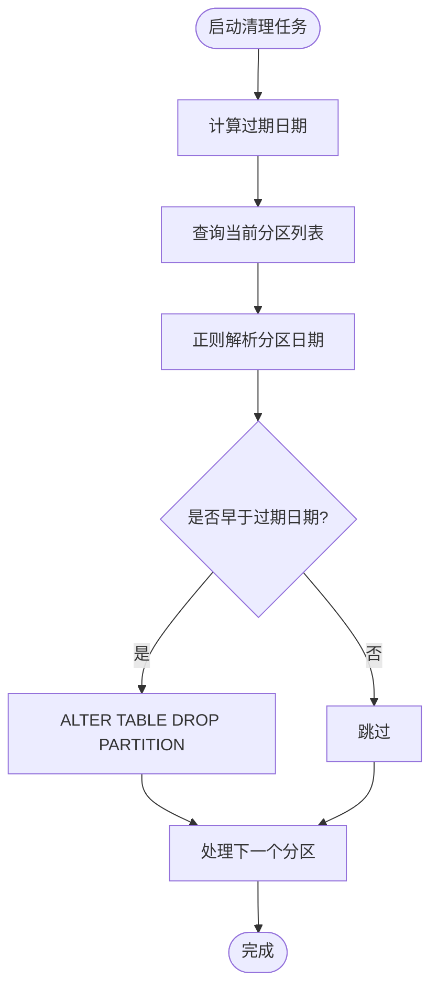
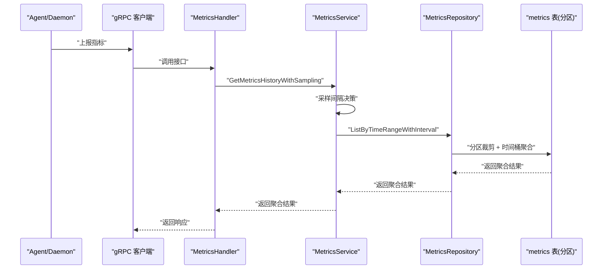
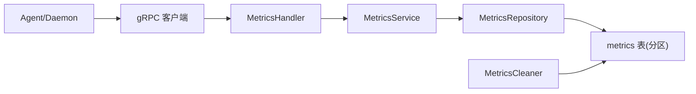

# 指标服务

<cite>
**本文引用的文件**
- [manager/internal/service/metrics.go](file://manager/internal/service/metrics.go)
- [manager/internal/repository/metrics.go](file://manager/internal/repository/metrics.go)
- [manager/internal/model/metrics.go](file://manager/internal/model/metrics.go)
- [manager/internal/handler/metrics.go](file://manager/internal/handler/metrics.go)
- [manager/internal/service/metrics_cleaner.go](file://manager/internal/service/metrics_cleaner.go)
- [manager/migrations/add_metrics_partitions.sql](file://manager/migrations/add_metrics_partitions.sql)
- [manager/migrations/README_PARTITIONS.md](file://manager/migrations/README_PARTITIONS.md)
- [manager/pkg/proto/manager.proto](file://manager/pkg/proto/manager.proto)
- [daemon/internal/comm/grpc_client.go](file://daemon/internal/comm/grpc_client.go)
- [manager/cmd/manager/main.go](file://manager/cmd/manager/main.go)
</cite>

## 目录
1. [简介](#简介)
2. [项目结构](#项目结构)
3. [核心组件](#核心组件)
4. [架构总览](#架构总览)
5. [详细组件分析](#详细组件分析)
6. [依赖关系分析](#依赖关系分析)
7. [性能考量](#性能考量)
8. [故障排查指南](#故障排查指南)
9. [结论](#结论)
10. [附录](#附录)

## 简介
本文件围绕指标服务（MetricsService）展开，系统性阐述其在监控数据采集、存储、查询与清理中的职责与实现细节。重点覆盖以下方法的业务逻辑与实现要点：
- SaveMetrics（写入/批量写入）
- QueryMetrics（分页、按节点与类型、按时间范围、按类型平均值）
- AggregateMetrics（统计摘要 min/max/avg/latest）
- CleanExpiredMetrics（基于分区的过期数据清理）

同时说明服务如何与时间序列数据库交互、如何实现高效的分页查询与采样策略，以及指标清理任务的调度机制，并给出性能优化建议（索引与分区）。

## 项目结构
指标服务位于 Manager 模块内部，采用经典的分层架构：
- Handler 层：对外暴露 HTTP 接口，负责参数校验与响应封装
- Service 层：业务编排与策略控制（如采样策略、统计摘要）
- Repository 层：数据访问与 SQL 实现（含 JSON 字段聚合、时间桶聚合、分区裁剪）
- Model 层：实体与 JSON 映射
- 清理服务：基于分区的过期分区删除
- 迁移脚本：将 metrics 表转换为按日期分区的 RANGE 分区表

图表来源
- [manager/internal/handler/metrics.go](file://manager/internal/handler/metrics.go#L1-L210)
- [manager/internal/service/metrics.go](file://manager/internal/service/metrics.go#L1-L371)
- [manager/internal/repository/metrics.go](file://manager/internal/repository/metrics.go#L1-L503)
- [manager/internal/model/metrics.go](file://manager/internal/model/metrics.go#L1-L65)
- [manager/internal/service/metrics_cleaner.go](file://manager/internal/service/metrics_cleaner.go#L1-L161)
- [daemon/internal/comm/grpc_client.go](file://daemon/internal/comm/grpc_client.go#L170-L253)
- [manager/pkg/proto/manager.proto](file://manager/pkg/proto/manager.proto#L1-L67)

章节来源
- [manager/internal/handler/metrics.go](file://manager/internal/handler/metrics.go#L1-L210)
- [manager/internal/service/metrics.go](file://manager/internal/service/metrics.go#L1-L371)
- [manager/internal/repository/metrics.go](file://manager/internal/repository/metrics.go#L1-L503)
- [manager/internal/model/metrics.go](file://manager/internal/model/metrics.go#L1-L65)
- [manager/internal/service/metrics_cleaner.go](file://manager/internal/service/metrics_cleaner.go#L1-L161)
- [daemon/internal/comm/grpc_client.go](file://daemon/internal/comm/grpc_client.go#L170-L253)
- [manager/pkg/proto/manager.proto](file://manager/pkg/proto/manager.proto#L1-L67)

## 核心组件
- 指标模型（Metrics）：包含节点标识、指标类型、时间戳与 JSON 结构的 values 字段，支持 GORM JSON 映射
- 指标仓库（MetricsRepository）：提供创建、批量创建、分页、按节点/类型/时间范围查询、最新指标查询、平均值聚合、时间桶聚合、统计摘要、集群概览等能力
- 指标服务（MetricsService）：对仓库能力进行编排，提供保存、查询、采样、统计摘要、集群概览等对外接口
- 清理服务（MetricsCleaner）：基于分区的过期分区删除，配合定时任务调度
- Handler（MetricsHandler）：HTTP 接口层，负责参数校验、调用服务层并返回响应

章节来源
- [manager/internal/model/metrics.go](file://manager/internal/model/metrics.go#L1-L65)
- [manager/internal/repository/metrics.go](file://manager/internal/repository/metrics.go#L1-L503)
- [manager/internal/service/metrics.go](file://manager/internal/service/metrics.go#L1-L371)
- [manager/internal/service/metrics_cleaner.go](file://manager/internal/service/metrics_cleaner.go#L1-L161)
- [manager/internal/handler/metrics.go](file://manager/internal/handler/metrics.go#L1-L210)

## 架构总览
指标服务整体流程如下：
- Agent/ Daemon 通过 gRPC 将指标数据上报至 Manager
- Manager 的 Handler 校验参数后，调用 Service 层
- Service 层调用 Repository 层执行具体 SQL 查询或写入
- Repository 层基于分区表与索引执行高效查询与聚合
- 清理服务通过定时任务删除过期分区，保障查询性能与存储空间

图表来源
- [daemon/internal/comm/grpc_client.go](file://daemon/internal/comm/grpc_client.go#L170-L253)
- [manager/pkg/proto/manager.proto](file://manager/pkg/proto/manager.proto#L1-L67)
- [manager/internal/handler/metrics.go](file://manager/internal/handler/metrics.go#L1-L210)
- [manager/internal/service/metrics.go](file://manager/internal/service/metrics.go#L1-L120)
- [manager/internal/repository/metrics.go](file://manager/internal/repository/metrics.go#L70-L109)

## 详细组件分析

### 指标模型与 JSON 映射
- 模型字段包含主键、创建时间、软删除索引、节点ID、类型、时间戳与 JSON values
- JSONMap 实现了 GORM 的 Scanner/Valuer 接口，支持 JSON 字段的读写
- 该设计便于存储多维度指标值（如 usage_percent、total_bytes、rx_bytes、tx_bytes 等）

章节来源
- [manager/internal/model/metrics.go](file://manager/internal/model/metrics.go#L1-L65)

### 仓库层：数据访问与查询优化
- 写入与批量写入：Create/BatchCreate 直接映射到 GORM
- 分页查询：按节点/类型/时间范围分页，支持总数统计与排序
- 最新指标查询：使用子查询获取每节点每类型的最新记录
- 时间范围查询：按节点与类型过滤，支持时间区间升序
- 平均值聚合：遍历时间段内记录，累加并计算平均值
- 时间桶聚合：按时间桶分组，使用 JSON_EXTRACT 聚合 usage_percent，返回聚合后的指标点
- 统计摘要：对 min/max/avg 进行 JSON_EXTRACT 聚合，处理空数据与 NULL 值
- 集群概览：LEFT JOIN 子查询，提取各节点最新 CPU/Memory/Disk/Network 指标，计算平均使用率与总量

图表来源
- [manager/internal/repository/metrics.go](file://manager/internal/repository/metrics.go#L258-L333)

章节来源
- [manager/internal/repository/metrics.go](file://manager/internal/repository/metrics.go#L70-L109)
- [manager/internal/repository/metrics.go](file://manager/internal/repository/metrics.go#L111-L156)
- [manager/internal/repository/metrics.go](file://manager/internal/repository/metrics.go#L158-L171)
- [manager/internal/repository/metrics.go](file://manager/internal/repository/metrics.go#L173-L208)
- [manager/internal/repository/metrics.go](file://manager/internal/repository/metrics.go#L210-L219)
- [manager/internal/repository/metrics.go](file://manager/internal/repository/metrics.go#L221-L256)
- [manager/internal/repository/metrics.go](file://manager/internal/repository/metrics.go#L258-L333)
- [manager/internal/repository/metrics.go](file://manager/internal/repository/metrics.go#L335-L374)
- [manager/internal/repository/metrics.go](file://manager/internal/repository/metrics.go#L376-L502)

### 服务层：业务编排与策略
- SaveMetrics（Create/BatchCreate）：调用仓库写入，统一错误包装与日志
- QueryMetrics（ListByNodeID/ListByTimeRange）：分页与时间范围查询，错误包装与日志
- Average（GetAverageByNodeIDAndType）：遍历时间段内记录，计算各 key 的平均值
- Sampling（GetMetricsHistoryWithSampling）：根据时间跨度自动选择采样间隔，确保数据点数量适中；对 30 天以上的范围进行参数校验
- Aggregate（GetMetricsSummaryStats）：对每种类型计算 min/max/avg，结合最新指标的 usage_percent 作为 latest
- ClusterOverview（GetClusterOverview）：聚合所有节点最新指标，计算平均使用率与总量，返回节点列表

图表来源
- [manager/internal/handler/metrics.go](file://manager/internal/handler/metrics.go#L131-L191)
- [manager/internal/service/metrics.go](file://manager/internal/service/metrics.go#L227-L293)
- [manager/internal/repository/metrics.go](file://manager/internal/repository/metrics.go#L335-L374)

章节来源
- [manager/internal/service/metrics.go](file://manager/internal/service/metrics.go#L59-L126)
- [manager/internal/service/metrics.go](file://manager/internal/service/metrics.go#L128-L138)
- [manager/internal/service/metrics.go](file://manager/internal/service/metrics.go#L169-L225)
- [manager/internal/service/metrics.go](file://manager/internal/service/metrics.go#L227-L293)
- [manager/internal/service/metrics.go](file://manager/internal/service/metrics.go#L295-L370)

### 清理服务与调度机制
- 清理服务（MetricsCleaner）：解析分区名，提取日期，判断是否过期，逐个删除过期分区
- 调度机制：Manager 启动时根据配置加载 cron 表达式，定时触发清理任务

图表来源
- [manager/internal/service/metrics_cleaner.go](file://manager/internal/service/metrics_cleaner.go#L29-L112)
- [manager/cmd/manager/main.go](file://manager/cmd/manager/main.go#L110-L133)

章节来源
- [manager/internal/service/metrics_cleaner.go](file://manager/internal/service/metrics_cleaner.go#L1-L161)
- [manager/cmd/manager/main.go](file://manager/cmd/manager/main.go#L110-L133)

### 与时间序列数据库的交互
- 表结构与分区：迁移脚本将 metrics 表转换为按日期分区的 RANGE 分区表，使用 TO_DAYS(timestamp) 作为分区键，初始创建未来若干天分区与 p_future
- 索引设计：主索引 idx_node_type_time(node_id, type, timestamp)，辅助索引 idx_node_time(node_id, timestamp)，软删除索引 idx_deleted_at(deleted_at)
- 查询优化：通过分区裁剪与索引使用，确保时间范围查询仅扫描相关分区；时间桶聚合利用 GROUP BY 与 JSON_EXTRACT 实现

章节来源
- [manager/migrations/add_metrics_partitions.sql](file://manager/migrations/add_metrics_partitions.sql#L1-L101)
- [manager/migrations/README_PARTITIONS.md](file://manager/migrations/README_PARTITIONS.md#L1-L338)

### 写入与查询流程（时序图）
- 写入流程：Agent/Daemon 通过 gRPC 客户端上报指标，Manager 的 Handler/Service/Repository 完成入库
- 查询流程：Handler 校验参数，Service 编排采样策略与统计摘要，Repository 执行分区裁剪与聚合

图表来源
- [daemon/internal/comm/grpc_client.go](file://daemon/internal/comm/grpc_client.go#L170-L253)
- [manager/internal/handler/metrics.go](file://manager/internal/handler/metrics.go#L56-L129)
- [manager/internal/service/metrics.go](file://manager/internal/service/metrics.go#L169-L225)
- [manager/internal/repository/metrics.go](file://manager/internal/repository/metrics.go#L258-L333)

## 依赖关系分析
- Handler 依赖 Service 接口
- Service 依赖 Repository 接口
- Repository 依赖 GORM 与 MySQL
- 清理服务依赖数据库分区信息与 ALTER TABLE DROP PARTITION
- Agent/Daemon 通过 gRPC 协议与 Manager 通信

图表来源
- [manager/internal/handler/metrics.go](file://manager/internal/handler/metrics.go#L1-L210)
- [manager/internal/service/metrics.go](file://manager/internal/service/metrics.go#L1-L371)
- [manager/internal/repository/metrics.go](file://manager/internal/repository/metrics.go#L1-L503)
- [manager/internal/service/metrics_cleaner.go](file://manager/internal/service/metrics_cleaner.go#L1-L161)
- [daemon/internal/comm/grpc_client.go](file://daemon/internal/comm/grpc_client.go#L170-L253)

章节来源
- [manager/internal/handler/metrics.go](file://manager/internal/handler/metrics.go#L1-L210)
- [manager/internal/service/metrics.go](file://manager/internal/service/metrics.go#L1-L371)
- [manager/internal/repository/metrics.go](file://manager/internal/repository/metrics.go#L1-L503)
- [manager/internal/service/metrics_cleaner.go](file://manager/internal/service/metrics_cleaner.go#L1-L161)
- [daemon/internal/comm/grpc_client.go](file://daemon/internal/comm/grpc_client.go#L170-L253)

## 性能考量
- 分区裁剪：使用 RANGE 分区与 TO_DAYS(timestamp) 保证时间范围查询仅扫描相关分区
- 索引优化：idx_node_type_time(node_id, type, timestamp) 与 idx_node_time(node_id, timestamp) 提升查询与最新指标查询效率
- 采样策略：根据时间跨度自动选择采样间隔，避免前端渲染过多数据点
- 聚合查询：使用 JSON_EXTRACT 与 GROUP BY 实现时间桶聚合，减少网络传输与前端渲染压力
- 清理策略：通过分区删除替代 DELETE，显著降低锁表与 IO 压力

章节来源
- [manager/migrations/add_metrics_partitions.sql](file://manager/migrations/add_metrics_partitions.sql#L1-L101)
- [manager/migrations/README_PARTITIONS.md](file://manager/migrations/README_PARTITIONS.md#L1-L338)
- [manager/internal/service/metrics.go](file://manager/internal/service/metrics.go#L169-L225)
- [manager/internal/repository/metrics.go](file://manager/internal/repository/metrics.go#L258-L333)

## 故障排查指南
- 写入失败：检查 gRPC 客户端连接状态、节点注册状态与请求参数；查看服务层日志
- 查询异常：确认时间范围参数合法（≤30 天）、时间顺序正确；检查索引是否命中
- 采样策略：若 SQLite 环境下聚合函数不可用，采样策略决策逻辑仍可验证
- 清理失败：检查分区命名格式、过期日期计算与权限；查看清理服务日志

章节来源
- [daemon/internal/comm/grpc_client.go](file://daemon/internal/comm/grpc_client.go#L170-L253)
- [manager/internal/handler/metrics.go](file://manager/internal/handler/metrics.go#L56-L129)
- [manager/internal/service/metrics.go](file://manager/internal/service/metrics.go#L169-L225)
- [manager/internal/service/metrics_cleaner.go](file://manager/internal/service/metrics_cleaner.go#L29-L112)

## 结论
指标服务通过清晰的分层设计与分区表优化，在大规模时间序列数据场景下实现了高吞吐写入、高效查询与低成本清理。采样策略与统计摘要进一步提升了前端展示体验与系统性能。建议在生产环境中结合分区维护与索引监控，持续优化查询计划与分区数量。

## 附录
- 指标上报协议：manager.proto 定义了 ReportMetrics 请求与响应
- Agent 上报实现：daemon 内部 gRPC 客户端将本地指标转换为 Manager 协议并上报

章节来源
- [manager/pkg/proto/manager.proto](file://manager/pkg/proto/manager.proto#L1-L67)
- [daemon/internal/comm/grpc_client.go](file://daemon/internal/comm/grpc_client.go#L170-L253)