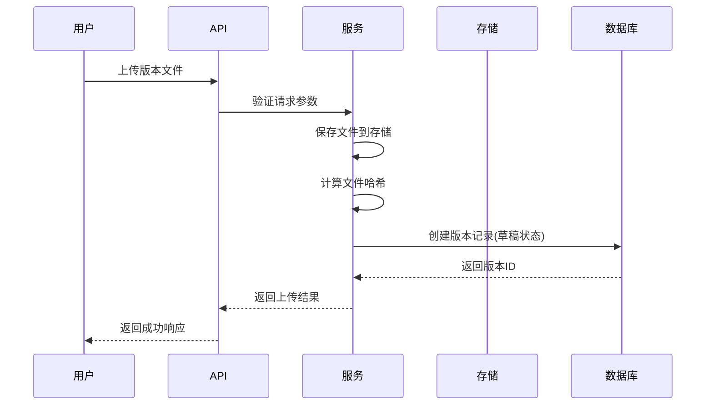
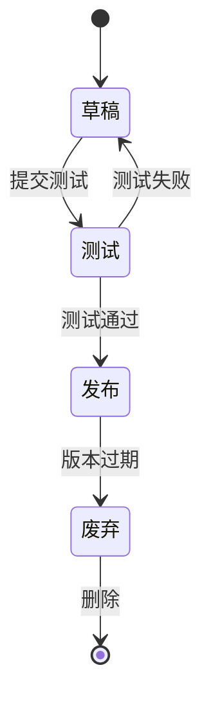

# 版本服务

<cite>
**本文档引用的文件**   
- [version.go](file://manager/internal/model/version.go)
- [version.go](file://manager/internal/service/version.go)
- [version.go](file://manager/internal/repository/version.go)
- [设计文档_03_Manager模块.md](file://docs/设计文档_03_Manager模块.md)
- [设计文档_01_Daemon模块.md](file://docs/设计文档_01_Daemon模块.md)
</cite>

## 目录
1. [简介](#简介)
2. [核心组件](#核心组件)
3. [版本上传与签名验证](#版本上传与签名验证)
4. [灰度发布与批量更新](#灰度发布与批量更新)
5. [回滚操作](#回滚操作)
6. [配置选项](#配置选项)
7. [异常处理策略](#异常处理策略)

## 简介
版本服务是运维框架中的核心组件，负责管理Daemon和Agent组件的版本生命周期。该服务提供了完整的版本管理功能，包括版本上传、发布、回滚和删除等操作。通过协调文件存储、签名验证和任务调度系统，版本服务确保了版本发布的安全性和可靠性。服务支持灰度发布、批量更新等高级发布策略，满足不同场景下的发布需求。

## 核心组件

版本服务由三个核心组件构成：版本模型（Version Model）、版本数据访问层（Version Repository）和版本业务逻辑层（Version Service）。版本模型定义了版本的元数据结构，包括组件类型、版本号、文件信息、哈希值和数字签名等属性。版本数据访问层封装了对数据库的CRUD操作，提供了版本数据的持久化能力。版本业务逻辑层实现了版本管理的核心业务逻辑，包括版本创建、发布、废弃和删除等操作。

**Section sources**
- [version.go](file://manager/internal/model/version.go#L9-L48)
- [version.go](file://manager/internal/service/version.go#L17-L44)
- [version.go](file://manager/internal/repository/version.go#L10-L38)

## 版本上传与签名验证

### 上传流程
版本上传流程始于用户通过API上传版本文件。服务首先验证上传请求的合法性，检查组件类型、版本号等必填字段。然后，服务将上传的文件保存到文件存储系统，并计算文件的SHA-256哈希值。接下来，服务创建版本记录并将其保存到数据库中，此时版本状态为"草稿"。最后，服务返回上传结果，包括版本ID和下载URL。

### 签名验证
签名验证是确保版本文件完整性和来源可信性的关键步骤。当版本发布时，服务会验证文件的数字签名。验证过程包括：首先从数据库获取版本的数字签名和预期哈希值，然后下载版本文件并计算其实际哈希值，最后使用公钥验证数字签名的有效性。只有通过所有验证的版本才能被发布。

**Diagram sources **
- [version.go](file://manager/internal/service/version.go#L67-L90)
- [version.go](file://manager/internal/repository/version.go#L51-L53)

**Section sources**
- [version.go](file://manager/internal/service/version.go#L67-L90)
- [version.go](file://manager/internal/repository/version.go#L51-L53)
- [设计文档_03_Manager模块.md](file://docs/设计文档_03_Manager模块.md#L829-L892)

## 灰度发布与批量更新

### 发布策略
版本服务支持多种发布策略，包括全量发布、滚动发布和灰度发布。全量发布将新版本同时部署到所有目标节点；滚动发布将目标节点分批更新，每批更新完成后验证成功再进行下一批；灰度发布先将新版本部署到少量节点，验证无误后再逐步扩大范围。发布策略通过`DeployRequest.Strategy`字段指定。

### 批量更新
批量更新功能允许同时更新多个节点的组件版本。服务根据`DeployRequest.TargetType`和`TargetValue`确定目标节点集合，然后创建更新任务并提交给任务调度系统。任务调度系统负责协调各个节点的更新过程，监控更新进度，并收集更新结果。服务提供API查询更新状态，包括成功、失败和待处理的节点数量。

**Diagram sources **
- [设计文档_03_Manager模块.md](file://docs/设计文档_03_Manager模块.md#L866-L874)
- [设计文档_03_Manager模块.md](file://docs/设计文档_03_Manager模块.md#L1136-L1140)

**Section sources**
- [设计文档_03_Manager模块.md](file://docs/设计文档_03_Manager模块.md#L866-L874)
- [设计文档_03_Manager模块.md](file://docs/设计文档_03_Manager模块.md#L1136-L1140)

## 回滚操作

### 回滚流程
回滚操作用于将组件版本恢复到之前的稳定版本。当需要回滚时，用户指定要回滚的批次ID和目标版本。服务首先验证回滚请求的合法性，检查目标版本是否存在且已发布。然后，服务创建回滚任务并提交给任务调度系统。任务调度系统负责协调各个节点的回滚过程，确保所有节点都成功回滚到指定版本。

### 事务管理
回滚操作采用事务性管理，确保操作的原子性和一致性。服务在执行回滚前会创建事务，记录回滚的起始状态。在回滚过程中，每个节点的回滚操作都是独立的事务，确保单个节点的失败不会影响其他节点。当所有节点都完成回滚后，服务提交主事务，更新回滚任务的状态。如果任何节点回滚失败，服务会记录失败信息并继续处理其他节点，最后将任务状态设置为部分成功。

**Section sources**
- [设计文档_03_Manager模块.md](file://docs/设计文档_03_Manager模块.md#L848)
- [设计文档_03_Manager模块.md](file://docs/设计文档_03_Manager模块.md#L1140)

## 配置选项

### 版本兼容性规则
版本服务支持配置版本兼容性规则，确保新版本与现有系统兼容。兼容性规则包括：操作系统兼容性、架构兼容性、依赖组件版本范围等。这些规则在版本上传时进行验证，只有符合所有规则的版本才能被创建。兼容性规则存储在版本记录的元数据中，供后续的发布和更新操作参考。

### 发布策略配置
发布策略配置允许用户自定义发布行为。可配置的选项包括：批次大小、批次间隔时间、失败容忍度、健康检查超时时间等。这些配置在发布请求中指定，影响任务调度系统的行为。例如，批次大小决定了每次更新的节点数量，批次间隔时间控制了批次之间的等待时间，失败容忍度指定了允许失败的节点比例。

**Section sources**
- [设计文档_03_Manager模块.md](file://docs/设计文档_03_Manager模块.md#L855-L858)
- [设计文档_03_Manager模块.md](file://docs/设计文档_03_Manager模块.md#L871-L872)

## 异常处理策略

### 错误分类
版本服务将错误分为三类：客户端错误、服务端错误和外部依赖错误。客户端错误包括参数验证失败、权限不足等，服务返回400系列HTTP状态码。服务端错误包括数据库操作失败、文件系统错误等，服务返回500系列HTTP状态码。外部依赖错误包括存储系统不可用、任务调度系统故障等，服务返回503状态码。

### 重试机制
对于可重试的错误，服务实现了指数退避重试机制。重试策略包括：最大重试次数、初始重试间隔、重试间隔倍增因子等。例如，当数据库连接失败时，服务会在1秒后重试，如果仍然失败，则在2秒、4秒、8秒后依次重试，直到达到最大重试次数。重试机制确保了在临时性故障下的操作最终能够成功。

**Section sources**
- [version.go](file://manager/internal/service/version.go#L70-L74)
- [version.go](file://manager/internal/service/version.go#L131-L138)
- [version.go](file://manager/internal/service/version.go#L198-L205)