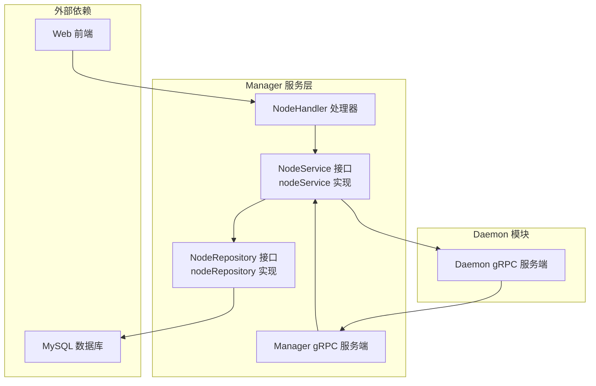
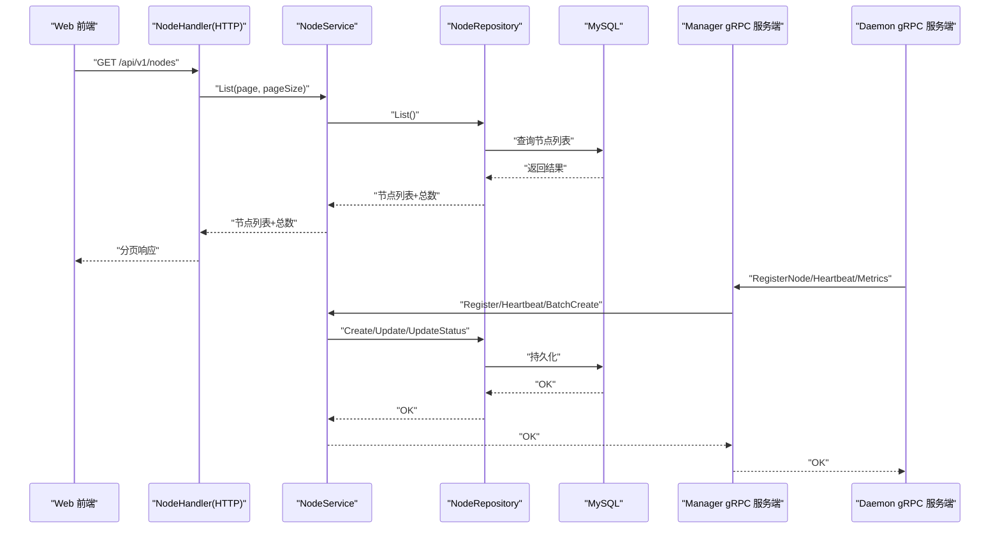
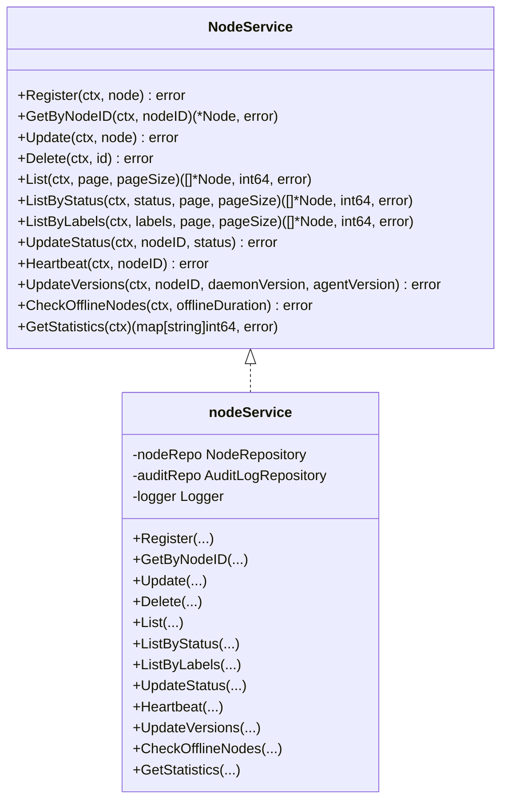
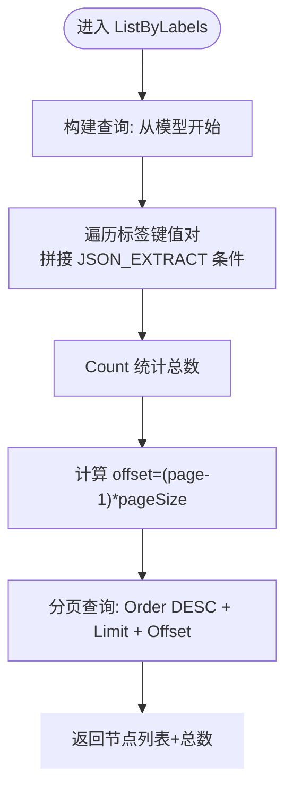
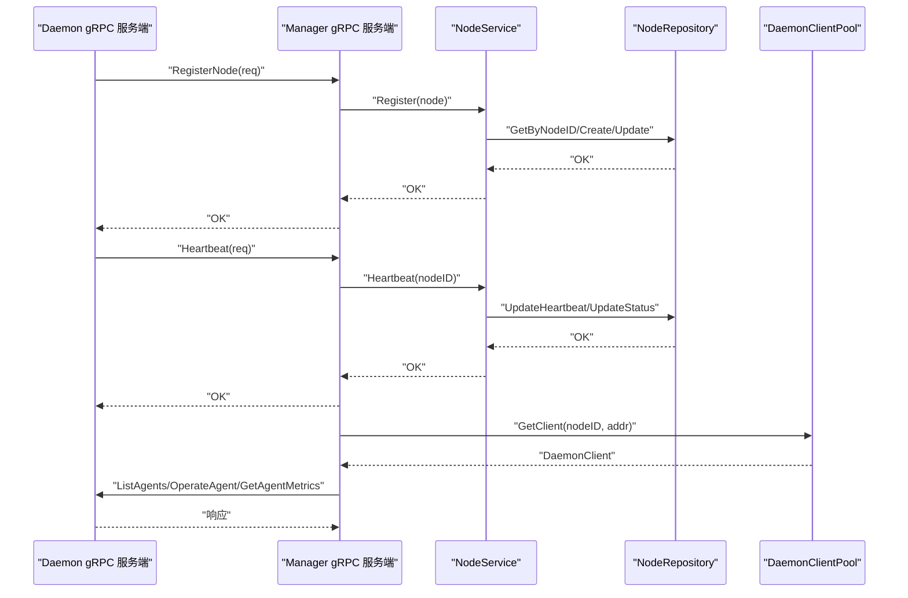
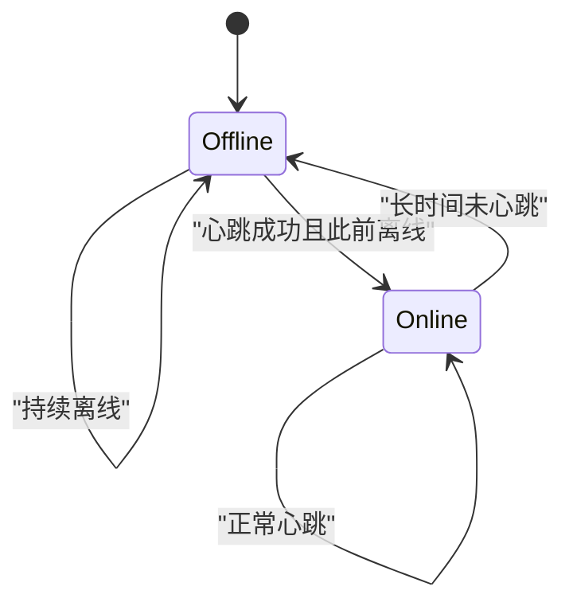
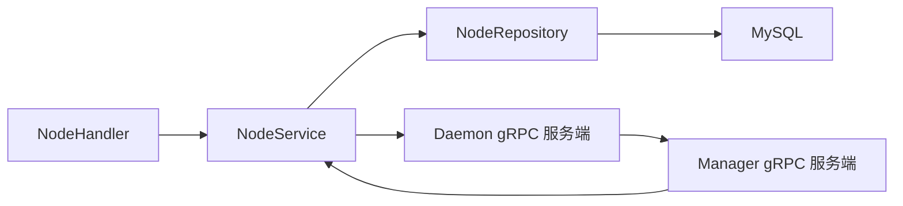

# 节点服务

<cite>
**本文引用的文件**
- [manager/internal/service/node.go](file://manager/internal/service/node.go)
- [manager/internal/repository/node.go](file://manager/internal/repository/node.go)
- [manager/internal/handler/node.go](file://manager/internal/handler/node.go)
- [manager/internal/grpc/server.go](file://manager/internal/grpc/server.go)
- [manager/internal/grpc/daemon_client.go](file://manager/internal/grpc/daemon_client.go)
- [manager/internal/model/node.go](file://manager/internal/model/node.go)
- [manager/pkg/errors/errors.go](file://manager/pkg/errors/errors.go)
- [daemon/internal/grpc/server.go](file://daemon/internal/grpc/server.go)
- [docs/设计文档_03_Manager模块.md](file://docs/设计文档_03_Manager模块.md)
</cite>

## 目录
1. [简介](#简介)
2. [项目结构](#项目结构)
3. [核心组件](#核心组件)
4. [架构总览](#架构总览)
5. [详细组件分析](#详细组件分析)
6. [依赖关系分析](#依赖关系分析)
7. [性能考量](#性能考量)
8. [故障排查指南](#故障排查指南)
9. [结论](#结论)
10. [附录](#附录)

## 简介
本文件围绕 Manager 模块中的 NodeService 展开，系统性阐述其在节点注册、状态同步、分组管理（标签）与标签管理中的核心职责；详解 CreateNode、UpdateNode、DeleteNode、GetNode、ListNode 等方法的业务逻辑、参数校验与错误处理；说明服务层如何通过 NodeRepository 进行数据持久化，以及如何通过 gRPC 与 Daemon 模块通信以获取实时节点状态与能力。文档同时提供节点生命周期管理的时序图与状态转换图，并给出服务调用模式的示例路径，帮助开发者快速理解从注册到注销的完整流程。

## 项目结构
- 服务层位于 manager/internal/service，包含 NodeService 接口与实现 nodeService。
- 数据访问层位于 manager/internal/repository，包含 NodeRepository 接口与实现 nodeRepository。
- Web 层处理器位于 manager/internal/handler，负责 HTTP API 的参数解析、校验与响应封装。
- gRPC 层位于 manager/internal/grpc，提供 ManagerService gRPC 服务端，对接 Daemon 的 gRPC 客户端。
- 模型定义位于 manager/internal/model，包含 Node 结构及 JSON 映射工具。
- 错误体系位于 manager/pkg/errors，统一错误码与包装策略。

图表来源
- [manager/internal/service/node.go](file://manager/internal/service/node.go#L14-L40)
- [manager/internal/repository/node.go](file://manager/internal/repository/node.go#L11-L39)
- [manager/internal/handler/node.go](file://manager/internal/handler/node.go#L1-L35)
- [manager/internal/grpc/server.go](file://manager/internal/grpc/server.go#L1-L32)
- [daemon/internal/grpc/server.go](file://daemon/internal/grpc/server.go#L1-L35)

章节来源
- [manager/internal/service/node.go](file://manager/internal/service/node.go#L1-L40)
- [manager/internal/repository/node.go](file://manager/internal/repository/node.go#L1-L39)
- [manager/internal/handler/node.go](file://manager/internal/handler/node.go#L1-L35)
- [manager/internal/grpc/server.go](file://manager/internal/grpc/server.go#L1-L32)
- [daemon/internal/grpc/server.go](file://daemon/internal/grpc/server.go#L1-L35)

## 核心组件
- NodeService 接口与实现：定义节点生命周期管理的核心方法，包括注册、查询、更新、删除、列表、状态更新、心跳、版本更新、离线检测与统计。
- NodeRepository 接口与实现：封装对 MySQL 的 CRUD 与聚合查询，支持按状态、标签过滤与离线节点检测。
- NodeHandler：HTTP 层入口，负责参数绑定、分页与校验、调用 NodeService 并返回统一响应。
- Manager gRPC 服务端：接收 Daemon 的注册、心跳、指标上报请求，驱动 NodeService 完成状态同步与持久化。
- Daemon gRPC 服务端：提供 Agent 列举、操作、指标查询等能力，供 Manager 侧通过连接池调用。
- Node 模型：定义节点字段、状态、标签、版本与时间戳等，支持 JSON 序列化与反序列化。
- 错误体系：统一错误码与包装，便于上层统一处理。

章节来源
- [manager/internal/service/node.go](file://manager/internal/service/node.go#L14-L40)
- [manager/internal/repository/node.go](file://manager/internal/repository/node.go#L11-L39)
- [manager/internal/handler/node.go](file://manager/internal/handler/node.go#L1-L35)
- [manager/internal/grpc/server.go](file://manager/internal/grpc/server.go#L34-L145)
- [daemon/internal/grpc/server.go](file://daemon/internal/grpc/server.go#L37-L171)
- [manager/internal/model/node.go](file://manager/internal/model/node.go#L11-L38)
- [manager/pkg/errors/errors.go](file://manager/pkg/errors/errors.go#L1-L171)

## 架构总览
Manager 通过 HTTP 与 gRPC 双通道管理节点：
- HTTP：Web 前端调用 NodeHandler，经 NodeService 调用 NodeRepository 持久化；支持分组（按状态）、标签过滤与统计。
- gRPC：Daemon 主动上报注册、心跳、指标；Manager 侧 gRPC 服务端调用 NodeService 更新状态与版本，必要时通过 DaemonClientPool 与 Daemon 交互。

图表来源
- [manager/internal/handler/node.go](file://manager/internal/handler/node.go#L36-L69)
- [manager/internal/service/node.go](file://manager/internal/service/node.go#L126-L134)
- [manager/internal/repository/node.go](file://manager/internal/repository/node.go#L86-L105)
- [manager/internal/grpc/server.go](file://manager/internal/grpc/server.go#L34-L145)
- [daemon/internal/grpc/server.go](file://daemon/internal/grpc/server.go#L37-L171)

## 详细组件分析

### NodeService 接口与实现
- 职责边界清晰：注册、查询、更新、删除、列表、状态更新、心跳、版本更新、离线检测、统计。
- 错误处理：统一使用错误包装，区分数据库错误与业务错误，便于上层响应。
- 状态同步：心跳时更新 last_heartbeat_at，并在节点由离线转在线时更新状态。

图表来源
- [manager/internal/service/node.go](file://manager/internal/service/node.go#L14-L40)
- [manager/internal/service/node.go](file://manager/internal/service/node.go#L42-L233)

章节来源
- [manager/internal/service/node.go](file://manager/internal/service/node.go#L14-L40)
- [manager/internal/service/node.go](file://manager/internal/service/node.go#L62-L91)
- [manager/internal/service/node.go](file://manager/internal/service/node.go#L93-L114)
- [manager/internal/service/node.go](file://manager/internal/service/node.go#L116-L124)
- [manager/internal/service/node.go](file://manager/internal/service/node.go#L126-L154)
- [manager/internal/service/node.go](file://manager/internal/service/node.go#L156-L188)
- [manager/internal/service/node.go](file://manager/internal/service/node.go#L190-L201)
- [manager/internal/service/node.go](file://manager/internal/service/node.go#L203-L223)
- [manager/internal/service/node.go](file://manager/internal/service/node.go#L225-L233)

### NodeRepository 接口与实现
- 支持按状态、标签过滤的列表查询，标签查询基于 JSON 字段检索。
- 提供心跳更新、版本更新、离线节点检测与按状态计数等辅助能力。
- 分页查询采用先 Count 再 Offset/Limit 的方式，保证一致性。

图表来源
- [manager/internal/repository/node.go](file://manager/internal/repository/node.go#L130-L156)

章节来源
- [manager/internal/repository/node.go](file://manager/internal/repository/node.go#L11-L39)
- [manager/internal/repository/node.go](file://manager/internal/repository/node.go#L130-L156)
- [manager/internal/repository/node.go](file://manager/internal/repository/node.go#L158-L187)
- [manager/internal/repository/node.go](file://manager/internal/repository/node.go#L189-L200)
- [manager/internal/repository/node.go](file://manager/internal/repository/node.go#L201-L226)

### NodeHandler（HTTP 层）
- 参数绑定与校验：分页参数默认值与上限控制；状态查询分支；节点详情参数非空校验。
- 统一响应：成功与错误均通过统一响应封装，错误时区分 APIError 与内部错误。
- 统计聚合：将底层按状态计数聚合为 total/online/offline 字段。

章节来源
- [manager/internal/handler/node.go](file://manager/internal/handler/node.go#L36-L69)
- [manager/internal/handler/node.go](file://manager/internal/handler/node.go#L71-L92)
- [manager/internal/handler/node.go](file://manager/internal/handler/node.go#L94-L115)
- [manager/internal/handler/node.go](file://manager/internal/handler/node.go#L116-L156)

### gRPC 与 Daemon 交互
- Manager gRPC 服务端：接收 RegisterNode、Heartbeat、ReportMetrics，调用 NodeService 完成状态与版本更新。
- Daemon gRPC 服务端：提供 ListAgents、OperateAgent、GetAgentMetrics、SyncAgentStates 等能力。
- 连接池：DaemonClientPool 为不同 nodeID 维护独立连接，具备重连与超时控制。

图表来源
- [manager/internal/grpc/server.go](file://manager/internal/grpc/server.go#L34-L97)
- [daemon/internal/grpc/server.go](file://daemon/internal/grpc/server.go#L37-L171)
- [manager/internal/grpc/daemon_client.go](file://manager/internal/grpc/daemon_client.go#L297-L398)

章节来源
- [manager/internal/grpc/server.go](file://manager/internal/grpc/server.go#L34-L97)
- [daemon/internal/grpc/server.go](file://daemon/internal/grpc/server.go#L37-L171)
- [manager/internal/grpc/daemon_client.go](file://manager/internal/grpc/daemon_client.go#L1-L137)
- [manager/internal/grpc/daemon_client.go](file://manager/internal/grpc/daemon_client.go#L139-L236)
- [manager/internal/grpc/daemon_client.go](file://manager/internal/grpc/daemon_client.go#L239-L284)
- [manager/internal/grpc/daemon_client.go](file://manager/internal/grpc/daemon_client.go#L297-L398)

### 节点生命周期与状态转换
- 状态：online、offline；初始注册时默认 online。
- 转换规则：
  - 注册：若节点已存在则更新，否则创建；状态初始化为 online。
  - 心跳：更新 last_heartbeat_at；若此前为 offline，则更新为 online。
  - 离线检测：根据 last_heartbeat_at 与阈值判定离线，批量更新状态为 offline。
- 状态转换图如下：

图表来源
- [manager/internal/service/node.go](file://manager/internal/service/node.go#L166-L188)
- [manager/internal/service/node.go](file://manager/internal/service/node.go#L203-L223)
- [manager/internal/repository/node.go](file://manager/internal/repository/node.go#L189-L200)

### 方法详解与调用模式

- Register（节点注册）
  - 业务逻辑：若节点已存在则更新，否则创建；状态初始化为 online。
  - 参数校验：依赖 gRPC 请求结构体字段完整性（NodeID、Hostname、IP、OS、Arch、Labels、DaemonVersion、AgentVersion）。
  - 错误处理：数据库错误统一包装；成功记录日志。
  - 示例路径：[manager/internal/grpc/server.go](file://manager/internal/grpc/server.go#L34-L72)

- Heartbeat（心跳）
  - 业务逻辑：更新 last_heartbeat_at；若节点此前为 offline，则更新为 online。
  - 参数校验：NodeID 非空。
  - 错误处理：数据库错误统一包装；异常时记录告警但不中断流程。
  - 示例路径：[manager/internal/grpc/server.go](file://manager/internal/grpc/server.go#L74-L97)

- Update（节点信息更新）
  - 业务逻辑：基于主键更新节点信息。
  - 参数校验：依赖上层调用方确保传入完整节点对象。
  - 错误处理：数据库错误统一包装。
  - 示例路径：[manager/internal/service/node.go](file://manager/internal/service/node.go#L106-L114)

- Delete（节点删除）
  - 业务逻辑：软删除（基于 GORM DeletedAt 字段）。
  - 参数校验：ID 非零。
  - 错误处理：数据库错误统一包装。
  - 示例路径：[manager/internal/service/node.go](file://manager/internal/service/node.go#L116-L124)

- GetByNodeID（按 NodeID 获取节点）
  - 业务逻辑：按 NodeID 查询节点。
  - 参数校验：NodeID 非空。
  - 错误处理：记录 NotFound 与数据库错误；返回统一 API 错误。
  - 示例路径：[manager/internal/service/node.go](file://manager/internal/service/node.go#L93-L104)

- List（节点列表）
  - 业务逻辑：分页查询节点列表，按 id 降序。
  - 参数校验：page ≥ 1；pageSize ∈ [1,100]。
  - 错误处理：数据库错误统一包装。
  - 示例路径：[manager/internal/handler/node.go](file://manager/internal/handler/node.go#L36-L69)

- ListByStatus（按状态列表）
  - 业务逻辑：按 status 过滤并分页。
  - 参数校验：status 非空时启用过滤。
  - 错误处理：数据库错误统一包装。
  - 示例路径：[manager/internal/handler/node.go](file://manager/internal/handler/node.go#L36-L69)

- ListByLabels（按标签列表）
  - 业务逻辑：基于 JSON 字段检索标签键值对，支持多键组合。
  - 参数校验：labels 为 map[string]string。
  - 错误处理：数据库错误统一包装。
  - 示例路径：[manager/internal/repository/node.go](file://manager/internal/repository/node.go#L130-L156)

- UpdateStatus（更新状态）
  - 业务逻辑：直接更新 status 字段。
  - 参数校验：nodeID、status 非空。
  - 错误处理：数据库错误统一包装。
  - 示例路径：[manager/internal/service/node.go](file://manager/internal/service/node.go#L156-L164)

- UpdateVersions（更新版本信息）
  - 业务逻辑：更新 daemon_version 与 agent_version。
  - 参数校验：nodeID、daemonVersion、agentVersion 非空。
  - 错误处理：数据库错误统一包装。
  - 示例路径：[manager/internal/service/node.go](file://manager/internal/service/node.go#L190-L201)

- CheckOfflineNodes（检查离线节点）
  - 业务逻辑：根据 last_heartbeat_at 与阈值批量标记为 offline。
  - 参数校验：offlineDuration 为正。
  - 错误处理：数据库错误统一包装；单条失败继续处理。
  - 示例路径：[manager/internal/service/node.go](file://manager/internal/service/node.go#L203-L223)

- GetStatistics（统计）
  - 业务逻辑：按 status 分组计数。
  - 参数校验：无。
  - 错误处理：数据库错误统一包装。
  - 示例路径：[manager/internal/service/node.go](file://manager/internal/service/node.go#L225-L233)

章节来源
- [manager/internal/grpc/server.go](file://manager/internal/grpc/server.go#L34-L97)
- [manager/internal/service/node.go](file://manager/internal/service/node.go#L62-L233)
- [manager/internal/repository/node.go](file://manager/internal/repository/node.go#L86-L156)
- [manager/internal/handler/node.go](file://manager/internal/handler/node.go#L36-L69)

## 依赖关系分析
- 耦合度与内聚性：
  - NodeService 与 NodeRepository 通过接口解耦，便于替换存储实现。
  - NodeHandler 仅依赖 NodeService 接口，保持良好的控制反转。
  - gRPC 服务端依赖 NodeService 与 MetricsService，职责清晰。
- 外部依赖：
  - MySQL：GORM ORM 访问；标签查询使用 JSON 字段。
  - gRPC：Manager 与 Daemon 之间双向通信；Manager 侧使用 insecure credentials（任务说明要求生产使用 TLS）。
- 循环依赖规避：
  - 通过接口抽象（如 DaemonClient/DaemonClientPool）避免循环导入。

图表来源
- [manager/internal/handler/node.go](file://manager/internal/handler/node.go#L1-L35)
- [manager/internal/service/node.go](file://manager/internal/service/node.go#L42-L60)
- [manager/internal/grpc/server.go](file://manager/internal/grpc/server.go#L1-L32)
- [daemon/internal/grpc/server.go](file://daemon/internal/grpc/server.go#L1-L35)

章节来源
- [manager/internal/handler/node.go](file://manager/internal/handler/node.go#L1-L35)
- [manager/internal/service/node.go](file://manager/internal/service/node.go#L42-L60)
- [manager/internal/grpc/server.go](file://manager/internal/grpc/server.go#L1-L32)
- [daemon/internal/grpc/server.go](file://daemon/internal/grpc/server.go#L1-L35)

## 性能考量
- 分页查询：先 Count 再分页，适合中小规模数据；大规模场景建议索引优化与分页策略调整。
- 标签查询：JSON_EXTRACT 条件可能无法命中索引，建议在高并发场景评估索引策略或拆分标签表。
- 心跳与离线检测：定期扫描 last_heartbeat_at，建议设置合理的离线阈值与批处理频率。
- gRPC 连接池：按 nodeID 维护连接，减少重复握手；注意连接状态监控与重连策略。

## 故障排查指南
- 常见错误码与含义：
  - 参数错误、未授权、禁止访问、资源不存在、冲突、请求过多、Token 无效/过期、用户名或密码错误。
  - 节点不存在、节点离线、节点已存在、任务不存在、任务运行中/失败、用户不存在/禁用、版本不存在/已存在/未发布/废弃/签名无效。
  - 服务器内部错误、数据库错误、Redis 错误、gRPC 错误、文件操作错误。
- 错误处理要点：
  - 上层统一捕获 APIError 并映射 HTTP 状态码。
  - 数据库错误统一包装，便于定位与审计。
  - gRPC 连接失败时检查地址、证书与 keepalive 参数。

章节来源
- [manager/pkg/errors/errors.go](file://manager/pkg/errors/errors.go#L1-L171)

## 结论
NodeService 在 Manager 模块中承担节点全生命周期管理的核心职责，通过清晰的接口设计与严格的错误处理，实现了节点注册、状态同步、分组与标签管理、版本更新与离线检测等功能。结合 HTTP 与 gRPC 双通道，既满足 Web 前端的查询与管理需求，也保障了与 Daemon 的实时协同。建议在生产环境中完善 TLS 与监控告警，持续优化标签查询与分页策略，以提升整体性能与稳定性。

## 附录
- 设计文档参考：节点注册与版本更新流程图与说明。
- 实际调用模式示例路径：
  - 注册：[manager/internal/grpc/server.go](file://manager/internal/grpc/server.go#L34-L72)
  - 心跳：[manager/internal/grpc/server.go](file://manager/internal/grpc/server.go#L74-L97)
  - 列表：[manager/internal/handler/node.go](file://manager/internal/handler/node.go#L36-L69)
  - 按标签列表：[manager/internal/repository/node.go](file://manager/internal/repository/node.go#L130-L156)
  - 离线检测：[manager/internal/service/node.go](file://manager/internal/service/node.go#L203-L223)

章节来源
- [docs/设计文档_03_Manager模块.md](file://docs/设计文档_03_Manager模块.md#L235-L261)