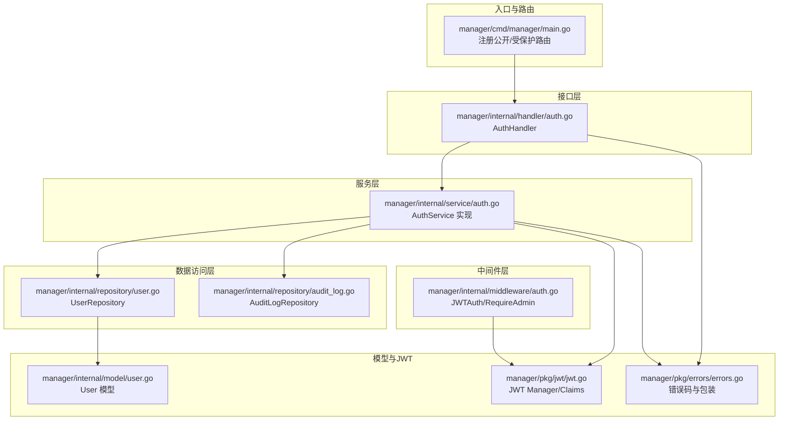
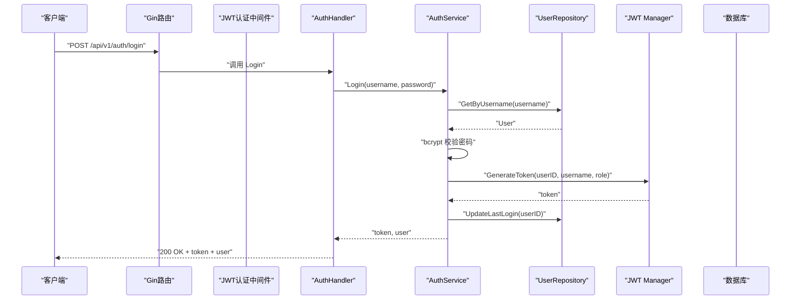
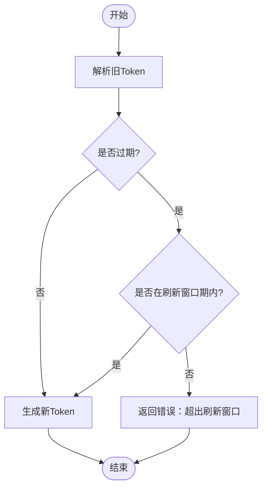
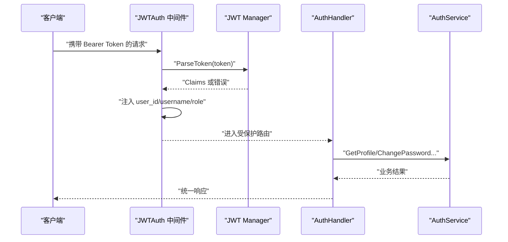
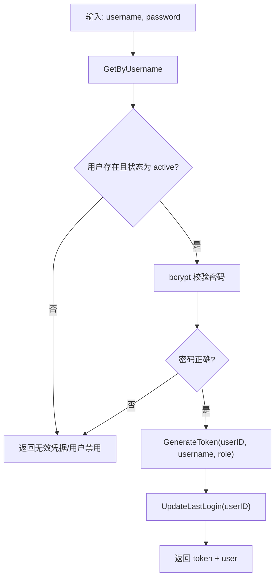
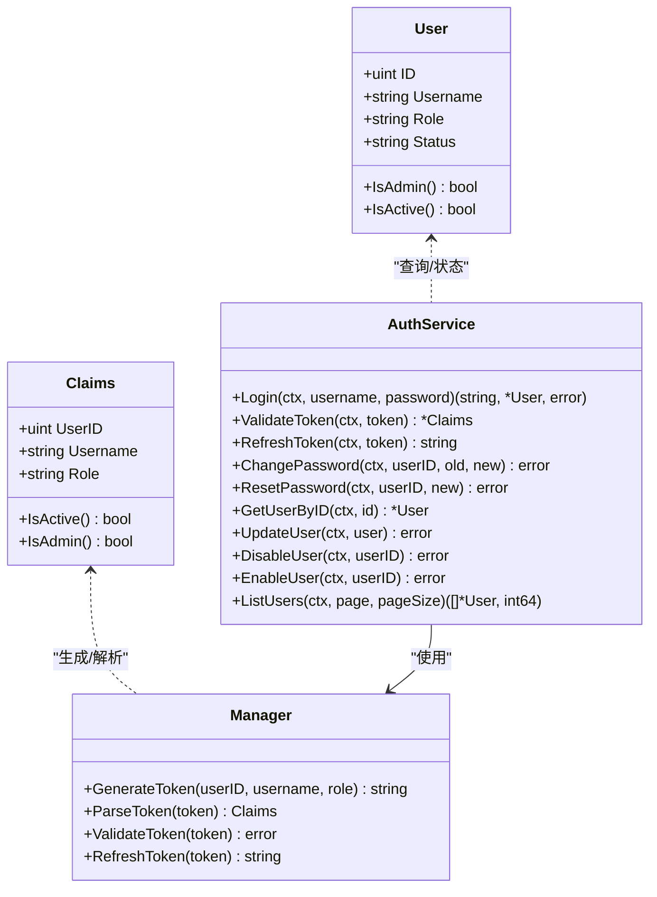
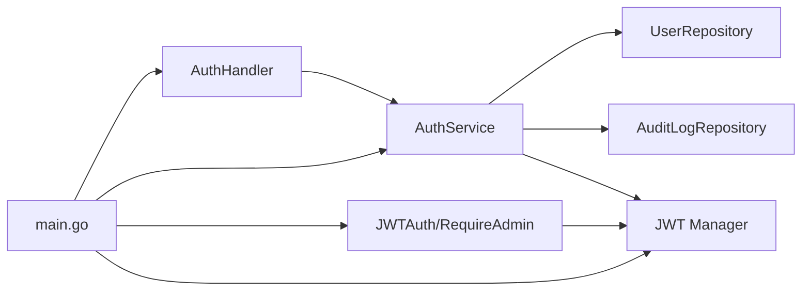

# 认证服务

<cite>
**本文引用的文件**
- [manager/internal/service/auth.go](file://manager/internal/service/auth.go)
- [manager/pkg/jwt/jwt.go](file://manager/pkg/jwt/jwt.go)
- [manager/internal/handler/auth.go](file://manager/internal/handler/auth.go)
- [manager/internal/middleware/auth.go](file://manager/internal/middleware/auth.go)
- [manager/internal/repository/user.go](file://manager/internal/repository/user.go)
- [manager/internal/model/user.go](file://manager/internal/model/user.go)
- [manager/cmd/manager/main.go](file://manager/cmd/manager/main.go)
- [manager/pkg/errors/errors.go](file://manager/pkg/errors/errors.go)
- [manager/internal/repository/audit_log.go](file://manager/internal/repository/audit_log.go)
</cite>

## 目录
1. [简介](#简介)
2. [项目结构](#项目结构)
3. [核心组件](#核心组件)
4. [架构总览](#架构总览)
5. [详细组件分析](#详细组件分析)
6. [依赖关系分析](#依赖关系分析)
7. [性能考量](#性能考量)
8. [故障排查指南](#故障排查指南)
9. [结论](#结论)
10. [附录](#附录)

## 简介
本文件聚焦于认证服务（AuthService）的实现，系统性阐述其在用户认证、JWT令牌生成与验证、RBAC权限控制与会话管理中的核心逻辑。文档覆盖 Login、GenerateToken、ValidateToken、CheckPermission（通过中间件实现）、Logout 等关键方法的执行流程，解释密码加密、令牌刷新与权限校验机制；说明服务如何与 JWT 库集成实现安全的令牌管理，并与用户存储交互完成身份验证。同时提供用户登录与权限验证的时序图、RBAC 模型关系图，以及安全最佳实践建议（令牌过期策略与防暴力破解措施）。

## 项目结构
认证相关代码分布在以下层次：
- Handler 层：对外暴露 REST API，负责请求绑定与响应封装
- Service 层：业务逻辑核心，负责认证、令牌生成与验证、权限检查、用户管理
- Middleware 层：JWT 认证与 RBAC 权限中间件
- Repository 层：用户与审计日志的数据访问
- Model 层：用户模型与字段约束
- JWT 包：令牌生成、解析、刷新与声明结构
- 错误与响应：统一错误码与响应格式
- 主程序：路由注册、中间件挂载、服务初始化

图表来源
- [manager/cmd/manager/main.go](file://manager/cmd/manager/main.go#L145-L210)
- [manager/internal/handler/auth.go](file://manager/internal/handler/auth.go#L1-L225)
- [manager/internal/middleware/auth.go](file://manager/internal/middleware/auth.go#L1-L98)
- [manager/internal/service/auth.go](file://manager/internal/service/auth.go#L1-L287)
- [manager/internal/repository/user.go](file://manager/internal/repository/user.go#L1-L186)
- [manager/internal/repository/audit_log.go](file://manager/internal/repository/audit_log.go#L1-L321)
- [manager/internal/model/user.go](file://manager/internal/model/user.go#L1-L43)
- [manager/pkg/jwt/jwt.go](file://manager/pkg/jwt/jwt.go#L1-L140)
- [manager/pkg/errors/errors.go](file://manager/pkg/errors/errors.go#L1-L171)

章节来源
- [manager/cmd/manager/main.go](file://manager/cmd/manager/main.go#L145-L210)

## 核心组件
- AuthService 接口与实现：提供注册、登录、登出、令牌刷新、密码修改/重置、用户查询与状态管理、令牌验证等能力
- JWT Manager：负责生成、解析、验证与刷新令牌，包含声明结构与有效期控制
- AuthHandler：REST API 处理器，绑定请求体、调用服务、返回统一响应
- 中间件 JWTAuth/RequireAdmin：从请求头提取 Bearer Token，解析并注入用户上下文，执行 RBAC 校验
- UserRepository/AuditLogRepository：用户与审计日志的数据访问
- User 模型：用户字段、默认值与角色/状态判断辅助方法
- 错误体系：统一错误码与 HTTP 映射，便于前端与客户端处理

章节来源
- [manager/internal/service/auth.go](file://manager/internal/service/auth.go#L15-L41)
- [manager/pkg/jwt/jwt.go](file://manager/pkg/jwt/jwt.go#L19-L140)
- [manager/internal/handler/auth.go](file://manager/internal/handler/auth.go#L1-L225)
- [manager/internal/middleware/auth.go](file://manager/internal/middleware/auth.go#L1-L98)
- [manager/internal/repository/user.go](file://manager/internal/repository/user.go#L1-L186)
- [manager/internal/model/user.go](file://manager/internal/model/user.go#L1-L43)
- [manager/pkg/errors/errors.go](file://manager/pkg/errors/errors.go#L1-L171)

## 架构总览
认证服务采用分层架构，Handler 负责接口契约，Service 负责业务规则，Repository 负责持久化，JWT 独立管理令牌生命周期，中间件贯穿请求链路完成认证与授权。

图表来源
- [manager/internal/handler/auth.go](file://manager/internal/handler/auth.go#L71-L96)
- [manager/internal/service/auth.go](file://manager/internal/service/auth.go#L116-L153)
- [manager/internal/repository/user.go](file://manager/internal/repository/user.go#L63-L81)
- [manager/pkg/jwt/jwt.go](file://manager/pkg/jwt/jwt.go#L43-L61)

章节来源
- [manager/internal/handler/auth.go](file://manager/internal/handler/auth.go#L71-L96)
- [manager/internal/service/auth.go](file://manager/internal/service/auth.go#L116-L153)
- [manager/pkg/jwt/jwt.go](file://manager/pkg/jwt/jwt.go#L43-L61)

## 详细组件分析

### AuthService 接口与实现
AuthService 定义了认证与用户管理的核心方法，实现类 authService 通过依赖注入 UserRepository、AuditLogRepository、JWT Manager 与日志器协作完成业务。

- 注册 Register：检查用户名/邮箱唯一性，bcrypt 加密密码，创建默认角色与状态的用户
- 登录 Login：按用户名查询用户，校验状态与密码，生成 JWT，更新最后登录时间
- 登出 Logout：记录日志（JWT 为无状态）
- 刷新令牌 RefreshToken：委托 JWT Manager 刷新
- 密码管理 ChangePassword/ResetPassword：bcrypt 加密并更新
- 用户查询与状态管理 GetUserByID/UpdateUser/DisableUser/EnableUser/ListUsers
- 令牌验证 ValidateToken：委托 JWT Manager 解析并返回 Claims

章节来源
- [manager/internal/service/auth.go](file://manager/internal/service/auth.go#L15-L41)
- [manager/internal/service/auth.go](file://manager/internal/service/auth.go#L66-L114)
- [manager/internal/service/auth.go](file://manager/internal/service/auth.go#L116-L153)
- [manager/internal/service/auth.go](file://manager/internal/service/auth.go#L155-L169)
- [manager/internal/service/auth.go](file://manager/internal/service/auth.go#L171-L204)
- [manager/internal/service/auth.go](file://manager/internal/service/auth.go#L206-L224)
- [manager/internal/service/auth.go](file://manager/internal/service/auth.go#L226-L277)
- [manager/internal/service/auth.go](file://manager/internal/service/auth.go#L279-L287)

### JWT 管理器与令牌生命周期
JWT Manager 提供 Claims 结构与 Manager 类，支持：
- 生成令牌：设置签发者、签发时间、过期时间、生效时间
- 解析令牌：验证签名算法与过期/生效状态，返回 Claims
- 验证令牌：仅返回错误
- 刷新令牌：解析旧令牌，若过期则尝试解析过期 Claims 并在刷新窗口内生成新令牌

图表来源
- [manager/pkg/jwt/jwt.go](file://manager/pkg/jwt/jwt.go#L96-L128)

章节来源
- [manager/pkg/jwt/jwt.go](file://manager/pkg/jwt/jwt.go#L19-L140)

### Handler 与中间件：认证与权限控制
- AuthHandler.Login/GetProfile/ChangePassword/Register 等方法负责请求绑定、调用服务与统一响应
- JWTAuth 中间件从 Authorization 头解析 Bearer Token，调用 JWT Manager 解析并注入用户上下文
- RequireAdmin 中间件基于上下文中的角色进行管理员权限校验

图表来源
- [manager/internal/middleware/auth.go](file://manager/internal/middleware/auth.go#L12-L49)
- [manager/internal/middleware/auth.go](file://manager/internal/middleware/auth.go#L52-L69)
- [manager/internal/handler/auth.go](file://manager/internal/handler/auth.go#L98-L122)
- [manager/internal/handler/auth.go](file://manager/internal/handler/auth.go#L124-L150)

章节来源
- [manager/internal/middleware/auth.go](file://manager/internal/middleware/auth.go#L1-L98)
- [manager/internal/handler/auth.go](file://manager/internal/handler/auth.go#L1-L225)

### 数据访问与模型
- UserRepository 提供用户增删改查、分页、状态/角色过滤、最后登录时间更新、密码更新等
- User 模型定义字段、默认值与 IsAdmin/IsActive 辅助方法
- AuditLogRepository 提供审计日志的增删查与统计

章节来源
- [manager/internal/repository/user.go](file://manager/internal/repository/user.go#L1-L186)
- [manager/internal/model/user.go](file://manager/internal/model/user.go#L1-L43)
- [manager/internal/repository/audit_log.go](file://manager/internal/repository/audit_log.go#L1-L321)

### 方法执行流程详解

#### Login（登录）
- 查询用户并校验状态
- bcrypt 对比密码
- 生成 JWT 并更新最后登录时间
- 返回 token 与用户信息

图表来源
- [manager/internal/service/auth.go](file://manager/internal/service/auth.go#L116-L153)
- [manager/internal/repository/user.go](file://manager/internal/repository/user.go#L63-L81)
- [manager/pkg/jwt/jwt.go](file://manager/pkg/jwt/jwt.go#L43-L61)

章节来源
- [manager/internal/service/auth.go](file://manager/internal/service/auth.go#L116-L153)

#### GenerateToken（生成令牌）
- 构造 Claims，设置 Issuer、IssuedAt、ExpiresAt、NotBefore
- 使用 HS256 签名并返回字符串

章节来源
- [manager/pkg/jwt/jwt.go](file://manager/pkg/jwt/jwt.go#L43-L61)

#### ValidateToken（验证令牌）
- ParseToken 解析并校验签名与有效期
- 返回 Claims 或错误

章节来源
- [manager/pkg/jwt/jwt.go](file://manager/pkg/jwt/jwt.go#L63-L88)
- [manager/internal/service/auth.go](file://manager/internal/service/auth.go#L279-L287)

#### CheckPermission（权限校验）
- 通过 RequireAdmin 中间件基于上下文中的 role 进行管理员权限校验
- 未授权或非管理员返回相应错误

章节来源
- [manager/internal/middleware/auth.go](file://manager/internal/middleware/auth.go#L52-L69)

#### Logout（登出）
- JWT 为无状态，此处仅记录日志

章节来源
- [manager/internal/service/auth.go](file://manager/internal/service/auth.go#L155-L160)

#### RefreshToken（刷新令牌）
- 若旧令牌未过期：直接解析并生成新令牌
- 若已过期：尝试解析过期 Claims 并在刷新窗口内生成新令牌

章节来源
- [manager/pkg/jwt/jwt.go](file://manager/pkg/jwt/jwt.go#L96-L128)
- [manager/internal/service/auth.go](file://manager/internal/service/auth.go#L162-L169)

### RBAC 模型关系图
- 角色：admin、user
- 权限：管理员专用路由需 RequireAdmin 中间件
- 用户状态：active/disabled 影响登录可用性

图表来源
- [manager/pkg/jwt/jwt.go](file://manager/pkg/jwt/jwt.go#L19-L140)
- [manager/internal/model/user.go](file://manager/internal/model/user.go#L1-L43)
- [manager/internal/service/auth.go](file://manager/internal/service/auth.go#L15-L41)

## 依赖关系分析
- Handler 依赖 Service；Service 依赖 Repository、JWT Manager 与日志器
- 中间件依赖 JWT Manager；路由在受保护组中挂载 JWTAuth 与审计中间件
- 主程序负责初始化配置、数据库、JWT、Repository、Service、Handler，并注册路由

图表来源
- [manager/cmd/manager/main.go](file://manager/cmd/manager/main.go#L145-L210)
- [manager/internal/handler/auth.go](file://manager/internal/handler/auth.go#L1-L225)
- [manager/internal/middleware/auth.go](file://manager/internal/middleware/auth.go#L1-L98)
- [manager/internal/service/auth.go](file://manager/internal/service/auth.go#L1-L287)
- [manager/pkg/jwt/jwt.go](file://manager/pkg/jwt/jwt.go#L1-L140)

章节来源
- [manager/cmd/manager/main.go](file://manager/cmd/manager/main.go#L145-L210)

## 性能考量
- 密码加密成本：bcrypt 默认成本在安全性与性能间平衡，可根据硬件能力调整
- 数据库索引：用户名与邮箱唯一索引有助于快速去重与登录查询
- 令牌过期：合理设置过期时间，避免频繁刷新导致的额外计算
- 中间件链路：JWT 解析与审计写入应尽量轻量，避免阻塞请求
- 分页查询：用户列表与审计日志均采用分页，降低单次查询负载

[本节为通用指导，不直接分析具体文件]

## 故障排查指南
- 登录失败
  - 检查用户名是否存在与状态是否为 active
  - 确认密码与加密存储一致
  - 查看服务日志与错误码映射
- Token 无效/过期
  - 确认 Authorization 头格式为 Bearer
  - 检查 JWT 过期时间与刷新窗口
  - 使用 ValidateToken 接口验证
- 权限拒绝
  - 确认请求已通过 JWTAuth 中间件
  - 检查 RequireAdmin 中间件是否正确挂载
  - 核对用户角色是否为 admin
- 数据库异常
  - 检查唯一约束冲突（用户名/邮箱）
  - 核对迁移是否成功

章节来源
- [manager/internal/service/auth.go](file://manager/internal/service/auth.go#L116-L153)
- [manager/internal/middleware/auth.go](file://manager/internal/middleware/auth.go#L12-L49)
- [manager/pkg/jwt/jwt.go](file://manager/pkg/jwt/jwt.go#L63-L88)
- [manager/pkg/errors/errors.go](file://manager/pkg/errors/errors.go#L133-L171)

## 结论
AuthService 以清晰的分层设计实现了完整的认证与授权闭环：Handler 负责接口契约，Service 负责业务规则与安全策略，JWT 管理器提供可靠的令牌生命周期管理，中间件确保请求在进入业务前完成认证与权限校验。配合用户与审计日志的数据访问层，形成可扩展、可观测、可维护的认证体系。

[本节为总结性内容，不直接分析具体文件]

## 附录

### 安全最佳实践
- 令牌过期策略
  - 设置合理的过期时间，短令牌+刷新窗口组合提升安全性
  - 刷新窗口限制（如 7 天），超窗拒绝刷新
- 防暴力破解
  - 登录失败计数与临时封禁（可在 Handler/中间件层引入速率限制）
  - 强制密码复杂度与定期更换策略
- 传输安全
  - 仅在 HTTPS 下传输 Token
  - 严格 CORS 配置，避免跨域泄露
- 最小权限原则
  - 仅授予必要角色与路由访问
  - 审计日志记录关键操作与失败事件

[本节为通用指导，不直接分析具体文件]