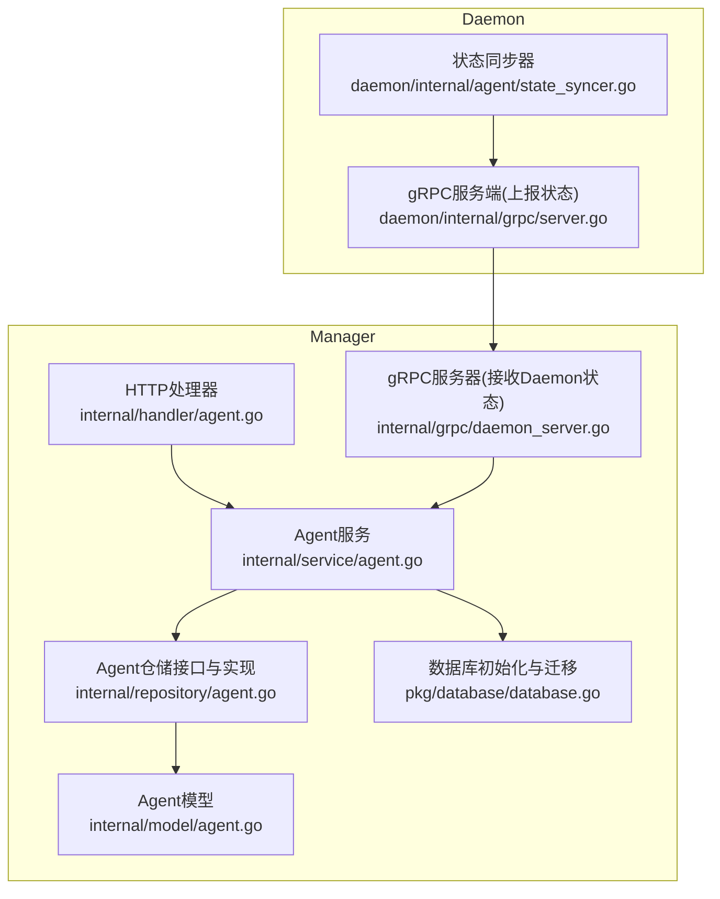
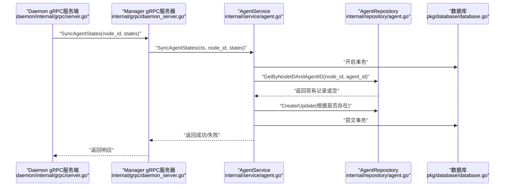
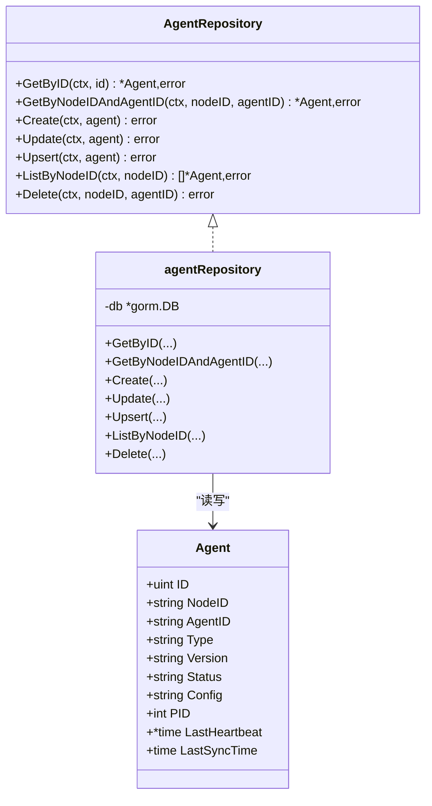
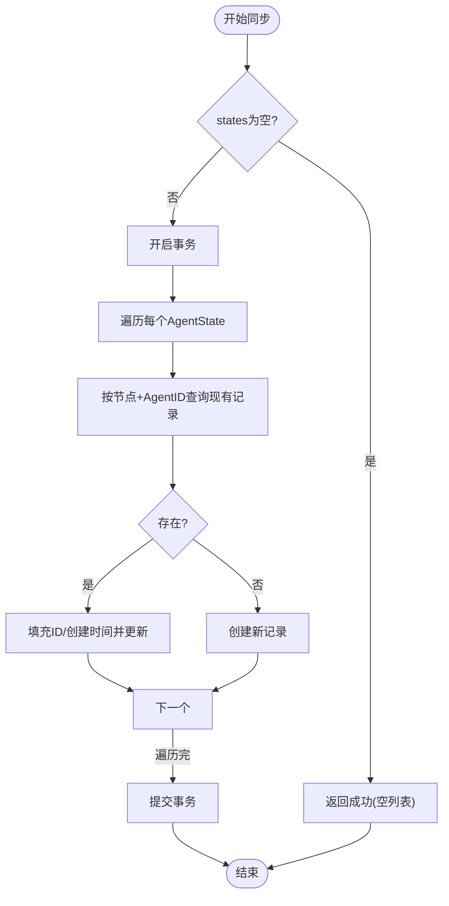
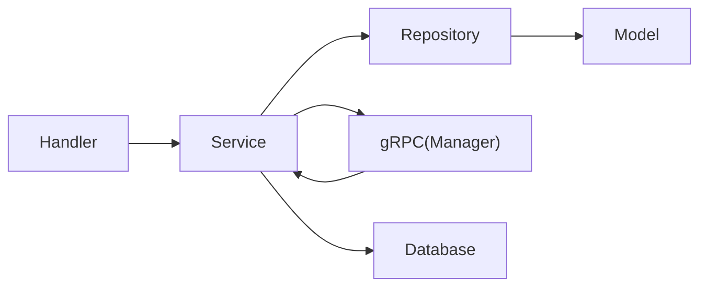

# Agent数据访问

<cite>
**本文引用的文件**
- [manager/internal/repository/agent.go](file://manager/internal/repository/agent.go)
- [manager/internal/model/agent.go](file://manager/internal/model/agent.go)
- [manager/internal/service/agent.go](file://manager/internal/service/agent.go)
- [manager/internal/handler/agent.go](file://manager/internal/handler/agent.go)
- [manager/internal/grpc/daemon_server.go](file://manager/internal/grpc/daemon_server.go)
- [manager/pkg/database/database.go](file://manager/pkg/database/database.go)
- [manager/internal/config/config.go](file://manager/internal/config/config.go)
- [daemon/internal/grpc/server.go](file://daemon/internal/grpc/server.go)
- [daemon/internal/agent/state_syncer.go](file://daemon/internal/agent/state_syncer.go)
</cite>

## 目录
1. [简介](#简介)
2. [项目结构](#项目结构)
3. [核心组件](#核心组件)
4. [架构总览](#架构总览)
5. [组件详解](#组件详解)
6. [依赖关系分析](#依赖关系分析)
7. [性能考量](#性能考量)
8. [故障排查指南](#故障排查指南)
9. [结论](#结论)

## 简介
本文件聚焦于Manager模块的Agent数据访问层，系统化阐述AgentRepository接口的职责边界与实现细节，覆盖Agent注册、状态同步、配置管理与生命周期管理的关键流程；重点解析GetByNodeIDAndAgentID、Upsert、ListByNodeID等核心方法，并结合心跳与状态同步机制给出性能优化建议与最佳实践。

## 项目结构
Manager模块围绕“接口-实现-服务-处理器”的分层组织，Agent数据访问层位于repository层，向上被service层调用，向下通过GORM访问MySQL；Daemon侧通过gRPC向Manager上报Agent状态，Manager再由service层落库。

图表来源
- [manager/internal/handler/agent.go](file://manager/internal/handler/agent.go#L1-L161)
- [manager/internal/service/agent.go](file://manager/internal/service/agent.go#L1-L298)
- [manager/internal/repository/agent.go](file://manager/internal/repository/agent.go#L1-L138)
- [manager/internal/model/agent.go](file://manager/internal/model/agent.go#L1-L53)
- [manager/internal/grpc/daemon_server.go](file://manager/internal/grpc/daemon_server.go#L1-L70)
- [manager/pkg/database/database.go](file://manager/pkg/database/database.go#L1-L281)
- [daemon/internal/grpc/server.go](file://daemon/internal/grpc/server.go#L1-L255)
- [daemon/internal/agent/state_syncer.go](file://daemon/internal/agent/state_syncer.go#L62-L109)

章节来源
- [manager/internal/handler/agent.go](file://manager/internal/handler/agent.go#L1-L161)
- [manager/internal/service/agent.go](file://manager/internal/service/agent.go#L1-L298)
- [manager/internal/repository/agent.go](file://manager/internal/repository/agent.go#L1-L138)
- [manager/internal/model/agent.go](file://manager/internal/model/agent.go#L1-L53)
- [manager/internal/grpc/daemon_server.go](file://manager/internal/grpc/daemon_server.go#L1-L70)
- [manager/pkg/database/database.go](file://manager/pkg/database/database.go#L1-L281)
- [daemon/internal/grpc/server.go](file://daemon/internal/grpc/server.go#L1-L255)
- [daemon/internal/agent/state_syncer.go](file://daemon/internal/agent/state_syncer.go#L62-L109)

## 核心组件
- AgentRepository接口：定义Agent的增删改查与Upsert能力，屏蔽具体存储实现。
- agentRepository实现：基于GORM封装CRUD与查询，提供上下文透传、错误包装与空记录处理。
- AgentService：面向业务的服务层，负责状态同步事务、节点校验、与Daemon gRPC交互。
- Agent模型：映射agents表，包含状态、版本、配置、心跳时间等字段。
- 数据库初始化与迁移：统一连接池、日志级别、外键约束策略与自动迁移。
- gRPC集成：Manager侧接收Daemon上报状态，调用AgentService落库；Daemon侧定时收集状态并上报。

章节来源
- [manager/internal/repository/agent.go](file://manager/internal/repository/agent.go#L1-L138)
- [manager/internal/model/agent.go](file://manager/internal/model/agent.go#L1-L53)
- [manager/internal/service/agent.go](file://manager/internal/service/agent.go#L1-L298)
- [manager/pkg/database/database.go](file://manager/pkg/database/database.go#L1-L281)
- [manager/internal/grpc/daemon_server.go](file://manager/internal/grpc/daemon_server.go#L1-L70)
- [daemon/internal/grpc/server.go](file://daemon/internal/grpc/server.go#L1-L255)

## 架构总览
Manager通过gRPC接收Daemon上报的Agent状态，AgentService以事务方式批量写入数据库；AgentRepository提供按节点+AgentID的唯一性查询与Upsert能力，保障幂等写入；HTTP层对外暴露Agent列表与操作接口，内部委托AgentService。

图表来源
- [daemon/internal/grpc/server.go](file://daemon/internal/grpc/server.go#L172-L211)
- [manager/internal/grpc/daemon_server.go](file://manager/internal/grpc/daemon_server.go#L32-L69)
- [manager/internal/service/agent.go](file://manager/internal/service/agent.go#L48-L139)
- [manager/internal/repository/agent.go](file://manager/internal/repository/agent.go#L60-L110)
- [manager/pkg/database/database.go](file://manager/pkg/database/database.go#L277-L281)

## 组件详解

### AgentRepository接口与实现
- 接口职责
  - GetByID：按主键查询Agent，不存在返回空。
  - GetByNodeIDAndAgentID：按节点ID与AgentID唯一查询，不存在返回空。
  - Create/Update/Delete：标准CRUD。
  - Upsert：按节点+AgentID存在性判断，不存在则创建，存在则更新（保留ID与创建时间）。
  - ListByNodeID：按节点ID列出所有Agent。
- 实现要点
  - 使用GORM First/Find/Save/Delete，上下文透传。
  - 对gorm.ErrRecordNotFound进行显式空返回处理。
  - Upsert通过先查后判决定Create或Update，保证幂等。
  - 查询均带Where条件，避免全表扫描。

图表来源
- [manager/internal/repository/agent.go](file://manager/internal/repository/agent.go#L1-L138)
- [manager/internal/model/agent.go](file://manager/internal/model/agent.go#L1-L53)

章节来源
- [manager/internal/repository/agent.go](file://manager/internal/repository/agent.go#L1-L138)
- [manager/internal/model/agent.go](file://manager/internal/model/agent.go#L1-L53)

### Agent模型与索引
- 字段说明
  - NodeID、AgentID：联合索引，保证按节点+AgentID唯一性查询高效。
  - Status：带索引，便于按状态筛选。
  - Config：文本字段，保存Agent配置（JSON）。
  - LastHeartbeat、LastSyncTime：用于心跳与同步时间跟踪。
- 生命周期相关
  - PID为0表示未运行，IsRunning通过Status判断。
  - LastSyncTime用于记录最近一次同步时间，便于后续清理与告警。

章节来源
- [manager/internal/model/agent.go](file://manager/internal/model/agent.go#L1-L53)

### Agent状态同步与心跳维护
- 状态同步入口
  - Daemon gRPC服务端接收状态列表，当前实现记录日志（Task 3.4中完善）。
  - Manager gRPC服务器接收Daemon上报，调用AgentService进行事务化落库。
- AgentService同步流程
  - 事务包裹：对每个Agent状态转换为业务对象，设置LastSyncTime与LastHeartbeat。
  - 幂等写入：先按节点+AgentID查询，存在则更新，不存在则创建；Type保留已有值。
  - 统计与日志：记录成功/失败数量，便于可观测性。
- 心跳维护
  - LastHeartbeat来自Daemon上报的时间戳转换。
  - Manager侧可基于LastSyncTime与LastHeartbeat做离线检测与异常告警（建议在上层策略中实现）。

图表来源
- [daemon/internal/grpc/server.go](file://daemon/internal/grpc/server.go#L172-L211)
- [manager/internal/grpc/daemon_server.go](file://manager/internal/grpc/daemon_server.go#L32-L69)
- [manager/internal/service/agent.go](file://manager/internal/service/agent.go#L48-L139)
- [manager/internal/repository/agent.go](file://manager/internal/repository/agent.go#L60-L110)

章节来源
- [daemon/internal/grpc/server.go](file://daemon/internal/grpc/server.go#L172-L211)
- [manager/internal/grpc/daemon_server.go](file://manager/internal/grpc/daemon_server.go#L32-L69)
- [manager/internal/service/agent.go](file://manager/internal/service/agent.go#L48-L139)
- [manager/internal/repository/agent.go](file://manager/internal/repository/agent.go#L60-L110)

### 核心方法实现剖析

#### GetByNodeIDAndAgentID
- 作用：按节点ID与AgentID唯一查询Agent。
- 实现：构造Where条件，First查询；gorm.ErrRecordNotFound转为空。
- 复杂度：依赖联合索引(idx_node_agent)，查询近似O(1)。
- 场景：Upsert前查重、OperateAgent前校验、ListAgents前定位。

章节来源
- [manager/internal/repository/agent.go](file://manager/internal/repository/agent.go#L60-L75)

#### Upsert
- 作用：创建或更新Agent，保证幂等。
- 实现：先GetByNodeIDAndAgentID，不存在Create，存在Update（保留ID与创建时间）。
- 复杂度：两次查询/写入，受索引影响，整体高效。
- 场景：状态同步、注册新Agent时的幂等写入。

章节来源
- [manager/internal/repository/agent.go](file://manager/internal/repository/agent.go#L93-L110)

#### ListByNodeID
- 作用：按节点ID列出所有Agent。
- 实现：Where条件过滤，Find返回切片。
- 复杂度：单表扫描，建议配合节点维度分页或缓存热点节点。

章节来源
- [manager/internal/repository/agent.go](file://manager/internal/repository/agent.go#L112-L124)

### 配置管理与Agent注册
- 配置字段
  - Model中Config为文本字段，保存JSON配置；服务层不直接解析，仅持久化。
- 注册流程
  - Daemon侧通过gRPC上报状态，Manager侧AgentService在事务中Upsert写入。
  - 若首次上报，Type可由其他来源注入（当前同步逻辑保留Type），后续状态更新不再覆盖Type。
- 建议
  - 在注册阶段明确Type与初始配置，避免后续状态同步覆盖关键元信息。
  - 对Config进行Schema校验与审计，防止非法配置入库。

章节来源
- [manager/internal/model/agent.go](file://manager/internal/model/agent.go#L1-L53)
- [manager/internal/service/agent.go](file://manager/internal/service/agent.go#L48-L139)

### 生命周期管理
- 注册：Daemon上报状态即触发注册（Upsert）。
- 运行态：Status字段承载运行状态；IsRunning通过Status判断。
- 停止/重启：通过HTTP接口调用AgentService.OperateAgent，内部构建Daemon gRPC地址并调用。
- 清理：Delete按节点+AgentID删除；可结合LastSyncTime做离线清理策略。

章节来源
- [manager/internal/model/agent.go](file://manager/internal/model/agent.go#L49-L53)
- [manager/internal/service/agent.go](file://manager/internal/service/agent.go#L175-L252)
- [manager/internal/handler/agent.go](file://manager/internal/handler/agent.go#L62-L103)

## 依赖关系分析
- 组件耦合
  - Handler依赖AgentService；Service依赖AgentRepository与NodeRepository；Repository依赖GORM与Model。
  - gRPC层解耦Daemon与Manager，Manager侧通过AgentService桥接仓储。
- 外部依赖
  - MySQL：GORM驱动，连接池与迁移由database包统一管理。
  - gRPC：Proto定义与服务端/客户端生成，Manager侧DaemonServer接收状态，Daemon侧Server提供上报接口。
- 潜在风险
  - Upsert依赖联合索引，若索引缺失可能导致锁竞争与慢查询。
  - 事务中循环处理大量状态，建议分批提交或异步化。

图表来源
- [manager/internal/handler/agent.go](file://manager/internal/handler/agent.go#L1-L161)
- [manager/internal/service/agent.go](file://manager/internal/service/agent.go#L1-L298)
- [manager/internal/repository/agent.go](file://manager/internal/repository/agent.go#L1-L138)
- [manager/internal/model/agent.go](file://manager/internal/model/agent.go#L1-L53)
- [manager/internal/grpc/daemon_server.go](file://manager/internal/grpc/daemon_server.go#L1-L70)
- [manager/pkg/database/database.go](file://manager/pkg/database/database.go#L1-L281)

章节来源
- [manager/internal/handler/agent.go](file://manager/internal/handler/agent.go#L1-L161)
- [manager/internal/service/agent.go](file://manager/internal/service/agent.go#L1-L298)
- [manager/internal/repository/agent.go](file://manager/internal/repository/agent.go#L1-L138)
- [manager/internal/model/agent.go](file://manager/internal/model/agent.go#L1-L53)
- [manager/internal/grpc/daemon_server.go](file://manager/internal/grpc/daemon_server.go#L1-L70)
- [manager/pkg/database/database.go](file://manager/pkg/database/database.go#L1-L281)

## 性能考量
- 索引与查询
  - 联合索引(idx_node_agent)确保GetByNodeIDAndAgentID高效；Status字段索引利于状态筛选。
  - ListByNodeID建议分页或按节点维度缓存，避免全表扫描。
- 事务与批量
  - SyncAgentStates在事务中逐条处理，建议按批次拆分，减少锁持有时间。
  - 大量状态同步场景可考虑异步队列+批量写入。
- 连接池与日志
  - database.Init设置MaxOpenConns/MaxIdleConns/ConnMaxLifetime，避免连接抖动。
  - 日志级别按需调整，避免高并发下I/O瓶颈。
- 心跳与清理
  - 基于LastSyncTime与LastHeartbeat定期清理长时间无心跳的Agent记录，降低表膨胀。
  - 对热点节点建立本地缓存，减少频繁查询。

章节来源
- [manager/internal/model/agent.go](file://manager/internal/model/agent.go#L1-L53)
- [manager/internal/service/agent.go](file://manager/internal/service/agent.go#L48-L139)
- [manager/pkg/database/database.go](file://manager/pkg/database/database.go#L21-L80)

## 故障排查指南
- 常见错误与定位
  - 记录不存在：GetByID/GetByNodeIDAndAgentID返回空，确认节点与AgentID是否正确。
  - 数据库错误：Create/Update/Delete返回包装错误，检查DSN、权限与表结构。
  - 事务失败：SyncAgentStates在事务中回滚，查看日志中的失败计数与具体AgentID。
- 日志与可观测性
  - AgentService在同步过程中记录成功/失败计数，便于快速定位异常批次。
  - Handler层对HTTP请求参数进行校验，返回标准化错误码。
- 配置核对
  - database配置项（DSN、连接池、日志级别）需与环境一致。
  - gRPC TLS配置需与Daemon侧一致，避免连接失败。

章节来源
- [manager/internal/service/agent.go](file://manager/internal/service/agent.go#L48-L139)
- [manager/internal/handler/agent.go](file://manager/internal/handler/agent.go#L1-L161)
- [manager/internal/config/config.go](file://manager/internal/config/config.go#L1-L262)
- [manager/pkg/database/database.go](file://manager/pkg/database/database.go#L1-L281)

## 结论
Agent数据访问层以AgentRepository为核心，通过清晰的接口与幂等Upsert，支撑Manager对Daemon上报状态的可靠落库；结合事务化同步与索引优化，可在高并发场景下保持稳定性能。建议在状态同步中引入分批与异步化策略，并基于LastSyncTime与LastHeartbeat完善离线检测与清理机制，持续提升系统的可观测性与可维护性。