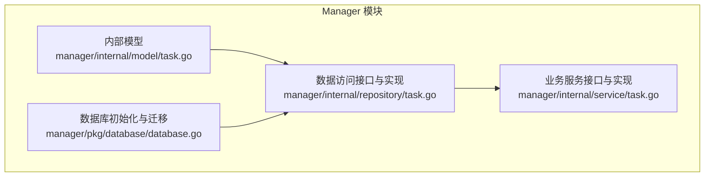
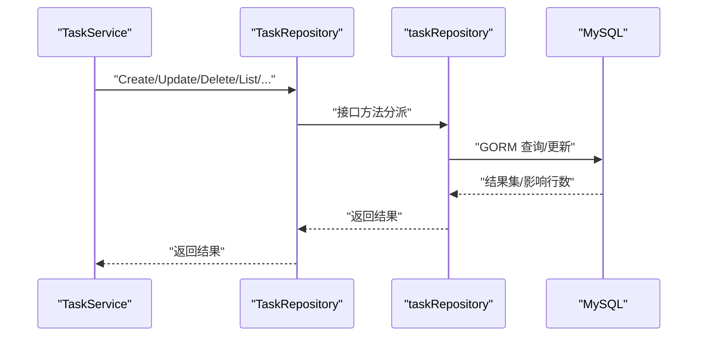
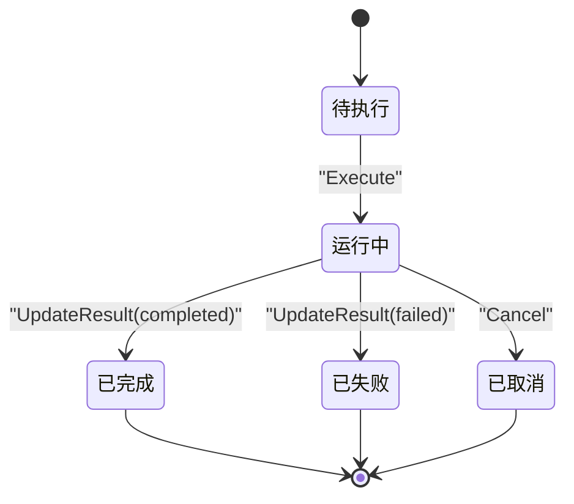
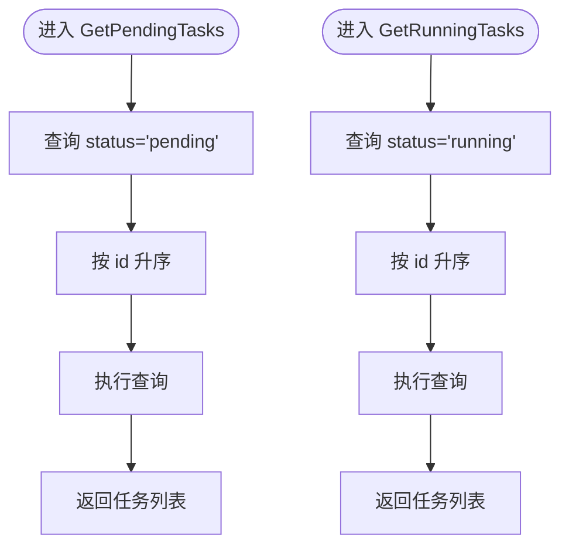
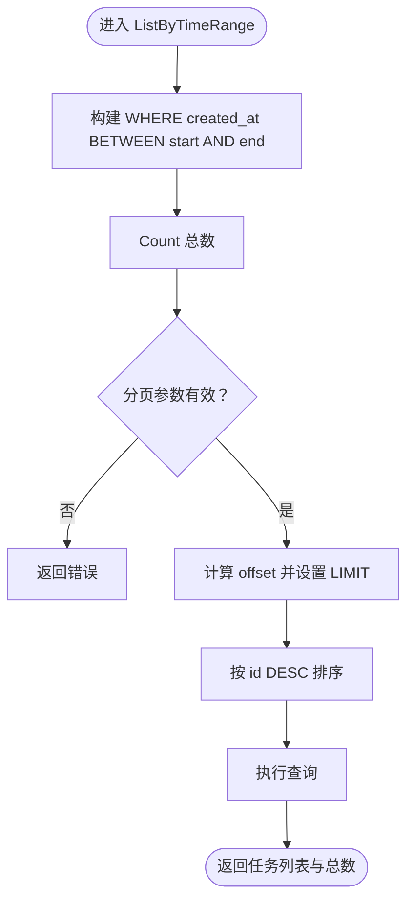
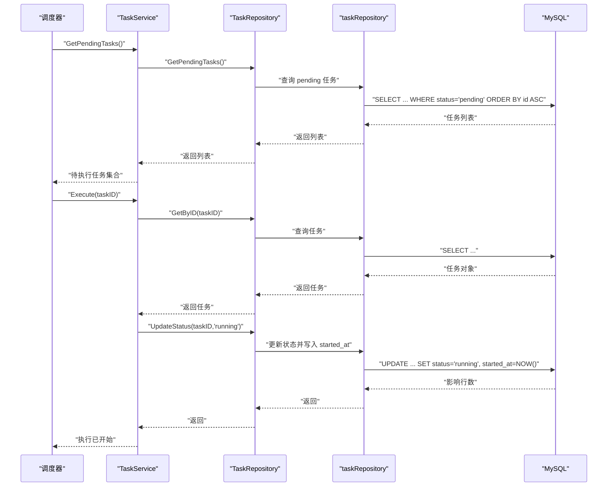
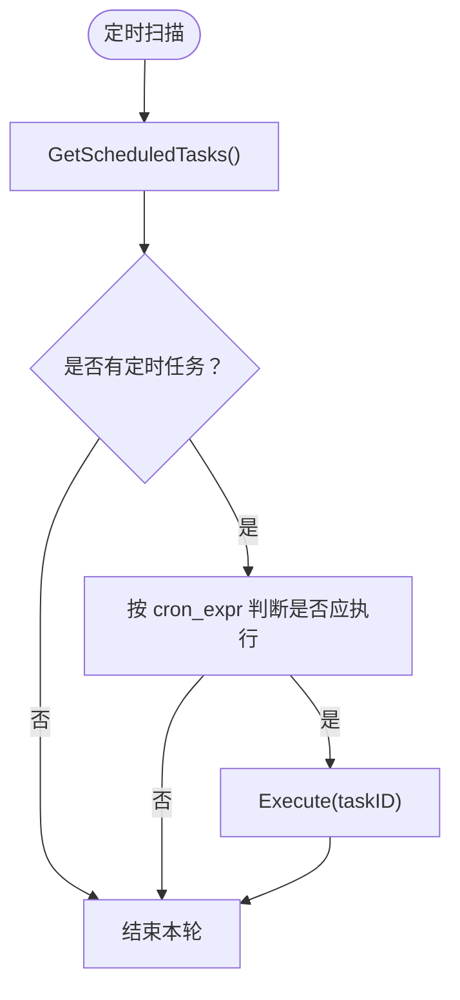
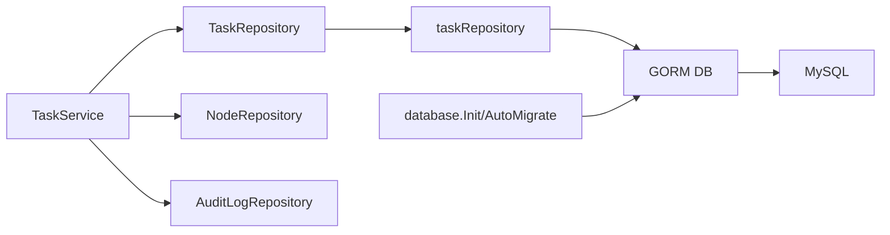

# 任务数据访问

<cite>
**本文引用的文件**
- [manager/internal/repository/task.go](file://manager/internal/repository/task.go)
- [manager/internal/model/task.go](file://manager/internal/model/task.go)
- [manager/internal/service/task.go](file://manager/internal/service/task.go)
- [manager/pkg/database/database.go](file://manager/pkg/database/database.go)
- [docs/设计文档_03_Manager模块.md](file://docs/设计文档_03_Manager模块.md)
</cite>

## 目录
1. [简介](#简介)
2. [项目结构](#项目结构)
3. [核心组件](#核心组件)
4. [架构总览](#架构总览)
5. [详细组件分析](#详细组件分析)
6. [依赖关系分析](#依赖关系分析)
7. [性能考量](#性能考量)
8. [故障排查指南](#故障排查指南)
9. [结论](#结论)

## 简介
本文件聚焦于 Manager 模块的任务数据访问层，系统性阐述 TaskRepository 接口的职责边界与实现细节，重点解析 GetPendingTasks、GetRunningTasks、ListByTimeRange 等核心方法的工作流，并结合服务层 TaskService 的编排逻辑，说明任务调度、执行状态跟踪与结果存储的完整链路。同时，文档给出任务状态机管理、定时任务处理思路与性能优化建议，帮助读者快速理解并高效扩展该子系统。

## 项目结构
围绕任务数据访问层，Manager 模块采用经典的分层架构：
- 数据模型层：定义任务实体及序列化规则
- 数据访问层：抽象 TaskRepository 接口与具体实现
- 业务服务层：封装任务生命周期与状态流转
- 数据库层：统一初始化、连接池与迁移

图表来源
- [manager/internal/model/task.go](file://manager/internal/model/task.go#L1-L75)
- [manager/internal/repository/task.go](file://manager/internal/repository/task.go#L1-L43)
- [manager/internal/service/task.go](file://manager/internal/service/task.go#L1-L43)
- [manager/pkg/database/database.go](file://manager/pkg/database/database.go#L1-L80)

章节来源
- [manager/internal/model/task.go](file://manager/internal/model/task.go#L1-L75)
- [manager/internal/repository/task.go](file://manager/internal/repository/task.go#L1-L43)
- [manager/internal/service/task.go](file://manager/internal/service/task.go#L1-L43)
- [manager/pkg/database/database.go](file://manager/pkg/database/database.go#L1-L80)

## 核心组件
- TaskRepository 接口：定义任务 CRUD、筛选、状态更新与统计等能力，是数据访问层的唯一入口。
- taskRepository 实现：基于 GORM 对 MySQL 执行具体查询与更新。
- TaskService：对 TaskRepository 的组合封装，负责业务校验、状态机控制与审计日志触发。
- Task 模型：定义任务字段、状态枚举与 JSON 字段序列化。
- 数据库初始化：统一连接、连接池、日志级别与自动迁移。

章节来源
- [manager/internal/repository/task.go](file://manager/internal/repository/task.go#L11-L43)
- [manager/internal/service/task.go](file://manager/internal/service/task.go#L13-L43)
- [manager/internal/model/task.go](file://manager/internal/model/task.go#L11-L35)
- [manager/pkg/database/database.go](file://manager/pkg/database/database.go#L21-L80)

## 架构总览
下图展示从服务层到数据访问层再到数据库的整体调用路径与职责分工。

图表来源
- [manager/internal/service/task.go](file://manager/internal/service/task.go#L68-L90)
- [manager/internal/repository/task.go](file://manager/internal/repository/task.go#L55-L78)
- [manager/pkg/database/database.go](file://manager/pkg/database/database.go#L21-L80)

## 详细组件分析

### TaskRepository 接口与职责
- 任务生命周期：Create、GetByID、Update、Delete（软删）、List 系列（分页与筛选）。
- 状态管理：UpdateStatus、UpdateResult；统计：CountByStatus。
- 调度相关：GetPendingTasks、GetRunningTasks、GetScheduledTasks。
- 时间维度：ListByTimeRange。

这些方法覆盖了任务的创建、查询、状态更新与结果记录，支撑调度器按状态拉取待执行任务，以及按时间窗口进行归档与报表统计。

章节来源
- [manager/internal/repository/task.go](file://manager/internal/repository/task.go#L11-L43)

### taskRepository 实现要点
- Create/Update/Delete：直接委托 GORM 完成持久化。
- List 系列：先 Count 再 Offset/Limit 分页查询，保证总数与数据一致性。
- UpdateStatus：根据状态变更自动维护 started_at/finished_at 时间戳。
- UpdateResult：原子更新结果与状态，并设置完成时间。
- GetPendingTasks/GetRunningTasks：按状态升序拉取，便于调度器 FIFO 执行。
- CountByStatus：按状态分组统计，用于仪表盘与监控。
- GetScheduledTasks：按 schedule 字段非空筛选定时任务。

章节来源
- [manager/internal/repository/task.go](file://manager/internal/repository/task.go#L55-L291)

### TaskService 与状态机
- Create：校验目标节点存在性后落库。
- Execute：仅允许从非 running 状态切换至 running，并记录开始时间。
- Cancel：仅允许 pending/running 状态取消，写入取消结果与状态。
- UpdateStatus/UpdateResult：委托仓库更新状态与结果。
- GetPendingTasks/GetRunningTasks/GetStatistics：委托仓库查询并返回。

状态机关键点：
- running 状态下禁止再次执行，避免并发冲突。
- completed/failed 状态由 UpdateResult 统一收敛，确保 finished_at 一致。
- cancelled 作为结果状态写入，与 running/pending 等状态区分。

章节来源
- [manager/internal/service/task.go](file://manager/internal/service/task.go#L68-L243)

### 任务状态机管理

图表来源
- [manager/internal/service/task.go](file://manager/internal/service/task.go#L169-L243)
- [manager/internal/repository/task.go](file://manager/internal/repository/task.go#L194-L230)

### GetPendingTasks 与 GetRunningTasks
- GetPendingTasks：按 status=pending 升序返回，便于 FIFO 调度。
- GetRunningTasks：按 status=running 升序返回，便于监控与重试策略。

图表来源
- [manager/internal/repository/task.go](file://manager/internal/repository/task.go#L232-L254)

章节来源
- [manager/internal/repository/task.go](file://manager/internal/repository/task.go#L232-L254)
- [manager/internal/service/task.go](file://manager/internal/service/task.go#L245-L263)

### ListByTimeRange
- 核心逻辑：按 created_at 范围查询，先 Count 再分页查询，保证总数与数据一致性。
- 适用场景：审计、报表、归档清理等。

图表来源
- [manager/internal/repository/task.go](file://manager/internal/repository/task.go#L170-L192)

章节来源
- [manager/internal/repository/task.go](file://manager/internal/repository/task.go#L170-L192)

### 任务调度、执行状态跟踪与结果存储
- 调度：调度器周期性拉取 GetPendingTasks，按 FIFO 顺序下发给 Agent 执行。
- 执行：TaskService.Execute 将任务置为 running 并记录 started_at；Agent 执行完成后，Manager 侧通过 UpdateResult 写入结果与状态，并记录 finished_at。
- 状态跟踪：GetRunningTasks 用于监控执行中任务；CountByStatus 用于统计各状态分布。
- 结果存储：UpdateResult 原子更新 result/status/finished_at，确保最终一致性。

图表来源
- [manager/internal/service/task.go](file://manager/internal/service/task.go#L169-L197)
- [manager/internal/repository/task.go](file://manager/internal/repository/task.go#L194-L215)

章节来源
- [manager/internal/service/task.go](file://manager/internal/service/task.go#L169-L197)
- [manager/internal/repository/task.go](file://manager/internal/repository/task.go#L194-L215)

### 定时任务处理
- 模型层面：设计文档中定义了 cron_expr 字段，用于标识定时任务。
- 数据访问：GetScheduledTasks 通过 schedule 非空条件筛选定时任务。
- 执行策略：调度器可定期扫描 GetScheduledTasks，结合 cron_expr 触发执行；或在 Agent 侧按 cron 表达式本地调度。

图表来源
- [manager/internal/repository/task.go](file://manager/internal/repository/task.go#L282-L291)
- [docs/设计文档_03_Manager模块.md](file://docs/设计文档_03_Manager模块.md#L523-L546)

章节来源
- [manager/internal/repository/task.go](file://manager/internal/repository/task.go#L282-L291)
- [docs/设计文档_03_Manager模块.md](file://docs/设计文档_03_Manager模块.md#L523-L546)

## 依赖关系分析
- TaskService 依赖 TaskRepository、NodeRepository、AuditLogRepository 与日志组件。
- taskRepository 依赖 GORM DB 实例。
- 数据库初始化负责连接池、日志级别与自动迁移。

图表来源
- [manager/internal/service/task.go](file://manager/internal/service/task.go#L45-L66)
- [manager/internal/repository/task.go](file://manager/internal/repository/task.go#L45-L54)
- [manager/pkg/database/database.go](file://manager/pkg/database/database.go#L21-L80)

章节来源
- [manager/internal/service/task.go](file://manager/internal/service/task.go#L45-L66)
- [manager/internal/repository/task.go](file://manager/internal/repository/task.go#L45-L54)
- [manager/pkg/database/database.go](file://manager/pkg/database/database.go#L21-L80)

## 性能考量
- 分页与排序
  - List 系列均采用先 Count 再分页查询，避免游标/跳页复杂度；排序按 id DESC，有利于热点数据的稳定读取。
  - 建议在 created_at、status 等高频过滤字段建立合适索引，以降低大表扫描成本。
- 状态更新原子性
  - UpdateStatus/UpdateResult 使用 Updates 原子更新，减少往返；注意避免在高并发下频繁写入同一任务导致锁竞争。
- 连接池与日志
  - database.Init 提供 MaxIdleConns/MaxOpenConns/ConnMaxLifetime 参数，建议根据 QPS 与延迟要求调优。
  - 日志级别可按环境调整，生产环境建议 Warn/Info，避免过多慢查询日志。
- 统计与报表
  - CountByStatus 使用 GROUP/SELECT，建议在高并发统计场景引入缓存或异步聚合，降低主库压力。

章节来源
- [manager/internal/repository/task.go](file://manager/internal/repository/task.go#L80-L99)
- [manager/internal/repository/task.go](file://manager/internal/repository/task.go#L194-L230)
- [manager/pkg/database/database.go](file://manager/pkg/database/database.go#L21-L80)

## 故障排查指南
- 常见错误定位
  - 任务不存在：GetByID 返回记录缺失时，服务层包装为“任务不存在”错误。
  - 正在执行：Execute 时若状态已是 running，拒绝重复执行。
  - 删除限制：Delete 前检查状态，running 状态任务不可删除。
  - 取消限制：仅 pending/running 可取消，其他状态返回参数非法。
- 日志与审计
  - 服务层在关键路径记录日志，便于定位异常；审计日志仓库在构造时注入，可用于后续审计。
- 数据库问题
  - 连接失败/超时：检查 DSN、网络与连接池参数；database.Init 提供 Ping 校验。
  - 迁移失败：AutoMigrate 包含约束兼容处理，必要时查看日志提示并重试。

章节来源
- [manager/internal/service/task.go](file://manager/internal/service/task.go#L92-L137)
- [manager/internal/service/task.go](file://manager/internal/service/task.go#L169-L243)
- [manager/pkg/database/database.go](file://manager/pkg/database/database.go#L21-L80)

## 结论
任务数据访问层以 TaskRepository 为核心，通过清晰的状态机与严格的业务校验，实现了任务的可靠创建、查询、状态更新与结果记录。配合调度器的 FIFO 策略与定时任务的 cron 表达式，能够满足多样化的运维自动化场景。建议在生产环境中完善索引、连接池与统计缓存，并持续优化日志与审计能力，以获得更佳的稳定性与可观测性。