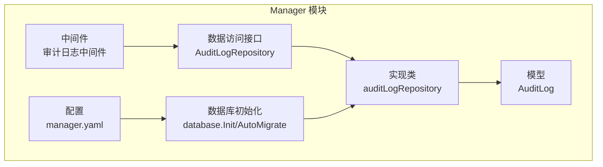
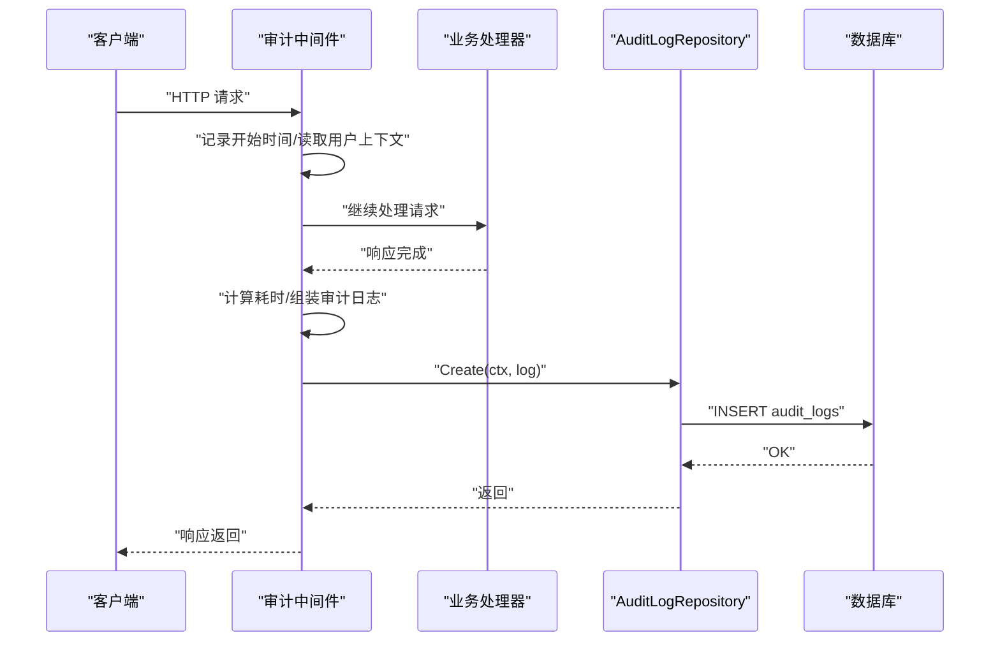
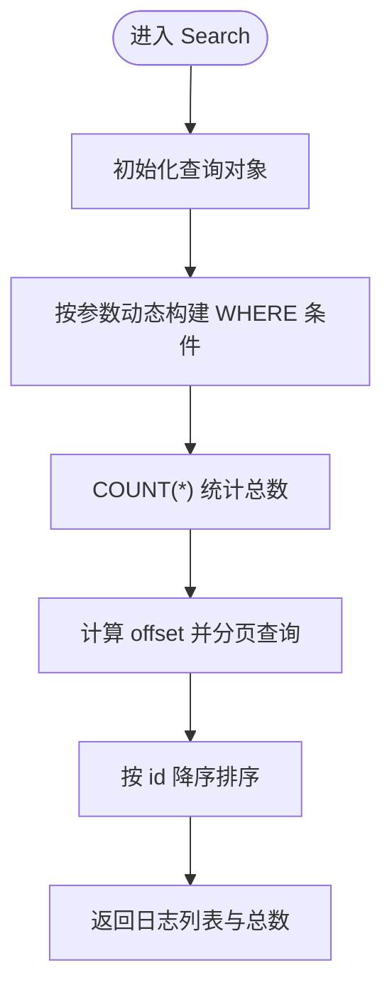
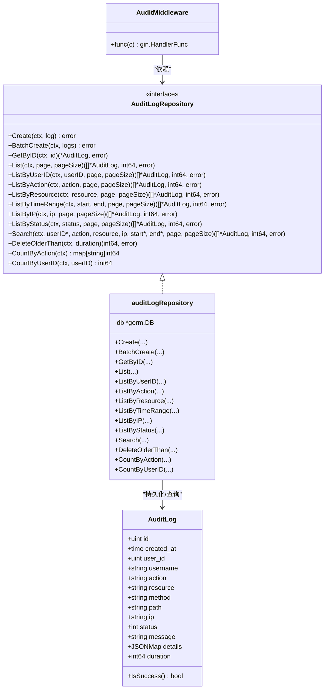

# 审计日志数据访问

<cite>
**本文引用的文件**
- [audit_log.go](file://manager/internal/model/audit_log.go)
- [audit_log.go](file://manager/internal/repository/audit_log.go)
- [audit.go](file://manager/internal/middleware/audit.go)
- [database.go](file://manager/pkg/database/database.go)
- [manager.yaml](file://manager/configs/manager.yaml)
- [auth.go](file://manager/internal/handler/auth.go)
</cite>

## 目录
1. [简介](#简介)
2. [项目结构](#项目结构)
3. [核心组件](#核心组件)
4. [架构总览](#架构总览)
5. [组件详解](#组件详解)
6. [依赖关系分析](#依赖关系分析)
7. [性能与可扩展性](#性能与可扩展性)
8. [故障排查指南](#故障排查指南)
9. [结论](#结论)

## 简介
本文件聚焦于 Manager 模块的审计日志数据访问层，系统化阐述 AuditLogRepository 接口的职责边界与实现细节，覆盖操作日志的记录、查询与安全审计能力；重点解析 Search、ListByTimeRange、CountByAction 等核心方法的实现逻辑与多条件组合查询策略，并给出日志安全存储、高效检索与数据保留策略的建议与依据。

## 项目结构
审计日志数据访问层位于 Manager 子模块内部，采用分层设计：
- 模型层：定义审计日志实体及辅助方法
- 数据访问层：定义并实现 AuditLogRepository 接口
- 中间件层：在请求生命周期内采集审计事件并持久化
- 数据库层：提供 GORM 初始化、自动迁移与连接池配置
- 配置层：提供数据库 DSN、连接池与日志级别等配置项

图表来源
- [audit.go](file://manager/internal/middleware/audit.go#L1-L50)
- [audit_log.go](file://manager/internal/repository/audit_log.go#L1-L41)
- [audit_log.go](file://manager/internal/model/audit_log.go#L1-L37)
- [database.go](file://manager/pkg/database/database.go#L1-L80)
- [manager.yaml](file://manager/configs/manager.yaml#L1-L52)

章节来源
- [audit_log.go](file://manager/internal/model/audit_log.go#L1-L37)
- [audit_log.go](file://manager/internal/repository/audit_log.go#L1-L41)
- [audit.go](file://manager/internal/middleware/audit.go#L1-L50)
- [database.go](file://manager/pkg/database/database.go#L1-L80)
- [manager.yaml](file://manager/configs/manager.yaml#L1-L52)

## 核心组件
- 审计日志模型 AuditLog：描述一次操作的关键属性（用户、动作、资源、方法、路径、IP、状态、消息、详情、耗时）与表名映射、成功判断辅助方法。
- 审计日志仓库接口 AuditLogRepository：定义创建、批量创建、按条件查询、统计与清理等能力。
- 审计日志中间件 Audit：在请求完成后异步采集审计事件并写入数据库。
- 数据库初始化与迁移 database.Init/AutoMigrate：负责连接建立、连接池配置与表结构迁移。
- 配置 manager.yaml：提供数据库 DSN、连接池与日志级别等关键参数。

章节来源
- [audit_log.go](file://manager/internal/model/audit_log.go#L1-L37)
- [audit_log.go](file://manager/internal/repository/audit_log.go#L1-L41)
- [audit.go](file://manager/internal/middleware/audit.go#L1-L50)
- [database.go](file://manager/pkg/database/database.go#L1-L80)
- [manager.yaml](file://manager/configs/manager.yaml#L1-L52)

## 架构总览
审计日志从“采集—持久化—查询—清理”形成闭环：
- 采集：中间件在请求链路尾部读取用户上下文、请求方法、路径、客户端 IP、响应状态码与耗时，构造审计日志对象。
- 持久化：通过 AuditLogRepository 的 Create/BatchCreate 方法写入数据库。
- 查询：提供按用户、动作、资源、IP、时间范围、状态等维度的查询与分页，以及多条件组合查询 Search。
- 统计：提供按动作类型与按用户维度的统计能力。
- 清理：提供按时间阈值删除过期审计日志的能力，作为数据保留策略的一部分。

图表来源
- [audit.go](file://manager/internal/middleware/audit.go#L1-L50)
- [audit_log.go](file://manager/internal/repository/audit_log.go#L53-L61)
- [database.go](file://manager/pkg/database/database.go#L1-L80)

## 组件详解

### AuditLogRepository 接口职责
- 数据写入：Create、BatchCreate
- 数据读取：GetByID、List、ListByUserID、ListByAction、ListByResource、ListByTimeRange、ListByIP、ListByStatus
- 多条件查询：Search（支持用户ID、动作、资源、IP、时间范围）
- 统计：CountByAction、CountByUserID
- 清理：DeleteOlderThan（按时间阈值删除）

章节来源
- [audit_log.go](file://manager/internal/repository/audit_log.go#L11-L41)

### 审计日志模型 AuditLog
- 字段含义：用户标识、用户名冗余便于查询、动作类型、资源标识、HTTP 方法、请求路径、客户端 IP、状态码、消息、详情 JSON、耗时毫秒。
- 表名映射：固定表名为 audit_logs。
- 成功判断：基于状态码区间判断是否成功。

章节来源
- [audit_log.go](file://manager/internal/model/audit_log.go#L1-L37)

### 审计日志中间件 Audit
- 采集时机：请求处理完成后（c.Next() 后）。
- 采集内容：从请求上下文中获取用户 ID，结合请求方法、URL、客户端 IP、响应状态码与耗时构建审计日志。
- 异步落库：使用 goroutine 异步调用仓库 Create，避免阻塞主请求链路。
- 安全前置：若上下文中无用户 ID，则跳过记录，确保匿名请求不产生审计日志。

章节来源
- [audit.go](file://manager/internal/middleware/audit.go#L1-L50)

### 数据库初始化与迁移
- 连接与池：根据配置初始化 GORM，设置连接池最大空闲、最大打开、连接最大存活时间，并进行 Ping 校验。
- 日志级别：根据配置设置 GORM 日志级别。
- 自动迁移：对审计日志表进行自动迁移，兼容约束删除异常场景。
- 全局 DB：初始化后设置全局 DB 实例，供仓库实现使用。

章节来源
- [database.go](file://manager/pkg/database/database.go#L1-L80)
- [database.go](file://manager/pkg/database/database.go#L212-L263)

### Search 多条件组合查询
- 条件构建：按传入的指针或字符串参数动态拼接 WHERE 条件，支持用户 ID、动作、资源、IP、时间范围。
- 总数统计：先对查询条件执行 COUNT 统计总数，再进行分页查询。
- 分页策略：offset = (page-1)*pageSize，排序按主键降序，保证最新记录优先。
- 性能提示：WHERE 条件均为等值匹配，建议在相关列上建立合适索引以提升查询效率。

图表来源
- [audit_log.go](file://manager/internal/repository/audit_log.go#L233-L271)

章节来源
- [audit_log.go](file://manager/internal/repository/audit_log.go#L233-L271)

### ListByTimeRange 时间范围查询
- 条件：created_at 在给定起止时间之间。
- 统计与分页：先 COUNT 再 OFFSET/LIMIT 查询。
- 排序：按 id 降序。

章节来源
- [audit_log.go](file://manager/internal/repository/audit_log.go#L163-L185)

### CountByAction 动作类型统计
- 统计维度：按 action 分组并计数。
- 返回结构：映射 action 到计数值。

章节来源
- [audit_log.go](file://manager/internal/repository/audit_log.go#L284-L308)

### DeleteOlderThan 过期清理
- 清理策略：计算截止时间 cutoff = now - duration，删除 created_at 小于 cutoff 的记录。
- 返回值：受影响行数与错误。

章节来源
- [audit_log.go](file://manager/internal/repository/audit_log.go#L273-L282)

### 安全审计要点
- 仅记录已认证用户的操作：中间件在上下文中缺失用户 ID 时不记录，避免匿名请求污染审计数据。
- 信息最小化：中间件仅采集必要字段（用户、方法、路径、IP、状态、耗时），不直接持久化请求体或响应体。
- 异步落库：避免阻塞请求处理，降低对业务延迟的影响。
- 可追溯性：通过 created_at、id、user_id、action、resource、ip 等字段，满足基本审计追溯需求。

章节来源
- [audit.go](file://manager/internal/middleware/audit.go#L1-L50)

## 依赖关系分析

图表来源
- [audit_log.go](file://manager/internal/model/audit_log.go#L1-L37)
- [audit_log.go](file://manager/internal/repository/audit_log.go#L11-L41)
- [audit_log.go](file://manager/internal/repository/audit_log.go#L43-L321)
- [audit.go](file://manager/internal/middleware/audit.go#L1-L50)

章节来源
- [audit_log.go](file://manager/internal/model/audit_log.go#L1-L37)
- [audit_log.go](file://manager/internal/repository/audit_log.go#L11-L41)
- [audit_log.go](file://manager/internal/repository/audit_log.go#L43-L321)
- [audit.go](file://manager/internal/middleware/audit.go#L1-L50)

## 性能与可扩展性
- 查询性能
  - 分页与排序：统一按 id 降序，有利于热点新数据的快速检索。
  - 统计与分页分离：先 COUNT 再分页，避免一次性扫描全表。
  - 多条件组合：WHERE 条件均为等值匹配，建议在 user_id、action、resource、ip、created_at 上建立复合索引以提升查询效率。
- 写入性能
  - 异步落库：中间件异步调用 Create，降低请求延迟。
  - 批量写入：提供 BatchCreate 接口，适合高并发场景下的批量落库。
- 数据保留与清理
  - DeleteOlderThan 提供按时间阈值的清理能力，建议结合业务合规要求定期执行。
  - 对于超大规模审计数据，可考虑引入分区表策略（如按时间分区）以提升删除与归档效率（当前审计日志表未见分区实现，指标表具备分区清理示例）。
- 连接池与日志
  - database.Init 支持配置连接池参数与 GORM 日志级别，建议在生产环境适当调优以平衡吞吐与可观测性。

章节来源
- [audit_log.go](file://manager/internal/repository/audit_log.go#L53-L61)
- [audit_log.go](file://manager/internal/repository/audit_log.go#L233-L271)
- [audit_log.go](file://manager/internal/repository/audit_log.go#L273-L282)
- [database.go](file://manager/pkg/database/database.go#L1-L80)

## 故障排查指南
- 审计日志未入库
  - 检查中间件是否正确挂载到路由链路。
  - 确认请求上下文中是否存在 user_id，匿名请求不会产生审计日志。
  - 查看数据库连接与迁移是否成功，关注 GORM 日志级别与错误输出。
- 查询结果为空
  - 确认查询条件是否正确（如用户 ID、动作、资源、IP、时间范围）。
  - 检查分页参数 page、pageSize 是否合理。
- 清理未生效
  - 确认 duration 参数是否符合预期，检查系统时间与时区。
  - 观察返回的受影响行数，确认清理执行路径。
- 数据库连接问题
  - 检查 DSN、连接池参数与日志级别配置，确保 Ping 成功。

章节来源
- [audit.go](file://manager/internal/middleware/audit.go#L1-L50)
- [audit_log.go](file://manager/internal/repository/audit_log.go#L273-L282)
- [database.go](file://manager/pkg/database/database.go#L1-L80)
- [manager.yaml](file://manager/configs/manager.yaml#L1-L52)

## 结论
审计日志数据访问层以清晰的接口抽象与简洁的实现，提供了从采集、持久化、查询到清理的完整能力。通过异步落库与多条件组合查询，兼顾了性能与可用性；配合合理的索引与连接池配置，可在高并发场景下稳定支撑安全审计需求。对于超大规模数据，建议结合业务合规要求引入分区策略与更细粒度的数据保留策略，持续优化检索与维护成本。